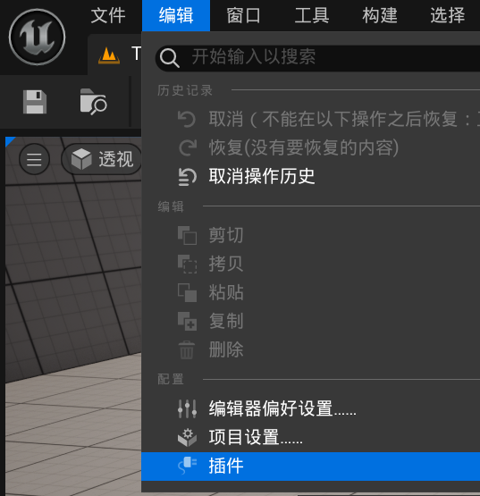
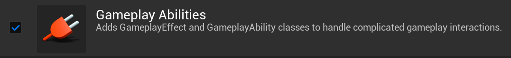

[TOC]

# GAS工程创建操作指北

## 前言

本文所介绍的内容大多在`C++`项目工程下进行，如果为纯蓝图工程可能有所出入。

文中部分专有名词为缩略写法，详见**常用术语缩略**。

本文不会过多解释`GAS`相关内容的理论知识，重在描述如何快速搭建相关功能、创建相关组件，迅速实现功能的编写。

本文不考虑`GAS`网络相关内容，默认为单机工程。

## 开启GAS插件

通过虚幻编辑器的**插件浏览器**找到`GAS`插件并启动。





勾选上图所示插件即可启动我们所说的`GAS`，虚幻编辑器应该会弹出一个更新`.uproject`文件的提示，选择更新即可，更新的内容其实就是将`GAS`插件设置为开启状态。

## 为模块添加插件

开启了`GAS`插件之后，我们并不能直接在C++类中添加相关头文件开始编写`GAS`代码。

在需要使用`GAS`相关功能的模块的`.Build.cs`文件中更改代码如下所示。

```C++
using UnrealBuildTool;

public class GASTestDemo : ModuleRules
{
	public GASTestDemo(ReadOnlyTargetRules Target) : base(Target)
	{
		PCHUsage = PCHUsageMode.UseExplicitOrSharedPCHs;

		PublicDependencyModuleNames.AddRange(new string[] {
			"Core",
			"CoreUObject",
			"Engine",
			"InputCore",
			"EnhancedInput"
		});

		PrivateDependencyModuleNames.AddRange(new string[] {
            "GameplayAbilities",
            "GameplayTags"          // GAS 标签系统模块（可选，若用 GameplayTag）
        });

	}
}
```

在该模块中添加`GameplayAbilities`模块、`GameplayTags`模块，这里两个模块是`GAS`插件中较为常用的模块，其中`GameplayAbilities`模块是我们接下来为角色添加`AbilitySystemComponent`组件等其它组件的基础。此处我将模块添加到了私有依赖中，这不是必须项，只是我的个人选择，你也可以写在共有依赖中。

## 为Character添加ASC组件

### 添加ASC组件

在需要添加`ASC`的`Character`头文件中添加头文件。

```C++
#include "AbilitySystemComponent.h"   // GAS 核心组件头文件
```

添加`ASC`指针。

```C++
// --------------------------
// 标记为 VisibleAnywhere：编辑器中可见但不可修改
// 标记为 BlueprintReadOnly：蓝图可读取但不可修改
// 标记为 Category = "GAS"：归类到 GAS 分组
UPROPERTY(VisibleAnywhere, BlueprintReadOnly, Category = "GAS", meta = (AllowPrivateAccess = "true"))
UAbilitySystemComponent* AbilitySystemComponent;
```

在构造函数中添加实例化`ASC`的代码。

```C++
AbilitySystemComponent = CreateDefaultSubobject<UAbilitySystemComponent>(TEXT("AbilitySystemComponent"));
```

### 重写GetAbilitySystemComponent()函数。

添加头文件。

```C++
#include "AbilitySystemInterface.h"
```

让当前类继承`IAbilitySystemInterface`接口，类似下列所示代码。

```C++
class AGASTestDemoCharacter : public ACharacter , public IAbilitySystemInterface
{
	GENERATED_BODY()    
	//...此处省略
};
```

实现接口中的函数，也就是重写`GetAbilitySystemComponent()`函数。

```C++
// --------------------------
// 关键：获取 ASC 的接口（供外部调用，如技能系统）
// --------------------------
UFUNCTION(BlueprintCallable, Category = "GAS")
UAbilitySystemComponent* GetAbilitySystemComponent() const override;
```

在`CPP`文件中的具体实现如下：

```C++
UAbilitySystemComponent* AGASTestDemoCharacter::GetAbilitySystemComponent() const
{
    //这里返回的就是我们前面在构造函数中实例化的ASC组件
	return AbilitySystemComponent;
}
```

### 初始化ASC组件

我们知道`ASC`需要初始化它的`OwnerActor`和`AvatarActor`，初始化操作需要使用到：

```C++
AbilitySystemComponent->InitAbilityActorInfo(OwnerActor*, AvatarActor*);
```

初始化时机最好把握在使用`ASC`相关核心功能之前，如释放GA。

可以写在`BeginPlay()`函数中，但是我这里重写了父类`Pawn`中的`PossessedBy`函数，并在其基础上添加初始化`ASC`的代码。

```C++
virtual void PossessedBy(AController* NewController) override;
```

在`CPP`文件中的具体实现如下：

```C++
void AGASTestDemoCharacter::PossessedBy(AController* NewController)
{
	Super::PossessedBy(NewController);

	if (AbilitySystemComponent)
	{
		AbilitySystemComponent->InitAbilityActorInfo(this, this);
	}

	SetOwner(NewController);
}
```

**补充**：

我们知道上述`PossessedBy`函数的函数体是`ASC`存在于`Character`上的情况。还有一种情况是我们的`ASC`存在于`PlayState`上，那么此时在`Character`中重写的这个`PossessedBy`函数的实现方式如下：

```C++
void AGASTestDemoCharacter::PossessedBy(AController * NewController)
{
	Super::PossessedBy(NewController);

	AGDPlayerState* PS = GetPlayerState<AGDPlayerState>();
	if (PS)
	{
		AbilitySystemComponent = Cast<UGDAbilitySystemComponent>(PS->GetAbilitySystemComponent());

		// 人工智能不会有玩家控制器，所以我们可以在这里再次初始化以确保安全。对于有玩家控制器的英雄来说，初始化两次也没有坏处。
		PS->GetAbilitySystemComponent()->InitAbilityActorInfo(PS, this);
	}
    
	SetOwner(NewController);
	//...
}
```

# 常用术语缩略

|                术语                |        缩略         |
| :--------------------------------: | :-----------------: |
|       AbilitySystemComponent       |         ASC         |
|            AbilityTask             |         AT          |
| Action RPG Sample Project by Epic  |  ARPG, ARPG Sample  |
|     CharacterMovementComponent     |         CMC         |
|          GameplayAbility           |         GA          |
|       GameplayAbilitySystem        |         GAS         |
|            GameplayCue             |         GC          |
|           GameplayEffect           |         GE          |
| GameplayEffectExecutionCalculation | ExecCalc, Execution |
|            GameplayTag             |       Tag, GT       |
|    ModiferMagnitudeCalculation     |   ModMagCalc, MMC   |