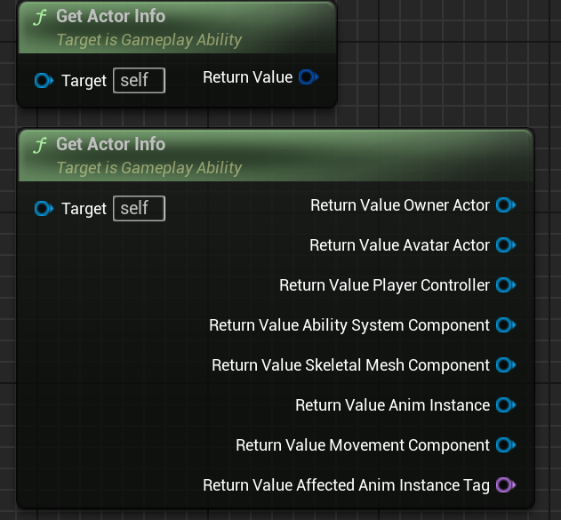
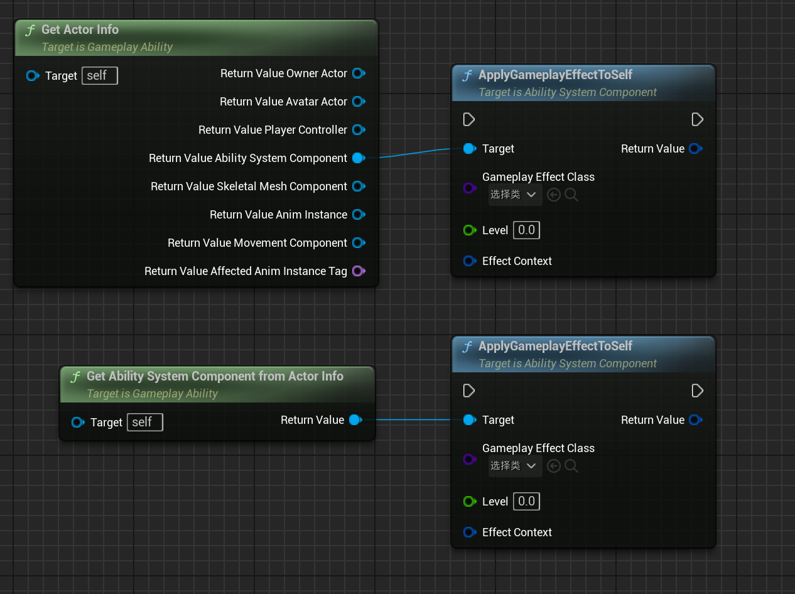
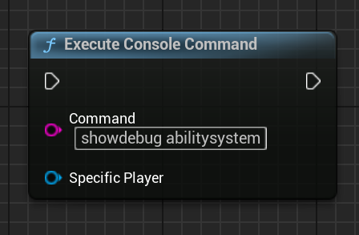
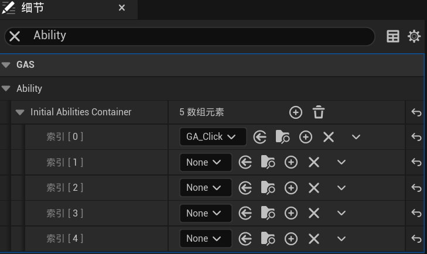

[TOC]

# GAS经验积累

## GA蓝图中获取Actor相关信息

需要使用到`Get Actor Info`蓝图节点，如下图所示。



分割结构体引脚之后，可以通过该节点获取到该`GA`的`OwnerActor`、`AvatarActor`、控制器、`ASC`组件等有关`GA`的`OwnerActor`的信息。

### 举例

比如现在需要触发回血技能，回血需要对自己施加`GE`效果，在蓝图中就可以使用如下节点应用`GE`。



第二种节点本质上还是第一种节点的使用，只不过方便操作，并且只获取到了`Actor Info`中的`ASC`组件，比较简洁。

# GAS自制轮子

## 输出AttributeSet所有属性值（非GAS原生）

### 使用须知

如果你不知道其它快速查看角色属性的方法并准备使用该轮子，我推荐你在蓝图中或运行游戏之后运行下图所示节点或节点中的命令。



上图所示命令只能查看玩家当前控制的角色的属性等其它`ASC`信息，如果你希望方便的查看玩家没有控制的角色属性信息，可以尝试使用本轮子。

本轮子可以在`GAS`框架中输出`ASC`下指定`AttributeSet`的所有属性值，包括属性名、BaseValue、CurrentValue。

建议了解`FGameplayAttribute`、`FGameplayAttributeData`的结构与基本关系后使用。

### 代码

代码所示函数编写在了`Character`中，这是因为`ASC`选择添加到`Character`。如果你的`ASC`在`PlayerState`中那么代码所示函数应当编写在`PlayerState`中，总之就是在`ASC`所在`Actor`处添加该函数即可。

#### 函数声明：

```C++
// 输出ASC下AttributeSet所有属性值（包括属性名、BaseValue、CurrentValue）
// 参数解释：
// 1、Src：AttributeSet指针，决定输出哪一个属性集的属性值
// 2、TimeToDisplay：调式信息的输出时间
// 3、DisplayColor：调试信息输出颜色
// 使用方式：
// 法一：子类可以封装或重写该函数暴露到蓝图使用
// 法二：直接在蓝图中使用该函数，但是需要使用ASC获取AttributeSet并传参到本函数
UFUNCTION(BlueprintCallable, Category = "Print")
virtual void PrintAS(UAttributeSet* Src , float TimeToDisplay = 5.0f , FColor DisplayColor = FColor::Yellow);
```

#### 函数定义

```C++
void ACSCharacterBase::PrintAS(UAttributeSet* Src , float TimeToDisplay, FColor DisplayColor)
{
	// 检测ASC
	if (ASC == nullptr)
	{
		UE_LOG(LogTemp, Warning, TEXT("PrintAS函数：ASC为空"));
		return;
	}

	// 检测Src
	if (Src == nullptr)
	{
		UE_LOG(LogTemp, Warning, TEXT("PrintAS函数：Src为空"));
		return;
	}

	// 获取ASC下所有属性
	TArray<FGameplayAttribute> PrintAttributeArray;
	ASC->GetAllAttributes(PrintAttributeArray);

	// 输出属性值的循环语句
	for (int32 index = 0 ; index < PrintAttributeArray.Num() ; ++index)
	{
		// 过滤非Src的属性
		FGameplayAttributeData* TempData = PrintAttributeArray[index].GetGameplayAttributeData(Src);

		// 如果属性为空则跳出循环
		if (TempData == nullptr)
		{
			break;
		}

		// 编写输出属性名、BaseValue、CurrentValue格式字符串
		FString PrintStr = FString::Printf(
			TEXT("%s-----BaseValue: %f | CurrentValue: %f"), 
			*PrintAttributeArray[index].AttributeName , 
			TempData->GetBaseValue(), 
			TempData->GetCurrentValue()
		);

		// 打印调试信息到屏幕
		GEngine->AddOnScreenDebugMessage(index, 5.0, FColor::Yellow, PrintStr);
	}
}
```

## 简化初始技能的配置与授予（非GAS原生）

### 使用须知

本节代码需要用到`ASC`组件且`ASC`组件存在于`Character`中，因此函数中可以直接使用`ASC`。

如果你的`ASC`不在`Character`中，可能需要修改部分代码。

### 代码

核心原理：在角色类中添加初始能力容器。

```C++
// 玩家初始能力容器
UPROPERTY(EditAnywhere, BlueprintReadOnly, Category = "GAS|Ability" , meta = (AllowPrivateAccess = "true"))
TArray<TSubclassOf<UCSGameplayAbilityBase>> InitialAbilitiesContainer;
// 这里UCSGameplayAbilityBase是项目的自定义GA基类，继承自UGameplayAbility
// 如果你没有类似需求，可以改为UGameplayAbility
```

添加了上述容器之后即可在角色蓝图中轻松配置角色初始具备的技能，如下图所示。



虽然配置了需要初始化的技能类型，但是还需要编写授予技能的代码。

```C++
/****************函数声明****************/

// 授予角色初始技能
UFUNCTION(BlueprintCallable, Category = "GAS|Ability")
virtual bool InitializeAbilities() const;

/****************函数定义****************/

bool ACSPlayerCharacter::InitializeAbilities() const
{
	if (ASC == nullptr)
	{
        // LogCSGA为自定义日志类型
		UE_LOG(LogCSGA, Warning, TEXT("玩家角色的ASC为空"));
		return false;
	}

	if (InitialAbilitiesContainer.Num() <= 0)
	{
		UE_LOG(LogCSGA, Warning, TEXT("玩家角色的初始能力容器为空"));
		return false;
	}
	///////////////////////////////////
    // 重点关注
	///////////////////////////////////
    for (TSubclassOf<UCSGameplayAbilityBase> tempAbility : InitialAbilitiesContainer)
	{
		// 创建能力实例
		FGameplayAbilitySpec AbilitySpec(tempAbility, 1);
		// 授予能力
		ASC->GiveAbility(AbilitySpec);

		//输出角色获取的初始能力日志
		UE_LOG(LogCSGA, Log, TEXT("成功授予初始技能：%s"), *tempAbility->GetName());
	}

	return true;
}
```
