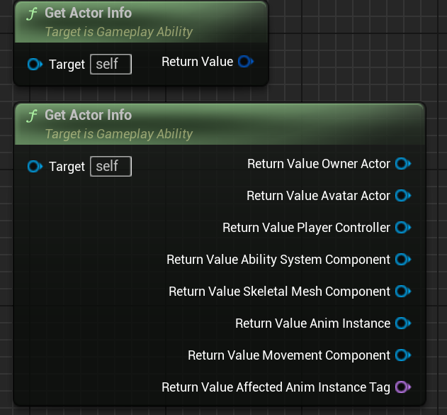
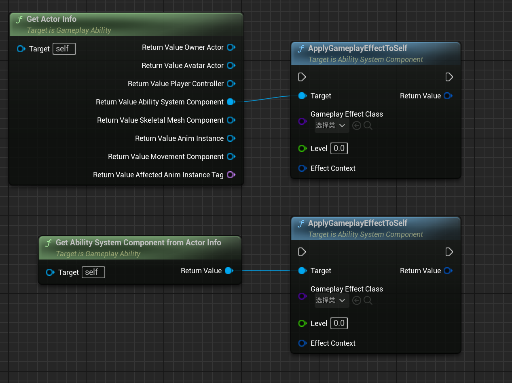
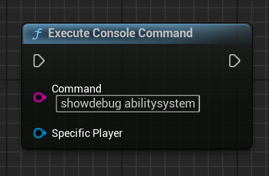
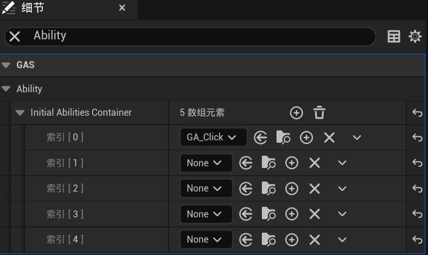

[TOC]

# GAS经验积累

## GAS中Attribute、GA、GE的变换形态

变换形态，这里用了一个不太恰当的描述。我想总结的是它们在`GAS`的数据转递过程中都会转变成什么样的类型，从而较为清晰的知道各个类之间是怎样的关系。

### Attribute

说起`Attribute`（属性），我们知道通常它与角色的属性有关，而角色的属性一般会存放在`AttributeSet`（属性集）中。

在`AttributeSet`（属性集）中，定义属性需要用到`FGameplayAttributeData`类，该类最重要的点就是具有`BaseValue`和`CurrentValue`。

```C++
UPROPERTY(BlueprintReadOnly, Category = "Health")
FGameplayAttributeData Health; // 这里定义Healeh属性
ATTRIBUTE_ACCESSORS(UCSAttributeSetBase, Health); //这个宏很重要

// 在该头文件的前面加上下面的代码即可使用上述宏
// 这里的宏主要用于帮我们自动生成各个属性的相关Get、Set函数
// 需要在声明的每个属性下面使用该宏
#define ATTRIBUTE_ACCESSORS(ClassName, PropertyName) \
GAMEPLAYATTRIBUTE_PROPERTY_GETTER(ClassName, PropertyName) \
GAMEPLAYATTRIBUTE_VALUE_GETTER(PropertyName) \
GAMEPLAYATTRIBUTE_VALUE_SETTER(PropertyName) \
GAMEPLAYATTRIBUTE_VALUE_INITTER(PropertyName)
```

当定义了众多属性的`AttributeSet`挂载到`ASC`上之后，要想获取所有的属性，需要：

```C++
// 获取ASC下所有属性
TArray<FGameplayAttribute> PrintAttributeArray;
ASC->GetAllAttributes(PrintAttributeArray); 
// 这里Get函数引用赋值给PrintAttributeArray所以不是返回值接收
```

注意到这时数组中的元素是`FGameplayAttribute`，不是`FGameplayAttributeData`。

如果希望拿到`FGameplayAttributeData`，需要：

```C++
FGameplayAttribute MyAttribute; // 假设这是我从上面单独拿出来的一个属性
FGameplayAttributeData* MyAttributeData = MyAttribute->GetGameplayAttributeData(UAttributeSet*);
// 函数参数中还需要一个AttributeSet*即属性集指针
// 也就是定义MyAttribute这个属性的属性集指针
// 注意MyAttributeData也是一个指针
```

之后想要获取具体的属性值，只需要调用`FGameplayAttributeData`的函数即可。

```C++
FGameplayAttributeData* MyAttributeData;
float XXXBaseValue = MyAttributeData->GetBaseValue();
float XXXCurrentValue = MyAttributeData->GetCurrentValue();
```

当然这样获取数值比较麻烦，如果你非常清楚你需要获取哪一个`Attribute`。可以直接使用`AttributeSet`。

```C++
// 如果你的角色没有维护一个属性集，通过ASC获取即可。
UAttributeSet* AS = ASC->GetAttributeSet(/*传入属性集的类*/);
// 以之前定义的Health属性为例
// GetHealth()可以直接获得CurrentValue值
float HealthValue = PlayerAS->GetHealth(); 
// GetHealthAttribute()获得属性的FGameplayAttribute
FGameplayAttribute HealthAttribute = PlayerAS->GetHealthAttribute();
// 如果你获得的是HealthAttribute，之后获取值的方式就是拿到它的Data类
// 这样可以获得到该属性的BaseValue和CurrentValue
auto a = HealthAttribute.GetGameplayAttributeData(UAttributeSet*);
float HealthBaseValue = a->GetBaseValue();
float HealthCurrentValue = a->GetCurrentValue();
// 或者直接使用下面的函数，但是获取到的是CurrentValue
float b = HealthAttribute.GetNumericValue(UAttributeSet*);
```

总结一下常用的这些：

```tex
UAttributeSet
↓--->任意属性CurrentValue
↓
↓--->任意属性FGameplayAttribute
		↓--->该属性CurrentValue
		↓
		↓--->该属性FGameplayAttributeData
				↓--->该属性BaseValue
				↓
				↓--->该属性CurrentValue
```

**钩子**

我们常常需要监听某个属性的变化，从而执行相关代码。

最常用的就是`ASC->GetGameplayAttributeValueChangeDelegate`函数。

```C++
// 假设从属性集AS获取Health属性的Attribute
FGameplayAttribute HealthAttribute = AS->GetHealthAttribute();
// 参数列表中传入需要监听的属性的Attribute
ASC->GetGameplayAttributeValueChangeDelegate(HealthAttribute)
    .AddUObject(this , &XXXCharacter::OnHealthChangeDelegate);
// 之后链式编程直接添加需要绑定的函数
// 这里我们假设绑定的是该类的OnHealthChangeDelegate
void XXXCharacter::OnHealthChangeDelegate();
```

绑定完毕之后，运行时如果Health属性值发生变化，那么就会触发`OnHealthChangeDelegate()`函数执行。把我们自己的代码写在这个函数里即可。

除此之外，GAS还允许我们在属性修改前/后，注入自己的逻辑，通常用来限制或检查某些属性的数值范围是否合理。

具体就是一下六个函数，`UAttributeSet`类的源码，其中`Pre`开头就是之前，`Post`开头就是之后。

```C++
/**
	Called just before modifying the value of an attribute. AttributeSet can make additional modifications here. Return true to continue, or false to throw out the modification.
	Note this is only called during an 'execute'. E.g., a modification to the 'base value' of an attribute. It is not called during an application of a GameplayEffect, such as a 5 ssecond +10 movement speed buff.
 
	在修改属性值之前调用。AttributeSet 可以在此处进行额外修改。返回 true 以继续，返回 false 以放弃修改。
	注意，Instant类的GE修改属性可以触发，Duration类的GE不会（包括Infinite）比如 5 秒 +10 移动速度的增益效果。
 */	
virtual bool PreGameplayEffectExecute(struct FGameplayEffectModCallbackData &Data) { return true; }

/**
 *	Called just after a GameplayEffect is executed to modify the base value of an attribute. No more changes can be made.
 *	Note this is only called during an 'execute'. E.g., a modification to the 'base value' of an attribute. It is not called during an application of a GameplayEffect, such as a 5 ssecond +10 movement speed buff.
	在游戏效果执行后立即调用，用于修改属性的基础值。不能再进行更多更改。
	请注意，Instant类的GE修改属性可以触发，Duration类的GE不会（包括Infinite）比如一个持续5秒的+10移动速度增益效果。
 */
virtual void PostGameplayEffectExecute(const struct FGameplayEffectModCallbackData &Data) { }

/**
 *	An "On Aggregator Change" type of event could go here, and that could be called when active gameplay effects are added or removed to an attribute aggregator.
 *	It is difficult to give all the information in these cases though - aggregators can change for many reasons: being added, being removed, being modified, having a modifier change, immunity, stacking rules, etc.
	一种“聚合器变更时”类型的事件可以放在这里，当活跃的游戏玩法效果被添加到属性聚合器或从属性聚合器中移除时，就可以调用该事件。
	不过，在这些情况下很难提供所有信息——聚合器可能会因多种原因发生变化：被添加、被移除、被修改、修饰符发生变化、具有免疫力、堆叠规则等等。
 */

/**
 *	Called just before any modification happens to an attribute. This is lower level than PreAttributeModify/PostAttribute modify.
 *	There is no additional context provided here since anything can trigger this. Executed effects, duration based effects, effects being removed, immunity being applied, stacking rules changing, etc.
 *	This function is meant to enforce things like "Health = Clamp(Health, 0, MaxHealth)" and NOT things like "trigger this extra thing if damage is applied, etc".
 *	
 *	NewValue is a mutable reference so you are able to clamp the newly applied value as well.
 
 	在对属性进行任何修改之前调用。这比PreAttributeModify/PostAttributeModify的层级更低。
 	这里没有提供额外的上下文，因为任何事情都可能触发这个。已执行的效果、基于持续时间的效果、正在被移除的效果、正在应用的免疫效果、堆叠规则的变更等等。
 	此函数旨在执行诸如“生命值 = 限制（生命值，0，最大生命值）”之类的操作，而不是执行诸如“如果受到伤害则触发这个额外事件等”之类的操作。
 	NewValue 是一个可变引用，因此你也能够限定新应用的值。
 */
virtual void PreAttributeChange(const FGameplayAttribute& Attribute, float& NewValue) { }

/** Called just after any modification happens to an attribute.*/
/* 在属性发生任何修改后立即被调用。*/
virtual void PostAttributeChange(const FGameplayAttribute& Attribute, float OldValue, float NewValue) { }

/**
 *	This is called just before any modification happens to an attribute's base value when an attribute aggregator exists.
 *	This function should enforce clamping (presuming you wish to clamp the base value along with the final value in PreAttributeChange)
 *	This function should NOT invoke gameplay related events or callbacks. Do those in PreAttributeChange() which will be called prior to the
 *	final value of the attribute actually changing.
 	
 	当存在属性聚合器时，在对属性的基值进行任何修改之前，会调用此方法。
 	此函数应实施钳位操作（假设你希望在PreAttributeChange中连同最终值一起钳位基础值）
 	此函数不应调用与游戏玩法相关的事件或回调。应在PreAttributeChange()中执行这些操作，该函数将在之前被调用。
 	属性的最终值确实发生了变化。
 */
virtual void PreAttributeBaseChange(const FGameplayAttribute& Attribute, float& NewValue) const { }

/** Called just after any modification happens to an attribute's base value when an attribute aggregator exists. */
/* 当存在属性聚合器时，在属性的基值发生任何修改后立即调用。 */
virtual void PostAttributeBaseChange(const FGameplayAttribute& Attribute, float OldValue, float NewValue) const { }
```

在我们的自定义属性集类中重写这些函数并加入自己的代码即可。

### GA

`UGameplayAbility`，提到`GA`，不得不想到`ASC->GiveAbility()`。

如果我们希望通过`ASC->GiveAbility()`授予`ASC`技能，首先需要将`GA`实例化，从类型上看就是`UGameplayAbility`过渡到`FGameplayAbilitySpec`。

常用的实例化构造函数就是下面两个（来自源码）。

参数很多，其它暂时不重要，只看第一个，我们可以通过`TSubclassOf<UGameplayAbility>`和`UGameplayAbility*`两种类型获得到`GA`的实例。

```C++
FGameplayAbilitySpec(TSubclassOf<UGameplayAbility> InAbilityClass, int32 InLevel = 1, int32 InInputID = INDEX_NONE, UObject* InSourceObject = nullptr);

FGameplayAbilitySpec(UGameplayAbility* InAbility, int32 InLevel = 1, int32 InInputID = INDEX_NONE, UObject* InSourceObject = nullptr);
```

下面就是授予能力。

```C++
TSubclassOf<UGameplayAbility> AbilityClass = /*...获取GA类型...*/;
UGameplayAbility* Ability = /*...获取GA指针...*/
// 创建能力实例
FGameplayAbilitySpec AbilitySpec(AbilityClass);
// 或者
FGameplayAbilitySpec AbilitySpec(Ability);
// 授予能力
ASC->GiveAbility(AbilitySpec);
```

授予能力的函数当场会返回给我们一个句柄，类型是：`FGameplayAbilitySpecHandle`。

这个句柄可以直接用于激活句柄对应的技能

```C++
// 拿到句柄
FGameplayAbilitySpecHandle SpecHandle = ASC->GiveAbility(AbilitySpec);
// 激活技能的函数之一，传入句柄激活技能
ASC->TryActivateAbility(SpecHandle);
```

总结一下就是`UGameplayAbility--->FGameplayAbilitySpec--->FGameplayAbilitySpecHandle`。

有时候技能也不是授予后立刻需要激活的，`ASC->GiveAbility(AbilitySpec)`之后，如果我们没有使用它返回的`Handle`也没关系，使用`ASC->GetAllAbilities();`可以拿到所有被授予的`GA`句柄。下面是源码中函数的介绍。

```C++
/**
 * Returns an array with all granted ability handles
 * NOTE: currently this doesn't include abilities that are mid-activation
 * 
 * @param OutAbilityHandles This array will be filled with the granted Ability Spec Handles
 */
UFUNCTION(BlueprintCallable, BlueprintPure = false, Category = "Gameplay Abilities")
void GetAllAbilities(TArray<FGameplayAbilitySpecHandle>& OutAbilityHandles) const;
```

注意我们需要有一个`TArray<FGameplayAbilitySpecHandle>`类型的数组传入函数从而拿到所有的`GA`句柄。

除了可以通过`ASC`获取所有已授予的`GA`的句柄之外，还可以获取它们的实例。

```C++
TArray<FGameplayAbilitySpec> AbilitySpecArray;
AbilitySpecArray = ASC->GetActivatableAbilities();
```

有时还可以通过句柄查找其对应的`GA`实例，使用`ASC->FindAbilitySpecFromHandle`。

```C++
// 句柄
FGameplayAbilitySpecHandle AbilitySpecHandle;
// Spec指针拿到函数返回值
FGameplayAbilitySpec* AbilitySpec = ASC->FindAbilitySpecFromHandle(AbilitySpecHandle);
```

`GA`的实例中包含着许多关键变量，比如用于标识`GA`自身的Tag容器。

```C++
FGameplayAbilitySpec* AbilitySpec;
AbilitySpec->Ability->AbilityTags;
// 这里的AbilityTags就是一个FGameplayTagContainer
// 我们可以把它当作数组使用
// 其它的东西就不一一介绍了。
```

### GE

`UGameplayEffect`如果没有特殊的需求，一般都会在虚幻编辑器中继承该类并在蓝图中配置它的参数。这里不说怎么配置参数，说一说`GE`的应用。

通常在`GA`中应用`GE`使用`ASC`的`ApplyGameplayEffectSpecToSelf`或`ApplyGameplayEffectSpecToTarget`。蓝图中有同名函数，不过在代码中它们不同名。

下面是源码中的函数声明。

```C++
/** Applies a previously created gameplay effect spec to a target */
UFUNCTION(BlueprintCallable, Category = GameplayEffects, meta = (DisplayName = "ApplyGameplayEffectSpecToTarget", ScriptName = "ApplyGameplayEffectSpecToTarget"))
FActiveGameplayEffectHandle BP_ApplyGameplayEffectSpecToTarget(const FGameplayEffectSpecHandle& SpecHandle, UAbilitySystemComponent* Target);

virtual FActiveGameplayEffectHandle ApplyGameplayEffectSpecToTarget(const FGameplayEffectSpec& GameplayEffect, UAbilitySystemComponent *Target, FPredictionKey PredictionKey=FPredictionKey());

/** Applies a previously created gameplay effect spec to this component */
UFUNCTION(BlueprintCallable, Category = GameplayEffects, meta = (DisplayName = "ApplyGameplayEffectSpecToSelf", ScriptName = "ApplyGameplayEffectSpecToSelf"))
FActiveGameplayEffectHandle BP_ApplyGameplayEffectSpecToSelf(const FGameplayEffectSpecHandle& SpecHandle);

virtual FActiveGameplayEffectHandle ApplyGameplayEffectSpecToSelf(const FGameplayEffectSpec& GameplayEffect, FPredictionKey PredictionKey = FPredictionKey());
```

以`ApplyGameplayEffectSpecToSelf`为例，在应用`GE`之前很多时候我们需要将它实例化。

```C++
// 假设我们拥有某个GE类
TSubclassOf<UGameplayEffect> GEClass = /*...*/;
// 构建GE上下文，这个上下文需要作为参数用于实例化
FGameplayEffectContextHandle EffectContext = TargetASC->MakeEffectContext();
// 将GA添加到GE上下文中作为源对象
EffectContext.AddSourceObject(this);
// 拿到了GE句柄
FGameplayEffectSpecHandle NewHandle = TargetASC->MakeOutgoingSpec(GEClass, Level, EffectContext);
// 应用GE
TargetASC->ApplyGameplayEffectSpecToSelf(*NewHandle.Data);
// 其中NewHandle.Data的类型是TSharedPtr<FGameplayEffectSpec>
```

总结一下，`GE`与`GA`有些类似，`UGameplayEffect--->FGameplayEffectSpec--->FGameplayEffectSpecHandle`。

## GA蓝图中获取Actor相关信息

需要使用到`Get Actor Info`蓝图节点，如下图所示。



分割结构体引脚之后，可以通过该节点获取到该`GA`的`OwnerActor`、`AvatarActor`、控制器、`ASC`组件等有关`GA`的`OwnerActor`的信息。

### 举例

比如现在需要触发回血技能，回血需要对自己施加`GE`效果，在蓝图中就可以使用如下节点应用`GE`。



第二种节点本质上还是第一种节点的使用，只不过方便操作，并且只获取到了`Actor Info`中的`ASC`组件，比较简洁。

## 绑定Attribute属性变化回调

主要使用`ASC->GetGameplayAttributeValueChangeDelegate(FGameplayAttribute& Attribute);`

该函数返回参数`Attribute`变化之后会触发的**委托**，所以之后链式编程将需要绑定的函数绑在返回的委托上即可。

### 举例：

```C++
// 接受委托广播的函数，可以写在ASC的OwnerActor类里面
// 函数名随意
void AYYYCharacter::OnXXXAttributeChangeDelegate();

// 在ASC的OwnerActor类的BeginPlay函数中绑定
// 理论上只要是委托触发之前，在哪里都可以绑定。
void AYYYCharacter::BeginPlay()
{
    Super::BeginPlay();
    
    // 绑定OnXXXAttributeChangeDelegate()函数
    // 不管什么方式，先获得到属性的Attribute
    FGameplayAttribute XXXAttribute = PlayerAttributeSet->GetXXXAttribute();
    // 之后调用下面这个关键的函数，写一行太长，写两行。
    ASC->GetGameplayAttributeValueChangeDelegate(XXXAttribute)
        .AddUObject(this , &AYYYCharacter::OnXXXAttributeChangeDelegate);
    // 到此绑定完毕，之后XXXAttribute属性数值变化时就会执行函数
    // 关于属性变化，最好使用GAS提供的修改属性的接口
    // 比如GE的Modifier，ASC->SetNumericAttributeBase()等 
}

```

需要注意的是：不能在有`Const`标记的函数中尝试绑定属性的委托。

例子中使用的是`BeginPlay()`没有`Const`，如果需要通过自定义函数执行`ASC->GetGameplayAttributeValueChangeDelegate`函数，那么该自定义函数不能是`Const`的。


# GAS自制轮子

## 输出AttributeSet所有属性值（非GAS原生）

### 使用须知

如果你不知道其它快速查看角色属性的方法并准备使用该轮子，我推荐你在蓝图中或运行游戏之后运行下图所示节点或节点中的命令。



上图所示命令只能查看玩家当前控制的角色的属性等其它`ASC`信息，如果你希望方便的查看玩家没有控制的角色属性信息，可以尝试使用本轮子。

本轮子可以在`GAS`框架中输出`ASC`下指定`AttributeSet`的所有属性值，包括属性名、BaseValue、CurrentValue。

建议了解`FGameplayAttribute`、`FGameplayAttributeData`的结构与基本关系后使用。

### 代码

代码所示函数编写在了`Character`中，这是因为`ASC`选择添加到`Character`。如果你的`ASC`在`PlayerState`中那么代码所示函数应当编写在`PlayerState`中，总之就是在`ASC`所在`Actor`处添加该函数即可。

#### 函数声明：

```C++
// 输出ASC下AttributeSet所有属性值（包括属性名、BaseValue、CurrentValue）
// 参数解释：
// 1、Src：AttributeSet指针，决定输出哪一个属性集的属性值
// 2、TimeToDisplay：调式信息的输出时间
// 3、DisplayColor：调试信息输出颜色
// 使用方式：
// 法一：子类可以封装或重写该函数暴露到蓝图使用
// 法二：直接在蓝图中使用该函数，但是需要使用ASC获取AttributeSet并传参到本函数
UFUNCTION(BlueprintCallable, Category = "Print")
virtual void PrintAS(UAttributeSet* Src , float TimeToDisplay = 5.0f , FColor DisplayColor = FColor::Yellow);
```

#### 函数定义

```C++
void ACSCharacterBase::PrintAS(UAttributeSet* Src , float TimeToDisplay, FColor DisplayColor)
{
	// 检测ASC
	if (ASC == nullptr)
	{
		UE_LOG(LogTemp, Warning, TEXT("PrintAS函数：ASC为空"));
		return;
	}

	// 检测Src
	if (Src == nullptr)
	{
		UE_LOG(LogTemp, Warning, TEXT("PrintAS函数：Src为空"));
		return;
	}

	// 获取ASC下所有属性
	TArray<FGameplayAttribute> PrintAttributeArray;
	ASC->GetAllAttributes(PrintAttributeArray);

	// 输出属性值的循环语句
	for (int32 index = 0 ; index < PrintAttributeArray.Num() ; ++index)
	{
		// 过滤非Src的属性
		FGameplayAttributeData* TempData = PrintAttributeArray[index].GetGameplayAttributeData(Src);

		// 如果属性为空则跳出循环
		if (TempData == nullptr)
		{
			break;
		}

		// 编写输出属性名、BaseValue、CurrentValue格式字符串
		FString PrintStr = FString::Printf(
			TEXT("%s-----BaseValue: %f | CurrentValue: %f"), 
			*PrintAttributeArray[index].AttributeName , 
			TempData->GetBaseValue(), 
			TempData->GetCurrentValue()
		);

		// 打印调试信息到屏幕
		GEngine->AddOnScreenDebugMessage(index, 5.0, FColor::Yellow, PrintStr);
	}
}
```

## 简化初始技能的配置与授予（非GAS原生）

### 使用须知

本节代码需要用到`ASC`组件且`ASC`组件存在于`Character`中，因此函数中可以直接使用`ASC`。

如果你的`ASC`不在`Character`中，可能需要修改部分代码。

### 代码

核心原理：在角色类中添加初始能力容器。

```C++
// 玩家初始能力容器
UPROPERTY(EditAnywhere, BlueprintReadOnly, Category = "GAS|Ability" , meta = (AllowPrivateAccess = "true"))
TArray<TSubclassOf<UCSGameplayAbilityBase>> InitialAbilitiesContainer;
// 这里UCSGameplayAbilityBase是项目的自定义GA基类，继承自UGameplayAbility
// 如果你没有类似需求，可以改为UGameplayAbility
```

添加了上述容器之后即可在角色蓝图中轻松配置角色初始具备的技能，如下图所示。



虽然配置了需要初始化的技能类型，但是还需要编写授予技能的代码。

```C++
/****************函数声明****************/

// 授予角色初始技能
UFUNCTION(BlueprintCallable, Category = "GAS|Ability")
virtual bool InitializeAbilities() const;

/****************函数定义****************/

bool ACSPlayerCharacter::InitializeAbilities() const
{
	if (ASC == nullptr)
	{
        // LogCSGA为自定义日志类型
		UE_LOG(LogCSGA, Warning, TEXT("玩家角色的ASC为空"));
		return false;
	}

	if (InitialAbilitiesContainer.Num() <= 0)
	{
		UE_LOG(LogCSGA, Warning, TEXT("玩家角色的初始能力容器为空"));
		return false;
	}
	///////////////////////////////////
    // 重点关注
	///////////////////////////////////
    for (TSubclassOf<UCSGameplayAbilityBase> tempAbility : InitialAbilitiesContainer)
	{
		// 创建能力实例
		FGameplayAbilitySpec AbilitySpec(tempAbility, 1);
		// 授予能力
		ASC->GiveAbility(AbilitySpec);

		//输出角色获取的初始能力日志
		UE_LOG(LogCSGA, Log, TEXT("成功授予初始技能：%s"), *tempAbility->GetName());
	}

	return true;
}
```
