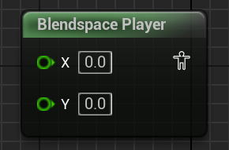

# 动画蓝图用法总结

## 前言

本文主要记录我学习动画蓝图时积累到的知识，虽然在**UE5蓝图学习笔记**中已有记载，但是我认为动画蓝图的知识量非常庞大，我不得不单开一篇文章来存放我的笔记，本篇笔记也将继承**UE5蓝图学习笔记**中对应的该部分的**意志**，但这不意味着本文不涉及基础内容，毕竟我也是个初学者。

## 动画蓝图模板

开新坑，后续补充。

## Blendspace Player

开新坑，后续补充。

