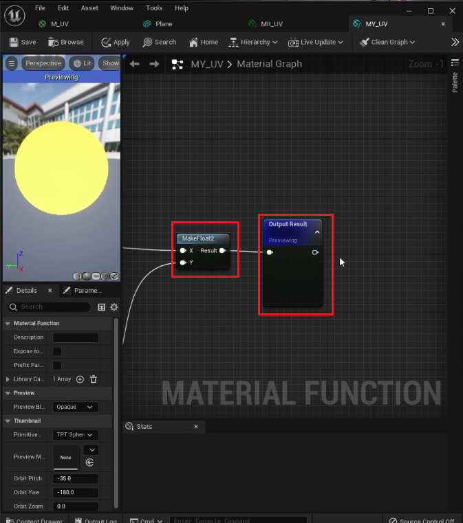
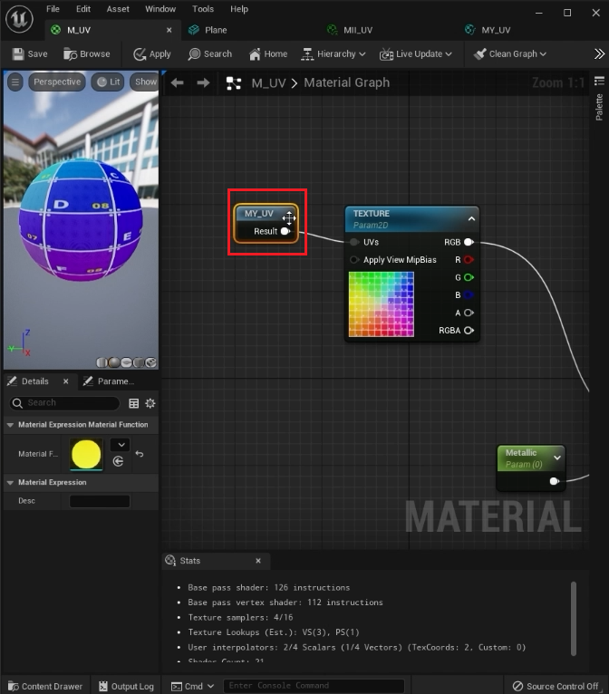
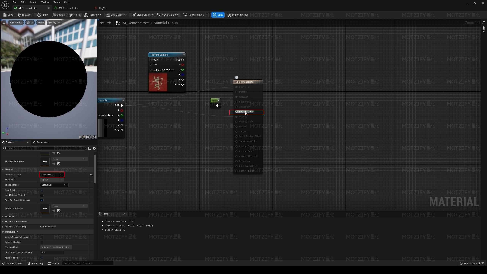
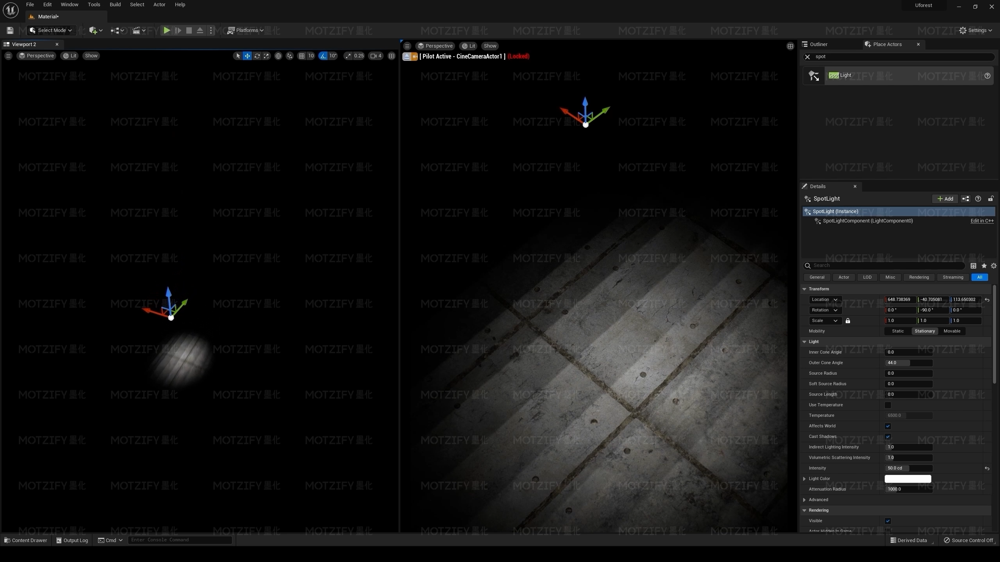
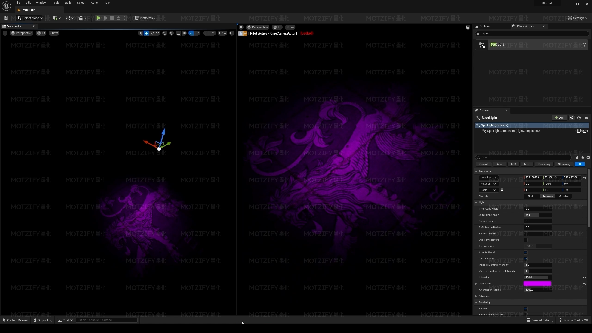

# 材质基础

## 材质基础（一）

### 向量的区别

#### 1-4元向量含义和创建

1. 一元向量：

   在材质球蓝图中，按住键盘上的1加鼠标左键即可创建。指单独的X或Y或Z。

2. 二元向量： 

   在材质球蓝图中，按住键盘上的1加鼠标左键即可创建。

   二元向量是由坐标轴上面的一对数构成的，代表着横轴和纵轴的信息，在UE中也可以代表颜色的RG，空间的XY。

3. 三元向量：

   在材质球蓝图中，按住键盘上的1加鼠标左键即可创建。

   三元向量是在XY基础上添加了一个纵轴，也就是Z轴，在UE中常用于表现RGB以及XYZ的坐标信息。

4. 四元向量：

   在材质球蓝图中，按住键盘上的1加鼠标左键即可创建。

   在XYZ的基础上增加了一个空间中一个可以任意调控的值，例如Alpha之类的

#### 常量和参数的区别

​	上面我们按住键盘上数字创建的向量均属于常量。

​	而参数则需要我们对其进行转化，比如现在随便选择一个常量，鼠标右键单击选择下图所示选项。

​	之后即可将其转换为参数，从材质球的节点中拖动出来创建的节点也属于参数。

​	常量和参数的区别就是：常量不会在材质球实例（即：子材质球）中出现，因此它不能在子球中进行修改；而参数则会继承到子材质球上，我们可以在子球中通过对参数的修改而改变子球的属性。

​	更明显的一个区别是，是参数的节点，其名称下往往有`Param`（Parameter)标志，而常量节点没有。

​	可以看到上图中两个节点一个是常量一个是参数，现在我们创建材质球实例，观察常量和参数是否可以在实例中设置。

​	可以看到只有参数节点可以在子材质球中进行设置。

### PBR材质节点

- Base Color — 基本颜色

  指物体的基本颜色，不包含任何的照明或者阴影，所以基本颜色的纹理看起来非常平坦

- Specular — 镜面

  用来控制高光的强度与范围的，我们可以通过它设置部分区域的反光

- Roughness — 粗糙度

  就是我们平时所说的平滑与粗糙，贴图白色部分代表粗糙度比较高的区域，黑色部分代表粗糙度比较低的区域

- Metallicity — 金属度

  生活中没有既金属右不是金属的半金属的物体，金属贴图也是非黑即白，没有灰色的贴图，当金属度为1时，漫射颜色也就看不见了，物体颜色就由金属颜色决定

- Normal — 法线

  可以帮我们把低模的物体，变成类似高模的物体（但是法线的原理是通过改变光的折射形成的假细节，真细节只有置换，但是UE5的法线已经近似于置换了）

### 什么是UV

三维模型通常是由点、线、面组成的虚构物体，如果想要在物体的表面绘制图案，那就需要用到纹理贴图

纹理的坐标通常分为U和V两个坐标，因此称为UV坐标

### 展UV

将一个立方体沿着边线切割展开

就获得了这个立方体的UV

然后将我们所需要的图片贴在UV上

然后再把立方体拼回来

这个过程就叫展UV

### UV提取

01.添加Texture Coordinate节点连接到贴图

02.再次添加Component Mask — 组件掩码  节点

关闭Component Mask中的 G 选项

03.添加Multiply — 相乘  节点

然后将Component Mask节点和一元向量使用相乘连接起来

04.将一元向量U信息调整成1

05.然后使用同样方法提取V信息

使用的是Make Floath2节点  将U和V信息连接起来

06.使用Add — 相加节点 和一元向量提取U的偏移

07.再使用Add — 相加节点 和一元向量提取V的偏移

### 参数分组

选中U的信息，在Group中新建一个U的控制 —— U CONTROL 

再将U的偏移也分到U CONTROL 

V的信息也是同样分组

### 材质函数

将母材质所有的材质节点CTRL+X剪切到材质函数中，并且连接起来

然后保存 将材质函数拖到原来的母材质中

## 材质基础（二）

### 材质属性参数

#### Base Color 基础颜色

#### Metallic 金属度

#### Specular 反射

#### Roughness 粗糙度

#### Emissive Color 发光颜色

#### World Position Offset 世界位置偏移

给该引脚传递三维参数可以改变材质在视觉上的位置，为什么说是视觉上的位置，因为视觉是会欺骗人的，使用该材质的物体本身的位置并没有改变，只是材质的表现让我们认为它改变了。

下面举例演示该引脚的作用。

新建一个材质，我们使用一张图片（不用在意图片中的内容）作为`BaseColor`可以看到材质球的样子已经发生了变化，之后我们使用一个三元参数并将其R、G、B三个数字合并为一个三维向量传入`World Position Offset`引脚，三元参数的初始值均为0。

在世界场景中拖入一些物体进行测试，见下图。

可以看到我使用了一个球体和一个正方体，其中球体使用简单的白色材质，它将作为参照物方便我们观察右侧正方体材质在视觉上的位置变化。正方体使用刚刚新建的材质，**注意正方体位置是否发生了变化**。

下面我会尝试改变三元参数中的各个数值。

可以看到我改变了三元参数中的`B`对应的值为100，也就是`XYZ`中的`Z`，可以看出正方体在视觉上向`Z`轴正方向移动了100厘米。

但是仔细观察就会发现，代表正方体坐标的那个点并没有变化，始终在球体的右边，如果此时撤销正方体使用的材质，就会发现正方体并没有发生移动，如下图所示。

材质的`B`数值仍然是100，当正方体刚才使用的材质被撤销之后就可以看到其实它并没有移动，只是使用的材质带给我们了视觉上的变化而已。

**旗帜飘动效果**

通过虚幻内置的一些材质函数或自定义材质函数（比如：“Grass Wind”），连接到此引脚可以实现类似旗帜飘动的效果，因为该引脚接收的每个数值都会改变被赋予材质的物体的形状，那么一连串的数值的改变，就可以组成一个飘动的画面，这就是它的工作原理。

### 材质混合模式类型（Blend Mode)

#### Masked 已遮罩

​	对于当前模式，只有透明和不透明之分，没有半透明的说法，起到关键作用的引脚就是那个`Opacity Mask`，把黑白图片传入该引脚，图片中偏黑色的地方会变得完全透明，而偏白色的地方会变得完全不透明，具体是以0.5为分界线。

​	注意与下面的`Translucent` 对比。

#### Translucent 半透明

​	对于该模式，我们有透明、半透明、不透明之分，从黑到白，这个过程中，我们的材质会随之变得越来越不透明，因此可以看到图中的材质表现是从完全透明到半透明最后再到不透明的过渡。

#### Additive 添加

启用了叠加选项之后，两个半透明材质通过叠加的方向看过去会有一定的增强效果，看起来更亮了。

#### Light Function 灯光函数

#### Surface ForwardShading 表面向前着色

制作玻璃等类似材质时，往往会选择`Translucent`混合模式，但是这种混合模式在默认情况下会缺少很多可以调整的引脚，如下图所示。

但是有时候我们又需要调整其中被隐藏的一些引脚来调整材质，这是即可找到`Surface ForwardShading`选项，在细节面板中搜索`Translucency`之后找到`Lightning Mode`选项卡即可找到该选项。

选择之后即可看到PBR材质节点中很多不可用的节点就回来了，如下图所示。

这是目前已知的最好的解决方案。

# 常用功能节点总结

## 