# 水材质制作

本文记录Motzify课程中水材质制作的方法，对应第二阶段《悬崖》07-11课。

## 水的波纹和紊乱效果

### 波纹效果

制作水的波纹效果需要使用合适的法线贴图，也就是整张图都很蓝的那种图片。

当我们将法线贴图连接到Normal节点是，材质就会表现出一定的粗糙效果，这也是法线贴图的主要作用。

利用这种粗糙的波纹并使其运动起来即可模拟水的动态效果。

#### 重点：如何让材质不随物体体积变化？

可以预见到在之后使用水材质的过程中我们不免会放大或缩小使用水材质的物体以符合场景需要，但是放大缩小物体的同时水的波纹会跟着物体的大小一起被拉伸或压缩，这样就非常不方便，所以我们的水材质不需要跟随物体体积的变化，为了做出这样的效果，就需要使用到`WorldPosition`节点。

这个节点可以获取当前像素在世界场景中的三维坐标，让材质的效果根据像素在世界中的位置展现而不是物体，即可实现目的。

因为我们的水材质不需要Z轴方向上的坐标，所以使用XY节点引脚即可。

当我们如上图所示连接上了之后发现原本带有波纹的材质现在看起来非常的光滑，这是因为UE的默认长度单位是厘米（cm），因此`WorldPosition`节点获取到的坐标数据也是厘米单位的，连接到纹理贴图上就代表以一厘米展现从0到1的UV缩放（这里没有理解，有空深挖一下）。其实这里的材质看上去非常光滑，实际上是因为纹理变得非常小同时又很密集，所以从远处看去就看不出来，凑近看还是能看到的。

那么想要解决这个问题我们就需要将`WorldPosition`节点获取到的坐标除以一个数字让其单位变大，比如除以100变成米为单位，这样的即可看到效果，如下图所示。

如果除以1000，效果会更加明显一些，如下图所示。

现在我们就获得了一个不会随物体体积变化的材质。

#### 重点：如何时间简单的移动？

接下来我们需要让这些波纹动起来，模拟水的流动效果，这就需要`Panner`节点。

该节点的`Coordinate`引脚用于接收坐标数据（可以不连），`time`引脚就是该节点产生的运动效果的时间依据（可以不连，不连就是正常的时间流逝速度），`Speed`就是坐标XY的移动速度，我们就是通过调整这个速度值来让`Texture Sample`节点中的纹理表现出移动的效果。

可以看出来材质球上的纹理出现了移动的效果，由于这是图片所以不能很好的展现出来效果。

为了更好的模拟出水流动的效果，还可以增加一个反向移动的纹理贴图，我们如法炮制即可，如下图所示。

复制一份相同的`Texture Sample`节点，之后给`Panner`节点的`Speed`引脚中的速度加上负号，最后将两个`Texture Sample`节点的RGB输出结果使用`Add`节点相加起来即可。

### 紊乱效果

我们通常使用**噪点图**来制作材质的紊乱效果，所谓紊乱效果就是将规律变得不规律、整齐变得混乱，对于水材质而言，制作紊乱效果的目的就是让材质看起来更加真实，更具有现实中水的感觉。

下面展示几个噪点图

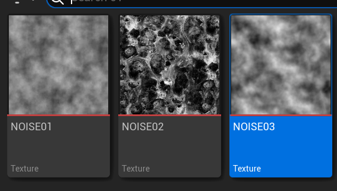

#### 重点：噪点图的RGB特点

这种图的R、G、B值两两相似，只有整体颜色有所区别，以上图第三个噪点图为例，它的R、G、B图依次如下所示。

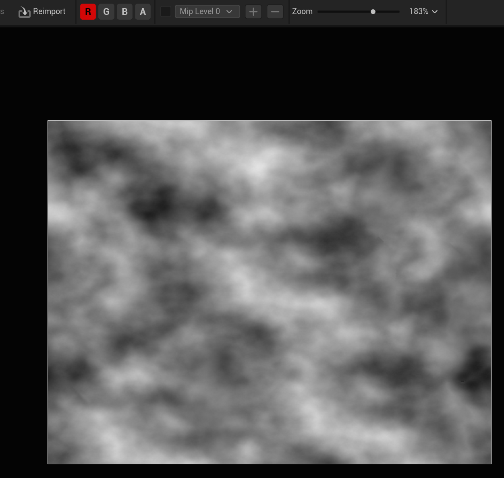

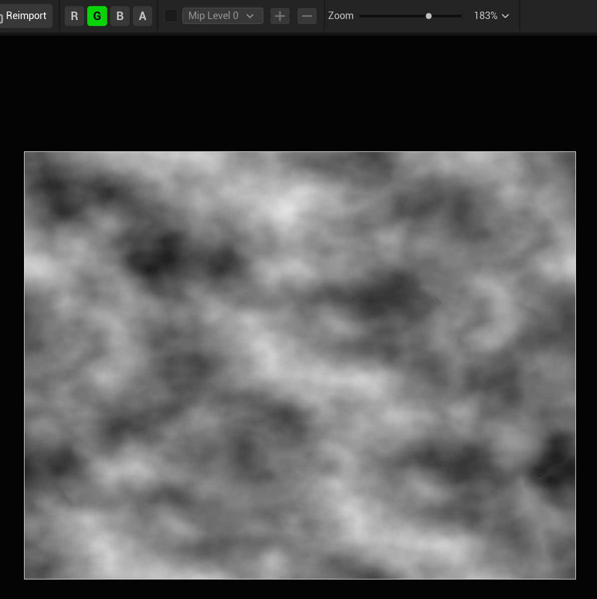

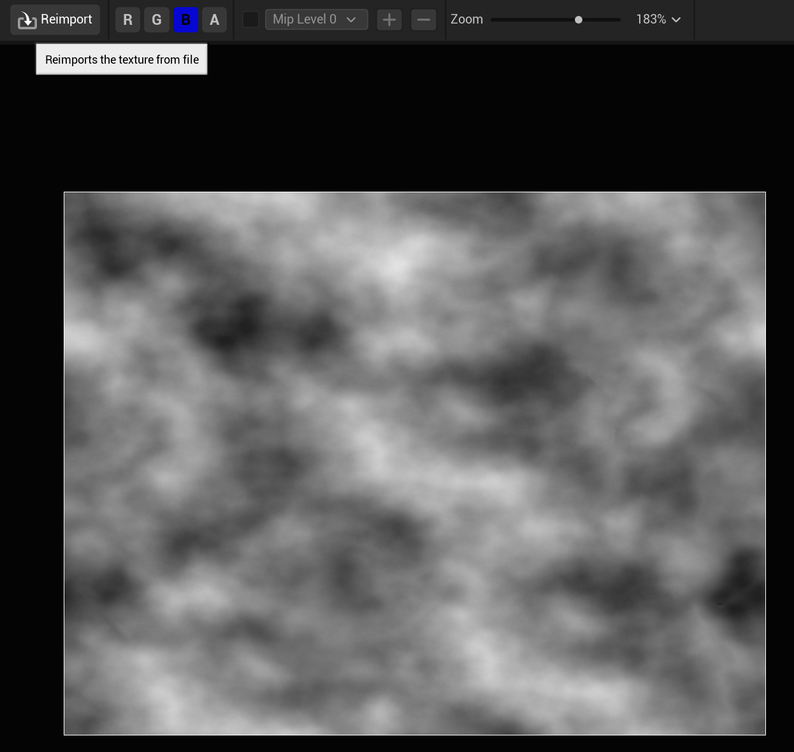

可以看到上方选项卡中的RGB三个选项对应的图片样子几乎一致，况且我们需要的是紊乱效果，使用的是这种图的一个混乱的状态，我们使用这种混乱的图片不均匀的改变原本均匀的纹理图片的`UV`，这样就能表现出来紊乱的效果了。

#### 重点：两个噪点图混合使用

类似波纹效果的制作方法，紊乱效果也需要`WorldPosition`节点、`Panner`节点等，如下图所示连接。

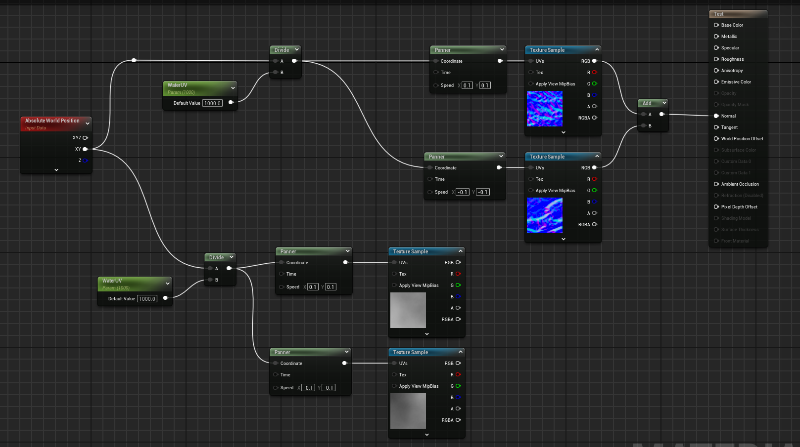

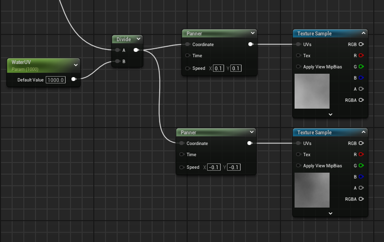

其中第一张图到目前为止的所有节点，第二张图也就是第一张图的左下部分的内容，是对噪点图的一些操作，首先除以1000转换一下单位，之后也是使用`Panner`节点使噪点也运动起来，这样可以模拟的更加真实、更不规律。

在此之后，我们应该将两张噪点图混合起来添加到上方的纹理中，这里就需要用到`Append`节点（全称`AppendVector`），如下图所示。

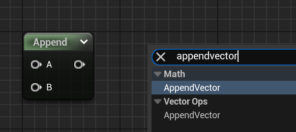

该节点虽与`Add`相似，但是功能不同，`Append`类似蓝图中的字符串合并，这里是将A和B的值组合成一个数对，也就是将两个一维数字转换为一个二维数字输出，也可以理解为将X和Y组合成（X，Y）。

我们知道噪点图的RGB特点，所以我可以单独将其中一个值拿出来，得到的仍然是这张图，我就可以分别将两张图各拿出一个数据使用`Append`节点拼起来充当`UV`添加到纹理中从而实现紊乱效果，具体如下图所示。

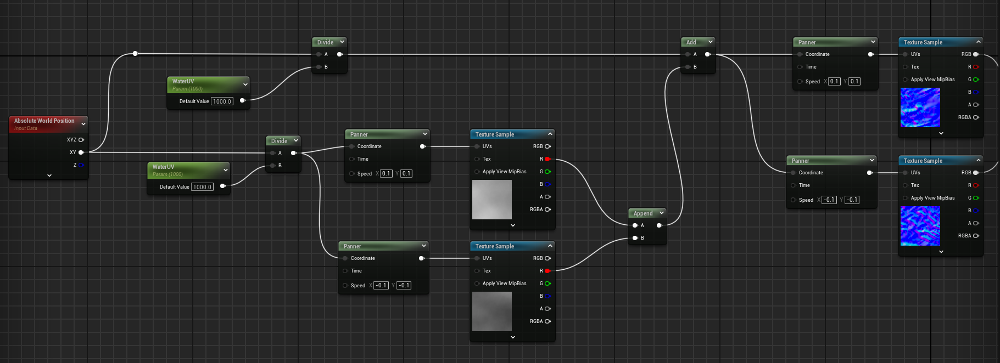

此时使用了材质球的物体表面就有点水的感觉了。

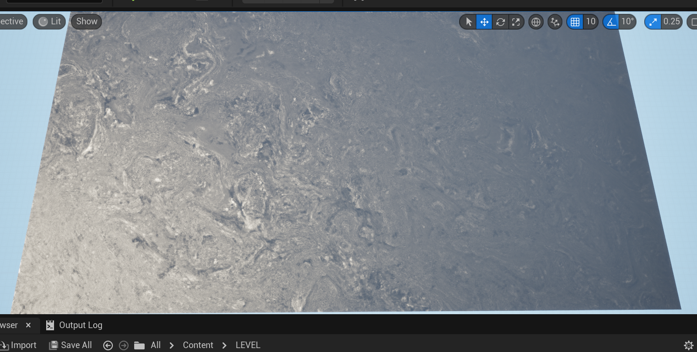

### 优化操作

#### 经验值

为了使水的材质更加逼真，我们需要添加一些经验值，如下图所示。

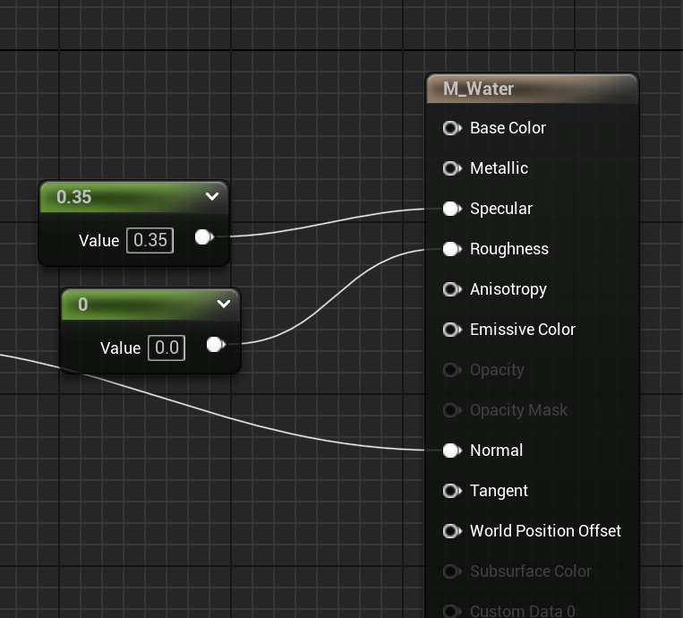

将这两个值分别设置到`Specular`（反射、镜面强度）和`Roughness`（粗糙度）上即可。

#### 强度调节

在`Append`节点后我们可以添加一个乘法节点，让噪点图输出的结果乘上一个变量，这样我们就可以在外部随时调整水紊乱的强度了，如下图所示。

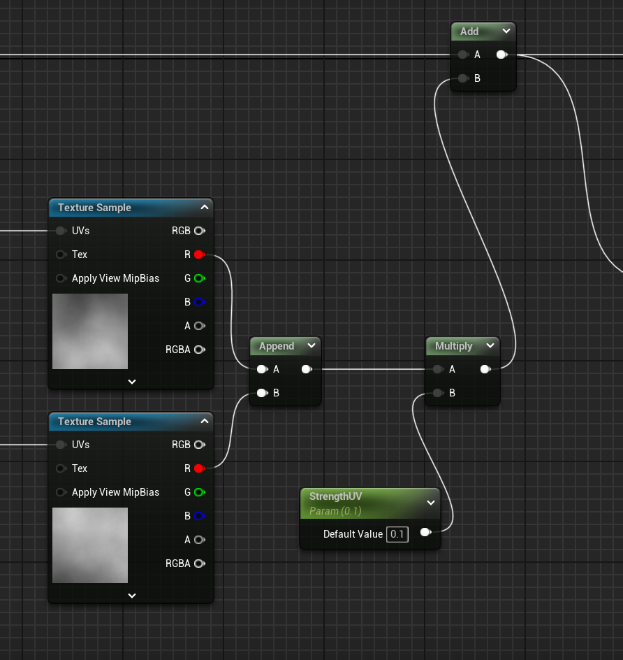

#### 速度调节

使用`Time`节点可以随着场景的运行获取到一个持续变化的时间，利用这个时间的变化速度我们可以控制`Panner`节点的`Time`引脚，从而控制水的速度，如下图所示。

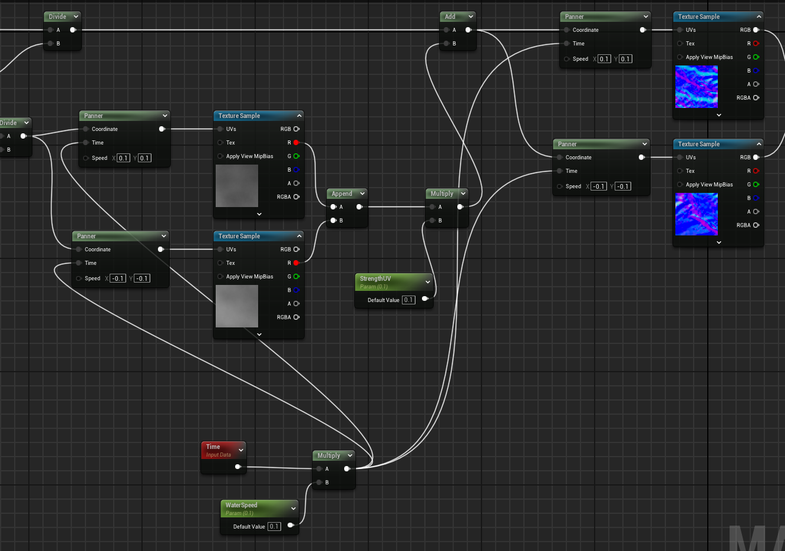

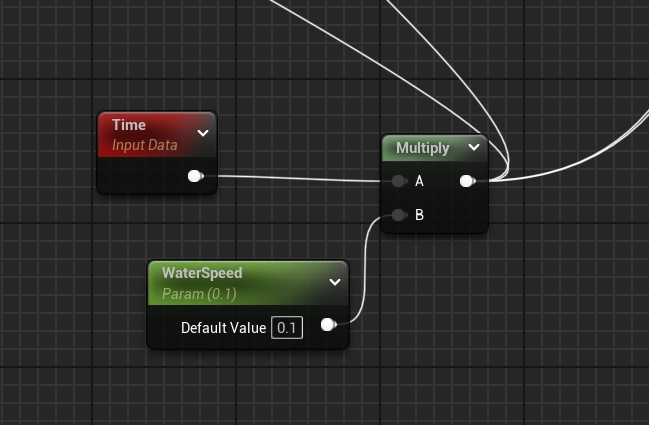

## 水的法线强度及范围控制

