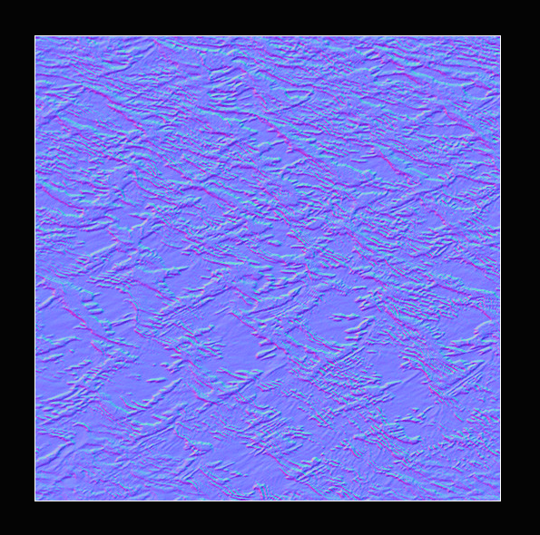
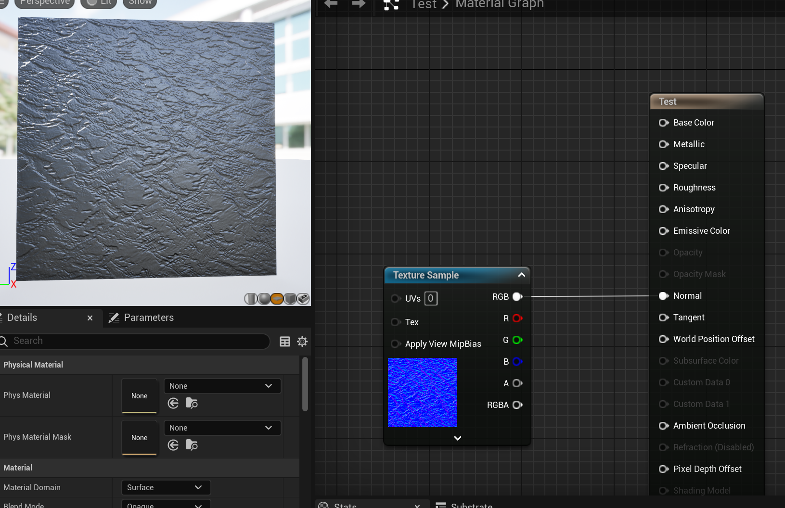
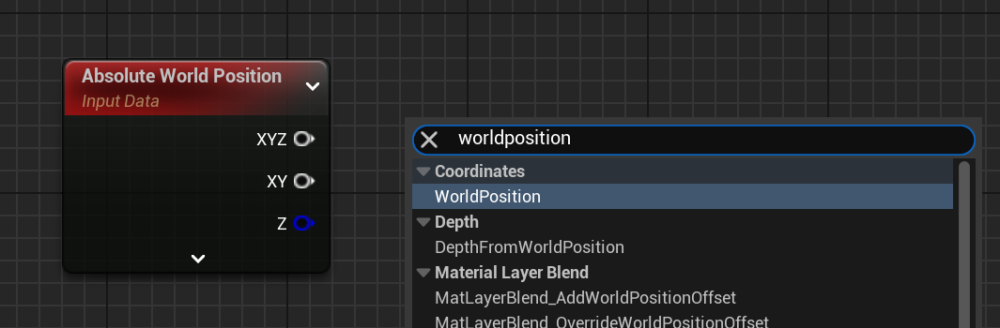
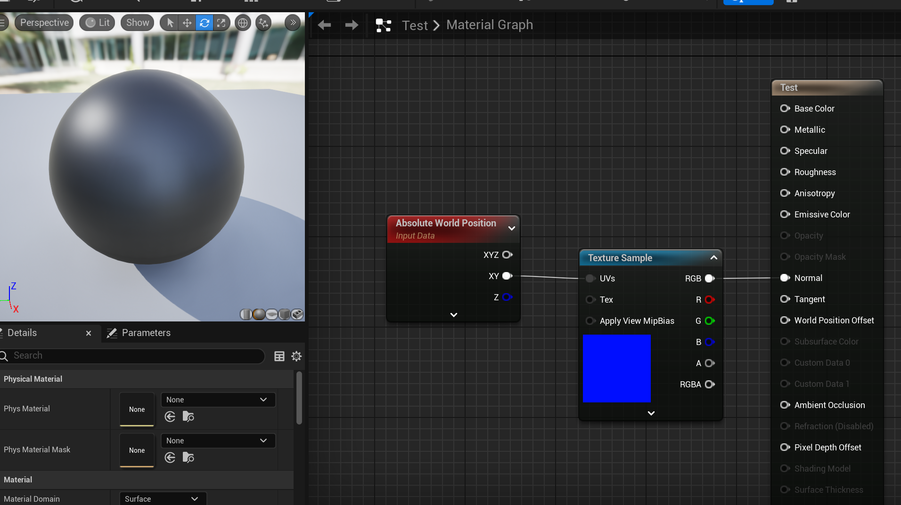
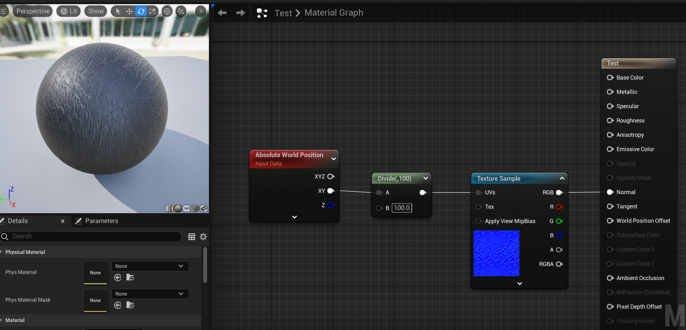
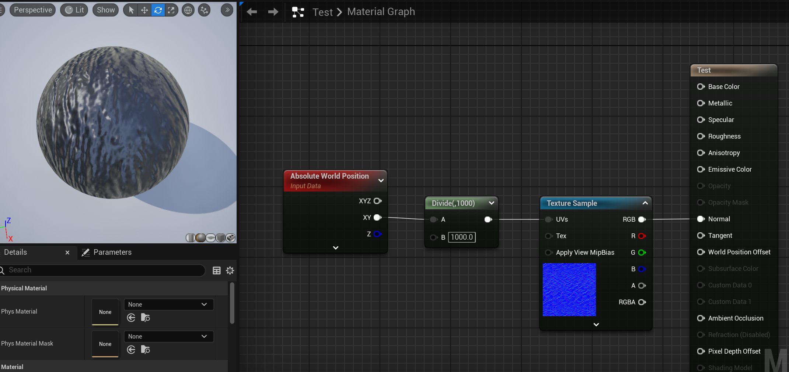
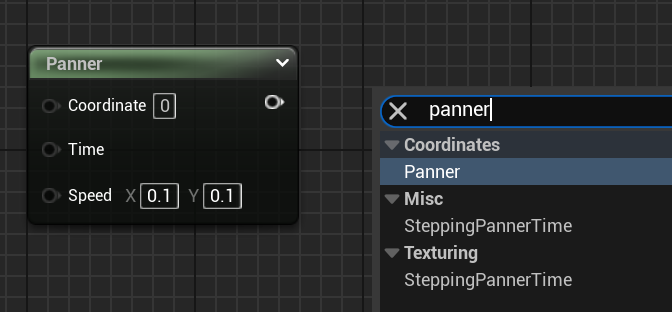
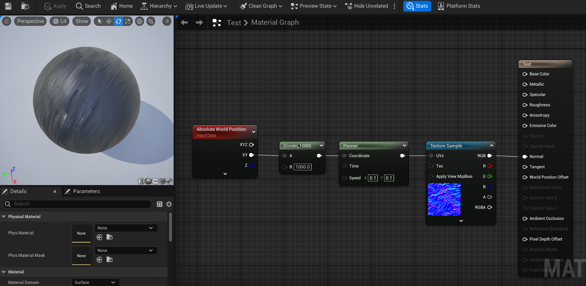
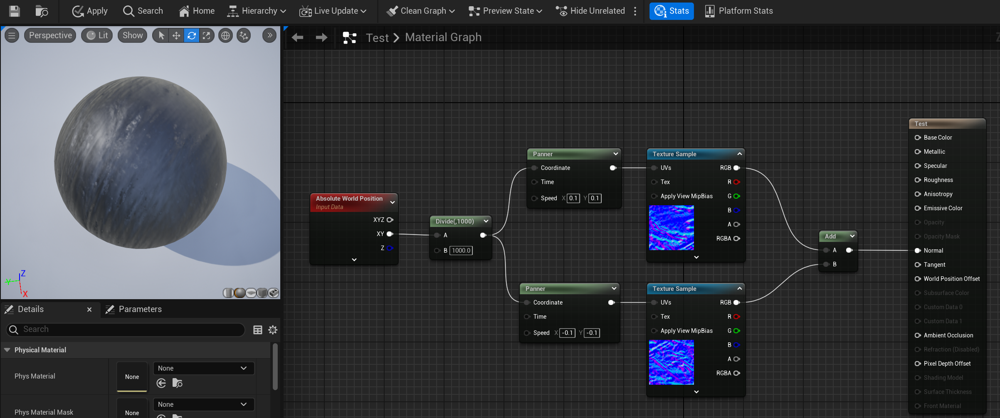

# 水材质制作

本文记录Motzify课程中水材质制作的方法，对应第二阶段《悬崖》07-11课。

## 水的波纹和紊乱效果

### 波纹效果

制作水的波纹效果需要使用合适的法线贴图，也就是整张图都很蓝的那种图片。

当我们将法线贴图连接到Normal节点是，材质就会表现出一定的粗糙效果，这也是法线贴图的主要作用。

利用这种粗糙的波纹并使其运动起来即可模拟水的动态效果。

#### 重点：如何让材质不随物体体积变化？

可以预见到在之后使用水材质的过程中我们不免会放大或缩小使用水材质的物体以符合场景需要，但是放大缩小物体的同时水的波纹会跟着物体的大小一起被拉伸或压缩，这样就非常不方便，所以我们的水材质不需要跟随物体体积的变化，为了做出这样的效果，就需要使用到`WorldPosition`节点。

这个节点可以获取当前像素在世界场景中的三维坐标，让材质的效果根据像素在世界中的位置展现而不是物体，即可实现目的。

因为我们的水材质不需要Z轴方向上的坐标，所以使用XY节点引脚即可。

当我们如上图所示连接上了之后发现原本带有波纹的材质现在看起来非常的光滑，这是因为UE的默认长度单位是厘米（cm），因此`WorldPosition`节点获取到的坐标数据也是厘米单位的，连接到纹理贴图上就代表以一厘米展现从0到1的UV缩放（这里没有理解，有空深挖一下）。其实这里的材质看上去非常光滑，实际上是因为纹理变得非常小同时又很密集，所以从远处看去就看不出来，凑近看还是能看到的。

那么想要解决这个问题我们就需要将`WorldPosition`节点获取到的坐标除以一个数字让其单位变大，比如除以100变成米为单位，这样的即可看到效果，如下图所示。

如果除以1000，效果会更加明显一些，如下图所示。

现在我们就获得了一个不会随物体体积变化的材质。

#### 重点：如何时间简单的移动？

接下来我们需要让这些波纹动起来，模拟水的流动效果，这就需要`Panner`节点。

该节点的`Coordinate`引脚用于接收坐标数据（可以不连），`time`引脚就是该节点产生的运动效果的时间依据（可以不连，不连就是正常的时间流逝速度），`Speed`就是坐标XY的移动速度，我们就是通过调整这个速度值来让`Texture Sample`节点中的纹理表现出移动的效果。

可以看出来材质球上的纹理出现了移动的效果，由于这是图片所以不能很好的展现出来效果。

为了更好的模拟出水流动的效果，还可以增加一个反向移动的纹理贴图，我们如法炮制即可，如下图所示。

复制一份相同的`Texture Sample`节点，之后给`Panner`节点的`Speed`引脚中的速度加上负号，最后将两个`Texture Sample`节点的RGB输出结果使用`Add`节点相加起来即可。

### 紊乱效果