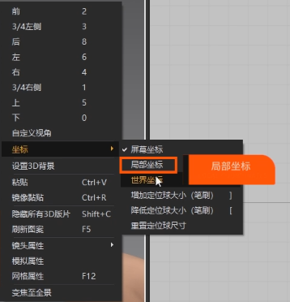
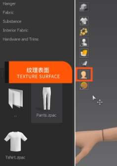

# 美学创作学习笔记

## 场景搭建思维导引

​	场景搭建思维导引，是作此工作的心灵指导，会让我们搭建场景时更加胸有成竹，不会越搭越偏越不符合预期，因此有必要进行整个思维上的升华。

​	搭建场景前首先需要明确我们需要一个什么氛围的场景，根据不同的氛围，确定感情基调，确定主体色彩基调，那么在后续搭建场景时，场景中的物体的大致颜色都要围绕主体颜色基调来展开调整。

​	除此之外，我们还需要确定场景的构图（比如三角形构图），构图的选择决定了在我这个场景中，哪些建筑将成为主体，哪些建筑是陪衬物。通过主次的区分，让观看场景的人能很轻松的捕捉到你想表达的东西。

​	其次场景中物体的远近关系也至关重要，可以通过适当的雾气、灯光等视觉效果打造出更加符合既定氛围的感觉，拉开远景和近景之间的距离。

​	搭建场景时，不能执着于**“什么物就要干什么事”**的思维，也就是说，建筑物不一定就非要用作建筑物一板一眼的搭在场景中，树木不一定非要用作树木。比如我们需要地上有小草的效果，如果暂时没有小草，且我们发现某个树木模型的树枝末端缩小之后插在地上与小草的样貌很像，是我们想要的效果，那我们用树来当小草也未尝不可。总之就是说一个事：思维要活跃，看见什么合适，可以直接拿来就用，不要管它原本的作用是什么。

## 颜色

### 三原色

​	三原色：红、绿、蓝。

## 光线

## 材质

### 材质球

​	在UE中一种材质球有父子级之分。一般情况下**子级材质球**只能调整材质的一些数值，无法进行蓝图节点连接的操作；而**父级材质球**往往可以通过连接蓝图节点实现不同的材质效果。

关于材质球的一些可调项：

- Global：全局
- Albedo：调颜色用的
- Metallic：金属度
- Specular：反射、镜面强度
- Roughness：粗糙度
- Normal：法线
- Texture Maps：调纹理贴图用的

## 构图

### 三角形构图

## 光影环境

​	分析光影时，通常有两点要素

1. 能否在场景中清晰的分辨出主光源在哪里
2. 明暗交界是否清晰

### 强光影环境

- 强光影环境通常都有一个光线强烈的光源。
- 场景中的物体在光线影响下产生的阴影与其它被光线照射到的地方的交接非常清晰，明暗交替明显。

### 弱光影环境

- 往往出现在阴天。
- 明暗交界不清晰。

## 场景纵深

​	纵深是画面物体表现以及场景宏大感染表现的一个重要影响因素。

​	摄像机的焦距大小，对于我们视觉上感觉的纵深会有很大影响。

- 小焦距：摄像机画面内能看到的范围更大，景物更多。同时畸变更强，会提高画面纵深，适合大场景
- 大焦距：摄像机画面内能看到的范围更小，景物更少。同时畸变更弱，会将画面拍平整，适合特写画面

​	制作大场景需要大纵深时，焦距可以选择20左右；而当我们需要某些特写镜头时，则可以选择135焦距进行特写。

## 纹理流送

​	负责增大和减小每个纹理的分辨率，可以有效地管理可用内存，但是为了保证画面精度可以关掉。

## UE光源类型

### 定向光源

Directional Lights

​	类似OC太阳光，是一盏平行光，投射的阴影都是平行的，给场景提供自然光源，使室外环境的常用光源。

### 常用属性作用	

​	下面讲解一下该光源的一些常用属性

#### Transform

##### Mobility

- Static、Stationary烘培时使用。
- Movable表示使用动态光。

#### Light

##### Source Angle

​	源角度，数值越大，光源越大，进而被光照射到的物体的影子就会越虚。

​	类比生活中当光照足够大时，我们就只能隐隐约约甚至不能看到自己的影子；而光照较小时，我们的影子却很明显。

​	制作影片时，就应该将Source Angle调大，这样我们的光影才会更真实，因为现实环境中光影的边界是不会那么清晰的。

##### Source Soft Angle

​	源软角度，决定光源柔和程度，数值越大，光源越柔和。

​	制作影片时，如果遇到反射很高且粗糙度很低的物体时（例如：车的表面、水的表面），就可以适当的提高该值。

##### Temperature

​	色温，勾选Use Temperature选项之后即可调整该值的大小。

​	值越小，色温越暖；值越大，色温越冷。

##### Affect World

​	决定该光源是否能够影响世界、环境。

##### Cast World

​	决定该光源是否产生阴影。

##### Indirect Lighting Intensity

​	间接照明强度，烘培流程时使用。

##### Valume Scattering Intensity

​	体积散射强度，配合体积雾使用。

​	当我们调高该数值之后，如果场景中有体积雾，且体积雾可以受到该光照的影响的话，那么体积雾就会变强。

##### Intensity

​	强度，决定光照强度，说白了就是光亮不亮。

##### Light Color

​	灯光颜色

#### Light Shaft（灯光光束）

##### Light Shaft Occlusion

​	光束遮挡，勾选该选项即可调整Occlusion Mask Darkness和Occlusion Depth Range的参数大小。

​	可以用于营造丁达尔效应的感觉。

- Occlusion Mask Darkness：

  ​	遮挡遮罩阴暗，用于控制光束遮罩的亮暗，该数值越高，丁达尔效应越不明显，反之，则越明显。

- Occlusion Depth Range：

  ​	遮挡深度范围，所有距离摄像机小于该范围的物体都会受到Light Shaft Occlusion的影响。

##### Light Shaft Bloom

​	光束泛光。

- Bloom Scale：

  ​	泛光规模，用于调整泛光的大小

- Bloom Threshold：

  ​	泛光阈值，如果Bloom Scale调大了，我们可以通过调大本属性的值，将泛光“压回去”。

- Bloom Max Brightness：

  ​	泛光最大亮度，顾名思义，调整亮度。

- Bloom Tint：

  ​	泛光的颜色。

## 指数高度雾

Exponential Height Fog

​	用于为场景提供雾气，低处产生更多雾气，高处产生更少雾气。是画面制作的重要部分。

​	

### 常用属性作用

#### Exponential Height Fog Component

##### Fog Density

​	雾的密度，决定雾的浓度，数值越大，雾气越浓。

##### Fog Height Falloff

​	雾的高度衰减，根据现实生活中雾的现象，我们知道随着高度的增加，雾气浓度也会随之降低，这个属性就是用来控制不同高度下雾的密度的。

​	这个属性的数值越大，衰减越明显，也就是说单位高度降低的雾的密度值会越大。

##### Second Fog Data

​	二次雾

##### Fog Inscattering Color

​	雾内散射颜色，我们认为是雾原本的颜色。

##### Fog Max Opacity

​	雾的最大透明度，数值越大，雾越不透明。

##### Start Distance

​	雾的距离，就是开始出现雾的位置与摄像机位置之间的距离。

​	当我们想让近景的物体看的更清晰，而远景的物体看的更模糊时，就可以调整该属性的值。

##### Fog Cutoff Distance

​	雾气截至距离，当你的物体超出了这个属性所表示的距离时，该物体就不再被雾气影响了，一般不调整，保持默认即可。

#### Valumetric Fog（体积雾）

##### Valumetric Fog

​	体积散射，是该部分的第一个属性。

​	勾选该选项之后，我们的雾将会使用Albedo处的颜色。

##### Scattering Distribution

​	散射分布，该参数可以控制我们的雾更靠近光源。

​	数值越高，雾气越靠近光源汇集。

​	如果我们感觉画面中的雾有点平，就可以适当调高这个参数，让画面形成一道小高光，丰富场景的层次。

##### Albedo

​	反照率、白度值、反射率。

##### Emissive

​	雾的发光颜色，颜色亮度调高之后，我们的雾就会开始发光，一般保持默认。

##### Extinction Scale

​	消光范围，用于控制雾吸收环境的颜色。

​	数值越高，雾就越能吸收光照颜色。

​	所以如果我们想让雾吃掉更多的环境光，让画面的光影变得不清晰，就可以适当调整该参数。

##### View Distance

​	视野距离，该参数用于控制体积雾的距离，当你超出了这个距离，就看不到这个体积雾了。

##### Start Distance

​	体积雾的开始距离，就是开始出现体积雾的位置与摄像机位置之间的距离。

## Post后期调色

### 1.Color Grading

#### 1.Temperature 色温调整

1.Temperature Type 色温类型

2.Temp 色温调整，调低偏冷，调高偏暖

3.Tint 色相调整，在偏青绿和洋红色之间

#### 2.Global 全局色调调整

其中包含全局的饱和度、对比度、伽玛、增益、偏差等相关调色选项

每个调色选项卡里面都可以用色轮整体调整偏色

#### 3.Shadows 画面阴影调整

其中包含全局的饱和度、对比度、伽玛、增益、偏差、最大阴影等相关调色选项

每个调色选项卡里面都可以用色轮整体调整偏色

#### 4.Midtones 画面中间调调整

其中包含全局的饱和度、对比度、伽玛、增益、偏差等相关调色选项

每个调色选项卡里面都可以用色轮整体调整偏色

###### 5.Highlights 画面高光调整

其中包含全局的饱和度、对比度、伽玛、增益、偏差等相关调色选项

每个调色选项卡里面都可以用色轮整体调整偏色

同时会多出两个最大高光和最低高光范围阈值调整选项

### 2.Film

01.Slope ：调整画面整体灰度对比的，调高对比加强，降低提高灰度

02.Toe：调整画面下端的灰度对比的，调高对比加强，降低提高灰度

03.Shoulder：调整高光亮部区域的灰度对比的，调高对比加强，降低提高灰度

04.Black Clip：暗部区域的细节调整

05.White Clip：白色区域的细节

### 3.画面色调分离效果调整

Chromatic Aberration 

调整画面的色差分离的效果

## 材质基础（一）

### 01.材质新建

01.直接右键新建材质球

02.右键在Materials中新建材质

### 02.向量的区别

#### 1-4元向量含义和创建

01.一元向量：

​	在材质球蓝图中，按住键盘上的1加鼠标左键即可创建。指单独的XYZ。

02.二元向量： 

​	在材质球蓝图中，按住键盘上的1加鼠标左键即可创建。

​	是由坐标轴上面的一对数构成的，代表着横轴和纵轴的信息，在UE中也可以代表颜色的RG，空间的XY。

03.三元向量：

​	在材质球蓝图中，按住键盘上的1加鼠标左键即可创建。

​	是在XY基础上添加了一个纵轴，也就是Z轴，在UE中常用于表现RGB以及XYZ的坐标信息。

04.四元向量：

​	在材质球蓝图中，按住键盘上的1加鼠标左键即可创建。

​	在XYZ的基础上增加了一个空间中一个可以任意调控的值，例如时间之类的

#### 常量和参数的区别

​	上面我们按住键盘上数字创建的向量均属于常量。

​	而参数则需要我们对其进行转化，比如现在随便选择一个常量，鼠标右键单击选择下图所示选项。

​	之后即可将其转换为参数，从材质球的节点中拖动出来创建的节点也属于参数。

​	常量和参数的区别就是：常量不会在材质球实例（即：子材质球）中出现，因此它不能在子球中进行修改；而参数则会继承到子材质球上，我们可以在子球中通过对参数的修改而改变子球的属性。

​	更明显的一个区别是，是参数的节点，其名称下往往有`Param`（Parameter)标志，而常量节点没有。

​	可以看到上图中两个节点一个是常量一个是参数，现在我们创建材质球实例，观察常量和参数是否可以在实例中设置。

​	可以看到只有参数节点可以在子材质球中进行设置。

### 03.纹理、材质、贴图之间的关系

01.纹理：

​	英文名:Texture

02.贴图：

​	英文名：Mapping

​	将纹理以一定的方式  "贴"  在物体表面

03.材质：

​	英文名：Material

​	供渲染器读取的、储存物体表现信息的数据集

### 04.PBR材质节点

01.Base Color — 基本颜色

指物体的基本颜色，不包含任何的照明或者阴影，所以基本颜色的纹理看起来非常平坦

02.Specular — 镜面

用来控制高光的强度与范围的，我们可以通过它设置部分区域的反光

03.Roughness — 粗糙度

就是我们平时所说的平滑与粗糙，贴图白色部分代表粗糙度比较高的区域

黑色部分代表粗糙度比较低的区域

04.Metallicity — 金属度

生活中没有既金属右不是金属的半金属的物体

金属贴图也是非黑即白，没有灰色的贴图

当金属度为1时，漫射颜色也就看不见了，物体颜色就由金属颜色决定

05.Normal — 法线

可以帮我们把低模的物体，变成类似高模的物体

（但是法线的原理是通过改变光的折射形成的假细节，真细节只有置换，但是UE5的法线已经近似于置换了）

### 05.什么是UV

三维模型通常是由点、线、面组成的虚构物体，如果想要在物体的表面绘制图案，那就需要用到纹理贴图

纹理的坐标通常分为U和V两个坐标，因此称为UV坐标

### 06.展UV

将一个立方体沿着边线切割展开

就获得了这个立方体的UV

然后将我们所需要的图片贴在UV上

然后再把立方体拼回来

这个过程就叫展UV

### 07.UV提取

01.添加Texture Coordinate节点连接到贴图

02.再次添加Component Mask — 组件掩码  节点

关闭Component Mask中的 G 选项

03.添加Multiply — 相乘  节点

然后将Component Mask节点和一元向量使用相乘连接起来

04.将一元向量U信息调整成1

05.然后使用同样方法提取V信息

使用的是Make Floath2节点  将U和V信息连接起来

06.使用Add — 相加节点 和一元向量提取U的偏移

07.再使用Add — 相加节点 和一元向量提取V的偏移

### 08.UV分组

01.选中U的信息，在Croup中新建一个U的控制 —— U CONTROL 

再将U的偏移也分到U CONTROL 

02.V的信息也是同样分组

### 09.材质函数

01.将母材质所有的材质节点CTRL+X剪切到材质函数中，并且连接起来

02.然后保存 将材质函数拖到原来的母材质中

## 材质基础（二）

### 1.材质属性参数

#### Base Color 基础颜色

#### Metallic 金属度

#### Specular 反射

#### Roughness 粗糙度

#### Emissive Color 发光颜色

#### World Position Offset 世界位置偏移

​	通过虚幻内置的一些材质函数或自定义材质函数（比如：“Grass Wind”），连接到此引脚可以实现类似旗帜飘动的效果，因为该引脚接收的每个数值都会改变被赋予材质的物体的形状，那么一连串的数值的改变，就可以组成一个飘动的画面，这就是它的工作原理。

### 2.材质模式类型

#### Masked 已遮罩

​	对于当前模式，只有透明和不透明之分，没有半透明的说法，起到关键作用的引脚就是那个`Opacity Mask`，传入该引脚的纹理中，偏黑色的地方会变得完全透明，而偏白色的地方会变得完全不透明，具体是以0.5为分界线。

​	注意与下面的`Translucent` 对比。

#### Translucent 传输

​	对于该模式，我们有透明、半透明、不透明之分，从黑到白，这个过程中，我们的材质会随之变得越来越不透明，因此可以看到图中的材质表现是从完全透明到半透明最后再到不透明的过渡。

#### Additive 添加

#### Light Function 灯光函数

#### Surface ForwardShading 表面向前着色

## Mablend材质混合

### 01.如何拷贝材质球

​	将材质球包（Tool工具包，地址：D:\游戏开发学习\墨化科技\墨化资产\《山翼》\解压后文件\12.MABLEND混合材质）整个文件夹拷贝进工程目录的Content文件夹（注意：不能拷贝资产里面零碎的文件，UE不识别）

### 02.Mablend 材质混合

#### 00.Global 

​	— 负责全局的一些控制。比如三个图层的调整图层、水的图层、独立的置换（可不勾选，UE已经默认删除置换）

#### 01.Blend Controls 

​	—负责图层混合的控制，比如混合的数量、混合的混合的衰减、混合的对比度、反转混合

#### 02.Base Layer

​	进行第一层的贴图替换以及调整

#### 03.Middle Layer 

​	进行第二层的贴图替换以及调整

#### 04.Top Layer

​	进行第三层的贴图替换以及调整

#### 06.Displacement 

​	置换调整（不需要管）

#### 07.Use Baselmage Alpha

​	调整第一个图层与第二个图层之间的遮罩

#### 08.Use Toplmage Alpha

​	调整第二个图层与第三个图层之间的遮罩

#### 09.Use Waterlmage Alpha

​	调整顶部图层与水之间的遮罩

## Marvelous Designer基础讲解（上）

### 01.视窗操作

01.点击鼠标右键旋转视图

02.点击鼠标中键平移视图

03.ALT加鼠标左键是缩放

### 02.导入注意

01.模型导入比例选择厘米

### 03.加载类型

加载类型：“打开”“增加”  

01.打开：会替换你MD中原来有的模型

02.增加：保留你原来有的模型，增加你导入的模型

### 04.坐标设置

01.在3D视窗点击鼠标右键，将坐标修改为世界坐标或者局部坐标

### 05.内部预设

01.点击左上角的图层按钮就可以进入预设文档

### 06.2D板块

01.移动模式：

可以对物体进行整体移动

02.编辑模式：

01.编辑板片：可以通过选中点对点进行编辑

02.编辑点/线：可以选中板片的点线进行编辑

03.编辑曲线点：可以编辑线，使线变得成曲线有弧度

04.编辑圆弧：编辑线，拖一下就可以将线变成圆弧

05.生成圆顺曲线：通过在线上面加点，将线段编辑成曲线状

06.加点/加线：可以直接在线上面加点，也可以右键均匀的加点

03.延展：可以将我们的板块进行延伸

04.生成：可以生成自己自定义的初始板块

05.缝纫工具：

01.固定缝纫：可以将两个板块缝纫起来

02.自然缝纫:可以自由的控制想要缝纫的部分

06.缝纫线选择工具：可以对缝纫的状态进行编辑，删除  反转等等

7. 内部长方形：可以在板块内部画出一条线，用于制作口袋较多

08.勾勒轮廓：可以配合内部长方形使用，选中一圈环线。生成新的面

09.缝制褶皱：可以制作百褶裙效果

10.熨烫工具：调整衣服的整体外形

01.收缩率：

负值就是往回收缩  正值就是往外膨胀

02.尺寸：

笔刷的大小

03.渐变：

笔刷的柔和程度

### 07.粒子间距

01.粒子间距的大小决定了布料的精细程度，以及布料的弯曲程度，和布料的面数密度

最终输出时会把粒子间距提升至10左右

### 08.右键相关属性命令

01.选择相同属性：

只能选择和当前物体相同的属性，只能选择相同的粒子间距、层、织物的物体，其他则不可选中

02.使用新的织物：

创建一个新的织物材质球

03.镜像粘贴：

将板块反转粘贴

04.对称板块：

将板块反转粘贴，同时调整一个板块，另一个也会受到相同的调整

05.联动板片：

将板块复制，同时调整一个板块，另一个也会受到相同的调整

06.解除连动：

可以解除连动板块的连动

07.克隆为内部图形：

可以复制板块的形状到另一个板块，通常用于制作口袋之类

08.内部线间距：

可以向板块内部收缩一根线

09.板片外线扩张：

控制板块线往内外收缩

10克隆层外部：

复制一个相同的板块到原来板块的外部

11.克隆为板片：

克隆一个整体的片

12.转化为洞：

可以切空选择的板块

13.剪切缝纫：

将板块剪切后在缝纫起来

## Marvelous Designer基础讲解（下）

### 01.解算模式

01.GPU模式：

可以快速预览，但是细节程度不高，

02.默认模式：

最终输出使用，速度较慢，质量最高

### 02.3D窗口

01.移动模式：移动3D窗口的布料

02.选择网格（笔刷）：使用画笔实时选择

03.选择网格（箱体）：就是框选

04.选择网格（套绳）：就是套索选择

05.固定针（箱体）：选择一部分点固定住

06.固定针（套绳）：套索选择固定针

07.编辑假缝：编辑假缝线的状态

08.编辑线段假缝：可以将布料缝起来

09.折叠安排：调整缝纫线的状态

10：重置2D安排位置（全部）：回到没有结算前的2d板块位置

11.重置3D安排位置（全部）：回到没有结算前的3d板块位置

12.线段（3D板块）：可以在3D视窗的服装上画出轮廓进行编辑

13.固定到模特上

在衣服上面点击，然后把线连在模特上，这样就可以将衣服固定在点的位置

14.线段（虚拟模特）：可以在3D视窗的模特上画出轮廓进行编辑

 

15.选择/移动纽扣：给衣服上面添加纽扣

16.拉链工具：给衣服添加拉链

17.嵌条：

给布料边缘添加包边

### 03.视窗工具

01.高质量渲染（3D窗口）：提升3D窗口预览质量

02.显示3D服装：衣服的一些显示模式

03.显示3D附件：纽扣、拉链、线条

04.显示虚拟模特：基本使用显示安排点，可以让衣服吸附到显示安排点上

05.网格：衣服的显示模式

06.纹理表面：模型的显示模式

07.显示3D环境：可以调整灯光和风之类的参数

### 04.右键属性

01.冷冻：将衣服冷冻起来，不参与任何解算，

02.硬化：让布料变硬，还会影响周围的布料

03.形态固化：衣服褶皱保持不变，大型还是一种柔软的状态

04.四方格：将布料模拟变成四边面

05.三角面：将布料模拟变成三边面

06.隐藏3D板片：可以隐藏当前的板片

07.显示所有3D板片：将隐藏的3D板片全部显示出来

### 05.模拟属性

01.重力：调整布料受重力的影响

02.织物：调整布料的织物属性

### 06.MIXAMO

01.Character Arm-Spacee 调整模型手的间距

02.Trim：调整帧数

## 3S材质制作

### 01.3S概念讲解

3S也是次表面散射，是指光线穿透半透明物体表面，经过内部散射重新穿出物体的现象

### 02.蜡烛材质制作

01.先将材质类型改成Subsurface Profile

02.加入次表面轮廓

03.混合模式改成Masked

04.次表面散射轮廓参数讲解：

Surface Albedo 次表面反射率，尽量和Base Color颜色保持一致

Mean Free Path Color 次表面散射颜色，控制3S透光的颜色

Mean Free Path Distance 次表面散射距离，控制3S效果的透光距离

World Unit Scale 世界单位缩放，在模型非常大的时候调整这个参数可以恢复一些3S效果

Tint 色调，以美术为主调整3S的色调

Boundary Color Bleed 边界颜色的泄出，次表面材质的混合方式，调整他可以调整次表面材质与材质之间接缝的位置是清晰或者是柔和的

05.节点参考：

 01.蜡烛基础材质

02.WPO风动效果

# 隐藏式剪辑

隐藏式剪辑能够无缝的在不同的镜头之间进行切换，不同的剪辑方式可能会影响剧情的情感表达。

<u>隐藏式剪辑的方式有匹配剪辑、前景遮挡、快速摇摄、遮罩等。</u>

## 匹配剪辑

匹配剪辑通俗一点解释就是前一个镜头的结尾和后一个镜头的开始在视听感觉上要保持一致，也就是所谓的”匹配“

这种匹配可以是镜头画面中事物的图形匹配、人物的动作匹配、场景的声音匹配等等。

比如前一个镜头以烟斗升起的白烟作为结尾，下一个镜头的开头就可以使用火车烟囱冒出白烟来实现匹配剪辑，就这一个例子就可以体会到匹配剪辑给人的感觉，这种匹配不是严格意义上的匹配，而是一种带有意向的匹配，使用时需要仔细斟酌、相似即可。

## 阴影与前景遮挡

有时候镜头中不需要保持光亮或凸显主体人物，可以中适当的阴影、前景遮挡等手法拓宽画面带给观众的视觉效果，常见的就是使用阴影来增加画面的氛围感，使用适当的前景遮挡来短暂的转移观众的注意力，让观众意识到这个画面中其它事物的活动（如果需要这样做的话）

## 快速摇摆

即摇摄匹配，主要是通过镜头的上下左右摇摆抖动来营造一些紧张、紧急情况下的氛围，比如摩托飞车过程中的行驶镜头、亦或是人物需要快速或长时间做一些事情时使用摇摄匹配，用一个接一个的快速镜头一笔带过人物的活动过程，可以缩短人物在电影中的成长时间，过掉一些不必要叙述的内容。

## 遮罩

使用部分透光物体（比如围栏、电梯栅栏门等）遮挡镜头的部分内容给观众一种“当前我并没有移动的感觉”。比如可以让镜头前始终使用电梯栅栏门作为遮罩，在遮罩后面不断变换的场景在观众看来就是电梯在移动而镜头所代表的”我“始终站在电梯里面。（我认为这也可以算作一种前景遮挡）

# 灯光赏析

灯光的主要作用就是让观众感受到我们想要表达的情感，学习好光影的使用需要我们细心的观察和思考。

尝试思考好的影视作品的镜头中想要表达的是什么情绪、想要突出的是什么主体、想要传递的是什么信息。

下面就是一些辅助我们学习光影使用的知识或技巧

## 光源类型

光源类型：自然光、人造光、环境光

- 自然光：就是大自然中的光源，比如太阳光、月光、极光、星光等
- 人造光：人工制造出来的仪器所发出的光，比如闪光灯、LED灯、白炽灯等
- 环境光：环境光的范围较为广泛，一般就是场景中自然光+人造光结合起来形成的环境光
