# Unreal Engine学习笔记(蓝图向)

[TOC]

## 虚幻引擎中，现实玩家与游戏内角色的关系

​	现实玩家往往需要通过硬件设备向游戏内输出操作信息来操控游戏角色，所以我们可以简单的认为硬件设备就是玩家，在**虚幻引擎**中玩家通过**控制器（Controller）**控制角色，**即硬件设备输出信息到控制器，控制器再根据接收的硬件信息对游戏角色的行为进行调整**，从而实现玩家控制角色的效果。

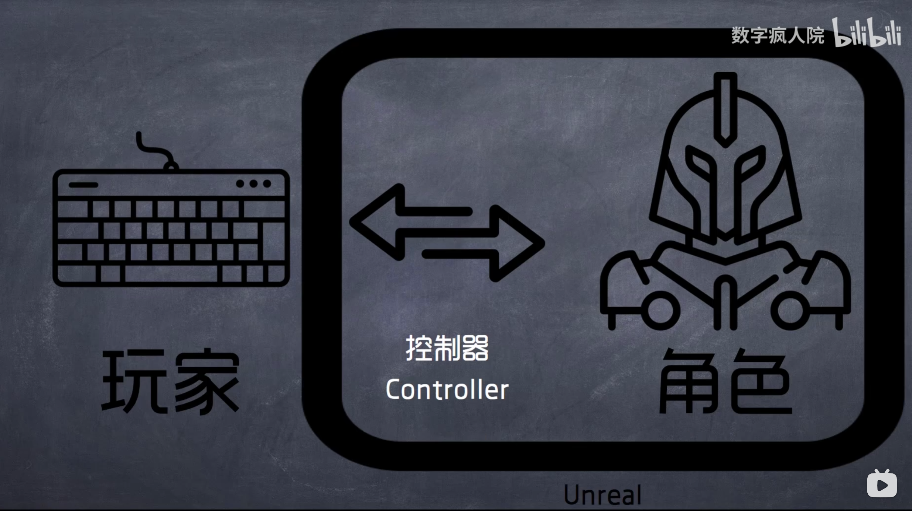

​	**控制器与角色通过游戏模式（GameMode）实现连接**，即在同一个GameMode中要同时设定控制器，以及该控制器需要控制的角色，之后运行游戏才能起作用。

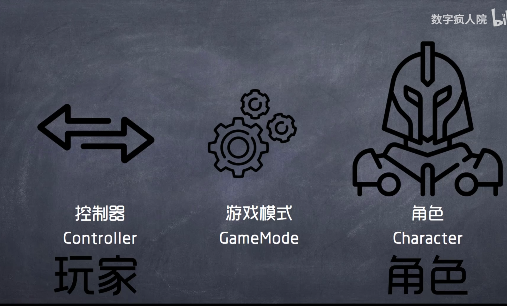

**（下面这段话新手可能不懂，不影响后续的学习）**

​	玩家控制器有一个处理输入的堆栈，这个**堆栈用于存放玩家可以控制的蓝图类**（或者说用于存放可以接收到键盘鼠标等硬件设备的输入的蓝图类），因此当我们想要控制一个蓝图，往往需要在该蓝图中**启用输入**，对此可以使用蓝图节点**Enable Input**，但是玩家所控制的角色通常都要配备**增强输入**，所以初始时不需要调用**Enable Input**，但是后续涉及到玩家控制器与UI交互的时候，就要有选择的禁用掉控制器对角色的输入，此时就需要将角色蓝图从玩家控制器所处理输入的堆栈上面移除掉了。

## 常规蓝图

### 一般蓝图常用节点功能介绍

#### 1、Get Player Controller（获取玩家控制器）

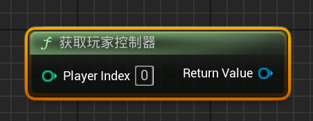

​	Get Player Controller 主要用于在游戏运行时获取玩家控制器（Player Controller）的引用。玩家控制器是一个非常重要的对象，它负责处理玩家的输入、管理玩家的视角和控制游戏的流程，包括但不限于处理玩家的按键操作、鼠标输入、手柄输入，以及控制玩家角色的移动、旋转、与游戏世界的交互等操作。

#### 2、Get Player Pawn（获取玩家Pawn）

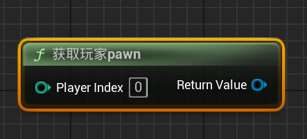

​	Get Player Pawn 用于获取玩家所控制的 Pawn 对象。Pawn 是游戏世界中可操控角色或实体的基类，像玩家角色、AI 控制的敌人等都可能是 Pawn 的子类实例。

​	核心功能是提供对玩家直接操控的游戏实体的访问。通过获取这个对象，开发者能够访问和修改 Pawn 的各种属性、调用其相关函数，从而实现对玩家角色行为的控制与交互。例如，获取玩家的生命值、位置、速度，或者让玩家执行特定动作，如跳跃、攻击等。

#### 3、Destroy Component（销毁组件）

要想销毁指定Actor内部的组件，必须在该目标Actor蓝图内部调用此节点，并指定目标组件，才可以实现组件的销毁。不可以通过其它Actor的蓝图调用此节点销毁该目标Actor的组件，倘若必须实现此功能，可以在目标蓝图下自定义事件并连接此节点，之后可以通过其它Actor调用该目标Actor的自定义事件的方式，实现销毁组件的效果（如下图）。

#### 4、Lerp（插值）浮点型

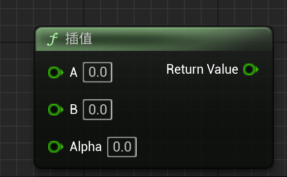

​	基于Alpha的值，在A和B之间进行线性插值。**A可以大于B，A也可以小于B**。

- **Return Value**：返回的是插值计算的结果
- Alpha=0时，A为100%，B为0%，返回A。
- Alpha=1时，A为0%，B为100%，返回B。
- **0<=Alpha<=1时，Return Value返回的值就是介于A和B之间的一个值**，Alpha越接近0，返回值就越靠近A，Alpha越接近1，返回值就越靠近B。
- 通常与**时间轴**配合使用。

#### 5、F插值到（F：float）

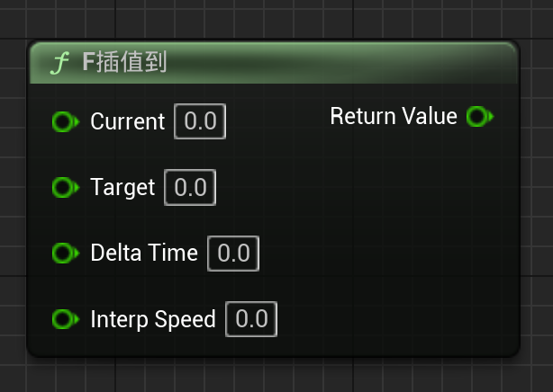

​	基于与当前位置之间的距离，尝试到达目标。**追踪位置时将提供很好的平滑感**。

​	该蓝图节点接收**双精度浮点值**

- **Current**：当前数值（实际位置）。
- **Target**：目标数值（目标位置）。
- **Delta Time**：上次Tick后经过的时间。通常连接**“获取场景差量（秒）”**节点，用于控制插值的流畅度。
- **Interp Speed**：插值速度，如给定速度为0，则跳至目标。
- 比如Current=100，Target=200，Delta Time=获取场景差量（秒），Interp Speed=5，那么每过一帧，当前数值就会＋5并返回（即105、110、115、120…），在到达200之前，每一帧都会返回数值，以此达到平滑的从100过渡到200的效果。

​	举例：在第一人称FPS游戏中，为了使**角色行走动画随角色移动速度平滑改变**，在对角色移动组件中的最大行走速度进行修改时做出了下图所示蓝图。

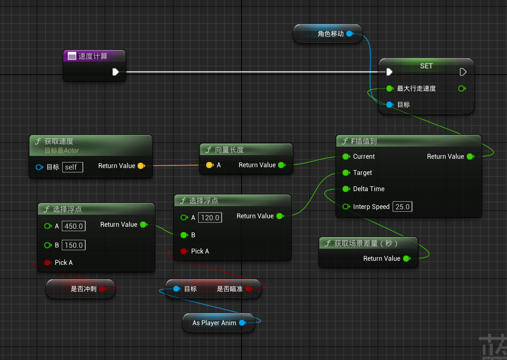

​	这里获得我们**角色实时的移动速度**作为Current的值，通过判断角色是否有在冲刺、瞄准等状态，**动态选择Target速度值**。最后实现实时速度到目标速度的平滑转换

​	因为我们的角色很容易就达到最大行走速度（默认的行走加速度还是挺大的），所以可以看作最大行走速度就是角色的速度，这里动态设置最大行走速度，就可以近似的看作改变角色的速度。

#### 6 、R插值到（R：rotation）

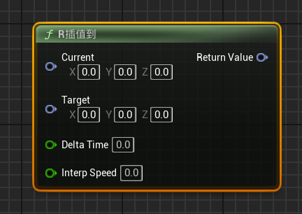

​	该蓝图节点接收**旋转体**

​	节点功能与**“F插值到”**功能类似，不再赘述。

#### 7、Get World Delta Seconds(获取场景差量（秒）)

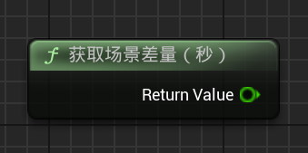

​	返回帧时间差量（秒），由时间膨胀调整。

#### 8、Get Anim Instance（获取动画实例）

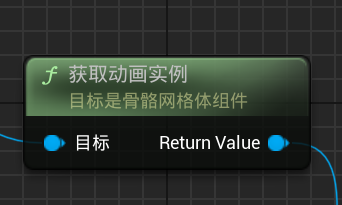

- **目标**：一般连接的就是**网格体组件**，且网格体是骨骼网格体，获取到该网格体的动画实例。
- **Return Value**：返回获取的动画实例。

​	这个节点经常与其它节点配合使用，常见的用法就是**通过网格体获取到这个网格体使用的动画蓝图**，详见下图。

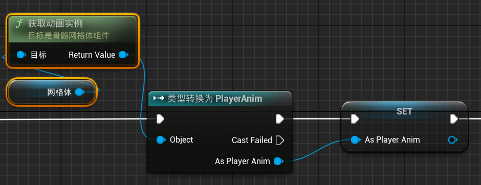

​	将获取到的动画实例类型转换为我们需要的动画蓝图，并保存为一个变量，就**实现了角色蓝图与动画蓝图的蓝图通信**。

#### 9、Add Timeline（添加时间轴）

- **Play**：**从当前时间开始播放**，如果时间轴在此之前没有播放过，那就是从头播放；如果我之前播放过，放到第1秒**Stop**了，那当我再次触发**Play**时，时间轴就会从1秒的位置开始播放。

- **Play from Start**：顾名思义，**从头开始播放时间轴**，即不论时间轴当前停在第几秒，该引脚都会使时间轴从头播放

- **Stop**：**停止时间轴的播放**，比如播放到第2秒**Stop**，那该时间轴就会停在第二秒，如果后面我又出发了**Play**，那就会从第2秒开始播放。

- **Reserve**：**从当前时间开始倒放**，与**Play**机制相似。

- **Reserve from End**：**从时间轴的最后面开始倒放**，与**Play from Start**机制相似，倒放的位置会受到时间轴**长度**和**使用最后一个关键帧***的影响。

- **Set New Time**：根据**New Time**的数值直接将时间轴的**当前时间**调整到**New Time**的时间。比如**New Time**=2，当我触发该引脚的时候就会将时间轴的**当前时间**设置到第二秒的位置。

- **New Time**：设置一个时间数值。

- **Update**：这里是**时间轴在播放过程中持续触发的引脚，是每帧更新的**，一般连接的就是我们希望利用时间轴变化的那些功能，是一个最常用引脚。

- **Finished**：当时间轴播放完毕之后会触发的节点（正向反向播放完都可以），但是中途**Stop**不算播放完，不会触发**Finished**引脚。

- **Direction**：表示**当前播放的方向**，即**快进**或者**快退**。可以与**Finished**一起使用，判断时间轴到底是正向播放完毕还是反向播放完毕（见下图）。

  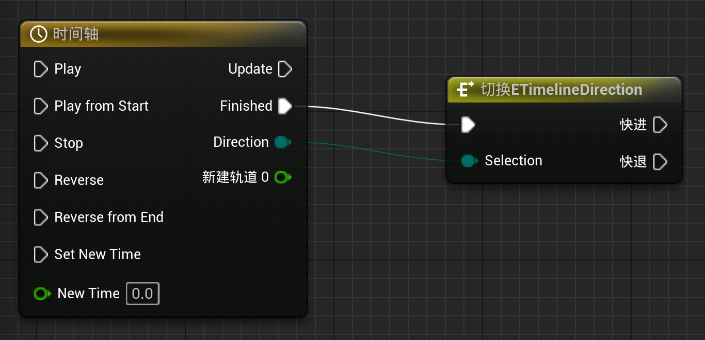

​	当我们希望某些东西在一定时间内过渡时，使用**时间轴**是一个不错的选择。

​	双击时间轴节点，打开设置时间轴的面板，见下图。

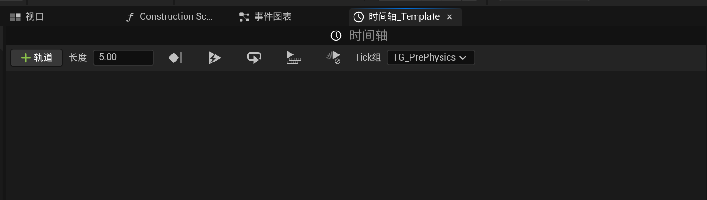

​	点击**轨道**，我们以**浮点型轨道**为例，介绍一下时间轴的使用方法。

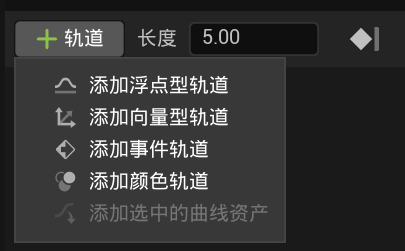

​	添加完**浮点型轨道**之后，可以看到下图所示内容。

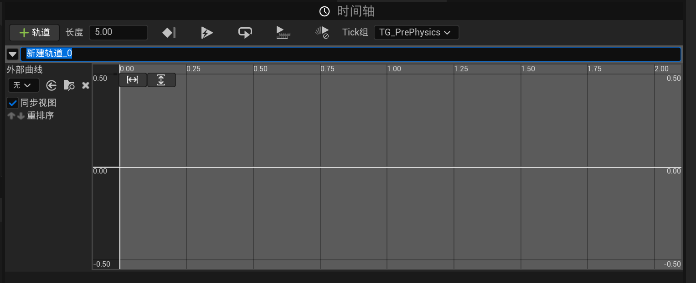

​	首先是最上边那一行**“新建轨道_0”**这是引擎给新建的轨道的默认命名，可以自定义，这里的**命名会直接出现在时间轴节点的输出引脚处**，见下图。

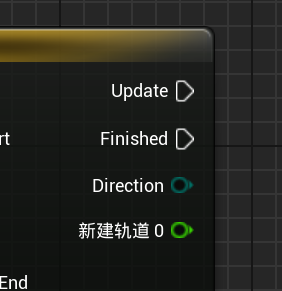

​	**时间轴的横坐标轴，代表的就是时间；纵坐标轴代表的就是该轨道的类型。**

​	这里我们创建的是**浮点型轨道**，那么纵轴的数值就是**浮点值**。

​	在**轨道内部任意区域鼠标右键点击**，选择添加关键帧选项即可为轨道添加一个关键帧。

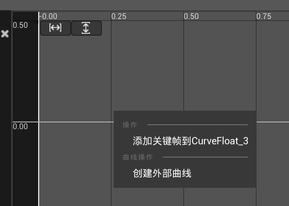

​	这里**不用担心鼠标右键的位置是否准确**，因为添加的关键帧的数值是可以进行修改的。我们只需要框选住需要修改的关键帧，在下图所示区域修改数值即可。

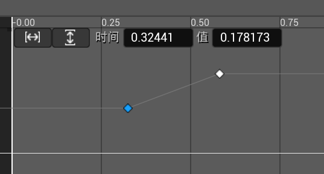

​	图中颜色比较鲜明的点就是我们当前选中的关键帧。**记得输入新数值之后按一下Enter键（回车键）才能生效**。

​	比如我需要时间轴在0->2秒内输出0->1的值，那么我们就需要两个关键帧，一个关键帧为（0，0）、另一个关键帧为（2，1）。

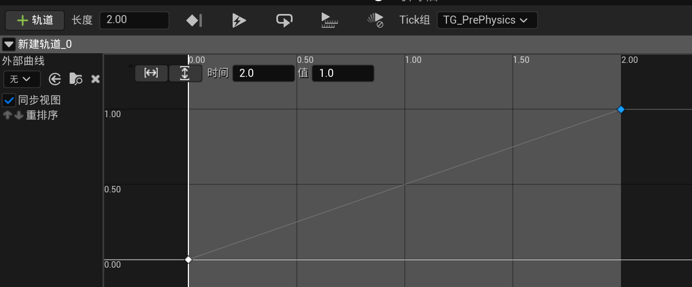

​	与此同时，需要修改**轨道**旁边的**长度**，这里我们希望的是时间轴只有两秒，那就设为2.00，可以看到此时图中2秒以后的部分变为了黑色。这个**长度**代表的就是**时间轴的长度**，而我们的关键帧（2，1）不能决定时间轴的长度，它只是代表我在第二秒有这么一个关键帧，它的值为1，这两种关于时间的数值的含义要搞清楚。

​	如果我这里**长度**设置的是5秒，那么这个时间轴会从0开始一直到5才会结束，反向播放时也会从第5秒开始播放到0，但是我们的需求只有0->2，所以**长度**设置为2，那时间轴如果要倒放，就会从第二秒开始倒放而不是第五秒。

​	设置好这些**关键帧**和**长度**之后，当我们的时间轴开始播放时，节点引脚**“新建轨道_0”**就会根据时间轴的**当前时间**输出**两个关键帧之间的曲线上的浮点值**了，在这里就是逐帧输出从0到1的值。

​	在**长度**右边有5个按钮，它们的作用如下：

- **使用最后一个关键帧**：

  ​	以上图为例，如果选择了该选项，那么我们倒放的时候就会从最后一个关键帧开始播放了，也就是说不论你**长度**那里设置的多长（5秒、10秒、20秒）都行，我倒放的时候都是从最后一个关键帧（2，1）开始的。正放的话也不论**长度**的大小，只会从有关键帧的地方开始播放，播放到最后一个关键帧的位置就结束。

- **自动播放**：

  ​	当勾选该按钮后，时间轴会在蓝图开始运行或满足特定条件时（**即蓝图的实例化创建在场景中的时候就会开始播放，不需要程序运行到时间轴节点**），自动按照设定的时间和曲线等参数开始播放动画或执行相关的时间驱动操作，无需额外的节点或指令来触发其播放。而当取消勾选时，时间轴则不会自动启动，需要通过 “开始时间轴” 等**节点上面的引脚**来手动触发播放（**即会在程序执行到时间轴的时候才会开始播放**）。

  ​	对于需要循环播放的动画，如火焰的跳动、水流的流动等，**“自动播放”** 结合时间轴的**循环**设置，可以让这些动画在场景中持续自动播放，营造出逼真的动态环境效果，无需额外的脚本或节点来不断重复触发动画播放，节省了开发资源和时间。

- **循环**：

  ​	**决定了时间轴在播放到结束后是否会自动重新开始播放**，形成一个循环的播放过程。当启用 “循环” 功能时，时间轴会在到达其设定的结束时间点后，立即从起始时间点开始再次播放，**如此反复，直到时间轴被停止或其他操作改变其状态**。

- **已复制**：

  ​	启用时间轴的 “已复制” 属性后，**时间轴的状态（如播放、暂停、停止）、当前播放位置以及其他关键参数会在服务器端发生变化时，自动同步到所有连接的客户端**。例如，在多人游戏里，若一个角色的动画由时间轴控制，当服务器端该角色的时间轴开始播放动画，开启 “已复制” 就能让所有客户端都同步播放相同的动画。

- **忽略时间膨胀**：

  ​	**时间膨胀**是指在游戏或虚拟环境中，时间流逝的速度可能会因为各种因素（如游戏中的慢动作效果、特定技能或场景设置等）而发生变化。**“忽略时间膨胀”** 这个选项就是用于决定时间轴是否不受这些时间膨胀因素的影响，保持自己独立的时间流逝速度。

  ​	当勾选 “忽略时间膨胀” 后，时间轴将按照自身设定的速度和节奏运行，不会受到游戏整体时间膨胀效果的干扰。例如，在游戏中触发了一个全局的时间变慢效果（时间膨胀），但如果某个时间轴设置了 “忽略时间膨胀”，那么它仍会以正常速度播放动画或执行相关操作，不受全局时间变慢的影响。

​	**时间轴**常常跟**插值**结合起来使用，还记得**插值节点**上的Alpha引脚吗，它接收一个[0,1]的值，根据这个值返回A与B之间的线性插值。比如我们可以让时间轴在0-3秒内输出从0-1的值，我们需要两个关键帧（0，0）和（3，1），之后将**新建轨道**连接到**插值节点**的Alpha上，**就可以实现在3秒里流畅的将数值从A过渡到B**，之后再利用这个流畅的数值过渡去写一些功能等，见下图。

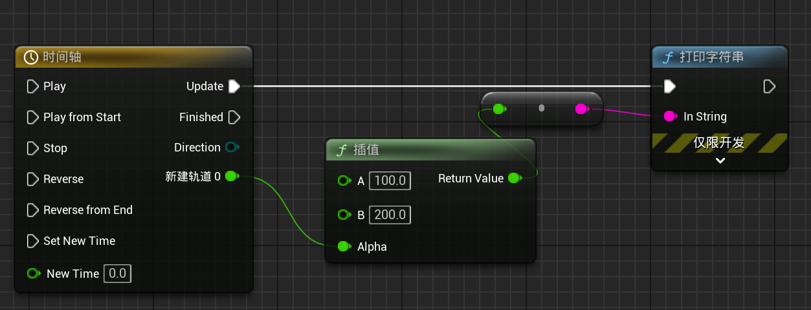

​	上图就实现了一个从100到200慢慢过渡并且输出到屏幕上的功能，效果见下图。

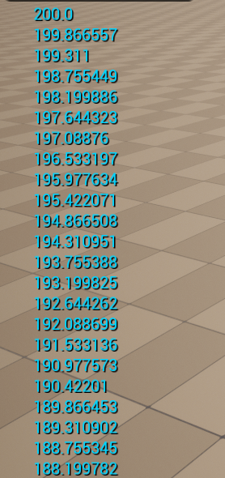

​	输出的数据太长，只截取了部分，但是可以看出数值缓慢过渡的过程，这就是**时间轴**与**插值**结合使用的效果。

​	其实只用**时间轴**也可以实现数值过渡的效果，我们只需要修改两个关键帧为（0，100）和（3，200）即可，但是这样的话一是不方便我们清楚的看到时间轴输出数值的变化范围，二是当我们要修改变化范围时，每次都要点开时间轴，找到对应关键帧进行修改。倒不如**时间轴**与**插值**结合的写法，可以直观的看到也可以轻松的修改数值。

#### 10、Montage Play（蒙太奇播放）

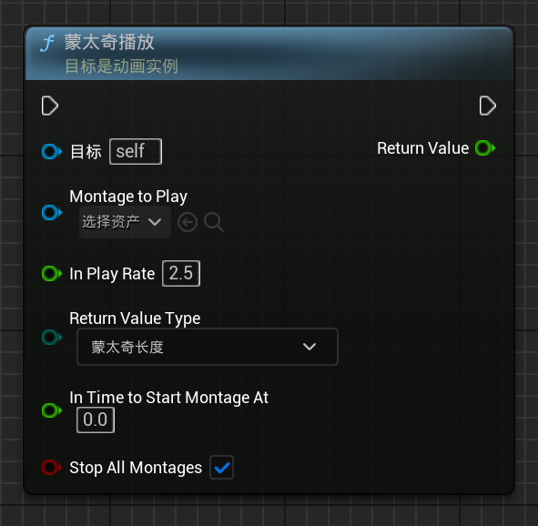

- **目标**：接收的是一个动画实例，这里**需要在哪个动画里面播放蒙太奇，我们就连接哪个动画的动画实例**。

- **Montage to Play**：**选择要播放的蒙太奇资产**，也可以拓展出来一个**Select**节点，根据不同情况选择不同的蒙太奇进行播放。

- **In Play Rate**：**播放速率**，数值大于1时数值越大播放越快，数值小于1时播放会变慢。

- **Return Value Type**：两种类型：蒙太奇长度、时长。

  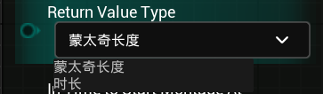

  蒙太奇长度：**Return Value**将返回播放的蒙太奇的**总长度**，按秒计。

  时长：**Return Value**将返回播放的蒙太奇的**播放长度**，按秒计。

- **In Time to Start Montage At**：设置开始播放的时间（即从第几秒开始播放）

- **Stop All Montages**：如果勾选，那么播放该节点的蒙太奇的时候，就会打断这个动画实例的其它所有的蒙太奇的播放。不勾选则反之。

- **Return Value**：一个返回值，值的类型取决于**Return Value Type**引脚的选项

#### 11、Play Montage（播放蒙太奇）

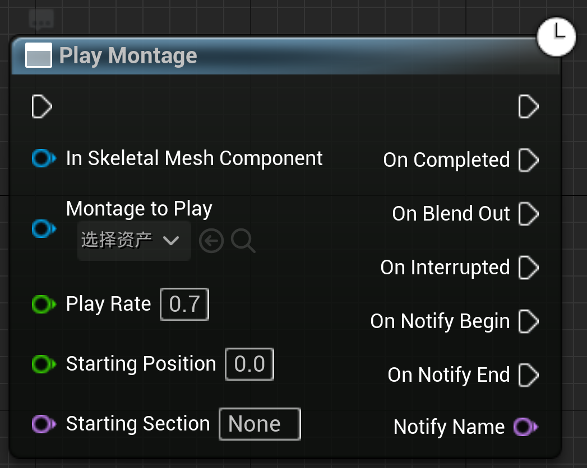

- **In Skeletal Mesh Component**：**该节点的作用目标，是一个骨骼网格体**，这里一般都是连接一个网格体组件的引用。
- **Montage to Play**：**选择要播放的蒙太奇资产**，也可以拓展出来一个**Select**节点，根据不同情况选择不同的蒙太奇进行播放。
- **Play Rate**：**播放速率**，数值大于1时数值越大播放越快，数值小于1时播放会变慢。
- **Starting Position**：**指定动画蒙太奇开始播放的具体时间点**。默认情况下，动画蒙太奇会从时间轴的起始位置（即 0 秒处）开始播放，但通过设置Starting Time的值，可以让动画从蒙太奇时间轴上的任意位置开始。
- **Starting Section**：**用于指定动画蒙太奇开始播放的具体片段**。**动画蒙太奇可以被划分为多个不同的命名片段（Section）**，每个片段可能包含不同的动画内容，通过设置Starting Section，就能**让动画从指定的片段开始播放**，而非总是从动画蒙太奇的开头启动。
- **On Completed**：**完成时**，当**蒙太奇播放到结尾**之后就会触发该引脚。
- **On Blend Out**：**混出时**，蒙太奇混出之后会触发的引脚。
- **On Interrupted**：**中断时**，蒙太奇播放中断时会触发的引脚。
- **On Notify Begin**：**通知开始时**，在动画蒙太奇播放过程中，当特定的通知（Notify）开始触发时会被调用的事件。可以在动画播放到某个特定点时，执行一些自定义的逻辑或操作。首先需要在动画蒙太奇的时间轴上放置通知（Notify）对象。这些通知可以在特定的时间点触发，当动画播放到这个时间点时，On Notify Begin事件就会被触发。
- **On Notify End**：**通知结束时**，与上面同理，在蒙太奇动画里面的通知结束时（一般通知有开始就会有结束，两个是一对）会触发该引脚。
- **Notify Name**：返回通知的命名。

#### 12、Spawn Actor from Class（从类生成Actor）

​	一般用于生成蓝图类的实例

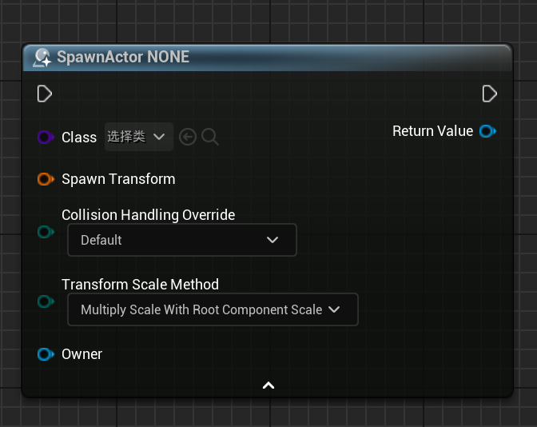

- **Class**：**指定要生成的 Actor 类**，决定了生成的对象类型。

- **Spawn Transform**：包含位置、旋转和缩放的**FTransform**结构体，用于指定 Actor 出现的位置、方向和大小。如果我们要在角色身上生成武器、装备等物品的话，这里可以拉出来一个空的**FTransform**结构体，然后**后面再去设置物品要绑定的骨骼**，因为你早晚都要绑定到骨骼上，所以生成它的位置也就不重要了。

- **Collision Handing Override**：决定在生成时如何处理碰撞，可设置为不同的碰撞处理模式，如覆盖、忽略等。

  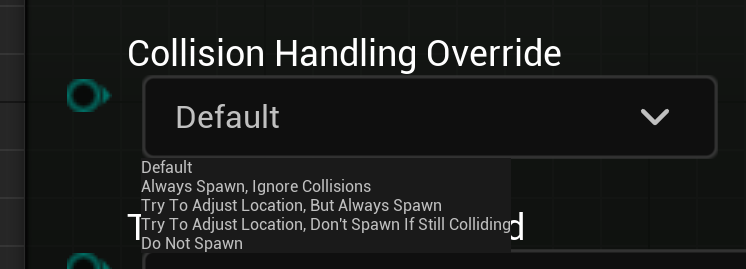

  1. **Default**（默认）：使用默认的碰撞处理行为，具体行为可能取决于项目的设置或其他相关因素，**一般不建议使用，除非明确知道默认行为能满足需求**，通常还是需要根据具体情况选择更明确的碰撞处理选项，以确保生成的 Actor 行为符合预期。
  2. **AlwaysSpawn,Ignore Collision**（固定生成，忽略碰撞）：**无论生成位置是否与其他物体重叠，都会无条件地生成 Actor**。即使目标位置已经被其他具有碰撞体的 Actor 占据，新的 Actor 也会直接生成在该位置，可能会导致两个 Actor 重叠在一起，这种方式适用于一些不考虑碰撞或者需要强制生成的情况，比如生成特效、某些不与其他物体产生碰撞交互的提示信息等。
  3. **Tty To Adjust Location,But Always Spawn**（尝试调整位置，但固定生成）该选项会尝试调整生成 Actor 的位置以避免与其他物体发生碰撞。如果检测到指定的生成位置与场景中已存在的物体碰撞体有重叠，引擎会自动寻找附近的无碰撞空间来放置新生成的 Actor。**无论是否能够成功调整位置以避开碰撞，都会始终生成 Actor，不会因为碰撞而取消生成操作**。
  4. **Try To Adjust Location,Don’t Spawn Id Still Colliding**（尝试调整位置，如仍然碰撞则不生成）：**尝试调整 Actor 的位置以避免碰撞，如果能够找到合适的无碰撞位置，就会在调整后的位置生成 Actor；如果找不到，即无法通过调整来避免碰撞，则不会生成**。此选项在既希望 Actor 尽量生成在指定位置附近，又要避免与其他物体碰撞的场景中比较实用，比如生成车辆时，尽量将其放置在道路上，如果道路上有其他车辆或障碍物，就尝试在附近的空位生成，若附近也没有合适位置，就不生成。
  5. **Do Not Spawn**（不生成）：**如果检测到生成位置与其他物体的碰撞体发生重叠，则不会生成 Actor**。引擎会进行碰撞检测，若发现冲突，就放弃生成操作，这在确保 Actor 生成在合理空间、避免重叠或冲突的场景中很有用，例如在生成角色或道具时，要保证它们不会生成在墙壁或其他障碍物内部。

- **Transform Scale Method**：决定了如何对生成 Actor 的变换（Transform）进行缩放操作，**该参数可以为空，一般情况下不需要使用**。

  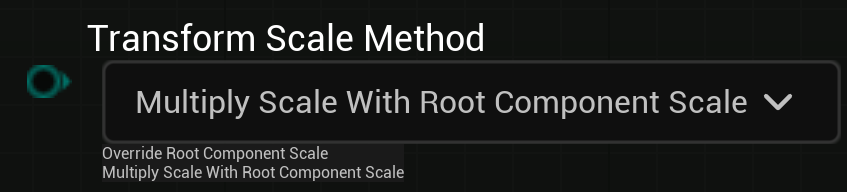

  1. **Override Root Component Scale**：使用 Actor 中某个组件（如静态网格体组件）的缩放值来覆盖默认的变换缩放。这种方式允许你基于组件的实际缩放情况来确定 Actor 的最终大小。
  2. **Multiply Scale With Root Component Scale**：将 Actor 类的默认缩放值与你在节点中指定的缩放因子相乘，得到最终的缩放结果。这意味着生成 Actor 的大小是基于其默认大小进行比例缩放的。

- **Owner**：指的**是生成Actor的所有者，通常是控制该Actor的对象**。在游戏逻辑中，它用于建立一种对象之间的归属关系，以便进行各种操作和管理，比如权限控制、生命周期管理、数据传递等。

- **Instigator**：通常是引发生成行为的对象，侧重于表示行为的触发者，**比如攻击的来源导致生成了爆炸特效Actor，这个攻击者就是Instigator**。

- **Return Value**：返回的是该节点生成的对象的引用。

#### 13、Attach Actor To Component（将Actor附加到组件）

​	该节点允许你动态地将一个 Actor 连接到另一个 Actor 的特定组件上，形成一种层次化的关系。这种关系使得被附加的 Actor 会继承父组件的变换（位置、旋转和缩放），就好像它们是一个整体一样。这在很多场景中都非常有用，比如角色装备武器、车辆挂载配件等。

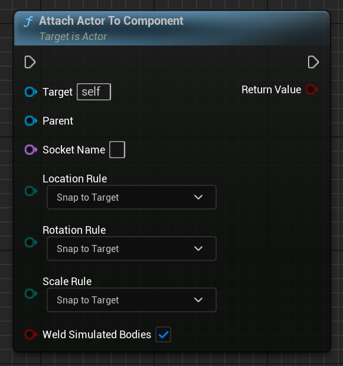

- **Target**：需要附加的 Actor。这是你想要连接到其他组件上的目标 Actor。
- **Parent**：目标父组件。指定要将**Target**附加到哪个组件上（这个**“哪”**就是**Parent**），这个组件通常属于另一个 Actor。
- **Socket Name**：**插槽名称（可选）**。许多组件（如骨骼网格体组件）可以定义插槽，插槽是组件上的特定位置。通过指定插槽名称，可以将**Target**精确地附加到**父组件的特定插槽位置**上。如果不指定插槽名称，**Target**将**附加到父组件的根位置**。比如说，上面的**Parent**连接的是一个**网格体组件**，那么我们就可以通过在这里填写**网格体组件具体应用的骨骼网格体里面的骨骼插槽**，之后**Target**就会生成在对应插槽的位置。
- **Location Rule**：位置变换规则。
- **Rotation Rule**：旋转变换规则。
- **Scale Rule**：缩放变换规则。
- **上述三种变换里面都有下面三个选项**
  1. **Keep Relative**：选择此规则时，**Target**会保持其相对于**Parent**（父组件）的当前位置、旋转和缩放。也就是说，**Target**会以它在附加瞬间相对于父组件的姿态为基准，之后跟随父组件移动、旋转和缩放。
  2. **Keep World**：此规则会让**Target**在附加到**Parent**（父组件）后，保持其在世界空间中的当前位置、旋转和缩放。父组件的移动、旋转和缩放不会影响**Target**在世界中的绝对位置，除非父组件的变换直接作用于**Target**所附加的点。
  3. **Snap To Target**：当选择**Snap To Target**规则时，**Target**会立即对齐到**Parent**（父组件）的位置和旋转。它会忽略**Target**原来的位置和旋转，直接将其移动到父组件的位置，并与父组件的旋转方向一致。
- **Weld Simulated Bodies**：焊接模拟物体（仅适用于物理模拟组件）。如果父组件是一个物理模拟的组件（如物理网格体），勾选此选项将使**Target**的物理模拟与父组件焊接在一起，它们将作为一个整体进行物理模拟。
- **Return Value**：返回是否附加成功的布尔值。

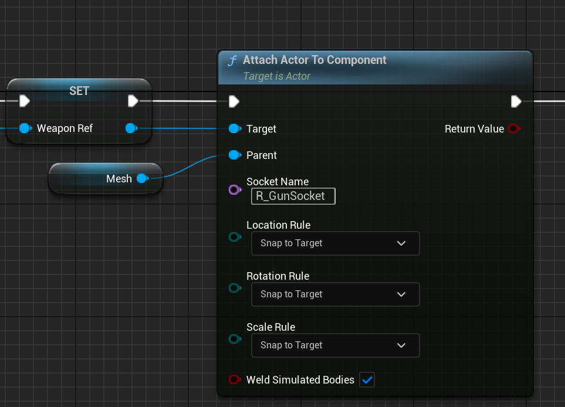

​	如上图所示，其作用就是将武器蓝图类生成的实例附加到角色蓝图类里的网格体组件其中的骨骼插槽里，从而实现了角色手拿武器的效果，这样做会比直接把武器模型放在角色蓝图里面要好很多，因为实现了角色和武器的分离，那我们就可以把一些功能单独写在武器蓝图里面了。

#### 14、Attach Component To Component（将组件附加到组件）

​	该节点与Attach Actor To Component（将Actor附加到组件）用法类似。

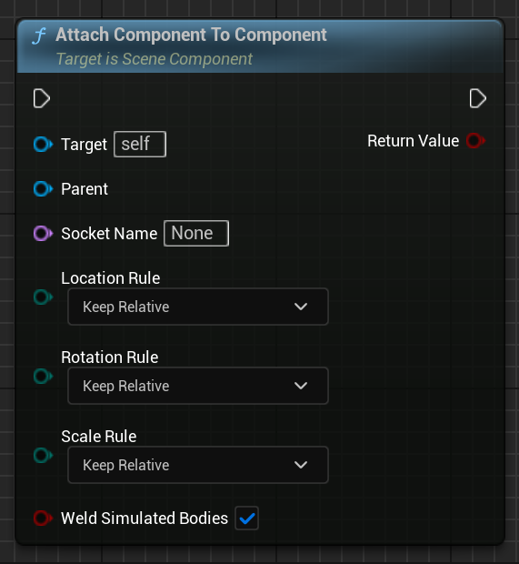

​	除了**Target是一个场景组件之外**，其余的设定与Attach Actor To Component（将Actor附加到组件）几乎一样，因此该组件不再赘述。

#### 15、Set Timer by Function Name（以函数名设置定时器）

​	提供了一种动态调用函数的方式，通过指定函数名称和时间间隔，可以实现定时执行特定逻辑的功能。这在游戏开发中非常有用，例如实现技能冷却、定时刷新、延迟执行某些操作等。

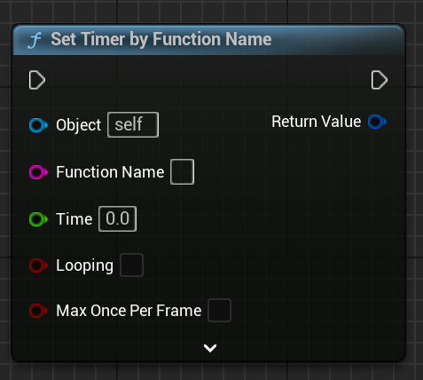

- **Object**：指定要调用函数的目标对象。通常是一个 Actor 或 UObject，定时器将在这个对象上查找并调用指定名称的函数。

- **Function Name**：要调用的函数的名称（也可以是自定义事件）。这个函数必须在目标对象的类中定义，并且其签名（参数和返回值）需要符合一定的要求（通常是无参数、无返回值的函数）。

- **Time**：定时器的时间间隔，单位为秒。表示从设置定时器开始，经过多长时间后调用指定的函数。

- **Looping**：一个布尔值，用于指定定时器是否循环执行。如果设置为 true，则定时器会在每次函数调用后重新启动，按照指定的时间间隔不断循环调用函数；如果设置为 false，则定时器只会执行一次函数调用。

- **Max Once Per Frame**：当我们设置某个功能为 “Max Once Per Frame” 时，就是要保证该功能在同一帧里不会被重复执行，以此避免出现逻辑错误或者性能问题。

- **Return Value**：传递给其它定时器函数以操作此定时器的定时器句柄。定时器句柄是识别和控制特定定时器的标识。通过这个句柄，可以在后续对定时器进行各种操作，比如停止定时器（Clear Timer）、暂停定时器等。例如，当角色死亡时，需要停止之前设置的技能冷却定时器，就可以使用对应的定时器句柄来实现。

  ​	在一个对象中可能会设置多个定时器，如果没有定时器句柄来区分，就无法准确地控制某个特定的定时器。每个定时器句柄唯一对应一个定时器，保证了对定时器操作的准确性。

#### 16、 Clear Timer by Function Name（以函数名清除定时器）

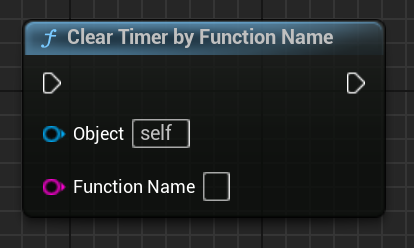

- **Object**：指定要调用函数的目标对象。通常是一个 Actor 或 UObject，定时器将在这个对象上查找并调用指定名称的函数。
- **Function Name**：要清除的函数的名称（也可以是自定义事件）。这个函数必须在目标对象的类中定义，并且其签名（参数和返回值）需要符合一定的要求（通常是无参数、无返回值的函数）。

#### 17、Event Hit（事件命中）

​	Event Hit是一种碰撞事件，当带有碰撞体的两个物体发生碰撞时就会触发该事件。它能够捕获碰撞瞬间的详细信息，比如碰撞发生的位置、碰撞的力度、参与碰撞的物体等，开发者可以基于这些信息编写相应的逻辑代码。

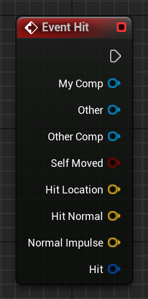

- **My Comp**：在一些复杂的角色或物体模型中，可能包含多个碰撞组件，比如角色的手部、脚部、身体等部位都有各自的碰撞体。通过 My Comp，可以明确是哪个部位的组件参与了碰撞，从而执行不同的逻辑。例如，当角色与敌人发生碰撞时，如果 My Comp 表明是手部碰撞，可能触发攻击逻辑；如果是脚部碰撞，可能触发绊倒或防御逻辑。

- **Other**：**该引脚会返回与自身 Actor 发生碰撞的另一个 Actor 对象**。通过获取这个 Actor，开发者可以访问其属性和调用其方法。例如，在一个动作游戏里，当玩家角色（自身 Actor）与敌人（Other Actor）碰撞时，可通过访问敌人的生命值属性来进行伤害计算，或者调用敌人的受击动画播放方法。

- **Other Comp**：此引脚返回与自身组件发生碰撞的**另一个 Actor 上的具体组件**。在复杂的 Actor 结构中，一个 Actor 可能包含多个碰撞组件，**利用 “Other Component” 能精确知晓是哪个组件参与了碰撞**。比如，在赛车游戏中，当玩家的赛车与另一辆赛车碰撞时，可通过 “Other Component” 判断是碰撞到了对方赛车的车头、车尾还是车身侧面的组件，从而实现不同的碰撞效果。

- **Self Moved**：拥有该事件逻辑的 Actor（可简单理解为游戏中的一个对象，如角色、道具等）自身位置发生了移动。当这个 Actor 在世界场景中的位置坐标改变时，就会触发与 “Self Moved” 相关的逻辑。

- **Hit Location**：**返回碰撞发生的具体位置**，以世界坐标的形式呈现。这个位置信息在很多场景中都非常有用，比如在碰撞处生成特效、判断碰撞发生的具体区域等。在射击游戏中，可以根据 “Hit Location” 在子弹击中的位置生成弹坑特效。

- **Hit Normal**：**碰撞点的法线方向**，也是一个向量值。法线方向对于确定碰撞的角度非常重要，在一些需要考虑碰撞角度的逻辑中会用到。例如，在光线反射模拟中，根据碰撞法线方向可以计算光线反射的方向。

- **Normal Impulse**：**表示碰撞产生的冲量**，是一个向量值，其方向和大小反映了碰撞的力度和方向。在物理模拟相关的逻辑中，这个冲量信息可以用于计算物体碰撞后的运动状态改变，如反弹的方向和速度等。例如，在台球游戏中，根据碰撞冲量可以准确模拟台球碰撞后的运动轨迹。

- **Hit**：包含了关于碰撞的详细信息的结构体，是一个更全面的**命中结果**数据集合。该引脚的变量类型就叫**命中结果**它整合了前面提到的一些信息，同时可能还包含其他额外的碰撞相关数据，如碰撞的时间戳、碰撞的摩擦系数等。开发者可以根据具体需求从这个结构体中提取所需的信息进行更复杂的逻辑处理。

  ​	如果将Hit引脚返回的东西进行**break**的话，可以得到**下图所示输出引脚**。

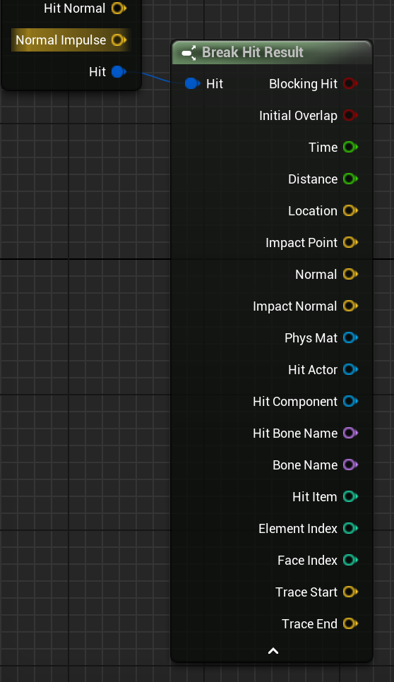

- **Blocking Hit**：**如果存在阻挡命中，返回true，否则返回false**，就是自身actor与碰到的actor如果是因为阻挡触发的这个事件的话，就返回true。

- **Initial Overlap**：**如果命中在一个初始重叠中开始，则为true**，就是发生碰撞的两个actor如果是因为碰撞体积一开始重叠在一起而发生的碰撞的话，就是true。

  ​	在此情况下（为true时），一些值应被另行解释。**Time**将为0，**Impact Point**等于**Location**，法线将相等并指出一个反向穿透向量。

- **Time**：沿追踪方向的追踪时间，范围[0,1)。如发生命中则返回**开始和结束之间**的时间，如无命中则为1。

- **Distance**：从**Trace Start**到场景空间中**Location**的距离，如果存在初始重叠，则为0。

- **Location**：碰撞位置，相比于**Impact Point**而言会有一丢丢的误差。以球体碰撞墙壁举例，这个**Location的位置其实就是球体碰到墙壁时球心的位置**。

- **Impact Point**：碰撞点，比**Location**更精准，以球体碰撞墙壁举例，**Impact Point**就是球体表面与墙面的接触点的位置。

- **Normal**：场景空间中命中的法线，用于被扫描的对象。

- **Impact Normal**：是一个向量，代表碰撞点的表面法线方向。简单来说，它指示了碰撞表面的朝向。

- **Phys Mat**：即物理材质（Physical Material），这里返回的是被命中的物体的物理材质，在游戏开发中我们可以根据命中的不同材质为玩家提供不同的碰撞音效、碰撞特效，碰撞后的物体运动方式等。

- **Hit Actor**：返回与当前物体发生碰撞的另一个 Actor 对象。Actor 是虚幻引擎中游戏对象的基类，像角色、道具、场景物体等都可以是 Actor。

- **Hit Component**：返回与自身发生碰撞的另一个 Actor 上的具体碰撞组件。一个 Actor 可能包含多个不同的碰撞组件，用于实现不同部位的碰撞检测。

- **Hit Bone Name**：命中骨骼的命名（仅在命中骨骼网格体时有效）

- **Bone Name**：命中追踪骨骼的名称（仅在命中骨骼网格体时有效）

- **Hit Item**：基元特定的数据，记录基元中被命中的项目。

- **Element Index**：与拥有多个部分的图元碰撞时，被命中部分的索引。

- **Face Index**：与三角网格图或地面碰撞时，被命中面的索引

- **Trace Start**：碰撞检测射线或形状的起始点。在进行碰撞检测时，从该起始点开始朝着指定方向或范围进行检测，以判断是否与其他物体发生碰撞。例如，在第一人称射击游戏中，当玩家开枪时，子弹的碰撞检测射线的起始点可以设置为枪械的枪口位置（Trace Start），这样能确保从枪口处开始准确检测子弹是否命中目标。

- **Trace End**：碰撞检测射线或形状的结束点。

- **Trace Start**通常需要与**Trace End**（追踪结束点）配合使用。这两个点共同确定了检测射线或形状的范围。例如，在进行射线追踪时，从**Trace Start**到**Trace End**形成一条射线，引擎会检测这条射线是否与其他物体相交。通过调整**Trace Start**和**Trace End**的位置，可以改变检测的距离和方向。

**触发条件**

- **碰撞体设置**：参与碰撞的物体必须具备碰撞体组件，像 Box Collision（盒状碰撞体）、Sphere Collision（球状碰撞体）、Capsule Collision（胶囊状碰撞体）等。并且，这些碰撞体需要开启碰撞检测功能。
- **碰撞响应**：碰撞体之间的碰撞响应设置也会影响 Event Hit 事件的触发。例如，将一个物体的碰撞响应设置为 “Block”（阻挡），另一个物体的碰撞响应设置为与之匹配的可碰撞状态，这样当它们接触时才会触发碰撞事件。

#### 18、Spawn Decal Attached（生成贴花已附加）

​	生成一个附加并跟随特定组件的贴花，不进行复制。比如子弹击中墙体或地面留下的弹孔，就可以以贴花的形式生成在子弹与物体碰撞的表面。

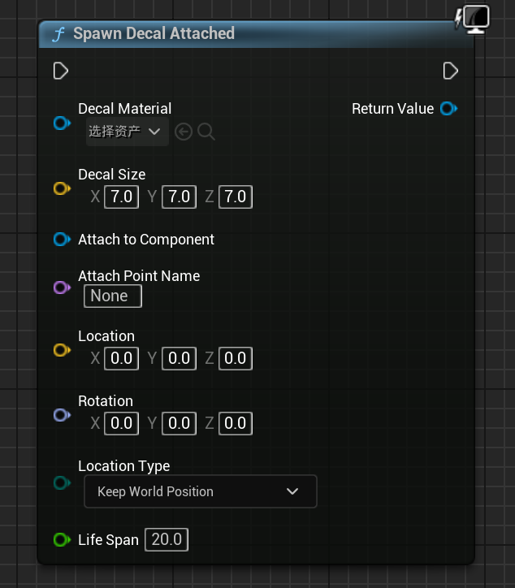

- **Decal Material**：这里需要我们选择自己准备的材质资产，，

- **Decal Size**：贴花的大小

- **Attach to Component**：要附加到的组件，比如子弹命中丧尸，那么这里就是丧尸中被子弹命中的组件。

- **Attach Point Name**：要附加到的插槽或者骨骼的名字。

- **Location**：**贴花附加的位置**，一般这里都是与**Event Hit**里面的**Impact Point**相连接，因为用**Impact Point**描述命中点更加精准一些。

- **Rocation**：这里一般用于连接**Event Hit**里面的**Impact Normal**法线（理论上不能直接连，但是引擎会自动获取法线的X向量旋转之后再脸上这里的**Rocation**），因为贴花一般都是需要垂直于一个面才能完整看到。所以使用贴花前需要检查一下贴花的箭头指向哪里，方便这里的使用。

- **Location Type**：控制贴花的生成位置

  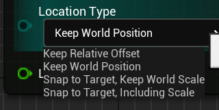

- **Life Span**：贴花生成时间，按秒计。

#### 19、Spawn Sound at Location（在位置处生成音效）

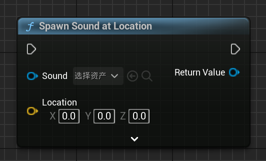

- **Sound**：音效资产。
- **Location**：音效播放的位置，一般就是世界场景中的位置。

#### 20、Spawn Emitter at Location（在位置处生成发射器）

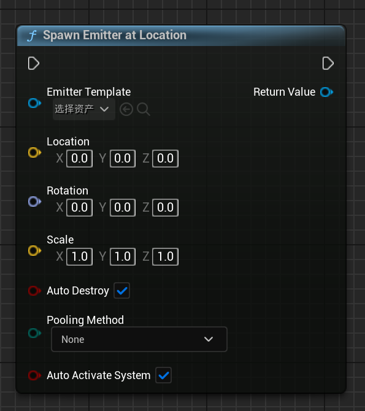

- **Emitter Template**：选择粒子特效资产，要创建的粒子系统。
- **Location**：在场景空间中放置的位置。
- **Rocation**：在场景空间中放置的旋转。
- **Sclae**：在场景空间中效果的范围大小。
- **Auto Destroy**：粒子系统播放完毕后，组件将被自动销毁，还是可被重新启用。
- **Pooling Method**：池化方法，是一种数据降维或特征提取的技术，它通过对数据的局部区域进行聚合操作，将数据的规模减小，同时保留数据的关键特征，降低数据的维度和计算量，提高模型的效率和泛化能力。（目前不清楚各个选项的作用，不常用，有缘再补充）
- **Auto Activate System**：自动激活系统，勾选后粒子系统会自动开始播放。如果不勾选，则粒子特效不会出现，默认都是勾选。

#### 21、Add Impulse（添加冲量）

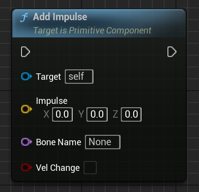

- **Target**：被添加冲量的目标，比如子弹击中丧尸，那么丧尸就是这个**Target**。
- **Impulse**：要应用的冲量的量级和方向，这里接收一个向量。
- **Bone Name**：如果**Target**是一个骨骼网格体的话，这里还可以为具体的骨骼添加冲量，如果为空，那就默认为root骨骼添加。
- **Vel Change**：如果为True，力量将被是为速度的变化，而非冲量的变化（即质量无效果）。比如子弹命中了一个方块，如果为false，那么方块会自身获得一个冲量，表现为被我们击退，如果为true，那么方块会直接拥有一个**Impulse**一样的速度，那就会直接飞走。因此二者的效果不一样，一般True情况下的击飞效果会很离谱。

#### 22、Get Socket Transform（获取插槽变换）

​	常用于获取骨骼网格体的某一骨骼的变换（位置，旋转，缩放）

- **Target**：目标是场景组件，常用于连接骨骼网格体，获取其中骨骼变换。

- **In Socket Name**：插槽（或骨骼）的命名

- **Transform Space**：变换空间

  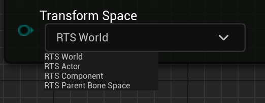

  1. **RTS World**：场景空间变换
  2. **RTS Actor**：Actor空间变换
  3. **RTS Component**：组件空间变换
  4. **RTS Parent Bone Space**：父骨骼空间变换

- **Return Value**：返回对应命名的插槽（或骨骼）的**Transform**（变换），包括位置、旋转、缩放。

#### 23、AI Move To

**必要条件**

- **导航网格生成**：场景中必须放置 **NavMesh Bounds Volume** 并构建导航网格（按 `P` 键显示绿色可行走区域）。
- **AI 控制器**：AI 角色需绑定 **AIController** 类（默认使用 `AIController` 或自定义派生类）。

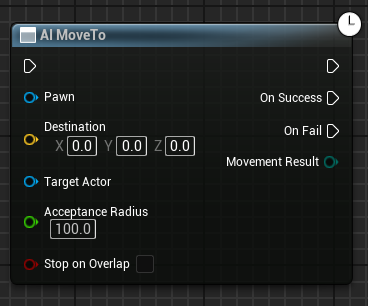

- **Pawn**：需要移动的蓝图类（要有角色移动组件），通常是连接一个Self节点。

- **Destination**：**Pawn**要前往的位置坐标。

- **Targer Actor**：**Pawn**追逐的目标Actor，与上面的**Destination**作用一样，只不过换了目标，可以灵活选择使用。

- **Accepatance Radius**：**Pawn**会在距离目标**Accepatance Radius**的数值时停止移动（单位：cm）。

- **Stop on Overlap**：是否在接触目标时停止（True适合近战攻击，False适合保持距离）。

- **On Sucess**：当 AI 成功到达目标位置或完成指定移动任务时，“On Success” 引脚会被触发，这就像是一个信号开关，告知系统移动操作已经成功完成。

- **On Fail**：当 “On Fail” 引脚被触发时，会启动预设的错误处理逻辑。例如，让 AI 尝试重新规划路径并再次移动，或者执行一些备用操作，如返回原点、等待进一步指令等，以保证系统的稳定性和可靠性，避免 AI 因移动失败而陷入无响应或异常状态。

- **Movement Result**：指的是 AI 移动操作的结果反馈，包含移动是否成功、移动的状态以及相关的详细信息等。

  **常见类型**

  1. **成功到达**：AI 成功移动到目标位置，通常会附带一些额外信息，如实际移动路径长度、移动所花费的时间等。比如在游戏中，AI 角色成功到达任务地点，此时 “Movement Result” 会显示成功，并可能给出角色从起点到目标点的行走距离和耗时。
  2. **失败未达**：AI 未能移动到目标位置，可能由于各种原因导致，如路径被阻挡、目标位置不可达、移动过程中出现错误等。同时会有相应的错误代码或提示信息，帮助开发者确定失败原因。例如在机器人导航中，若前方出现意外的障碍物导致机器人无法到达目标地点，“Movement Result” 会显示失败，并提示障碍物相关信息。
  3. **正在移动**：表示 AI 正在朝着目标位置移动的过程中，还未到达目标。这种结果可以让系统实时了解 AI 的移动状态，以便进行后续的操作或判断。比如在实时监控系统中，可以根据 “Movement Result” 为 “正在移动” 来持续跟踪 AI 的当前位置和移动方向。
  4. **中断移动**：AI 在移动过程中由于某些特殊情况而中断，如收到更高优先级的指令、检测到危险情况等。此时 “Movement Result” 会显示中断，并可能说明中断的原因。例如在自动驾驶场景中，若检测到前方有突发的危险状况，车辆 AI 的移动会中断，“Movement Result” 会显示中断并指出是因为检测到危险。

#### 24、Apply Damage（应用伤害）

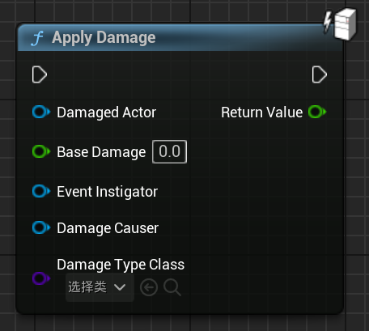

- **Damaged Actor**：需要收到伤害的Actor。
- **Base Damage**：伤害值。
- **Event Instigator**：负责输出此伤害的控制器（可以不连）。
  1. **伤害溯源与责任认定**：明确伤害的发起者，用于确定是哪个实体或控制器触发了伤害事件。比如在多人游戏中，能清楚地知道是哪个玩家的操作或 AI 的行为导致了目标受到伤害，便于进行后续的统计、计分等操作，也有助于判断游戏中的行为是否符合规则等。
  2. **权限与逻辑控制**：基于 “Event Instigator” 来设置不同的权限和逻辑。例如，某些特殊角色或拥有特定权限的控制器作为 “Event Instigator” 时，可能会造成更高的伤害，或者能够触发一些特殊的伤害效果；而普通的 “Event Instigator” 则只能造成常规伤害。
  3. **AI 行为决策依据**：对于 AI 来说，“Event Instigator” 可以作为其行为决策的重要依据。当 AI 受到伤害时，通过获取 “Event Instigator” 的信息，AI 可以判断攻击者是谁，从而决定采取何种应对策略，如反击、逃跑、呼叫支援等。
  4. **交互与反馈机制**：在游戏或应用中，“Event Instigator” 可以用于触发与伤害相关的交互和反馈。比如当玩家角色作为 “Event Instigator” 对敌人造成伤害时，敌人可能会根据玩家的身份、武器等信息做出不同的反应，如特定的语音回应、表情变化等，增加游戏的趣味性和真实感。
  5. **多角色协作与竞争**：在有多个角色或团队参与的场景中，“Event Instigator” 有助于实现协作和竞争机制。比如在团队战斗中，通过识别 “Event Instigator” 可以判断是己方队友还是敌方角色造成的伤害，进而进行团队伤害统计、治疗分配等操作；在 PVP 竞技中，也能根据 “Event Instigator” 来确定玩家的击杀数、伤害排名等
- **Damage Causer**：实际输出伤害的Actor，比如玩家控制器丢出了一个手雷，炸死了怪物，那么玩家就是前面的**Event Instigator**，而怪物是被手雷的伤害炸死的，这里的手雷就是**Damage Causer**。
- **Damage Type Class**：伤害类型。
  1. **定义伤害类型**：用于指定所施加伤害的具体类型。比如在游戏中，可以通过该引脚设置不同的伤害类型，如物理伤害、魔法伤害、火焰伤害、电击伤害等。不同的伤害类型在游戏中可能会有不同的表现和效果，这有助于实现丰富多样的战斗机制和游戏玩法。
  2. **实现伤害差异化**：基于不同的 “Damage Type Class”，可以对目标造成不同程度和方式的伤害。例如，物理伤害可能会根据目标的物理防御属性来计算最终伤害值，而魔法伤害可能会受到目标的魔法抗性影响。通过这种方式，能够使游戏中的各种攻击手段和技能具有不同的特点和效果，增加游戏的策略性和可玩性。
  3. **触发特定效果**：与游戏中的其他系统或机制相关联，触发特定的效果或事件。例如，当施加火焰伤害（特定的 “Damage Type Class”）时，可能会使目标进入燃烧状态，持续损失生命值；施加冰冻伤害可能会使目标被冻结，无法移动或进行攻击等。
  4. **方便伤害管理与平衡**：对于游戏开发者来说，“Damage Type Class” 引脚便于对游戏中的伤害进行统一管理和平衡调整。可以通过修改不同伤害类型的参数和属性，来调整游戏中各种攻击和防御机制的平衡，确保游戏的公平性和趣味性。
  5. **支持游戏剧情和任务**：根据游戏剧情和任务的需要，设置特定的伤害类型来推动游戏进程。比如在某个任务中，玩家需要使用特定的伤害类型才能对特定的敌人或障碍物造成有效伤害，从而完成任务或解锁新的剧情。
- **Return Value**：最终应用到Actor的实际伤害（浮点型）。

#### 25、Sphere Trace by Channel（按通道进行球体检测）

该节点为一个检测节点，它通过在场景中投射一个球体来检测与其他物体的碰撞情况。

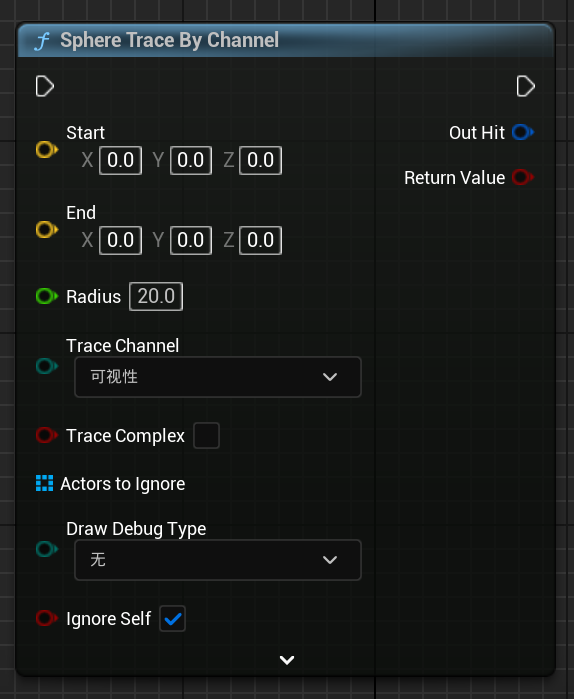

- **Start**：指定球体追踪的起始位置，通常是一个三维向量（Vector），代表世界空间中的一个点。

- **End**：指定球体追踪的结束位置，同样是一个三维向量。从起始点到结束点定义了球体移动的路径。

  ​	如果**Start**和**End**的位置一样，那么整个检测的范围就是一个球形的范围。

  ​	如果**Start**和**End**的位置不一样，那么检测范围就是从**Start**位置开始到**End**位置结束，**中间的每一个位置都会有一个球体不断地进行检测**，这种检测的形状看起来**像是胶囊体**，**实际上是一个个球体连接起来的**。

- **Radius**：球体检测的球的半径（浮点型，单位：cm）

- **Trace Channel**：检测通道，选择用于碰撞检测的通道。虚幻引擎中有多种预设的碰撞通道，如 Visibility（可见性）、Camera（相机）、Pawn（角色）等，也可以自定义通道。通过选择不同的通道，可以过滤掉不需要检测的物体类型，只关注特定类型的碰撞。

  **自定义通道**

  ​	在上方**编辑**中点击**项目设置**，找到**碰撞**，即可看到新建检测通道的选项。

  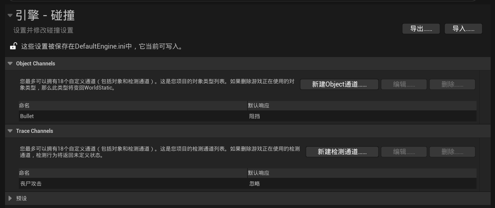

  ​	上图中**Trace Channel**里就是我们新建的用于丧尸是否攻击到玩家的检测通道。

  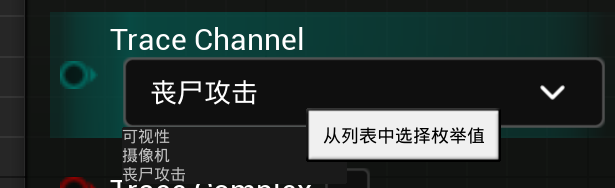

  ​	被检测的模型的**碰撞预设**中必须对我们这里设置的检测通道进行**阻挡**，才能被这个检测节点检测到。

  ​	那比如说我们这里**Trace Channel**设置的就是丧尸攻击，那么需要检测玩家有没有丧尸攻击到，因此我们需要将玩家控制的角色的碰撞预设对这个通道进行阻挡（即对“丧尸攻击”通道进行阻挡），如下图所示。

  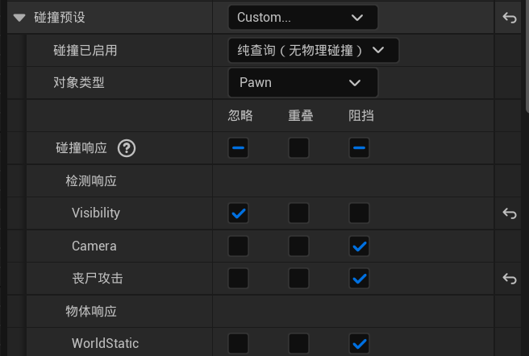

  ​	这样，之后当我们进入球体检测范围之后，才会检测到我们玩家。

  ​	**需要强调的是**，角色蓝图中通常有胶囊体组件和网格体组件，它们都有一个自己的碰撞预设，这里我们设置的是网格体的碰撞预设，而胶囊体对“丧尸攻击”通道是忽略的。原因是，胶囊体不能很好的代表我们玩家的身体，它是一个大致的范围，而网格体是我们玩家真正的模型所在的地方，那么当网格体被检测到之后，就可以很好的表示我们的身体被丧尸攻击到了，因此制作游戏的时候也要根据实际情况灵活进行设置，达到目标即可。

- **Trace Complex**：True则针对复杂碰撞进行测试，False则只针对简单碰撞进行测试。

- **Actors to Ignore**：可以指定一个或多个要忽略的 Actor 对象。在检测过程中，这些 Actor 将不会被视为碰撞对象，即使球体与它们相交。

- **Draw Debug Type**：用于调试目的，可选择绘制不同类型的调试信息，如显示球体的路径、碰撞点等，帮助开发者直观地了解检测过程和结果。

- **Ignore Self**：在进行球体追踪碰撞检测时，节点所在的 Actor（通常是发起检测的对象，比如游戏中的角色、武器等）自身也可能在球体的检测范围内，如果不启用Ignore Self选项，那么该Actor自身的碰撞体很可能会被检测为碰撞对象，导致检测结果出现偏差。

  ​	例如，当一个角色使用近战武器进行攻击，通过 Sphere Trace by Channel检测攻击范围内是否有敌人时，如果不忽略自身，那么角色自身的身体碰撞体就会被检测到，从而误认为自己是碰撞目标，这显然不符合实际的检测需求。

  ​	启用Ignore Self后，就能确保检测过程中排除自身的影响，只关注其他外部对象的碰撞情况。

- **Out Hit**：类似**事件命中节点**中的**Hit**引脚，它们都是**命中结果**数据类型，返回关于命中的一些数据，可以通过**break hit result**，细分该引脚输出的数据。

- **Return Value**：布尔型数据，如果命中则为true，否则为false（命中：指通道检测的时候有检测到符合**Trace Channel**的物体）

#### 26、Set View Target with Blend（使用混合设置视图目标）

​	该节点的作用是实现从玩家控制器的摄像机到另一个蓝图类的摄像机的切换。

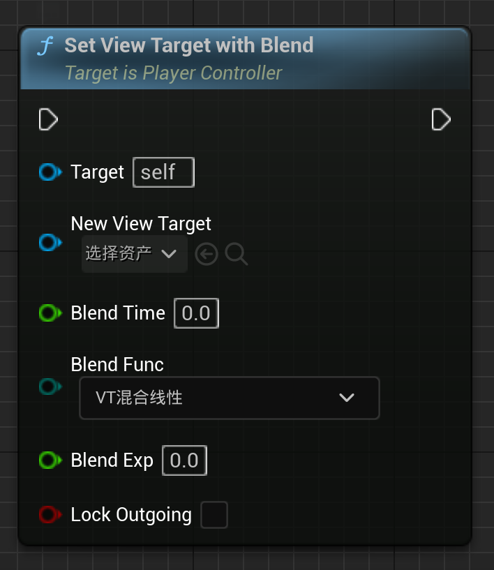

- **Target**：玩家控制器对象引用。
- **New View Target**：指定要切换到的新摄像机视图目标。**这个目标可以是一个摄像机 Actor，也可以是具有摄像机组件的其他 Actor，如玩家角色。**
- **Blend Time**：**定义从当前视图目标切换到新视图目标所花费的时间**，单位为秒。较长的混合时间会使视角切换更加缓慢和平滑，而较短的时间则会使切换更加迅速。例如，设置为 1 秒表示切换过程将在 1 秒内完成；如果设置为0秒，那么切换将在瞬间完成。
- **Blend Func**：**混合函数，它决定了切换过程中的速度变化曲线。**常见的混合函数有线性（Linear）、加速（Ease In）、减速（Ease Out）、先加速后减速（Ease In Out）等。不同的混合函数会产生不同的切换效果，比如使用减速混合函数可以使切换在接近新视角时速度逐渐变慢，营造出更自然的过渡效果。
- **Blend Exp**：当使用某些非线性混合函数时，这个参数用于控制混合曲线的指数。**它可以进一步调整切换过程中的速度变化程度，数值越大，速度变化越明显。**
- **Lock Outgoing**：一个布尔值参数，用于决定在视角切换过程中是否锁定当前的视图目标。如果设置为 True，则在切换完成之前，当前视图目标的相关设置将被锁定，无法进行其他操作；如果设置为 False，则可以在切换过程中对当前视图目标进行其他修改。

#### 27、Enable Input（启用输入）

​	**Enable Input**是一个非常关键的功能，主要用于激活玩家输入功能，让玩家能够通过各种输入设备（如键盘、鼠标、游戏手柄等）与游戏进行交互。

​	引擎解释：将此Actor推至玩家控制器所处理输入的堆栈上。

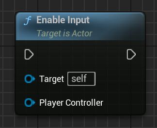

- **Target**：该引脚就是推至玩家控制器堆栈的Actor。

  1. 如果该节点写在角色蓝图里，那么Self即可代表这个角色蓝图（Actor）了。该节点在哪个蓝图里写的，这个Self就代表哪个蓝图，因此推至玩家控制器所处理输入的堆栈的那个Actor，就是本节点所在蓝图类的Actor。

     ​	比如，如果在角色蓝图里写了该节点，那么启用的就是**玩家控制器对该Actor的控制**，就说明玩家**可以**控制该角色了；如果在关卡蓝图里设置的有一些与UI交互的输入节点（即传统的节点输入那种键盘输入，不使用增强输入的那种输入方式），我们想要启用（或禁用），那就应该在关卡蓝图里写Enable Input（或Disable Input），这时我们的Self就代表关卡蓝图，**启用或禁用的都是玩家控制器对关卡蓝图的输入**。

  2. 如果没有写在目标Actor的蓝图里面并且还想启用或禁用该Actor的输入的话，就必须使用蓝图通信，获取到该Actor，并连接到该引脚才行。

- **Player Controller**：连接玩家控制器，玩家控制器就相当于键盘的输入，将Actor推至玩家控制器所处理输入的堆栈上，就意味着玩家的输入将可以影响该Actor了。

**与其他输入设置的关联**

​	Enable Input通常与输入模式（如 **Set Input Mode Game Only（设置输入模式仅游戏）**、**Set Input Mode UI Only（设置输入模式仅UI）** 等）和输入动作绑定（如设置按键对应特定的游戏动作）配合使用。在启用输入后，根据不同的输入模式，玩家的输入将以不同的方式被处理。例如，在 **“Game Only”** 输入模式下，玩家的输入主要用于控制游戏角色；而在 “UI Only” 输入模式下，玩家的输入主要用于操作 UI 界面。同时，输入动作绑定决定了玩家按下某个按键或进行某个操作

#### 28、Disable Input（禁用输入）

​	引擎解释：从玩家控制器所处理输入的堆栈中移除此Actor。

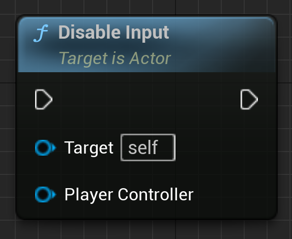

- **Target**：与Enable Input（启用输入）相同，只不过这个是禁用，不再赘述。
- **Player Controller**：与Enable Input（启用输入）相同，只不过这个是禁用，不再赘述。

#### 29、Delay（延迟）

​	执行到该节点时会延迟**Duration**秒后，才会执行后面的节点。

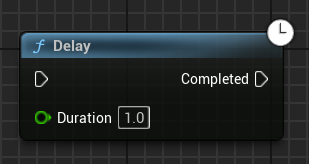

- **Duration**：延迟的时间。

​	该节点通常会配合一些播放动画、音效、粒子特效等需要一定时间来观看的功能一起使用，因为这样可以保证播放的动画等效果完整的播放出来之后在去执行后面的节点，不会因为没有停顿正在播放动画的时候突然执行了一个什么功能然后动画就突然没了，这样就很不流畅。

#### 30、Collect Garbage（垃圾回收）

引擎解释：删除所有未引用的对象，只保留被引用的对象。（此命令将排入队列并在帧末尾处发生）注意：此操作运行速度慢，会引起卡顿，请谨慎使用。

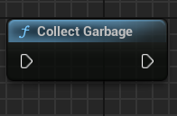

#### 31、Lerp(LinearColor)（插值（线性颜色））

​	实现颜色与颜色之间的过渡。

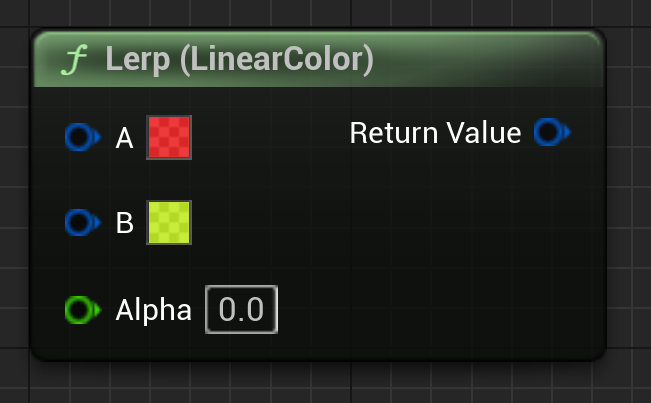

​	不再赘述引脚作用，就是根据Alpha的值在AB之间取值并从**Return Value**输出。

#### 32、Set Game Paused（设置游戏已暂停）

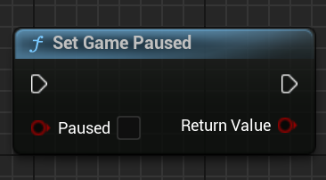

- **Paused**：为True，则暂停；为False，则不暂停。
- **Return Value**：返回游戏是否已经成功暂停，或者返回游戏是否已经成功不暂停。

#### 33、Quite Game（退出游戏）

​	引擎自带的退出游戏节点。

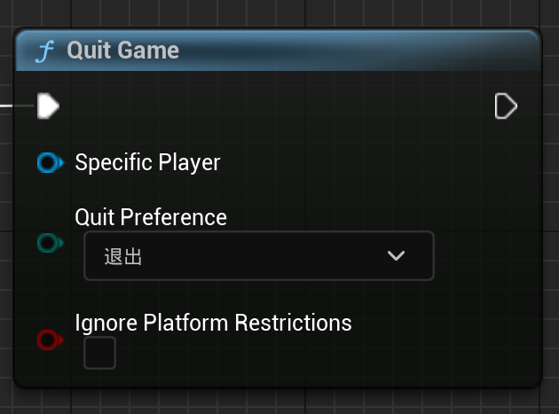

- **Specific Player**：玩家控制器对象引用，此处连接的控制器对应的玩家将退出游戏，如果没有连接，则默认玩家0退出游戏。

- **Quit Preference**：退出游戏的方式。

  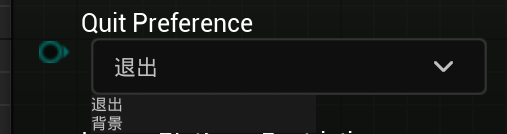

  1. **退出**：完全退出游戏。
  2. **背景**：将应用程序移至后台。

- **Ignore Platform Restrictions**：忽略并执行基于平台的最佳实践（例如在一些主机上永远不应该退出游戏）。**仅限非发布版本使用**。

#### 34、Open Level (by Name) （打开关卡（按名称））

​	执行到此节点时将会打开对应的**Level Name**关卡，可以用于设计**重启关卡**的功能。

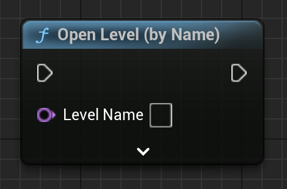

- **Level Name**：此处直接连接关卡命名或输入关卡命名均可，关卡命名就是地图的名字。

#### 35、Open Level (by Object Reference)

​	该节点跟Open Level (by Name) 功能相同，只是输入引脚不同。

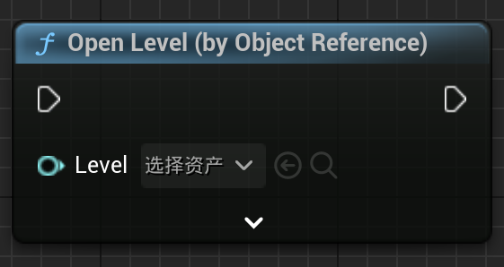

- **Level**：连接关卡资产，就是地图资产选进去就行了。

  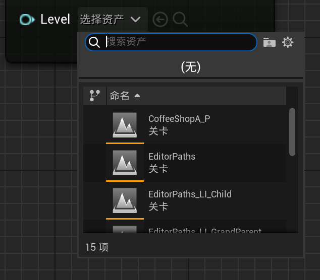

  在这里找到我们想要打开的地图，选择即可。

#### 36、Get All Actors Of Class（获取类的所有Actor）

​	该节点可以获得场景中**所有该类的实例对象**，并返回一个数组。

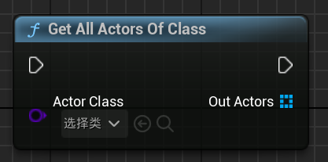

- **Actor Class**：选择要获取的蓝图类。
- **Out Actors**：获取到的Actor数组。

#### 37、Get Random Reachabel Point In Radius（获取半径内可抵达的随机点）

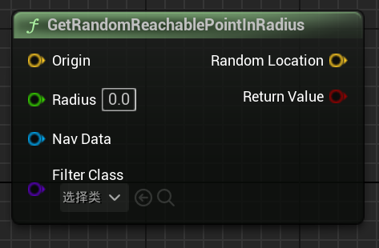

- **Origin**：向量，可以理解为整个球形区域的球心位置。
- **Radius**：球形区域的半径长度（单位：cm）
- **Nav Data**：导航数据对象引用。（不常用）
- **Filter Class**：导航查寻过滤器类引用。（不常用）
- **Random Location**：向量，返回球形区域内的随机点的位置。
- **Return Value**：如调用成功则返回代表的返回值。

### 蓝图类组件

#### 1、蓝图类组件简单介绍

​	通常位于蓝图类界面左上角，可以通过添加一系列组件丰富蓝图可以实现的功能。

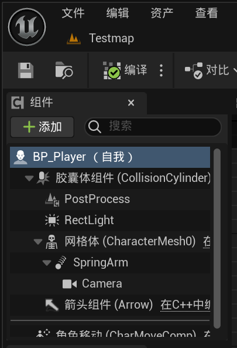

​	例如“胶囊体组件”可以为蓝图增加胶囊形状的碰撞、“弹簧臂组件”与“摄像机组件”配合使用时可以增加摄像机的灵活度同时当弹簧臂的末端被碰撞或阻挡时，弹簧臂会自动伸缩，也在一定程度上防止了摄像机的穿模、再比如“角色移动组件”则封装了一些列角色在移动时所需要的设置，帮助我们在蓝图编辑时便捷的获取到角色移动时需要的数据。

#### 2、蓝图类常用组件功能介绍

##### （1）Spring Arm（弹簧臂）

###### 功能概况

​	通常与Camera（摄像机）组件搭配使用。

​	弹簧臂在其中就可以负责视角的拉近（对应弹簧臂收缩）、视角的旋转（对应弹簧臂围绕圆点旋转，再带动摄像机旋转）等功能。

###### 1、滞后

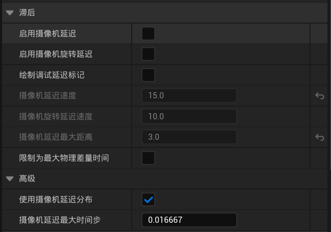

- **启用摄像机延迟**：

  ​	**如果为True**，则当角色四处移动时，Spring Arm及旗下摄像机会晚一段时间才开始相同的运动。

  ​	就好像是我看到一个人从我身边走过**一定时间**之后我也开始跟着他以相同速度走了起来，但是当前面那个人停下来之后，最终我还是要走到那个人的位置才能停下来，那么这里面的**“我”就是那个启用了摄像机延迟的Spring Arm**。

  ​	启用后，可以在**摄像机延迟速度**里面调整**摄像机延迟**。

  ​	**摄像机延迟最大距离**的作用就是当摄像机延迟的过多了，达到了最大距离之后，就会**立刻让摄像机的视角跟上角色的移动或旋转**。

- **启用摄像机旋转延迟**：

  ​	与上一个**摄像机延迟**类似，**摄像机延迟**是跟角色的移动有关，而**摄像机旋转延迟**是跟角色的旋转有关，当角色旋转时，摄像机会晚一会儿才能跟上。

  ​	启用后，可以在**摄像机旋转延迟速度**里面调整**摄像机旋转延迟**

##### （2）Camera（摄像机组件）

###### 功能概况

​	一般配合**Spring Arm**使用，充当玩家观察世界的眼睛。

##### （3）Projectile Movement（发射物移动组件）

###### 功能概况

​	注入子弹、弓箭等需要发射的蓝图类需要该发射物组件才能发射，发射物移动组件类似角色的移动组件。

###### 1、抛射物

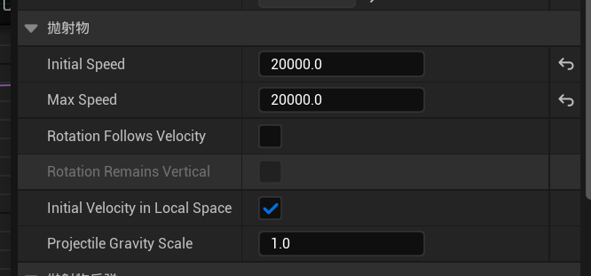

- **Initial Speed**：初始速度，即发射物发射出去的初速度，之后以该速度进行衰减，形成抛物线。
- **Max Speed**：最大速度，即发射物可以达到的最大速度。比如子弹朝下射击的话，初速度加上重力加速度会让子弹的速度增加，那么这个速度最大不能超过多少就可以在这里设置。

## 增强输入

### 1、 一个角色蓝图要启用增强输入必须设有如下节点

这里的节点的作用就是告诉引擎，我们当前要使用的是那一套映射情景，因为有些游戏可能不只有一套映射情景，所以我们需要在这里设置好我们使用的映射情景，也就是图中最后的那一个节点“添加映射上下文”

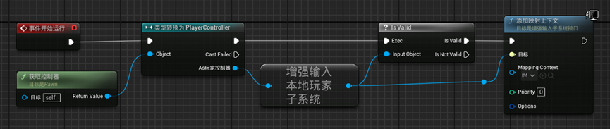

其中最后一个节点（添加映射上下文）就是设置我们需要使用哪个输入映射情景的地方

### 2、增强输入离不开输入操作和输入映射情景

如下图所示

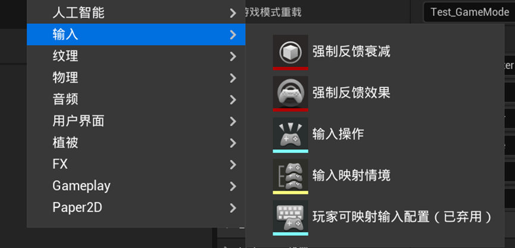

其中输入映射情景用于集成各种我们定义的输入操作。

​	在输入操作里面我们一般对将来键盘会输入的值的类型进行设置，比如布尔值、1维轴、2维轴、3维轴等。（见下图，“值类型”所示位置）

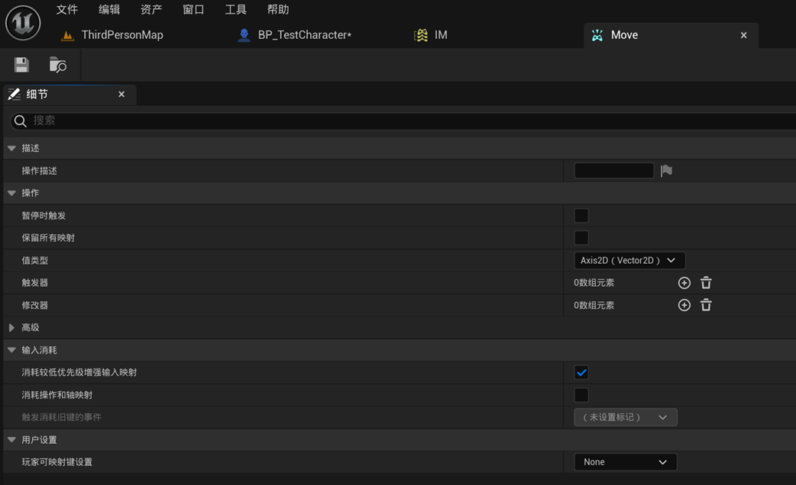

​	这里设置的是Axis2D那么之后我们需要获得的硬件输入都在X轴上**（可以理解为Axis2D在X轴上输入了两次数值，也可以理解为两个轴都是X轴）**，但是我们的理想状态是XY两个轴，所以需要修改一个轴变为Y轴的输出，**那这就需要后续在映射情境中设置修改器（“拌合输入轴值”和“否定”结合使用）**，输入映射情景中将它添加进去，并设置对应的键盘按键。（下图为输入映射情景中的设置）

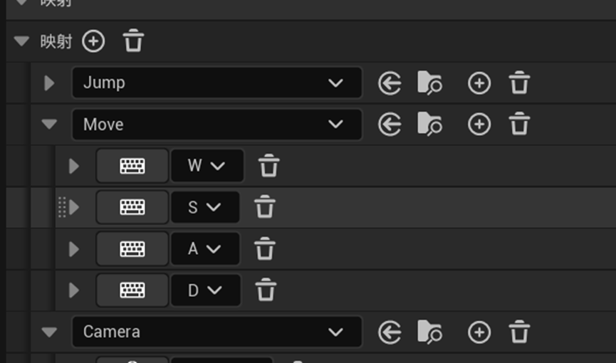

​	尽管我们已经设置了值类型为Axis2D，但是它的作用只是保证之后这个操作可以输出两个值（即X和Y，这里强调“两个”），不能设定X和Y的具体数值。

​	我们的输入操作默认都是向X轴的正向输出1，也就是如果全部为默认状态的话，我们的wasd所有按键都是往右走，所以要对它们进行修改。

​	首先D就是向右，不需要修改，默认即可；A是向左，也就是D取反，所以添加修改器，设置“否定”；W向前，也就是Y轴的正向需要输出一个1，但是现在还是X轴正向输出1，**所以修改器里需要设置“拌合输入轴值”，这个名字不太好理解，但是作用就是改变数值输出的顺序**，S向后，有了A和W的经验，所以就是先“拌合”再“否定”即可。

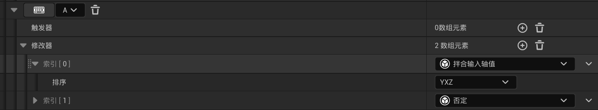

​	设置了**拌合输入轴值**的选项，它的数值输出顺序是YXZ，即Y在最前面，所以我们后面的蓝图中Y引脚才会有数值输出出来，那正常的没有**拌合输入轴值**的修改器的话，数值输出顺序是X在前，所以想要Y有输出，或者有需要Z输出的话就可以通过**拌合输入轴值**修改排序。

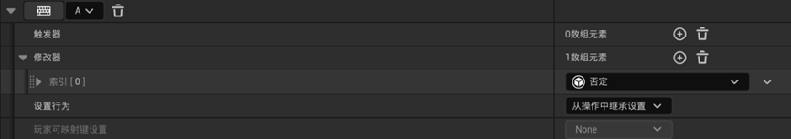

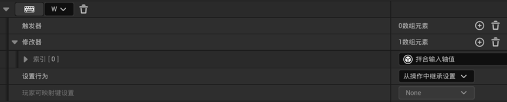

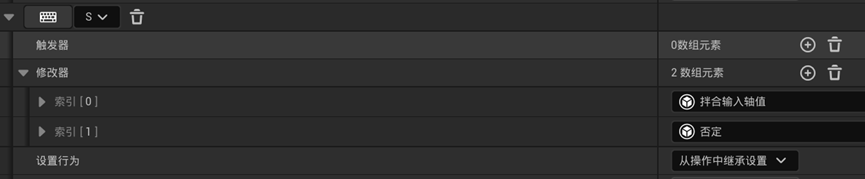

### 3、回到角色蓝图

​	查询节点“EnhancedInputAction Move”，分割Action Value的结构体引脚，就可以看到X和Y的输出口了。（这里Move是我们自定义的**输入操作**的名字）

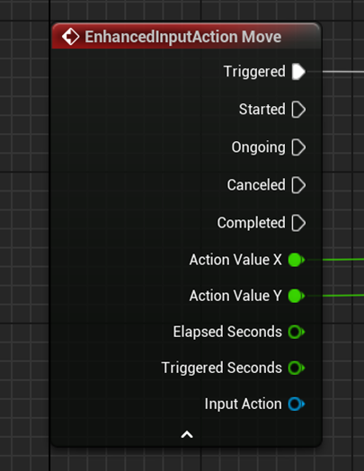

​	前面设置的**拌合输入轴值**和**否定**，就是保证这里X和Y可以根据我们的WASD按键而正确的输出±1，我们也是使用这里输出的±1，来进行对角色前后左右移动的控制。

​	**如果WASD四个按键的修改器都不设置的话，那么这里将会只有X引脚有输出值，Y引脚将始终为0，“拌合输入轴值”的作用可以理解为将原本从X引脚输出改为从Y引脚输出，“否定”的作用就是交换正反数值。**

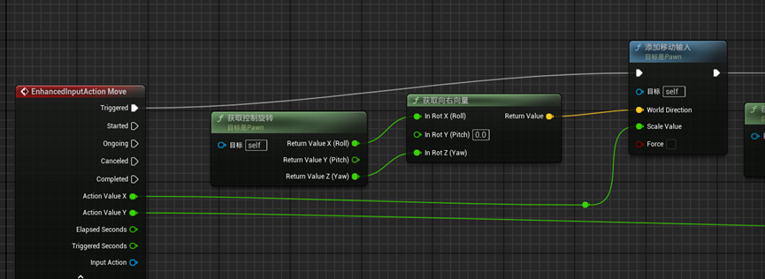

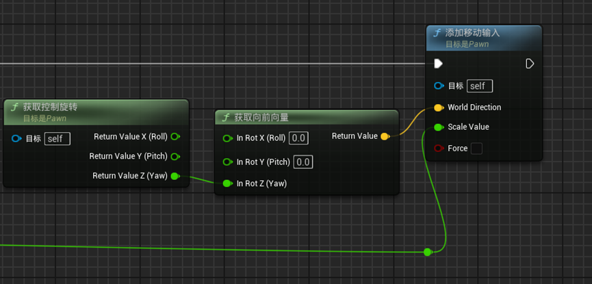

​	上图主要是使用到四个节点：“获取控制旋转”、“获取向右向量”、“获取向前向量”、“添加移动输入”。

​	在此之后我们的角色就可以前后左右移动了。

​	与上面相似的跳跃，视角移动等不再赘述，不会的话可以看视频。

### 4、增强输入常用节点功能介绍

#### （1）EnhancedInputAction节点

​	这是一类节点的前缀，如下图所示，EnhancedInputAction后面的IA_Look是自定义的**输入操作**的名字，下面解释一下各个引脚的作用。

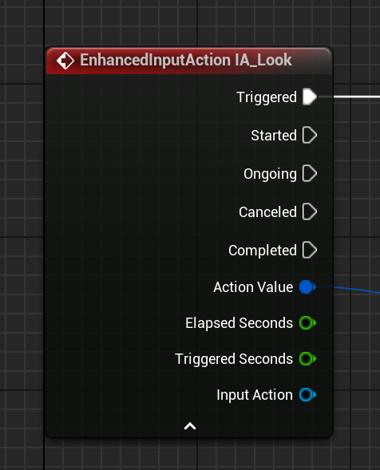

- **Triggered**：每帧触发的引脚，连接**Triggered**的节点每一帧都会执行一次。
- **Started**：以按键举例，我们**按下按键的时候（注意这里强调按下按键，还没有松开）**会触发一次。
- **Ongoing**：持续性判断，检测是否正在**长按按键**。
- **Canceled**：**长按之后，取消的时候**会触发。
- **Completed**：按键按下之后**松开的时候**，即按键操作结束的时候会触发的引脚。
- **Action Value**：这里输出的是**输入映射**里面绑定的硬件设备输出的数值。（数据类型取决于我们**输入操作**里面设置的数据类型）

#### (2)Add Movement Input（添加移动输入）

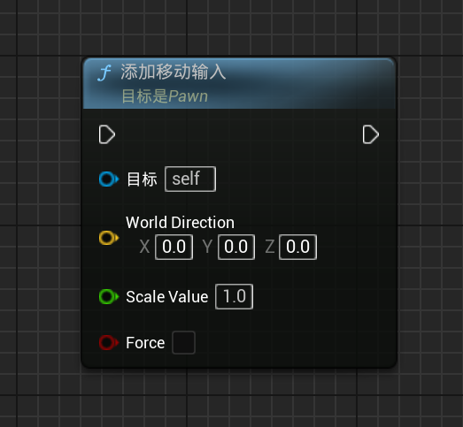

​	常用于配合**WASD的输入操作**来控制角色在地图中的前后左右移动，在角色蓝图中可以不连接**目标引脚**直接用self即可，目标引脚的目标是Pawn。

- 目标：指该节点添加移动输入的目标是谁。
- **World Direction**：指这个输入应该添加的方向，即角色应该往哪个方向移动，这里强调的是方向，一般传入一个向量，就代表我要向这个向量的方向移动
- **Scale Value**：应用输入的缩放，这个值的有效范围是（-1，1）也就是说你哪怕传入的是100，也是按1算的。值为1就是沿World Direction方向移动，值为0.5就会比1慢一些，如果值为负数，就是沿World Direction的反方向移动。（这里Scale Value的大小无法改变角色移动速度，该速度需要在角色移动组件里面修改角色最大行走速度等设置）

## 视角

###   常见的关于第一和第三人称控制视角的旋转应该如何设置

​	在谌嘉诚的FPS游戏课程中，我们制作的第一人称FPS游戏里面，为了实现鼠标控制视角的上下左右移动，我们使用了如下蓝图（默认已经在事件开始时启用了增强输入）

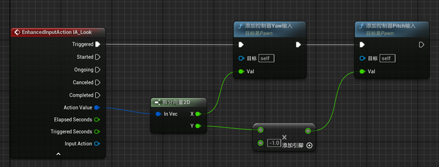

其中**增强输入IA_Look**中值类型设置如下

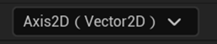

IA_Look所在的映射情景设置如下

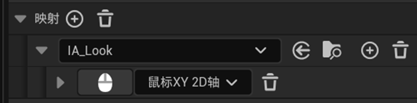

​	到这里，结合上面两张图，我们的**增强输入IA_Look**和**映射情景**里面设置的**都是2D**的话呢，就不需要什么“拌合输入轴值”、“否定”等这种修改器对数值进行修改了，**虚幻引擎会自动的将鼠标的前后左右移动修改为一个二维坐标系（关于这个二维坐标系，个人认为应该是向右为X轴正方向、向下为Y轴正方向）**

​	这里折叠部分里面没有变化，均为默认值。

​	**现在我们的鼠标左右移动就是在X轴上移动，前后移动就是在Y轴上移动。**

​	在此之后我们运行游戏会发现视角还不能进行上下左右的查看，这时为什么？

​	因为我们还没有将pawn的旋转与我们的控制器进行绑定，如何绑定？

​	首先找到我们的角色蓝图的“类默认设置”（注意是类默认设置，不是类设置）

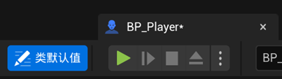

​	之后再细节的搜索框里搜索pawn，可以看到下图所示内容

​	这里面有三个设置，分别是“使用控制器旋转Pitch”、“使用控制器旋转Yaw”和“使用控制器旋转Roll”，这三者所对应的旋转轴分别为Y轴、Z轴、X轴。**比如我们勾选了使用控制器旋转Yaw，因为这是在整个类的默认设置里面的选项，因此此时我们的整个蓝图类的Yaw旋转都会听从控制器的指令**。那么在这里我们要实现的是第一人称FPS也就是上下左右的旋转，上下就对应的是Pitch、左右对应的是Yaw，因此我们要勾选这两个设置，之后就可以实现我们想要的效果（此时我们游戏中的效果是视角旋转的同时，我们的手臂、枪支也跟着旋转，但是对于游戏外而言，这里绑定的是整个角色的旋转，也就是说我们向上看的时候，实际上是整个角色都躺下了，面朝天这种）。

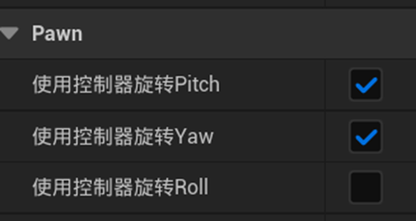

 

​	那么我们知道，我们角色是有一个带摄像机的弹簧臂的，我们让摄像机进行移动的话是不是也能实现这种需求呢，这时我们可能会像下图所示那样进行设置

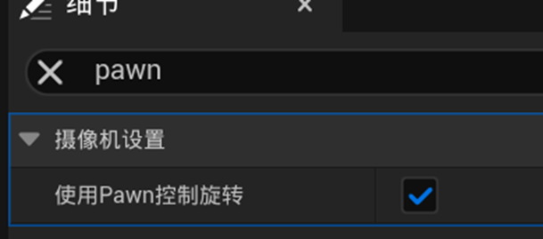

​	**使用Pawn控制旋转**就是用控制器控制该组件的旋转，比如**弹簧臂组件**的这个选项打勾了，那么弹簧臂就会听从控制器的指令，当控制器添加旋转时，弹簧臂也会跟着旋转。那么如果我们**既勾选了使用“Pawn控制旋转”又勾选了“使用控制器旋转Yaw的话”**，那实际上是有点重复了，因为本身弹簧臂就在整个蓝图里面，我们整个蓝图旋转的话，弹簧臂自然会旋转，所以选项：**“使用Pawn控制旋转”**此时勾不勾选效果是一样的。

​	**控制器添加旋转一般就是下图三个蓝图节点。**

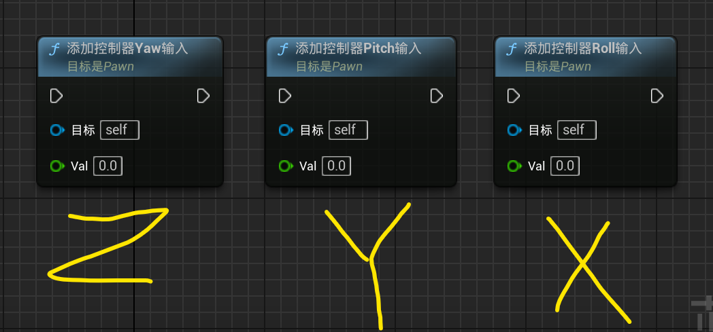

​	它们所对应的旋转轴标注在了节点下方，还是以弹簧臂举例，这里的轴与下图空间坐标系的轴对应，其中蓝色为Z轴、绿色为Y轴、红色为X轴。

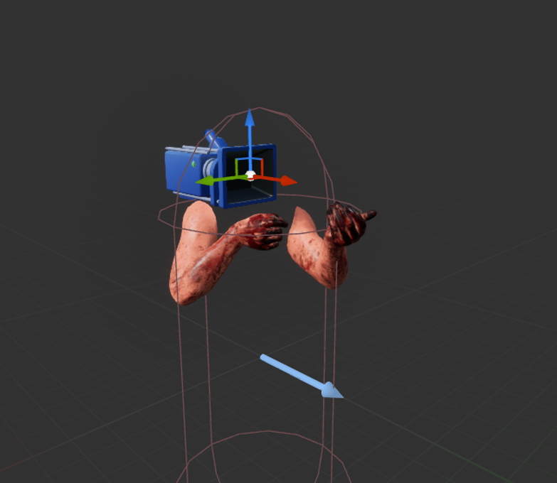

​	因此如果我们需要用鼠标来控制角色视角的上下左右查看功能的话，我们应该将鼠标输出的信息合理的添加到Yaw和Pitch节点，以实现其效果。

​	我们在弹簧臂的细节面板找到了这个**设置（使用Pawn控制旋转）**并打勾，这时我们运行游戏后会发现我们的视角也确实可以移动，但是视角移动了，我们手上拿的枪却没有移动，也就是说这样的设置，只会转动弹簧臂以及弹簧臂旗下的摄像头，它会使我们人物方向的旋转和视角的方向的旋转分离，我们鼠标转动视角时不会对人物的转动产生影响，这种设置通常会在第三人称游戏中用到，因为第三人称的游戏就需要这种分离，以达到我们玩家可以随时观察人物四周的效果，而不会是我们鼠标一转，人物跟着转视角也跟着转，那样我们的第三人称角色操作起来会很奇怪。（一个典型的例子就是，如果我要边跑边打，我就需要人物朝着远离怪物的方向，但是视角需要朝着怪物的方向进行攻击，如果两种旋转不进行分离的话，我们就很难实现这种功能）

## 动画资产

​	动画资产一般指**动画序列**，而**动画序列**是由一系列按照特定顺序排列的帧组成的动画片段，这些帧通常包含了角色、物体或场景的不同状态和动作，通过快速连续播放这些帧，就能够产生动态的视觉效果，使观众感受到物体或角色在运动、变化等。

### 动画添加通知

​	既然是动画，那么动画一定是有播放时间的，那么我们的动画在播放时就可能需要同时播放一些音效、粒子特效等资产。这就需要我们在动画播放的间隙添加**通知**，使得这些资产得以在播放动画时展现效果。

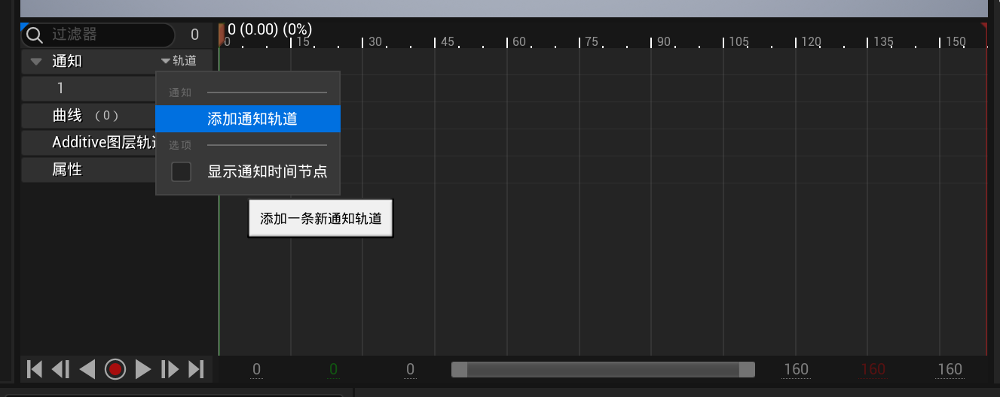

​	在上图中可以看到左边有**通知**一栏，在**通知栏**的右边**轨道**点开就可以看到**添加通知轨道**，点击即可添加一排新的轨道，这里图中已经有了一个轨道，就在**通知栏**下面。

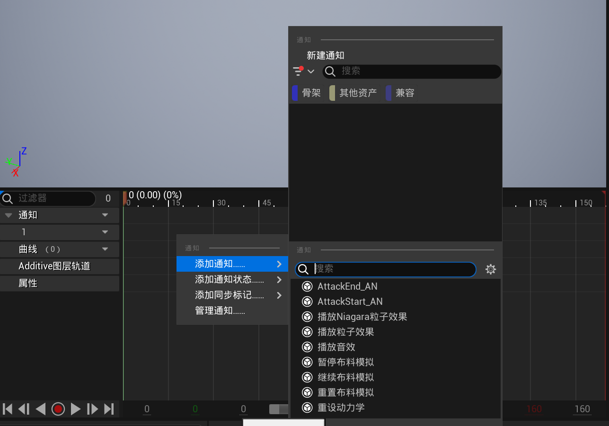

​	在轨道的任意处**鼠标右键**，移动到**添加通知**，即可看到我们能添加的通知的类型，其中就不乏有播放音效，播放粒子效果等选项。添加完通知后，点击我们新添加的通知，在细节面板即可选择我们需要的对应通知类型的资产了。

​	添加通知时，我们**想在哪一帧添加，就在哪一帧鼠标右键**。

​	以第一人称FPS游戏为例，我们需要为角色走路动画添加一个脚与地面触碰的音效。**那么我们就需要观察好动画在什么时候像是踩到了地面，之后在才到地面的这一帧添加一个音效的通知并应用上踩地的音效。**

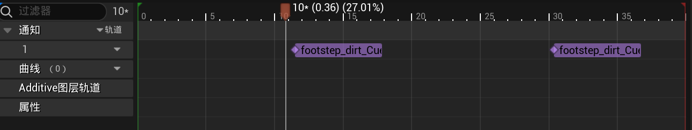

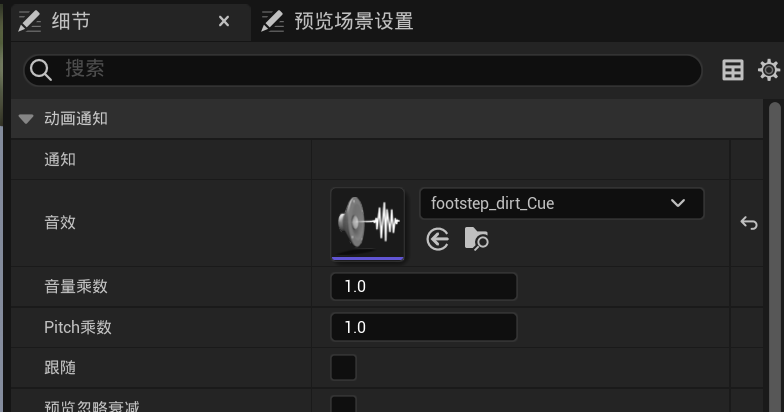

​	上图两个通知所在的**帧**就是这个动画里面脚落到地面的**帧**

​	其它通知类似用法不再赘述。

### 如何并使用自己创建动画通知

​	我们自己创建的动画通知，使用方法与其它通知相同，当我们创建了通知之后，在动画的轨道里面就可以看到我们自定义的通知的名字了。

**创建方法**

​	首先鼠标右键内容浏览器空白区域，选择蓝图类，在下方展开所有类，如下图所示。

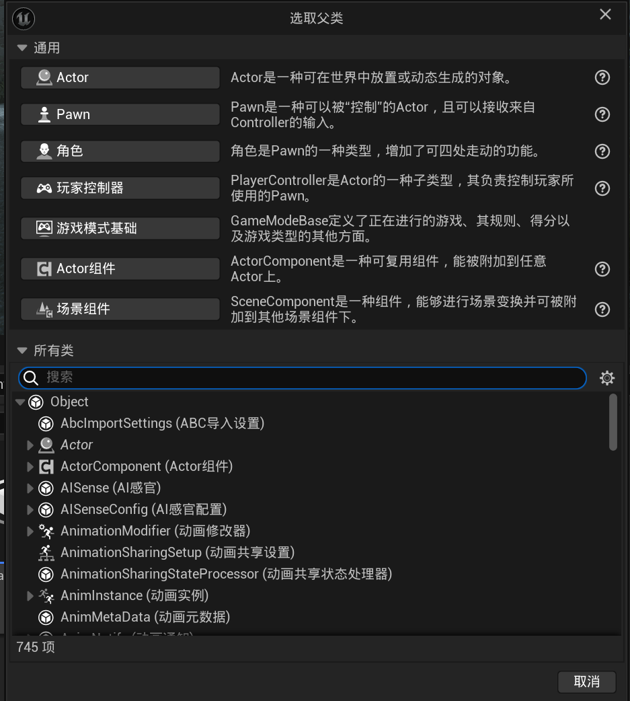

​	在所有类的搜索框里搜索**“AnimNotify”**，即可创建动画通知类，如下图所示。

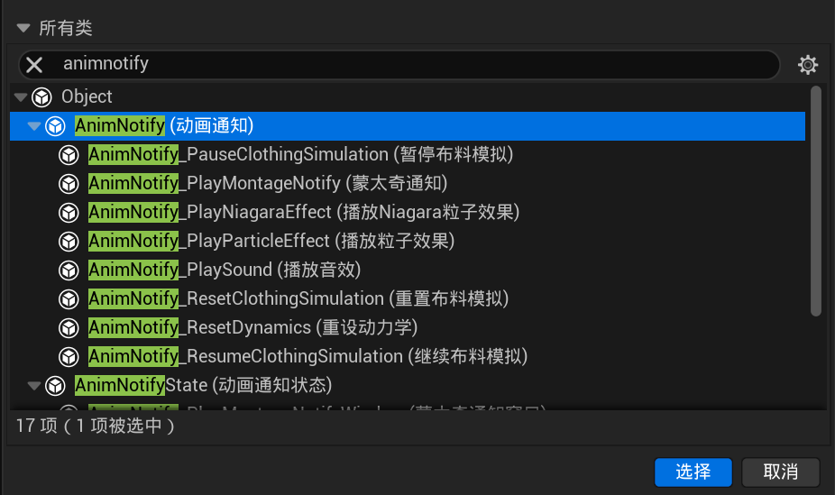

​	点击**选择**之后即可得到我们自建的动画通知，动画通知命名规范为**AN**，记得重命名一下。

**使用方法**

​	举个例子，比如我们要在丧尸挥手攻击的过程中通过**动画通知**让丧尸蓝图开始进行射线检测等事件，那么我们应该怎么做？

​	首先丧尸挥手攻击一定有开始有结束，因此我们需要两个**动画通知**，丧尸开始攻击时通知一次（对应射线检测开始），丧尸结束攻击时通知一次（对应射线检测结束）。

​	下图创建两个**动画通知**。

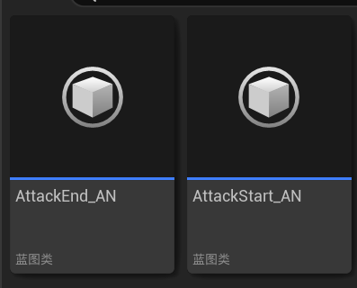

​	创建完通知之后，点开我们需要设置通知的动画序列，新建一个轨道（新建主要是为了看着方便），在合适的位置鼠标右键添加找到我们自建的通知添加上即可（注意一个开始一个结束）。

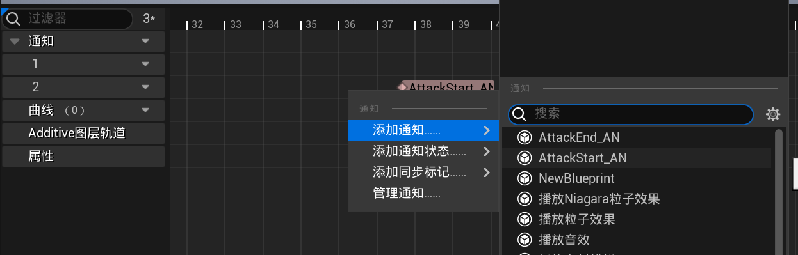

​	然后双击点进AttackStart_AN蓝图。

​	在下图所示界面选择**已接收通知，**之后会自动进入蓝图编辑页面，如下图所示。

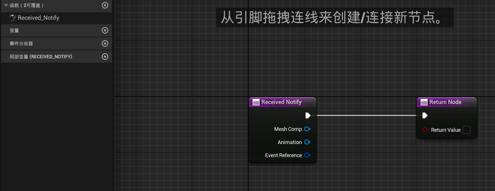

​	这里**函数**栏里面的Received_Notify函数就是刚刚重载的函数，也是上图编辑窗口正在编辑的函数。

​	**左边节点**

- **Mesh Comp**：Mesh Component，该引脚为使用该动画通知的网格体组件，我们可以通过这个引脚获得到使用该网格体组件的蓝图类

  

  ​	使用**Get Owner**节点获得到组件的拥有者，之后类型转换为丧尸蓝图类，即可实现**动画通知蓝图**与**丧尸蓝图**的通信。

- **Animation**：该引脚为使用该**动画通知**的**动画序列**的引用。

- **Event Reference**：动画通知事件参考，结构（按引用）。

- 注意如果需要在**动画通知里面创建变量**，又希望在**动画序列里面可以设置这些变量**（如绑定个骨骼什么的），那么我们一定要勾选这个变量细节面板中的**可编辑实例**，如下图所示。

- 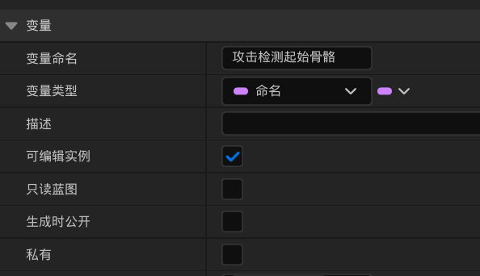

  ​	**勾选之后即可在动画序列的中看到暴露出来的变量了**，见下图。

  

​	**右边节点**

- ​	作用不大，最后连上就行，不再赘述

​	AttackEnd_AN动画通知蓝图与上面的介绍相似，不再赘述，之后在这些通知里面实现一些跟丧尸蓝图的数据传递等功能，即可启动丧尸的射线检测，达成目标。

## 动画蓝图

​	动画蓝图与其它蓝图类似，**动画蓝图在创建时需要选择一个骨骼网格体进行创建**，之后我们动画蓝图输出的动画就会基于绑定的这个骨骼网格体播放动画，那么与此同时如果拥有相同骨骼网格体的角色蓝图使用了这个动画蓝图，那么就可以实现我们角色的一些行走动画、攻击动画等等需要动画的操作。

​	动画蓝图有两种图表一种是**事件图表**，另一种是**动画图表**。事件图表常用于做一些数值计算、获取角色蓝图的一些变量数据等工作；而动**画图表常常结合事件图表get到的数据，通过状态机等机制输出与数据相对应的动画**。（比如事件图表获得的角色蓝图里面的变量Speed（速度）大于0时，动画图表根据这个Speed转换激活了状态机里面的移动状态，之后输出移动的动画，这样**数据与动画相辅相成的效果就是它们的作用**）

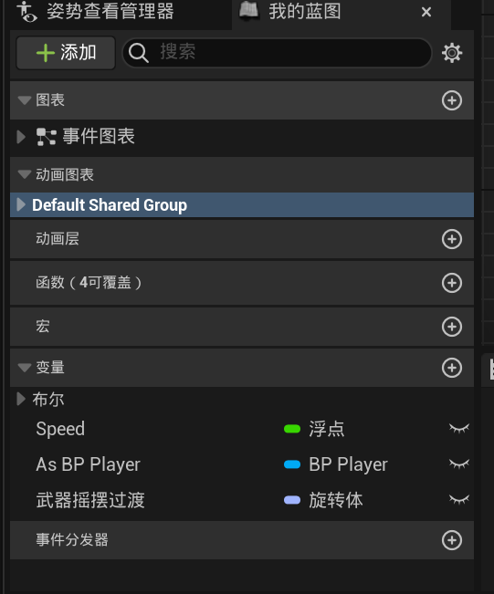

​	**动画蓝图只有一个输出动画的接口**，见下图。

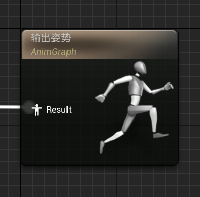

​	**关于动画蓝图的工作原理，个人认为是将确定好的动画一帧一帧的从上图节点中输出到使用了该动画蓝图的角色（模型）上，因此我们看到的动画蓝图里面的线总是在运作，总是一种持续输出的感觉，因为每一帧都在传递到输出姿势节点上**。

​	也就是说不论你动画蓝图多复杂，最终我动画蓝图得到的结果就是一个动画。听起来可能不好理解原因，但是其实这是符合客观规律的，**一个事物在一定时间内只可能有一个动作，我不可能既跑步又走路、不可能既吃饭又喝水，我只能跑步时有跑步的动作，走路时有走路的动作**，所以对于一个事物的动画蓝图，我们最终只需要得到一个我们认为合适的动画输出出去并且体现在角色身上即可。

​	至于我要最终要输出的那个动画到底是什么，取决于我们动画蓝图内部设计的**状态机**和**蒙太奇插槽**。

​	**状态机**、**蒙太奇**，二者都可以为动画蓝图输出动画，但是通常它们使用的场景不同。状态机通常在一些需要长时间播放动画的地方进行使用，例如角色行走动画、角色跳跃动画等这些动画都会持续一定时间不会取消；而蒙太奇则常常播放一些短时间的动画，比如枪械射击动画，后坐力动画，或者角色技能动画，特效动画等等，这些动画大都是短暂释放，不会长时间存在。

### 1、  状态机

​	状态机是一种用于描述对象在不同状态之间转换的数学模型，在游戏开发里，它能让游戏对象（像角色、敌人、关卡等）依据特定条件在不同状态间切换，进而实现复杂的行为逻辑。例如，一个游戏角色可能存在 “站立”“行走”“奔跑”“攻击”“受伤”“死亡” 等多种状态。

#### （1）状态机基本用法

​	创建状态机后可以看到下图节点。

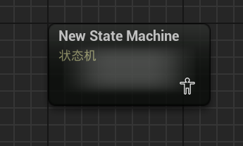

​	该节点固定输出一个动画，也就是说我整个状态机内部不论怎么运算，状态怎么转移，**最后只会有一个动画被输出出来，这个节点再连接到动画蓝图的输出接口，就是基本的状态机用法**。

​	下图为状态机内部初始状态。

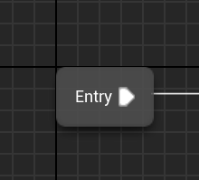

​	**初始状态只有一个Entry节点**，表示该状态机将从这里开始，那么Entry连接的首个状态就是我们状态机首先会进入的状态，一般也是一个角色一开始会播放的动画（待机动画）

​	以第一人称FPS举例，角色的状态机见下图。

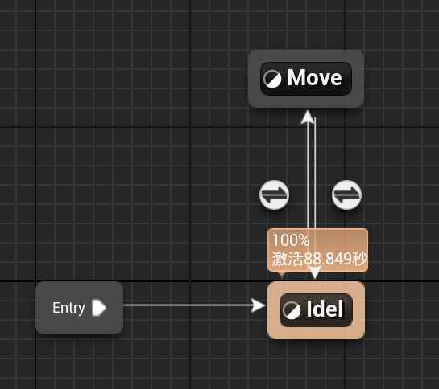

​	这里只有两个状态，分别是Idle、Move，名字可自定义，那么我们通常会把角色静止站立时的动画放在Idle状态里面，而角色运动（走路/跑步等）动画放在Move状态里面。

​	两个状态之间的线分别代表它们之间的过渡规则，这里的过度规则都是**布尔值**，比如Idle指向Move的过渡规则里面的计算如果为**true**，那么该状态机的所激活的状态就会从当前激活的状态Idle转变为Move，反向同理。一般情况下这种**双向的过度规则都是互相对立的**，一边是true另一边就是false。

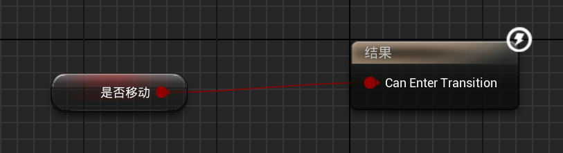

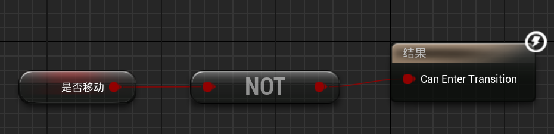

​	Idle状态内部蓝图，见下图。

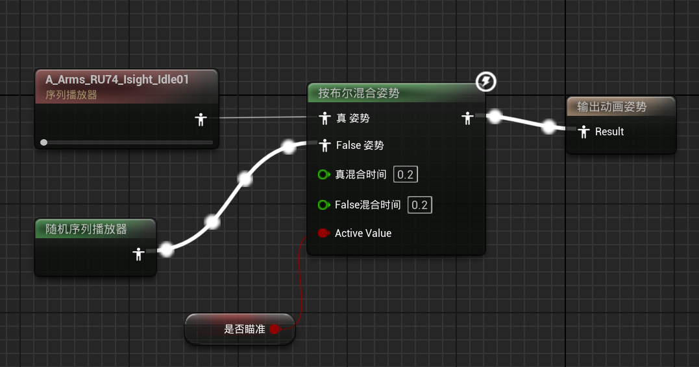

​	其中最右边的**输出动画姿势是每一个状态都会有的节点**，我们通过逻辑运算，确定好要输出的动画后，连接上该节点。该节点左边的蓝图节点是对各种动画的使用，比如**A_Arms_RU74_Isight_Idle01**节点是一个角色静止站立时拿枪瞄准的动画，**随机序列播放器**里面包含了两个角色站立的动画，这里是为了更加真实让角色站立时也有不同的站立动画且随机播放。

​	**如果该状态是被激活的状态**，那么这里**输出动画姿势**所输出的动画就会从下图节点输出。

​	然而这里输出的动画又会连接到动画蓝图的输出接口，因此最后**使用了我们这个动画蓝图的角色**就会播放**Idle**的动画。

​	Move状态内部蓝图，见下图。

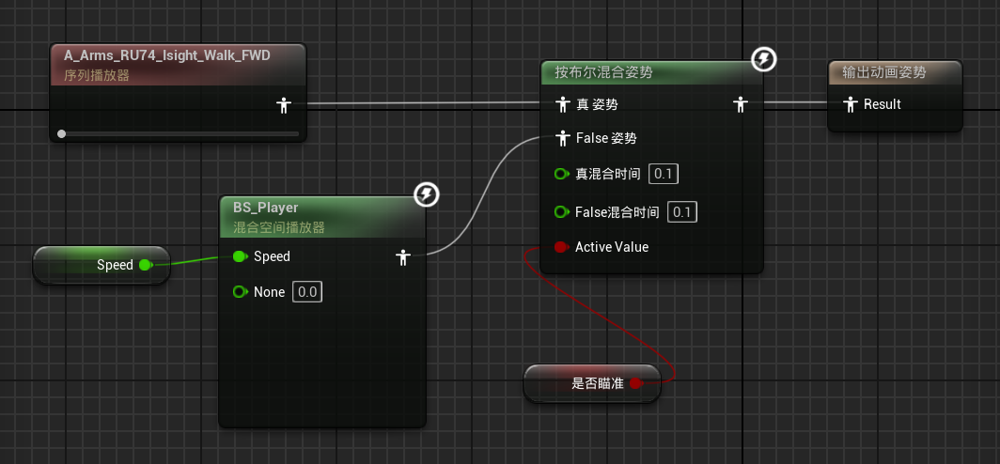

​	道理与Idle类似，不再阐述，详见**状态机蓝图节点介绍**和**混合空间**讲解

#### （2）状态机内动画序列的使用

​	当我们将动画序列从资产浏览器里单独拉出来时，单独的动画序列也可以有一个输出引脚，用于输出该动画。

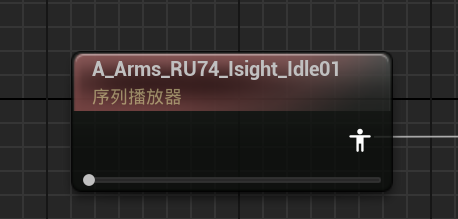

​	一般情况下我们需要给这些动画设置**循环动画**，如下图所示

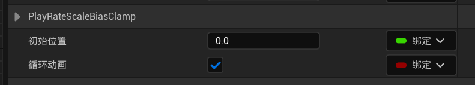

### 2、  蒙太奇

#### （1）蒙太奇的概念

​	**蒙太奇**在虚幻引擎里主要指动画蒙太奇（Animation Montage），它是一种用于管理和播放复杂动画序列的工具。动画蒙太奇可以把多个动画片段组合起来，按照一定的顺序和规则进行播放，还能在播放过程中触发事件和通知。

​	动画蒙太奇常用于控制角色的复杂动画，比如角色的攻击动画。一个攻击动画可能包含多个阶段，如起手动作、攻击动作、收招动作等，这些阶段可以分别用不同的动画片段表示，然后通过动画蒙太奇将它们组合起来。在播放攻击动画的过程中，还可以设置通知来触发攻击判定、播放攻击音效等。

​	可以通过现有**动画序列**创建每个**动画序列**对应的蒙太奇，见下图。

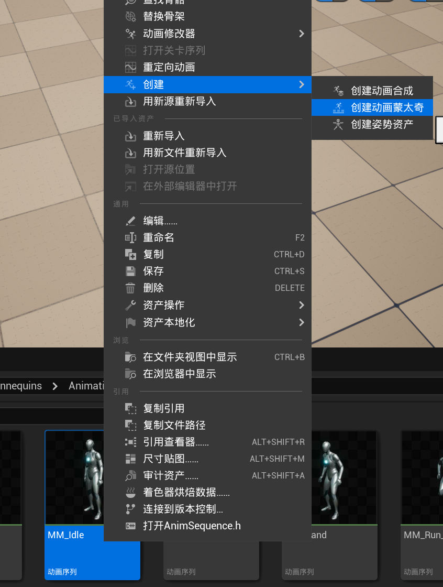

#### （2）蒙太奇的用法

​	想要在动画蓝图中播放**蒙太奇**，就必须使用下图插槽节点，这个节点就是播放蒙太奇时，**蒙太奇插入的地方**。

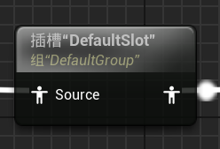

​	**这里的节点不是死的，它代表的是一个分组**，即这个**插槽可以播放所有属于“Default Group”组**的蒙太奇动画，因为**蒙太奇**不像**动画序列**一样可以直接拖进动画蓝图里面使用，**蒙太奇**必须使用上图这种**插槽**来实现动画的播放，这是虚幻引擎的设定。

​	可以看到节点左边有一个**Source**引脚，这里就是接收前面的每一帧帧动画（一般就是状态机里面输出的动画连过来了），然后右边引脚会输出动画。

#### （3）蒙太奇的原理

​	当蒙太奇要播放时，这个节点会将**蒙太奇动画**慢慢的**混入Source传来的动画**并从右边将这种慢慢混入的动画输出，直到蒙太奇播放完毕，那么就会再慢慢的**混出到Source传来的动画**，最后完全变为**Source**的动画。（**混入**和**混出**的含义详见**蒙太奇相关知识介绍**）

​	**简单理解就是**：蒙太奇常常插进状态机输出的动画里，通过转为输出蒙太奇自己的动画，等到蒙太奇的动画播放完后，在转为播放状态机输出的动画。

​	关于蒙太奇的**混入混出时间**，我们可以在蒙太奇动画资产里面进行设置，如下图所示。

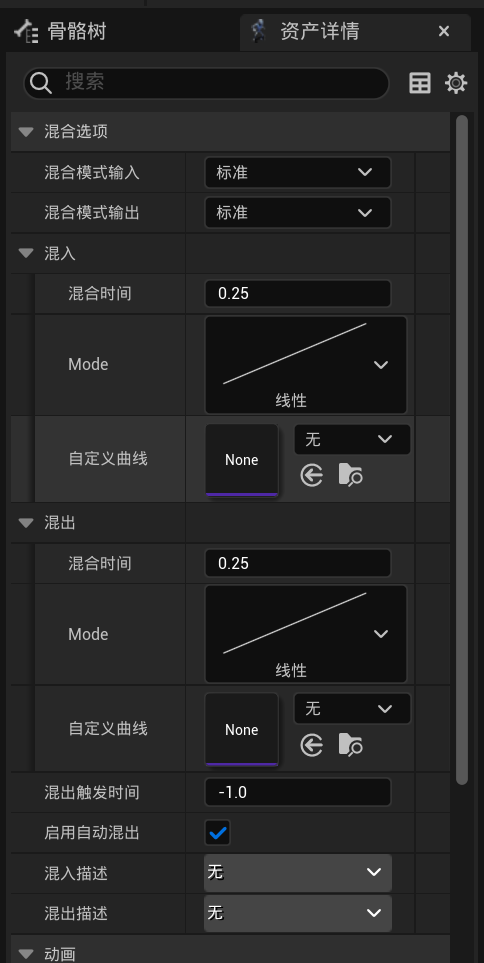

#### （4）蒙太奇相关知识介绍

##### 1、混入

**混入的定义**

​	混入指的是动画蒙太奇开始播放时，从当前正在播放的动画过渡到蒙太奇动画的过程。在这个过程中，两个动画会按照一定的权重进行混合，随着时间推移，蒙太奇动画的权重逐渐增加，当前动画的权重逐渐减少，直到完全过渡到蒙太奇动画。

**混入的作用**

- **平滑过渡**：避免动画切换时出现突兀感。比如，角色原本处于站立动画状态，当开始播放攻击动画蒙太奇时，如果没有混入过程，动画会瞬间从站立切换到攻击，这会让玩家感觉很不自然。而通过混入，角色会从站立动画自然地过渡到攻击动画，使游戏画面更加流畅。
- **增强真实感**：让角色的动作转换更符合现实逻辑。在现实中，生物的动作变化通常是渐进的，混入效果模拟了这种渐进过程，让角色的行为看起来更真实。

**参数设置**

- **混入时间**：这是一个重要参数，它决定了混入过程持续的时长。较短的混入时间会使过渡速度加快，动画切换相对急促；较长的混入时间则会让过渡更加平缓、柔和。开发者可根据具体的动画需求来调整这个时间。例如，对于快速的攻击动画，混入时间可以设置得较短，以体现攻击的突然性；而对于一些舒缓的动作转换，如从行走过渡到跑步，混入时间可以设置得长一些。

##### 2、混出

**混出的定义**

混出是指动画蒙太奇播放结束时，从蒙太奇动画过渡到下一个动画的过程。同样，在这个过程中，蒙太奇动画和下一个动画会按一定权重混合，蒙太奇动画的权重逐渐降低，下一个动画的权重逐渐增加，直至完全过渡到下一个动画。

**混出的作用**

- **自然结束**：使蒙太奇动画的结束更加自然，避免动画突然停止。例如，角色完成一个技能动画蒙太奇后，如果没有混出过程，技能动画会戛然而止，然后直接切换到下一个动画，这样会显得很生硬。通过混出，技能动画会逐渐淡出，过渡到角色的后续动画，如站立或移动动画。
- **保持连贯性**：确保动画序列之间的连贯性。在游戏中，角色的动作往往是连续的，混出可以让不同动画之间的衔接更加流畅，使玩家感受到角色行为的连贯性。

**参数设置**

- **混出时间**：类似于混入时间，它决定了混出过程的持续时间。开发者需要根据动画的特点和需求来合理设置混出时间。比如，对于一个持续时间较长、动作较为舒缓的动画蒙太奇，混出时间可以适当长一些，以保证动画结束的自然性；而对于一些快速、短暂的动画，混出时间则可以设置得短一些。
- **混出触发点**：除了混出时间，还可以设置混出的触发点。通常可以选择在蒙太奇动画播放到一定比例时开始混出，或者在特定的通知事件触发时开始混出。这样可以根据具体的游戏逻辑和动画设计，灵活控制混出的时机。

​	蒙太奇默认勾选**启用自动混出**，那么如果我们取消勾选**启用自动混出**的话，该蒙太奇播放完毕之后就会停在最后一帧，不再会混出，中间没有过度了。

### 3、动画蓝图内常用节点功能介绍

#### （1）事件图表节点

##### 1、事件蓝图更新动画

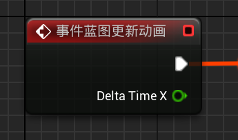

​	动画蓝图每次更新都会触发这个节点，**即每一帧都会触发一次**，如果1秒60帧，那就是触发60次，可以看作一种Tick事件。

​	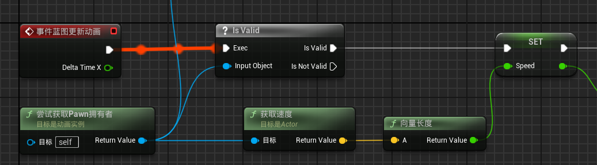

​	比如这里我们利用这个会**每帧更新的节点持续获得Pawn（也就是角色）的移动速度**，之后可以用Speed在状态机里去设置动画的播放逻辑。                                                                                                                                                                                                                                                                                                                                                                                                                                                                                                                                                                                                                                                                                                                                                                                                                                                                                                                                                                                                                                                                                                                                                                                                                                                                                                                                                                                                                                                                                                                                                                                                                                                                                                                                                                                                                                                                                                                                                                                                                                                                                                                                                                                                                                   

#### （2）动画图表节点

##### 1、随机序列播放器

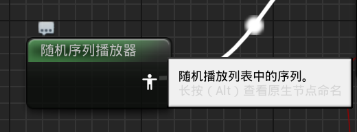

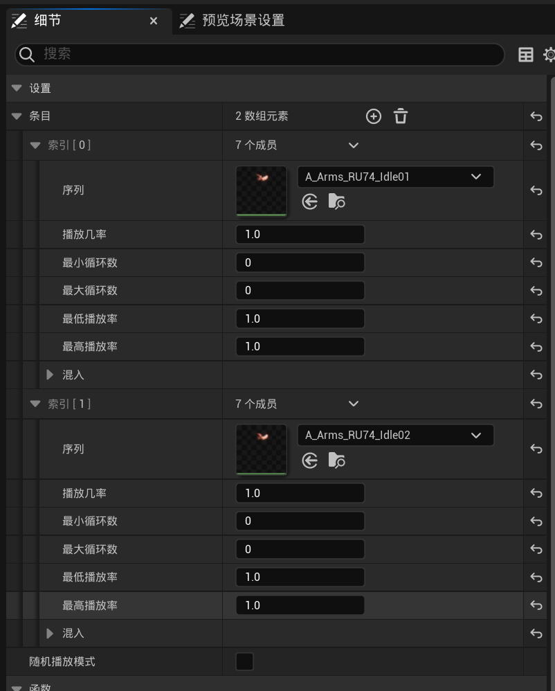

​	上图为随机序列播放器的细节面板，在条目一栏的右边点击加号，即可添加一个索引用来存放动画。这里我们添加了两个索引，存放了两个Idle动画用于随机播放。

​	图片最下方有一个**随机播放模式**选项，**如果勾选**那么索引上的动画就会很随机的播放（有可能出现一个动画一直被随机到的情况），如果不勾选，索引上的动画会进行分组，在单个组中会保证所有的动画都被播放过一次。

##### 2、Transform(Modify) Bone（变换（修改）骨骼）

- **Component Pose**：连接传递过来的动画
- **Alpha**：在对骨骼进行变换操作时，alpha 可以作为一个混合因子来控制变换的程度或强度。例如，当你想要平滑地将一个骨骼从当前状态变换到目标状态时，alpha 可以在 0 到 1 之间取值。当 alpha = 0时，表示不应用任何变换，骨骼保持当前状态；当 alpha = 1时，表示完全应用新的变换，将骨骼转换到最终的目标状态。
- **Translation**：**改变骨骼位置**可以通过该操作来移动骨骼在三维空间中的位置，这对于调整角色姿势、实现特定的动作动画或者让角色与场景中的其他元素进行交互时非常有用。例如，将角色的手骨移动到特定位置以拿起道具，就需要对相应的骨骼位置进行变换操作。
- **Rotation**：**调整骨骼旋转**能够对骨骼进行旋转操作，从而改变骨骼的方向。在制作角色动画时，常常需要通过旋转骨骼来实现关节的弯曲、肢体的摆动等动作。比如，旋转腿部骨骼来实现角色的行走、跑步时腿部的运动姿态。
- **Scale**：**实现骨骼缩放**允许对骨骼进行缩放，这在一些特殊效果或者角色变形的场景中会用到。比如，制作一个变大或变小的角色形态，可能就需要对骨骼进行整体或部分的缩放操作，以保证角色的比例和形态在变化过程中保持合理。

​	本节点一般需要如下图所示使用。

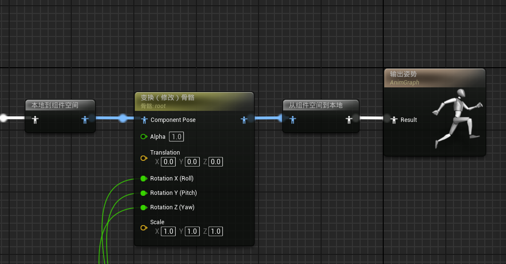

​	最左边节点的左边引脚可以衔接**状态机或蒙太奇插槽**。

​	这个节点接收了传过来的动画，那么这个动画一定是基于骨骼网格体制作的，所以我们这个节点就可以在这个动画中添加一些对**骨骼的变换**的修改，再将修改后的动画输出出去。

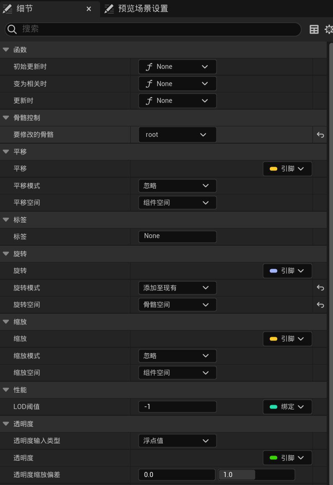

​	首先在该节点的细节面板中，我们看到**骨骼控制**一栏默认是root，即**默认修改的是根骨骼**，那我们可以在这里根据需要改变被修改的骨骼。

​	以旋转举例，如果我们要在节点的Rotation处传入数据以改变旋转的话，那么我们必须在**旋转模式**这里改掉**忽略**（建议改为**添加至现有**，将会在现有旋转基础上添加新的旋转，过渡会比较平滑），如果这里是**忽略**那么**旋转引脚传入的数据将不会有任何作用**。在**旋转空间**里面根据实际需要修改空间，一般我们修改骨骼旋转的话，选择**骨骼空间**即可。

​	选择的是**骨骼空间**那么该节点的旋转所接收的数据就会用于修改该动画对应的骨骼网格体内我们所设置的对应骨骼的旋转，也就是说，我们在骨骼网格体资产空间预览骨骼的时候Roll、Pitch、Yaw怎么旋转的，那么该节点接收的数据就会添加相对应的旋转。即设置**骨骼空间**之后，**该节点的旋转引脚的三个值（分割引脚之后）就与骨骼的Roll、Pitch、Yaw相互吻合了，这可以让我们明确自己到底是在调整骨骼哪个方向的旋转**，不要做晕头鸡子。（实在不知道、不清楚，自己输入数值看效果也行）

​	那如果这里选择的是**世界空间**，效果会与**骨骼空间**有所不同，个人认为是不同空间基于的旋转轴不同，这里**还没有探索完毕，有缘再补充。**

​	平移和缩放与旋转类似，不再赘述。

##### 3、Blend Poses by bool（按布尔混合姿势）

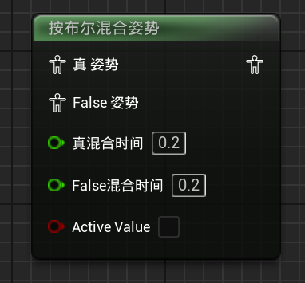

- **真 姿势**：**Active Value**=True时，右边引脚就会输出该引脚所连接的动画。
- **False 姿势**：**Active Value** = False时，右边引脚就会输出该引脚所连接的动画。
- **真混合时间**：从**False 姿势**切换到**真 姿势**的时间。
- **False混合时间**：从**真 姿势**切换到**False 姿势**的时间。
- **Active Value**：接收或自定一个布尔值，可以为True或False。

​	以第一人称FPS游戏为例，

##### 4、Save cached pose（新保存的缓存姿势）

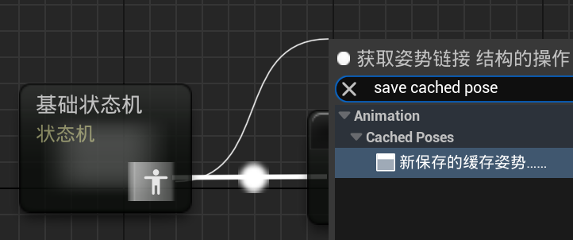

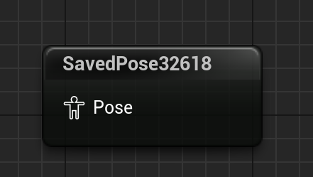

​	上图就是Save cached pose节点的初始样子，我们可以为其重命名，它只有一个Pose引脚，该引脚用于缓存传递过来的动画。之后可以在其它地方直接调用这个节点缓存的动画。

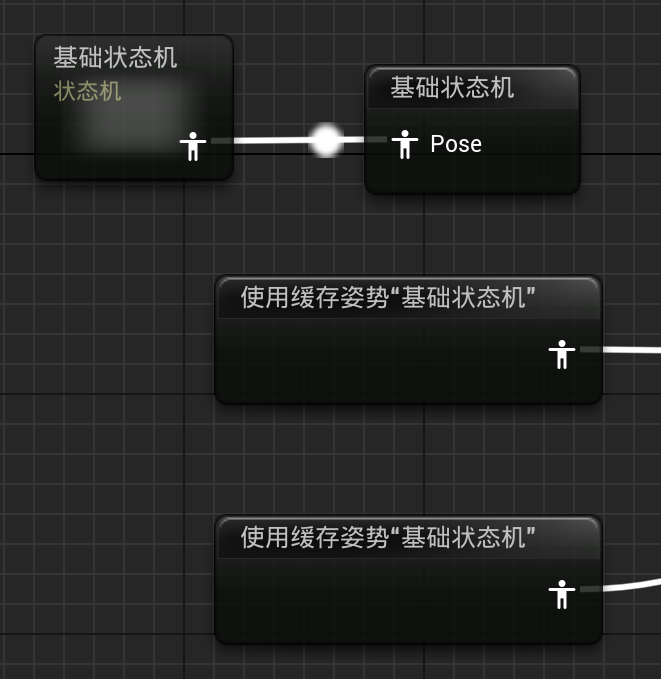

​	上图**基础状态机输出的一帧帧动画**都交给了被重命名为**“基础状态机”**的，之后我们又分别在两处地方调用了该节点的**缓存姿势**并且输出了出去。

​	**所以当我们需要为多个引脚输出状态机的动画时**，就可以先使用**Save cached pose**节点缓存状态机的动画，然后再多次调用**缓存姿势**即可，因为**缓存姿势**这个节点时可以频繁呼出的，而我们写的某种功能的状态机通常只有一个。

##### 5、Layered blend per bone （每个骨骼的分层混合）

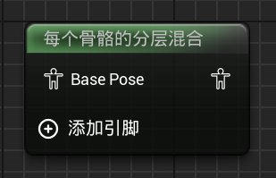

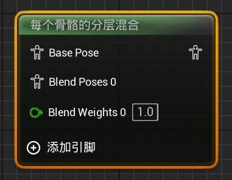

- **Base Pose**：这是基础姿势输入引脚，通常连接到一个**基础的骨骼动画姿势**，它提供了骨骼的初始状态和基础运动信息，作为**混合的基础**。
- **Blend Poses 0**：用于连接要混合到**Base Pose（基础姿势）**上的动画层。这种引脚可以通过**“添加引脚”**来增加，每个添加的新引脚都代表一个不同的动画层，这些动画层将**按照设置的Blend Weights权重**与 Base Pose 进行混合
- **Blend Weights 0**：用于控制每个动画层的混合权重。取值范围通常是 0 到 1，0 表示该层完全不混合，1 表示该层完全覆盖基础姿势。通过调整这个值，可以灵活地控制每个动画层在最终混合结果中所占的比重。其与上面的**Blend Poses 0**可以看作一对引脚。
- 上面的**Blend Poses 0**和**Blend Weights 0**合起来就是**“分层混合”**中所说的**“层”**的概念，也**称作Layer**。
- **右侧输出引脚**：输出混合后的骨骼动画姿势。这个引脚将经过混合计算后的最终骨骼姿势数据输出，可连接到其他需要骨骼动画数据的节点，如用于控制角色模型显示的节点等，以在游戏中展示混合后的动画效果。

​	如果再多添加几个引脚就是下图所示。

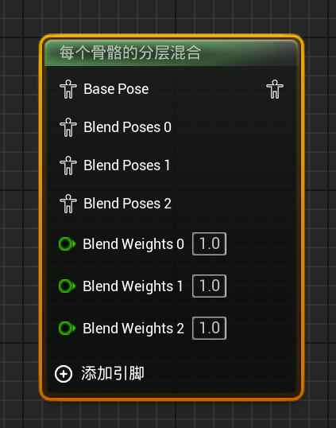

​	**Layered Blend Per Bone 节点**主要用于在骨骼动画系统中，**对不同来源的骨骼动画数据进行按骨骼的分层混合操作**。它允许将多个动画层按照一定的权重和规则混合在一起，从而实现更加复杂和自然的动画效果，比如同时实现角色的行走动画和手臂的挥舞动画等。

​	关于骨骼的设置，在该节点的细节面板，见下图。

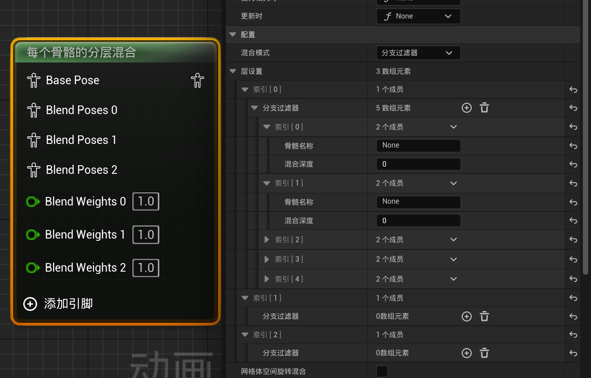

​	以图中左边节点举例，回忆一下**Layer**是什么（在引脚介绍那里有），细节面板中可以看到**层设置**下面有三个索引（先不看**分支过滤器**），但看**层设置**下面有三个索引，分别是索引[0]、索引[1]、索引[2]，这三个索引就对应着引脚里面的三个**Layer**（Blend Pose + Blend Weights），如果我们继续添加引脚，那么**层设置**下的索引也会随之增加。这也是为什么**分支过滤器右边有一个加号按钮**，但是**层设置**右边没有，那是因为**层设置**的加号按钮就是**添加引脚**。之后单看其中一个索引，以索引[0]为例，索引[0]的**分支过滤器**下面有5个索引，**它们分别代表我们想要混合的骨骼**，在这里输入**骨骼名字和混合深度**之后，那么在混合时，对于索引[0]对应的**Layer**引脚接收的动画，会将这个动画里面的这几个骨骼的运动混入到**Base Pose**中，所有**Layer**最终都会混入**Base Pose**中。所谓**分支过滤器，就是让你筛选出来你想混合的骨骼**，使混合更精确，更灵活。

**应用举例：**

- **复杂角色动画**：在制作复杂的角色动作时，比如角色一边跑步一边射击，跑步动画可以作为 Base Pose，而射击时手臂和身体的特定动作可以作为不同的 Layer。通过 Layered Blend Per Bone 节点，可以将这些动画合理地混合在一起，使角色表现出自然流畅的复合动作。
- **动画融合过渡**：当角色在不同动画状态之间切换时，例如从站立到蹲下再到爬行，使用 Layered Blend Per Bone 节点可以实现平滑的过渡效果。将不同状态的动画作为不同的层，通过逐渐调整混合权重，让角色的骨骼动画在不同状态之间自然融合，避免出现生硬的切换。
- **个性化动画定制**：对于具有多种装备或外观变化的角色，不同的装备可能会有不同的动画表现。可以将基础的角色动画作为 Base Pose，而将与装备相关的特殊动画作为 Layer，根据角色所装备的物品来动态地混合不同的动画层，实现个性化的动画效果。

​	在第一人称丧失游戏中，角色的动画蓝图中的行走动画是有脚步声音效通知的，但是当我们需要播放射击后坐力动画蒙太奇时，蒙太奇会混入进行走动画中，最后变为蒙太奇动画，但是蒙太奇动画里面没有脚步声，所以会出现一种现象，就是当我们持续开枪时，由于一直在播放后坐力蒙太奇，导致行走动画播不出来，那么脚步声通知自然也就没有了。如何解决这个问题，详见下图。

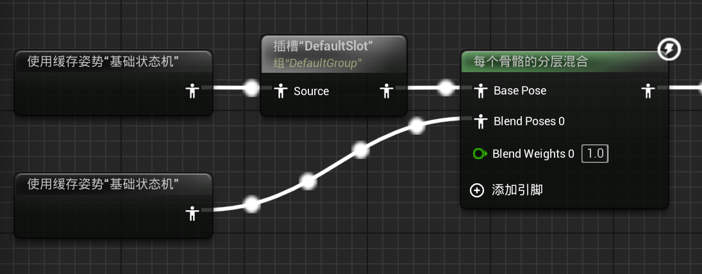

​	当然是使用本节所介绍的节点，但是原理是什么，需要我解释一下。

​	首先这里调用了存储的**基础状态机的缓存姿势**，如果不知道左边两个节点是什么，请参考**Save cached pose（新保存的缓存姿势）**节点介绍。中间节点为蒙太奇播放必备的插槽，如果不知道是什么，请参考**动画蓝图——蒙太奇——蒙太奇的用法**。

​	原先我们并没有使用本节的节点，这时会发现没有了脚步声（因为在播放蒙太奇，有脚步声的动画被蒙太奇的混入给混没了），这时我们使用这个**分层混合**节点，**将一个单独的缓存姿势混进蒙太奇的动画中**，这样混出来的动画，就会**既有后坐力动画又有脚步声**了。

​	**由于是第一人称丧失游戏，角色只有一双手臂，所以不必设置分层混合中的骨骼分别是什么，如果是一些复杂的骨骼网格体需要我们混合网格体不同区域的时候，就需要在节点的细节面板对混合的骨骼进行详细的设置了。**

## 混合空间

### 1、混合空间的介绍

​	我们知道动画蓝图用于在合适的状态中输出播放合适的动画旨在实现角色运动的视觉效果，但是有时候**动画与动画之间需要衔接**，不能直接进行动画的转换（那样会显得生硬不连贯违背了动画的初衷），这时候就需要混合空间发挥作用。

​	混合空间就是一个可以将多个动画混合在一起使它们之间衔接连贯顺畅的地方。

### 2、混合空间的一些用法

#### （1）从静止到运动之间的过渡

​	以**第一人称FPS游戏**为例，我们的角色一定会有一个从**站立**到**走路**再到**跑步**的过程，这个过程中人物的动画就需要一个良好的衔接，利用混合空间可以做到这件事。

​	首先就是要有三个动画，分别是站立时的动画、走路时的动画、跑步时的动画。

​	接着创建混合空间，混合空间中有一个二维直角坐标系，即水平轴和垂直轴，动画的衔接就依靠坐标点在坐标系内的移动进行混合，下面举例讲解。

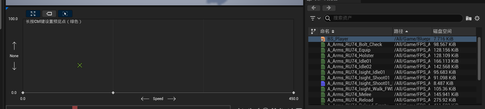

​	原始的坐标系内部没有下方水平轴上的三个白点，这三个白点是我们从右边的资产浏览器中拖出来的动画，上图中三个白点从左往右依次是**站立动画**、**走路动画**、**跑步动画**他们被放在了坐标系的水平轴上。

​	图中的**红色X**就是我们的坐标点，这是一个可移动的坐标点，在这里我们可以**按住Ctrl+移动鼠标**来移动这个**红色X**从而预览到水平轴上个点对应的动画是什么样的。

​	假设坐标点停留在左边白点也就是站立动画，那么上方视口就预览到白点所代表的那个动画；如果坐标点停留在中间白点处也就是走路动画，那么上方视口就预览到该白点所代表的那个动画；右边白点同理。**重要的是**，如果坐标点停留在这些白点之间的话，比如左边和中间白点之间，那么此时视口中的播放的动画将会介于站立和走路之间，就像是真人从站立到走路一样，身上的骨骼不是一下子闪过去的，而是有一个运动的过程，介于白点之间的一个个坐标播放的一个个动画连起来，就实现了从站立到走路的动画的完美过渡。

​	由于这里并没有使用到垂直轴，所以**红色X**在竖直方向上的移动对我们的动画没有任何影响，只考虑水平方向上的移动即可。

​	接下来看一些对混合空间的设置，见下图。

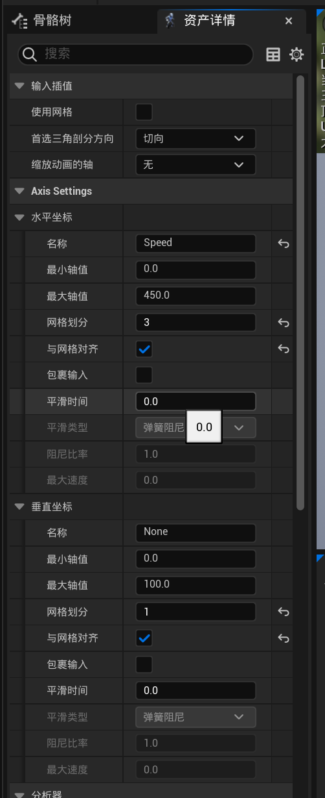

​	上图中我们重点关注Axis Settings，其中水平坐标与垂直坐标的设置就对应了上面所说的水平轴与垂直轴。

- 这里我们给**水平坐标命名**为了Speed，这个命名没有功能性的作用（即不会因为名字不同而功能不同），只是便于我们后面对它辨别和使用。
- **最小轴值**和**最大轴值**分别代表了水平轴的开始点和结束点，也就是上面那个坐标系中水平轴的起点和终点，垂直轴同理。**（注意水平轴和垂直轴的起点数值可以不一样，可能水平轴起点为0但是垂直轴的起点却是100）**
- **网格划分**就是水平轴上有多少个格，一般便于我们确定数值以及动画的位置，常常配合**与网格对齐**使用。这里水平坐标的网格划分设置的是3，所以下图中可以看到三个区域，垂直网格划分同理。

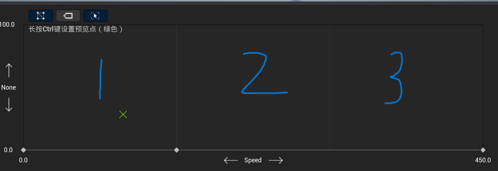

- **与网格对齐**还是以上图举例，这里我们设置了网格对齐之后，我们拖拽进来的动画资产就只能放在网格的边界上，那么由于我们水平坐标与垂直坐标都设置了网格对齐，那么就是网格边界相交的地方，也就是上图中那些交点处；如果不设置这个选项，那么动画资产可以像**红色X**一样随意放置

​	接下来重点看一下**取样平滑**中的**权重速度**，虚幻引擎本身提供的有解释。

​	这里我再结合自己的理解通俗的解释一下这个值的作用。

​	0是一个特殊的效果，大于零之后的值的变化又是一种效果

​	如果权重速度设置为0，那么我们混合的动画之间的过渡会非常快可以理解为所见即所得的那种感觉，就是说**红色X**移动到哪里，我们的动画就立刻播放该位置的混合动画；但是如果权重速度设置为0.1，那么我们的动画会播放的很慢，这时如果我们将**红色X**从**站立**移动到**走路**，动画也会播放，但是它衔接的很慢，就像是人物慢动作一样，我们的**红色X可能已经停在走路动画那里很久了，但是视口播放的动画还没有完全从站立播放到走路**，最后可能需要好几秒的时间才能过渡到走路动画，这与权重速度设置为0时的效果相反，那么这个值在大于零之后（即0.1、0.2、0.3等等）值越大，动画混合的效果就越接近0的效果，可能我们设置个100，那么肉眼就看不太出来与0的效果有什么差异了。

​	因此权重速度的值不能太大，也不能太小，这里设置为3是一个比较合理的数值，太慢不跟手，太快的话动画感觉没有过渡效果。

​	至此我们的混合空间就做的差不多了，接下来是混合空间在动画蓝图中的使用。

​	首先需要考虑的就是我们的混合空间应该放在哪个状态里进行播放，答案是Move状态。因为idle状态只有角色静止时才会触发，只要我们开始移动，状态就会切换为Move，那么我们这个速度从低到高的转变过程就对应了混合空间里面动画的转变过程，因此放在Move里是合适的。

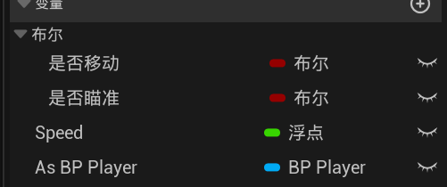

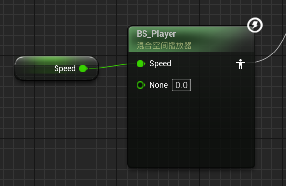

​	我们在Move状态里面使用这个混合空间，并将变量Speed传给混合空间即可实现根据角色速度播放移动动画的效果。这里变量Speed是我们在动画蓝图中的事件图表里面通过蓝图通信获得到的角色蓝图的速度向量的长度，见下图。

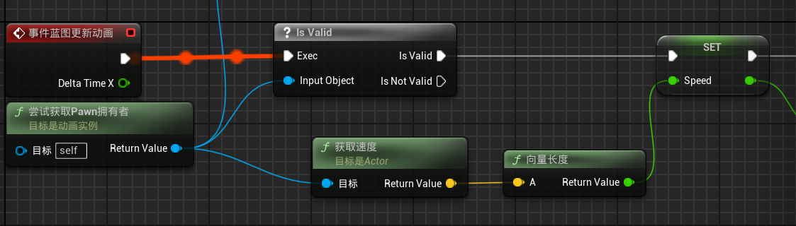

​	而混合空间播放器节点上的Speed和None两个接口就是我们之前混合空间里面的水平坐标和垂直坐标的命名，还记得我们给水平坐标命名为Speed吗，这里就是使用它的地方，我们给它传递了动画蓝图里面的**变量Speed**，根据这个变量的数值变化，动态调整混合空间输出的动画，就像我们当时用鼠标移动**红色X**去预览动画效果一样，

##  骨骼

### 1、骨骼插槽

#### 	（1）如何创建插槽

骨骼插槽需要在骨骼网格体的骨骼树上鼠标右键想要创建插槽的骨骼，之后点击添加插槽即可，如下图所示

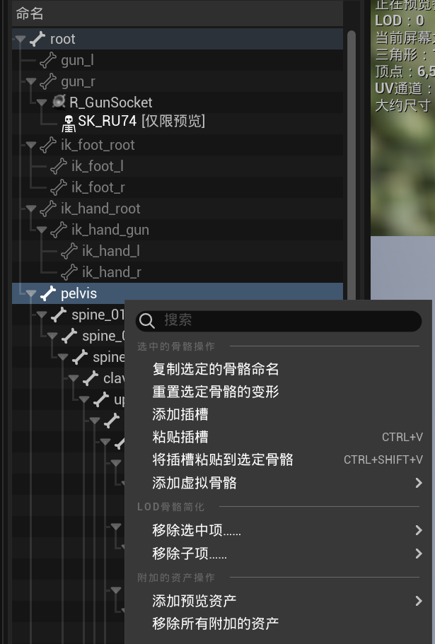

​	添加的插槽的变换（变换包括：位置、方向、缩放）在默认情况下与创建它的骨骼的变换相同，但是也可以通过在视口中移动、旋转或放大缩小来改变插槽的变换。

#### （2）插槽的一些用法

##### 1、**插槽的变换可以与摄像机的变换绑定**。

​	例如制作第一人称射击游戏时，我们玩家的摄像机就可以绑定到模型骨骼head的插槽上，以达到第一人称视角的目的。

​	当我们把弹簧臂和摄像机放于骨骼网格体层级之下时，见下图

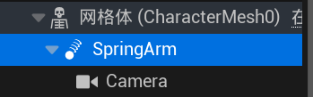

​	便可以在弹簧臂或摄像机的细节面板中插槽一栏找到“父项套接字”的设置选项，在其中输入我们想要绑定的插槽的名字即可实现绑定**（注意这里我们绑定的插槽在上图网格体的骨骼中一定要存在才可以）**

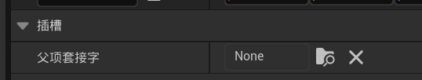

##### 2、**骨骼网格体之间也可以通过插槽绑定来实现一些功能**。

​	还是以第一人称FPS游戏为例，我们**角色的骨骼网格体**和**武器的骨骼网格体**一定是在不同的蓝图中存在的，因为我们需要考虑到项目的可扩展性，角色还有可能使用其它武器，所以武器就应该自成一类，角色也自成一类，这样我们的角色想要使用其它武器时只需要换一个武器蓝图类即可。

​	那么基于这样的设计，如果我们想要角色手上拿到武器，就需要将武器的骨骼网格体绑定到角色手部的骨骼插槽中，且该插槽的变换需要进行调试，因为武器绑定到这个插槽后，武器模型的变换就会根据插槽的变换而改变，尤其是位置和方向的改变，因此调试的目的就是使武器拿在手中的位置和方向正确，符合我们的认知，这样设置下来的效果看上去就是人手拿着枪的效果

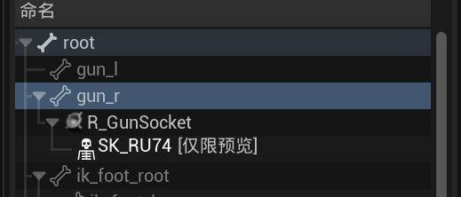

​	上图R_GunSocket就是gun_r的插槽，这个插槽下放了一个仅限预览的枪械模型，我们可以通过观察这个模型在手中的效果预览到我们将真正的武器蓝图绑定到这个插槽时的效果，这个模型仅在当前查看骨骼的页面能看到，在游戏中看不到这个模型，预览效果见下图。

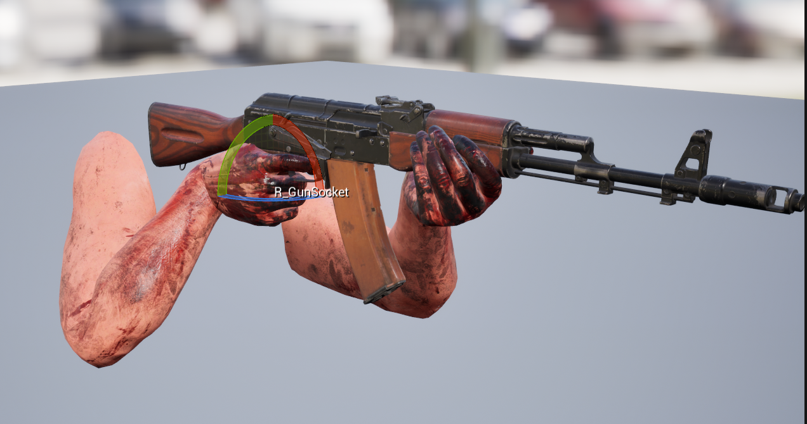

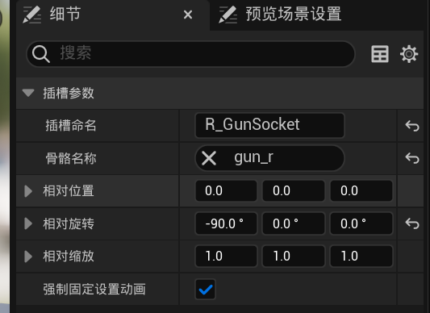

​	上图是细节面板看到的一些数据，比如我们改变了相对旋转中的角度的话，那么武器拿在手中的角度也会随之改变。

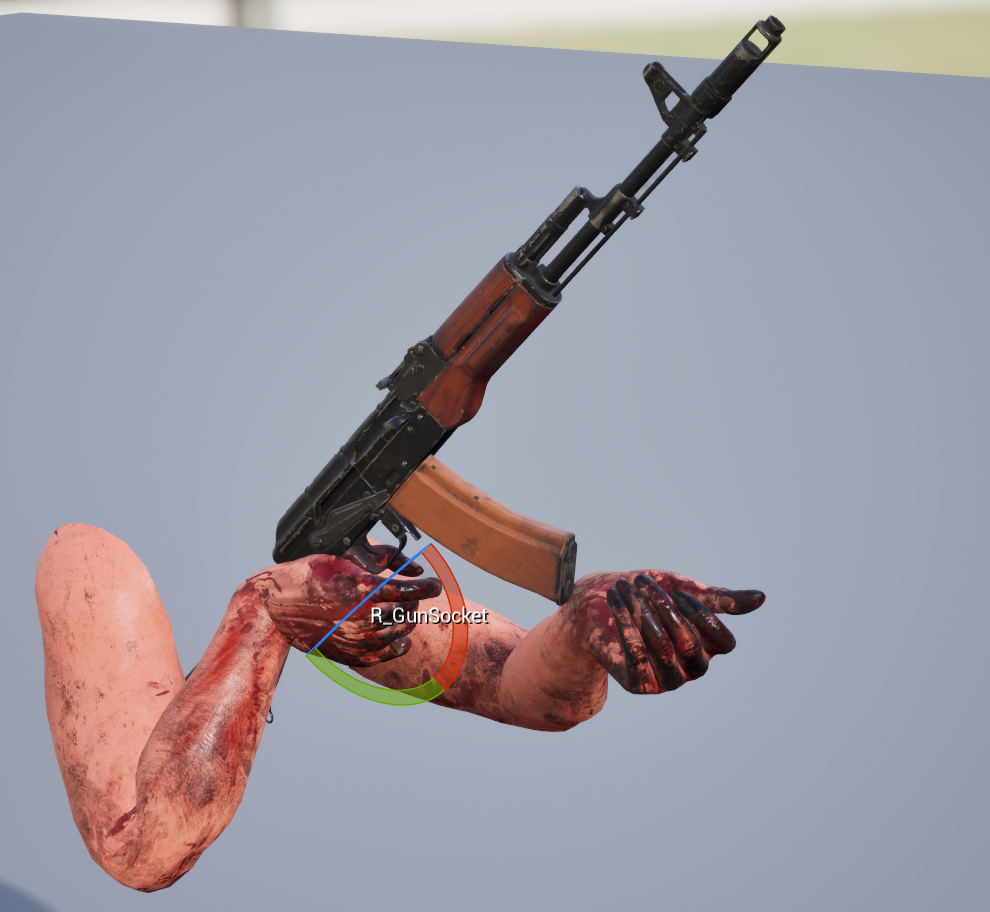

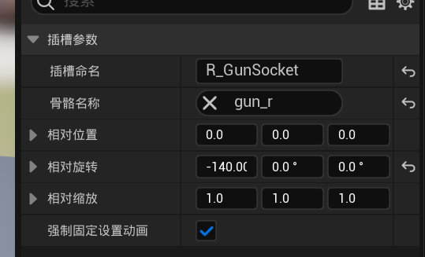

​	这里我们改变的是围绕x轴的旋转角度，可以看到武器在手中的方向已经开始不合常理了，这就是由于插槽变换没有调试好所引起。

## 碰撞

### 碰撞预设

​	碰撞预设是对游戏中物体碰撞行为的预先定义和配置。它规定了物体在与其他物体发生碰撞时的各种属性和反应方式，包括碰撞体的形状、大小、物理材质、碰撞响应类型等。通过设置不同的碰撞预设，开发者可以让游戏中的各种物体表现出符合游戏逻辑和设计需求的碰撞效果。

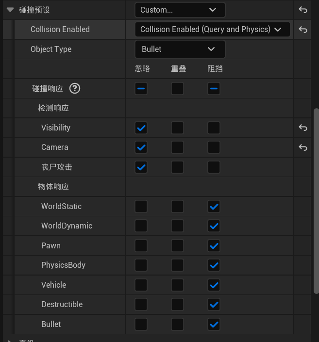

​	一般具有碰撞的组件细节面板上都会有如图所示碰撞预设的设置界面，下面就以此图为例解释各个设置的作用。

- **碰撞预设**：这一栏中间的选项框是系统默认自带的一些设置好的碰撞（即已经配置好的碰撞预设），我们可以利用它们快速的对碰撞进行设置，当然我们也可以选择**Custom（自定义）**（一般是因为系统默认碰撞预设选项无法满足我们的需求），上图就是选择的自定义碰撞预设。

- **Collision Enabled**：**决定是否进行碰撞检测**，这是 “Collision enabled” 最基本的功能。当它被启用时，游戏引擎会对该对象与其他对象之间的碰撞进行检测和计算。例如，在一个赛车游戏中，将赛车的 “Collision enabled” 开启，赛车就会与赛道边界、其他车辆等发生碰撞，引擎会计算碰撞的位置、力度等参数，从而产生相应的碰撞效果，如车辆反弹、减速等。而如果将其关闭，赛车就会直接穿过其他物体，不会有任何碰撞反应，就好像这些物体不存在一样。

  ​	**动态控制碰撞行为**，在游戏运行过程中，可以根据特定的游戏逻辑动态地开启或关闭 “Collision enabled”。比如，当玩家进入一个特定的技能无敌状态时，可以通过脚本将玩家角色的 “Collision enabled” 暂时关闭，使玩家在一段时间内不会受到敌人攻击的碰撞伤害，增强游戏的策略性和趣味性。

  ​	这里我们启用了**检查和物理**。

- ：这个选项需要与下面的众多**响应类型**放在一起理解比较好。首先**Object Type**本身所填的内同也是一种**响应类型**（可以在图片最下方也看到有一个叫**Bullet**的类型。

  ​	这里**Object Type**所选的类型，就是为**该组件自身所设定的类型**，而下面的则是**该组件自身的类型（即Bullet）需要对各种其它类型物体的碰撞设置**。

  ​	比如，我们当前**子弹蓝图类**的**Object Type**（碰撞类型）就是这个**Bullet**，然后有一个**僵尸蓝图类**它的碰撞预设里面的**Object Type**选择的是**Pawn**，那么回看子弹蓝图的碰撞预设，**Bullet与下面的Pawn的碰撞关系是阻挡，且在僵尸蓝图类里面Pawn与下面的Bullet的碰撞关系也是阻挡，两边的碰撞预设种与对方的关系都是阻挡的话，那么当子弹触碰到僵尸时，僵尸就会阻挡子弹**。

  ​	总结碰撞关系的一些规则，**双方阻挡才是阻挡，一方阻挡不会阻挡**。

- 关于**Object Type**我们是可以自己新建碰撞通道（即碰撞类型）的，只需要在**项目设置**里面，找到**Collision（碰撞）**。

  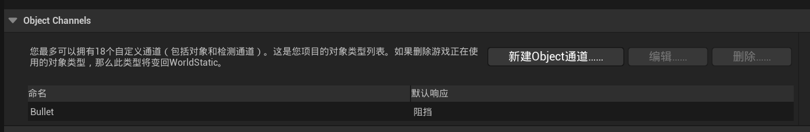

  ​	之后点击**新建Object通道**，设置通道名字和默认相应即可。

## 光照效果

### 光照调节小技巧

#### （1）投射阴影

​	在一些有实体的蓝图组件（比如静态网格体、骨骼网格体、在场景中能看到的一些组件）的细节面板，找到**光照**一栏，可以选择是否**投射阴影**。

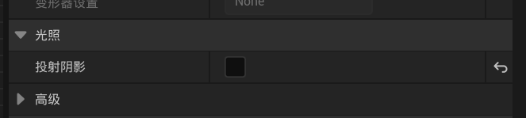

- 取消勾选：该组件在场景中将不会有影子。
- 勾选：该组件在场景中会有影子。

## 渲染

### 渲染调节小技巧

#### （1）主通道渲染

​	一般的在**游戏中可见的**一些网格体模型等组件，细节面板的**渲染**一栏，可以找到**主通道渲染**选项（位于下图中最后一个位置）

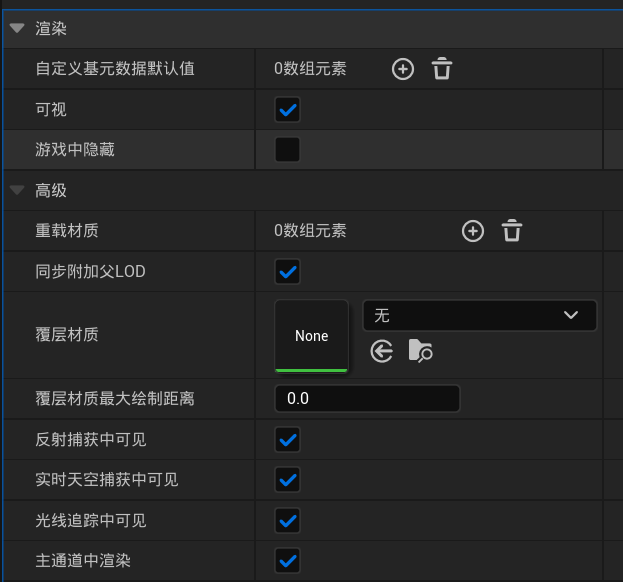

- 如果为true，则此组件将在主通道中渲染（包括Z预通道、基础通道、透明度）
- 功能就是如果不勾选，那么这个组件在游戏中就是看不到的；如果勾选了，就能看到。

##### **进阶小技巧**

**主通道渲染+投射阴影**

​	通常情况下第一人称射击游戏只有一双胳膊，没有身体的其他部分，我们在游戏里也是看不到身体的。但是如果我想要CS2那种可以看到自己的腿脚的功能，但是又要有全身的影子，应该怎么做？

​	首先就是需要**准备好身体各个部分的骨骼网格体模型**，必须是各个部分，这样的话我们方便对不同的身体部分进行设置。

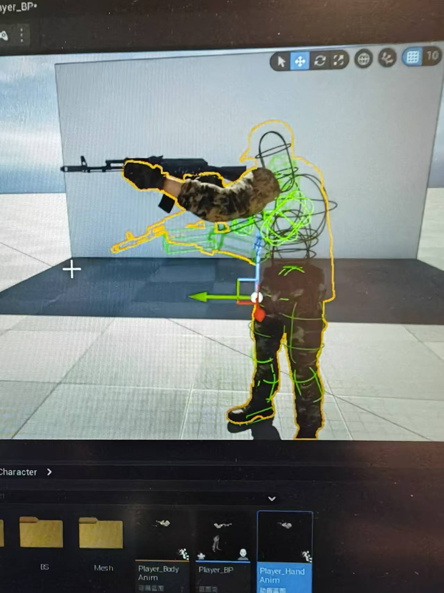

​	如上图所示，我们其实是有两套模型的，一套就是第三人称视角下的人物完整模型（图中虚边和腿脚模型），另外一套就是第一人称视角下的一双手臂模型。这里我们第一套模型里面**上半身包括头部全部取消勾选了主通道渲染**，取消之后在游戏中我们就看不到上半身的模型了，上半身就是空的，下半身腿脚仍然保留，因为我们希望在游戏中可以看到自己的腿脚。

​	关闭上半身的主通道渲染的目的是防止我们在操控第二套模型的时候（因为我们这里目标是第一人称游戏嘛，所以操控的是第二套模型）摄像机会背上半身挡住，会穿模，所以**通过取消主通道渲染，让摄像机内看不到上半身的模型**，也就不会穿模了。

​	但是这里我们仍然会有第一套模型**全身的影子**因为主通道渲染是不会影响阴影投射的，也就是说，**虽然游戏内玩家看不到上半身的模型，但是并不代表模型不存在，不代表影子不存在**，只是玩家视觉上看不到了。

​	这样，玩家在游戏中就会有更真实的感觉，能看到自己的影子和下半身，同时摄像机又不会因为穿模而看到自己上半身的内部模型。

## AI行为树

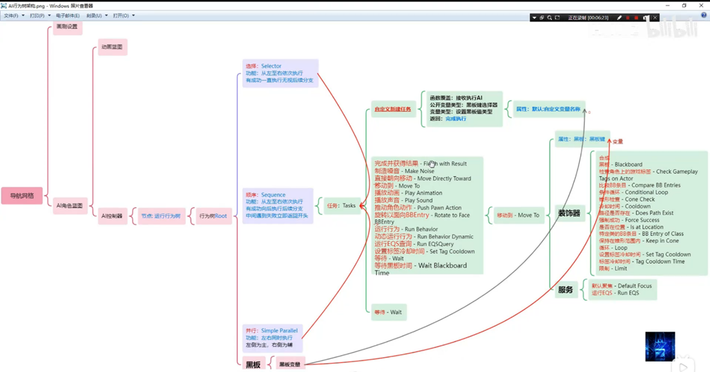

  上图为AI行为树大致纲要。

  那么我对于行为树的理解，就像是人类需要大脑来进行思考一样，AI行为树就是NPC的大脑，这里虽然称作AI行为树，但是这里的AI意思就是需要我们在行为树中写出来的AI，并不是有一个AI机器人在帮我们操控NPC。

  玩家操控的角色需要去哪里、做什么、怎么做，这些事情由玩家的大脑决定。那么NPC需要去哪里、做什么等，就需要AI行为树来决定。

  在引擎中或程序中我们为NPC写好行为树的内容，即在行为树中通过逻辑节点和蓝图实现NPC所需要的活动，我们要仔细斟酌什么情况下NPC应该是什么样的状态，进而在蓝图中编写对应状态的行为表现，这大概就是AI行为树的作用。

## UMG UI设计

​	UMG 即 Unreal Motion Graphics，是虚幻引擎（Unreal Engine）中的一个用户界面（UI）设计系统，主要用于创建 2D 用户界面。

### 1、功能特点

- **可视化设计**：UMG 提供了可视化的界面设计工具，开发者可以像在图形设计软件中一样，通过拖放、排列和调整各种 UI 元素，如按钮、文本框、图像等，快速创建出美观、直观的用户界面，无需编写大量代码，大大提高了 UI 设计的效率。
- **丰富的 UI 元素库**：包含了各种基础和高级的 UI 元素，除了常见的按钮、文本框等，还支持进度条、滚动条、下拉菜单等复杂的交互元素。这些元素都具有可定制的属性，开发者可以根据项目需求自由调整它们的外观、大小、颜色、字体等，以实现多样化的 UI 风格。
- **动画和交互功能**：支持为 UI 元素添加动画效果和交互逻辑。开发者可以通过设置关键帧、过渡效果等，使 UI 元素在特定事件触发时进行移动、缩放、淡入淡出等动画展示，增强用户与界面的交互体验。例如，可以为按钮添加按下时的缩放和变色动画，让用户操作更加直观和有趣。
- **数据绑定和逻辑处理**：能够与游戏中的数据进行绑定，实现 UI 元素与游戏状态的实时同步。比如，可以将角色的生命值、弹药数量等信息显示在 UI 界面上，并随着游戏进程的变化而动态更新。同时，UMG 还支持编写蓝图脚本或 C++ 代码来处理 UI 的逻辑，如按钮点击事件、菜单切换逻辑等，使 UI 与游戏的其他系统紧密结合。

### 2、如何创建用户控件（UI）

​	在内容浏览器空白处鼠标右键，找到用户界面选项，点击控件蓝图，如下图所示。

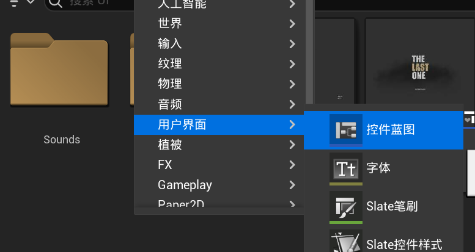

​	然后需要我们为新的控件选择一个父类，如下图所示，我们直接选择**用户控件**即可。

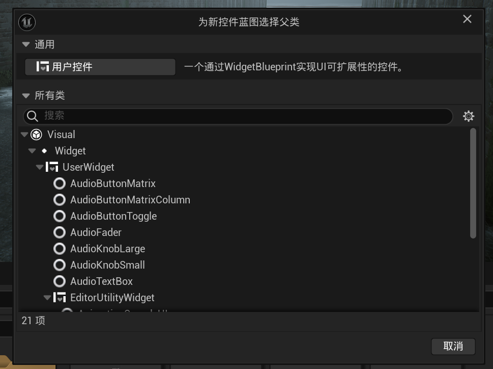

​	最后不要忘记重命名一下新建的用户控件，可以使用UMG打头，养成好习惯。

### 3、用户控件内容简单介绍

​	点开新建的用户控件，如下图所示。

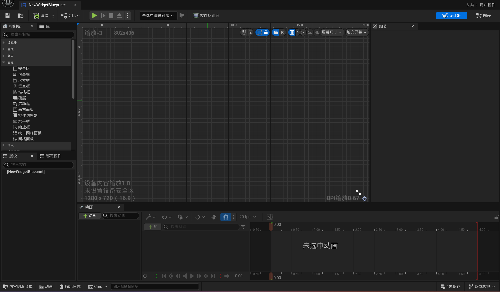

​	用户控件分两个大模块，一个是设计器、另一个是图表（位于上图右上角处的两个选项卡）。

- **设计器**：主要用于UI界面的设计、排版工作，丰富UI界面。

- **图表**：主要根据**设计器**的UI设计，编辑相对应的功能，是我们编写蓝图的地方，可以在此实现UI界面与游戏数据的一些交互。

  ​	比如我们**UI界面**设计了一个按钮，那么**图表**中可以写按下按钮会触发的事件；或者FPS游戏中玩家的血量和子弹数量发生了变化，需要UI跟随变化，那么就可以在**图表**中与玩家蓝图通信，获取血量和子弹数量的数据，进而修改UI上的数字。

### 4、用户控件使用指南

​	下面尽量详细的分别介绍用户控件中**设计器**和**图表**的使用方法，因为二者之间存在交互过程，所以不免会出现交叉的内容，可以两部分并行查看。

#### 设计器

​	设计器界面如下图所示。

​	中间是观看我们设计的UI的视口，左边的**控制板**是创建UI界面的各种工具、**层级**负责显示我们当前创建的UI界面中**各个工具的从属关系**，右边一列是**控制板工具**的细节面板，用于详细调整各个部分的属性。下面是动画窗口，可供我们为UI创建动态效果，比如UI界面的淡入、淡出、闪烁等效果。

**控制板各种工具详解**

##### 1、Canvas Panel（画布面板）

​	**画布面板**在控制板中**面板**栏下，找到并拖入中间的视口，也可以拖到**层级**窗口中，右边即为画布面板的细节窗口，如下图所示。

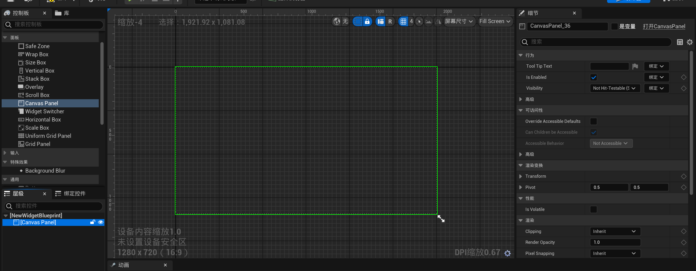

**提供基础布局空间**

- **承载 UI 元素**：作为 UI 元素的容器，画布面板为其他 UI 组件（如按钮、文本框、图像等）提供了一个放置和显示的空间。开发者可以将各种 UI 元素添加到画布面板中，使其成为一个完整的用户界面的一部分。
- **界定显示区域**：它定义了一个特定的矩形区域，在这个区域内的 UI 元素才会被显示和交互。超出画布面板边界的内容通常会被裁剪，这有助于控制 UI 元素的显示范围，避免界面出现混乱和重叠。

**实现精确位置定位**

- **绝对定位**：画布面板允许开发者使用绝对坐标来精确地定位其中的 UI 元素。通过设置每个 UI 元素在画布面板中的 X 和 Y 坐标值，可以将它们放置在指定的位置上，从而实现对 UI 布局的精细控制。这对于创建具有特定位置要求的界面，如游戏中的 HUD 元素（如生命值显示、弹药数量显示等）非常有用，能够确保这些元素在屏幕上的位置始终保持固定和准确。
- **层级管理**：在画布面板中，UI 元素按照添加的顺序或设置的层级顺序进行显示。可以通过调整元素的层级来控制它们的显示优先级，使重要的元素能够显示在其他元素的上方，避免被遮挡，从而实现更复杂的界面设计，例如弹出窗口、菜单等需要覆盖在其他内容之上的 UI 元素。

**支持动态操作和调整**

- **运行时调整**：在游戏或应用程序运行时，可以通过脚本（如蓝图或 C++）动态地修改画布面板及其包含的 UI 元素的属性。例如，可以根据游戏中的不同场景或玩家的操作，动态地显示或隐藏某些 UI 元素，改变元素的位置、大小、颜色等，以实现灵活多变的用户界面效果。
- **动画和过渡**：配合 UMG 的动画系统，画布面板可以为其中的 UI 元素添加各种动画效果，如移动、缩放、旋转、淡入淡出等。通过在不同的时间点设置关键帧，并定义 UI 元素在这些关键帧之间的过渡效果，可以创建出流畅、生动的 UI 动画，提升用户体验。

​	总的来说，就是如果我们要创建一些位置固定的UI且可以随屏幕分辨率变化而变化的UI界面，就可以选择使用**画布面板**为整个UI界面打底。

##### 2、Image（图像）

​	**图像**位于控制板的**通用**栏下，拖入视口，如下图所示。

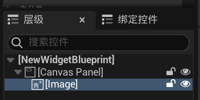

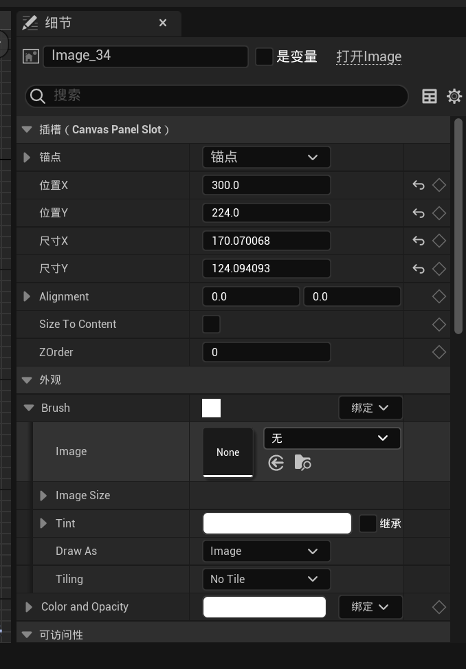

​	这里仅展示**层级**和**细节面板**便于下面讲解，视口自行测试查看。

###### 锚点

​	**控制 UI 元素布局**

- **自适应屏幕分辨率**：通过设置锚点，UI 元素能够根据不同的屏幕分辨率和窗口大小自动调整位置和大小，实现自适应布局。例如，将一个按钮的锚点设置在画布面板的右下角，那么无论屏幕分辨率如何变化，按钮都会始终保持在右下角的位置，并且相对位置和大小会根据屏幕的缩放自动调整，确保 UI 在各种设备上都能保持良好的显示效果，避免出现布局错乱的问题。
- **保持元素相对位置**：锚点可以用来定义 UI 元素之间的相对位置关系。比如，将一个文本框的锚点设置为与某个图像的右侧对齐，那么当图像的位置发生变化时，文本框会自动跟随并保持与图像右侧的相对位置不变。这样在进行复杂的 UI 设计时，能够方便地实现元素之间的对齐和排列，使界面更加整洁、美观。

​	**实现动态 UI 效果**

- *响应式布局调整**：在游戏运行过程中，可能会出现各种情况导致 UI 需要进行动态调整，如切换游戏模式、显示不同的界面内容等。锚点使得 UI 元素能够根据这些变化自动重新布局。例如，当游戏从全屏模式切换到窗口模式时，通过合理设置锚点，UI 元素可以自动调整位置和大小，以适应新的窗口尺寸，为玩家提供无缝的体验。
- **配合动画和交互**：锚点与动画系统相结合，可以实现更加丰富的 UI 动画效果。当 UI 元素进行动画操作（如移动、缩放等）时，锚点可以作为动画的参考点，使动画效果更加自然和符合设计需求。比如，一个菜单按钮在展开和收起时，以其左上角的锚点为中心进行缩放和移动动画，能够给用户带来流畅、直观的交互体验。

​	**提高 UI 设计效率**

- **快速定位和布局**：在设计 UI 时，使用锚点可以快速地将 UI 元素放置到合适的位置，并确定其与其他元素的相对关系。设计师无需手动计算每个元素在不同分辨率下的具体坐标和尺寸，大大提高了 UI 设计的效率和准确性。同时，在团队协作中，统一使用锚点进行 UI 布局可以使不同成员的设计工作更加协调和一致，便于后续的修改和维护。
- **模板和复用**：利用锚点设计的 UI 元素可以更容易地被制作成模板并进行复用。由于锚点定义了元素的布局和相对位置关系，当需要在多个界面中使用类似的 UI 组件时，只需将设置好锚点的模板进行复制和调整，就可以快速创建出符合需求的新界面，减少了重复工作，提高了项目的开发效率。

​	**锚点**下面可以具体设置Image距离锚点的相对位置、尺寸等，还有**Alignment（对齐）**设置，其中**Size to Content（大小到内容）**选项则用于将内容撑满整个Image空间，在该**图像控件**中效果不明显，详见**Text（文本控件）**的介绍。

###### Brush（笔刷）

​	细节面板中**Brush（笔刷）**栏下是我们设置要显示的图片的地方，也可以继续调整图像的大小、着色等属性，优化UI界面。

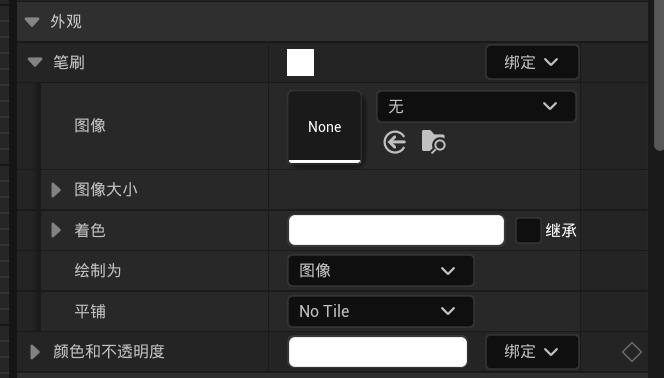

##### 3、Text（文本控件）

​	该控件用于显示UI界面的文字内容，可以嵌套在其它控件中，以文本的形式告诉玩家信息。

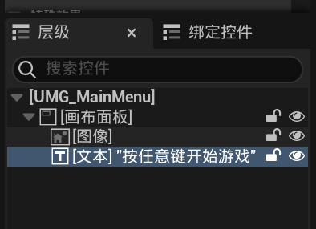

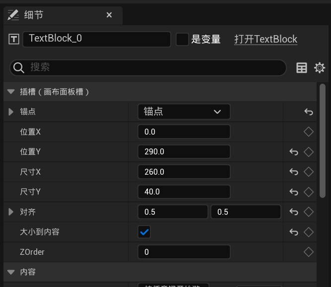

**大小到内容**

​	这里勾选了**大小到内容**，它的作用可以理解为自适应的调整控件的大小，举个例子，**文本控件**初始状态如下图所示。

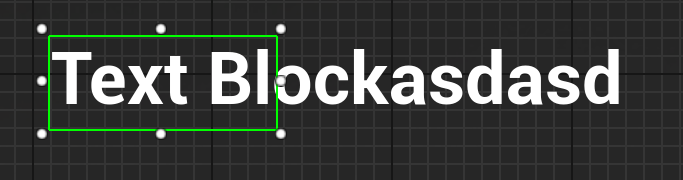

​	即文本框无法完全框住文本内容，此时并没有勾选**大小到内容**，当我们勾选该选项之后，效果如下图所示。

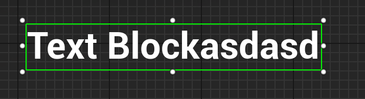

​	这就是**大小到内容**的效果，其它控件同理。

##### 4、进度条

​	该控件作用顾名思义，它位于**控制板**的**通用**里面。

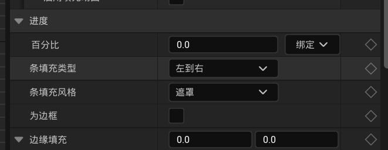

​	这里着重讲一下进度条最重要的功能，就是**进度**。

​	进度条拖进来之后是一个条状的控件，通过设置这里的百分比来调整进度条的进度，如下图所示。

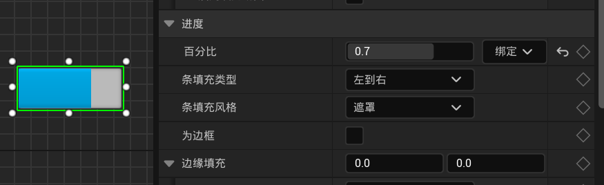

​	这里百分比是0.7，对应进度条控件的进度有70%，进度条的样式、颜色都可以改，这些都很好理解不再赘述，但是这样调整数值是写死的，如果想用进度条表示玩家剩余血量，那么我们就要动态调整这里的百分比，如何动态调整？

​	点击右边的绑定，创建绑定，之后会进入到图表界面。

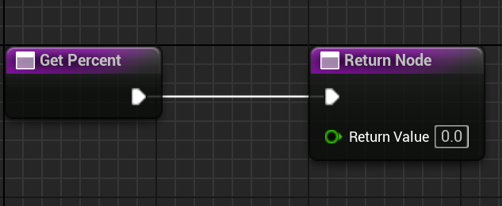

​	我们会进入上图所示蓝图编写界面，与此同时，左边也会对应增加一个这样的函数，如下图所示。

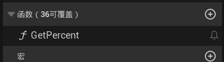

​	这个函数的返回值**Return Value**就绑定到了刚才的**百分比**，即这里传递给它的是多少，那么我们的百分比就是多少，对应的进度条就会根据这个百分比进行修改，那么具体我们应该传递什么值，进度条应该怎样变化，我们可以根据需要自行设计。（建议通信到其它蓝图获取数据）

​	**那么这里我们就学习了对控件的细节面板中的数据进行绑定的操作，关于细节面板里面的其它数据，往往也有很多可以绑定的地方，对于这些内容（比如通过绑定颜色实现渐变效果等）如果非必要我将不再赘述，自行摸索。**

##### 5、垂直框

​	该控件下的子控件默认均为垂直排列，便于UI界面的规范设计，位于**控制板**的**画板**栏下。

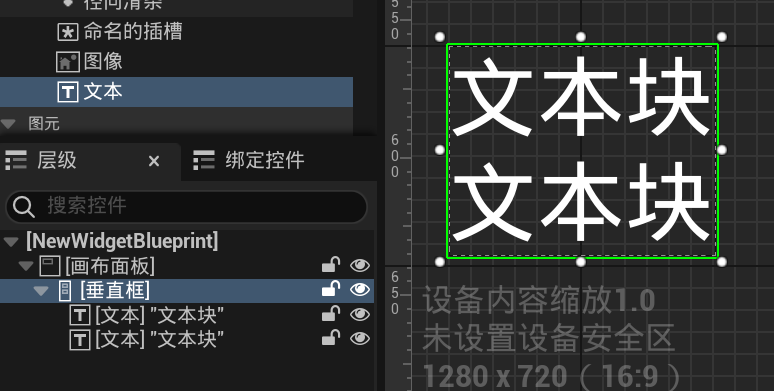

​	可以看到，上图中两个文本块均为垂直框的子控件，它们默认就是垂直的排列方式。

​	可以使用**大小到内容**将垂直框完全包裹住这些文本块。

##### 6、水平框

​	该控件下的子控件默认均为水平排列，便于UI界面的规范设计，位于**控制板**的**画板**栏下。

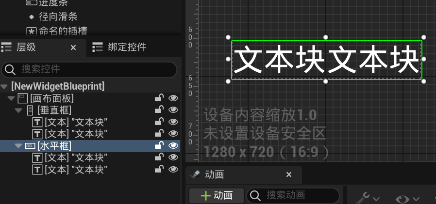

​	可以看到，上图中两个文本块均为水平框的子控件，它们默认就是水平的排列方式。

​	可以使用**大小到内容**将垂直框完全包裹住这些文本块。

##### 7、按钮

​	位于，位于**控制板**的**通用**栏下。

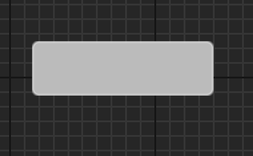

​	拖入视口中就是上图所示效果。

​	下面介绍一下按钮的使用方法。

​	按钮通常是为了给玩家提供选择的控件，比如开始游戏、重启游戏、继续游戏、或是技能按钮等都是常用的地方，那么用户控件里面的按钮如何与游戏其它数据进行交互呢？

​	首先我们需要勾选控件细节面板中的**“是变量”**，如下图所示。

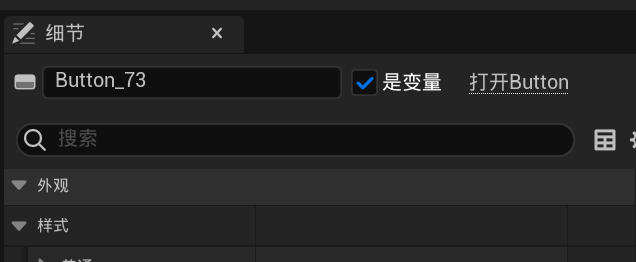

​	之后进入图表即可看到变量里面已经出现了这个按钮对象的引用，如下图所示。

​	选中这个变量，在它的细节面板中就可以看到**事件**栏中就会有各种可以触发的事件，如下图所示。

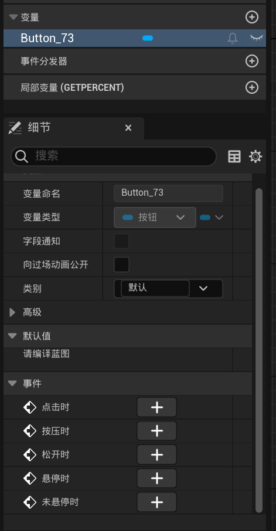

​	我们根据需要添加事件并编写对应功能即可（这些事件也可以在**设计器**的按钮细节面板中找到）。

#### 图表

##### 1、Play Animation（播放动画）

​	该节点用于播放**设计器**页面为UI设计的一些动画，比如淡入、淡出、闪烁等效果。注意该节点后面最好跟一个**Delay（延迟）**节点，且延迟时间与该节点动画时间相同，这样动画才能等到动画播放完毕再去执行后面的功能，否则可能衔接不好这个效果。

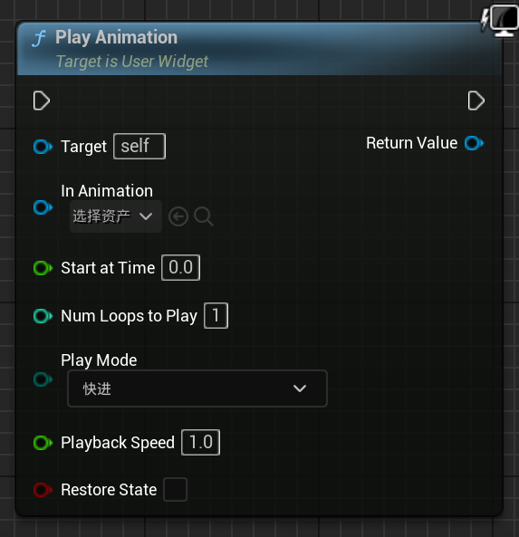

- **Target**：用户控件对象引用，通常情况下该节点在用户控件的图表里编写，使用Self即可，如果写在其它蓝图下，则需要蓝图通信连接目标对象的引用。

- **In Animation**：选择要播放的动画资产，这里的动画通常是**设计器**下方我们自己设计的动画。

  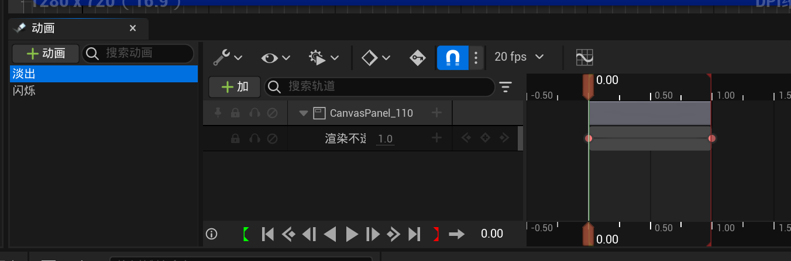

- **Start at Time**：（相对于动画开始位置）动画播放开始的时间，如果该动画是一个循环动画，则只会对第一次播放有效。

- **Num Loops to Play**：循环动画的次数，0为**无限循环**。

- **Play Mode**：动画播放的方式。

  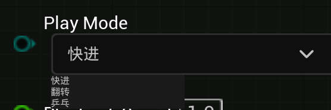

  1. 快进：即正序播放，不要理解为加速播放。
  2. 翻转：即倒序播放。
  3. 乒乓：画先按照正常顺序从起始帧播放到结束帧，到达结束帧后，接着反向从结束帧播放回起始帧，如此循环往复，就像乒乓球在球桌上往返运动一样。

- **Playback Speed**：动画播放速度。

- **Restore State**：动画停止时动画将恢复为预设置状态。

- **Return Value**：UMG序列播放器对象引用，就是播放这个动画的播放器，不常用。

##### 2、Remove from Parent（从父项中移除）

​	用于移除我们显示到玩家屏幕中的UI。

引擎解释：从父控件移除控件，如果此控件被添加到玩家的画面或视口，其也将从这些容器中移除。

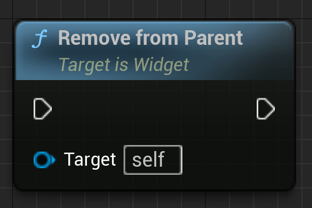

- **Target**：目标是控件。
- 该节点并不是真正的销毁**Target**控件，我们可以理解为从玩家的屏幕上暂时移除掉，且这个界面在移除后仍然可以再次添加到视口，不用再创建控件。

##### 3、Event Construct（事件构造）

​	该事件为用户控件蓝图自带的事件，可以被多次调用。

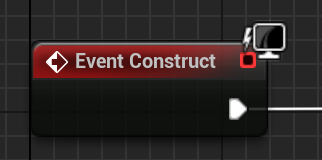

​	可以暂且理解为每当控件被添加到视口之后就会调用一次的事件。

4、SetText(Text)（设置文本（文本））

​	常用来修改**文本控件**中的文本值，前提是需要将**文本控件**勾选**“是变量”**。

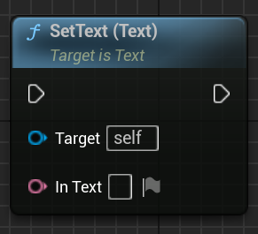

- **Target**：这里连接要修改的文本。
- **In Text**：修改为什么内容，写在这里。

### 5、用户控件的应用

#### 使用流程

​	该部分主要阐述如何将我们精心设计好的**用户控件（即UI界面）**应用到玩家的屏幕上。

​	这部分**内容通常都写在关卡蓝图内**，因为关卡蓝图中写的功能在整个地图中都有效，可以保证用户控件稳定存在，不会因为某个Actor被销毁而不能使用UI，且比较方便管理。下面的介绍大多会在关卡蓝图中，因此后面不再强调。

1. 在关卡蓝图中**Create Widget创建控件**。
2. 创建控件之后最好提升为一个变量，方便后续使用。
3. 使用蓝图节点**Add to Viewport（添加到视口）**

​	注意一定要先**创建控件**，之后才添加到视口。

#### 1、Create Widget（创建控件）

​	使用了该节点之后只是把创建的控件存入了游戏的内存里面，并不会显示在玩家的屏幕上。

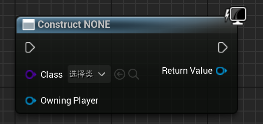

- **Class**：选择要创建的**用户控件**。

- **Owing Player**：玩家控制器对象引用，拥有此控件的玩家，新手不需要了解。

- **Return Value**：返回的就是该节点创建的**用户控件（UMG）**的引用，通常我们会习惯性的衔接一个**提升为变量**，方便在关卡蓝图的其它地方用到该控件时可以及时的从变量中调出，见下图。

  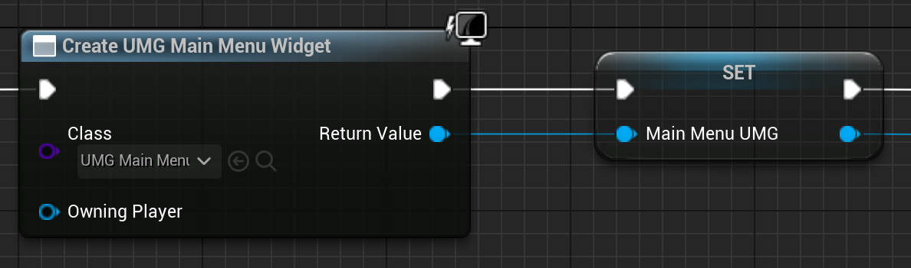

#### 2、Add to Viewport（添加到视口）

​	使用该节点可以将创建好的用户控件真正的添加到玩家的屏幕上。

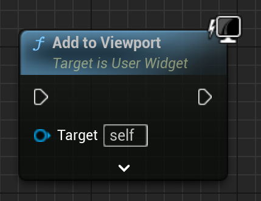

- **Target**：连接需要添加到视口的用户控件即可。

#### 3、Set Input Mode Game And UI（设置输入模式游戏和UI）

​	在游戏开发中，输入模式决定了玩家输入（如键盘按键、鼠标点击、游戏手柄操作等）如何被游戏引擎接收和处理。Set Input Mode Game And UI 这种输入模式允许玩家同时与游戏世界和用户界面（UI）进行交互。也就是说，玩家既可以控制游戏中的角色进行移动、攻击等操作，又可以点击 UI 上的按钮、输入文本等。

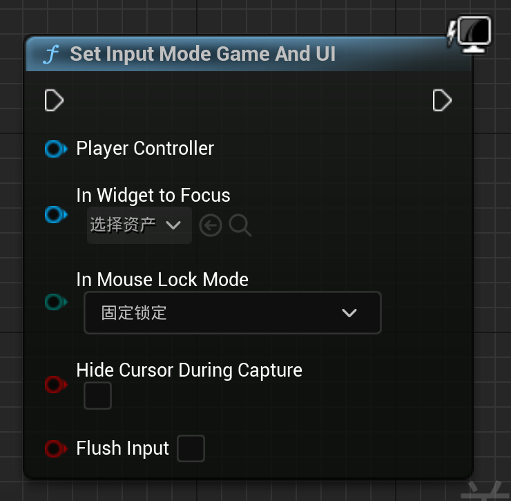

- **Player Controller**：玩家控制器，对应节点名中**游戏**部分。

- **In Widget to Focus**：用户控件（UMG），对应节点名中**UI**部分。

- **In Mouse Lock Mode**：用于控制光标的范围。

  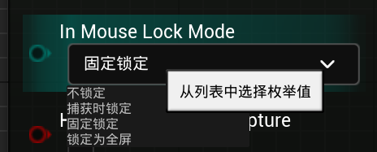

  ​	当前选择的**固定锁定**就是将光标控制在游戏窗口内，无法移动出去。

- **Hide Cursor During Capture**：决定在进行 UI 交互时是否隐藏鼠标光标。如果设置为 True，当鼠标与 UI 元素交互时，光标会隐藏；设置为False则光标始终可见。

- **Flush Input**：在游戏运行过程中，玩家的输入操作（如按键、鼠标点击等）会被暂时存储在输入缓冲区中。当切换输入模式为 Game And UI 时，之前在**其他输入模式下积累的输入可能会干扰新输入模式下的操作逻辑**。**Flush Input**可以**清除输入缓冲区中的所有待处理输入事件**，确保在进入新的输入模式时，不会受到之前残留输入的影响。例如，在从仅游戏输入模式切换到 Game And UI 模式时，如果不清除输入缓冲区，玩家之前按下的某个按键可能会在新的输入模式下误触发 UI 操作或游戏动作。

#### 4、Set Input Mode UI Only（设置输入模式仅UI）

​	在游戏或应用程序里，输入模式决定了玩家输入（像键盘敲击、鼠标点击、手柄操作等）如何被引擎接收与处理。Set Input Mode UI Only这种输入模式把输入焦点限定在 UI 上，玩家没办法直接操控游戏中的角色或物体，只能对 UI 元素（例如按钮、文本框、滑动条等）进行操作。

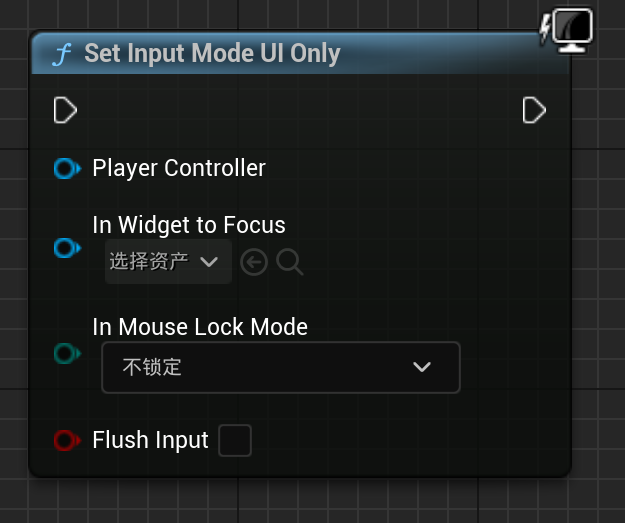

- **Player Controller**：玩家控制器，

- **In Widget to Focus**：用户控件（UMG），对应节点名中**UI**部分。

- **In Mouse Lock Mode**：用于控制光标的范围。

  

  ​	当前选择的**固定锁定**就是将光标控制在游戏窗口内，无法移动出去。

- **Flush Input**：在游戏运行过程中，玩家的输入操作（如按键、鼠标点击等）会被暂时存储在输入缓冲区中。当切换输入模式为UI Only 时，之前在**其他输入模式下积累的输入可能会干扰新输入模式下的操作逻辑**。**Flush Input**可以**清除输入缓冲区中的所有待处理输入事件**，确保在进入新的输入模式时，不会受到之前残留输入的影响。例如，在从仅游戏输入模式切换到 UI Only 模式时，如果不清除输入缓冲区，玩家之前按下的某个按键可能会在新的输入模式下误触发 UI 操作或游戏动作。

**应用场景**

- **游戏菜单界面**：在游戏的主菜单、暂停菜单、设置菜单等界面中，通常会采用 Set Input Mode UI Only模式。这样玩家就能专注于点击菜单上的按钮、调整设置选项等操作，而不会意外控制游戏角色移动，避免干扰菜单操作。
- **对话框与提示界面**：当游戏弹出对话框（如确认对话框、提示信息框等）时，切换到该输入模式，能保证玩家只能与对话框上的按钮（如 “确定”“取消”）进行交互，防止玩家在处理对话框时误操作游戏角色。
- **教学引导界面**：在游戏的新手教学阶段，为了让玩家集中注意力学习 UI 的操作方法，可使用 Set Input Mode UI Only 模式。玩家可以按照教学提示点击 UI 上的各个元素，更好地理解游戏的操作流程。

#### 5、Set Input Mode Game Only（设置输入模式仅游戏）

​	在游戏开发中，输入模式决定了玩家的输入（如键盘按键、鼠标移动、手柄操作等）如何被游戏引擎接收和处理。Set Input Mode Game Only这种模式下，玩家的输入操作将主要用于控制游戏中的角色移动、执行技能、与游戏世界中的物体进行交互等，而 UI 元素不会接收玩家的输入事件，鼠标光标通常也会被隐藏（可根据需求设置）。

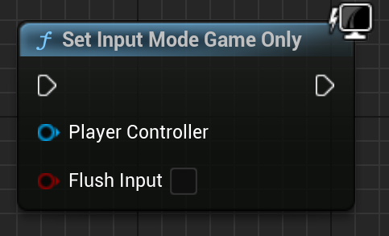

- **Player Controller**：玩家控制器对象引用

- **Flush Input**：在游戏运行过程中，玩家的输入操作（如按键、鼠标点击等）会被暂时存储在输入缓冲区中。当切换输入模式为 Game Only 时，之前在**其他输入模式下积累的输入可能会干扰新输入模式下的操作逻辑**。**Flush Input**可以**清除输入缓冲区中的所有待处理输入事件**，确保在进入新的输入模式时，不会受到之前残留输入的影响。

  ​	例如，在从仅游戏输入模式切换到 Game Only模式时，如果不清除输入缓冲区，玩家之前按下的某个按键可能会在新的输入模式下误触发 UI 操作或游戏动作。

## 项目设置

​	**位置**：项目设置的位置在引擎窗口最上面一栏中的**编辑**里。

​	**前言**：该部分需要慢慢完善，学一点知道一点写一点，因此它很长一段时间内将不是一个完整的项目设置介绍。

### 项目

#### 地图和模式

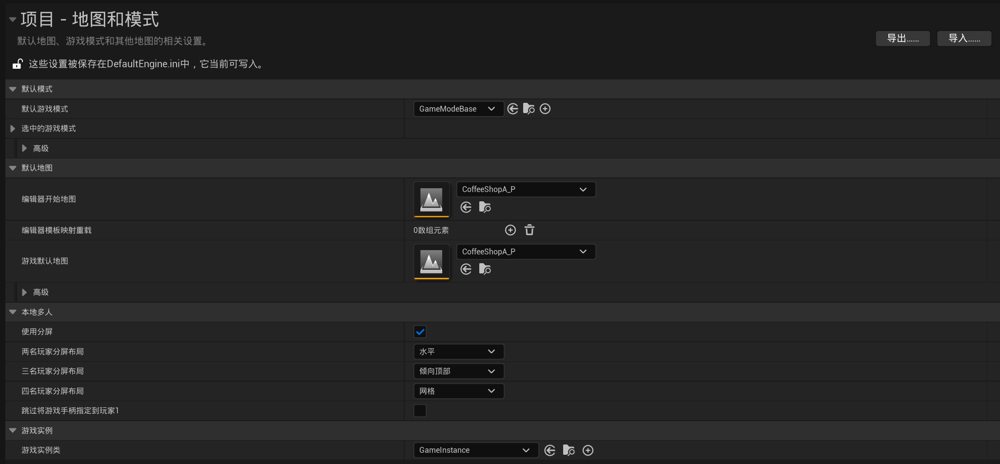

​	这里着重介绍两个地图（关卡）的区别。

- **编辑器开始地图**：这个地图是开发游戏时，我们打开虚幻编辑器之后打开的地图。
- **游戏默认地图**：这个地图是玩家打开游戏之后会进入的地图。

#### 影片

​	这里是设置游戏启动时播放的影片的地方，我们需要准备视频文件。

​	注意：我们需要再项目文件的**“Content”**文件夹下新建一个文件夹，该文件夹的名字必须为**“movies”**不能有任何不同。之后即可将视频文件存入该文件夹下即可。

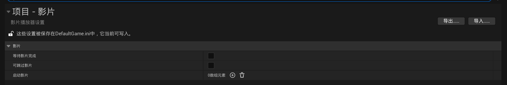

​	准备好视频文件夹及文件之后，找到上图所示页面，点击**启动影片**的加号，如下图所示。

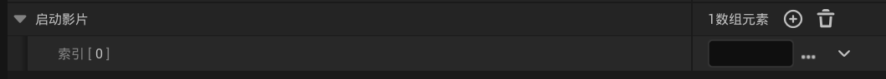

​	点击上图中三个点的地方，选择要播放的视频文件即可。

​	还可以设置影片是否能跳过，是否需要等待影片播放完毕等。

### 游戏

### 引擎

### 编辑器

### 平台

#### 1、Windows

​	着重讲一下Splash和Icon部分的作用。

##### Splash

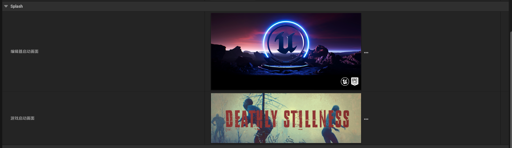

​	这里两张图片分别会在不同的时候显示。

- **编辑器启动画面**：是我们启动这个项目的编辑器的时候显示的图标，开发的时候用的。
- **游戏启动画面**：这个就是给玩家看的画面了，玩家启动我们的游戏之后，桌面上就会出现这个地方选中的图片了。

##### Icon

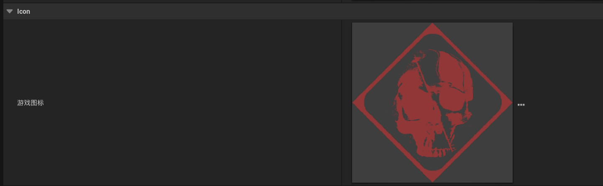

​	这张图片就是我们的游戏图标，它最好是一个正方形的图片（256 x 256，且最好是ico格式的图片，ico格式方便再不同平台的使用），它是我们开启游戏后会显示在桌面下面的任务栏的那种图标，如下图所示。

### 插件

## 项目打包

### Windows平台

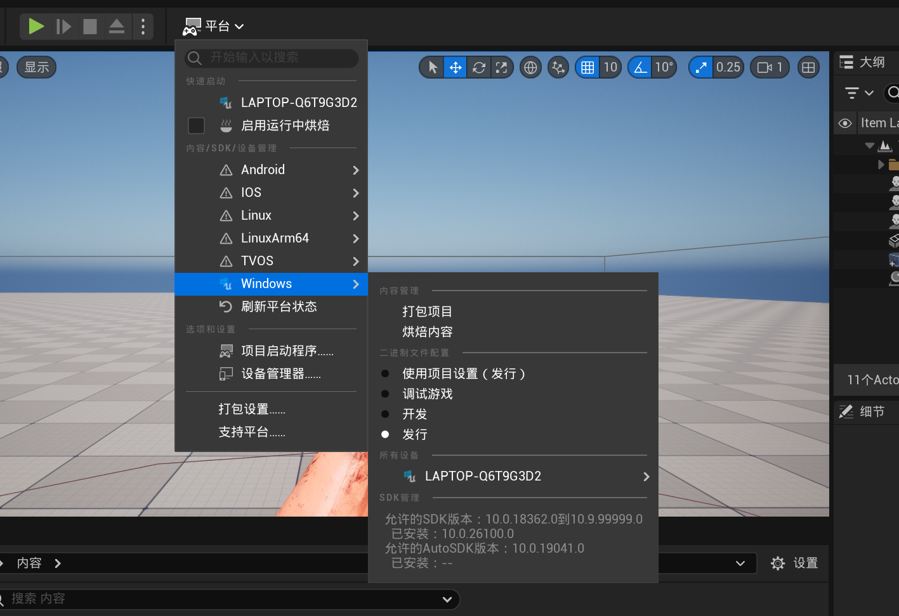

​	在上图所示位置可以找到打包项目的地方。

​	如果我们打包游戏之后还要进行测试，那就选择**开发**之后点击**打包项目**。

​	如果打包游戏之后上架商城给玩家来玩，那就选择**发行**之后点击**打包项目**。

​	打包日志中出现success之后即为打包成功，此时在项目文件夹里面会有一个**Windows**命名的文件夹，点开文件夹，里面出现的两个txt文件可以删掉，其余是游戏内容，点击exe文件即可打开游戏了。

**常见打包失败原因**

1. 虚幻引擎安装路径有中文。
2. VS编译器的安装路径有中文。
3. 项目文件的存放路径有中文。
4. 打包文件的存放路径有中文。
5. 有使用第三方插件。

​	总结：尽量不要用中文开发游戏。
