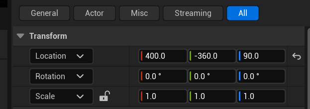
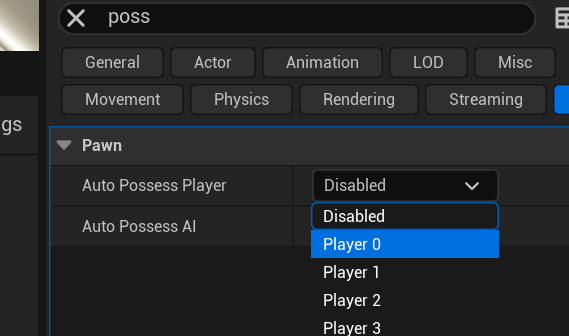
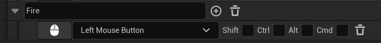

# 典例代码解析

## 前言

本文主要用于ji'lu我学习虚幻引擎过程中遇到的难点及其代码分析。

## 给class添加默认场景组件

```cpp
RootComponent = CreateDefaultSubobject<USceneComponent>(TEXT("MyRoot"));
```

​	该代码通常写在class的构造函数中，拥有该代码的类被拖入到场景中之后可以看到下图所示内容，正常情况下新建的actor类如果没有该代码，则看不到下图所示内容。



## 在游戏世界中生成类的实例

```cpp
AMyActor* NewActor = GetWorld()->SpawnActor<AMyActor>();
```

代码各部分解释

#### `GetWorld()`

- **功能**：`GetWorld()` 是一个常用的函数，它的主要作用是获取当前的游戏世界（`UWorld` 对象）。在虚幻引擎里，游戏世界是一个核心概念，它代表了整个游戏的场景、关卡、对象等的集合。几乎所有与游戏场景交互的操作都需要通过 `UWorld` 对象来完成。
- **返回值**：该函数返回一个指向 `UWorld` 对象的指针，后续可以利用这个指针来调用 `UWorld` 类的各种方法，例如生成新的对象、查找特定的对象等。

#### `SpawnActor<AMyActor>()`

- **功能**：`SpawnActor` 是 `UWorld` 类的一个模板函数，其主要功能是在游戏世界中动态生成一个指定类的新实例。这里使用了模板参数 `<AMyActor>`，明确指定要生成的对象类型为 `AMyActor`。`AMyActor` 通常是开发者自定义的一个继承自 `AActor` 的类，`AActor` 是虚幻引擎中表示游戏世界里各种实体（如角色、道具、场景物件等）的基类。
- **参数情况**：在这个代码示例中，`SpawnActor` 函数没有传入任何参数，这意味着会使用默认的生成参数来创建 `AMyActor` 实例。实际上，`SpawnActor` 函数有多个重载版本，可以接受不同的参数，例如指定生成的位置、旋转角度、生成参数等。

## 设置默认控制玩家

```cpp
AutoPossessPlayer = EAutoReceiveInput::Player0;
```

​	在某个APawn类及其子类的构造函数里使用此代码，可以在游戏开始时直接让玩家控制到该类在世界场景中的实例对象。

​	类似于蓝图中的下图这种操作。



## 类型转换的更安全写法

​	通常情况下我们写的类型转换大概是这样的：

```cpp
类型 变量 = Cast<类型>(被转换变量);
```

​	虽然在大部分情况下这种写法是没有问题的，但是在某些情况下它还是不如下面的代码更加保险。

​	这段代码的背景是在Character类下将CameraComponent（摄像机组件）附加到CapsuleComponent（胶囊体组件，在这里是角色的跟组件）上面。

```cpp
// 将摄像机组件附加到我们的胶囊体组件。
FPSCameraComponent->SetupAttachment(
    CastChecked< USceneComponent, UCapsuleComponent >(GetCapsuleComponent())
);
```

​	`CastChecked< USceneComponent, UCapsuleComponent >(GetCapsuleComponent())` 是 Unreal Engine 中用于类型转换的代码，具体来说是进行安全的强制类型转换操作。其核心目的是将 `GetCapsuleComponent()` 返回的 `UCapsuleComponent` 类型的指针安全地转换为 `USceneComponent` 类型的指针。

### 详细解释

#### 1. `GetCapsuleComponent()`

​	这是一个成员函数调用，通常在继承自 `AActor` 或者与角色相关的类中使用。`GetCapsuleComponent()` 函数的作用是返回一个指向胶囊体组件（`UCapsuleComponent`）的指针。胶囊体组件在 Unreal Engine 里经常用于表示角色的碰撞体，它定义了角色在物理世界中的碰撞范围。

#### 2. `CastChecked` 模板函数

​	`CastChecked` 是 Unreal Engine 提供的一个模板函数，用于执行安全的类型转换。它有两个模板参数，**第一个模板参数是目标类型，第二个模板参数是源类型**。在这个例子中，目标类型是 `USceneComponent`，源类型是 `UCapsuleComponent`。

#### 3. 类型转换逻辑

- **`UCapsuleComponent` 与 `USceneComponent` 的关系**：`UCapsuleComponent` 是 `USceneComponent` 的派生类，也就是说 `UCapsuleComponent` 继承自 `USceneComponent`。因此，从 `UCapsuleComponent` 指针转换为 `USceneComponent` 指针是一种向上转换（从派生类到基类的转换），这种转换在大多数情况下是安全的。
- **`CastChecked` 的安全性**：`CastChecked` 会检查转换是否合法。如果转换成功，它会返回转换后的目标类型指针；如果转换失败（虽然对于向上转换这种情况很少发生），它会触发断言（assertion），这意味着程序会在调试模式下崩溃，并给出详细的错误信息，帮助开发者定位问题。

## 找出"前进"方向

​	在编写控制玩家移动的功能代码时，我们常常需要获取到玩家视角的前向向量，即玩家摄像机的前向向量。

```cpp
FVector Direction = FRotationMatrix(
    Controller->GetControlRotation()
).GetScaledAxis(EAxis::X);
```

​	上面的代码即可实现获取到控制器前向向量。

### 代码详细解释

#### 1. `Controller->GetControlRotation()`

- `Controller` 一般指的是控制角色或摄像机的控制器对象，在 Unreal Engine 中通常是 `APlayerController` 或者 `AIController` 的实例。
- `GetControlRotation()` 是控制器类的一个成员函数，其作用是获取控制器当前的旋转信息，返回值是一个 `FRotator` 类型的对象。`FRotator` 包含了绕 X、Y、Z 轴的旋转角度（Pitch、Yaw、Roll），单位是度。

#### 2. `FRotationMatrix(Controller->GetControlRotation())`

- `FRotationMatrix` 是 Unreal Engine 里用于表示旋转矩阵的类。旋转矩阵可以用来描述三维空间中的旋转变换。
- 这里通过 `FRotationMatrix` 的构造函数，将 `Controller->GetControlRotation()` 返回的 `FRotator` 对象转换为对应的旋转矩阵。**这个旋转矩阵能够把一个局部空间的向量转换到世界空间中**。

#### 3. `GetScaledAxis(EAxis::X)`

- `GetScaledAxis` 是 `FRotationMatrix` 类的成员函数，用于获取旋转矩阵中指定轴的向量。
- `EAxis::X` 是一个枚举值，表示 X 轴。调用 `GetScaledAxis(EAxis::X)` 会返回旋转矩阵中 X 轴对应的向量，也就是在世界空间中，经过旋转后的 X 轴方向向量。在游戏中，通常这个向量代表角色或摄像机的前向向量。

不仅如此，如果我们需要获取向右向量的话，只需要修改`EAxis::X`为`EAxis::Y`即可。

## 实现发射物核心功能代码

​	该部分主要解析官方文档的发射物发射代码，网址：

[3 - 实现发射物 | 虚幻引擎 5.4 文档 | Epic Developer Community](https://dev.epicgames.com/documentation/zh-cn/unreal-engine/implementing-projectiles-in-unreal-engine?application_version=5.4)

​	本文很多地方会即将“发射物”说成“子弹”，在这里它们指的是同一个意思。

​	“你将使用一个摄像机空间中的偏移向量来确定发射物的生成位置。设置该参数为可编辑参数，这样你就可以在 `BP_FPSCharacter` 蓝图中对其进行设置和调整。最终，你可以基于这些数据计算发射物的初始位置。”

​	这里就是在说，我们子弹的生成位置是基于摄像机位置来的，这样即使我们修改了摄像机的位置，它仍然可以在玩家屏幕的正确位置上生成子弹，因为子弹的摄像机的相对位置是固定的，是我们写在代码里写死的。



```cpp
// 设置"发射"绑定
PlayerInputComponent->BindAction("Fire", IE_Pressed, this, &AXGFPSCharacter::Fire);

/*函数中出现的变量的声明*/
//要生成的发射物类。
UPROPERTY(EditDefaultsOnly, Category = Projectile)
TSubclassOf<class AXGFPSProjectile> ProjectileClass;

// 枪口相对于摄像机位置的偏移。
UPROPERTY(EditAnywhere, BlueprintReadWrite, Category = Gameplay)
FVector MuzzleOffset; //枪口偏移量

//Fire函数定义
void AXGFPSCharacter::Fire()
{
	// 试图发射发射物。
	if (ProjectileClass)
	{
		// 获取摄像机变换。
		FVector CameraLocation; //摄像机位置
		FRotator CameraRotation; //摄像机旋转
		GetActorEyesViewPoint(CameraLocation, CameraRotation); //写文档，函数解析

		// 设置MuzzleOffset，在略靠近摄像机前生成发射物。
		MuzzleOffset.Set(100.0f, 0.0f, 0.0f);

		// 将MuzzleOffset从摄像机空间变换到世界空间。
		FVector MuzzleLocation = CameraLocation + FTransform(CameraRotation).TransformVector(MuzzleOffset);

		// 使目标方向略向上倾斜。
		FRotator MuzzleRotation = CameraRotation;
		MuzzleRotation.Pitch += 10.0f;

		UWorld* World = GetWorld();
		if (World)
		{
			FActorSpawnParameters SpawnParams;
			SpawnParams.Owner = this;
			SpawnParams.Instigator = GetInstigator();

			// 在枪口位置生成发射物。
			AXGFPSProjectile* Projectile = World->SpawnActor<AXGFPSProjectile>(ProjectileClass, MuzzleLocation, MuzzleRotation, SpawnParams);
			if (Projectile)
			{
				// 设置发射物的初始轨迹。
				FVector LaunchDirection = MuzzleRotation.Vector();

				//调用发射物类的那个设置发射物速度的函数。
				Projectile->FireInDirection(LaunchDirection); 
			}
		}
	}
}

//Projectile->FireInDirection函数定义
// 初始化射击方向上发射物速度的函数。
void AXGFPSProjectile::FireInDirection(const FVector& ShootDirection)
{
    /*
    * 这里我们直接设置发射物移动组件的速度，而发射物移动组件又会更新CollisionComponent的变换
    * 因为我们曾经使用过ProjectileMovementComponent->SetUpdatedComponent(CollisionComponent);将它们绑在了一起
    * 这样，当该发射物类在世界场景中被实例化之后，我们只需要调用这个函数并传递进来一个方向向量
    * 实例化的发射物移动组件就会立即修改这里的速度，进而带动跟组件移动。
    * 而在游戏中，这个过程给我们的感觉就是我们发射了一个物体，然后这个发射物飞了出去。
    */
    ProjectileMovementComponent->Velocity = ShootDirection * ProjectileMovementComponent->InitialSpeed; //写文档
}
```

​	`ProjectileClass`这是一个 `TSubclassOf<AXGFPSProjectile>` 类型的变量，通常在类的头文件中声明。它用于指定要发射的发射物的类。`TSubclassOf` 是 Unreal Engine 中的一个模板类，用于表示某个类的子类。在这里，我们声明了自定义发射物类型的对象`ProjectileClass`，该对象会调用其构造函数，构造函数会为其创建碰撞、网格体等相关组件。因此这里我们只需要确认`ProjectileClass`是否为空即可，不为空则说明该对象可以被生成，进而发射出去。

​	`GetActorEyesViewPoint`是`AActor` 类的一个成员函数，**用于获取角色眼睛的视角位置和旋转**。它将摄像机的位置存储在 `CameraLocation` 中，旋转存储在 `CameraRotation` 中。通过这个函数，我们可以确保发射物从角色的视角位置和方向发射。

​	`MuzzleOffset`：这是一个 `FVector` 类型的变量，表示枪口相对于摄像机的偏移量。通过 `Set` 函数将其设置为 `(100.0f, 0.0f, 0.0f)`，意味着发射物将在摄像机前方 100 个单位的位置生成。截至到`Set`函数这里，`MuzzleOffset`还并没有发挥它的作用，在此我们仅仅是设置了一个`FVector`类型的变量而已，`(100.0f, 0.0f, 0.0f)`在这里仅仅是一个普通的向量，之所以说它表示枪口相对于摄像机的偏移量，是因为后面使用到了这个变量，到那时它的作用才展现出来，所以读到此处只需要将它当作普通向量即可。

​	`FTransform`：用于表示三维空间中的变换（包括位置、旋转和缩放）的类。`FTransform(CameraRotation)` 创建了一个基于摄像机旋转的变换对象。可以理解为，直接调了`FTransform`的构造函数，参数就是摄像机的旋转，构造出来的东西叫做**“变换”**，变换中包括的有旋转、位置、缩放，由于我们只提供了一个旋转的参数，所以构造出来的变换中，只有位置和缩放都是默认值，只有旋转是我们摄像机的旋转。

​	`TransformVector`：`FTransform` 类的成员函数，用于将一个向量从局部空间变换到世界空间。这里将 `MuzzleOffset` 从摄像机的局部空间变换到世界空间，得到发射物的初始位置 `MuzzleLocation`。

​	由于我们使用的是`FTransform(CameraRotation).TransformVector(MuzzleOffset)`，因此，这里相当于用摄像机旋转构造出的变换（下面称作“摄像机变换”）调用`TransformVector`函数。相信你看了上面的解释还是有些模糊，这里牵扯到3D数学问题，很难在这里给大家讲清楚，但是我们可以就功能而言理解它是怎么用的以及它的效果是什么。

​	使用摄像机变换调用`TransformVector(MuzzleOffset)`，我们不用管那么多弯弯绕绕，它就是将`FVector`类型的数据与调用它的变换进行融合，得到一个新的变换并返回新变换的`FVector`，就像我们拼积木一样，将两块积木拼起来合成一个大积木，最终得到的变换就是搭积木。还记得`MuzzleOffset`的作用吗，我们构造摄像机变换时，只用了摄像机的旋转参数，并没有使用其位置参数，要知道位置参数的数据类型就是`FVector`，而在此我们要将`MuzzleOffset`与摄像机变换合并。说明这里我们需要使用摄像机视角的正方向，同时又需要向正方向偏移100个单位，我们利用摄像机的旋转去获取正方向，再拿`MuzzleOffset`来偏移100个单位，是不是就得到了我们最初想要的：“使用一个摄像机空间中的偏移向量来确定发射物的生成位置”。到此，我们的`MuzzleOffset`就发挥了它的作用，它就是用来偏移位置的。

​	当然，仅仅使用`MuzzleOffset`来向前偏移100单位是错误的，我们需要的是在摄像机原有的位置上偏移100单位，如果没有摄像机自身位置的数据，那么我们的偏移将始终是基于原点的偏移，不会随着摄像机的移动而改变，就像你想增加你的数学知识，你看了一本文学书，它的确增加了你的知识，但是这本书不是基于数学的书，那你增加的知识自然不会加到数学上，而是其它方面。我们想要将发射物的发射位置始终相对于摄像机保持一定偏移，就一定要基于摄像机的位置来进行设置。

```cpp
FVector MuzzleLocation = CameraLocation + FTransform(CameraRotation).TransformVector(MuzzleOffset);
```

​	这就是这段代码的含义，我想尽力把它讲清楚，但总觉得自己说仍旧不够细致，可能有些啰嗦，但是一定有照顾到大家阅读时脑海中蹦出的某个问题。

```cpp
FRotator MuzzleRotation = CameraRotation;
MuzzleRotation.Pitch += 10.0f;
```

​	首先将 `MuzzleRotation` 初始化为摄像机的旋转 `CameraRotation`，然后将其俯仰角（`Pitch`）增加 10.0 度，使发射物的目标方向略向上倾斜。

```cpp
UWorld* World = GetWorld();
if (World)
{
    FActorSpawnParameters SpawnParams;
    SpawnParams.Owner = this;
    SpawnParams.Instigator = GetInstigator();
```

- **`GetWorld`**：`AActor` 类的成员函数，用于获取当前角色所在的世界对象。世界对象管理着游戏中的所有场景和对象。

- **`FActorSpawnParameters`**：用于设置生成 Actor 的参数的结构体。

  ​	在虚幻引擎中生成一个Actor往往需要这样一个结构体传入新生成的Actor的一些属性，比如：新Actor属于谁（Owner）、谁生成了这个新的Actor（Instigator）、新的Actor要不要忽略碰撞（bNoCollisionFail）等等。

- **`SpawnParams.Owner`**：设置生成的发射物的所有者为当前角色 `this`。

- **`GetInstigator`**：`AActor` 类的成员函数，用于获取引发当前动作的 Actor。在这里，将其设置为生成参数的 `Instigator`，以便在后续的逻辑中可以追踪发射物的来源。

```cpp
AXGFPSProjectile* Projectile = World->SpawnActor<AXGFPSProjectile>(ProjectileClass, MuzzleLocation, MuzzleRotation, SpawnParams);
if (Projectile)
{
    FVector LaunchDirection = MuzzleRotation.Vector();
    Projectile->FireInDirection(LaunchDirection);
}
```

- **`World->SpawnActor`**：`UWorld` 类的模板函数，用于在世界中生成一个新的 Actor。这里指定生成的 Actor 类型为 `AXGFPSProjectile`，并传入发射物的类 `ProjectileClass`、初始位置 `MuzzleLocation`、初始旋转 `MuzzleRotation` 和生成参数 `SpawnParams`。
- **`LaunchDirection`**：通过 `MuzzleRotation.Vector()` 获取发射物的发射方向向量。这里获取这个向量目的是为了明确发射物被生成后应该射出的方向。
- **`Projectile->FireInDirection`**：调用发射物类 `AXGFPSProjectile` 的成员函数 `FireInDirection`，传入发射方向向量，设置发射物的初始速度和方向。关于该函数的具体作用，请看代码部分函数定义中的注释。


## 字符串编码转换过程中的超隐蔽错误

​	在虚幻引擎（Unreal Engine）里，`TCHAR_TO_ANSI` 宏是一个非常实用的工具，主要用于将 `TCHAR` 类型的字符串转换为 ANSI 编码的字符串。

### `TCHAR_TO_ANSI` 原理

​	在 Windows 系统等环境中，`TCHAR` 是一个通用字符类型，它可以根据编译时的字符集设置（如 Unicode 或 ANSI）来表示不同的字符类型。`TCHAR` 类型的设计是为了让代码能够在不同的字符集下兼容。而 ANSI 编码是一种单字节字符编码，主要用于表示英文字符和一些常见的符号。`TCHAR_TO_ANSI` 宏的作用就是将 `TCHAR` 类型的字符串转换为 ANSI 编码的字符串，以满足特定的需求，比如与只支持 ANSI 编码的外部库进行交互。

### `TCHAR_TO_ANSI` 使用方法

​	`TCHAR_TO_ANSI` 宏的使用非常简单，它接受一个 `TCHAR` 类型的字符串作为参数，返回一个 `ANSICHAR`（即 `char` 类型）的字符串。在使用该宏时，**需要注意它会在栈上分配内存来存储转换后的字符串，因此转换后的字符串只在当前作用域内有效**。

### 实例代码

```cpp
#include "CoreMinimal.h"
#include "Misc/Char.h"

void TCHARToANSIExample()
{
    // 定义一个 TCHAR 类型的字符串
    const TCHAR* TCHARString = TEXT("Hello, Unreal Engine!");

    // 使用 TCHAR_TO_ANSI 宏进行转换
    ANSICHAR* ANSIString = TCHAR_TO_ANSI(TCHARString);

    // 输出转换后的 ANSI 字符串
    UE_LOG(LogTemp, Warning, TEXT("Converted ANSI string: %s"), ANSI_TO_TCHAR(ANSIString));

    // 注意：ANSIString 是在栈上分配的，离开当前作用域后会自动释放
}
```

### 超隐蔽错误

```cpp
void AXGStringActor::TransformString()
{
	FString Str = TEXT("This is my good code !");
	char* MyAnsiChar = TCHAR_TO_ANSI(*Str);
	FString MyBackStr = ANSI_TO_TCHAR(MyAnsiChar);
	//经过测试，这里的FString->ANSIchar和ANSIchar->FString都是没有问题的


	FString StrUTF8 = TEXT("This is my good code !生命是多么美好!");
	char* MyAnsiCharUTF8 = TCHAR_TO_UTF8(*StrUTF8);
	FString MyBackStrUTF8 = UTF8_TO_TCHAR(MyAnsiCharUTF8);
	//经过测试，这里的FString->UTF8char和UTF8char->FString都是没有问题的

	FString StrLong = TEXT("This is my good code !This is my good code !This is my good code !This is my good code !This is my good code !This is my good code !This is my good code !This is my good code !This is my good code !This is my good code !This is my good code !This is my good code !This is my good code !This is my good code !This is my good code !This is my good code !This is my good code !This is my good code !This is my good code !This is my good code !This is my good code !This is my good code !This is my good code !This is my good code !This is my good code !");
	char* MyAnsiCharLong = TCHAR_TO_ANSI(*StrLong);
	FString MyBackStrLong = ANSI_TO_TCHAR(MyAnsiCharLong);
	//但是这里与前面FString->ANSIchar和ANSIchar->FString写法相同，
    //我们只是加长了待转化字符串的长度，然而经过测试后
    //我们的MyAnsiCharLong接收不到数据且转换后的MyBackStrLong也是空的
    //这就告诉我们使用TCHAR_TO_ANSI这种宏的时候，不要试图转化过长的字符串
    //这种错误很难发现，往往会浪费我们很长的时间。
    
	WrongUse(MyAnsiCharUTF8);
    /*
    *这里还夹带了一点私货
    *就是我不建议大家这样调用由TCHAR_TO_ANSI这类宏所转化而来的字符串指针
    *原因正如前面所说它会在栈上分配内存来存储转换后的字符串，
    *因此转换后的字符串只在当前作用域内有效，相应的它的生命周期也是非常短的
    *那么我们这么写可能会出问题也可能不会出问题，
    *总之是不安全的，因此不推荐我们这样随意的使用这类宏所转化而来的字符串指针
    */
}

void AXGStringActor::WrongUse(char* InStr)
{
	//!!!! 错误的!!
}
```

​	同时呢，像一些资产引用路径过长啊，层次过深啊等等这种过长的错误，我们都应该在日常编写代码的过程中时刻小心，避免犯错。

### 标准的做法（即纠正做法）

​	下面会展示纠正写法，但是纠正写法已经过时了，因此在代码后半部分还会有当前适用的写法。

```cpp
void AXGStringActor::TransformStringRight()
{
    //还是那个字符串
	FString StrLong = TEXT("This is my good code !This is my good code !This is my good code !This is my good code !This is my good code !This is my good code !This is my good code !This is my good code !This is my good code !This is my good code !This is my good code !This is my good code !This is my good code !This is my good code !This is my good code !This is my good code !This is my good code !This is my good code !This is my good code !This is my good code !This is my good code !This is my good code !This is my good code !This is my good code !This is my good code !美好的生活ask来得及喀拉喀什角动量喀什角动量卡就是");
	
    //FString->TCCHAR->UTF8
	FTCHARToUTF8 Convert(*StrLong);
	//那么实际上这里转换后的Convert就是UTF8格式的字符串
    
    //新建一个数组
	TArray<uint8> Data;
    //将Convert中的内容全部存入数组
	Data.Append((uint8*)Convert.Get(), Convert.Length());
    /*
    *那这一操作的目的，就是既然你只在当前代码块中有效，那我不妨在转换之后立即将你保存在TArray里面
    *这样我就不怕我的数据丢失了
    */

    //下面两行代码就是反向转换，即UTF8->TCHAR->FString
	FUTF8ToTCHAR BackConvert((const ANSICHAR*)Data.GetData(), Data.Num()); //这里还需仔细斟酌一番
	FString UTF8Text(BackConvert.Length(), BackConvert.Get());
	/*
	*
	*代码到此处，前面就是我们前面超隐蔽错误的纠正写法了
	*下面将介绍当前较为常用的写法
	*我们会以UTF8的转换为例，毕竟它是我们比较常用的字符编码格式
	*/

    //这里就是将字符串转为UTF8字符串
    //因为是模板函数，所以这里的返回值就是一个UTF8CHAR字符串指针
	auto UTF8String = StringCast<UTF8CHAR>(*StrLong); 

	TArray<uint8> NewMethodData; //这里新建数组的目的主要还是为了及时的保存数据
	NewMethodData.SetNum(UTF8String.Length());
	NewMethodData.Add(0);

    //拷贝内存数据到新建的数组NewMethodData
	FMemory::Memcpy(NewMethodData.GetData(), UTF8String.Get(), UTF8String.Length());
	
    //下面又是反向转换为FString的写法，注意(const UTF8CHAR*)类型的匹配性
	auto Cnv = StringCast<TCHAR>((const UTF8CHAR*)NewMethodData.GetData(), NewMethodData.Num());

	FString FinalStr(Cnv.Get(), Cnv.Length());
}
```

​	具体内容已经写在注释里，多看注释即可。

## 精确定位ini文件

### **🔹 如何精确定位自己的 `.ini` 文件？**

在 Unreal Engine 5 中，你可以使用 **`FPaths::ProjectConfigDir()`** 或 **`FPaths::GeneratedConfigDir()`** 来精确定位你的自定义 `.ini` 文件。

------

### **✅ 1️⃣ `Config/` 目录（游戏默认配置）**

如果你的 `.ini` 文件存放在 `Config/` 目录（编辑器默认配置），可以这样定位：

```cpp
FString ConfigFilePath = FPaths::ProjectConfigDir() + TEXT("MyCustomConfig.ini");
UE_LOG(LogTemp, Log, TEXT("Custom Config Path: %s"), *ConfigFilePath);
```

📌 **示例路径（开发阶段）**
 `D:/UnrealProjects/MyGame/Config/MyCustomConfig.ini`

------

### **✅ 2️⃣ `Saved/Config/Windows/` 目录（运行时修改的配置）**

如果你希望 `.ini` 文件存放在 **`Saved/Config/Windows/`（运行时可修改）**，使用：

```cpp
FString ConfigFilePath = FPaths::GeneratedConfigDir() + TEXT("Windows/MyCustomConfig.ini");
UE_LOG(LogTemp, Log, TEXT("Custom Config Path: %s"), *ConfigFilePath);
```

📌 **示例路径（运行时修改的配置）**
 `D:/UnrealProjects/MyGame/Saved/Config/Windows/MyCustomConfig.ini`

------

### **✅ 3️⃣ 绝对路径（如果你希望自定义目录）**

你可以使用 `FPaths::ProjectDir()` 来存储 `.ini` 到任意自定义目录：

```cpp
FString ConfigFilePath = FPaths::ProjectDir() + TEXT("CustomConfigs/MyCustomConfig.ini");
UE_LOG(LogTemp, Log, TEXT("Custom Config Path: %s"), *ConfigFilePath);
```

📌 **示例路径（自定义存储位置）**
 `D:/UnrealProjects/MyGame/CustomConfigs/MyCustomConfig.ini`

------

### **📌 总结**

| **存储位置**                             | **代码示例**                                                 | **示例路径**                                                 |
| ---------------------------------------- | ------------------------------------------------------------ | ------------------------------------------------------------ |
| **默认配置** (`Config/`)                 | `FPaths::ProjectConfigDir() + "MyCustomConfig.ini"`          | `D:/UnrealProjects/MyGame/Config/MyCustomConfig.ini`         |
| **运行时修改** (`Saved/Config/Windows/`) | `FPaths::GeneratedConfigDir() + "Windows/MyCustomConfig.ini"` | `D:/UnrealProjects/MyGame/Saved/Config/Windows/MyCustomConfig.ini` |
| **自定义目录**                           | `FPaths::ProjectDir() + "CustomConfigs/MyCustomConfig.ini"`  | `D:/UnrealProjects/MyGame/CustomConfigs/MyCustomConfig.ini`  |

🚀 **选择适合的路径，你就可以精准定位你的 `.ini` 文件了！**

## 前向声明为指针带来的弊端

在虚幻引擎中遇到错误 **`deletion of pointer to incomplete type 'FTestRunnable'; no destructor called`**，通常是因为 **类的析构函数未被正确定义或可见**。以下是逐步解决方案：

---

### **1. 原因分析**

- **不完整类型（Incomplete Type）**：编译器在删除指针时，需要知道类的完整定义（包括析构函数）。如果代码中仅有前向声明（如 `class FTestRunnable;`），而未包含完整的类定义，会导致此错误。
- **析构函数未定义**：类的析构函数未被实现，或实现未被正确链接。

---

### **2. 解决方案**

#### **(1) 包含完整类定义**

确保在删除 `FTestRunnable` 指针的代码文件中，包含其完整定义的头文件：

```cpp
// 在删除指针的代码文件（如 .cpp）中：
#include "YourModule/FTestRunnable.h" // 替换为实际头文件路径
```

#### **(2) 显式定义析构函数**

如果 `FTestRunnable` 的析构函数未在头文件中实现，需在类定义中声明并实现：

```cpp
// FTestRunnable.h
class FTestRunnable {
public:
    ~FTestRunnable(); // 声明析构函数
};

// FTestRunnable.cpp
#include "FTestRunnable.h"
FTestRunnable::~FTestRunnable() {
    // 析构函数实现
}
```

#### **(3) 避免前向声明后直接删除**

如果使用了前向声明（`class FTestRunnable;`），需确保在删除指针前提供完整定义：

```cpp
// 错误示例：
class FTestRunnable; // 前向声明
void DeleteRunnable(FTestRunnable* Ptr) {
    delete Ptr; // 触发错误：不完整类型
}

// 正确修正：
#include "FTestRunnable.h" // 包含完整定义
void DeleteRunnable(FTestRunnable* Ptr) {
    delete Ptr; // 合法
}
```

---

### **3. 虚幻引擎特定场景**

#### **(1) 使用 `TUniquePtr` 或智能指针**

若使用 `TUniquePtr`，确保模板参数类型完整：

```cpp
// 错误示例：
class FTestRunnable;
TUniquePtr<FTestRunnable> Runnable; // 不完整类型导致编译错误

// 正确修正：
#include "FTestRunnable.h"
TUniquePtr<FTestRunnable> Runnable; // 合法
```

#### **(2) 线程对象 (`FRunnable`)**

如果 `FTestRunnable` 继承自 `FRunnable`，需遵循虚幻引擎的线程生命周期管理：

```cpp
// 创建线程
FRunnableThread* Thread = FRunnableThread::Create(
    new FTestRunnable(), // 对象由引擎接管，无需手动delete
    TEXT("TestThread")
);

// 停止线程（引擎自动销毁对象）
Thread->Kill(true);
```

---

### **4. 代码验证示例**

```cpp
// ----------------------
// FTestRunnable.h
#pragma once
#include "CoreMinimal.h"

class FTestRunnable {
public:
    ~FTestRunnable(); // 析构函数声明
};

// ----------------------
// FTestRunnable.cpp
#include "FTestRunnable.h"
FTestRunnable::~FTestRunnable() {
    UE_LOG(LogTemp, Warning, TEXT("FTestRunnable destroyed!"));
}

// ----------------------
// 使用代码
#include "FTestRunnable.h"

void TestFunction() {
    FTestRunnable* Runnable = new FTestRunnable();
    delete Runnable; // 合法：析构函数可见
}
```

---

### **5. 常见陷阱**

- **内联析构函数未实现**：若在头文件中声明内联析构函数，必须提供实现：

  ```cpp
  // FTestRunnable.h
  class FTestRunnable {
  public:
      ~FTestRunnable() {} // 正确：内联实现
  };
  ```

- **循环依赖**：确保头文件包含顺序不会导致循环依赖。

---

### **总结**

| 错误场景               | 解决方案                            |
| ---------------------- | ----------------------------------- |
| 缺失头文件包含         | 在删除指针处包含完整类定义的头文件  |
| 析构函数未实现         | 在 `.cpp` 文件中实现析构函数        |
| 智能指针模板参数不完整 | 确保智能指针模板参数类型完整        |
| 引擎线程对象管理       | 使用 `FRunnableThread` 自动销毁对象 |

通过确保类型完整性和正确实现析构函数，可彻底解决此错误。

## `ASyncTask`的基本用法

```cpp
AsyncTask(ENamedThreads::GameThread, [LogMessage]() {

	UE_LOG(LogTemp, Warning, TEXT("%s"), *LogMessage);
});
```

在虚幻引擎中，使用 `AsyncTask(ENamedThreads::GameThread, [LogMessage](){...})` 的目的是将特定代码逻辑（如日志输出）提交到游戏主线程（GameThread）执行。

这样的写法，等同于将日志输出的逻辑直接放在主线程（GameThread）中执行，但执行时机可能略有延迟。是否需要这样做取决于：

1. 日志内容是否依赖主线程资源。
2. 是否需要与其他主线程操作保持顺序一致性。
3. 性能敏感场景下是否需优化高频日志。

以下是关键解析与注意事项：

---

### **1. 代码作用与原理**

- **核心功能**：  
  该代码通过 `AsyncTask` 将 Lambda 表达式提交到 **游戏主线程** 执行，确保 `UE_LOG` 日志输出操作在主线程完成。  

  ```cpp
  AsyncTask(ENamedThreads::GameThread, [LogMessage]() {
      UE_LOG(LogTemp, Warning, TEXT("%s"), *LogMessage);
  });
  ```

  - **`ENamedThreads::GameThread`**：指定任务在虚幻引擎的主线程（即游戏逻辑线程）执行。
  - **Lambda 表达式**：捕获外部变量 `LogMessage`，并在主线程中调用 `UE_LOG` 输出日志。

- **适用场景**：  
  当需要从其他线程（如后台线程）安全地更新 UI 或执行与引擎对象（如 `UObject`）相关的操作时，必须切换到主线程。尽管 `UE_LOG` 本身是线程安全的，但某些上下文（如依赖主线程状态的日志）可能需要强制在主线程执行。

---

### **2. 潜在问题与优化**

#### **(1) 变量生命周期与捕获方式**

- **悬空引用风险**：  
  若 `LogMessage` 是局部变量且在异步任务执行前被销毁，Lambda 捕获的引用将失效。建议 **按值捕获**（`[LogMessage]` 改为 `[LogMessage=LogMessage]` 或 `[=]`），或使用 `FString` 的副本。

  ```cpp
  // 按值捕获（推荐）
  AsyncTask(ENamedThreads::GameThread, [LogMessage=LogMessage]() {
      UE_LOG(LogTemp, Warning, TEXT("%s"), *LogMessage);
  });
  ```

#### **(2) 性能影响**

- **主线程负载**：  
  频繁提交任务到主线程可能导致性能瓶颈，尤其是在高负载场景（如每帧多次调用）。建议合并日志操作或仅在必要时使用此模式。

#### **(3) 任务管理**

- **自动销毁机制**：  
  `AsyncTask` 默认使用 `FAutoDeleteAsyncTask`，任务完成后会自动释放资源，无需手动删除。

---

### **3. 替代方案与扩展**

#### **(1) 直接使用 `FFunctionGraphTask`**

若需更灵活的任务控制（如依赖关系），可通过 `FFunctionGraphTask` 提交任务：

```cpp
FGraphEventRef Task = FFunctionGraphTask::CreateAndDispatchWhenReady([LogMessage]() {
    UE_LOG(LogTemp, Warning, TEXT("%s"), *LogMessage);
}, TStatId(), nullptr, ENamedThreads::GameThread);
```

#### **(2) 线程同步与锁**

若多线程共享 `LogMessage`，需通过 `FCriticalSection` 或 `FScopeLock` 保护数据：

```cpp
FCriticalSection LogMutex;
FString SharedLogMessage;

// 后台线程写入
{
    FScopeLock Lock(&LogMutex);
    SharedLogMessage = "New Message";
}

// 主线程读取
AsyncTask(ENamedThreads::GameThread, [&LogMutex, &SharedLogMessage]() {
    FScopeLock Lock(&LogMutex);
    UE_LOG(LogTemp, Warning, TEXT("%s"), *SharedLogMessage);
});
```

---

### **4. 总结与最佳实践**

| **要点**         | **说明**                                                 |
| ---------------- | -------------------------------------------------------- |
| **线程选择**     | 强制在主线程执行时使用 `ENamedThreads::GameThread`。     |
| **变量捕获**     | 按值捕获或传递副本，避免悬空引用。                       |
| **性能优化**     | 避免高频提交任务，合并操作或使用批量处理。               |
| **线程安全**     | 共享数据时使用锁机制（如 `FScopeLock`）。                |
| **任务生命周期** | 依赖 `FAutoDeleteAsyncTask` 自动管理资源，无需手动释放。 |

通过合理使用 `AsyncTask`，开发者可以在多线程环境下安全地协调任务，确保引擎核心逻辑的稳定性。更多细节可参考虚幻引擎官方文档。

## 多线程中`IsInGameThread()`的用法

在虚幻引擎（Unreal Engine）中，`IsInGameThread()` 是一个用于**检查当前代码是否在游戏主线程（Game Thread）中执行**的核心函数。它在多线程编程中非常重要，因为虚幻引擎的许多操作（尤其是涉及 `UObject` 和渲染的代码）**必须严格限制在游戏主线程中执行**，否则会导致崩溃或数据竞争。

---

### **一、函数作用**

- **线程安全性验证**：确保某些敏感操作（如访问 `UObject`、修改场景、生成 Actor 等）只能在主线程执行。
- **调试辅助**：在调试时检查代码是否意外运行在非主线程，帮助定位多线程问题。
- **条件分支**：根据当前线程动态选择执行逻辑（例如在主线程直接执行，非主线程通过 `AsyncTask` 分发）。

---

### **二、使用场景**

#### 1. **验证线程安全**

```cpp
void UMyObject::ModifyHealth(float Delta) {
    // 必须确保在游戏线程中修改血量
    check(IsInGameThread()); 
    Health += Delta;
}
```

- 如果 `ModifyHealth` 在非主线程调用，`check` 会触发断言崩溃，防止非法操作。

#### 2. **跨线程回调**

```cpp
void AMyActor::StartAsyncTask() {
    AsyncTask(ENamedThreads::AnyBackgroundThreadNormalTask, [this]() {
        // 在后台线程执行耗时操作
        FPlatformProcess::Sleep(2.0f);

        // 完成后回到主线程
        AsyncTask(ENamedThreads::GameThread, [this]() {
            if (IsValid(this) && IsInGameThread()) { // 双重验证
                SpawnEffect();
            }
        });
    });
}
```

- 通过 `IsInGameThread()` 确保回调代码在游戏线程执行。

#### 3. **调试线程问题**

在复杂系统中追踪代码执行路径：

```cpp
void UMySystem::Update() {
    UE_LOG(LogTemp, Warning, TEXT("Update called in thread: %d"), IsInGameThread());
    // 如果发现意外输出 false，说明存在跨线程调用问题
}
```

---

### **三、底层原理**

- **线程标识**：虚幻引擎启动时会为游戏主线程分配一个唯一的线程 ID（通过 `FPlatformTLS::GetCurrentThreadId()`），并在全局状态中记录。
- **快速检查**：`IsInGameThread()` 内部直接比较当前线程 ID 和主线程 ID，性能开销极低。
- **平台兼容性**：不同平台（Windows、macOS、Linux 等）的线程 ID 管理由 `FPlatformTLS` 抽象层处理。

---

### **四、相关函数**

| 函数                          | 作用                                            |
| ----------------------------- | ----------------------------------------------- |
| `IsInRenderingThread()`       | 检查是否在渲染线程（RHI Thread）                |
| `IsInAsyncLoadingThread()`    | 检查是否在异步资源加载线程                      |
| `IsInActualRenderingThread()` | 检查是否在实际渲染线程（可能不同于 RHI Thread） |

---

### **五、最佳实践**

1. **关键操作前强制检查**：  
   在修改 `UObject`、调用 `SpawnActor`、操作 Slate UI 等代码前添加 `check(IsInGameThread())`。
2. **避免滥用**：  
   频繁调用 `IsInGameThread()` 虽然性能影响小，但过度使用可能降低代码可读性。
3. **结合 `AsyncTask` 使用**：  
   非主线程逻辑通过 `AsyncTask(ENamedThreads::GameThread, ...)` 安全切回主线程。
4. **处理对象生命周期**：  
   跨线程回调时需确保对象未销毁（使用 `TWeakObjectPtr` 或 `IsValid()` 检查）。

---

### **六、示例代码**

#### 场景：在后台线程计算结果后更新 UI

```cpp
void UMyWidget::CalculateAndUpdateUI() {
    AsyncTask(ENamedThreads::AnyBackgroundThreadNormalTask, [this]() {
        // 后台线程执行复杂计算
        float Result = PerformHeavyCalculation();

        // 切回主线程更新 UI
        AsyncTask(ENamedThreads::GameThread, [this, Result]() {
            if (IsValid(this) && IsInGameThread()) {
                TextBlock->SetText(FText::AsNumber(Result));
            }
        });
    });
}
```

---

### **七、常见问题**

#### **1. 为什么 `IsInGameThread()` 返回 `false`，但代码明明在主线程？**

- **原因**：可能在引擎初始化完成前调用，此时主线程 ID 尚未记录。
- **解决方案**：延迟操作到引擎初始化完成后（如 `BeginPlay` 或 `PostInitializeComponents`）。

#### **2. 如何调试线程切换问题？**

- 使用 `FPlatformTLS::GetCurrentThreadId()` 打印线程 ID：

  ```cpp
  UE_LOG(LogTemp, Warning, TEXT("Current Thread ID: %d"), FPlatformTLS::GetCurrentThreadId());
  ```

---

`IsInGameThread()` 是虚幻引擎多线程编程的基石之一，合理使用可显著提升代码的健壮性。

## 获取多线程的未来值

**注意**：阅读本节之前，请确保你已经了解了虚幻引擎多线程的基础知识，包括但不限于：AsyncTask的用法、Async的用法、FPlatformTLS的常用函数、FThreadManager的常用函数、TFuture的基本用法等。

下面我们以一段代码来讲解使用TFuture模板类获取到多线程中的未来值的操作。

```cpp
void UXGThreadSubsystem::GetAsynFuture()
{
	//任意选择一个合适的线程执行Lambda表达式中的代码
	AsyncTask(ENamedThreads::AnyThread, []() {

		//创建了一个TFuture数组，其中每个TFuture中存放的是int32类型的数据
		TArray<TFuture<int32>>  FutureResults;

		//使用一个for循环，我们要在异步任务中再次创建100线程的异步任务
		for (size_t i = 0; i < 100; i++)
		{
			//TArray的内置函数，用于向数组中添加一个默认构造的元素
			//那么这里AddDefaulted()出来的就是一个TFuture<int32>
			FutureResults.AddDefaulted();

			//将Async的返回值赋值给上一步新添加的TFuture<int32>
			FutureResults.Last() =
				//Async第一个参数使用了EAsyncExecution::Thread
				//因此每次调用它都会新建一个线程执行一边Lambda表达式中的代码
				Async(EAsyncExecution::Thread, [i]()->int32 {

					//拿for循环中的i计算得到0-4的数值
					//SleepTime就是待会儿要返回给TFuture<int32>的数据
					int32 SleepTime = i % 5;

					//当前线程睡眠SleepTime秒
					FPlatformProcess::Sleep(SleepTime);

					//下面几行都是用来获取当前代码所在线程的一些信息的代码
					uint32 CurrentID = FPlatformTLS::GetCurrentThreadId(); //获取当前线程的ID
					FString CurrentThread = FThreadManager::Get().GetThreadName(CurrentID); //通过当前线程ID获取线程名
					FString XGInfo = FString::Printf(TEXT("--我是临时线程执行完毕--CurrentID:[%d]--CurrentThreadName:[%s]--SleepTime:%d"),
						CurrentID,
						*CurrentThread,
						SleepTime
					); //拼接字符串
					PrintWarning(XGInfo); //在主线程中输出上一步拼接好的字符串

					return SleepTime;//返回值
				});
		}//执行到此处时，for循环结束
		//for循环结束意味着使用Async()创建的所有的新线程都已经创建完毕
		//（实际中线程创建完毕的时间可能随创建的线程数量增加而增大
		//因此这里说的全部创建完毕是指逻辑上创建完毕
		//而运行过程中可能会有部分线程还在创建的过程中
		//但是可以肯定的是，所有该创建的线程，一定都开始了创建

		PrintWarning(TEXT("所有任务构建完毕")); //在主线程输出信息，表示逻辑上所有线程创建完毕

		//通过for循环输出创建的线程中返回的SleepTime值
		for (auto& TmpFuture : FutureResults)
		{
			int32 SleepTime = TmpFuture.Get(); //阻塞等待结果
			/*
			* 这里回阻塞等待结果，什么意思呢，举个例子
			* 首先我们知道当代码执行到这里的时候，前面创建的100个线程虽然全部开始创建了
			* 但是有一部分线程还在执行当中，还没有执行到返回值代码
			* 那也就意味着还有一部分值没有返回给我们的FutureResults数组
			* 代码执行到此处时，可能有60个线程的SleepTime已经返回给了FutureResults，
			* 我们这里的循环很快的把数组中的前60个数PrintWarning(FString::FromInt(SleepTime));输出出去了
			* 因为在FutureResults里前60个元素（即：TFuture<int32>）都有值，
			* 所以我们使用TmpFuture.Get();可以Get到里面的int32数值，
			* 但是到了第61个TmpFuture.Get()的时候，发现Get不出来值，
			* 这个时候TmpFuture.Get()就会阻塞在这里，不继续执行代码，等待第61个线程执行完毕，
			* 把返回值返回给FutureResults数组之后，这里就可以通过TmpFuture.Get()获得到第61个TFuture<int32>中的数据了，
			* 之后走完第61次循环，开始走第62次循环，再次Get()第62个TFuture<int32>中的数据，
			* 以此类推，最终直到TmpFuture把FutureResults数组中的元素（即：TFuture<int32>）全部遍历，
			* 循环结束，同时意味着所有100线程也都执行完毕，
			* 因为但凡还剩一个线程没有执行完毕，就会卡在TmpFuture.Get()这里等待返回值。
			*/

			PrintWarning(FString::FromInt(SleepTime)); //int32转FString输出到主线程

		}
		//此for循环结束之后，意味着刚才使用Async()创建的所有的新线程都必定创建并执行完毕

		//100% 呼叫主线程执行后续操作
		PrintWarning(TEXT("所有任务执行完毕"));
	});
}

void UXGThreadSubsystem::PrintWarning(FString InStr)
{
	AsyncTask(ENamedThreads::GameThread, [InStr]() {

		UE_LOG(LogTemp, Warning, TEXT("ThreadLog:[%s]"), *InStr)

		});

}
```

## 函数参数中的委托

```C++
DECLARE_DYNAMIC_DELEGATE_OneParam(FSYKWebpFinishGenerateMulti, bool, bFinishGenerate);
/*
* 函数参数的委托是典型的动态单播委托
* 当委托以函数参数的形式写在暴露到蓝图的函数中时
* 我们就可以将蓝图中的事件绑定到该函数对应的蓝图节点上
* 一旦蓝图中的事件与节点绑定，那么该函数参数中的那个委托：FinishGenerateMultiDelegate
* 就是一个绑定了事件的委托，我们如果在函数中可以将它赋值给同类型委托，或者编写委托执行的逻辑，
* 一旦委托执行，蓝图中被绑定的事件就会触发
*/
UFUNCTION(BlueprintCallable , Category = "SYKWebp")
static void EndRecord(
    UObject* WorldContextObject, 
    FSYKWebpFinishGenerateMulti FinishGenerateMultiDelegate
);
```

这里你可能会想，如果是单播委托、多播委托会怎样，首先能够在蓝图中使用的委托必须是动态委托，所以单播委托和多播委托不可以用在暴露到蓝图的函数参数中。

动态多播委托与示例中的动态单播委托有所不同，动态多播委托只需要编写一个委托广播（执行）的代码，即可，绑定/解绑等操作在虚幻引擎的蓝图中自动提供（前提要确保是动态多播委托）。

## 获取屏幕截图图片数据

我们可以通过下面的代码触发游戏屏幕的截图。

```
FScreenshotRequest::RequestScreenshot(false);
```

当截图触发之后，引擎会执行`FOnScreenshotCaptured`类型的多播委托，将我们的自定义函数绑定这个委托并且实现对应参数的参数列表即可在截屏之后接收到委托传来的图片数据。

```C++
DECLARE_MULTICAST_DELEGATE_ThreeParams(
    FOnScreenshotCaptured, 
    int32 /*Width*/,  //截图宽度
    int32 /*Height*/, //截图高度
    const TArray<FColor>& /*Colors*/  //图片的数据数组，每个元素都是一个结构体，结构体中存储RGBA像素数据
);
```

我们可以使用如下代码实现这一功能。

```C++
//委托绑定句柄
FDelegateHandle ScreenHandle;

ScreenHandle = UGameViewportClient::OnScreenshotCaptured().AddUObject(this,
	&XXX::ScreenShotCallback);
//其中UGameViewportClient::OnScreenshotCaptured()的返回值就是FOnScreenshotCaptured
//因此使用FOnScreenshotCaptured.AddObject(...)绑定ScreenShotCallback
//ScreenShotCallback是自定义函数
```

如果你不想绑定了，可以使用下面的代码解除绑定，前提是我们仍然保留着绑定时获得的句柄。

```C++
UGameViewportClient::OnScreenshotCaptured().Remove(ScreenHandle);
```

## 增强输入本地玩家子系统在C++中的获取

```C++
void XXX::SetupInputComponent()
{
	Super::SetupInputComponent();

	//这里获取到增强输入本地玩家子系统并应用IMC
	if (UEnhancedInputLocalPlayerSubsystem* Subsystem = ULocalPlayer::GetSubsystem<UEnhancedInputLocalPlayerSubsystem>(GetLocalPlayer()))
	{
		Subsystem->AddMappingContext(DefaultMappingContext, 0);
	}

	// 绑定相关回调函数到InputAction
	if (UEnhancedInputComponent* EnhancedInputComponent = Cast<UEnhancedInputComponent>(InputComponent))
	{
		EnhancedInputComponent->BindAction(*InputAction, ETriggerEvent::Started, this, &XXX::OnInputStarted);

	}
	else //错误日志
	{
		UE_LOG(LogTemplateCharacter, Error, TEXT("'%s' Failed to find an Enhanced Input Component! This template is built to use the Enhanced Input system. If you intend to use the legacy system, then you will need to update this C++ file."), *GetNameSafe(this));
	}
}
```

涉及到的头文件有：

```C++
// 1. 增强输入本地玩家子系统（UEnhancedInputLocalPlayerSubsystem）的头文件
#include "EnhancedInputSubsystems.h"
// 2. 本地玩家（ULocalPlayer）的头文件（用于获取增强输入子系统）
#include "Engine/LocalPlayer.h"
// 3. 增强输入组件（UEnhancedInputComponent）的头文件（用于绑定输入动作）
#include "EnhancedInputComponent.h"
// 4. 输入动作（UInputAction）的头文件（用于处理InputAction变量）
#include "InputAction.h"
// 5. 输入触发事件（ETriggerEvent）的头文件（用于指定绑定的触发时机，如Started）
```

