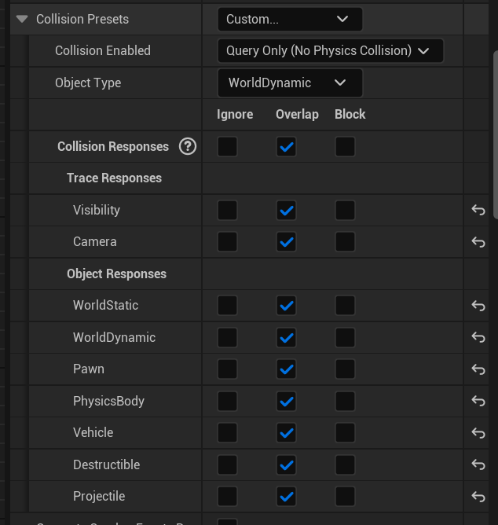
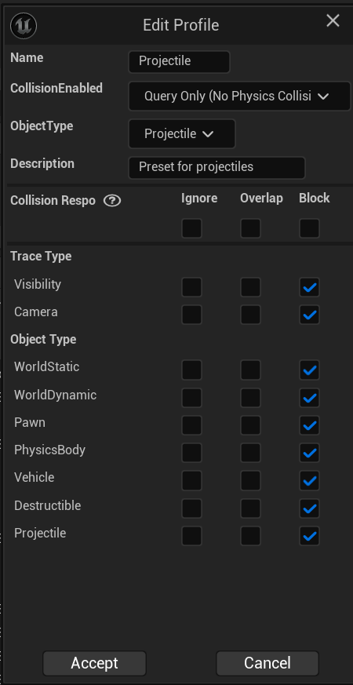
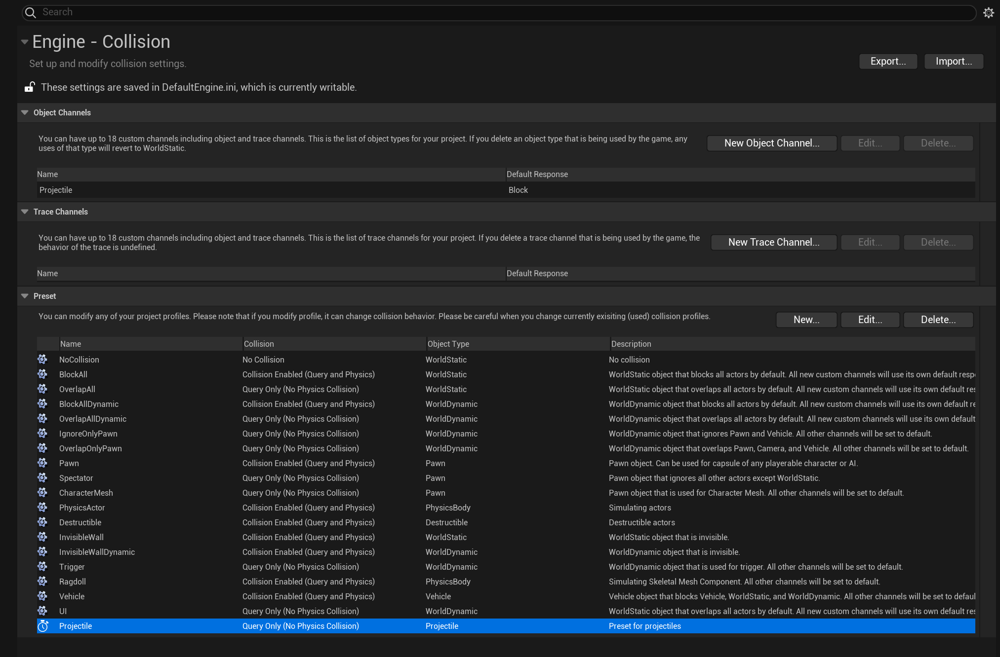
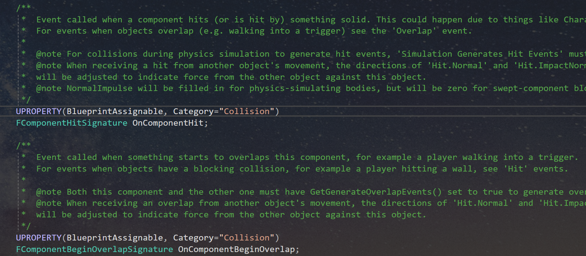
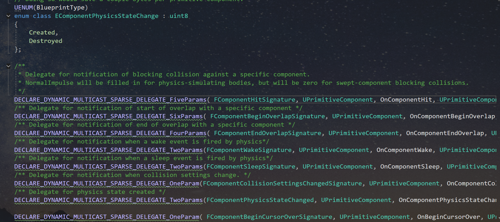

# 碰撞组件常用接口总结

前言

本文简要介绍一些与碰撞组件相关的函数接口的作用以及一个虚幻程序员应该具备的**核心思想**，它或许也可以在你学习虚幻的其它任何地方时发挥作用。

常见的碰撞组件有三类：`UBoxComponent`、`USphereComponent`、`UCapsuleComponent`，也就是盒体碰撞组件、球体碰撞组件、胶囊体碰撞组件。

这些组件的使用方法大致相同，下面我来总结一下这些碰撞组件常用接口。

在此之前，我们一般会在头文件中，声明这种组件的指针：

```C++
//比如这样
UPROPERTY(VisibleDefaultsOnly, Category=Projectile)
USphereComponent* CollisionComp; //球体碰撞组件
```

之后在该类的构造函数中最基本的就是创建这个组件的实例了：

```C++
CollisionComp = CreateDefaultSubobject<USphereComponent>(TEXT("SphereComp"));
```

创建了实例之后，我们的指针`CollisionComp`就有了指向的对象，接下来我们就可以使用这个对象的接口，也就是碰撞组件的接口了。

## 常用接口

```C++
//InitSphereRadius适用于构造函数阶段，而运行时修改应使用SetSphereRadius
//如果是其它类型的碰撞可能不是半径初始化，但是一定有类似的参数修改接口
CollisionComp->InitSphereRadius(100.0f);  // 初始化（不触发物理更新）
CollisionComp->SetSphereRadius(150.0f);   // 动态修改（触发更新）

//附加到其它组件上，大部分组件都具备功能
CollisionComp->SetupAttachment(RootComponent); 

//设置对所有碰撞通道的响应类型，例如设置为重叠（Overlap）
CollisionComp->SetCollisionResponseToAllChannels(ECR_Overlap);

//指定碰撞预设，我测试的二者作用一样。
CollisionComp->SetCollisionProfileName("Projectile");
CollisionComp->BodyInstance.SetCollisionProfileName("Projectile");

//绑定阻挡事件的委托
CollisionComp->OnComponentHit.AddDynamic(this, &AFPLearnDemoProjectile::OnHit);	
//绑定重叠事件的委托
CollisionComp->OnComponentBeginOverlap.AddDynamic(
    this, 
    &AMyActor::OnOverlapBegin
);

//显示调试边界
CollisionComp->bHiddenInGame = false;

//获取当前与组件重叠的所有Actor列表
TArray<AActor*> OverlappingActors;
SphereComp->GetOverlappingActors(OverlappingActors);

//这两个函数主要用于发射物，防止出现玩家可以坐着子弹飞天的bug
// Players can't walk on it
CollisionComp->SetWalkableSlopeOverride(
    FWalkableSlopeOverride(WalkableSlope_Unwalkable, 0.f)
);
CollisionComp->CanCharacterStepUpOn = ECB_No;
```

## 详解

### 关于碰撞响应

```C++
CollisionComp->SetCollisionResponseToAllChannels(ECR_Overlap);
```

很多时候从函数名就可以看出它的大致作用，这个函数就是设置**碰撞响应**的，函数名翻译过来就是：设置对所有通道的碰撞回应。那这里我们就需要明晰这个设置到底在改变什么？它会影响虚幻编辑器中哪个地方的参数？


相信学过一段时间的人都知道这是设置碰撞的地方，物体与物体之间的碰撞如何发生多半需要在这里设置，我们不在此讨论它们都是什么意思、都怎么用，因为这些都是很基础知识了（不过其实不知道这些知识也能往下看），我们只讨论刚才那段代码中的函数的功能。

可以看到图中所有的碰撞响应都设置为了**重叠（Overlap）**，这就对应了我们代码中的`ECR_Overlap`，我们只需要在函数中传入这个参数即可将这里全部的碰撞响应都设置为**重叠**，同理如果传入的参数是`ECR_Ignore`或`ECR_Block`那么就会相应的设置为**忽略**和**阻挡**。

```C++
CollisionComp->SetCollisionResponseToAllChannels(ECR_Ignore);	//忽略
CollisionComp->SetCollisionResponseToAllChannels(ECR_Overlap);	//重叠
CollisionComp->SetCollisionResponseToAllChannels(ECR_Block);	//阻挡
```

### 核心思想

从上面图片以及代码中我们可以总结出一个经验，那就是使用全英的虚幻编辑器对于学习虚幻C++是有帮助的，很多函数名与编辑器中的选项卡几乎一样，如果你看虚幻编辑器的选项卡熟练了，那写代码时应该会更得心应手一些。

大家可以看到，图片中设置碰撞响应的选项名就叫做：`Collision Responses`，这与我们代码中的函数名`SetCollisionResponseToAllChannels`是相对应的。`Collision Responses`选项在编辑器中就是用来统一设置碰撞响应的。因此函数名自然就叫这个名字`SetCollisionResponseToAllChannels`。

那很自然的我们就学会了其它设置应该怎么写，比如我要设置下图中的`Object Type`，那我在代码中大概能找到一个这样的函数，试一下果然有一个叫`SetCollisionObjectType`的函数。



那么我们就可以使用这个函数`SetCollisionObjectType`来调整这个碰撞组件的`Object Type`，比如这里图片中的是`WorldDynamic`，那我们如果想要相同的设置的话，就可以传入一个参数`ECC_WorldDynamic`。

```C++
CollisionComp->SetCollisionObjectType(ECC_WorldDynamic);
```

至于其它的`Object Type`都有哪些我想我不用说大家也知道怎么写了吧。

到这里其实可能还有人会问：这一会儿`ECR`开头，一会儿`ECC`开头，我哪知道怎么写？

这其实也很简单，一个简单粗暴的方法就是我们死记`ECR`开头的主要就是那三个`ECR_Ignore`、`ECR_Overlap`、`ECR_Block`。其他的大多就是`ECC`开头。

但是我不喜欢这个方法，治标不治本，我喜欢一针见血的理解式学习和记忆。我们只需要观察`SetCollisionResponseToAllChannels()`和`SetCollisionObjectType()`函数的参数列表即可知道用`ECR`还是`ECC`了。

```C++
//它们的参数列表大概是这样的
SetCollisionResponseToAllChannels(ECollisionResponse NewResponse)
SetCollisionObjectType(ECollisionChannel Channel)
```

从参数列表的参数类型中我们即可发现，`ECR`其实就是`ECollisionResponse`的缩写而已，而`ECC`就是`ECollisionChannel`的缩写。那有了这一层理解，当我们下次不知道该写`ECR`还是`ECC`的时候，稍微动脑思考一下就知道`ECR`、`ECC`是什么意思，知道了它们的含义，自然也就知道该写哪个开头了。

我认为理解上述这种思想对我们学习虚幻引擎还是有一定帮助的，在我们写代码“拔剑四顾心茫然”不知道从哪里“下笔”时，不妨从这个角度思考一下问题。

### 关于碰撞预设

```C++
CollisionComp->SetCollisionProfileName("Projectile");
```

该代码用于配置碰撞组件（Collision Component）的碰撞行为，其核心是设置一个预定义的**碰撞配置文件（Collision Profile）**。

光说**碰撞配置文件**谁知道是啥啊，所以下面我就说一下这个代码到底在干什么事。

首先我们要了解**碰撞配置文件**是什么，简单的说，每一个**碰撞配置文件**都像是一个**“整合包”**，里面包含了一个碰撞类型（即`Object Type`）对其它所有类型的碰撞响应方式。

如下图所示，整张图片的内容就代表一个**碰撞配置文件**，图片中第一个参数就是`Name`也就是用来标识下面全部信息的一个名字，当我们使用`CollisionComp->SetCollisionProfileName();`这个函数接口并传入图片中对应的这个字符串名字`"Projectile"`之后，`CollisionComp`所代表的那个碰撞组件就使用上了图中所设置的所有属性，这种**“整合包”**式的设置方式免去了很多繁杂的代码，我们只需要一个名字即可。



那么要想设置这种**”整合包“**也很简单，就在项目设置的下图所示地方，有一个`Preset`选项，在这里即可创建我们开发者自定义的一些**碰撞预设**，也可以看看引擎提供的这些预设有没有合适的，直接用它们的`Name`也可以。




### 关于绑定委托

这部分知识建议大家提前看一下虚幻引擎有关委托的相关知识，也可以看看我写的介绍委托用法的文章。

一说到碰撞，免不了的就是碰撞时触发一些逻辑或者重叠时触发一些逻辑这种需求。在蓝图中实现这一功能只需要鼠标点几下，但是使用C++代码还是相对复杂一丢丢的。

以阻挡发生的碰撞为例，如果我们想要在碰撞组件被阻挡时触发某些逻辑，那么我们需要像下面这样写。

```C++
CollisionComp->OnComponentHit.AddDynamic(this, &Axxx::OnHit);	
```

熟悉虚幻引擎的委托机制的同志理解起来应该问题不大，`CollisionComp`还是碰撞组件的指针，然后`OnComponentHit`就是我们需要绑定的委托了，我们先利用`CollisionComp`“召唤”出来`OnComponentHit`，之后调用委托提供的函数接口，绑定本类（即`Axxx`）的函数`OnHit`，之后每当发生碰撞，`OnHit`都会触发，因此我们需要执行的逻辑就可以写在这个函数里面。

需要注意的是，`OnHit`函数虽然是我们自定义的函数，但是我们需要接收委托传递过来的参数，这些参数就是碰撞时产生的一系列信息，比如在哪里发生的碰撞、碰撞的法线向量、跟谁发生了碰撞等等。我们只需要在`OnHit`的参数列表中添加这些类型的参数即可，不需要考虑委托是怎么把参数传递给`OnHit`的。

到这里大家应该还会有一个问题，那我`OnHit`的参数列表也不会写，怎么办？

我的回答是：这些也不用死记，我们只需要在`Visual Studio`中点进委托的声明查看即可，怎么点进去大家应该是会的（Ctrl+鼠标左键点击）。

首先我们点进`OnComponentHit`，可以看到类似下图所示内容。



这个是`OnComponentHit`委托定义的地方，我们需要的是它的声明，就把它当作变量类型和变量的关系即可。我们现在要看的就是这个变量类型是什么样的。点进`FComponentHitSignature`，可以看到类似下图所示内容。



具体代码如下：

```C++
/**
 * Delegate for notification of blocking collision against a specific component.  
 * NormalImpulse will be filled in for physics-simulating bodies, but will be zero for swept-component blocking collisions. 
 */
//注释纯AI翻译，看看就好。
//对特定组件的阻挡碰撞通知的委托。
//NormalImpulse 将在物理模拟体中被填充，但在扫掠组件阻挡碰撞中为零。
DECLARE_DYNAMIC_MULTICAST_SPARSE_DELEGATE_FiveParams(
    FComponentHitSignature,         // 委托类型名称
    UPrimitiveComponent,            // 委托所属的类
    OnComponentHit,                 // 委托实例名称（成员变量名）
    UPrimitiveComponent*, HitComponent, // 参数1：触发碰撞的组件
    AActor*, OtherActor,            // 参数2：参与碰撞的其他Actor
    UPrimitiveComponent*, OtherComp,// 参数3：参与碰撞的其他组件
    FVector, NormalImpulse,         // 参数4：碰撞的法线冲量
    const FHitResult&, Hit           // 参数5：碰撞的详细信息
);
```

可以看到这里是一个**动态多播稀疏委托**，有五个参数。

**UPrimitiveComponent**表示**委托所属的类**

- **稀疏委托（Sparse Delegate）**：仅在实际绑定了回调函数时占用内存，优化资源使用。
- `UPrimitiveComponent , OnComponentHit`在此处表明 `OnComponentHit` 是 `UPrimitiveComponent` 的一个稀疏委托成员。

那我们的`OnHit`函数的参数列表从代码**参数1**标记处开始写即可。最终`OnHit`函数的声明就是下面这样。

```C++
void OnHit(
    UPrimitiveComponent* HitComp, 
    AActor* OtherActor, 
    UPrimitiveComponent* OtherComp, 
    FVector NormalImpulse, 
    const FHitResult& Hit
);
```

**委托的参数列表**

委托的参数描述了碰撞事件的详细信息，通常与引擎的碰撞回调函数（如 `OnComponentHit`）一致，下面是`AI`给出的各个参数的解释。

- **参数1 `HitComponent`**
  - **类型**：`UPrimitiveComponent*`
  - **作用**：指向触发碰撞事件的组件本身。例如，如果角色身上的一个球体碰撞体发生了碰撞，`HitComponent` 就是该球体组件的指针。
- **参数2 `OtherActor`**
  - **类型**：`AActor*`
  - **作用**：指向与当前组件发生碰撞的另一个 `Actor`。例如，玩家角色（`HitComponent`）与一个障碍物（`OtherActor`）碰撞。
- **参数3 `OtherComp`**
  - **类型**：`UPrimitiveComponent*`
  - **作用**：指向与当前组件发生碰撞的另一个组件。例如，障碍物上的一个静态网格组件（`OtherComp`）。
- **参数4 `NormalImpulse`**
  - **类型**：`FVector`
  - **作用**：表示碰撞的法线方向冲量（方向和大小）。用于计算碰撞的物理效果，例如反弹方向或力度。
- **参数5 `Hit`**
  - **类型**：`const FHitResult&`
  - **作用**：包含碰撞的详细信息，如碰撞点位置、法线、碰撞表面材质等。

### 关于解绑委托

比如我们使用下面的代码绑定了函数。

```C++
OnComponentBeginOverlap.AddDynamic(
    this, 
    &UTP_PickUpComponent::OnSphereBeginOverlap
);
```

当我们不希望`OnSphereBeginOverlap`函数再因为重叠事件而触发时，就可以使用下面的代码。

```C++
OnComponentBeginOverlap.RemoveAll(this);
```

这里面的`this`就是指代码当前所处的类，`RemoveAll(this)` 会从 `OnComponentBeginOverlap` 委托中删除 **所有** 由当前对象（`this`）绑定的回调函数。

#### **典型使用场景**

**(1) 对象销毁前清理绑定**

```C++
void AMyActor::EndPlay(const EEndPlayReason::Type EndPlayReason) {
    // 在对象被销毁前，移除所有由this绑定的重叠事件回调
    CollisionComponent->OnComponentBeginOverlap.RemoveAll(this);
    Super::EndPlay(EndPlayReason);
}
```

**(2) 动态切换事件响应**

```C++
void AMyCharacter::DisableCollisionResponse() {
    // 临时移除所有重叠事件回调
    CollisionComp->OnComponentBeginOverlap.RemoveAll(this);
    // 其他逻辑（如关闭碰撞检测）
    CollisionComp->SetCollisionEnabled(ECollisionEnabled::NoCollision);
}
```

**(3) 避免重复绑定**

```C++
void AMyActor::SetupNewBinding() {
    // 先移除旧绑定
    CollisionComp->OnComponentBeginOverlap.RemoveAll(this);
    // 添加新回调
    CollisionComp->OnComponentBeginOverlap.AddDynamic(this, &AMyActor::NewOverlapHandler);
}
```

## 常见问题与注意事项

1. **事件未触发**
   - 检查`bGenerateOverlapEvents`是否启用。
   - 确保碰撞响应通道（如`ECR_Overlap`）与其他Actor的设置匹配。
   - 避免在构造函数中绑定事件，改用`BeginPlay`。
2. **网络同步**
   多人游戏中，需通过`Replicated`属性和`GetLifetimeReplicatedProps`同步关键状态。
3. **性能优化**
   - 避免频繁的碰撞检测，可通过`SetCollisionEnabled`动态开关碰撞。
   - 使用`GetOverlappingComponents`替代`GetOverlappingActors`减少性能开销。