# Json读写笔记

[TOC]

本文将记录我在学习`Json`文件读写时所记录的知识。

文章的侧重点主要是使用**结构体存储数据**，通过将结构体**数据转化为Json格式字符串**，再将这种**字符串写入文件**中，同时还有这一过程的**逆过程**。

即：`结构体--->Json字符串--->文件`和`结构体<---Json字符串<---文件`。

## 文件读写

因为本文涉及到Json文件的读写，会使用到一小部分文件读取和写入的相关知识。

在这里我就简单提一下，不会很详细，理解怎么回事即可，后面看到这部分内容就不会觉得陌生。

### 文件路径

我们可以通过虚幻引擎提供的`FPaths`类来获取到大部分情况下我们想要的文件路径。

那么比如说后文中，我的Json文件都是存放在项目的Saved文件夹下。

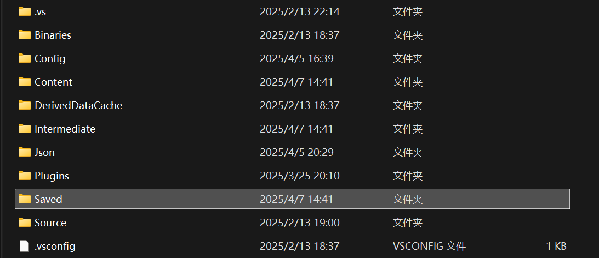

我就可以这样写：

```C++
//定义Json文件存放路径
FString FilePath = FPaths::ProjectSavedDir() / TEXT("WeaponInfo.json");
```

其中`FPaths::ProjectSavedDir()`就是获取到`Saved`文件夹路径的函数，之后我们使用重载过的运算符`/`拼上一个`TEXT("xxx.json")`，即可获得一个文件路径。

这个路径大致是这样的：`"D:\xxx\项目名\Saved\WeaponInfo.json"`。

### 写文件

有了文件路径，我们就可以把数据写入指定文件了。

我们可以使用虚幻引擎提供的`FFileHelper`类实现数据写入文件的操作

将Json格式的字符串写入一个文件，我会这样写：

```C++
//定义Json文件存放路径
FString FilePath = FPaths::ProjectSavedDir() / TEXT("WeaponInfo.json");

//假设这是一个Json格式的字符串
FString SaveJsonString = TEXT("......");

FFileHelper::SaveStringToFile(
    SaveJsonString, 
    *FilePath, 
    FFileHelper::EEncodingOptions::ForceUTF8WithoutBOM
);
```

其中`FFileHelper::SaveStringToFile()`就是我们实现这一操作的函数，其实看函数名你就可以明白它是干嘛用的，该函数的这个重载版本需要接收三个参数，依次是：需要写入文件的数据的字符串、文件地址的字符串（加`*`号）、写入格式。

我们最好使用`FFileHelper::EEncodingOptions::ForceUTF8WithoutBOM`格式，即强制`UTF-8`且不带有`Bom`。

### 读文件

有了写文件的经验，读文件其实道理是一样的，还是使用`FFileHelper`类。

直接上代码：

```C++
//定义从Json文件加载出来的Json字符串
FString LoadJsonString = TEXT("");

//定义待加载的Json文件路径
FString JsonFilePath = FPaths::ProjectSavedDir() / TEXT("WeaponInfo.json");

//加载文件信息到LoadJsonString
FFileHelper::LoadFileToString(LoadJsonString, *JsonFilePath);
```

关于`FFileHelper::LoadFileToString()`，就是将`JsonFilePath`指定的文件的数据以字符串的形式存入`LoadJsonString`中，没有什么难点。

第一次接触文件读写知识的同志，理解到此即可阅读之后的内容啦~~~

## Json文件基础知识

### **核心结构**

- 键值对可以说是`Json`文件的基本单位。

  ```json
  "name":"SYK"
  ```

  这就是一个键值对，左边是键，右边是值，中间用`:`分隔开，不同的键值对之间用`,`分隔开。

  ```json
  "name": "SYK",
  "age": 20,
  "isStudent": true
  ```

- 对象：用`{}`表示键值对的集合，可以类比为结构体`struct`的概念。

  ```json
  {
    "name": "SYK",
    "age": 20,
    "isStudent": true
  }
  ```

  不同的对象之间也用`,`分隔开

  ```json
  {
    "name": "SYK",
    "age": 20,
    "isStudent": true
  },
  {
    "name": "SYK",
    "age": 20,
    "isStudent": true
  }
  ```

- 数组：用`[]`表示，元素可以是任意类型，**但是同一数组中的类型需要一致**。

  ```json
  ["apple", "banana", "orange"]
  ```

  上述代码书写并不规范，前文提到`Json`文件的基本单位是**键值对**，而上述代码只有值（也就是整个数组）没有键。我们不能直接在`Json`文件中简单的写一个数组，还需要在数组前面加上一个键，就像下面这样。

  ```json
  "fruit":["apple" , "banana" , "orange"]
  ```

### JSON 支持以下数据类型：

| 类型   | 示例               |
| ------ | ------------------ |
| 字符串 | `"Hello World"`    |
| 数字   | `42`, `3.14`       |
| 布尔值 | `true`, `false`    |
| null   | `null`             |
| 对象   | `{"key": "value"}` |
| 数组   | `[1, 2, 3]`        |

### 注意事项

在`Json`文件的数组中我提到：数组元素可以是任意类型，但是同一数组中的类型需要一致。但是如果数组的元素是对象类型的话，**一个对象内部的键值对不需要与数组中其它对象内部的键值对保持一致**，就像下面这样。

```json
{
  "name": "SYK",
  "age": "20",
  "NumArray": [1, 2, 3, 4, 5],
  "Company": "SYKGlobalCompany",
  "Array": [
    { "name": "KYS", "age": "20" },
    { "width": "122", "height": "652" },
    { "name": "asd" }
  ]
}

```

在数组`"Array"`中有三个对象，但是每个对象内部的键值对与其它对象却不一致。这样的语法是合法的，但是这种结构是我们不希望出现的，因为它会增加我们后续读写`json`文件的难度，也会让数据结构的可读性变差，因此在这里仅强调一下这种语法，不推荐这样写。

## Json文件读写方式

我将这部分功能写在了一个`AActor`派生类中，对应两个文件：头文件`SYKJsonActor.h`、源文件`SYKJsonActor.cpp`。我会把整篇文章的最终完整代码放在本文最后，方便大家拷贝测试，在此之前的代码都是我全部代码的片段，这样看着轻松一些

### 简单的读写

我会使用一个函数为大家展示这种简单的Json文件读写，**简单的读写**这一块并不是重点内容，所以看看就好。

```C++
//SYKJsonActor.cpp

void ASYKJsonActor::OriginJsonRW()
{
	//我以一个简短的Json对象为例，介绍一下原始的Json文件读写方式
    //下面这段Json代码是我们的最终目标
	/*
	{
		"name": "SYK",
		"age": "20",
		"gender": "man",
		"hobby": "basketball"
	}
	*/
    //自定义结构体
	struct JsonMessage
	{
        //以下命名开头的UE不是必须的，纯自定义，别被误导
		FString UEName = "None";
		int32 UEAge = -1;
		FString UEGender = "None";
		FString UEHobby = "None";
	};

	//定义一个结构体变量Message，给它设置一些值
	JsonMessage Message;
	Message.UEName = "SYK";
	Message.UEAge = 20;
	Message.UEGender = "Man";
	Message.UEHobby = "Basketball";

	//根据Message的值，拼凑出来Json文件的格式，最终形成一个字符串
	//这里拼凑字符串的方式可以参考C语言Printf()函数的使用方式以及转义字符的用法
	FString jsonString = FString::Printf(
		TEXT("{\"name\":\"%s\",\"age\":\"%d\",\"gender\":\"%s\",\"hobby\":\"%s\"}") , 
		*Message.UEName , 
		Message.UEAge , 
		*Message.UEGender , 
		*Message.UEHobby
	);

	//定义一个json文件的存放路径，这里我们选择的是项目的Saved文件夹下
	FString filePath = FPaths::ProjectSavedDir() / TEXT("OriginJsonRW.json");
	//将字符串写入文件
	FFileHelper::SaveStringToFile(jsonString, *filePath, FFileHelper::EEncodingOptions::ForceUTF8);

	//定义一个新的字符串变量，用于存储从Json文件加载出来的字符串
	FString loadJsonString;
	//获取Json文件中我们刚刚写入的字符串并赋值给loadJsonString
	FFileHelper::LoadFileToString(loadJsonString, *filePath);
	//日志输出loadJsonString的结果
	UE_LOG(LogTemp, Warning, TEXT("%s"), *loadJsonString);
	//下面就是一些loadJsonString的拆解工作了
	/*
	* 我们需要根据接收到的Json文件的格式，按需拆解其中的值并转化为结构体等数据结构
	* 之后即可在代码中使用到Json文件中的数据，这里就不再演示了，都是一些字符串的基础操作
	* 这种方法的弊端就是，对于一些结构较为复杂的Json文件，
	* 我们的代码不能做到或者说很难做到良好的适配
	* 复杂的结构对于字符串而言就意味着更复杂的拆解算法，因此这种Json读写方式不太好用
	*/
}
```

注释中已经标出代码的含义，不再赘述了。

### 使用TJsonWriter写入Json文件

`TJsonWriter`是虚幻引擎中用于生成`JSON`数据的模板类，使用它封装的接口可以轻松的写出我们想要的Json格式。

#### 常用函数

（为了篇幅整洁考虑，以下函数的参数列表不再展示，后续代码中可以看出参数怎么用）

- `WriteObjectStart()`：顾名思义，它是写`Json`文件中**对象**的开始符号的函数，也就是一个对象的左大括号`{`。
- `WriteObjectEnd()`：该函数与`WriteObjectStart`对应，作为一个**对象**的结束，也就是右大括号`}`。
- `WriteArrayStart()`：同理，这个函数就是写`Json`文件中**数组**的左大括号`{`。
- `WriteArrayEnd()`：这个函数就是写**数组**的右大括号`}`。
- `WriteValue()`：该函数用于写`Json`文件中的**键值对**，也就是写`"xxx":"yyy"`这种键值对的函数，那么通常我们都是在`Start`函数和`End`函数之间多次使用这个函数来实现完整的`Json`文件的书写工作。
- `Close()`：`TJsonWriter`需要显式调用`Close()`才能将缓冲区数据写入目标字符串`FinalJsonString`

#### 操作步骤

关于将`Json`数据写入文件，大致有以下几步工作

1. 准备好待存储数据到文件的结构体变量（`struct`）、自定义空字符串（`JsonString`）。
2. 使用`TJsonWriter`相关的代码，创建一个`Json`写入流，用于将数据以`Json`格式写入到字符串。
3. 序列化，使用上一步的写入流调用前面介绍的那些**常用函数**再配合着`struct`中需要存储的数据，实现`Json`格式的编写。这一过程实际上就是在操作第一步创建的`JsonString`。
4. 使用写入流的`Close()`函数结束编写，确保数据真正的写入了`JsonString`。这里单独列出一步用于强调这一点。
5. 最后使用`FFileHelper`将`JsonString`写入指定文件即可。

上面我们简单介绍了一下各个函数的大致作用，以及将`Json`数据写入文件的步骤，有一个印象即可，下面我会用代码来具体的使用它们，到时候就能明白它们是怎么回事了。

#### 单个Json对象的写入

关于代码的解释我都写在了注释中。

```C++
//SYKJsonActor.h
UFUNCTION(BlueprintCallable, Category = "SYK")
void JsonWriter_01();

//使用到的结构体
//武器信息
struct FWeaponInfo
{
    FString WeaponName = TEXT("None");	//武器名字
    int32 WeaponNumber = 0;				//武器数量

    FString ToString() const
    {
        return FString::Printf(TEXT("Weapon Name: %s, Weapon Number: %d"), *WeaponName, WeaponNumber);
    }
};

//SYKJsonActor.cpp
void ASYKJsonActor::JsonWriter_01()
{
	//最终目标
	//{
	//	"WeaponName": "sword",
	//	"WeaponNumber" : 10
	//}

	//新建一个Weapon武器信息结构体并赋值
	//下面我们就会把这个结构体中的数据写成Json文件
	WeaponInfo Weapon;
	Weapon.WeaponName = TEXT("sword");
	Weapon.WeaponNumber = 10;

	//新建字符串，我们后续Json文件的编写都是在操作这个字符串的数据
	FString FinalJsonString = TEXT("");

	//这是一个相对固定的写法，我们定义一个共享引用（其实就当共享指针用就行）
	//之后Create()函数中传入FinalJsonString字符串的地址
	//不难看出我们其实就是拿JsonWriter这个共享引用通过FinalJsonString的地址来精细的操作它的字符串数据
	//通过TJsonWriter提供的一些接口我们可以轻松的实现在UEC++中较为直观的编写Json文件
	TSharedRef<TJsonWriter<TCHAR, TCondensedJsonPrintPolicy<TCHAR>>> JsonWriter
		= TJsonWriterFactory<TCHAR, TCondensedJsonPrintPolicy<TCHAR>>::Create(&FinalJsonString);

	/*
	* 需要特别强调的是，下面我们使用的这些接口都是在操作FinalJsonString字符串
	* 即都是在往FinalJsonString里面添加数据
	* 还没有实际的写入Json文件中，之后我们会通过FFileHelper来实现字符串的序列化工作
	*/
	JsonWriter->WriteObjectStart(); //左大括号

	JsonWriter->WriteValue(TEXT("WeaponName"), Weapon.WeaponName); //写入武器名字
	JsonWriter->WriteValue(TEXT("WeaponNumber"), Weapon.WeaponNumber); //写入武器数量

	JsonWriter->WriteObjectEnd(); //右大括号

	JsonWriter->Close(); //TJsonWriter需要显式调用Close()才能将缓冲区数据写入目标字符串FinalJsonString
	//因此如果我们缺少这一步就会出现文件存在但是文件中内容为空的情况，因为FinalJsonString是空的

	//定义Json文件存放路径
	FString FilePath = FPaths::ProjectSavedDir() / TEXT("WeaponInfo.json");

	//序列化我们前面“微操”的那个字符串FinalJsonString
	FFileHelper::SaveStringToFile(FinalJsonString, *FilePath, FFileHelper::EEncodingOptions::ForceUTF8WithoutBOM);
}
```

关于代码中的`JsonWriter`，我想我还是需要多解释一点

```C++
TSharedRef<TJsonWriter<TCHAR, TCondensedJsonPrintPolicy<TCHAR>>> JsonWriter =
TJsonWriterFactory<TCHAR,TCondensedJsonPrintPolicy<TCHAR>>::Create(&FinalJsonString);
```

我们知道共享引用的模板参数中`TJsonWriter<TCHAR, TCondensedJsonPrintPolicy<TCHAR>>`表示的是`JsonWriter`指向的对象类型，那么这个`TJsonWriter<TCHAR, TCondensedJsonPrintPolicy<TCHAR>>`是什么呢？

- `TJsonWriter`是虚幻引擎中用于生成`JSON`数据的模板类。
- `TCHAR`是虚幻引擎中用来表示字符类型的通用类型，它可以依据编译环境是`Unicode`还是`ANSI`来代表不同的字符类型。
- `TCondensedJsonPrintPolicy<TCHAR>`属于`Json`打印策略，它会生成紧凑格式的`JSON`数据，也就是不会包含多余的空格和换行符。`Condensed`单词的含义就是浓缩，因此我们使用这种打印策略写出来的`Json`文件一般只有一行，这一行涵盖了我们要写入的所有内容，它的排版不太适宜阅读，但是对于数据的读写而言足够用了。

那么`TJsonWriterFactory<TCHAR, TCondensedJsonPrintPolicy<TCHAR>>::Create(&FinalJsonString)`又是什么呢？

- `TJsonWriterFactory`是一个工厂类，专门用于创建 `TJsonWriter` 对象。如果大家不清楚什么是工厂类的话，可以学习一下`设计模式`相关知识，设计模式是一个程序员的“内功”，很多时候需要有一个好的设计模式来组织我们的代码以此达到良好的产品扩展性、健壮性等。
- `Create`是工厂类的静态函数，它接收一个指向`FString`对象的指针`&FinalJsonString`作为参数。这意味着生成的`JSON`数据会被写入到`FinalJsonString`这个字符串中。也就是说后续我们使用`JsonWriter`调用各种函数执行的操作实际上都是在编写`FinalJsonString`字符串。

代码的运行结果就是在项目的`Saved`文件夹下生成并编写了一个`WeaponInfo.json`文件。

我们美化一下之后文件内容如下图所示

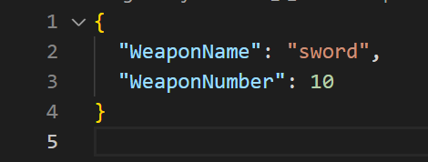

下面两个写`Json`文件的代码其原理都是一样的，我们重点关注如何使用`JsonWriter`所指对象的接口编写`Json`即可，说白了就是看看前面提到的**常用函数**的用法即可。

#### 对象嵌套对象的写入

关于代码的解释我都写在了注释中。

```C++
//SYKJsonActor.h
UFUNCTION(BlueprintCallable, Category = "SYK")
void JsonWriter_02();

//使用到的结构体
//武器信息
struct FWeaponInfo
{
    FString WeaponName = TEXT("None");	//武器名字
    int32 WeaponNumber = 0;				//武器数量

    FString ToString() const
    {
        return FString::Printf(TEXT("Weapon Name: %s, Weapon Number: %d"), *WeaponName, WeaponNumber);
    }
};

//角色信息
struct FCharacterInfo
{
    FString Name = TEXT("None");	//角色名字
    FString Gender = TEXT("None");	//角色性别
    double Health = 0.0;			//角色血量
    int32 Level = 0;				//角色等级
    FWeaponInfo Weapon;				//角色武器

    FString ToString() const
    {
        return FString::Printf(TEXT("Character Name: %s, Gender: %s, Health: %f, Level: %d\n%s"),
            *Name, *Gender, Health, Level, *Weapon.ToString());
    }
};

//SYKJsonActor.cpp
void ASYKJsonActor::JsonWriter_02()
{
	//最终目标
	//{
	//	"Name": "SYK_KYS",
	//		"Gender" : "Man",
	//		"Health" : 100,
	//		"Level" : 999,
	//		"Weapon" : {
	//		"WeaponName": "Gun",
	//		"WeaponNumber" : 20
	//		}
	//}

	//把Character结构体中的数据写如Json文件中
	CharacterInfo Character;					
	Character.Name = TEXT("SYK_KYS");			//给角色名字赋值
	Character.Gender = TEXT("Man");				//给角色性别赋值
	Character.Health = 100;						//给角色血量赋值
	Character.Level = 999;						//给角色等级赋值
	Character.Weapon.WeaponName = TEXT("Gun");	//给角色武器名字赋值
	Character.Weapon.WeaponNumber = 20;			//给角色武器数量赋值

	//定义最终序列化到Json文件的字符串
	FString FinalJsonString = TEXT("");

	//获取操作字符串的共享引用
	TSharedRef<TJsonWriter<TCHAR, TCondensedJsonPrintPolicy<TCHAR>>> JsonWriter
		= TJsonWriterFactory<TCHAR, TCondensedJsonPrintPolicy<TCHAR>>::Create(&FinalJsonString);


	JsonWriter->WriteObjectStart(); //左大括号

	JsonWriter->WriteValue(TEXT("Name"), Character.Name); //写入键值对
	JsonWriter->WriteValue(TEXT("Gender"), Character.Gender); //写入键值对
	JsonWriter->WriteValue(TEXT("Health"), Character.Health); //写入键值对
	JsonWriter->WriteValue(TEXT("Level"), Character.Level); //写入键值对

	{	//这里的大括号没有实际作用，只是我为了看着方便写的
		//毕竟我们使用的是指针，所以不用考虑大括号作用域的问题

		//这里就是我们写Character结构体中嵌套的Weapon结构体的代码
		//因为Weapon结构体在Json文件中的表现形式也是一个对象
		//因此我们自然需要使用JsonWriter->WriteObjectStart()函数
		//注意到这里函数中我们写了参数
		//这个参数中的字符串就表示Json文件中该对象的键
		//大家可以参考该函数开始部分的最终目标对照着看就知道它的作用了
		JsonWriter->WriteObjectStart(TEXT("Weapon")); //写入键和Weapon的左大括号

		JsonWriter->WriteValue(TEXT("WeaponName"), Character.Weapon.WeaponName); //写入键值对
		JsonWriter->WriteValue(TEXT("WeaponNumber"), Character.Weapon.WeaponNumber); //写入键值对

		JsonWriter->WriteObjectEnd(); //Weapon的右大括号
	}

	JsonWriter->WriteObjectEnd(); //右大括号

	JsonWriter->Close();//再次强调TJsonWriter需要显式调用Close()才能将缓冲区数据写入目标字符串FinalJsonString

	//定义Json文件存放路径
	FString JsonFilePath = FPaths::ProjectSavedDir() / TEXT("Character.json");

	//序列化字符串FinalJsonString到指定文件
	FFileHelper::SaveStringToFile(FinalJsonString, *JsonFilePath, FFileHelper::EEncodingOptions::ForceUTF8WithoutBOM);
}
```

代码运行结果如下图所示

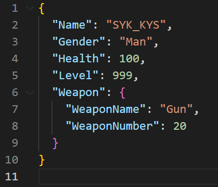

#### 对象嵌套数组以及数组嵌套对象的写入

关于代码的解释我都写在了注释中。

```C++
//SYKJsonActor.h
UFUNCTION(BlueprintCallable, Category = "SYK")
void JsonWriter_03();

//使用到的结构体
//武器信息
struct FWeaponInfo
{
    FString WeaponName = TEXT("None");	//武器名字
    int32 WeaponNumber = 0;				//武器数量

    FString ToString() const
    {
        return FString::Printf(TEXT("Weapon Name: %s, Weapon Number: %d"), *WeaponName, WeaponNumber);
    }
};

//多个武器信息
struct FWeaponsInfo
{
    int32 WeaponCount = 0;		//总的武器数量
    TArray<FWeaponInfo> WeaponArray;	//多个武器的信息

    FString ToString() const
    {
        FString Result = FString::Printf(TEXT("Total Weapon Count: %d\n"), WeaponCount);
        for (const auto& Weapon : WeaponArray)
        {
            Result += Weapon.ToString() + TEXT("\n");
        }
        return Result;
    }
};


//SYKJsonActor.cpp
void ASYKJsonActor::JsonWriter_03()
{
	//最终目标
	//{
	//	"WeaponCount": 3,
	//	"WeaponArray" : [
	//		{ "WeaponName": "Gun", "WeaponNum" : 10 },
	//		{ "WeaponName": "Sword", "WeaponNum" : 30 },
	//		{ "WeaponName": "shiled", "WeaponNum" : 80 }
	//	]
	//}

	//定义多个武器信息结构体
	WeaponsInfo Weapons;

	//添加一个数组元素并赋值
	Weapons.WeaponArray.AddDefaulted();
	Weapons.WeaponArray.Last().WeaponName = TEXT("Gun");
	Weapons.WeaponArray.Last().WeaponNumber = 10;

	//添加一个数组元素并赋值
	Weapons.WeaponArray.AddDefaulted();
	Weapons.WeaponArray.Last().WeaponName = TEXT("Sword");
	Weapons.WeaponArray.Last().WeaponNumber = 30;

	//添加一个数组元素并赋值
	Weapons.WeaponArray.AddDefaulted();
	Weapons.WeaponArray.Last().WeaponName = TEXT("shiled");
	Weapons.WeaponArray.Last().WeaponNumber = 80;

	//记录WeaponArray武器总数
	Weapons.WeaponCount = Weapons.WeaponArray.Num();

	FString FinalJsonString = TEXT("");

	TSharedRef<TJsonWriter<TCHAR, TCondensedJsonPrintPolicy<TCHAR>>> JsonWriter
		= TJsonWriterFactory<TCHAR, TCondensedJsonPrintPolicy<TCHAR>>::Create(&FinalJsonString);

	JsonWriter->WriteObjectStart();

	JsonWriter->WriteValue(TEXT("WeaponCount"), Weapons.WeaponCount);

	{
		//相当于数组中的左中括号，还有数组对应的键值WeaponArray
		JsonWriter->WriteArrayStart(TEXT("WeaponArray"));

		for (int32 i = 0; i < Weapons.WeaponCount; i++)
		{
			//数组中单个Weapon结构体的左大括号
			JsonWriter->WriteObjectStart();
			//写入键值对
			JsonWriter->WriteValue(TEXT("WeaponName"), Weapons.WeaponArray[i].WeaponName);
			JsonWriter->WriteValue(TEXT("WeaponNum"), Weapons.WeaponArray[i].WeaponNumber);
			//数组中单个Weapon结构体的左大括号
			JsonWriter->WriteObjectEnd();
		}

		//数组的右中括号
		JsonWriter->WriteArrayEnd();
	}

	JsonWriter->WriteObjectEnd();

	//再次强调TJsonWriter需要显式调用Close()才能将缓冲区数据写入目标字符串FinalJsonString
	JsonWriter->Close();

	//定义Json文件存放路径
	FString JsonFilePath = FPaths::ProjectSavedDir() / TEXT("WeaponsInfo.json");

	//序列化FinalJsonString
	FFileHelper::SaveStringToFile(FinalJsonString, *JsonFilePath, FFileHelper::EEncodingOptions::ForceUTF8WithoutBOM);
}
```

代码运行结果如下图所示

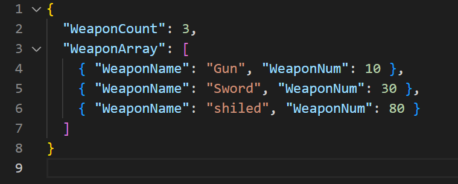

最后我想说的是大家要明白`WriteObjectStart()`和`WriteArrayStart()`函数如果写了参数的话有什么用，我在代码注释中有解释这一点，以上图举例，这两个函数里面如果写了参数，那么参数对应的内容就是`Json`文件中的`WeaponArray`这一部分，它是一个键，而它之后写的那些东西都是与这个键对应的值，我认为这算一个小难点吧，不过理解了之后就好了。

### 使用TJsonReader读取Json文件

第一次接触这部分知识可能会觉得很复杂，它没有`TJsonWriter`的操作方式看起来简约，但是我们只要记住它是`TJsonWriter`的逆过程即可，总体思路就是反向走一遍过程，只不过代码上有所变化而已。

#### FJsonObject和FJsonValue

！**注意**：如果代码中出现`FJsonObject`和`FJsonValue`那么我们需要在当前模块（Module）的`.Build.cs`文件中添加`"Json"`模块最好包含一些头文件。

```C++
#include "Serialization/JsonWriter.h"
#include "Serialization/JsonReader.h"
#include "Dom/JsonObject.h"
#include "Dom/JsonValue.h"
```

在学习使用`TJsonReader`读取`Json`文件之前，我们需要先认识两个重要的类：`FJsonObject`和`FJsonValue`理解这两个类的含义作用可以帮助我们更深入的理解`TJsonReader`的工作原理。

OK，那么`FJsonObject`和`FJsonValue`是什么？

我先贴出引擎代码中对它们的解释，之后再来说说我的解释。

```C++
//AI翻译，勿喷(qwq)
/**
 * A Json Object is a structure holding an unordered set of name/value pairs.
 * In a Json file, it is represented by everything between curly braces {}.
 *Json对象是一个包含一组无序名称/值对的结构。
 *在Json文件中，它由花括号{}之间的所有内容表示。
 */
class FJsonObject;

/**
 * A Json Value is a structure that can be any of the Json Types.
 * It should never be used on its, only its derived types should be used.
 *Json值是一种可以是任何Json类型的结构。
 *它永远不应该在其上使用，只应该使用其派生类型。
 */
class FJsonValue;
```

我们知道Json文件中有**键值对**、**对象**等概念，那么如果要我说一个通俗易懂的解释，那就是大家可以把`FJsonObject`当作**对象**来看待，把`FJsonValue`当作**键值对**来看待。

我们会通过这两个类型的指针（`TSharedPtr<FJsonObject>`和`TSharedPtr<FJsonValue>`）执行其所指对象的**成员函数**，以此来获取我们需要的数据。

`FJsonObject`**常用成员函数**

（为了篇幅整洁考虑，以下函数的参数列表不再展示，后续代码中可以看出参数怎么用）

- `GetField()`和`TryGetField()`：获取**对象**下的某个键值对，返回值是`TSharedPtr<FJsonValue>`共享指针。我们可以通过这个返回的指针使用`FJsonValue`常用函数获取数据。
- `GetStringField()`：获取指定键对应的值，即返回一个字符串，这个字符串如果在Json文件中表示的就是**键值对**中的值。
- `TryGetStringField()`：作用与`GetStringField()`相同只不过代码使用方式不同，返回值是布尔值，用于表示获取操作是否成功。

`FJsonValue`**常用成员函数**

- `AsString()`：尝试将当前指针所指**键值对**中的值作为字符串返回。
- `AsNumber()`：尝试将当前指针所指**键值对**中的值作为数字返回。
- `AsObject()`：尝试将当前指针所指**键值对**中的值作为`TSharedPtr<FJsonObject>`返回。该函数可以用于**对象嵌套对象**的情况，因为嵌套对象在`Json`文件中也可以看成一个**大的键值对**，因此我们使用这个函数就可以获得到这个**大的键值对**中的值（也就是嵌套的对象本身），之后就可以使用`FJsonObject`常用函数进一步获取**嵌套的对象**里面的数据了。

`Json`文件支持的数据类型不只有`String`，因此对于以上`String`版本的函数，都有其对应的其它数据类型的函数。比如`TryGetNumberField()`、`GetBoolField()`等。

#### 操作步骤

关于将`Json`文件数据读取出来，大致有以下几步工作

1. 准备空结构体变量（`struct`）、自定义空字符串（`JsonString`）。
2. 使用`FFileHelper`从指定`Json`文件获取到`Json`数据，存入`JsonString`。
3. 创建读取流（`JsonReader`），这一步是为了建立`JsonReader`与`JsonString`联系。
4. 反序列化，使用`FJsonSerializer::Deserialize()`函数实现最初的`Json`数据对象获取。该函数需要两个参数一个是上一步创建的`JsonReader`，另一个是`TSharedPtr<FJsonObject>`类型的指针（`ObjectPtr`），我们知道在上一步`JsonReader`已经和`JsonString`建立了联系，而在这一步就是通过`JsonReader`作为中间者建立`JsonString`与`FJsonObject`的联系，这么一个数据加工传递的过程实现了从`Json`字符串到`FJsonObject`的转换。函数执行完毕后，`ObjectPtr`所指的对象表示的就是我们常见的`Json`文件中的那个最外层的大括号（即最大的那个对象）。
5. 使用上一步得到的`ObjectPtr`调用其**常用成员函数**，获取数据赋值给`struct`即可。

#### 从Json文件中读取数据的多种方式

关于代码的解释我都写在了注释中。

```C++
//SYKJsonActor.h
UFUNCTION(BlueprintCallable, Category = "SYK")
void JsonReader_01();

//使用到的结构体
//武器信息
struct FWeaponInfo
{
    FString WeaponName = TEXT("None");	//武器名字
    int32 WeaponNumber = 0;				//武器数量

    FString ToString() const
    {
        return FString::Printf(TEXT("Weapon Name: %s, Weapon Number: %d"), *WeaponName, WeaponNumber);
    }
};

//SYKJsonActor.cpp
void ASYKJsonActor::JsonReader_01()
{
	//定义从Json文件加载出来的Json字符串
	FString LoadJsonString = TEXT("");

	//定义待加载的Json文件路径
	FString JsonFilePath = FPaths::ProjectSavedDir() / TEXT("WeaponInfo.json");
	//加载文件信息到LoadJsonString
	FFileHelper::LoadFileToString(LoadJsonString, *JsonFilePath);

	TSharedRef<TJsonReader<TCHAR>> JsonReader = TJsonReaderFactory<TCHAR>::Create(LoadJsonString);

	//将Json数据反序列化为一个Json对象，也就是FJsonObject类型的数据
	//在这里我们使用WeaponObject共享指针来操作这个Json对象
	TSharedPtr<FJsonObject> WeaponObject;
	bool IsDeserialize = FJsonSerializer::Deserialize(JsonReader, WeaponObject);
	/*
	* 我们这里反序列话的目的就是获得Json文件里面最大的那一对大括号
	* 也就是整个Json对象，之后就通过这个Json对象来获取其中的值、对象、数组等
	* 
	* 需要注意的是JsonReader是一个共享引用TSharedRef
	* 而WeaponObject是一个共享指针TSharedPtr
	* 二者有所不同且指针类型不能轻易改变，否则Deserialize会报错：没有对应的重载函数
	*/


	/*
	* {
	*	"WeaponName": "sword",
	*	"WeaponNumber": 10
	* }
	* 这里WeaponObject所指的Json对象是上面的整个大括号所表示的对象
	* 因此我们可以预见到，接下来如果要获取里面的数据，一定是拿到它的键值对
	* “获取键值对”这一操作在UE代码中就是GetField
	* 下面就是对GetField的使用
	*/

	//检查序列化是否成功
	if (!IsDeserialize)
	{
		UE_LOG(LogTemp, Warning, TEXT("Deserialize failed"));
		return;
	}

	/*****法一*****/
	/*
	* {
	*	"WeaponName": "sword",
	*	"WeaponNumber": 10
	* }
	*/

	//定义存储数据的结构体
	FWeaponInfo Weapon_01;

	//获取键为WeaponName的键值对的值
	TSharedPtr<FJsonValue> WeaponValue = WeaponObject->TryGetField(TEXT("WeaponName"));
	if (WeaponValue.IsValid()) //检查指针有效性，即检查是否获取成功
	{
		//将WeaponValue作为字符串赋值给结构体
		Weapon_01.WeaponName = WeaponValue->AsString();
		WeaponValue->
	}
	//获取键为WeaponNumber的键值对的值
	WeaponValue = WeaponObject->TryGetField(TEXT("WeaponNumber"));
	if (WeaponValue.IsValid()) //检查指针有效性，即检查是否获取成功
	{
		//将WeaponValue作为数字赋值给结构体
		Weapon_01.WeaponNumber = (int32)WeaponValue->AsNumber();
	}
	//日志输出Weapon_01验证是否读取成功
	UE_LOG(LogTemp, Warning, TEXT("===Weapon_01===\n%s") , *Weapon_01.ToString());

	/*****法二*****/
	/*
	* {
	*	"WeaponName": "sword",
	*	"WeaponNumber": 10
	* }
	*/
	FWeaponInfo Weapon_02;

	//通过函数把指定键的值直接赋给结构体
	bool isName = WeaponObject->TryGetStringField(TEXT("WeaponName"), Weapon_02.WeaponName);
	bool isNumber = WeaponObject->TryGetNumberField(TEXT("WeaponNumber"), Weapon_02.WeaponNumber);
	if (isName && isNumber) //全部获取成功则打印日志
	{
		//日志输出Weapon_02验证是否读取成功
		UE_LOG(LogTemp, Warning, TEXT("===Weapon_02===\n%s"), *Weapon_02.ToString());
	}

	/*****法三*****/
	/*
	* {
	*	"WeaponName": "sword",
	*	"WeaponNumber": 10
	* }
	*/

	FWeaponInfo Weapon_03;

	//利用函数的返回值赋值给结构体
	Weapon_03.WeaponName = WeaponObject->GetStringField(TEXT("WeaponName"));
	Weapon_03.WeaponNumber = WeaponObject->GetNumberField(TEXT("WeaponNumber"));

	//日志输出Weapon_03验证是否读取成功
	UE_LOG(LogTemp, Warning, TEXT("===Weapon_03===\n%s"), *Weapon_03.ToString());

	/*
	* 需要注意的是法二和法三中获取Value值使用的函数有所区别
	* 1、GetStringField：用于从JSON对象中获取指定名称的字符串字段值。
	* 若该字段不存在或者类型不是字符串，就会触发错误。
	* 2、TryGetStringField：尝试从JSON对象中获取指定名称的字符串字段值。
	* 若字段存在且类型为字符串，就会返回 true 并通过引用参数输出该值；
	* 若字段不存在或者类型不是字符串，则返回 false。
	* 
	* 如果我们很确定Json数据中存在某一字段的话，使用GetStringField没有问题
	* 如果不确定Json数据中是否存在某一字段，可以尝试使用TryGetStringField来获取数据
	* 那我们在读取Json文件的时候可以根据实际情况灵活运用这三种方式
	*/
}
```

代码中的`TSharedRef<TJsonReader<TCHAR>> JsonReader = TJsonReaderFactory<TCHAR>::Create(LoadJsonString);`就是我们创建的读取流`JsonReader`。`Create()`函数中传入了我们从`Json`文件中加载下来的`Json`格式的字符串，因此我们`JsonReader`与`LoadJsonString`建立起了联系。

在此之后的反序列化操作：

```C++
TSharedPtr<FJsonObject> WeaponObject;
bool IsDeserialize = FJsonSerializer::Deserialize(JsonReader, WeaponObject);
```

就是通过`FJsonSerializer::Deserialize()`函数将`JsonReader`与`WeaponObject`所指向的`FJsonObject`类型对象建立联系，将`Json`数据转化为了我们**便于理解和操作**的`FJsonObject`类型对象。

再之后就是通过`WeaponObject`获取数据赋值到结构体的操作了，比较简单不再赘述。

**运行结果**

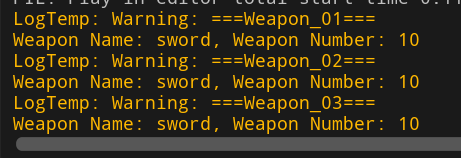

#### 对象嵌套对象的读取

关于代码的解释我都写在了注释中。

```C++
//SYKJsonActor.h
UFUNCTION(BlueprintCallable, Category = "SYK")
void JsonReader_02();

//使用到的结构体
//武器信息
struct FWeaponInfo
{
    FString WeaponName = TEXT("None");	//武器名字
    int32 WeaponNumber = 0;				//武器数量

    FString ToString() const
    {
        return FString::Printf(TEXT("Weapon Name: %s, Weapon Number: %d"), *WeaponName, WeaponNumber);
    }
};

//角色信息
struct FCharacterInfo
{
    FString Name = TEXT("None");	//角色名字
    FString Gender = TEXT("None");	//角色性别
    double Health = 0.0;			//角色血量
    int32 Level = 0;				//角色等级
    FWeaponInfo Weapon;				//角色武器

    FString ToString() const
    {
        return FString::Printf(TEXT("Character Name: %s, Gender: %s, Health: %f, Level: %d\n%s"),
            *Name, *Gender, Health, Level, *Weapon.ToString());
    }
};

//SYKJsonActor.cpp
void ASYKJsonActor::JsonReader_02()
{
	//下面我们来读一下Character.json文件
	//{
	//		"Name": "SYK_KYS",
	//		"Gender" : "Man",
	//		"Health" : 100,
	//		"Level" : 999,
	//		"Weapon" : {
	//		"WeaponName": "Gun",
	//		"WeaponNumber" : 20
	//		}
	//}

	//将Json文件内容加载为字符串LoadJsonString
	FString LoadJsonString = TEXT("");
	FString JsonFilePath = FPaths::ProjectSavedDir() / TEXT("Character.json");
	FFileHelper::LoadFileToString(LoadJsonString, *JsonFilePath);

	//创建读取流，也就是JsonReader,以此来操作刚加载进来的LoadJsonString
	TSharedRef<TJsonReader<TCHAR>> JsonReader = TJsonReaderFactory<TCHAR>::Create(LoadJsonString);

	//反序列化为一个JsonObject类型的变量
	TSharedPtr<FJsonObject> CharacterObject;
	bool IsDeserialize = FJsonSerializer::Deserialize(JsonReader , CharacterObject);
	if (!IsDeserialize)
	{
		UE_LOG(LogTemp, Warning, TEXT("Deserialize failed"));
		return;
	}

	//定义一个存储数据的结构体变量
	FCharacterInfo Character;

	//读取键对应的值
	Character.Name = CharacterObject->GetStringField(TEXT("Name"));
	Character.Gender = CharacterObject->GetStringField(TEXT("Gender"));
	Character.Health = CharacterObject->GetNumberField(TEXT("Health"));
	Character.Level = CharacterObject->GetNumberField(TEXT("Level"));

	//像这种对象中嵌套对象的Json数据，我们可以通过外层对象调用GetObjectField()函数
	//以此来获取内层对象的FJsonObject共享指针
	//那么之后就是与前面几步同样的操作
	TSharedPtr<FJsonObject> WeaponObject = CharacterObject->GetObjectField(TEXT("Weapon"));

	Character.Weapon.WeaponName = WeaponObject->GetStringField(TEXT("WeaponName"));
	Character.Weapon.WeaponNumber = WeaponObject->GetNumberField(TEXT("WeaponNumber"));

	//日志输出Character验证是否读取成功
	UE_LOG(LogTemp, Warning, TEXT("===Character===\n%s"), *Character.ToString());
}
```

**运行结果**

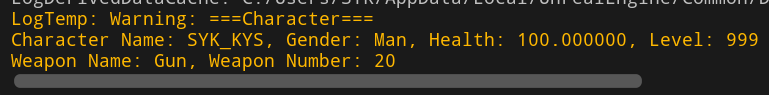

#### 对象嵌套数组以及数组嵌套对象的读取

关于代码的解释我都写在了注释中。

```C++
//SYKJsonActor.h
UFUNCTION(BlueprintCallable, Category = "SYK")
void JsonReader_03();

//使用到的结构体
//武器信息
struct FWeaponInfo
{
    FString WeaponName = TEXT("None");	//武器名字
    int32 WeaponNumber = 0;				//武器数量

    FString ToString() const
    {
        return FString::Printf(TEXT("Weapon Name: %s, Weapon Number: %d"), *WeaponName, WeaponNumber);
    }
};

//多个武器信息
struct FWeaponsInfo
{
    int32 WeaponCount = 0;		//总的武器数量
    TArray<FWeaponInfo> WeaponArray;	//多个武器的信息

    FString ToString() const
    {
        FString Result = FString::Printf(TEXT("Total Weapon Count: %d\n"), WeaponCount);
        for (const auto& Weapon : WeaponArray)
        {
            Result += Weapon.ToString() + TEXT("\n");
        }
        return Result;
    }
};

//SYKJsonActor.cpp
void ASYKJsonActor::JsonReader_03()
{
	//下面我们来读一下Weapons.json文件
	//{
	//	"WeaponCount": 3,
	//	"WeaponArray" : [
	//		{ "WeaponName": "Gun", "WeaponNum" : 10 },
	//		{ "WeaponName": "Sword", "WeaponNum" : 30 },
	//		{ "WeaponName": "shiled", "WeaponNum" : 80 }
	//	]
	//}

	//加载Json文件到字符串
	FString LoadJsonString = TEXT("");
	FString JsonFilePath = FPaths::ProjectSavedDir() / TEXT("WeaponsInfo.json");
	FFileHelper::LoadFileToString(LoadJsonString, *JsonFilePath);

	//创建读取流JsonReader,操作刚加载进来的LoadJsonString
	TSharedRef<TJsonReader<TCHAR>> JsonReader = TJsonReaderFactory<TCHAR>::Create(LoadJsonString);

	//反序列化
	TSharedPtr<FJsonObject> WeaponsObject;
	bool IsDeserialized = FJsonSerializer::Deserialize(JsonReader, WeaponsObject);
	if (!IsDeserialized)
	{
		UE_LOG(LogTemp, Warning, TEXT("Deserialize failed"));
		return;
	}

	//定义一个存储数据的结构体变量
	FWeaponsInfo Weapons;

	//下面就是利用WeaponsObject中获取数据并赋值给Weapons，最后日志输出结果
	Weapons.WeaponCount = WeaponsObject->GetNumberField(TEXT("WeaponCount"));
	/*
	* 下面的代码逻辑较为复杂，我们需要明晰FJsonObject和FJsonValue二者的区别
	*/
	TArray<TSharedPtr<FJsonValue>> JsonWeaponArray = WeaponsObject->GetArrayField(TEXT("WeaponArray"));
	for (auto& JsonWeapon : JsonWeaponArray)
	{
		//根据JsonWeaponArray数组的类型我们不难看出JsonWeapon的类型是TSharedPtr<FJsonValue>
		//因此JsonWeapon所指对象的类型就是FJsonValue
		//这里我们将JsonWeapon所指对象作为一个FJsonObject类型的值返回给SingleObject
		//因为我们的Weapon结构体中有多个键值对，我们都需要获取到
		//所以转换为FJsonObject类型之后，就可以继续使用GetStringField、GetNumberField等各种函数
		//进而获取到键对应的值
		//SingleObject可以简单理解为数组中的一个个Weapon对象
		TSharedPtr<FJsonObject> SingleObject = JsonWeapon->AsObject();
		Weapons.WeaponArray.AddDefaulted();
		Weapons.WeaponArray.Last().WeaponName = SingleObject->GetStringField(TEXT("WeaponName"));
		Weapons.WeaponArray.Last().WeaponNumber = SingleObject->GetNumberField(TEXT("WeaponNum"));
	}

	//日志输出Weapons中的数据，验证是否成功读取Json文件
	UE_LOG(LogTemp, Warning, TEXT("===Weapons===\n%s"), *Weapons.ToString());
}
```

**运行结果**

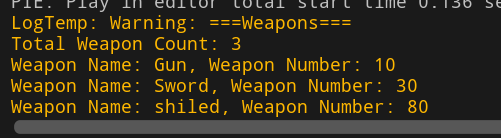

### 使用FJsonObjectConverter

！**注意**：要使用`FJsonObjectConverter`类，我们需要在当前模块的`.Build.cs`文件中包含对应的模块`"JsonUtilities"`，还有头文件`#include "JsonObjectConverter.h"`。

学习了前面的各种读写知识，相信在你心中一定隐约浮动着一句话：”这也太麻烦了！“。

那么我们的`FJsonObjectConverter`就可以闪亮登场啦~~~

`FJsonObjectConverter`可以帮助我们快速的实现`结构体<------>Json字符串`的转换工作，无需使用`TJsonWriter`和`TJsonReader`。一切工作仅需简单的几个函数即可完成。

#### **常用函数**

- `FJsonObjectConverter::UStructToJsonObjectString()`：实现结构体向Json字符串的转换。

  ```C++
  FJsonObjectConverter::UStructToJsonObjectString(
  	CustomStruct, 
  	JsonString
  );
  ```

  第一个参数：填写我们存放数据的自定义结构体变量。

  第二个参数：填写一个字符串接收结构体转化后的`Json`字符串。

- `FJsonObjectConverter::JsonObjectStringToUStruct()`：实现`Json`字符串向结构体的转换。

  ```C++
  FJsonObjectConverter::JsonObjectStringToUStruct(
  	JsonString, 
  	&CustomStruct //注意这里参数的写法与其它参数有明显不同
  );
  ```

  第一个参数：填写从外部文件加载进来的`Json`字符串。

  第二个参数：填写一个空结构体的**地址**接收`Json`字符串转化后的结构体变量。

#### 注意事项

`FJsonObjectConverter`虽然很好用，但也不是万能的。它的功能是基于虚幻引擎的反射系统实现的。

因此如果要使用它实现`结构体<------>Json字符串`这种操作。我们结构体的声明必须被`USTRUCT()`宏标记，且结构体的成员变量需要被`UPROPERTY()`宏标记。

具体情况如下代码所示

```C++
USTRUCT()
struct CustomStruct
{
    GENERATED_BODY()
    
	UPROPERTY()
	FString xxx;
    
    UPROPERTY()
    int32 yyy;
};
```

这样一个结构体`CustomStruct`的变量就可以作为函数的参数，转换为`Json`字符串了，反向的转换也是可以的。

如果一个结构体只有`USTRUCT()`标记，其成员变量全都没有`UPROPERTY()`。

```C++
USTRUCT()
struct CustomStruct
{
    GENERATED_BODY()
    
	FString xxx;
    
	int32 yyy;
};
```

那么这样的结构体变量也可以作为函数的参数参与转换，但是转换后的字符串不会包含结构体中的任何数据，因为它的成员变量没有参与反射，函数不会转化这些没有参与反射的成员变量。

如果一个有`USTRUCT()`标记的结构体中部分成员变量有`UPROPERTY()`标记，另外一部分没有`UPROPERTY()`标记，那么有`UPROPERTY()`标记的成员变量会被转化为`Json`字符串，而没有`UPROPERTY()`标记的成员变量则不会。

#### 操作步骤

​	参照之前的操作步骤，我们把写入流、读取流的部分替换为`FJsonObjectConverter`的一个函数转换即可，其它文件读写的内容都是一样的。

#### 简单结构体的Json读写

我们先从一个简单的结构体开始。

关于代码的解释我都写在了注释中。

```C++
//SYKJsonActor.h
UFUNCTION(BlueprintCallable, Category = "SYK")
void ConverterReadWrite_01();

//使用到的结构体
USTRUCT()
struct FConvertWeapon
{
    GENERATED_BODY()

    UPROPERTY()
    FString WeaponName = TEXT("None");

    UPROPERTY()
    int32 WeaponNumber = 0;

    FString ToString() const
    {
        return FString::Printf(TEXT("Name: %s, Number: %d"), *WeaponName, WeaponNumber);
    };
};

//SYKJsonActor.cpp
void ASYKJsonActor::ConverterReadWrite_01()
{
	/*****首先是结构体转化为Json字符串并写入文件*****/
	/*
	* 最终结果：
	* {
	*	"name": "Shotgun",
	*	"number": 15
	* }
	*/

	//新建一个结构体变量并且设置一些数值
	FConvertWeapon SaveWeapon;
	SaveWeapon.WeaponName = TEXT("Shotgun");
	SaveWeapon.WeaponNumber = 15;

	//定义一个接收Json格式字符串的变量
	FString SaveJsonString = TEXT("");

	//使用FJsonObjectConverter::UStructToJsonObjectString()函数
	//实现Weapon结构体到Json字符串的转化
	bool IsConvert = FJsonObjectConverter::UStructToJsonObjectString(SaveWeapon, SaveJsonString);
	if (!IsConvert)
	{
		UE_LOG(LogTemp, Warning, TEXT("Save Convert Failed"));
		return;
	}

	//Json字符串写入Json文件
	FString JsonFilePath = FPaths::ProjectSavedDir() / TEXT("ConvertWeapon.json");
	FFileHelper::SaveStringToFile(SaveJsonString, *JsonFilePath, FFileHelper::EEncodingOptions::ForceUTF8WithoutBOM);

	/*****下面是从文件中读取Json字符串并转化为结构体*****/

	//从Json文件读取Json字符串
	FString LoadJsonString = TEXT("");
	FFileHelper::LoadFileToString(LoadJsonString, *JsonFilePath);

	//定义一个接收Json字符串转化后数据的结构体
	FConvertWeapon LoadWeapon;

	//使用FJsonObjectConverter::JsonObjectStringToUStruct()函数
	//实现Json格式字符串到对应结构体的转化
	IsConvert = FJsonObjectConverter::JsonObjectStringToUStruct(LoadJsonString, &LoadWeapon);
	if (!IsConvert)
	{
		UE_LOG(LogTemp, Warning, TEXT("Load Convert Failed"));
		return;
	}

	//输出结构体数据，验证是否读取成功
	UE_LOG(LogTemp, Warning, TEXT("%s"), *LoadWeapon.ToString());
}
```

**运行结果**

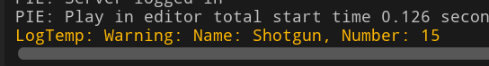

结构很简单，不再赘述。

#### 嵌套结构体的Json读写

这里我们使用的是一个`FConvertCharacter`结构体，其中有一个成员变量是`FConvertWeapon`结构体，所以是嵌套的结构体。

关于代码的解释我都写在了注释中。

```C++
//SYKJsonActor.h
UFUNCTION(BlueprintCallable, Category = "SYK")
void ConverterReadWrite_02();

//使用到的结构体
USTRUCT()
struct FConvertWeapon
{
    GENERATED_BODY()

    UPROPERTY()
    FString WeaponName = TEXT("None");

    UPROPERTY()
    int32 WeaponNumber = 0;

    FString ToString() const
    {
        return FString::Printf(TEXT("Name: %s, Number: %d"), *WeaponName, WeaponNumber);
    };
};

USTRUCT()
struct FConvertCharacter
{
    GENERATED_BODY()

    UPROPERTY()
    FString CharacterName = TEXT("None");

    UPROPERTY()
    FString Gender = TEXT("None");

    UPROPERTY()
    int32 Level = 0;
    
    UPROPERTY() 
    FConvertWeapon ConvertWeapon; //嵌套的结构体

    FString ToString() const
    {
        return FString::Printf(TEXT("Character Name: %s, Gender: %s, Level: %d, ConvertWeapon: %s"),
            *CharacterName, *Gender, Level, *ConvertWeapon.ToString() );
    }
};

//SYKJsonActor.cpp
void ASYKJsonActor::ConverterReadWrite_02()
{
	/*****首先是结构体转化为Json字符串并写入文件*****/
	/*
	* 最终结果：
	* {
	*	"characterName": "SYK_KYS",
	*	"gender": "Man",
	*	"level": 999999,
	*	"convertWeapon":
	*	{
	*	"weaponName": "Rifle",
	*	"weaponNumber": 10
	*	}
	* }
	*/

	//新建一个结构体变量并且设置一些数值
	FConvertCharacter SaveConvertCharacter;
	SaveConvertCharacter.CharacterName = TEXT("SYK_KYS");
	SaveConvertCharacter.Gender = TEXT("Man");
	SaveConvertCharacter.Level = 999999;
	SaveConvertCharacter.ConvertWeapon.WeaponName = TEXT("Rifle");
	SaveConvertCharacter.ConvertWeapon.WeaponNumber = 10;

	//定义字符串
	FString SaveJsonString = TEXT("");

	//结构体转Json字符串
	FJsonObjectConverter::UStructToJsonObjectString(SaveConvertCharacter, SaveJsonString);
	
	//写入Json文件
	FString JsonFilePath = FPaths::ProjectSavedDir() / TEXT("ConvertCharacter.json");
	FFileHelper::SaveStringToFile(SaveJsonString, *JsonFilePath, FFileHelper::EEncodingOptions::ForceUTF8WithoutBOM);

	/*****下面是从文件中读取Json字符串并转化为结构体*****/

	//定义接收的字符串
	FString LoadJsonString = TEXT("");
	FFileHelper::LoadFileToString(LoadJsonString, *JsonFilePath);

	//定义接收Json数据的结构体
	FConvertCharacter LoadConvertCharacter;

	//Json字符串转结构体
	FJsonObjectConverter::JsonObjectStringToUStruct(LoadJsonString, &LoadConvertCharacter);

	//输出结构体数据，验证是否读取成功
	UE_LOG(LogTemp, Warning, TEXT("%s"), *LoadConvertCharacter.ToString());
}
```

**运行结果**

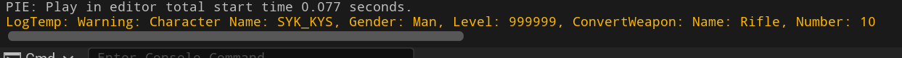

没有什么难度，尽管是嵌套的结构体，我们仍然可以使用一个函数搞定，反射就是牛！！！

#### 特殊情况举例

特殊情况是指`FConvertWeapons`结构体中有两个成员变量，一个是有`USTRUCT()`标记的`FConvertWeapon`结构体，另一个是没有`USTRUCT()`标记的`FWeaponInfo`结构体。那按照理论应该是没有标记的结构体无法读出数据。

关于代码的解释我都写在了注释中。

```C++
//SYKJsonActor.h

//使用到的结构体
struct FWeaponInfo
{
    FString WeaponName = TEXT("None");	//武器名字
    int32 WeaponNumber = 0;				//武器数量

    FString ToString() const
    {
        return FString::Printf(TEXT("Weapon Name: %s, Weapon Number: %d"), *WeaponName, WeaponNumber);
    }
};

USTRUCT()
struct FConvertWeapon
{
    GENERATED_BODY()

    UPROPERTY()
    FString WeaponName = TEXT("None");

    UPROPERTY()
    int32 WeaponNumber = 0;

    FString ToString() const
    {
        return FString::Printf(TEXT("Name: %s, Number: %d"), *WeaponName, WeaponNumber);
    };
};

USTRUCT()
struct FConvertWeapons
{
    GENERATED_BODY()

    //有UPROPERTY宏标记
    UPROPERTY()
    FConvertWeapon ConvertWeapon;

    //无UPROPERTY宏标记
    FWeaponInfo Weapon;

    FString ToString() const
    {
        return FString::Printf(TEXT("ConvertWeapon: %s, Weapon: %s"),
            *ConvertWeapon.ToString(), *Weapon.ToString());
    }
};

//SYKJsonActor.cpp
void ASYKJsonActor::ConverterReadWrite_03()
{
	/*****首先是结构体转化为Json字符串并写入文件*****/
	//注意观察结构体中有UPROPERTY宏标记的变量和无UPROPERTY宏标记的变量在Json文件中的表现
	/*
	* 最终结果：
	* {
		"convertWeapon":
		{
		"weaponName": "Rifle",
		"weaponNumber": 10
		}
	* }
	* 
	* 可以看出没有UPROPERTY宏标记的变量在Json文件中根本不存在
	* 因此我们可以知道FJsonObjectConverter提供的接口只会把有UPROPERTY宏标记的变量转化为Json字符串
	*/

	//新建一个结构体变量并且设置一些数值
	FConvertWeapons SaveConvertWeapons;
	SaveConvertWeapons.ConvertWeapon.WeaponName = TEXT("Rifle");
	SaveConvertWeapons.ConvertWeapon.WeaponNumber = 10;

	SaveConvertWeapons.Weapon.WeaponName = TEXT("Shotgun");
	SaveConvertWeapons.Weapon.WeaponNumber = 20;

	//定义字符串
	FString SaveJsonString = TEXT("");

	//结构体转Json字符串
	FJsonObjectConverter::UStructToJsonObjectString(SaveConvertWeapons, SaveJsonString);

	//写入Json文件
	FString JsonFilePath = FPaths::ProjectSavedDir() / TEXT("ConvertWeapons.json");
	FFileHelper::SaveStringToFile(SaveJsonString, *JsonFilePath, FFileHelper::EEncodingOptions::ForceUTF8WithoutBOM);

	/*****下面是从文件中读取Json字符串并转化为结构体*****/

	//定义接收的字符串
	FString LoadJsonString = TEXT("");
	FFileHelper::LoadFileToString(LoadJsonString, *JsonFilePath);

	//定义接收Json数据的结构体
	FConvertWeapons LoadConvertWeapons;

	//Json字符串转结构体
	FJsonObjectConverter::JsonObjectStringToUStruct(LoadJsonString, &LoadConvertWeapons);

	//输出结构体数据，验证是否读取成功
	UE_LOG(LogTemp, Warning, TEXT("%s"), *LoadConvertWeapons.ToString());
}
```

**运行结果**

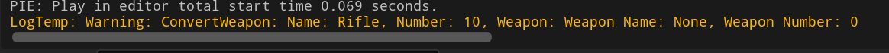

可以看出没有`USTRUCT()`标记的结构体读取到的是初始值，而不是我们当初给它设定的值，说明它并没有从`Json`字符串中获取到数据，且`Json`字符串中压根就没有它的数据，因为写入的时候就没写进文件里。

## 无法确定键的键值对怎么读取

有些`Json`文件的**键值对**中的键是一些很复杂的值，比如ID值，有些ID值很长且不固定，那么我们不能使用前面讲过的那些方法读取数据了，因为那些方法有一个相同点就是，需要根据我们提供的键的字符串，去尝试Get其对应的值。

下面我们使用`TJsonReader`演示一下这种文件怎么读取。代码的前面的部分是写入文件的操作，不太重要，我们的重点是学习如何读取这种文件，也就是代码后面的部分。中间会有一段注释描述这种文件是什么样子的。

关于代码的解释我都写在了注释中。

```C++
//SYKJsonActor.h
UFUNCTION(BlueprintCallable, Category = "SYK")
void UnableDetermineJsonRW();

//SYKJsonActor.cpp
void ASYKJsonActor::UnableDetermineJsonRW()
{
	//以下是写入Json文件数据的操作，前面讲到过不再赘述
	FString FinalJsonString = TEXT("");

	TSharedRef<TJsonWriter<TCHAR, TCondensedJsonPrintPolicy<TCHAR>>> JsonWriter
		= TJsonWriterFactory<TCHAR, TCondensedJsonPrintPolicy<TCHAR>>::Create(&FinalJsonString);

	JsonWriter->WriteObjectStart();
	for (int i = 0; i < 5; ++i)
	{
        //生成一个ID值
		FString ID = FGuid::NewGuid().ToString();
		JsonWriter->WriteValue(ID, i);
	}
	JsonWriter->WriteObjectEnd();
	JsonWriter->Close(); //再次强调不要缺少这一步

    //写入文件的操作
	FString JsonFilePath = FPaths::ProjectSavedDir() / TEXT("IDName.json");
	FFileHelper::SaveStringToFile(FinalJsonString, *JsonFilePath , FFileHelper::EEncodingOptions::ForceUTF8WithoutBOM);

	/*
	* 到此我们写入IDName.json文件的数据如下所示
	* 当然，因为是FGuid::NewGuid()值，
	* 所以每次我们调用该函数都会修改Json文件中的数据，因此这些键应该是会一直变化的
	* 
	* {
	*	"D531C81E4A531C72A553FC94F14CB196": 0,
	*	"58F6A63E4EAF9B4B0AAA8685E76CA3B3": 1,
	*	"6DB4F14A4CDC3597F2AB28A057A3ED12": 2,
	*	"E8A613E04A0168CE574981AF40E9E702": 3,
	*	"7B83A44B4B1FB9EF8A9F08B8FC395335": 4
	* }
	* 这种文件的一个特点就是键的不确定性
	* 我们知道之前我们所演示的那些读取Json文件的操作，都是已知键的情况下获取键对应的值的操作
	* 比如Weapons.WeaponCount = WeaponsObject->GetNumberField(TEXT("WeaponCount"));
	* 它就是已知键为WeaponCount，我们就可以获取到WeaponCount对应的数值
	* 但是我们刚刚写入的这种文件，它的键是ID值，是不固定的，所以我们不能延用老方法读取数据了
	* 下面我们就来演示如何读取这种Json文件
	*/

	//首先从IDName.json文件中加载出字符串
	FString LoadJsonString = TEXT("");
	//JsonFilePath在写入Json的时候定义过了
	FFileHelper::LoadFileToString(LoadJsonString , *JsonFilePath);

	//定义一个合适的数据结构，目的是合理的接收Json数据，因此这里可以根据需要自定义
	TMap<FString, int32> IDNameMap;

	//创建读取流JsonReader
	TSharedRef<TJsonReader<TCHAR>> JsonReader = TJsonReaderFactory<TCHAR>::Create(LoadJsonString);

	//反序列化
	TSharedPtr<FJsonObject> IDNameObject;
	bool IsDeserialized = FJsonSerializer::Deserialize(JsonReader, IDNameObject);
	if (!IsDeserialized)
	{
		UE_LOG(LogTemp, Warning, TEXT("Deserialize failed"));
		return;
	}

	/*
	* 下面这个for循环是读取IDName.json过程中最关键的部分
	* 我们使用IDNameObject->Values获取到Json数据的Values键值对
	* 这个Values键值对就是一个个的（"D531C81E4A531C72A553FC94F14CB196": 0,）这种数据
	* 大家可以点进Values的定义处看一下源码，就知道它是一个Map类型的数据
	* 之后我们在for循环中依次获取到Map中的一个个键值对
	* 
	* 值得注意的是键就是单纯的temp.Key，但是值temp.Value的类型实际上是一个FJsonValue对象
	* 所以我们需要根据情况做出灵活的转换，
	* 比如这里我们存储的是数字，那么我就调用AsNumber()即可
	*/
	for (auto& temp : IDNameObject->Values)
	{
		IDNameMap.Add(temp.Key, temp.Value->AsNumber());
	}

	//遍历输出IDNameMap的数据，验证Json文件是否读取成功
	for (auto It = IDNameMap.CreateConstIterator(); It; ++It)
	{
		const FString& Key = It->Key;
		int32 Value = It->Value;
		UE_LOG(LogTemp, Warning, TEXT("Key: %s, Value: %d"), *Key, Value);
	}
}
```

**运行结果**

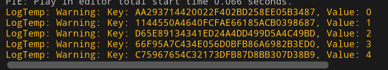


我执行了两次代码，向大家说明这种键的“不确定性”，可以看到每次执行代码得到的键都是不同的。

## Json嵌套Json读写方式

解释一下`Json`嵌套`Json`是什么，它的意思就是一个`Json`文件中的数据里还有一个`Json`格式的字符串，那么如果要将内部嵌套的这个`Json`格式的字符串转换为代码中的结构体的话，我们应该怎么做？这就是本节要讨论的问题。

商业活动中，这种`Json`文件比较常见。其`Json`文件外层都是统一的数据结构，其中一个键值对的值中存放具体业务逻辑需要用到的`Json`格式的字符串。那么我们就需要从这种文件里获取到内层嵌套的`Json`数据。

下面我以一个结构体为例为大家演示它的做法。有了前面知识的学习，我们可以尝试将使用`TJsonWriter`和`TJsonReader`对结构体**序列化**和**反序列化**的过程封装到结构体的函数中。在代码中我封装了这两个（序列化、反序列化）过程的代码。分别是`StructToJsonString()`和`JsonStringToStruct()`。建议大家先熟悉一下这两个函数的定义，再去看执行的函数代码。

关于代码的解释我都写在了注释中。

```C++
//SYKJsonActor.h
UFUNCTION(BlueprintCallable, Category = "SYK")
void JsonNestedJsonRW();

//使用到的结构体
struct FNestedJson
{
    int32 Code = 0;
    FString Message = TEXT("None");
    FString Sid = TEXT("None");
    
    //Info变量将会是存储内层Json字符串的变量
    FString Info = TEXT("None");

    //该函数用于将一个结构体变量的数据转化为可以储存在Json文件中的字符串
    //使用到了TJsonWriter模板类
    FString StructToJsonString();

    //该函数通过Json字符串返回一个FNestedJson结构体对象
    //使用到了TJsonReader模板类
    static FNestedJson JsonStringToStruct(const FString& InJsonString);

    FString ToString() const
    {
        return FString::Printf(TEXT("Code: %d\nMessage: %s\nSid: %s\nInfo: %s"),
            Code, *Message, *Sid, *Info);
    }
};

//SYKJsonActor.cpp

//结构体中函数的函数定义

FString FNestedJson::StructToJsonString()
{
	//创建最后返回的Json格式的字符串
	FString FinalJsonString = TEXT("");

	//接下来是序列化工作，前面已经讲过，这里不再详细解释

	//创建JsonWriter，在FinalJsonString中写入数据
	TSharedRef<TJsonWriter<TCHAR, TCondensedJsonPrintPolicy<TCHAR>>> JsonWriter
		= TJsonWriterFactory<TCHAR, TCondensedJsonPrintPolicy<TCHAR>>::Create(&FinalJsonString);

	JsonWriter->WriteObjectStart();

	JsonWriter->WriteValue(TEXT("Code"), this->Code);
	JsonWriter->WriteValue(TEXT("Message"), this->Message);
	JsonWriter->WriteValue(TEXT("Sid"), this->Sid);
	JsonWriter->WriteValue(TEXT("Info"), this->Info);

	JsonWriter->WriteObjectEnd();
	JsonWriter->Close(); //再次强调，不要忘记这一步，否则FinalJsonString为空

	//返回当前结构体的Json格式字符串
	return FinalJsonString;
}

FNestedJson FNestedJson::JsonStringToStruct(const FString& InJsonString)
{
	//定义最后返回的结构体
	FNestedJson ReturnStruct;
	
	//接下来是反序列化操作，不再详细赘述

	//创建读取流，操作函数参数接收的Json格式字符出串：InJsonString
	TSharedRef<TJsonReader<TCHAR>> JsonReader = TJsonReaderFactory<TCHAR>::Create(InJsonString);

	TSharedPtr<FJsonObject> StructObject;
	bool IsDeserialized = FJsonSerializer::Deserialize(JsonReader, StructObject);
	if (!IsDeserialized)
	{
		UE_LOG(LogTemp, Warning, TEXT("Deserialize failed"));
		return FNestedJson();
	}

	ReturnStruct.Code = StructObject->GetNumberField(TEXT("Code"));
	ReturnStruct.Message = StructObject->GetStringField(TEXT("Message"));
	ReturnStruct.Sid = StructObject->GetStringField(TEXT("Sid"));
	ReturnStruct.Info = StructObject->GetStringField(TEXT("Info"));

	//返回Json格式字符串对应的结构体
	return ReturnStruct;
}

//具体执行函数的函数定义

void ASYKJsonActor::JsonNestedJsonRW()
{
	FNestedJson InsideStruct;	//内层结构体，用于嵌套在OutsideStruct中
	FNestedJson OutsideStruct;	//外层结构体，结构体中的Info储存InsideStruct的Json格式字符串

	//InsideStruct设置一些测试值
	InsideStruct.Code = 111;
	InsideStruct.Message = TEXT("这里是InsideStruct");
	InsideStruct.Sid = TEXT("1111111111");
	InsideStruct.Info = TEXT("None");

	//OutsideStruct设置一些测试值
	OutsideStruct.Code = 999;
	OutsideStruct.Message = TEXT("这里是OutsideStruct");
	OutsideStruct.Sid = TEXT("9999999999999");
	OutsideStruct.Info = InsideStruct.StructToJsonString();

	//下面我们将OutsideStruct写入Json文件
	//因为我们已经封装了Json字符串的编辑，
	//所以我们直接把OutsideStruct转化后的Json字符串写进文件即可
	FString SavedJsonString = OutsideStruct.StructToJsonString();
	FString JsonFilePath = FPaths::ProjectSavedDir() / TEXT("NestedJson.json");
	FFileHelper::SaveStringToFile(SavedJsonString, *JsonFilePath, FFileHelper::EEncodingOptions::ForceUTF8WithoutBOM);
	/*
	* 代码执行到此处，我们的NestedJson.json文件中的数据为
	* {
	*	"Code": 999,
	*	"Message": "这里是OutsideStruct",
	*	"Sid": "9999999999999",
	*	"Info": "{\"Code\":111,\"Message\":\"这里是InsideStruct\",\"Sid\":\"1111111111\",\"Info\":\"None\"}"
	* }
	* 
	* 可以看到我们的Json文件中的数据里面还有一个Json格式的字符串
	* 那么如果我们要将嵌套在里面的字符串还原为结构体变量供其它地方使用的话
	* 最好是根据这个内部嵌套的Json格式字符串设计一个与其适配的结构体，
	* 之后通过封装一个类似FNestedJson::JsonStringToStruct(const FString& InJsonString)的函数
	* 实现这种转换
	* 这里我内外都是使用的同一个结构体类型，方便阅读，
	* 实际上内部嵌套的Json字符串可以是任何一种结构，我们只需要按照实际情况设计对应的结构体并封装功能即可
	*/

	//下面我们就来尝试获取内部嵌套的Json格式字符串所对应的结构体
	FString LoadJsonString = TEXT("");
	FFileHelper::LoadFileToString(LoadJsonString, *JsonFilePath);

	//这里我们可以使用TJsonReader模板类反序列化LoadJsonString
	//但是我们封装的有FNestedJson::JsonStringToStruct(const FString& InJsonString)
	//所以可以直接用它来获取第一层结构体的数据
	FNestedJson FirstLayer = FNestedJson::JsonStringToStruct(LoadJsonString);
	
	//之后我们就可以拿到Info字符串
	FString JsonString = FirstLayer.Info;
	//同样的操作，获取到第二层结构体的数据
	FNestedJson SecondLayer = FNestedJson::JsonStringToStruct(JsonString);

	//测试输出两个结构体信息，验证是否获取到Json数据
	UE_LOG(LogTemp, Warning, TEXT("===FirstLayer===\n%s"), *FirstLayer.ToString());
	UE_LOG(LogTemp, Warning, TEXT("===SecondLayer===\n%s"), *SecondLayer.ToString());
}
```

**运行结果**

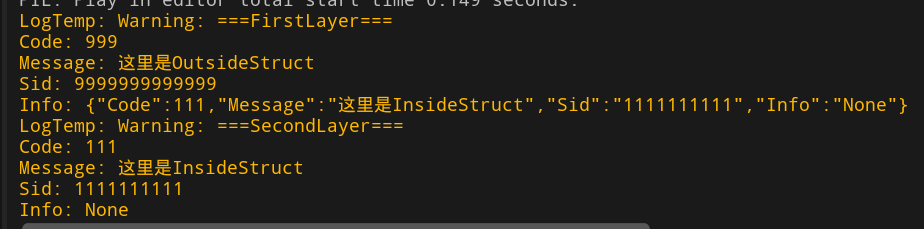

对照着第一层`Info`的`Json`格式字符串，我们可以看出，第二层的信息是非常完整的，的确获取到了字符串中的数据。这说明我们给结构体封装的两个函数写的很成功。

当然，直接用`FJsonObjectConverter`转化两次结构体其实也可以达到目的，而且还更节省代码量。那么我这里演示的是一个相对复杂的方法，但是兼容性更强，因为它不需要`USTRUCT()`等宏标记。而且大家应该重在理解这种Json文件的处理思想，不在于用什么方法。

## 完整代码

下面是本文使用到的全部代码，包括参与读写的各个`Json`文件代码。

### `SYKJsonActor.h`

```C++
// Fill out your copyright notice in the Description page of Project Settings.

#pragma once

#include "CoreMinimal.h"
#include "GameFramework/Actor.h"
#include "SYKJsonActor.generated.h"

//武器信息
struct FWeaponInfo
{
    FString WeaponName = TEXT("None");	//武器名字
    int32 WeaponNumber = 0;				//武器数量

    FString ToString() const
    {
        return FString::Printf(TEXT("Weapon Name: %s, Weapon Number: %d"), *WeaponName, WeaponNumber);
    }
};

//多个武器信息
struct FWeaponsInfo
{
    int32 WeaponCount = 0;		//总的武器数量
    TArray<FWeaponInfo> WeaponArray;	//多个武器的信息

    FString ToString() const
    {
        FString Result = FString::Printf(TEXT("Total Weapon Count: %d\n"), WeaponCount);
        for (const auto& Weapon : WeaponArray)
        {
            Result += Weapon.ToString() + TEXT("\n");
        }
        return Result;
    }
};

//角色信息
struct FCharacterInfo
{
    FString Name = TEXT("None");	//角色名字
    FString Gender = TEXT("None");	//角色性别
    double Health = 0.0;			//角色血量
    int32 Level = 0;				//角色等级
    FWeaponInfo Weapon;				//角色武器

    FString ToString() const
    {
        return FString::Printf(TEXT("Character Name: %s, Gender: %s, Health: %f, Level: %d\n%s"),
            *Name, *Gender, Health, Level, *Weapon.ToString());
    }
};

//演示FJsonObjectConverter用的结构体
//在ConverterReadWrite_01()函数有用到
USTRUCT()
struct FConvertWeapon
{
    GENERATED_BODY()

    UPROPERTY()
    FString WeaponName = TEXT("None");

    UPROPERTY()
    int32 WeaponNumber = 0;

    FString ToString() const
    {
        return FString::Printf(TEXT("Name: %s, Number: %d"), *WeaponName, WeaponNumber);
    };
};

//演示FJsonObjectConverter用的结构体
//在ConverterReadWrite_02()函数有用到
USTRUCT()
struct FConvertCharacter
{
    GENERATED_BODY()

    UPROPERTY()
    FString CharacterName = TEXT("None");

    UPROPERTY()
    FString Gender = TEXT("None");

    UPROPERTY()
    int32 Level = 0;
    
    UPROPERTY()
    FConvertWeapon ConvertWeapon;

    FString ToString() const
    {
        return FString::Printf(TEXT("Character Name: %s, Gender: %s, Level: %d, ConvertWeapon: %s"),
            *CharacterName, *Gender, Level, *ConvertWeapon.ToString() );
    }
};

//演示FJsonObjectConverter用的结构体
//在ConverterReadWrite_03()函数有用到
USTRUCT()
struct FConvertWeapons
{
    GENERATED_BODY()

    //有UPROPERTY宏标记
    UPROPERTY()
    FConvertWeapon ConvertWeapon;

    //无UPROPERTY宏标记
    FWeaponInfo Weapon;

    FString ToString() const
    {
        return FString::Printf(TEXT("ConvertWeapon: %s, Weapon: %s"),
            *ConvertWeapon.ToString(), *Weapon.ToString());
    }
};

//演示Json嵌套Json读写用的结构体
struct FNestedJson //嵌套Json
{
    int32 Code = 0;
    FString Message = TEXT("None");
    FString Sid = TEXT("None");
    FString Info = TEXT("None");

    //该函数用于将一个结构体变量的数据转化为可以储存在Json文件中的字符串
    //使用到了TJsonWriter模板类
    FString StructToJsonString();

    //该函数通过Json字符串返回一个FNestedJson结构体对象
    //使用到了TJsonReader模板类
    static FNestedJson JsonStringToStruct(const FString& InJsonString);

    FString ToString() const
    {
        return FString::Printf(TEXT("Code: %d\nMessage: %s\nSid: %s\nInfo: %s"),
            Code, *Message, *Sid, *Info);
    }
};


UCLASS()
class SAMPLEDEMO_API ASYKJsonActor : public AActor
{
	GENERATED_BODY()
	
public:	
	ASYKJsonActor();

protected:
	virtual void BeginPlay() override;

public:	
	virtual void Tick(float DeltaTime) override;

public:	//简单的Json文件读写
	
	UFUNCTION(BlueprintCallable, Category = "SYK")
	void OriginJsonRW();

public:	//使用TJsonWriter模板类实现Json文件的写入操作

	//单个对象的写入Weaponinfo.json文件
	UFUNCTION(BlueprintCallable, Category = "SYK")
	void JsonWriter_01();

	//对象嵌套对象的写入Character.json文件
	UFUNCTION(BlueprintCallable, Category = "SYK")
	void JsonWriter_02();

	//对象嵌套数组以及数组嵌套对象的写入Weapons.json文件
	UFUNCTION(BlueprintCallable, Category = "SYK")
	void JsonWriter_03();

public: //使用TJsonReader模板类实现Json文件的读取操作

	//以Weaponinfo.json文件为例，列举从Json文件中读取数据的多种方式
	UFUNCTION(BlueprintCallable, Category = "SYK")
	void JsonReader_01();

	//以Character.json文件为例，读取数据
	UFUNCTION(BlueprintCallable, Category = "SYK")
	void JsonReader_02();

	//以Weapons.json文件为例，读取数据
	UFUNCTION(BlueprintCallable, Category = "SYK")
	void JsonReader_03();

public: //使用FJsonObjectConverter

    //以ConvertWeapon.json文件为例，读写FConvertWeapon的数据
    UFUNCTION(BlueprintCallable, Category = "SYK")
    void ConverterReadWrite_01();

    //以ConvertCharacter.json文件为例，读写FConvertCharacter的数据
    UFUNCTION(BlueprintCallable, Category = "SYK")
    void ConverterReadWrite_02();

    //以ConvertWeapons.json文件为例，读写FConvertCharacter的数据
    UFUNCTION(BlueprintCallable, Category = "SYK")
    void ConverterReadWrite_03();

public: //无法确定键的键值对怎么读取

    UFUNCTION(BlueprintCallable, Category = "SYK")
    void UnableDetermineJsonRW();

public: //Json嵌套Json读写方式

    UFUNCTION(BlueprintCallable, Category = "SYK")
    void JsonNestedJsonRW();
};

```

### `SYKJsonActor.cpp`

```C++
// Fill out your copyright notice in the Description page of Project Settings.


#include "JsonReadWrite/SYKJsonActor.h"
#include "Misc/FileHelper.h"
#include "Serialization/JsonWriter.h"
#include "Serialization/JsonReader.h"
#include "Dom/JsonObject.h"
#include "Dom/JsonValue.h"
#include "JsonObjectConverter.h"

//D:\Epic Games\UE_5.4\Engine\Source\Runtime\Core\Public\Misc\FileHelper.h
//D:\Epic Games\UE_5.4\Engine\Source\Runtime\Json\Public\Serialization\JsonWriter.h
//D:\Epic Games\UE_5.4\Engine\Source\Runtime\Json\Public\Dom\JsonValue.h
//D:\Epic Games\UE_5.4\Engine\Source\Runtime\JsonUtilities\Public\JsonObjectConverter.h

ASYKJsonActor::ASYKJsonActor()
{
	PrimaryActorTick.bCanEverTick = false;

}

void ASYKJsonActor::BeginPlay()
{
	Super::BeginPlay();
	
}

void ASYKJsonActor::Tick(float DeltaTime)
{
	Super::Tick(DeltaTime);

}

void ASYKJsonActor::OriginJsonRW()
{
	//我以一个简短的Json对象为例，介绍一下原始的Json文件读写方式
	/*
	{
		"name": "SYK",
		"age": "20",
		"gender": "man",
		"hobby": "basketball"
	}
	*/
	struct JsonMessage
	{
		FString UEName = "None";
		int32 UEAge = -1;
		FString UEGender = "None";
		FString UEHobby = "None";
	};

	//定义一个结构体变量Message，给它设置一些值
	JsonMessage Message;
	Message.UEName = "SYK";
	Message.UEAge = 20;
	Message.UEGender = "Man";
	Message.UEHobby = "Basketball";

	//根据Message的值，拼凑出来Json文件的格式，最终形成一个字符串
	//这里拼凑字符串的方式可以参考C语言Printf()函数的使用方式以及转义字符的用法
	FString jsonString = FString::Printf(
		TEXT("{\"name\":\"%s\",\"age\":\"%d\",\"gender\":\"%s\",\"hobby\":\"%s\"}") , 
		*Message.UEName , 
		Message.UEAge , 
		*Message.UEGender , 
		*Message.UEHobby
	);

	//定义一个json文件的存放路径，这里我们选择的是项目的Saved文件夹下
	FString filePath = FPaths::ProjectSavedDir() / TEXT("OriginJsonRW.json");
	//将字符串写入文件
	FFileHelper::SaveStringToFile(jsonString, *filePath, FFileHelper::EEncodingOptions::ForceUTF8);

	//定义一个新的字符串变量，用于存储从Json文件加载出来的字符串
	FString loadJsonString;
	//获取Json文件中我们刚刚写入的字符串并赋值给loadJsonString
	FFileHelper::LoadFileToString(loadJsonString, *filePath);
	//日志输出loadJsonString的结果
	UE_LOG(LogTemp, Warning, TEXT("%s"), *loadJsonString);
	//下面就是一些loadJsonString的拆解工作了
	/*
	* 我们需要根据接收到的Json文件的格式，按需拆解其中的值并转化为结构体等数据结构
	* 之后即可在代码中使用到Json文件中的数据，这里就不再演示了，都是一些字符串的基础操作
	* 这种方法的弊端就是，对于一些结构较为复杂的Json文件，我们的代码不能做到或者说很难做到良好的适配
	* 复杂的结构对于字符串而言就意味着更复杂的拆解算法，因此这种Json读写方式不太好用
	*/
}

void ASYKJsonActor::JsonWriter_01()
{
	//最终目标
	//{
	//	"WeaponName": "sword",
	//	"WeaponNumber" : 10
	//}

	//新建一个Weapon武器信息结构体并赋值
	//下面我们就会把这个结构体中的数据写成Json文件
	FWeaponInfo Weapon;
	Weapon.WeaponName = TEXT("sword");
	Weapon.WeaponNumber = 10;

	//新建字符串，我们后续Json文件的编写都是在操作这个字符串的数据
	FString FinalJsonString = TEXT("");

	//这是一个相对固定的写法，我们定义一个共享引用（其实就当共享指针用就行）
	//之后Create()函数中传入FinalJsonString字符串的地址
	//不难看出我们其实就是拿JsonWriter这个共享引用通过FinalJsonString的地址来精细的操作它的字符串数据
	//通过TJsonWriter提供的一些接口我们可以轻松的实现在UEC++中较为直观的编写Json文件
	TSharedRef<TJsonWriter<TCHAR, TCondensedJsonPrintPolicy<TCHAR>>> JsonWriter
		= TJsonWriterFactory<TCHAR, TCondensedJsonPrintPolicy<TCHAR>>::Create(&FinalJsonString);

	/*
	* 需要特别强调的是，下面我们使用的这些接口都是在操作FinalJsonString字符串
	* 即都是在往FinalJsonString里面添加数据
	* 还没有实际的写入Json文件中，之后我们会通过FFileHelper来实现字符串的序列化工作
	*/
	JsonWriter->WriteObjectStart(); //左大括号

	JsonWriter->WriteValue(TEXT("WeaponName"), Weapon.WeaponName); //写入武器名字
	JsonWriter->WriteValue(TEXT("WeaponNumber"), Weapon.WeaponNumber); //写入武器数量

	JsonWriter->WriteObjectEnd(); //右大括号

	JsonWriter->Close(); //TJsonWriter需要显式调用Close()才能将缓冲区数据写入目标字符串FinalJsonString
	//因此如果我们缺少这一步就会出现文件存在但是文件中内容为空的情况，因为FinalJsonString是空的
	//至此我们就成功的把WeaponInfo结构体的数据序列化为字符串了
	//下面就是写入指定json文件

	//定义Json文件存放路径
	FString FilePath = FPaths::ProjectSavedDir() / TEXT("WeaponInfo.json");

	//我们前面“微操”的那个字符串FinalJsonString写入文件
	FFileHelper::SaveStringToFile(FinalJsonString, *FilePath, FFileHelper::EEncodingOptions::ForceUTF8WithoutBOM);
}

void ASYKJsonActor::JsonWriter_02()
{
	//最终目标
	//{
	//	"Name": "SYK_KYS",
	//		"Gender" : "Man",
	//		"Health" : 100,
	//		"Level" : 999,
	//		"Weapon" : {
	//		"WeaponName": "Gun",
	//		"WeaponNumber" : 20
	//		}
	//}


	//把Character结构体中的数据写如Json文件中
	FCharacterInfo Character;					
	Character.Name = TEXT("SYK_KYS");			//给角色名字赋值
	Character.Gender = TEXT("Man");				//给角色性别赋值
	Character.Health = 100;						//给角色血量赋值
	Character.Level = 999;						//给角色等级赋值
	Character.Weapon.WeaponName = TEXT("Gun");	//给角色武器名字赋值
	Character.Weapon.WeaponNumber = 20;			//给角色武器数量赋值

	//定义最终序列化到Json文件的字符串
	FString FinalJsonString = TEXT("");

	//获取操作字符串的共享引用
	TSharedRef<TJsonWriter<TCHAR, TCondensedJsonPrintPolicy<TCHAR>>> JsonWriter
		= TJsonWriterFactory<TCHAR, TCondensedJsonPrintPolicy<TCHAR>>::Create(&FinalJsonString);

	JsonWriter->WriteObjectStart(); //左大括号

	JsonWriter->WriteValue(TEXT("Name"), Character.Name); //写入键值对
	JsonWriter->WriteValue(TEXT("Gender"), Character.Gender); //写入键值对
	JsonWriter->WriteValue(TEXT("Health"), Character.Health); //写入键值对
	JsonWriter->WriteValue(TEXT("Level"), Character.Level); //写入键值对

	{	//这里的大括号没有实际作用，只是我为了看着方便写的
		//毕竟我们使用的是指针，所以不用考虑大括号作用域的问题

		//这里就是我们写Character结构体中嵌套的Weapon结构体的代码
		//因为Weapon结构体在Json文件中的表现形式也是一个对象
		//因此我们自然需要使用JsonWriter->WriteObjectStart()函数
		//注意到这里函数中我们写了参数
		//这个参数中的字符串就表示Json文件中该对象的键
		//大家可以参考该函数开始部分的最终目标对照着看就知道它的作用了
		JsonWriter->WriteObjectStart(TEXT("Weapon")); //写入键和Weapon的左大括号

		JsonWriter->WriteValue(TEXT("WeaponName"), Character.Weapon.WeaponName); //写入键值对
		JsonWriter->WriteValue(TEXT("WeaponNumber"), Character.Weapon.WeaponNumber); //写入键值对

		JsonWriter->WriteObjectEnd(); //Weapon的右大括号
	}

	JsonWriter->WriteObjectEnd(); //右大括号

	JsonWriter->Close();//再次强调TJsonWriter需要显式调用Close()才能将缓冲区数据写入目标字符串FinalJsonString

	//定义Json文件存放路径
	FString JsonFilePath = FPaths::ProjectSavedDir() / TEXT("Character.json");

	//字符串FinalJsonString写入到指定文件
	FFileHelper::SaveStringToFile(FinalJsonString, *JsonFilePath, FFileHelper::EEncodingOptions::ForceUTF8WithoutBOM);
}

void ASYKJsonActor::JsonWriter_03()
{
	//最终目标
	//{
	//	"WeaponCount": 3,
	//	"WeaponArray" : [
	//		{ "WeaponName": "Gun", "WeaponNum" : 10 },
	//		{ "WeaponName": "Sword", "WeaponNum" : 30 },
	//		{ "WeaponName": "shiled", "WeaponNum" : 80 }
	//	]
	//}


	//定义多个武器信息结构体
	FWeaponsInfo Weapons;

	//添加一个数组元素并赋值
	Weapons.WeaponArray.AddDefaulted();
	Weapons.WeaponArray.Last().WeaponName = TEXT("Gun");
	Weapons.WeaponArray.Last().WeaponNumber = 10;

	//添加一个数组元素并赋值
	Weapons.WeaponArray.AddDefaulted();
	Weapons.WeaponArray.Last().WeaponName = TEXT("Sword");
	Weapons.WeaponArray.Last().WeaponNumber = 30;

	//添加一个数组元素并赋值
	Weapons.WeaponArray.AddDefaulted();
	Weapons.WeaponArray.Last().WeaponName = TEXT("shiled");
	Weapons.WeaponArray.Last().WeaponNumber = 80;

	//记录WeaponArray武器总数
	Weapons.WeaponCount = Weapons.WeaponArray.Num();

	FString FinalJsonString = TEXT("");

	TSharedRef<TJsonWriter<TCHAR, TCondensedJsonPrintPolicy<TCHAR>>> JsonWriter
		= TJsonWriterFactory<TCHAR, TCondensedJsonPrintPolicy<TCHAR>>::Create(&FinalJsonString);

	JsonWriter->WriteObjectStart();

	JsonWriter->WriteValue(TEXT("WeaponCount"), Weapons.WeaponCount);

	{
		//相当于数组中的左中括号，还有数组对应的键值WeaponArray
		JsonWriter->WriteArrayStart(TEXT("WeaponArray"));

		for (int32 i = 0; i < Weapons.WeaponCount; i++)
		{
			//数组中单个Weapon结构体的左大括号
			JsonWriter->WriteObjectStart();
			//写入键值对
			JsonWriter->WriteValue(TEXT("WeaponName"), Weapons.WeaponArray[i].WeaponName);
			JsonWriter->WriteValue(TEXT("WeaponNum"), Weapons.WeaponArray[i].WeaponNumber);
			//数组中单个Weapon结构体的左大括号
			JsonWriter->WriteObjectEnd();
		}

		//数组的右中括号
		JsonWriter->WriteArrayEnd();
	}

	JsonWriter->WriteObjectEnd();

	//再次强调TJsonWriter需要显式调用Close()才能将缓冲区数据写入目标字符串FinalJsonString
	JsonWriter->Close();

	//定义Json文件存放路径
	FString JsonFilePath = FPaths::ProjectSavedDir() / TEXT("WeaponsInfo.json");

	//FinalJsonString写入文件
	FFileHelper::SaveStringToFile(FinalJsonString, *JsonFilePath, FFileHelper::EEncodingOptions::ForceUTF8WithoutBOM);
}

void ASYKJsonActor::JsonReader_01()
{
	//定义从Json文件加载出来的Json字符串
	FString LoadJsonString = TEXT("");

	//定义待加载的Json文件路径
	FString JsonFilePath = FPaths::ProjectSavedDir() / TEXT("WeaponInfo.json");
	//加载文件信息到LoadJsonString
	FFileHelper::LoadFileToString(LoadJsonString, *JsonFilePath);

	TSharedRef<TJsonReader<TCHAR>> JsonReader = TJsonReaderFactory<TCHAR>::Create(LoadJsonString);

	//将Json数据反序列化为一个Json对象，也就是FJsonObject类型的数据
	//在这里我们使用WeaponObject共享指针来操作这个Json对象
	TSharedPtr<FJsonObject> WeaponObject;
	bool IsDeserialize = FJsonSerializer::Deserialize(JsonReader, WeaponObject);
	/*
	* 我们这里反序列话的目的就是获得Json文件里面最大的那一对大括号
	* 也就是整个Json对象，之后就通过这个Json对象来获取其中的值、对象、数组等
	* 
	* 需要注意的是JsonReader是一个共享引用TSharedRef
	* 而WeaponObject是一个共享指针TSharedPtr
	* 二者有所不同且指针类型不能轻易改变，否则Deserialize会报错：没有对应的重载函数
	*/


	/*
	* {
	*	"WeaponName": "sword",
	*	"WeaponNumber": 10
	* }
	* 这里WeaponObject所指的Json对象是上面的整个大括号所表示的对象
	* 因此我们可以预见到，接下来如果要获取里面的数据，一定是拿到它的键值对
	* “获取键值对”这一操作在UE代码中就是GetField
	* 下面就是对GetField的使用
	*/

	//检查序列化是否成功
	if (!IsDeserialize)
	{
		UE_LOG(LogTemp, Warning, TEXT("Deserialize failed"));
		return;
	}

	/*****法一*****/
	/*
	* {
	*	"WeaponName": "sword",
	*	"WeaponNumber": 10
	* }
	*/

	//定义存储数据的结构体
	FWeaponInfo Weapon_01;

	//获取键为WeaponName的键值对的值
	TSharedPtr<FJsonValue> WeaponValue = WeaponObject->TryGetField(TEXT("WeaponName"));
	if (WeaponValue.IsValid()) //检查指针有效性，即检查是否获取成功
	{
		//将WeaponValue作为字符串赋值给结构体
		Weapon_01.WeaponName = WeaponValue->AsString();
	}
	//获取键为WeaponNumber的键值对的值
	WeaponValue = WeaponObject->TryGetField(TEXT("WeaponNumber"));
	if (WeaponValue.IsValid()) //检查指针有效性，即检查是否获取成功
	{
		//将WeaponValue作为数字赋值给结构体
		Weapon_01.WeaponNumber = (int32)WeaponValue->AsNumber();
	}
	//日志输出Weapon_01验证是否读取成功
	UE_LOG(LogTemp, Warning, TEXT("===Weapon_01===\n%s") , *Weapon_01.ToString());

	/*****法二*****/
	/*
	* {
	*	"WeaponName": "sword",
	*	"WeaponNumber": 10
	* }
	*/
	FWeaponInfo Weapon_02;

	//通过函数把指定键的值直接赋给结构体
	bool isName = WeaponObject->TryGetStringField(TEXT("WeaponName"), Weapon_02.WeaponName);
	bool isNumber = WeaponObject->TryGetNumberField(TEXT("WeaponNumber"), Weapon_02.WeaponNumber);
	if (isName && isNumber) //全部获取成功则打印日志
	{
		//日志输出Weapon_02验证是否读取成功
		UE_LOG(LogTemp, Warning, TEXT("===Weapon_02===\n%s"), *Weapon_02.ToString());
	}

	/*****法三*****/
	/*
	* {
	*	"WeaponName": "sword",
	*	"WeaponNumber": 10
	* }
	*/

	FWeaponInfo Weapon_03;

	//利用函数的返回值赋值给结构体
	Weapon_03.WeaponName = WeaponObject->GetStringField(TEXT("WeaponName"));
	Weapon_03.WeaponNumber = WeaponObject->GetNumberField(TEXT("WeaponNumber"));

	//日志输出Weapon_03验证是否读取成功
	UE_LOG(LogTemp, Warning, TEXT("===Weapon_03===\n%s"), *Weapon_03.ToString());

	/*
	* 需要注意的是法二和法三中获取Value值使用的函数有所区别
	* 1、GetStringField：用于从JSON对象中获取指定名称的字符串字段值。
	* 若该字段不存在或者类型不是字符串，就会触发错误。
	* 2、TryGetStringField：尝试从JSON对象中获取指定名称的字符串字段值。
	* 若字段存在且类型为字符串，就会返回 true 并通过引用参数输出该值；
	* 若字段不存在或者类型不是字符串，则返回 false。
	* 
	* 如果我们很确定Json数据中存在某一字段的话，使用GetStringField没有问题
	* 如果不确定Json数据中是否存在某一字段，可以尝试使用TryGetStringField来获取数据
	* 那我们在读取Json文件的时候可以根据实际情况灵活运用这三种方式
	*/
}

void ASYKJsonActor::JsonReader_02()
{
	//下面我们来读以下Character.json文件
	//{
	//		"Name": "SYK_KYS",
	//		"Gender" : "Man",
	//		"Health" : 100,
	//		"Level" : 999,
	//		"Weapon" : {
	//		"WeaponName": "Gun",
	//		"WeaponNumber" : 20
	//		}
	//}

	//将Json文件内容加载为字符串LoadJsonString
	FString LoadJsonString = TEXT("");
	FString JsonFilePath = FPaths::ProjectSavedDir() / TEXT("Character.json");
	FFileHelper::LoadFileToString(LoadJsonString, *JsonFilePath);

	//创建读取流，也就是JsonReader,以此来操作刚加载进来的LoadJsonString
	TSharedRef<TJsonReader<TCHAR>> JsonReader = TJsonReaderFactory<TCHAR>::Create(LoadJsonString);

	//反序列化为一个JsonObject类型的变量
	TSharedPtr<FJsonObject> CharacterObject;
	bool IsDeserialize = FJsonSerializer::Deserialize(JsonReader , CharacterObject);
	if (!IsDeserialize)
	{
		UE_LOG(LogTemp, Warning, TEXT("Deserialize failed"));
		return;
	}

	//定义一个存储数据的结构体变量
	FCharacterInfo Character;

	//读取键对应的值
	Character.Name = CharacterObject->GetStringField(TEXT("Name"));
	Character.Gender = CharacterObject->GetStringField(TEXT("Gender"));
	Character.Health = CharacterObject->GetNumberField(TEXT("Health"));
	Character.Level = CharacterObject->GetNumberField(TEXT("Level"));

	//像这种对象中嵌套对象的Json数据，我们可以通过外层对象调用GetObjectField()函数
	//以此来获取内层对象的FJsonObject共享指针
	//那么之后就是与前面几步同样的操作
	TSharedPtr<FJsonObject> WeaponObject = CharacterObject->GetObjectField(TEXT("Weapon"));

	Character.Weapon.WeaponName = WeaponObject->GetStringField(TEXT("WeaponName"));
	Character.Weapon.WeaponNumber = WeaponObject->GetNumberField(TEXT("WeaponNumber"));

	//日志输出Character验证是否读取成功
	UE_LOG(LogTemp, Warning, TEXT("===Character===\n%s"), *Character.ToString());
}

void ASYKJsonActor::JsonReader_03()
{
	//下面我们来读以下Weapons.json文件
	//{
	//	"WeaponCount": 3,
	//	"WeaponArray" : [
	//		{ "WeaponName": "Gun", "WeaponNum" : 10 },
	//		{ "WeaponName": "Sword", "WeaponNum" : 30 },
	//		{ "WeaponName": "shiled", "WeaponNum" : 80 }
	//	]
	//}

	//加载Json文件到字符串
	FString LoadJsonString = TEXT("");
	FString JsonFilePath = FPaths::ProjectSavedDir() / TEXT("WeaponsInfo.json");
	FFileHelper::LoadFileToString(LoadJsonString, *JsonFilePath);

	//创建读取流JsonReader,操作刚加载进来的LoadJsonString
	TSharedRef<TJsonReader<TCHAR>> JsonReader = TJsonReaderFactory<TCHAR>::Create(LoadJsonString);

	//反序列化
	TSharedPtr<FJsonObject> WeaponsObject;
	bool IsDeserialized = FJsonSerializer::Deserialize(JsonReader, WeaponsObject);
	if (!IsDeserialized)
	{
		UE_LOG(LogTemp, Warning, TEXT("Deserialize failed"));
		return;
	}

	//定义一个存储数据的结构体变量
	FWeaponsInfo Weapons;

	//下面就是利用WeaponsObject中获取数据并赋值给Weapons，最后日志输出结果
	Weapons.WeaponCount = WeaponsObject->GetNumberField(TEXT("WeaponCount"));
	/*
	* 下面的代码逻辑较为复杂，我们需要明晰FJsonObject和FJsonValue二者的区别
	*/
	TArray<TSharedPtr<FJsonValue>> JsonWeaponArray = WeaponsObject->GetArrayField(TEXT("WeaponArray"));
	for (auto& JsonWeapon : JsonWeaponArray)
	{
		//根据JsonWeaponArray数组的类型我们不难看出JsonWeapon的类型是TSharedPtr<FJsonValue>
		//因此JsonWeapon所指对象的类型就是FJsonValue
		//这里我们将JsonWeapon所指对象作为一个FJsonObject类型的值返回给SingleObject
		//因为我们的Weapon结构体中有多个键值对，我们都需要获取到
		//所以转换为FJsonObject类型之后，就可以继续使用GetStringField、GetNumberField等各种函数
		//进而获取到键对应的值
		//SingleObject可以简单理解为数组中的一个个Weapon对象
		TSharedPtr<FJsonObject> SingleObject = JsonWeapon->AsObject();
		Weapons.WeaponArray.AddDefaulted();
		Weapons.WeaponArray.Last().WeaponName = SingleObject->GetStringField(TEXT("WeaponName"));
		Weapons.WeaponArray.Last().WeaponNumber = SingleObject->GetNumberField(TEXT("WeaponNum"));
	}

	//日志输出Weapons中的数据，验证是否成功读取Json文件
	UE_LOG(LogTemp, Warning, TEXT("===Weapons===\n%s"), *Weapons.ToString());
}

void ASYKJsonActor::ConverterReadWrite_01()
{
	/*****首先是结构体转化为Json字符串并写入文件*****/
	/*
	* 最终结果：
	* {
	*	"name": "Shotgun",
	*	"number": 15
	* }
	*/

	//新建一个结构体变量并且设置一些数值
	FConvertWeapon SaveWeapon;
	SaveWeapon.WeaponName = TEXT("Shotgun");
	SaveWeapon.WeaponNumber = 15;

	//定义一个接收Json格式字符串的变量
	FString SaveJsonString = TEXT("");

	//使用FJsonObjectConverter::UStructToJsonObjectString()函数
	//实现Weapon结构体到Json字符串的转化
	bool IsConvert = FJsonObjectConverter::UStructToJsonObjectString(SaveWeapon, SaveJsonString);
	if (!IsConvert)
	{
		UE_LOG(LogTemp, Warning, TEXT("Save Convert Failed"));
		return;
	}

	//Json字符串写入Json文件
	FString JsonFilePath = FPaths::ProjectSavedDir() / TEXT("ConvertWeapon.json");
	FFileHelper::SaveStringToFile(SaveJsonString, *JsonFilePath, FFileHelper::EEncodingOptions::ForceUTF8WithoutBOM);

	/*****下面是从文件中读取Json字符串并转化为结构体*****/

	//从Json文件读取Json字符串
	FString LoadJsonString = TEXT("");
	FFileHelper::LoadFileToString(LoadJsonString, *JsonFilePath);

	//定义一个接收Json字符串转化后数据的结构体
	FConvertWeapon LoadWeapon;

	//使用FJsonObjectConverter::JsonObjectStringToUStruct()函数
	//实现Json格式字符串到对应结构体的转化
	IsConvert = FJsonObjectConverter::JsonObjectStringToUStruct(LoadJsonString, &LoadWeapon);
	if (!IsConvert)
	{
		UE_LOG(LogTemp, Warning, TEXT("Load Convert Failed"));
		return;
	}

	//输出结构体数据，验证是否读取成功
	UE_LOG(LogTemp, Warning, TEXT("%s"), *LoadWeapon.ToString());
}

void ASYKJsonActor::ConverterReadWrite_02()
{
	/*****首先是结构体转化为Json字符串并写入文件*****/
	/*
	* 最终结果：
	* {
	*	"characterName": "SYK_KYS",
	*	"gender": "Man",
	*	"level": 999999,
	*	"convertWeapon":
	*	{
	*	"weaponName": "Rifle",
	*	"weaponNumber": 10
	*	}
	* }
	*/

	//新建一个结构体变量并且设置一些数值
	FConvertCharacter SaveConvertCharacter;
	SaveConvertCharacter.CharacterName = TEXT("SYK_KYS");
	SaveConvertCharacter.Gender = TEXT("Man");
	SaveConvertCharacter.Level = 999999;
	SaveConvertCharacter.ConvertWeapon.WeaponName = TEXT("Rifle");
	SaveConvertCharacter.ConvertWeapon.WeaponNumber = 10;

	//定义字符串
	FString SaveJsonString = TEXT("");

	//结构体转Json字符串
	FJsonObjectConverter::UStructToJsonObjectString(SaveConvertCharacter, SaveJsonString);
	
	//写入Json文件
	FString JsonFilePath = FPaths::ProjectSavedDir() / TEXT("ConvertCharacter.json");
	FFileHelper::SaveStringToFile(SaveJsonString, *JsonFilePath, FFileHelper::EEncodingOptions::ForceUTF8WithoutBOM);

	/*****下面是从文件中读取Json字符串并转化为结构体*****/

	//定义接收的字符串
	FString LoadJsonString = TEXT("");
	FFileHelper::LoadFileToString(LoadJsonString, *JsonFilePath);

	//定义接收Json数据的结构体
	FConvertCharacter LoadConvertCharacter;

	//Json字符串转结构体
	FJsonObjectConverter::JsonObjectStringToUStruct(LoadJsonString, &LoadConvertCharacter);

	//输出结构体数据，验证是否读取成功
	UE_LOG(LogTemp, Warning, TEXT("%s"), *LoadConvertCharacter.ToString());
}

void ASYKJsonActor::ConverterReadWrite_03()
{
	/*****首先是结构体转化为Json字符串并写入文件*****/
	//注意观察结构体中有UPROPERTY宏标记的变量和无UPROPERTY宏标记的变量在Json文件中的表现
	/*
	* 最终结果：
	* {
		"convertWeapon":
		{
		"weaponName": "Rifle",
		"weaponNumber": 10
		}
	* }
	* 
	* 可以看出没有UPROPERTY宏标记的变量在Json文件中根本不存在
	* 因此我们可以知道FJsonObjectConverter提供的接口只会把有UPROPERTY宏标记的变量转化为Json字符串
	*/

	//新建一个结构体变量并且设置一些数值
	FConvertWeapons SaveConvertWeapons;
	SaveConvertWeapons.ConvertWeapon.WeaponName = TEXT("Rifle");
	SaveConvertWeapons.ConvertWeapon.WeaponNumber = 10;

	SaveConvertWeapons.Weapon.WeaponName = TEXT("Shotgun");
	SaveConvertWeapons.Weapon.WeaponNumber = 20;

	//定义字符串
	FString SaveJsonString = TEXT("");

	//结构体转Json字符串
	FJsonObjectConverter::UStructToJsonObjectString(SaveConvertWeapons, SaveJsonString);

	//写入Json文件
	FString JsonFilePath = FPaths::ProjectSavedDir() / TEXT("ConvertWeapons.json");
	FFileHelper::SaveStringToFile(SaveJsonString, *JsonFilePath, FFileHelper::EEncodingOptions::ForceUTF8WithoutBOM);

	/*****下面是从文件中读取Json字符串并转化为结构体*****/

	//定义接收的字符串
	FString LoadJsonString = TEXT("");
	FFileHelper::LoadFileToString(LoadJsonString, *JsonFilePath);

	//定义接收Json数据的结构体
	FConvertWeapons LoadConvertWeapons;

	//Json字符串转结构体
	FJsonObjectConverter::JsonObjectStringToUStruct(LoadJsonString, &LoadConvertWeapons);

	//输出结构体数据，验证是否读取成功
	UE_LOG(LogTemp, Warning, TEXT("%s"), *LoadConvertWeapons.ToString());
}

void ASYKJsonActor::UnableDetermineJsonRW()
{
	//以下是写入Json文件数据的操作，前面讲到过不再赘述
	FString FinalJsonString = TEXT("");

	TSharedRef<TJsonWriter<TCHAR, TCondensedJsonPrintPolicy<TCHAR>>> JsonWriter
		= TJsonWriterFactory<TCHAR, TCondensedJsonPrintPolicy<TCHAR>>::Create(&FinalJsonString);

	JsonWriter->WriteObjectStart();
	for (int i = 0; i < 5; ++i)
	{
		FString ID = FGuid::NewGuid().ToString();
		JsonWriter->WriteValue(ID, i);
	}
	JsonWriter->WriteObjectEnd();
	JsonWriter->Close(); //再次强调不要缺少这一步

	FString JsonFilePath = FPaths::ProjectSavedDir() / TEXT("IDName.json");
	FFileHelper::SaveStringToFile(FinalJsonString, *JsonFilePath , FFileHelper::EEncodingOptions::ForceUTF8WithoutBOM);

	/*
	* 到此我们写入IDName.json文件的数据如下所示
	* 当然，因为是FGuid::NewGuid()值，
	* 所以每次我们调用该函数都会修改Json文件中的数据，因此这些键应该是会一直变化的
	* 
	* {
	*	"D531C81E4A531C72A553FC94F14CB196": 0,
	*	"58F6A63E4EAF9B4B0AAA8685E76CA3B3": 1,
	*	"6DB4F14A4CDC3597F2AB28A057A3ED12": 2,
	*	"E8A613E04A0168CE574981AF40E9E702": 3,
	*	"7B83A44B4B1FB9EF8A9F08B8FC395335": 4
	* }
	* 这种文件的一个特点就是键的不确定性
	* 我们知道之前我们所演示的那些读取Json文件的操作，都是已知键的情况下获取键对应的值的操作
	* 比如Weapons.WeaponCount = WeaponsObject->GetNumberField(TEXT("WeaponCount"));
	* 它就是已知键为WeaponCount，我们就可以获取到WeaponCount对应的数值
	* 但是我们刚刚写入的这种文件，它的键是ID值，是不固定的，所以我们不能延用老方法读取数据了
	* 下面我们就来演示如何读取这种Json文件
	*/

	//首先从IDName.json文件中加载出字符串
	FString LoadJsonString = TEXT("");
	//JsonFilePath在写入Json的时候定义过了
	FFileHelper::LoadFileToString(LoadJsonString , *JsonFilePath);

	//定义一个合适的数据结构，目的是合理的接收Json数据，因此这里可以根据需要自定义
	TMap<FString, int32> IDNameMap;

	//创建读取流JsonReader
	TSharedRef<TJsonReader<TCHAR>> JsonReader = TJsonReaderFactory<TCHAR>::Create(LoadJsonString);

	//反序列化
	TSharedPtr<FJsonObject> IDNameObject;
	bool IsDeserialized = FJsonSerializer::Deserialize(JsonReader, IDNameObject);
	if (!IsDeserialized)
	{
		UE_LOG(LogTemp, Warning, TEXT("Deserialize failed"));
		return;
	}

	/*
	* 这里是读取IDName.json过程中最关键的部分
	* 我们使用IDNameObject->Values获取到Json数据的Values键值对
	* 这个Values键值对就是一个个的（"D531C81E4A531C72A553FC94F14CB196": 0,）这种数据
	* 大家可以点进Values的定义处看一下源码，就知道它是一个Map类型的数据
	* 之后我们在for循环中依次获取到Map中的一个个键值对
	* 
	* 值得注意的是键就是单纯的temp.Key，但是值temp.Value的类型实际上是一个FJsonValue对象
	* 所以我们需要根据情况做出灵活的转换，
	* 比如这里我们存储的是数字，那么我就调用AsNumber()即可
	*/
	for (auto& temp : IDNameObject->Values)
	{
		IDNameMap.Add(temp.Key, temp.Value->AsNumber());
	}

	//遍历输出IDNameMap的数据，验证Json文件是否读取成功
	for (auto It = IDNameMap.CreateConstIterator(); It; ++It)
	{
		const FString& Key = It->Key;
		int32 Value = It->Value;
		UE_LOG(LogTemp, Warning, TEXT("Key: %s, Value: %d"), *Key, Value);
	}
}

void ASYKJsonActor::JsonNestedJsonRW()
{
	FNestedJson InsideStruct;	//内层结构体，用于嵌套在OutsideStruct中
	FNestedJson OutsideStruct;	//外层结构体，结构体中的Info储存InsideStruct的Json格式字符串

	//InsideStruct设置一些测试值
	InsideStruct.Code = 111;
	InsideStruct.Message = TEXT("这里是InsideStruct");
	InsideStruct.Sid = TEXT("1111111111");
	InsideStruct.Info = TEXT("None");

	//OutsideStruct设置一些测试值
	OutsideStruct.Code = 999;
	OutsideStruct.Message = TEXT("这里是OutsideStruct");
	OutsideStruct.Sid = TEXT("9999999999999");
	OutsideStruct.Info = InsideStruct.StructToJsonString();

	//下面我们将OutsideStruct写入Json文件
	//因为我们已经封装了Json字符串的编辑，
	//所以我们直接把OutsideStruct转化后的Json字符串写进文件即可
	FString SavedJsonString = OutsideStruct.StructToJsonString();
	FString JsonFilePath = FPaths::ProjectSavedDir() / TEXT("NestedJson.json");
	FFileHelper::SaveStringToFile(SavedJsonString, *JsonFilePath, FFileHelper::EEncodingOptions::ForceUTF8WithoutBOM);
	/*
	* 代码执行到此处，我们的NestedJson.json文件中的数据为
	* {
	*	"Code": 999,
	*	"Message": "这里是OutsideStruct",
	*	"Sid": "9999999999999",
	*	"Info": "{\"Code\":111,\"Message\":\"这里是InsideStruct\",\"Sid\":\"1111111111\",\"Info\":\"None\"}"
	* }
	* 
	* 可以看到我们的Json文件中的数据里面还有一个Json格式的字符串
	* 那么如果我们要将嵌套在里面的字符串还原为结构体变量供其它地方使用的话
	* 最好是根据这个内部嵌套的Json格式字符串设计一个与其适配的结构体，
	* 之后通过封装一个类似FNestedJson::JsonStringToStruct(const FString& InJsonString)的函数
	* 实现这种转换
	* 这里我内外都是使用的同一个结构体类型，方便阅读，
	* 实际上内部嵌套的Json字符串可以是任何一种结构，我们只需要按照实际情况设计对应的结构体并封装功能即可
	*/

	//下面我们就来尝试获取内部嵌套的Json格式字符串所对应的结构体
	FString LoadJsonString = TEXT("");
	FFileHelper::LoadFileToString(LoadJsonString, *JsonFilePath);

	//这里我们可以使用TJsonReader模板类反序列化LoadJsonString
	//但是我们封装的有FNestedJson::JsonStringToStruct(const FString& InJsonString)
	//所以可以直接用它来获取第一层结构体的数据
	FNestedJson FirstLayer = FNestedJson::JsonStringToStruct(LoadJsonString);
	
	//之后我们就可以拿到Info字符串
	FString JsonString = FirstLayer.Info;
	//同样的操作，获取到第二层结构体的数据
	FNestedJson SecondLayer = FNestedJson::JsonStringToStruct(JsonString);

	//测试输出两个结构体信息，验证是否获取到Json数据
	UE_LOG(LogTemp, Warning, TEXT("===FirstLayer===\n%s"), *FirstLayer.ToString());
	UE_LOG(LogTemp, Warning, TEXT("===SecondLayer===\n%s"), *SecondLayer.ToString());
}

FString FNestedJson::StructToJsonString()
{
	//创建最后返回的Json格式的字符串
	FString FinalJsonString = TEXT("");

	//接下来是序列化工作，前面已经讲过，这里不再详细解释

	//创建JsonWriter，在FinalJsonString中写入数据
	TSharedRef<TJsonWriter<TCHAR, TCondensedJsonPrintPolicy<TCHAR>>> JsonWriter
		= TJsonWriterFactory<TCHAR, TCondensedJsonPrintPolicy<TCHAR>>::Create(&FinalJsonString);

	JsonWriter->WriteObjectStart();

	JsonWriter->WriteValue(TEXT("Code"), this->Code);
	JsonWriter->WriteValue(TEXT("Message"), this->Message);
	JsonWriter->WriteValue(TEXT("Sid"), this->Sid);
	JsonWriter->WriteValue(TEXT("Info"), this->Info);

	JsonWriter->WriteObjectEnd();
	JsonWriter->Close(); //再次强调，不要忘记这一步，否则FinalJsonString为空

	//返回当前结构体的Json格式字符串
	return FinalJsonString;
}

FNestedJson FNestedJson::JsonStringToStruct(const FString& InJsonString)
{
	//定义最后返回的结构体
	FNestedJson ReturnStruct;
	
	//接下来是反序列化操作，不再详细赘述

	//创建读取流，操作函数参数接收的Json格式字符出串：InJsonString
	TSharedRef<TJsonReader<TCHAR>> JsonReader = TJsonReaderFactory<TCHAR>::Create(InJsonString);

	TSharedPtr<FJsonObject> StructObject;
	bool IsDeserialized = FJsonSerializer::Deserialize(JsonReader, StructObject);
	if (!IsDeserialized)
	{
		UE_LOG(LogTemp, Warning, TEXT("Deserialize failed"));
		return FNestedJson();
	}

	ReturnStruct.Code = StructObject->GetNumberField(TEXT("Code"));
	ReturnStruct.Message = StructObject->GetStringField(TEXT("Message"));
	ReturnStruct.Sid = StructObject->GetStringField(TEXT("Sid"));
	ReturnStruct.Info = StructObject->GetStringField(TEXT("Info"));

	//返回Json格式字符串对应的结构体
	return ReturnStruct;
}
```

### `.Build.cs`部分代码

```C++
PublicDependencyModuleNames.AddRange(new string[] { 
	"Core", 
	"CoreUObject", 
	"Engine", 
	"InputCore", 
	//当我们需要使用FJsonObject或FJsonValue时，就需要添加该模块了。
	//其他时候，我们直接在cpp中include需要的头文件就能用，这里可以不写
	"Json",
	//当我们需要使用到FJsonObjectConverter时就需要添加该模块了
	//同时我们应该在cpp文件中include对应的头文件
	"JsonUtilities"
});
```

### `OriginJsonRW.json`

```json
{"name":"SYK","age":"20","gender":"Man","hobby":"Basketball"}
```

### `WeaponInfo.json`

```json
{
  "WeaponName": "sword",
  "WeaponNumber": 10
}

```

### `Character.json`

```json
{
  "Name": "SYK_KYS",
  "Gender": "Man",
  "Health": 100,
  "Level": 999,
  "Weapon": {
    "WeaponName": "Gun",
    "WeaponNumber": 20
  }
}

```

### `WeaponsInfo.json`

```json
{
  "WeaponCount": 3,
  "WeaponArray": [
    { "WeaponName": "Gun", "WeaponNum": 10 },
    { "WeaponName": "Sword", "WeaponNum": 30 },
    { "WeaponName": "shiled", "WeaponNum": 80 }
  ]
}

```

### `ConvertWeapon.json`

```json
{
	"weaponName": "Shotgun",
	"weaponNumber": 15
}
```

### `ConvertCharacter.json`

```json
{
	"characterName": "SYK_KYS",
	"gender": "Man",
	"level": 999999,
	"convertWeapon":
	{
		"weaponName": "Rifle",
		"weaponNumber": 10
	}
}
```

### `ConvertWeapons.json`

```json
{
	"convertWeapon":
	{
		"weaponName": "Rifle",
		"weaponNumber": 10
	}
}
```

### `IDName.json`

```json
{
    "F9B4D06141CB6095F274AD9E71C13431": 0,
    "4A17BEC644960D9558B5BFB7527691A4": 1,
    "7D2CCD0C4FE29FF3C615D6ABD3D516F6": 2,
    "162C124E43C942B5E83465BC76AA0DF3": 3,
    "ED4B444F4D01889C05268092D48BB33D": 4
}
```

### `NestedJson.json`

```json
{
    "Code": 999,
    "Message": "这里是OutsideStruct",
    "Sid": "9999999999999",
    "Info": "{\"Code\":111,\"Message\":\"这里是InsideStruct\",\"Sid\":\"1111111111\",\"Info\":\"None\"}"
}
```
