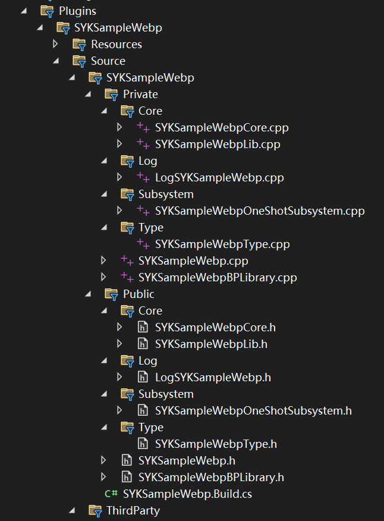
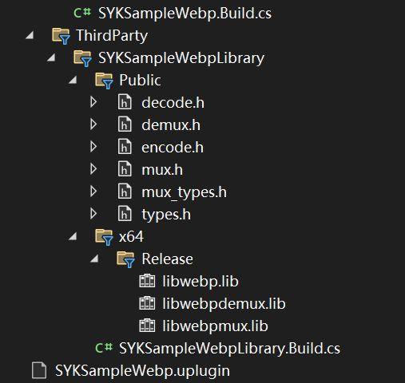
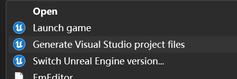

# LibWebP学习笔记

## 前言

LibWebP 是 Google 开发的一种用于编码和解码 WebP 图像格式的开源库。WebP 是一种现代的图像格式，它在压缩效率方面表现出色，能在保持图像质量的同时显著减小文件大小，这对于网页加载速度和移动应用的数据使用量有很大的优化作用。

本笔记会记录将LibWebP这一开源库作为虚幻引擎第三方库插件的过程中积累到的经验。

所以在此之前，你应该具备的“前置插件”是如何使用UEC++创建插件进而使用UEC++引入第三方库、知道dll文件和lib文件的作用、还有一些比较基础的`.Build.cs`文件的基本用法。

这部分知识是笔者跟随小刚老师（B站：虚幻小刚）学习的。

## 准备工作

成功引入第三方库之后呢，我们需要在第三方库插件所在目录中创建下图所示的文件架构（共两张图片，图片之间是连贯的，我有刻意流出一点它们共有的部分）。

创建的方式也很简单，就打开插件目录，新建文件夹、新建文件、重命名即可。新建完成后我们鼠标右键单击项目的`.uproject`文件，选择`Generate Visual Studio project files`之后重新打开项目的`sln`文件即可。

如果你是`Win11`操作系统，可能无法直接看到上图所示选项，在鼠标右键单击一次之后选择“显示更多选项”即可看到上图所示选项。

我们的功能代码主要分为三层：

- 第一层：`Core`文件夹下的`SYKSampleWebpLib`文件。这一层主要使用原生`C++`代码以及第三方库提供的接口，封装出我们需要的功能。
- 第二层：`Core`文件夹下的`SYKSampleWebpCore`文件。这一层是中间层，主要为了实现从`UEC++`数据类型到`C++`数据类型的转换，比如`FString--->char`，以此来达到接口对虚幻引擎的适配。除此之外还可以进一步完善功能，使该层的接口实现到可以直接调用就能出效果的程度，但是还没有暴露到蓝图中。
- 第三层：`Subsystem`文件夹下的`SYKSampleWebpSubsystem`文件或者是`SYKSampleWebpBPLibrary`文件。该层负责实现第二层接口暴露到蓝图中，完善与蓝图的交互工作，方便蓝图中对节点的调用，提高扩展性。 

## 单张WebP图片的生成

## 多张WebP图片的生成

## 由多张图片组成的动画展示在游戏场景中