# UBlueprintAsyncActionBase基本用法

[TOC]

## 前言

本文将为大家分享我在学习`UBlueprintAsyncActionBase`时积累到的知识，其中咱们重点说一下暴露到蓝图的那个静态工厂方法到底是怎么个事儿，为大家疏通以下整个流程。

完整代码在文章最后，感谢同志们的阅读，如文章内容有误，还望大神指点一二。

## 类介绍

好的同志们，我来为大家简单介绍一下这个`UBlueprintAsyncActionBase`类是干嘛的。该类是用于创建异步蓝图节点的基础类，常用于HTTP请求、文件操作和动画控制等方面的工作。我之前也讲到过一些基于多线程的异步操作（`Async`、`AsyncTask`），不过它们都是一纯代码的形式表现出来，我们要想暴露到蓝图供他人使用还需要做很多额外的封装操作，而且封装完毕之后还有可能降低使用的灵活性。

使用`UBlueprintAsyncActionBase`类可以轻松的实现在蓝图中调用代码里的异步操作，还可以通过委托获得回调的数据信息等。这一切都可以实现在一个蓝图节点上，可以说是很方便了。

下面我们说一说`UBlueprintAsyncActionBase`这个类具体怎么使用。

## 准备工作

在我们可以直接在虚幻编辑器创建一个`UBlueprintAsyncActionBase`类的C++派生类，如下图所示。

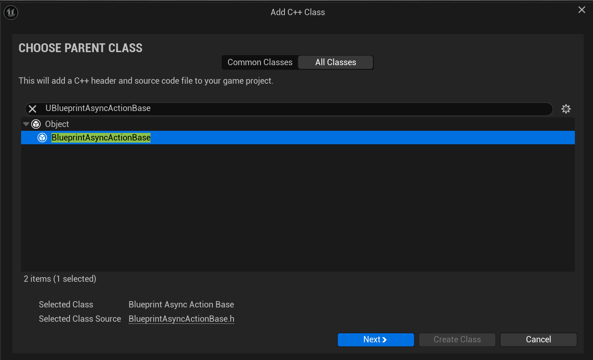

创建完毕之后的代码就是下面的样子。

### SYKAsyncAction.h

```C++
#pragma once

#include "CoreMinimal.h"
#include "Kismet/BlueprintAsyncActionBase.h"
#include "SYKAsyncAction.generated.h"

UCLASS() 
class SYKSAMPLEDEMO_API USYKAsyncAction : public UBlueprintAsyncActionBase
{
	GENERATED_BODY()

};

```

### SYKAsyncAction.cpp

```C++
#include "SYKAsyncAction.h"
//如果你把类放在了文件夹里，有可能是下面这样的
#include "xxx/SYKAsyncAction.h" //xxx是你的文件夹名
```

好的，现在我们需要做一些基础的准备工作。

### 添加代码

首先就是需要重写一下父类的`Activate()`函数。

```C++
//这是引擎UBlueprintAsyncActionBase类头文件中的代码
/** Called to trigger the action once the delegates have been bound */
/**一旦委托被绑定，就会调用以触发操*/
UFUNCTION(BlueprintCallable, meta=(BlueprintInternalUseOnly="true"))
ENGINE_API virtual void Activate();
```

在我们自己的类中添加以下代码即可。

```C++
virtual void Activate() override;
```

接下来我们需要写一个静态工厂函数，这个函数需要返回指向本类的指针，还有`UFUNCTION()`标记。在我们自己的类中添加以下代码。

```C++
UFUNCTION(BlueprintCallable , Category = "SYK")
static USYKAsyncAction* AsyncActionTest_01();
```

在此我需要提醒大家，这段代码并不是最终可以工作的版本。我们在后面的部分会详细解释在此基础上还需要添加的代码。

此外，我们需要在头文件中添加一个动态多播委托的定义，这是一个不带参数的委托，在后面还会添加带有参数的委托，它们在蓝图节点中的表现形式也是有一些区别的。

```C++
DECLARE_DYNAMIC_MULTICAST_DELEGATE(FSYKDelegate);
```

这样做的原因是如果以下把所有代码都呈现给大家，我认为阅读起来会很麻烦，抓不住重点，而且不便于对各个部分知识的掌握。

## 扩充并运行代码

下面我们扩充以下头文件的代码，不要担心，我会在代码展示之后位大家解释不容易理解的地方。

### SYKAsyncAction.h

```C++
//SYKAsyncAction.h
#pragma once

#include "CoreMinimal.h"
#include "Kismet/BlueprintAsyncActionBase.h"
#include "SYKAsyncAction.generated.h"

//动态多播委托无参数
DECLARE_DYNAMIC_MULTICAST_DELEGATE(FSYKDelegate);

UCLASS()
class SYKSAMPLEDEMO_API USYKAsyncAction : public UBlueprintAsyncActionBase
{
	GENERATED_BODY()

public:

	USYKAsyncAction();
	virtual ~USYKAsyncAction();

	//重写父类函数
	virtual void Activate() override;

public: 
	/**********第1个**********/
	UFUNCTION(
		BlueprintCallable,
		Category = "SYK",
        //这里我们添加了一个meta元数据，
        //标记为 BlueprintInternalUseOnly = "true" 的函数
        //在蓝图编辑器中不会出现在普通节点的搜索列表里
        //大家可以简单的理解为蓝图中搜不到这个函数了，但是这个说法在这里不完全正确
        //后面会为大家进行测试的，详见本文的常见问题一节
		meta = (BlueprintInternalUseOnly = true)
	)
	static USYKAsyncAction* AsyncActionTest_01();
protected:

	//不带参数的动态多播
	UPROPERTY(BlueprintAssignable)
	FSYKDelegate DelegateWithoutParams;
};

```

在对应的源文件中，我们添加了以下代码。

### SYKAsyncAction.cpp

```C++
//SYKAsyncAction.cpp
#include "SYKAsyncAction.h"

USYKAsyncAction::USYKAsyncAction()
{
}

USYKAsyncAction::~USYKAsyncAction()
{
}

void USYKAsyncAction::Activate()
{
	UE_LOG(LogTemp, Warning, TEXT("=====现在是Activate()函数====="));
    
    //异步执行
    AsyncTask(
	ENamedThreads::AnyThread , 
	[this]() {
         //模拟耗时任务
		FPlatformProcess::Sleep(1);
		//委托广播，异步任务执行完毕的回调
		DelegateWithoutParams.Broadcast();
	}
);
}

USYKAsyncAction* USYKAsyncAction::AsyncActionTest_01()
{
	UE_LOG(LogTemp, Warning, TEXT("=====现在是AsyncActionTest_01()函数====="));

	//创建本类的实例化对象并返回
	USYKAsyncAction* AsyncActionObject = NewObject<USYKAsyncAction>();
	return AsyncActionObject;
}
```

可以看到我们在`AsyncActionTest_01()`函数的定义中创建了本类的实例化对象并将其作为返回值返回。

现在运行代码，搜索该节点，如下图所示。

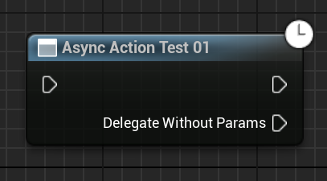

右边两个执行引脚从上到下依次是**then引脚**和**委托回调执行引脚**。

大家应该发现了，委托怎么跑到了节点引脚上？这就是我要说的一个重点。要实现这种节点需要满足以下几点条件：

1. 最基本的，继承`UBlueprintAsyncActionBase`类。
2. 函数必须为静态工厂函数，也就是说必须有`static`，返回值必须为本类的指针类型（即：`USYKAsyncAction*`)。
3. 必须有`UFUNCTION(BlueprintCallable)`标记，否则蓝图中根本搜不到，最好带有`Category`等方便查找。
4. 必须在类内部有相关委托的定义，比如`FSYKDelegate DelegateWithoutParams;`这种。
5. 委托必须被`UPROPERTY(BlueprintAssignable)`标记。

这些可以说是这个异步执行框架的规范写法，基于引擎的设计，我们需要这么写。

### 运行代码

下面我们运行代码，在虚幻编辑器创建新关卡，在关卡蓝图中测试一下，**大家一定要思考一下日志信息的输出顺序问题**。

下图展示的是关卡蓝图中的节点。

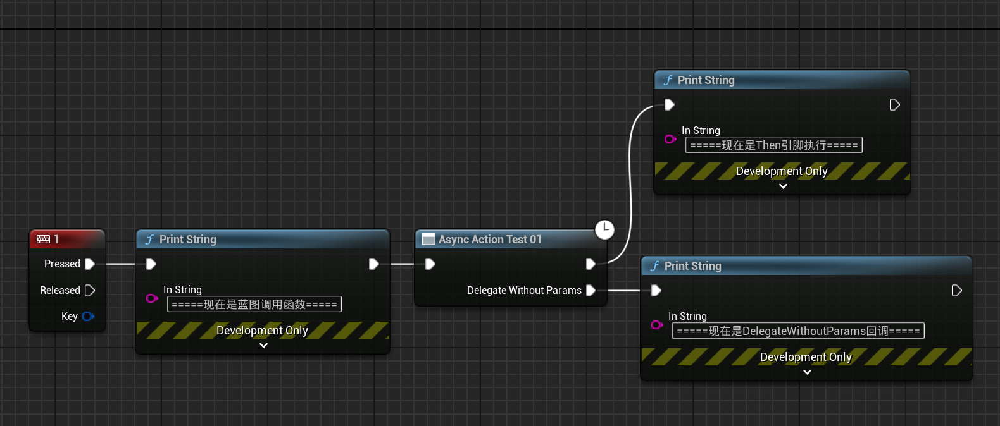

运行关卡，按下按键，可以看到日志中输出了下图所示信息。

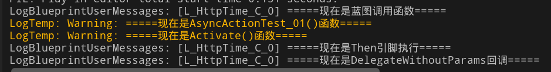

从这里日志的输出顺序我们可以很清楚的了解到整个异步流程是怎样运行的，可以看到在`AsyncActionTest_01()`函数执行之后`Activate()`函数便开始执行，也就是说异步操作从这里开始了，之后是**Then引脚**输出信息，因为我们异步中的耗时任务还没有做完，所以`DelegateWithoutParams`委托在**Then引脚**输出信息之后才会输出回调的信息。

综上我们可以简单总结一下整个流程：`蓝图触发事件--->执行AsyncActionTest_01()--->执行Activate()、异步任务工作开始--->执行Then引脚之后的节点--->异步任务工作完毕、执行DelegateWithoutParams.Broadcast()--->蓝图中DelegateWithoutParams引脚会在Broadcast()的时候开始执行`

梳理成顺序表的形式就是：

1. 蓝图触发事件。
2. 执行`AsyncActionTest_01()`。
3. 执行`Activate()`、异步任务工作开始。
4. 执行`Then`引脚之后的节点。
5. 异步任务工作完毕、执行`DelegateWithoutParams.Broadcast()`。
6. 蓝图中`DelegateWithoutParams`引脚会在`Broadcast()`的时候开始执行，或者说执行`Broadcast()`就是执行引脚后面的蓝图节点。

对于使用蓝图的开发人员而言，可以说整个异步操作都集中到了一个蓝图节点上（即：`AsyncActionTest_01()`）。我们只需要关心最后委托什么时候传递回来以及传递回来的数据是什么即可，提高开发效率。

### 委托传递数据

下面我们定义带一些参数的委托，大家稍后会看到暴露给蓝图中的静态工厂函数发生了变化，不再只有一个委托的执行引脚，还有其参数的输出引脚。

在类的头文件中添加如下代码

```C++
DECLARE_DYNAMIC_MULTICAST_DELEGATE_ThreeParams(FSYKMulticastDelegate, FGuid, AsyncID, bool, bResult, FString, Message);
```

这个动态多播委托有三个参数，分别是ID值、异步执行是否成功的布尔值、模拟异步执行返回的数据。

接下来，在类内部定义委托成员变量，并使用`UPROPERTY(BlueprintAssignable)`标记。

```C++
//带参数的动态多播
UPROPERTY(BlueprintAssignable)
FSYKMulticastDelegate DelegateWithParams;
```

仅需这两步操作，我们可以运行代码，在虚幻编辑器的蓝图中看到蓝图节点发生了哪些变化，如下图所示。

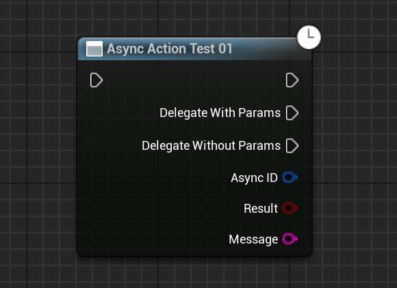

没错，我们甚至不需要修改这个函数的代码，仅仅在类中添加这么一个委托，即可实现这些输出引脚的扩展，这就是使用`UBlueprintAsyncActionBase`的方便点之一。

道理还是一样的，当我们代码中执行到了`DelegateWithoutParams.Broadcast()`，其蓝图对应的执行引脚就会触发。当然，`Broadcast(aaa , bbb , ccc)`中的参数也会随之从输出引脚中传递出来。

下面我们可以修改一下`Activate()`中的代码，实现这一过程。

```C++
void USYKAsyncAction::Activate()
{
	UE_LOG(LogTemp, Warning, TEXT("=====Activate()函数开始执行====="));
	AsyncTask(
		ENamedThreads::AnyThread , 
		[this]() {
			//模拟耗时任务
			UE_LOG(LogTemp, Warning, TEXT("=====正在执行耗时任务====="));
			FPlatformProcess::Sleep(1);

			UE_LOG(LogTemp, Warning, TEXT("=====耗时任务执行完毕，开始委托回调====="));
			UE_LOG(LogTemp, Warning, TEXT("=====现在是DelegateWithoutParams的回调====="));
			DelegateWithoutParams.Broadcast();//委托广播，异步任务执行完毕的回调

			UE_LOG(LogTemp, Warning, TEXT("=====现在是DelegateWithParams的回调====="));
			DelegateWithParams.Broadcast(FGuid::NewGuid(), true, TEXT("我是DelegateWithParams传递回来的信息"));//委托广播，异步任务执行完毕的回调
		}
	);

	UE_LOG(LogTemp, Warning, TEXT("=====Activate()函数结束执行====="));
}
```

在代码中我在许多处添加了日志输出，方便梳理执行流程，除此之外还有新添加的委托的广播，并且传递了一些数据到蓝图中（即：`DelegateWithParams.Broadcast()`中的参数）。

因为异步操作不涉及`Then`引脚的使用，所以我们可以将它隐藏掉，不再输出调试信息，隐藏`Then`引脚只需要将`UCLASS()`改为`UCLASS(meta = (HideThen = true))`

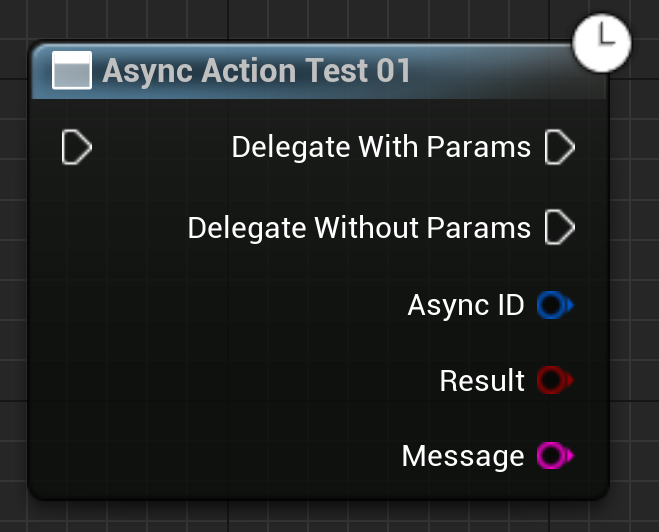

可以看到`Then`引脚消失了，在这里我们也不怎么需要它，所以不用了。

我们将委托传递来的数据合并为字符串，连到输出信息的节点上，如下图所示。

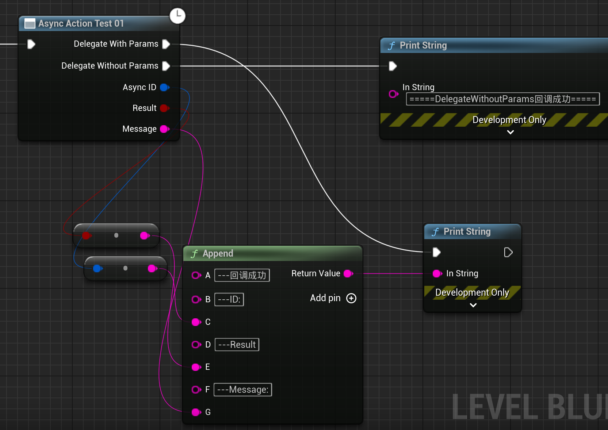

最终蓝图是下图所示，与之前变化不大，应该很好理解。

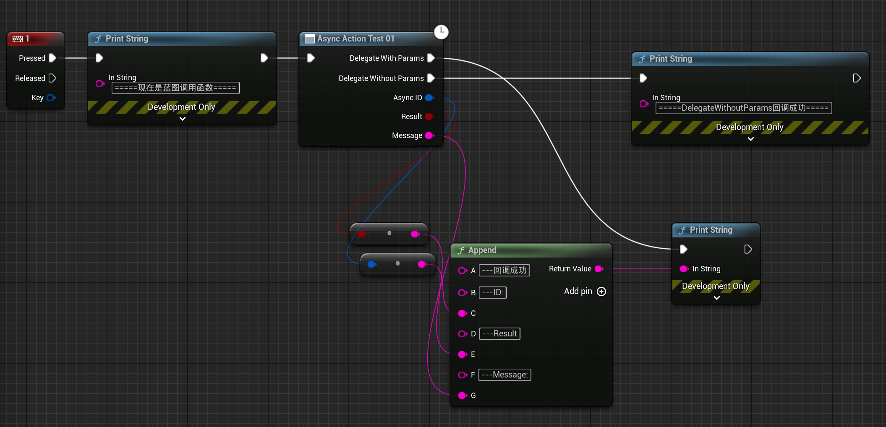

现在运行关卡，按下按键，观察日志输出的信息，如下图所示。

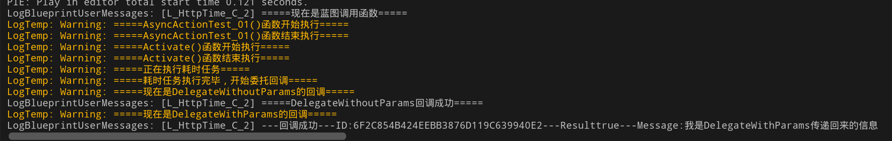

图片可能太小看不清，下面是日志的文本信息。

```
LogBlueprintUserMessages: [L_HttpTime_C_2] =====现在是蓝图调用函数=====
LogTemp: Warning: =====AsyncActionTest_01()函数开始执行=====
LogTemp: Warning: =====AsyncActionTest_01()函数结束执行=====
LogTemp: Warning: =====Activate()函数开始执行=====
LogTemp: Warning: =====Activate()函数结束执行=====
LogTemp: Warning: =====正在执行耗时任务=====
LogTemp: Warning: =====耗时任务执行完毕，开始委托回调=====
LogTemp: Warning: =====现在是DelegateWithoutParams的回调=====
LogBlueprintUserMessages: [L_HttpTime_C_2] =====DelegateWithoutParams回调成功=====
LogTemp: Warning: =====现在是DelegateWithParams的回调=====
LogBlueprintUserMessages: [L_HttpTime_C_2] ---回调成功---ID:6F2C854B424EEBB3876D119C639940E2---Resulttrue---Message:我是DelegateWithParams传递回来的信息
```

执行的顺序与之前无参委托的顺序基本无异，大家可以对比参考一下。

## 常见问题

### meta = (BlueprintInternalUseOnly = true)

关于这元数据的作用，网上一搜，大多就是什么限制蓝图直接调用、防止误用等。我来说一个最直观的体会，大家可以测试一下写与不写它在搜索节点时的差异。

当我们写上它的时候，即代码为：

```C++
UFUNCTION(
	BlueprintCallable,
	Category = "SYK",
	meta = (BlueprintInternalUseOnly = true)
)
static USYKAsyncAction* AsyncActionTest_01();
```

在蓝图中搜索这个函数，你会看到下图所示内容。

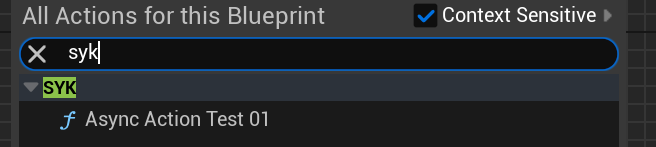

你只能看到这一个选项。

当我们不写它的时候，即代码为：

```C++
UFUNCTION(
	BlueprintCallable,
	Category = "SYK",
)
static USYKAsyncAction* AsyncActionTest_01();
```

在蓝图中搜索这个函数，你会看到下图所示内容。

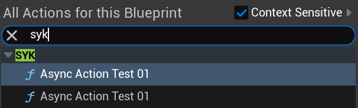

搜索框里出现了两个同名函数，分别调出来，可以看到下图所示内容。

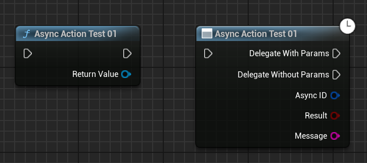

大家可以看到其中有一个是我们执行异步任务用的节点，而另外一个是“未经修改的”函数原本的模样。

怎么说它是“未经修改的”函数原本的模样？

其实前面讲了那么多，这样写那样写，可以这样用那样用，我们是否忘记了，这个函数其实只有一个返回值，参数列表甚至是空的，因此这就是这个函数原本该有的模样，只不过我们继承了`UBlueprintAsyncActionBase`类，它利用反射帮我们修改了这个节点，让它变得方便、好用。

所以使用`meta = (BlueprintInternalUseOnly = true)`带给我们的一个最直观的感受就是，隐藏了这个原本的节点，让我们只关注修改后的异步节点。毕竟它们名字相同，我在选择节点的时候还需要细看一下它们谁是谁，那就有些麻烦了。

### 怎样才能启动`Activate()`函数的执行

我对此进行了一些测试，得出的结论就是：要想执行`Activate()`函数，我们定义的静态工厂函数必须返回一个本类的实例化对象（通常就是在堆上`NewObject<type>()`），函数不能`return nullptr;`。哪怕你实例化了、甚至调用了`UBlueprintAsyncActionBase`类的`RegisterWithGameInstance()`函数，将对象注册到游戏实例中，只要返回值不是该对象，那么`Activate()`函数就不会执行。

下面是我实验时使用了两个测试函数，它们的函数声明与`AsyncActionTest_01()`相比没什么变化，就不再展示了。

```C++
USYKAsyncAction* USYKAsyncAction::AsyncActionTest_02()
{
	UE_LOG(LogTemp, Warning, TEXT("=====现在是AsyncActionTest_02()函数====="));

	return nullptr;
}

USYKAsyncAction* USYKAsyncAction::AsyncActionTest_03(UObject* WorldContextObject)
{
	UE_LOG(LogTemp, Warning, TEXT("=====现在是AsyncActionTest_03()函数====="));

	//创建本类的实例化对象并返回
	USYKAsyncAction* AsyncActionObject = NewObject<USYKAsyncAction>();
	AsyncActionObject->RegisterWithGameInstance(WorldContextObject);

	return nullptr;
}
```

运行代码，在虚幻编辑器中呼叫出节点。

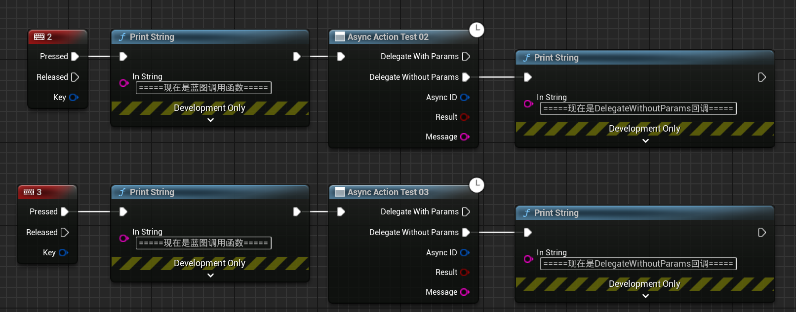

因为两个委托的回调都在`Activate()`里，我们连一个测试即可。只要日志信息中看到了委托回调的信息或者`Activate()`开始执行的信息，就证明`Activate()`函数确实执行了。反之，就是没有执行。

运行关卡，日志信息如下图所示。

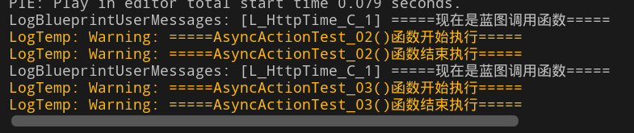

我先后出发了这两个事件，可以看到并没有`Activate()`开始执行的信息，因此返回值是不能为空的，我们需要像`AsyncActionTest_01()`那样返回本类的实例化对象。

## 扩展学习

下面是大佬**房燕良**对于这部分知识更深入的讲解和扩展，涉及到自定义蓝图节点、蓝图节点引脚的动态添加等，但是文章中有些部分需要一点虚幻的`slate`基础。我还没有吃透这些内容，但是我觉得它们很有价值，传送门留给大家啦。

[将异步操作封装为蓝图节点 - 知乎](https://zhuanlan.zhihu.com/p/107021667)

[通过派生class UK2Node创建自定义蓝图节点 - 知乎](https://zhuanlan.zhihu.com/p/84958215)

[实现蓝图节点的动态添加/删除Pin - 知乎](https://zhuanlan.zhihu.com/p/86231216)

## 完整代码

### SYKAsyncAction.h

```C++
#pragma once

#include "CoreMinimal.h"
#include "Kismet/BlueprintAsyncActionBase.h"
#include "SYKAsyncAction.generated.h"


//动态多播委托无参数
DECLARE_DYNAMIC_MULTICAST_DELEGATE(FSYKDelegate);

//动态多播委托有参数
DECLARE_DYNAMIC_MULTICAST_DELEGATE_ThreeParams(FSYKMulticastDelegate, FGuid, AsyncID, bool, bResult, FString, Message);


UCLASS(meta = (HideThen = true)) //then引脚隐藏
class SYKSAMPLEDEMO_API USYKAsyncAction : public UBlueprintAsyncActionBase
{
	GENERATED_BODY()

public:

	USYKAsyncAction();
	virtual ~USYKAsyncAction();

	//重写父类函数
	virtual void Activate() override;

public: //下面是测试各种情况的函数，它们的在本代码中的定位是相同的，都是用来给蓝图调用的静态工厂函数
	/*
	* 在UBlueprintAsyncActionBase派生类中的这种静态工厂函数必须return本类的实例化对象，不可以return nullptr;
	* 否则等静态工厂函数执行完毕后，不会执行Activate()函数，进而不会执行Activate()其中的异步操作
	* 因此像AsyncActionTest_01和AsyncActionTest_03这种返回nullptr的函数
	* 尽管你在函数体中创建了本类的实例化对象，甚至注册到了游戏实例中
	* 那也不好使，只要这里的返回值不正确，就不会触发Activate()
	*/

	/**********第1个**********/
	UFUNCTION(
		BlueprintCallable,
		Category = "SYK"
		//这里我们添加了一个meta元数据，
		//标记为 BlueprintInternalUseOnly = "true" 的函数
		//在蓝图编辑器中不会出现在普通节点的搜索列表里
		//meta = (BlueprintInternalUseOnly = true)
	)
	static USYKAsyncAction* AsyncActionTest_01();

	/**********第2个**********/
	UFUNCTION(
		BlueprintCallable,
		Category = "SYK",
		meta = (
			BlueprintInternalUseOnly = true
			)
	)
	static USYKAsyncAction* AsyncActionTest_02();

	/**********第3个**********/
	UFUNCTION(
		BlueprintCallable,
		Category = "SYK",
		meta = (
			BlueprintInternalUseOnly = true,
			WorldContext = "WorldContextObject"
			)
	)
	static USYKAsyncAction* AsyncActionTest_03(UObject* WorldContextObject);

protected:

	//带参数的动态多播
	UPROPERTY(BlueprintAssignable)
	FSYKMulticastDelegate DelegateWithParams;

	//不带参数的动态多播
	UPROPERTY(BlueprintAssignable)
	FSYKDelegate DelegateWithoutParams;
};

```

### SYKAsyncAction.cpp

```C++
#include "HttpTime/SYKAsyncAction.h"

USYKAsyncAction::USYKAsyncAction()
{
}

USYKAsyncAction::~USYKAsyncAction()
{
}

void USYKAsyncAction::Activate()
{
	UE_LOG(LogTemp, Warning, TEXT("=====Activate()函数开始执行====="));
	AsyncTask(
		ENamedThreads::AnyThread , 
		[this]() {
			//模拟耗时任务
			UE_LOG(LogTemp, Warning, TEXT("=====正在执行耗时任务====="));
			FPlatformProcess::Sleep(1);

			UE_LOG(LogTemp, Warning, TEXT("=====耗时任务执行完毕，开始委托回调====="));
			//委托广播，异步任务执行完毕的回调
			UE_LOG(LogTemp, Warning, TEXT("=====现在是DelegateWithoutParams的回调====="));
			DelegateWithoutParams.Broadcast();

			UE_LOG(LogTemp, Warning, TEXT("=====现在是DelegateWithParams的回调====="));
			DelegateWithParams.Broadcast(FGuid::NewGuid(), true, TEXT("我是DelegateWithParams传递回来的信息"));
		}
	);

	UE_LOG(LogTemp, Warning, TEXT("=====Activate()函数结束执行====="));
	SetReadyToDestroy();
}

USYKAsyncAction* USYKAsyncAction::AsyncActionTest_01()
{
	UE_LOG(LogTemp, Warning, TEXT("=====AsyncActionTest_01()函数开始执行====="));

	//创建本类的实例化对象并返回
	USYKAsyncAction* AsyncActionObject = NewObject<USYKAsyncAction>();

	UE_LOG(LogTemp, Warning, TEXT("=====AsyncActionTest_01()函数结束执行====="));
	return AsyncActionObject;
}

USYKAsyncAction* USYKAsyncAction::AsyncActionTest_02()
{
	UE_LOG(LogTemp, Warning, TEXT("=====AsyncActionTest_02()函数开始执行====="));
	UE_LOG(LogTemp, Warning, TEXT("=====AsyncActionTest_02()函数结束执行====="));
	return nullptr;
}

USYKAsyncAction* USYKAsyncAction::AsyncActionTest_03(UObject* WorldContextObject)
{
	UE_LOG(LogTemp, Warning, TEXT("=====AsyncActionTest_03()函数开始执行====="));

	//创建本类的实例化对象并返回
	USYKAsyncAction* AsyncActionObject = NewObject<USYKAsyncAction>();
	AsyncActionObject->RegisterWithGameInstance(WorldContextObject);

	UE_LOG(LogTemp, Warning, TEXT("=====AsyncActionTest_03()函数结束执行====="));
	return nullptr;
}

```

