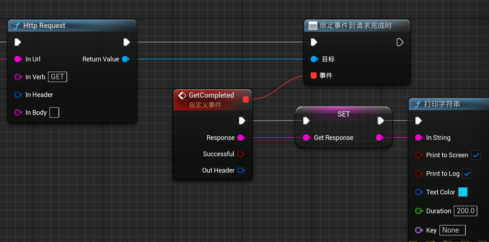
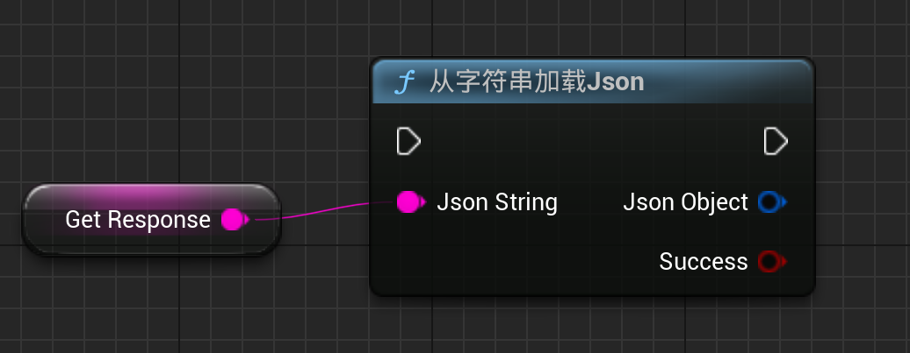
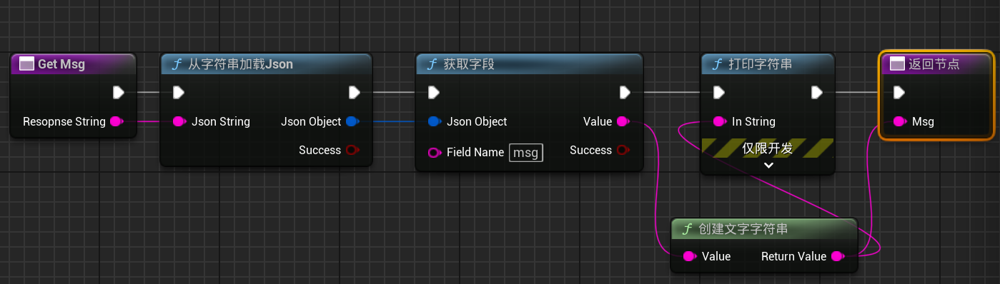
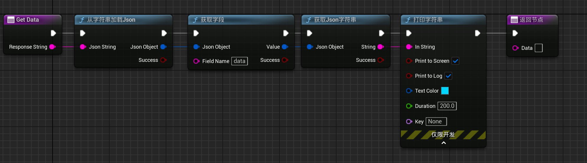
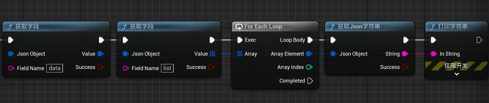
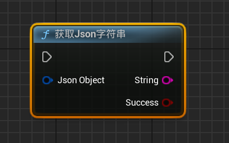
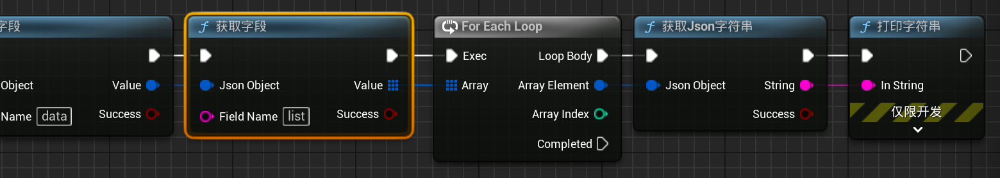

```json
{
    "code": 200,
    "msg": "操作成功！",
    "data": {
        "total": 11,
        "list": [
            {
                "id": "04f2b355cf",
                "name": "abcdefg",
                "sex": "男",
                "bumen": "技术部",
                "zhiwei": "后端开发",
                "states": "在职"
            },
            {
                "id": "3fc1159eb3",
                "name": "欧阳",
                "sex": "女",
                "bumen": "技术部",
                "zhiwei": "UI设计",
                "states": "在职"
            },
            {
                "id": "0f76d0eca9",
                "name": "麻花疼",
                "sex": "男",
                "bumen": "卫生部",
                "zhiwei": "卫生委员",
                "states": "在职"
            },
            {
                "id": "ea97a02e83",
                "name": "张三",
                "sex": "男",
                "bumen": "技术部",
                "zhiwei": "后端开发",
                "states": "在职"
            },
            {
                "id": "4bb07c0fb9",
                "name": "李四",
                "sex": "女",
                "bumen": "技术部",
                "zhiwei": "前端开发",
                "states": "在职"
            }
        ]  
    }
}
```

在网络请求中经常遇到上述`Json`格式的返回数据，下面介绍在蓝图中提取其中数据的方法，C++代码相关方法详见《Json文件读写》

首先请求返回的数据是`Response`字符串。



拿到这个`Response`字符串之后，第一步就是转换为`Json`对象，即`Json Object`。



在此之后才可以提取其中的字段。

**重点**

提取字段需要区分情况。

如果提取的是`msg`这种字段的信息，仅仅是一个字符串，那么使用下图所示节点即可。



如果提取的是`data`这种字段的信息，data里面是一个对象，包括`total`、`list`数组等，那么需要在**获取字段**节点后面添加**获取Json字符串**节点，之后才能输出出来信息，否则可能出现看不见信息的问题。



如果要提取`data`字段中的`list`字段，并获取其中数组，需要如下所示操作。



**小结**

如果提取的字段内容仅为字符串数据，则不需要使用**获取Json字符串**节点，如果字段内容包含**对象**数据，则需要使用**获取Json字符串**节点。



注意到`Json`数据中还有一个叫`list`的字段，其中的数据是一个数组，蓝图节点提取数组需要使用到`foreachloop`节点，如下图所示。



前面部分省略，可以看到中间有一个**获取字段**节点，首先获取到list字段的内容，之后必须连接到`For Each Loop`循环，这样才可以一个对象一个对象的取出其中的数据，那么对于其中的数据，都可以看作是一个个**对象**，因此我们需要使用获取对象字符串的节点**获取Json字符串**。

上面的一步步操作像是不断脱掉`Json`数据的**“括号外衣”**，最终拿到内部的数据。