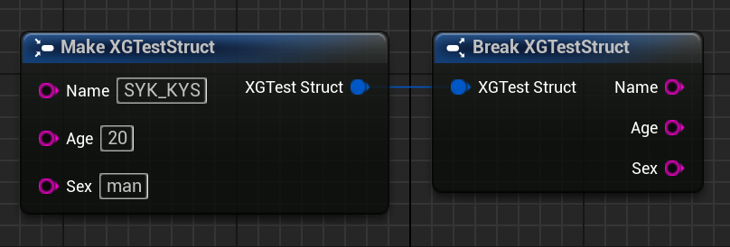
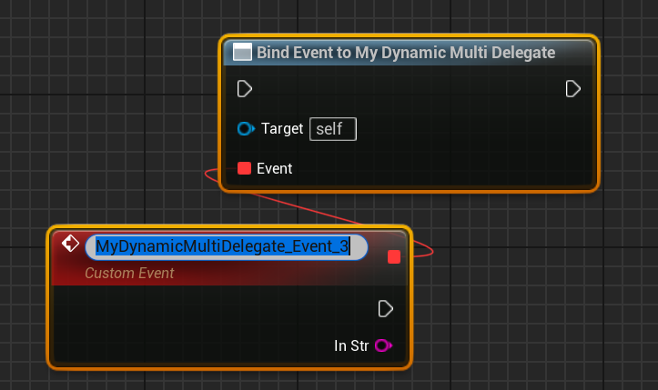
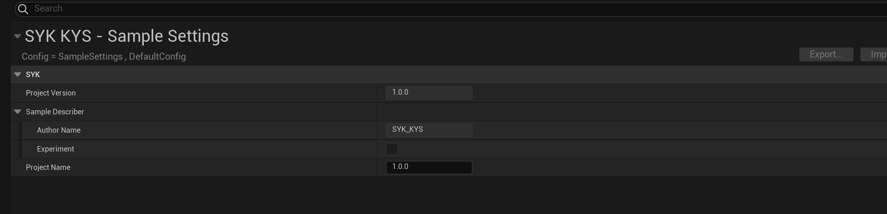

# UnrealEngineC++

​	前言：本笔记将记录我学习虚幻引擎C++过程中的重要内容。

## 这里放目录，写的差不多了，不写的时候再放，现在放目录的话，打字的时候太卡了。

------

## 虚幻引擎简单架构

1. Module（模块）：是最小的一组代码资源文件，它里面可能有很多代码、图片、资源，是虚幻引擎最小的编译单元。

2. Plugin（插件）：插件可以包含很多模块。（可以理解为多个模块功能集合在一起成为了插件）

3. Project（工程）：工程包含虚幻引擎中的Engine部分，它与独立程序的量级相差较多。

4. Program（独立程序）：独立程序不包含虚幻引擎中的Engine部分。

5. 工程和独立程序都可以包含很多模块和插件

6. 下面是项目插件和工程插件的调用关系图

   

   箭头表示调用和被调用的关系，比如引擎插件可以调用引擎模块。

### **项目目录架构**


​	这个项目目录就是我们启动引擎之后创建的项目的目录，可以在自己保存项目的文件夹里面找到。

### **引擎目录架构**


​	引擎目录就是我们的引擎下载保存的位置，下图展示我的引擎目录。


​	上图文件夹的路径就可以看出我的引擎目录位置。

​	**注意**：它并不是你项目保存的位置，而是下载引擎时引擎保存的位置，大概率是Epic保存库的位置。


## 虚幻项目构建相关内容介绍

### 1、ModuleDescriptor.h

​	这段代码定义了一个结构体 `FModuleDescriptor`，在虚幻引擎项目中，它主要用于描述一个可加载模块的各种属性和配置信息，起到对模块进行详细定义和管理的作用。

​	通过 `FModuleDescriptor` 结构体，虚幻引擎可以对每个模块的加载条件、构建条件等进行详细的配置和管理。例如，在项目启动时，引擎可以根据这些配置信息来决定是否加载某个模块，以及在何时加载，从而确保项目的正确构建和运行。

### 2、*.uproject

​	这种文件就是项目文件夹里的编辑器启动文件，如下图中最后一个文件。


​	在虚幻引擎项目里，`.uproject` 文件属于至关重要的配置文件，它以 JSON 格式记录了项目的各类关键信息，涵盖项目名称、版本、使用的引擎版本、启用的插件以及模块等内容。它在项目的构建、运行和管理过程中扮演着核心角色，引擎依据该文件的配置来加载和初始化项目。

**与 `ModuleDescriptor.h` 的关联**

​	`ModuleDescriptor.h` 文件里定义的 `FModuleDescriptor` 结构体以及相关枚举类型，和 `.uproject` 文件有着紧密的联系。`.uproject` 文件里的模块配置信息能够借助 `FModuleDescriptor` 结构体来表示与解析。

### 3、*.Build.cs

​	在虚幻引擎项目中，`.Build.cs` 文件是用于配置项目编译过程的 C# 脚本文件。每个模块都有对应的 `.Build.cs` 文件，它定义了模块的编译规则、依赖关系以及编译选项等信息。当你编译项目时，Unreal Build Tool（UBT）会读取这些 `.Build.cs` 文件，根据其中的配置来生成项目的编译脚本。

**与 `ModuleDescriptor.h` 的关联**

#### 1、模块定义和配置

​	`ModuleDescriptor.h` 中的 `FModuleDescriptor` 结构体描述了模块的各种属性，如模块名称、使用类型、加载阶段等。而 `.Build.cs` 文件则是在编译层面来定义和配置模块。两者都围绕着模块展开，只不过侧重点不同。 在 `.Build.cs` 文件中，你可以通过代码设置模块的名称、依赖的其他模块等信息，这些信息与 `FModuleDescriptor` 中的部分属性相互关联。例如：

```csharp
using UnrealBuildTool;

public class MyModule : ModuleRules
{
    public MyModule(ReadOnlyTargetRules Target) : base(Target)
    {
        // 模块名称，对应 FModuleDescriptor 中的 Name 属性
        PCHUsage = PCHUsageMode.UseExplicitOrSharedPCHs;
        PublicDependencyModuleNames.AddRange(new string[] { "Core", "CoreUObject" });
    }
}
```

这里的 `MyModule` 类对应一个模块，类名通常就是模块的名称，类似于 `FModuleDescriptor` 中的 `Name` 属性。

#### 2、依赖管理

​	`FModuleDescriptor` 结构体中有 `AdditionalDependencies` 成员，用于存储构建模块所需的额外依赖项列表。在 `.Build.cs` 文件中，通过 `PublicDependencyModuleNames` 和 `PrivateDependencyModuleNames` 来指定模块的公共和私有依赖模块。例如：

```csharp
PublicDependencyModuleNames.AddRange(new string[] { "Core", "CoreUObject", "Engine" });
PrivateDependencyModuleNames.AddRange(new string[] { "MyOtherModule" });
```

这些依赖信息会影响模块的编译过程，确保在编译当前模块时，其依赖的模块已经正确编译。这与 `FModuleDescriptor` 中对模块依赖的管理目的是一致的，都是为了保证模块能够正确构建。

#### 3、编译条件和目标平台

​	`FModuleDescriptor` 中有关于平台和目标类型的允许列表和禁止列表，用于控制模块在不同平台和目标类型下的加载和编译。在 `.Build.cs` 文件中，也可以通过代码来设置编译条件和支持的目标平台。例如：

```csharp
if (Target.Platform == UnrealTargetPlatform.Win64)
{
    // 针对 Windows 64 位平台的特定编译设置
}
```

这种根据平台进行条件编译的方式与 `FModuleDescriptor` 中对平台的控制是相互补充的，共同确保模块在不同平台和环境下都能正确编译和运行。

**总结**

​	`.Build.cs` 文件和 `ModuleDescriptor.h` 中的 `FModuleDescriptor` 结构体都是围绕着模块的管理和编译展开的。`.Build.cs` 文件侧重于编译过程的配置，而 `FModuleDescriptor` 更侧重于模块的描述和加载配置。两者相互配合，使得虚幻引擎项目能够在不同的平台和环境下正确构建和运行。

### 4、*.Target.cs

​	在虚幻引擎项目里，`.target.cs` 文件属于 C# 脚本文件，其主要功能是为特定目标（像游戏、编辑器、服务器等）配置编译和构建选项。每个项目一般会有多个 `.target.cs` 文件，分别对应不同的目标类型。Unreal Build Tool（UBT）在构建项目时，会读取这些文件来明确构建的目标以及对应的构建参数。

**与 `ModuleDescriptor.h` 的关联**

#### 1、目标与模块的对应关系

​	`ModuleDescriptor.h` 中的 `FModuleDescriptor` 结构体对可加载模块的各种属性进行了描述，而 `.target.cs` 文件则定义了构建目标。一个构建目标通常会包含多个模块，这些模块的配置信息可由 `FModuleDescriptor` 结构体表示。例如，在一个游戏目标中，可能会包含多个不同类型的模块，像运行时模块、编辑器模块等。

```csharp
using UnrealBuildTool;

public class MyGameTarget : TargetRules
{
    public MyGameTarget(TargetInfo Target) : base(Target)
    {
        Type = TargetType.Game;
        DefaultBuildSettings = BuildSettingsVersion.V2;
        ExtraModuleNames.Add("MyRuntimeModule");
        ExtraModuleNames.Add("MyEditorModule");
    }
}
```

​	上述代码中，`MyGameTarget` 是一个游戏目标，通过 `ExtraModuleNames` 添加了 `MyRuntimeModule` 和 `MyEditorModule` 两个模块。这些模块的详细信息可以通过 `FModuleDescriptor` 来进一步描述，如模块的加载阶段、使用类型等。

#### 2、构建条件与模块加载

​	`.target.cs` 文件可以依据不同的构建条件（例如目标平台、构建配置等）来设置构建选项。而 `FModuleDescriptor` 结构体包含了模块的加载条件，如允许和禁止的平台、目标类型、构建配置等。这两者在决定模块是否加载和构建时相互协作。

```csharp
if (Target.Platform == UnrealTargetPlatform.Win64)
{
    // 针对 Windows 64 位平台的特定构建设置
}
```

​	在 `FModuleDescriptor` 中，也有类似的平台和目标类型的控制：

```c++
if (IsCompiledInConfiguration(Platform, Configuration, TargetName, TargetType, bBuildDeveloperTools, bBuildRequiresCookedData))
{
    // 满足构建条件，加载模块
}
```

​	`.target.cs` 文件从构建层面进行条件设置，`FModuleDescriptor` 则从模块层面控制加载和构建，共同确保模块在合适的条件下被正确处理。

#### 3、**目标类型与模块类型的匹配**

​	`.target.cs` 文件中的 `TargetType` 枚举定义了构建目标的类型（如 `Game`、`Editor`、`Server` 等），而 `ModuleDescriptor.h` 中的 `EHostType` 枚举定义了模块的使用类型。两者需要相互匹配，以保证模块能在正确的目标中加载和运行。例如，一个 `Editor` 类型的模块通常只会在 `TargetType` 为 `Editor` 的目标中加载。

```csharp
public class MyEditorTarget : TargetRules
{
    public MyEditorTarget(TargetInfo Target) : base(Target)
    {
        Type = TargetType.Editor;
        // 添加编辑器模块
        ExtraModuleNames.Add("MyEditorModule");
    }
}
```

​	在 `FModuleDescriptor` 中，`MyEditorModule` 的 `Type` 属性可能会设置为 `EHostType::Editor`，以确保它只在编辑器目标中加载。

**总结**

​	`.target.cs` 文件和 `ModuleDescriptor.h` 中的 `FModuleDescriptor` 结构体在虚幻引擎项目的构建和模块管理中密切相关。`.target.cs` 文件负责定义构建目标和构建条件，而 `FModuleDescriptor` 结构体负责描述模块的详细属性和加载条件。两者相互配合，确保项目在不同的目标和条件下能够正确构建和运行。

### 5、UnrealBuildTool（UBT）

​	Unreal Build Tool（UBT）是虚幻引擎中用于构建项目的核心工具，它本质上是一个自动化构建系统。其主要职责是根据项目的配置信息，将源代码编译成可执行文件、动态链接库等可运行的二进制文件。UBT 能够处理复杂的项目结构和依赖关系，支持多种平台和目标类型的构建，大大简化了开发者在不同环境下构建项目的流程。

#### 1、与 `.Build.cs` 文件的关联

- **编译规则定义**：`.Build.cs` 文件是用于配置模块编译过程的 C# 脚本文件。每个模块都有对应的 `.Build.cs` 文件，其中定义了模块的编译规则、依赖关系以及编译选项等信息。UBT 会读取这些 `.Build.cs` 文件，根据其中的配置来生成项目的编译脚本。例如，`.Build.cs` 文件中指定的公共和私有依赖模块列表，会被 UBT 用于确定模块的编译顺序和依赖关系。
- **条件编译支持**：`.Build.cs` 文件中可以根据不同的构建条件（如目标平台、构建配置等）设置编译选项。UBT 会根据这些条件编译信息，在不同的环境下生成不同的编译脚本，确保模块能够在各种平台和配置下正确编译。

#### 2、与 `.target.cs` 文件的关联

- **目标类型确定**：`.target.cs` 文件用于为特定目标（如游戏、编辑器、服务器等）配置编译和构建选项。UBT 会读取 `.target.cs` 文件，确定当前构建的目标类型，并根据目标类型的配置信息进行相应的构建操作。例如，不同的目标类型可能需要不同的模块和编译设置，UBT 会根据 `.target.cs` 文件中的配置来满足这些需求。
- **构建参数设置**：`.target.cs` 文件中可以设置各种构建参数，如目标平台、构建配置、额外的编译选项等。UBT 会根据这些参数来调整构建过程，确保项目能够在指定的目标平台和配置下正确构建。

​	UBT主要读取.build.cs文件和.target.cs文件.前者定义了它链入哪些模块,访问路径是什么这些.后者决定了要打什么样的包出来（也就是最终游戏成品打包，还是开发者模式打包，还是测试打包等等）

**总结**

​	UBT 在虚幻引擎项目的构建过程中起着核心作用，它与 `ModuleDescriptor.h`、`.uproject`、`.Build.cs` 和 `.target.cs` 紧密协作。这些文件和头文件为 UBT 提供了项目的详细配置信息，而 UBT 则根据这些信息完成项目的编译和构建任务，确保项目能够在不同的平台和目标类型下正确运行。

### 6、UnrealHeaderTool（UHT）

​	Unreal Header Tool（UHT）是虚幻引擎中一个至关重要的工具，全称为虚幻头文件工具。它的主要任务是处理虚幻引擎 C++ 代码中的反射和元数据。在虚幻引擎里，反射机制允许程序在运行时获取类、属性、方法等类型信息，这对于实现蓝图交互、序列化、网络同步等功能非常关键。UHT 会扫描项目中的 C++ 头文件，解析其中的特殊宏和标记，生成额外的代码文件（通常以 `.generated.h` 结尾），这些文件包含了反射所需的元数据和函数。

#### 1、与 `ModuleDescriptor.h` 的关联

- **模块扫描范围确定**：`ModuleDescriptor.h` 中的 `FModuleDescriptor` 结构体描述了可加载模块的各种属性。UHT 在处理反射信息时，需要明确扫描哪些模块的头文件。通过 `FModuleDescriptor` 中记录的模块名称和相关配置信息，UHT 可以确定要处理的模块范围，避免对不必要的文件进行扫描，提高处理效率。
- **模块加载与反射处理顺序**：`FModuleDescriptor` 中定义的模块加载阶段等信息会影响 UHT 的工作流程。例如，某些模块可能需要在特定阶段加载，UHT 需要确保在这些模块加载后再处理其反射信息，以保证反射数据的完整性。

#### 2、与 `.uproject` 文件的关联

- **项目范围界定**：`.uproject` 文件是项目的核心配置文件，它定义了项目的基本信息和启用的插件、模块等。UHT 会根据 `.uproject` 文件来确定整个项目的范围，明确需要处理反射信息的所有模块和插件。例如，如果 `.uproject` 文件中启用了某个插件，UHT 会对该插件中的 C++ 头文件进行反射处理。
- **项目级配置影响**：`.uproject` 文件中可能包含一些与反射相关的项目级配置，这些配置会影响 UHT 的处理方式。比如，某些配置可能会控制 UHT 生成代码的优化级别或者是否启用某些特定的反射特性。

#### 3、与 `.Build.cs` 文件的关联

- **编译环境与反射处理**：`.Build.cs` 文件用于配置模块的编译过程，包括依赖关系、编译选项等。UHT 需要了解这些编译环境信息，因为不同的编译环境可能会影响反射信息的生成。例如，如果 `.Build.cs` 文件中指定了特定的预处理器定义，UHT 在处理反射时需要考虑这些定义，确保生成的反射代码与编译环境兼容。
- **模块依赖与反射顺序**：`.Build.cs` 文件中定义的模块依赖关系会影响 UHT 处理反射信息的顺序。UHT 需要先处理依赖模块的反射信息，再处理依赖于这些模块的其他模块的反射信息，以保证反射数据的正确性。

#### 4、与 `.target.cs` 文件的关联

- **目标平台和配置影响**：`.target.cs` 文件为特定目标（如游戏、编辑器、服务器等）配置编译和构建选项，包括目标平台、构建配置等。UHT 需要根据这些信息来生成适用于不同目标平台和配置的反射代码。例如，不同平台可能对代码的字节序、数据类型大小等有不同的要求，UHT 会根据 `.target.cs` 文件中的平台信息进行相应的调整。
- **目标类型与反射特性**：不同的目标类型（如游戏、编辑器）可能需要不同的反射特性。`.target.cs` 文件中定义的目标类型会影响 UHT 生成反射代码的方式。例如，编辑器目标可能需要更多的调试和编辑相关的反射信息，而游戏目标可能更注重性能和精简的反射数据。

**总结**

​	UHT 在虚幻引擎的反射机制中扮演着核心角色，它与 `ModuleDescriptor.h`、`.uproject`、`.Build.cs` 和`.target.cs` 紧密配合。这些文件和头文件为 UHT 提供了项目的整体结构、模块信息、编译环境和目标配置等关键信息，UHT 则根据这些信息生成准确的反射代码，确保虚幻引擎的反射机制能够正常工作，支持各种高级功能的实现。

### 7、UBT和UHT

#### UHT 和 UBT 的具体功能

**UHT（Unreal Header Tool）**

- **反射机制支持**：虚幻引擎的反射机制允许程序在运行时获取类、属性、方法等类型信息。UHT 通过扫描项目中的 C++ 头文件，解析其中的特殊宏（如`UCLASS`、`UPROPERTY`、`UFUNCTION`等）和标记，生成额外的代码文件（通常以`.generated.h`结尾），这些文件包含了反射所需的元数据和函数，为蓝图交互、序列化、网络同步等功能提供支持。
- **元数据处理**：除了反射信息，UHT 还会处理类、属性和方法的元数据，例如访问权限、显示名称、工具提示等。这些元数据可以用于编辑器界面的显示和配置。

**UBT（Unreal Build Tool）**

- **项目构建**：UBT 是一个自动化构建系统，它根据项目的配置信息，将源代码编译成可执行文件、动态链接库等可运行的二进制文件。它能够处理复杂的项目结构和依赖关系，支持多种平台和目标类型的构建。
- **依赖管理**：UBT 会读取项目中的配置文件（如`.uproject`、`.Build.cs`、`.target.cs`），确定项目的依赖关系，确保在构建当前项目之前，所有依赖项都已正确构建或安装。同时，它会根据依赖关系确定模块的编译顺序。

#### UHT 和 UBT 的协同工作流程

1. **UHT 预处理**

​	在项目编译之前，UBT 会调用 UHT 对项目中的 C++ 头文件进行预处理。UHT 会扫描所有相关的头文件，识别其中的反射标记和宏，生成对应的`.generated.h`文件。这些生成的文件包含了反射所需的代码和元数据，会被后续的编译过程使用。

2. **UBT 编译**

​	在 UHT 完成预处理后，UBT 开始进行实际的编译工作。它会根据`.Build.cs`文件中定义的编译规则、依赖关系以及`.target.cs`文件中指定的目标平台和构建配置，生成编译脚本。然后，使用编译器（如 Visual Studio 等）将源代码和 UHT 生成的文件一起编译成目标二进制文件。

## 构建配置

​	虚幻项目有多个由 `*.target.cs` 文件描述的目标（编辑器、客户端、游戏和服务器），其中每一个都可以使用不同配置来构建。在Visual Studio中，这表现为一个为每个目标安排不同配置的 `*.vcxproj`文件。解决方案配置的命名规则为 **[配置][目标类型]** （例如，"DevelopmentEditor"指代默认编辑器目标，而"Development"指代默认单机游戏目标）。你使用哪种配置将取决于想要创建的构建目的。

​	每种构建配置都包含两个关键词。第一个表示引擎状态和游戏项目。例如，如果使用 **调试（Debug）** 配置进行编译，构建过程会放弃优化，使调试过程更方便。要明确的是，如果配置以Visual Studio的格式构建，或者如果在虚幻编辑器中打开了 **项目设置（Project Settings）> 项目（Project）> 打包（Packaging）> 项目（Project）> 包括调试文件（Include Debug Files）** 选项，那么每个配置，甚至是发布构建都会生成用于调试的符号。这意味着你仍然可以调试开发和发布配置，只是它们可能不像调试配置那样容易。第二个关键词表示构建目标。例如，如果想要在虚幻中打开项目，需要使用 **编辑器（Editor）** 目标关键词进行构建。


## 创建新项目的初始工作

首先代开虚幻引擎，新建空白C++项目，关闭LiveCoding、HotReload（热重载）。如果需要的话，可以在偏好设置里面将窗口生成位置设置为主窗口，这样新窗口就不会单开了。


在下图所示`Build.cs`文件中添加代码。


比如这里我们`Source`文件夹下的模块名为`SYKSampleDemo`，在这个`Build.cs`文件中就添加如下代码

```cpp
PublicIncludePaths.AddRange(
    new string[] {
        "SYKSampleDemo" //模块名
    }
);
```

添加此代码之后，我们新建的UEC++类等代码中`#include`其它文件夹内的文件时，就不会出现`Cannot Open Source File…`的提示以及编译不通过了。

## 代码的创建和编写

### 如何创建UEC++头文件、源文件

头文件、源文件（即`*.h`和`*.cpp`文件）

**三种方法。**

1. 第一种：

   ​	在虚幻编辑器的菜单栏中找到新建C++类的选项，如下图所示。

   

   ​	选定创建的类存放的位置,比如你想放在那个模块,那个路径下。

   ​	通常我们创建在项目里面的代码文件不需要把头文件和源文件分开放,而创建到插件中的代码文件需要。

   ​	为了避免#include”../../../../***.h”这种极其难看且冗余的包含路径,我们可以在build.cs里面进行配置包含路径来避免这个问题!此处详见上一节内容。

2. 第二种：

   ​	直接在硬盘的文件夹里面创建文本文件，之后通过更改扩展名的方式修改文件扩展名为h或cpp即可，注意这种方式创建文件之后需要使用`.uproject`文件重新生成一下VS里面的项目文件，即下图第三个选项`Generate Visual Studio project files`

   

3. 第三种：

   ​	在VS中新建文件，选择我们想要新建文件的位置，鼠标右键单击下图所示选项。

   

   ​	之后根据提示选择新建的类名等选项即可。

   ​	如果你创建错位置了。直接去删掉资源管理器中的文件然后刷新项目即可,不要在VS中删除，即：不要在上图所示页面删除或移动文件的位置，这里移动的位置在资源管理器中并不生效，只是单纯的有这么个效果，因此我们需要直接去资源管理器中最直观的删除或移动文件，之后使用`.uproject`生成一下，刷新我们的项目即可。

**头文件**

​	注意看下图这个导出宏(模块名+”_API”,全大写),当我们写的代码需要跨模块使用的时候一定要记得导出宏.否则你没办法在别的模块通过C++代码调用该类或该类的方法.还有UCLASS里面的元数据MinimalAPI也经常干坏事,你需要知道!


**源文件**


​	在此之后我们直接右键build编译项目是不会有任何问题的，记得关闭编辑器（就是虚幻写蓝图的那个编辑器，不是VS）再编译。

### 介绍C++类

传统的C++类中的类,结构体,枚举,接口我们略过.

我们可以使用原生的C++类实现功能,这点毫无疑问.但是一旦涉及到了引擎功能,我们必须使用虚幻引擎的宏进行标记改造,方可支持被引擎感知使用.

**注意:一旦该头文件包含了以下反射宏信息,其头文件必须在文件首部`include`的最后一行,写入`[#include "文件名.generated.h"]`,该文件是虚幻UBT帮我们生成的反射文件.有很多很重要的内容.同时如果需要包含带反射的结构体,请不要前向声明,直接包含该结构体的头文件即可.**

**常见的宏如下:**

`UCLASS()`:标记类反射到引擎,与 `GENERATED_BODY()`连用,任何时候都不应当使用`GENERATED_UCLASS_BODY()`.后者已经过时,且必须在源文件中定义一个带参的此类的构造函数,且该宏后续权限声明为public.

`UENUM()`:标记枚举反射到引擎,可与`UMETA()`连用,增加更多元数据定义

`USTRUCT()`:标记结构体反射到引擎,与`GENERATED_BODY()`,也可以使用`GENERATED_USTRUCT_BODY()`.

`UINTERFACE()`:标记接口反射到引擎,与`GENERATED_UINTERFACE_BODY()`连用,需要同时声明一个U类和一个I类,其中接口写在I类.

`UPROPERTY()`:标记变量反射到引擎,可以在类和结构体体中使用.

`UPARAM()`:用于C++函数中的入参变量暴露给蓝图.

查看此图:


​	在我们工程中有很多类,他们实现了很多功能,具有若干属性和方法.`C++`和`class`和`struct`没什么不同,除了默认的权限不一样外.

​	而在UE中,我们**主要使用U类去实现功能逻辑,而F类的结构体常用于属性组织和操作数据结构**.

​	同时**F类的结构体不能使用`UFUNCTION`将方法暴露给蓝图,如果需要蓝图中调用结构体的方法需要进行特殊操作**.

**此处贴出参考的官方文档:**

[Programming with CPP in Unreal Engine | 虚幻引擎 5.4 文档 | Epic Developer Community (epicgames.com)](https://dev.epicgames.com/documentation/zh-cn/unreal-engine/programming-with-cpp-in-unreal-engine)

## UObject

## UClass

​	在虚幻引擎（Unreal Engine）中，`UClass` 是一个核心且关键的类，它构成了虚幻引擎反射系统的基石，在整个引擎的运行机制中发挥着举足轻重的作用。

### 基本概念

​	`UClass` 是虚幻引擎中用于表示类的元数据的类。它存储了关于某个类的详细信息，包括类的名称、父类、属性、方法、事件等，这些信息在编译时被收集并存储在 `UClass` 对象中，使得引擎能够在运行时动态地获取和操作这些类的相关信息，从而实现反射、序列化、蓝图交互等强大功能。

### 关键属性和方法

#### 1. 常用属性

- `ClassName`：存储类的名称，通过该属性可以获取类的字符串名称。
- `SuperClass`：指向该类的父类的 `UClass` 指针，通过它可以了解类的继承关系。

#### 2. 常用方法

- `StaticClass()`：这是所有继承自 `UObject` 的类都有的静态方法，用于获取该类的 `UClass` 对象指针。例如：

```cpp
UClass* ActorClass = AActor::StaticClass();
```

- `GetDefaultObject()`：返回该类的默认对象，默认对象包含了类的默认属性值。通过修改默认对象的属性，可以影响该类所有实例的初始属性值。

```cpp
AActor* DefaultActor = Cast<AActor>(ActorClass->GetDefaultObject());
```

- `IsChildOf()`：用于检查一个类是否是另一个类的子类。例如：

```cpp
bool bIsChild = MyClass->IsChildOf(AActor::StaticClass());
```

### 使用场景

#### 1. 动态对象创建

在游戏运行时，根据不同的条件动态创建不同类型的对象。例如，根据玩家的选择创建不同类型的角色：

```cpp
UClass* CharacterClass = ...; // 根据玩家选择获取相应的 UClass
if (CharacterClass)
{
    ACharacter* NewCharacter = GetWorld()->SpawnActor<ACharacter>(CharacterClass);
    //或者写为SomeActor,SomeActor可以是某个继承自AActor的类
    ACharacter* NewCharacter = GetWorld()->SpawnActor<ACharacter>(SomeActor::StaticClass());
}


```

#### 2. 类型检查和转换

在处理对象时，需要检查对象的类型并进行相应的转换。例如，在碰撞检测中，检查碰撞到的对象是否是特定类型的 `Actor`：

```cpp
AActor* HitActor = ...; // 碰撞到的 Actor
if (HitActor->IsA(APlayerCharacter::StaticClass()))
{
    APlayerCharacter* Player = Cast<APlayerCharacter>(HitActor);
    if (Player)
    {
        // 处理玩家对象
    }
}
```

## 类的默认对象（CDO）

​	CDO：Class Default Object

​	在虚幻引擎中，一个类的默认对象（Class Default Object，CDO）**只有一个**。

​	CDO 是类的一个特殊实例，它代表了该类的默认状态。在虚幻引擎加载类时，会自动为每个类创建唯一的 CDO，这个 CDO 包含了该类所有属性的默认值以及默认的行为。之所以只有一个 CDO，是为了保证类的默认设置的一致性和规范性。所有通过该类新创建的对象都会继承 CDO 的属性值，除非在创建对象时或之后对这些属性进行了单独设置。

​	如果使用**类的默认对象（CDO）指针**修改了其自身的属性，会对后续通过该类创建的对象产生影响，但不会影响已经创建的对象。

### 对后续创建对象的影响

​	当你使用 CDO 指针修改其属性时，后续通过该类创建的所有对象都会继承修改后的属性值，除非在创建对象时或之后对这些属性进行了单独设置。这是因为新创建的对象会以 CDO 为模板，继承其属性的默认值。

示例代码：

```cpp
UCLASS()
class AMyActor : public AActor
{
    GENERATED_BODY()

public:
    UPROPERTY(EditAnywhere, BlueprintReadWrite, Category = "Attributes")
    float Health;

    AMyActor()
    {
        Health = 100.0f; // 默认生命值为 100
    }
};

// 获取默认对象指针
UClass* MyClass = AMyActor::StaticClass();
UObject* MyObject = MyClass->GetDefaultObject();
AMyActor* MyCDO = Cast<AMyActor>(MyObject);

if (MyCDO)
{
    // 修改默认属性
    MyCDO->Health = 200.0f;
}

// 创建新的 AMyActor 实例
AMyActor* NewActor = GetWorld()->SpawnActor<AMyActor>();
if (NewActor)
{
    // 新创建的对象继承了修改后的默认属性值
    UE_LOG(LogTemp, Warning, TEXT("New Actor Health: %f"), NewActor->Health); // 输出200.0f
}
```

​	在上述代码中，首先获取 `AMyActor` 类的 CDO 指针 `MyCDO`，然后将 `Health` 属性修改为 200.0f。之后创建的 `NewActor` 实例继承了修改后的 `Health` 属性值，输出为 200.0f。

### 对蓝图实例的影响

对于蓝图类，修改 CDO 属性同样会影响后续创建的蓝图实例，但不会影响已经创建的实例。在蓝图编辑器中，蓝图类也有自己的 CDO，对其属性的修改会应用到后续从该蓝图类派生的实例中。

### 用于获取CDO的函数

​	一般情况下我们想要获取某一个类的CDO时不会使用前面所使用的方法，即下面所示的代码：

```cpp
// 获取默认对象指针
UClass* MyClass = AMyActor::StaticClass();
UObject* MyObject = MyClass->GetDefaultObject();
AMyActor* MyCDO = Cast<AMyActor>(MyObject);
```

​	我们常用的获取类CDO的形式是使用下面两个函数

```cpp
/********************UObjectGlobals.h********************/
/** 
 * Get default object of a class.
 * @see UClass::GetDefaultObject()
 */
template< class T > 
inline const T* GetDefault()
{
	return (const T*)T::StaticClass()->GetDefaultObject();
}

/**
 * Get default object of a class.
 * @see Class.h
 */
template< class T > 
inline const T* GetDefault(UClass *Class); //GetDefault重载版本的声明

/** Version of GetDefault() that allows modification */
template< class T >
inline T* GetMutableDefault()
{
	return (T*)T::StaticClass()->GetDefaultObject();
}

/** Version of GetDefault() that allows modification */
template< class T > 
inline T* GetMutableDefault(UClass *Class);  //GetMutableDefault重载版本的声明

/********************Class.h********************/

/**
 * Gets the default object of a class.
 *
 * In most cases, class default objects should not be modified. This method therefore returns
 * an immutable pointer. If you need to modify the default object, use GetMutableDefault instead.
 *
 * @param Class - The class to get the CDO for.
 *
 * @return Class default object (CDO).
 *
 * @see GetMutableDefault
 */
template< class T > 
inline const T* GetDefault(UClass *Class) //GetDefault重载版本的定义
{
	check(Class->GetDefaultObject()->IsA(T::StaticClass()));
	return (const T*)Class->GetDefaultObject();
}

/**
 * Gets the mutable default object of a class.
 *
 * @param Class - The class to get the CDO for.
 *
 * @return Class default object (CDO).
 *
 * @see GetDefault
 */
template< class T > 
inline T* GetMutableDefault(UClass *Class) //GetMutableDefault重载版本的定义
{
	check(Class->GetDefaultObject()->IsA(T::StaticClass()));
	return (T*)Class->GetDefaultObject();
}
```

​	其实我们可以看出来虽然看上去我们使用了不同方式来获取类的CDO，但是实际上我们使用的这些函数内部的工作仍然是老套路`(T*)T::StaticClass()->GetDefaultObject()`

#### 使用场景

- **`GetDefault`**：适用于只需要读取默认对象信息，不涉及修改操作的场景。比如在进行配置信息的显示、数据验证等操作时，使用 `GetDefault` 可以确保数据的安全性和一致性。
- **`GetDefault`**：返回的是 `const` 类型的指针，这意味着通过该指针不能修改默认对象的属性。它主要用于只读访问，保证在获取默认对象信息时不会意外修改其状态。例如，当你只是想查看某个类的默认配置信息，而不打算对其进行更改时，就可以使用 `GetDefault`。
- **`GetMutableDefault`**：适用于需要修改默认对象属性的场景，如在游戏初始化阶段根据用户的设置修改默认的游戏难度、音效音量等配置信息，或者在调试过程中临时调整某些类的默认行为。
- **`GetMutableDefault`**：返回的是可变指针，允许对默认对象的属性进行修改。这在需要动态调整类的默认配置时非常有用，比如在游戏启动时根据用户的设置来修改某些类的默认属性值。
- 两种函数的重载版本都接受一个UClass参数，注意观察。

### 注意事项

- **谨慎修改 CDO 属性**：由于修改 CDO 属性会影响后续创建的所有对象，因此在修改时要谨慎，确保不会对游戏逻辑产生意外影响。
- **性能考虑**：频繁修改 CDO 属性可能会导致一些性能开销，特别是在大量对象创建的情况下，因为每个新对象都需要从 CDO 复制属性值。

## UCLASS()宏

**类说明符**和**元数据说明符**官方文档网址：

https://dev.epicgames.com/documentation/zh-cn/unreal-engine/class-specifiers

​	在 Unreal Engine（UE）里，`UCLASS()` 宏是一个极为关键的工具，主要用于标记 C++ 类，让这些类能与 UE 的反射系统、蓝图系统等实现交互。

### UCLASS()基本用法

​	在 UE 的 C++ 开发中，若要让一个类具备 UE 特有的功能，就需要用 `UCLASS()` 宏对其进行标记。

```cpp
#pragma once
#include 'Object.h'
#include 'MyObject.generated.h'

UCLASS()
class MYPROJECT_API UMyObject : public UObject
{
	GENERATED_BODY()

};
```

​	上面是最原始的写法，该类继承自UObject，我们通常使用下面的代码，让我们的类继承自AActor。

```cpp
#include "CoreMinimal.h"
#include "GameFramework/Actor.h"
#include "MyActor.generated.h"

UCLASS()
class MYPROJECT_API AMyActor : public AActor
{
    GENERATED_BODY()

public:
    // 类的成员函数和成员变量
};
```

​	在上述代码中，`UCLASS()` 宏被放置在类声明之前，以此表明 `AMyActor` 类是一个 UE 认可的类。`GENERATED_BODY()` 宏则是用来自动生成与反射系统相关的代码。

### 常用标识符示例解析

​	`UCLASS()` 宏能够接收多个参数，这些参数可对类的行为和属性进行控制。

#### `Blueprintable`

​	该类可以在蓝图中被继承。这意味着设计师能够基于这个 C++ 类创建蓝图子类，并且在蓝图中对类的功能进行扩展和定制。

```cpp
UCLASS(Blueprintable)
class MYPROJECT_API AMyBlueprintableActor : public AActor
{
    GENERATED_BODY()
};
```

#### `Abstract`

​	将类标记为抽象类。抽象类不能直接实例化，只能作为基类被其他类继承。通常用于定义一些通用的接口或功能框架，由子类来具体实现。

```cpp
UCLASS(Abstract)
class MYPROJECT_API AMyAbstractActor : public AActor
{
    GENERATED_BODY()
};
```

#### `Config`

##### 作用

`Config` 标识符的核心作用是让类的属性能够被保存到配置文件中，并且在游戏启动或者需要的时候从配置文件中读取。这样一来，开发者可以通过修改配置文件来调整游戏的各种参数，而无需重新编译代码，提高了游戏的可配置性和灵活性。

##### 使用方式

在 `UCLASS` 宏中使用 `Config` 标识符，后面跟上配置文件的名称。配置文件通常是 `.ini` 格式，虚幻引擎会根据这个名称来查找或创建对应的配置文件。

##### 使用场景

- **游戏参数调整**：像游戏的难度级别、音效音量、画面质量设置等参数，都可以使用 `Config` 标识符保存到配置文件中，方便玩家或者开发者进行调整。
- **全局设置管理**：对于一些全局的游戏设置，如网络连接参数、默认的控制键位等，使用 `Config` 标识符可以集中管理这些设置，便于维护和修改。

##### 使用示例

**定义一个使用 `Config` 标识符的类**

```cpp
#include "CoreMinimal.h"
#include "UObject/ObjectMacros.h"
#include "UObject/Object.h"
#include "MyConfigurableClass.generated.h"

UCLASS(Config = Game)
class UMyConfigurableClass : public UObject
{
    GENERATED_BODY()

public:
    // 使用 EditAnywhere 允许在编辑器中修改，Config 表示该属性会保存到配置文件中
    UPROPERTY(EditAnywhere, Config)
    int32 GameDifficulty;

    UPROPERTY(EditAnywhere, Config)
    float SoundVolume;
};
```

​	在这个示例中，`UCLASS(Config = Game)` 表明这个类的配置信息会保存到 `Game.ini` 配置文件中。`GameDifficulty` 和 `SoundVolume` 属性使用了 `Config` 元数据，这意味着它们的值会被保存到配置文件中，并且可以在游戏启动时从配置文件中读取。

**读取和保存配置**

```cpp
#include "MyConfigurableClass.h"
#include "Engine/World.h"

void SaveAndLoadConfigExample()
{
    // 创建类的实例
    UMyConfigurableClass* ConfigInstance = NewObject<UMyConfigurableClass>();

    // 设置属性值
    ConfigInstance->GameDifficulty = 2;
    ConfigInstance->SoundVolume = 0.8f;

    // 保存配置到文件
    ConfigInstance->SaveConfig();

    // 从文件中加载配置
    ConfigInstance->LoadConfig();

    // 输出加载后的属性值
    UE_LOG(LogTemp, Warning, TEXT("Game Difficulty: %d"), ConfigInstance->GameDifficulty);
    UE_LOG(LogTemp, Warning, TEXT("Sound Volume: %f"), ConfigInstance->SoundVolume);
}
```

在上述代码中，首先创建了 `UMyConfigurableClass` 的实例，然后设置了属性值，接着调用 `SaveConfig` 方法将属性值保存到 `Game.ini` 文件中，再调用 `LoadConfig` 方法从文件中加载配置，最后输出加载后的属性值，以验证配置的读取是否正确。

##### 注意事项

- **配置文件路径**：虚幻引擎会根据项目的配置和平台的不同，将配置文件保存到不同的路径下。一般来说，配置文件会保存在项目的 `Saved/Config` 目录下。
- **数据类型支持**：`Config` 标识符支持大多数基本数据类型，如整数、浮点数、布尔值、字符串等。对于自定义的结构体或类，需要确保其成员变量也支持配置保存和加载。
- **配置文件冲突**：如果多个类使用相同的配置文件名，可能会导致配置文件中的数据冲突。因此，在使用 `Config` 标识符时，需要合理规划配置文件名，避免冲突。

#### `DefaultConfig`

​	`DefaultConfig` 标识符的主要作用是**指定类的默认配置文件**。当游戏启动时，虚幻引擎会从这个默认配置文件中读取类的属性默认值。如果玩家或开发者没有对这些属性进行修改，那么这些默认值将被使用。

​	在 `UCLASS` 宏中使用 `DefaultConfig` 标识符，通常与 `Config` 标识符一起使用。`Config` 用于指定类的配置文件，而 `DefaultConfig` 用于指定默认配置文件。**默认配置文件通常位于项目的 `Config` 目录下，而普通配置文件则位于 `Saved/Config` 目录下**。


​	默认配置文件会存放在`Config`文件夹下，而普通配置文件则会存放在`Saved/Config`文件夹下，这里没有展示出来`Saved`下的那个`Config`文件夹，但是里面确实是有的，如果没有那就说明还没有使用到这方面的功能，引擎还没有为我们创建该文件夹。

##### 与 `Config` 标识符的关系

- `Config` 标识符用于指定类的属性会保存到哪个配置文件中，并且在游戏运行过程中可以动态修改和保存。
- `DefaultConfig` 标识符用于指定类的默认配置文件，这个文件中的配置值在游戏启动时被加载，作为属性的初始值。如果 `Saved/Config` 目录下的配置文件中没有对某个属性进行修改，那么将使用默认配置文件中的值。

​	也就是说引擎应该是有一个比较这两个配置文件是否相同的过程，正常情况下如果游戏刚下载好什么都没动，游戏启动时会使用`Config` 文件夹下的**默认配置文件**，那么玩家游玩之后呢，可能会有一些配置信息被修改，这时修改的配置文件信息就会保存到`Saved/Config`文件夹下的**普通配置文件**中。当我们关闭游戏，之后再次打开游戏时，由于我们上一次进行游戏时有修改过配置信息并保存到了`Saved/Config`文件夹下的**普通配置文件**中，所以这一次打开游戏读取的配置信息就是**普通配置文件**中的信息了。那么如果最开始我们打开游戏后没有做出什么修改操作，配置信息没有变化，再次打开游戏时，就仍然会读取**默认配置文件**中的配置信息了。

##### 示例代码

```cpp
// MyConfigurableClass.h
#pragma once

#include "CoreMinimal.h"
#include "UObject/ObjectMacros.h"
#include "UObject/Object.h"
#include "MyConfigurableClass.generated.h"

UCLASS(Config = Game, DefaultConfig)
class UMyConfigurableClass : public UObject
{
    GENERATED_BODY()

public:
    // 使用 EditAnywhere 允许在编辑器中修改，Config 表示该属性会保存到配置文件中
    UPROPERTY(EditAnywhere, Config)
    int32 GameDifficulty;

    UPROPERTY(EditAnywhere, Config)
    float SoundVolume;
};
```

```cpp
// MyConfigurableClass.cpp
#include "MyConfigurableClass.h"
#include "Engine/World.h"

void SaveAndLoadConfigExample()
{
    // 创建类的实例
    UMyConfigurableClass* ConfigInstance = NewObject<UMyConfigurableClass>();

    // 从默认配置文件加载配置
    ConfigInstance->LoadConfig();

    // 输出加载后的属性值
    UE_LOG(LogTemp, Warning, TEXT("Default Game Difficulty: %d"), ConfigInstance->GameDifficulty);
    UE_LOG(LogTemp, Warning, TEXT("Default Sound Volume: %f"), ConfigInstance->SoundVolume);

    // 修改属性值
    ConfigInstance->GameDifficulty = 3;
    ConfigInstance->SoundVolume = 0.9f;

    // 保存配置到普通配置文件
    ConfigInstance->SaveConfig();

    // 再次加载配置，这次会从 Saved/Config 目录下的文件加载
    ConfigInstance->LoadConfig();

    // 输出修改后的属性值
    UE_LOG(LogTemp, Warning, TEXT("Modified Game Difficulty: %d"), ConfigInstance->GameDifficulty);
    UE_LOG(LogTemp, Warning, TEXT("Modified Sound Volume: %f"), ConfigInstance->SoundVolume);
}
```

##### 实际应用场景

- **游戏初始设置**：开发者可以在默认配置文件中设置游戏的初始难度、音效音量、画面分辨率等参数。玩家在第一次启动游戏时，将使用这些默认值。之后，玩家可以根据自己的喜好修改这些设置，修改后的值将保存到 `Saved/Config` 目录下的配置文件中。
- **版本更新**：当游戏进行版本更新时，开发者可以在默认配置文件中修改一些默认参数。新安装游戏的玩家将使用更新后的默认值，而老玩家的配置文件（位于 `Saved/Config` 目录下）不会受到影响，除非他们手动重置配置。

##### 注意事项

- **文件路径**：默认配置文件位于项目的 `Config` 目录下，而普通配置文件位于 `Saved/Config` 目录下。在修改配置文件时，需要注意文件的路径和权限。
- **数据一致性**：确保默认配置文件和普通配置文件中的数据格式和属性名称一致，否则可能会导致加载配置时出现错误。

## USTRUCT()宏

**官方文档**：[虚幻引擎中的结构体 | 虚幻引擎 5.5 文档 | Epic Developer Community](https://dev.epicgames.com/documentation/zh-cn/unreal-engine/structs-in-unreal-engine)

​	在 Unreal Engine（UE）中，`USTRUCT()` 宏用于定义结构体，使其能够与 UE 的反射系统、序列化系统和蓝图系统进行交互。

### USTRUCT()基本用法

​	要使用 `USTRUCT()` 宏定义一个结构体，只需在结构体声明前加上该宏，同时使用 `GENERATED_USTRUCT_BODY()` 宏来生成必要的反射代码。

```cpp
#include "CoreMinimal.h"
#include "MyStruct.generated.h"

USTRUCT(BlueprintType)
struct FMyStruct
{
    GENERATED_USTRUCT_BODY()

    // 结构体成员变量
    UPROPERTY(EditAnywhere, BlueprintReadWrite, Category = "MyStruct")
    int32 MyInt;

    UPROPERTY(EditAnywhere, BlueprintReadWrite, Category = "MyStruct")
    FString MyString;
};
```

​	在这个例子中，定义了一个名为 `FMyStruct` 的结构体，其中包含一个整数类型的成员 `MyInt` 和一个字符串类型的成员 `MyString`。`UPROPERTY()` 宏用于标记结构体的成员变量，使其能够在蓝图中访问和编辑。

### Make和Break函数

虚幻引擎可以**自动为结构体创建Make和Break函数**。

1. Make函数出现在任何带有 `BlueprintType` 标签的 `Ustruct` 中。
2. 如果在UStruct中至少有一个 `BlueprintReadOnly` 或 `BlueprintReadWrite` 属性，Break函数就会出现。
3. Break函数创建的纯节点为每个标记为 `BlueprintReadOnly` 或 `BlueprintReadWrite` 的资产提供一个输出引脚。

以下面的代码举例：

```cpp
#pragma once

#include "CoreMinimal.h"
#include "XGTestStruct.generated.h"

USTRUCT(BlueprintType)
struct FXGTestStruct
{
	GENERATED_BODY()

public:
	UPROPERTY(BlueprintReadWrite, Category = "XG")
	FString Name = TEXT("");

	UPROPERTY(BlueprintReadWrite, Category = "XG")
	FString Age = TEXT("");

	UPROPERTY(BlueprintReadWrite, Category = "XG")
	FString Sex = TEXT("");
};
```

​	它的Make和break函数如下图所示。



### 常用参数示例解析

#### 1、BlueprintType

​	将结构体标记为可在蓝图中使用的类型。这样，在蓝图编辑器中就可以创建和使用该结构体的实例，并且可以在蓝图节点中访问和修改其成员变量。

```cpp
USTRUCT(BlueprintType)
struct FMyBlueprintStruct
{
    GENERATED_BODY()
    // 结构体成员...
};
```

#### 2、NotBlueprintType

​	与 `BlueprintType` 相反，标记结构体不能在蓝图中使用。当结构体仅用于 C++ 代码内部逻辑，不需要暴露给蓝图时，可以使用此参数。

## UENUM()宏

### 常用参数示例解析

## UINTERFACE()宏

**官方文档**：[虚幻引擎中的接口 | 虚幻引擎 5.5 文档 | Epic Developer Community](https://dev.epicgames.com/documentation/zh-cn/unreal-engine/interfaces-in-unreal-engine)

​	在 Unreal Engine（UE）里，`UINTERFACE()` 宏用于定义接口类。接口是一种特殊的类，它仅包含函数声明，不包含成员变量和函数实现，主要用于规定一组类需要实现的方法，从而实现代码的解耦和多态性。

### UINTERFACE()基本用法

​	声明接口类与声明普通的虚幻类相似，但仍有两个主要区别。首先，接口类使用UINTERFACE宏而不是UCLASS宏，且直接从"UInterface"而不是"UObject"继承。

```cpp
UINTERFACE([specifier, specifier, ...], [meta(key=value, key=value, ...)])
class UClassName : public UInterface //重点看这里
{
	GENERATED_BODY()
};
```

​	**上面代码表明了我们应该怎样声明一个接口，且该接口应该继承自`UInterface`而不是`UObject`**。

​	`UINTERFACE`类不是实际的接口；**它是一个空白类**，它的存在只是为了向虚幻引擎反射系统确保可见性。然而被其他类继承使用的实际接口必须具有相同的类名，但是开头字母"U"必须改为"I"。

```cpp
#pragma once
 
#include "ReactToTriggerInterface.generated.h"
 
UINTERFACE(MinimalAPI, Blueprintable)
class UReactToTriggerInterface : public UInterface //重点看这里
{
	GENERATED_BODY()
};

class IReactToTriggerInterface //重点看这里
{
	GENERATED_BODY()
 
public:
	/** 在此处添加接口的各种函数声明 **/
};
```

​	上面的文字和代码就是说，代码中`UReactToTriggerInterface`**这个类里面不要写我们的业务代码**，它应该保持是一个空白类，**它的存在只是为了向虚幻引擎反射系统确保可见性**。`IReactToTriggerInterface`**这个类则是写业务代码的地方**，可以看到二者的区别是开头的字母不一样，**一个是`U`，一个是`I`**。同时，当我们使用其它类实现该接口的函数时，它们继承的接口类也应该是`IReactToTriggerInterface`。

### 常用参数示例解析

#### 1、BlueprintType

​	将该类公开为可用于蓝图中的变量的类型。

#### 2、DependsOn=(ClassName1, ClassName2, ...)

​	`DependsOn` 参数用于指定当前类、结构体或接口所依赖的其他类。当一个类依赖于其他类时，这意味着它的正常功能实现需要这些被依赖类的存在。UE 的编译系统和资源管理系统会根据这个依赖关系来确保在处理当前类之前，先处理其依赖的类，保证代码的正确编译和资源的正确加载。

​	所有列出的类都将在该类之前编译。ClassName必须在同一个（或上一个）包中指定一个类。多个依赖性类可以使用以逗号分隔的单个"DependsOn"行来指定，也可以使用单个"DependsOn"行为每个类指定。当一个类使用在另一个类中声明的结构体或枚举时，这一点非常重要，因为编译器只知道它已经编译的类中的内容。

#### 3、MinimalAPI

​	仅导致该类的类型信息被导出以供其他模块使用。你可以向该类转换，但不能调用该类的函数（内联方法除外）。对于不需要其所有函数在其他模块中均可供访问的类，通过不导出这些类的所有内容，这可以缩短编译时间。

​	这个参数表示接口使用最小化的 API 导出。当使用 `MinimalAPI` 时，接口类只会导出必要的信息，减少不必要的代码导出，有助于提高编译速度和减少代码体积。

### 在C++中实现接口

​	在C++中实现接口，即使用一个类，继承接口的函数并实现它的具体逻辑。

​	若要在一个新的类中使用你的接口，只需从"前缀为I（I-prefixed）"的接口类继承（除了你正在使用的任何基于"UObject"的类）即可。

```cpp
#include "CoreMinimal.h"
#include "GameFramework/Actor.h"
#include "ReactToTriggerInterface.h"
#include "Trap.generated.h"
 
UCLASS(Blueprintable, Category="MyGame")
class ATrap : public AActor, public IReactToTriggerInterface //重点看这里
{
	GENERATED_BODY()
 
public:
	/** Add interface function overrides here. */
}
```

​	也就是说，当ATrap类需要使用`IReactToTriggerInterface`接口时，只需public继承即可。注意继承的是首字母为`I`的接口名。

### 声明接口函数

​	有几种方法可以在接口中声明函数，由环境决定能够实现或调用哪种方法。所有方法都必须在"前缀为I（I-prefixed）"的类中为接口声明，而且必须为 `public`，以便对外部的类可见。

​	有关接口的内容，官方文档讲的很好，不在此赘述，建议查看官方文档。

## UPROPERTY()宏

`UPROPERTY()` 宏是一个非常重要的工具，它用于为类的成员变量添加元数据，使得这些变量能够参与虚幻引擎的反射系统、序列化、蓝图交互等功能。以下将详细介绍 `UPROPERTY()` 宏的作用、用法、常用参数及示例。

### UPROPERTY()作用

- **反射系统支持**：虚幻引擎的反射系统允许程序在运行时获取类、属性、方法等类型信息。`UPROPERTY()` 宏标记的成员变量会被反射系统识别，从而可以在运行时动态地访问和操作这些变量。
- **序列化**：被 `UPROPERTY()` 宏标记的变量可以自动参与序列化过程，即可以将变量的值保存到文件或网络中，也可以从文件或网络中恢复变量的值。这对于游戏的存档、网络同步等功能非常重要。
- **蓝图交互**：在蓝图可视化脚本系统中，`UPROPERTY()` 宏标记的变量可以作为可编辑的属性显示在蓝图编辑器中，方便设计师和美术人员进行配置。

### UPROPERTY()基本用法

`UPROPERTY()` 宏需要放在类的成员变量声明之前，其基本语法如下：

```cpp
UPROPERTY(参数列表)
类型 变量名;
```

参数列表是可选的，用于指定变量的各种属性和行为。

### 常用参数

访问控制参数

- **`EditAnywhere`**：允许在蓝图编辑器和关卡编辑器中编辑该属性的值。
- **`EditDefaultsOnly`**：只允许在蓝图的默认值设置中编辑该属性，在关卡实例中不可编辑。
- **`EditInstanceOnly`**：只允许在关卡实例中编辑该属性，在蓝图的默认值设置中不可编辑。
- **`BlueprintReadOnly`**：在蓝图中只能读取该属性的值，不能修改。
- **`BlueprintReadWrite`**：在蓝图中既可以读取也可以修改该属性的值。

序列化参数

- **`SaveGame`**：表示该属性会被保存到游戏存档中。
- **`Transient`**：表示该属性不会被序列化，即不会保存到文件或网络中。

网络同步参数

- **`Replicated`**：表示该属性会在网络上进行同步，当服务器上的属性值发生变化时，会自动同步到所有客户端。

类别和显示参数

- **`Category`**：用于在蓝图编辑器中对属性进行分组，方便管理和查找。例如 `Category = "MyCategory"` 会将该属性归到名为 "MyCategory" 的类别下。

配置文件参数

​	`UPROPERTY(Config)` 的主要作用是让类的属性能够与配置文件进行交互。具体来说，带有 `UPROPERTY(Config)` 标记的属性会在游戏启动时从配置文件中读取初始值，并且在属性值发生变化时可以将新值保存到配置文件中。这样一来，开发者可以通过修改配置文件来调整游戏的各种参数，而无需重新编译代码，提高了游戏的可配置性和灵活性。

## UFUNCTION()宏

**官方文档**：[虚幻引擎UFunction | 虚幻引擎 5.5 文档 | Epic Developer Community](https://dev.epicgames.com/documentation/zh-cn/unreal-engine/ufunctions-in-unreal-engine)

### UFUNCTION()的作用

​	在 Unreal Engine（UE）中，`UFUNCTION` 宏是一个非常重要的工具，它主要用于标记和配置 C++ 类中的函数，使其能够与 UE 的**反射系统、蓝图系统以及网络系统进行交互**。

### UFUNCTION()基本用法

​	在 C++ 类的头文件中，要使用 `UFUNCTION` 宏标记一个函数，只需将该宏放在函数声明之前。例如：

```cpp
#include "CoreMinimal.h"
#include "GameFramework/Actor.h"
#include "MyActor.generated.h"

UCLASS()
class MYPROJECT_API AMyActor : public AActor
{
    GENERATED_BODY()

public:
    // 使用 UFUNCTION 宏标记的函数
    UFUNCTION()
    void MyFunction();
};
```

​	上述代码中，`MyFunction` 函数被 `UFUNCTION` 宏标记，这样 UE 的反射系统就能识别该函数，并为其提供一系列额外的功能。

### 常用参数示例解析

​	`UFUNCTION()`宏的括号中可以接受多个参数，这些参数用于控制函数的各种行为，让我们灵活的控制函数的使用方式。

#### 1、BlueprintCallable

​	表示该函数可以在蓝图中被调用。说白了就是我们在蓝图中搜索函数的时候可以搜到这个函数了。

```cpp
UFUNCTION(BlueprintCallable, Category = "MyCategory")
void TheFunction();
```

​	这样，在蓝图编辑器中就可以通过节点的方式调用 `TheFunction` 函数。

#### 2、BlueprintPure

​	明该函数是一个纯函数，即它不会对对象的状态产生任何副作用，只返回一个值。这种函数在蓝图中通常以无执行引脚的节点形式存在，常用于进行计算或查询操作。

```cpp
UFUNCTION(BlueprintPure, Category = "MyCategory")
int32 MyPureFunction() const;
```

​	纯函数不会缓存器结果，因此你在对蓝图函数进行任何重大操作时都需要小心。比较好的做法是避免输出蓝图纯函数中的数组属性。

​	这里需要注意的是调用纯函数（即无执行引脚）与调用普通函数（即有执行引脚）有所不同。详见下面代码。

```cpp
//XGFunctionActor.h部分代码
public:	
	UFUNCTION(BlueprintCallable , Category = "XG")
	int32 AddMoneyCallable();

	UFUNCTION(BlueprintPure, Category = "XG")
	int32 AddMoneyPure();

protected:
	int32 money = 100;
//XGFunctionActor.cpp部分代码
int32 AXGFunctionActor::AddMoneyCallable()
{
	return money +=10;
}

int32 AXGFunctionActor::AddMoneyPure()
{
	return money += 10;
}
```

​	上述代码定义了一个变量`money`和两个函数，一个是带有执行引脚的函数`AddMoneyCallable`，另一个是没有执行引脚的纯函数`AddMoneyPure`，它们的函数体都是返回money加上10之后的结果。

​	现在让我们在蓝图中分别使用这两个函数并观察money的数值变化。


​	在关卡蓝图中，我们对同一个Actor分别使用两种函数，按下1键时，会打印两次money的值，这两次money值的来源均为`AddMoneyCallable`函数；按下2键时，也会打印两次money的值，这两次money值的来源均为`AddMoneyPure`。现在，开始游戏并观察输出的money数值。


​	我们连续按下了三次1键，发现每次按下1键输出的两个值相同且相较于以前的money增加了10。

​	重新开始。


​	这次我们连续按下了三次2键，发现每次按下2键输出的两个值不同且后输出的值比先输出的值多10。

​	说明我们按下2键之后money增加了两次，每次增加10，那么也就是说纯函数`AddMoneyPure`被调用了两次。但是按下1键则不然，它只会使money增加一次。

​	这就是我们说的**“纯函数不会缓存器结果”**，凡是用到纯函数的地方，都会去调用一次这个函数，用到一次就调用一次。回过头去看关卡蓝图中的节点。


​	这里两个`Print String`节点都要输出纯函数输出的值，那么当执行顺序执行到第一个`Print String`时，系统就会看到你这里要调用函数，ok，就让函数计算了一次money的值；执行到第二个`Print String`时，系统又看到了你这里要调用函数，因此又计算了一次money的值。

​	但是有执行引脚的函数则不会这样。


​	当执行顺序执行到`AddMoneyCallable`函数时，它会计算一次money的值，并将计算后的money值缓存在节点的“Return Value”引脚处，后续的两个`Print String`节点输出的money值其实都是从这里获取到的缓存数据，因此两个money的值就一定是相同的。

#### 3、Exec

​	使该函数可以在游戏的控制台中被调用。当玩家在游戏中打开控制台并输入函数名时，就会执行该函数。

```cpp
UFUNCTION(Exec)
void MyExecFunction();
```

#### 4、Server、Client、NetMulticast

​	这些参数用于网络相关的函数。`Server` 表示该函数只能在服务器端执行；`Client` 表示该函数只能在客户端执行；`NetMulticast` 表示该函数会在服务器和所有连接的客户端上同时执行。

```cpp
UFUNCTION(Server, Reliable, WithValidation)
void MyServerFunction();

UFUNCTION(Client, Reliable)
void MyClientFunction();

UFUNCTION(NetMulticast, Reliable)
void MyNetMulticastFunction();
```

## 元数据说明符（长期补充）

**官方文档**：[虚幻引擎元数据说明符 | 虚幻引擎 5.5 文档 | Epic Developer Community](https://dev.epicgames.com/documentation/zh-cn/unreal-engine/metadata-specifiers-in-unreal-engine)

​	声明UClasses、UFunctions、UProperties、UEnums和UInterfaces时使用的元数据关键词，说明其与虚幻引擎和关卡编辑器诸多方面的互动方式。

​	声明类、接口、结构体、列举、列举值、函数，或属性时，可添加 **元数据说明符** 来控制其与引擎和编辑器各方面的相处方式。每一种类型的数据结构或成员都有自己的元数据说明符列表。

​	要添加元数据说明符，需使用单词 `meta`，后接说明符列表。如有必要，可以将它们的值添加到 `UCLASS`、`UENUM`、`UINTERFACE`、`USTRUCT`、`UFUNCTION` 或 `UPROPERTY` 宏，如下所示：

​	要添加元数据说明符到列举值，可将 `UMETA` 标签添加到值本身。如果存在用于分隔的逗号，则要添加到逗号之前，如下所示：

```cpp
UENUM()
enum class EMyEnum : uint8
{
	// DefaultValue Tooltip
	DefaultValue = 0 UMETA(MetaTag1="Value1", MetaTag2, ..),
	// ValueWithoutMetaSpecifiers Tooltip
	ValueWithoutMetaSpecifiers,

	// ValueWithMetaSpecifiers Tooltip
	ValueWithMetaSpecifiers UMETA((MetaTag1="Value1", MetaTag2, ..),

	// FinalValue Tooltip
	FinalValue (MetaTag1="Value1", MetaTag2, ..)
};
```
​	上述代码的意思就是如果我们想单独的为枚举类中的某一个值设置它的元数据而不是写在宏里面的话，那么它的写法就是在该值后面使用`UMETA` 标签，且该标签应该写在逗号前面，也就是跟需要设置的那个值写在一起即可。

**下面分别针对各个宏的元数据说明符进行用法解析（只写我自己用过的）**

### 类元数据说明符

#### 1、`DisplayName="Blueprint Node Name"`

​	此节点在蓝图中的命名将被此处提供的值所取代，而非代码生成的命名。

```cpp
UCLASS(meta = (DisplayName = "MCA"))
class MYPROJECT_API AMyCustomActor : public AActor
{
    GENERATED_BODY()
};
```

​	这里的`DisplayName`比较常用，它的作用是便于我们在编写蓝图的界面搜索该类的时候，直接搜这个名字就能找到该类，对于上述代码，我们直接搜索“MCA”即可找到这个类。

​	如果没有写`DisplayName`的话，那么我们就要搜索它的类名`AMyCustomActor`，这相比“MCA”而言会麻烦很多。

​	因此`DisplayName`更多的是起到便利开发，提高效率的作用。

### 列举元数据说明符

### 接口元数据说明符

### 结构体元数据说明符

#### 1、`DisplayName = "Custom Struct"`

​	使用 `DisplayName` 元数据为结构体在编辑器中设置一个更友好的显示名称，这里的解释与**UCLASS宏**的解释相同，不再赘述。

```cpp
USTRUCT(meta = (DisplayName = "Custom Struct"))
struct FMyCustomStruct
{
    GENERATED_BODY()
    // 结构体成员...
};
```

### 函数元数据说明符

### 属性元数据说明符

#### 1、`DisplayName`

​	指定属性在蓝图编辑器中显示的名称。例如 `DisplayName = "My Property"` 会将属性显示为 "My Property"。

## 虚幻引擎中的容器

**官方文档**：[Array Containers in Unreal Engine | 虚幻引擎 5.5 文档 | Epic Developer Community](https://dev.epicgames.com/documentation/zh-cn/unreal-engine/containers-in-unreal-engine)

​	该部分仅记录官方文档中难以理解的内容和官方文档中没有的内容以及一些小知识点。

### TArray

**官方文档**：[虚幻引擎中的容器 | 虚幻引擎 5.5 文档 | Epic Developer Community](https://dev.epicgames.com/documentation/zh-cn/unreal-engine/array-containers-in-unreal-engine)

​	TArray是虚幻引擎中的数组。

#### 结构体的相等性判断

​	函数`AddUnique`仅在尚不存在等值元素时，`AddUnique` 才会向容器添加新元素。使用以下元素类型的运算符检查等值性：`运算符==`

```cpp
StrArr.AddUnique(TEXT("!"));
// StrArr == ["Hello","World","of","Tomorrow","!"]

StrArr.AddUnique(TEXT("!"));
// StrArr is unchanged as "!" is already an element
```

​	这里代码表达的就是，数组中第一次添加“!”时，可以成功添加进数组，第二次添加“!”时，则不会重复添加进去了，数组中只会保留第一次添加的那个“!”。

​	函数`AddUnique`判断一个元素是否能够添加进数组是通过`运算符==`来进行的，对于一般的简单数据类型，C++已经有写好的运算符重载函数，但是对于我们自定义的结构体等数据类型的元素，函数`AddUnique`未必能判断两个结构体是否相等。

​	对此，我们可以为我们的自定义结构体设置一个ID属性，再重载`运算符==`让运算符通过比较两个结构体变量的ID值来判断它们是否相等。

​	详见下面代码：

```cpp
USTRUCT()
struct FXGEqualStructInfo
{
	GENERATED_BODY()
public:
	FXGEqualStructInfo()
	{
		UE_LOG(LogTemp, Warning, TEXT("我被初始化了0"));
	}
	
	FXGEqualStructInfo(int32 InID)
		:ID(InID)
	{
		UE_LOG(LogTemp, Warning, TEXT("我被初始化了1"));
	}

	~FXGEqualStructInfo()
	{
		UE_LOG(LogTemp, Warning, TEXT("我被释放了"));
	}

	int32 ID = 0; //重点关注

	bool operator==(const FXGEqualStructInfo& Other) const //重点关注
	{

		return ID == Other.ID ? true : false;
	}
};
```

​	通过上面代码我们可以知道重载结构体`运算符==`的代码可以写在结构体的内部，以及其代码应该如何编写。

```cpp
void AXGArrayActor::AddUniqueStruct()
{
	TArray<FXGEqualStructInfo> EqualStructArray;

	EqualStructArray.AddUnique(0);

	EqualStructArray.AddUnique(1);

	EqualStructArray.AddUnique(1);

	EqualStructArray.AddUnique(2);

	EqualStructArray.AddUnique(3);
}
// 结果EqualStructArray{0，1，2，3}
```

​	上述代码定义了一个`FXGEqualStructInfo`结构体数组，并向数组中添加了一些元素（就是ID），最终结果就是对于重复添加的元素`1`，数组可以判断两个结构体相等并撤销对后来者的添加，这得益于我们重载了结构体`运算符==`。

#### 获取数组元素

```cpp
void AXGArrayActor::XGIndexArray()
{
	TArray<FString> StrArr = { "Hello", "World", "of", "Tomorrow", "!" };

	FString Elem1 = StrArr[1]; //重点关注
	Elem1 += TEXT("10");

	FString& Elem1_X = StrArr[1]; //重点关注
	Elem1_X += TEXT("10");
}
```

​	上述代码中，对于数组`StrArr`使用了两种获取数组元素的方式，分别是`FString`和`FString&`，获取元素之后`Elem1`和`Elem1_X`的值都是`World`，但是如果我们对这两个变量进行修改的操作（即`+= TEXT("10")`），就会发现，`Elem1`被修改后，原数组`StrArr`中索引为`1`位置处的元素没有变化，仍为`World`；而`Elem1_X`被修改后，原数组`StrArr`中索引为`1`位置处的元素也跟着被修改为了`World10`。

​	`Elem1`的值是拷贝自`StrArr[1]`,而`Elem1_X`的值则是对`StrArr[1]`的引用。

​	这里就体现了不同的获取方式对原数组内部元素产生的影响，在编写代码过程中要考虑到这一点的不同。

#### 从数组中删除元素的常见错误

```cpp
TArray<FString> StrArr = { "Hello", "My","World", "of", "Tomorrow", "!" };
```

​	现有一TArray数组，我们要移除其中的元素，通常会这样写，见下方代码。

```cpp
void AXGArrayActor::XGLoopArray_Error()
{
	FString JoinedStr;
	TArray<FString> StrArr = { "Hello", "World", "of", "Tomorrow", "!" };

	for (int32 Index = 0; Index != StrArr.Num(); ++Index)
	{
		if (TEXT("of") == StrArr[Index])
		{
			StrArr.RemoveAt(Index);
		}
		else
		{
			JoinedStr += StrArr[Index];
			JoinedStr += TEXT(" ");
		}
	}
}
```

​	然而，这段代码存在一个严重的问题，即在遍历数组的过程中直接移除元素，会导致数组的索引和长度发生变化，从而引发越界访问或跳过某些元素的问题。具体来说：

- 当调用 `StrArr.RemoveAt(Index)` 移除元素后，数组中该位置后面的元素会向前移动填补空缺，而此时 `Index` 会继续递增，这就会导致跳过了原本位于 `Index + 1` 位置的元素。
- 同时，由于数组长度发生变化，`StrArr.Num()` 的值也会改变，可能会导致循环条件 `Index != StrArr.Num()` 出现异常，从而引发越界访问错误。

对此，我们有两种改进错误的方法：

1. **反向遍历数组**：

   ​	反向遍历数组可以避免在移除元素时跳过元素的问题，因为移除元素不会影响前面元素的索引。

   ```cpp
   void AXGArrayActor::XGLoopArray_Right()
   {
   	FString JoinedStr;
   	TArray<FString> StrArr = { "Hello", "World", "of", "Tomorrow", "!" };
   
   	for (int32 Index = StrArr.Num() - 1; Index >= 0; --Index)
   	{
   		if (TEXT("of") == StrArr[Index])
   		{
   			StrArr.RemoveAt(Index);
   		}
   		else
   		{
   			JoinedStr = StrArr[Index] + TEXT(" ") + JoinedStr;
   		}
   	}
   }
   ```

2. **使用额外的容器存储结果**：

   ​	先遍历数组，将不需要移除的元素存储到一个新的容器中，最后通过一个循环，把该删除的元素从原数组中删除掉。

   ```cpp
   void AXGArrayActor::XGLoopArray_Right_2()
   {
   	TArray<FString> StrArr = { "Hello", "My","World", "of", "Tomorrow", "!" };
   	TArray<int32> RemovedIndexArray;
   	//收集待删除元素的索引
   	for (int32 Index = StrArr.Num() - 1; Index >= 0; --Index)
   	{
   		if (TEXT("of") == StrArr[Index])
   		{
   			RemovedIndexArray.Add(Index);
   		}
   
   		if (TEXT("My") == StrArr[Index])
   		{
   			RemovedIndexArray.Add(Index);
   		}
   	}
   	//统一删除
   	for (int32 RemovedLoopIndex = 0; RemovedLoopIndex != RemovedIndexArray.Num(); ++RemovedLoopIndex)
   	{
   		StrArr.RemoveAt(RemovedIndexArray[RemovedLoopIndex]);
   	}
   	//注意一定要分帧执行
   	//不要在WebSocket通信过程去创建新WebSocket
   }
   ```

   ​	上述代码的最后两行注释如若不懂可以暂时忽略。

### TMap

**官方文档**：[Map Containers in Unreal Engine | 虚幻引擎 5.5 文档 | Epic Developer Community](https://dev.epicgames.com/documentation/zh-cn/unreal-engine/map-containers-in-unreal-engine)

​	TMap主要由两个类型定义（一个键类型和一个值类型），以关联对的形式存储在映射中。

#### KeyFuncs

##### 	官方解释

​	只要类型具有 `运算符==` 和非成员 `GetTypeHash` 重载，就可用作 `TMap` 的键类型，不需要任何更改。但是，您可能需要将类型用作键，而不重载这些函数。在这些情况下，可对 `KeyFuncs` 进行自定义。为键类型创建 `KeyFuncs`，必须定义两个typedef和三个静态函数，如下所示：

- `KeyInitType` —— 用于传递键的类型。
- `ElementInitType` —— 用于传递元素的类型。
- `KeyInitType GetSetKey(ElementInitType Element)`——返回元素的键。
- `bool Matches(KeyInitType A, KeyInitType B)` —— 如果 `A` 和 `B` 等值将返回 `true`，否则返回 `false`。
- `uint32 GetKeyHash(KeyInitType Key)` —— 返回 `Key` 的散列值。

​	`KeyInitType` 和 `ElementInitType` 是键类型和值类型的常规传递约定的typedef。它们通常为浅显类型的一个值，和非浅显类型的一个常量引用。请记住，映射的元素类型是 `TPair`。

​	自定义 `KeyFuncs` 的示例可能如下所示：

```cpp
struct FMyStruct
{
	// String which identifies our key
	FString UniqueID;
 
	// Some state which doesn't affect struct identity
	float SomeFloat;
 
	explicit FMyStruct(float InFloat)
		: UniqueID (FGuid::NewGuid().ToString())
		, SomeFloat(InFloat)
	{
	}
};
template <typename ValueType>
struct TMyStructMapKeyFuncs :
	BaseKeyFuncs<
		TPair<FMyStruct, ValueType>,
		FString
	>
{
private:
	typedef BaseKeyFuncs<
		TPair<FMyStruct, ValueType>,
		FString
	> Super;
 
public:
	typedef typename Super::ElementInitType ElementInitType;
	typedef typename Super::KeyInitType     KeyInitType;
 
	static KeyInitType GetSetKey(ElementInitType Element)
	{
		return Element.Key.UniqueID;
	}
 
	static bool Matches(KeyInitType A, KeyInitType B)
	{
		return A.Compare(B, ESearchCase::CaseSensitive) == 0;
	}
 
	static uint32 GetKeyHash(KeyInitType Key)
	{
		return FCrc::StrCrc32(*Key);
	}
};
```

​	`FMyStruct` 具有唯一标识符，以及一些与身份无关的其他数据。`GetTypeHash` 和 `运算符==` 不适用于此，因为 `运算符==` 为实现通用目的不应忽略任何类型的数据，但同时又需要如此才能与 `GetTypeHash` 的行为保持一致，后者只关注 `UniqueID` 字段。以下步骤有助于为 `FMyStruct` 创建自定义 `KeyFuncs`：

1. 首先，继承 `BaseKeyFuncs`，因为它可以帮助定义某些类型，包括 `KeyInitType` 和 `ElementInitType`。

   `BaseKeyFuncs` 使用两个模板参数：映射的元素类型和键类型。和所有映射一样，元素类型是 `TPair`，使用 `FMyStruct` 作为其 `KeyType`，`TMyStructMapKeyFuncs` 的模板参数作为其 `ValueType`。将备用 `KeyFuncs` 用作模板，可为每个映射指定 `ValueType`，因此每次要在 `FMyStruct` 上创建键控 `TMap` 时不必定义新的 `KeyFuncs`。第二个 `BaseKeyFuncs` 参数是键类型，不要与元素存储的键区（`TPair` 的 `KeyType`）混淆。因为此映射应使用 `UniqueID`（来自 `FMyStruct`）作为键，所以此处使用 `FString`。

2. 然后，定义三个必需的 `KeyFuncs` 静态函数。第一个是 `GetSetKey`，该函数返回给定元素类型的键。由于元素类型是 `TPair`，而键是 `UniqueID`，所以该函数可直接返回 `UniqueID`。

   第二个静态函数是 `Matches`，该函数接受两个元素的键（由 `GetSetKey` 获取），然后比较它们是否相等。在 `FString` 中，标准的等效测试（`运算符==`）不区分大小写；要替换为区分大小写的搜索，请用相应的大小写对比选项使用 `Compare` 函数。

3. 最后，`GetKeyHash` 静态函数接受提取的键并返回其散列值。由于 `Matches` 函数区分大小写，`GetKeyHash` 也必须区分大小写。区分大小写的 `FCrc` 函数将计算键字符串的散列值。

4. 现在结构已满足 `TMap` 要求的行为，可创建它的实例。

5. 本例指定了默认的集合分配器。因为 `KeyFuncs` 参数处于最后，所以这个 `TMap` 类型需要该参数。

构建测试Map映射：

```cpp
TMap<
		FMyStruct,
		int32,
		FDefaultSetAllocator,
		TMyStructMapKeyFuncs<int32>
	> MyMapToInt32;
// Add some elements
MyMapToInt32.Add(FMyStruct(3.14f), 5);
MyMapToInt32.Add(FMyStruct(1.23f), 2);
 
// MyMapToInt32 == [
// 	{
// 		Key: {
// 			UniqueID:  "D06AABBA466CAA4EB62D2F97936274E4",
// 			SomeFloat: 3.14f
// 		},	
// 		Value: 5
//	},
// 	{
// 		Key: {
// 			UniqueID:  "0661218447650259FD4E33AD6C9C5DCB",
// 			SomeFloat: 1.23f
// 		},
// 		Value: 5
//	}
// ]
```

​	**注意**：在自行设置KeyFuncs时，要注意 `TMap` 假设两个项目使用 `Matches` 比较的结果相等，则它们会从 `GetKeyHash` 返回相同的值。此外，如果对现有映射元素的键进行的修改将会改变来自这两个函数中任一个的结果，那么系统会将这种修改视作未定义的行为，因为这会使映射的内部散列失效。这些规则也适用于使用默认 `KeyFuncs` 时 `运算符==` 和 `GetKeyHash` 的重载。

##### 	个人理解

​	下面针对官方代码做出一些解释（大部分为AI生成内容，AI讲的确实还不错，掺有个人补充内容），注意看代码注释，可以帮助理解。

```cpp
struct FMyStruct
{
    // String which identifies our key
    FString UniqueID;

    // Some state which doesn't affect struct identity
    float SomeFloat;

    explicit FMyStruct(float InFloat)
        : UniqueID (FGuid::NewGuid().ToString())
        , SomeFloat(InFloat)
    {
    }
};
```

**成员变量**

- `UniqueID`：类型为 `FString`，用于唯一标识 `FMyStruct` 结构体的实例。它是通过 `FGuid::NewGuid().ToString()` 生成的全局唯一标识符（GUID）的字符串表示。
- `SomeFloat`：类型为 `float`，表示结构体的一些状态信息，但它不影响结构体的身份标识，即判断两个 `FMyStruct` 实例是否相同主要依据 `UniqueID`。

**构造函数**

- `explicit FMyStruct(float InFloat)`：这是一个单参数构造函数，使用 `explicit` 关键字修饰，目的是禁止隐式类型转换。构造函数接收一个 `float` 类型的参数 `InFloat`，并将其赋值给 `SomeFloat` 成员变量。同时，在初始化列表中，通过 `FGuid::NewGuid().ToString()` 生成一个唯一的字符串赋值给 `UniqueID`。

#### **`TMyStructMapKeyFuncs` 模板结构体**

```cpp
template <typename ValueType>
struct TMyStructMapKeyFuncs :
    BaseKeyFuncs<
        TPair<FMyStruct, ValueType>, //这个TPair就是ElementInitType
        FString					   //这个FString就是KeyInitType
    >
{
private:
    typedef BaseKeyFuncs<
        TPair<FMyStruct, ValueType>, 
        FString
    > Super;

public:
    typedef typename Super::ElementInitType ElementInitType;
    typedef typename Super::KeyInitType     KeyInitType;

    /*
    *当我们使用FMyStruct结构体作为TMap的键时，
    *这个函数的返回值的作用就是决定TMap应该将FMyStruct结构体中具体哪一个值作为实际的键值
    *以及随后利用该键值与其它键进行比较
    *那么这里就是使用FMyStruct结构体中的UniqueID作为实际的键值
    */
    static KeyInitType GetSetKey(ElementInitType Element)
    {
        return Element.Key.UniqueID;
    }

     //该函数决定了应该以哪种方式去比较UniqueID
    static bool Matches(KeyInitType A, KeyInitType B)
    {
        return A.Compare(B, ESearchCase::CaseSensitive) == 0;
    }
            
	//默认写上去即可，通常我们不需要对其进行修改
    static uint32 GetKeyHash(KeyInitType Key)
    {
        return FCrc::StrCrc32(*Key);
    }
};
```

**模板参数**

- `ValueType`：这是一个模板参数，表示 `TMap` 中与 `FMyStruct` 关联的值的类型。

**继承关系**

- `TMyStructMapKeyFuncs` 继承自 `BaseKeyFuncs<TPair<FMyStruct, ValueType>, FString>`，`BaseKeyFuncs` 是一个基础的键操作函数结构体模板，`TPair<FMyStruct, ValueType>` 表示 `TMap` 中的元素类型（键值对），`FString` 表示实际用于比较和哈希的键类型。

**类型定义**

- `typedef typename Super::ElementInitType ElementInitType;` 和 `typedef typename Super::KeyInitType KeyInitType;`：通过 `typedef` 定义了 `ElementInitType` 和 `KeyInitType` 类型，方便后续使用。

**成员函数**

- `static KeyInitType GetSetKey(ElementInitType Element)`：该函数用于从 `TMap` 中的元素（键值对）中提取实际的键。它接收一个 `ElementInitType` 类型的参数 `Element`，返回 `Element.Key.UniqueID`，即 `FMyStruct` 结构体的 `UniqueID` 作为键。
- `static bool Matches(KeyInitType A, KeyInitType B)`：该函数用于判断两个键是否相等。它接收两个 `KeyInitType` 类型的参数 `A` 和 `B`，通过 `A.Compare(B, ESearchCase::CaseSensitive) == 0` 进行大小写敏感的字符串比较，如果相等则返回 `true`，否则返回 `false`。
- `static uint32 GetKeyHash(KeyInitType Key)`：该函数用于计算键的哈希值。它接收一个 `KeyInitType` 类型的参数 `Key`，通过 `FCrc::StrCrc32(*Key)` 计算字符串的 CRC32 哈希值并返回。

**用途**

​	`TMyStructMapKeyFuncs` 主要用于在使用 `TMap` 存储 `TPair<FMyStruct, ValueType>` 类型的元素时，提供自定义的键操作函数，包括键的提取、键的比较和键的哈希计算。这样，`TMap` 就可以根据 `FMyStruct` 的 `UniqueID` 来正确地存储、查找和比较元素。

### TSet

**官方文档**：[虚幻引擎中的Set容器 | 虚幻引擎 5.5 文档 | Epic Developer Community](https://dev.epicgames.com/documentation/zh-cn/unreal-engine/set-containers-in-unreal-engine)

​	TSet是一种快速容器类，（通常）用于在排序不重要的情况下存储唯一元素。

#### DefaultKeyFuncs

（该部分内容类似于TMap中的KeyFuncs）

​	只要类型具有 `运算符==` 和非成员 `GetTypeHash` 重载，就可为TSet所用，因为此类型既是元素又是键。然而，不便于重载这些函数时可将类型作为键使用。在这些情况下，可对 `DefaultKeyFuncs` 进行自定义。为键类型创建 `KeyFuncs`，必须定义两个typedef和三个静态函数，如下所示：

- `KeyInitType` —— 用于传递键的类型。通常抽取自ElementType模板参数。
- `ElementInitType` —— 用于传递元素的类型。同样通常抽取自ElementType模板参数，因此与KeyInitType相同。
- `KeyInitType GetSetKey(ElementInitType Element)`——返回元素的键。在集合中，通常是元素本身。
- `bool Matches(KeyInitType A, KeyInitType B)` —— 如果 `A` 和 `B` 等值将返回 `true`，否则返回 `false`。
- `uint32 GetKeyHash(KeyInitType Key)` —— 返回 `Key` 的散列值。

​	`KeyInitType` 和 `ElementInitType` 是键/元素类型普通传递惯例的typedef。它们通常为浅显类型的一个值和非浅显类型的一个常量引用。请注意，集合的元素类型也是键类型，因此 `DefaultKeyFuncs` 仅使用一种模板参数 `ElementType` 定义两者。

​	`TSet` 假定在 `DefaultKeyFuncs` 中使用 `Matches` 进行对比结果为相等的两个项也将在 `KeyFuncs` 的 `GetKeyHash` 中返回相同的值。

## Gameplay定时器

**官方文档**：[虚幻引擎中的Gameplay定时器 | 虚幻引擎 5.4 文档 | Epic Developer Community](https://dev.epicgames.com/documentation/zh-cn/unreal-engine/gameplay-timers-in-unreal-engine?application_version=5.4)

什么事情不能用定时器：

- 加载、更新、读取过大的Json文件（20M、几百M等）
- 访问数据库，增删改查
- TCP、UDP、WebSocket

这些都应该是异步加载的，不应该使用定时器。

### 定时器的类型

- **一次性定时器**：这种定时器只会触发一次。在设定的延迟时间到达后，执行预先指定的任务，之后就不再起作用。常用于需要在特定时间点执行一次性操作的场景，比如在游戏开始一段时间后显示一个提示信息。
- **周期性定时器**：会按照固定的时间间隔重复执行指定的任务。只要不手动停止，它会一直按照设定的时间周期不断触发任务。例如，在游戏中定期检查玩家的状态或者刷新某些游戏元素。

### 使用的类和函数

在虚幻引擎中，主要使用 `FTimerManager` 类来管理定时器。`FTimerManager` 提供了一系列函数用于创建、管理和销毁定时器，以下是一些常用的函数：

- **`SetTimer`**：用于设置定时器。其原型如下：

```cpp
void SetTimer(FTimerHandle& InOutHandle, UObject* InObj, FTimerDelegate InDelegate, float InRate, bool bInLoop, float InFirstDelay = -1.f);
```

- `InOutHandle`：一个 `FTimerHandle` 类型的引用，用于标识这个定时器，后续可以通过它来管理定时器（如停止、暂停等）。
- `InObj`：指向拥有定时器回调函数的 `UObject` 对象的指针。
- `InDelegate`：一个 `FTimerDelegate` 对象，它封装了要在定时器触发时调用的函数。
- `InRate`：定时器的时间间隔（以秒为单位）。对于一次性定时器，这是延迟时间；对于周期性定时器，这是两次触发之间的时间间隔。
- `bInLoop`：一个布尔值，指示定时器是否为周期性的。如果为 `true`，则是周期性定时器；如果为 `false`，则是一次性定时器。
- `InFirstDelay`：可选参数，指定第一次触发定时器的延迟时间。如果为 -1，则使用 `InRate` 作为第一次触发的延迟时间。
- **`ClearTimer`**：用于停止并清除一个定时器。原型如下：

```cpp
void ClearTimer(FTimerHandle& InOutHandle);	//这里需要传入一个定时器的句柄来清除定时器
```

- `InOutHandle`：要清除的定时器的 `FTimerHandle`。
- **`PauseTimer` 和 `UnPauseTimer`**：分别用于暂停和恢复定时器。原型如下：

```cpp
void PauseTimer(FTimerHandle& InOutHandle);
void UnPauseTimer(FTimerHandle& InOutHandle);
```

### 使用场景

- 游戏逻辑控制
  - **技能冷却**：在游戏中，角色的技能通常有冷却时间。可以使用一次性定时器来实现技能冷却，当技能释放后，启动一个定时器，在冷却时间结束后允许再次使用该技能。
  - **怪物刷新**：使用周期性定时器，按照一定的时间间隔刷新游戏中的怪物，增加游戏的动态性。
- UI 交互
  - **提示信息显示**：使用一次性定时器控制提示信息在屏幕上显示的时长，一段时间后自动隐藏。
  - **动画控制**：在 UI 中实现动画效果时，定时器可以控制动画的每一帧的显示时间，从而实现平滑的动画过渡。

### 注意事项

- **定时器句柄管理**：要妥善管理 `FTimerHandle`，确保在不需要定时器时及时调用 `ClearTimer` 清除它，避免内存泄漏和不必要的定时器触发。
- **回调函数的有效性**：要确保定时器回调函数所依赖的对象和数据在定时器触发时仍然有效。如果回调函数所在的对象被销毁，可能会导致程序崩溃。
- **线程安全**：在多线程环境中使用定时器时，要注意线程安全问题。确保定时器的操作（如启动、停止、回调函数的执行）不会引发数据竞争和不一致的情况。

## 委托

**官方文档**：[Delegates and Lamba Functions in Unreal Engine | 虚幻引擎 5.4 文档 | Epic Developer Community](https://dev.epicgames.com/documentation/zh-cn/unreal-engine/delegates-and-lamba-functions-in-unreal-engine?application_version=5.4)

### 单播委托基本用法

​	下面我们从声明委托、绑定委托、执行委托等方面帮助大家理解这个最简单的委托类型的基本用法。

#### 委托类型的声明

​	以无参无返回值单播委托为例。

​	要想使用委托，首先必须**声明我们当前需要的委托的类型**，即这个委托是否有返回值、是否有参数、有几个参数，乃至该委托是单播、多播还是动态单播多播等，对此我们就需要用到宏。

​	先不要关注什么参数，什么返回值等，咱们就单纯了解一下怎么声明委托类型。

```cpp
//无参无返回值单播委托类型的声明
DECLARE_DELEGATE(MyDelegate);
```

​	简单明了，就是英文拼写在一起，`declare delegate`，声明委托。声明一个什么委托呢，名字叫做`MyDelegate`，此后，我们就可以使用这个名字去定义一个委托了。

​	此处的声明可以写在类的头文件的类外部，也可以单独写一个声明头文件。

#### 委托的定义

```cpp
//ASingleDelegate.h
UCLASS()
class SAMPLEDEMO_API ASingleDelegate : public AActor
{
	GENERATED_BODY()
	
public:	
	// Sets default values for this actor's properties
	ASingleDelegate();

protected:
	// Called when the game starts or when spawned
	virtual void BeginPlay() override;

public:	
	// Called every frame
	virtual void Tick(float DeltaTime) override;

	UFUNCTION(BlueprintCallable)
	void TriggerDelegage();

	MyDelegate TheDelegate; //委托的定义
};
```

​	注意到最后一行代码，我们使用自己声明的委托类型，定义了一个委托，叫做`TheDelegate`。

​	从声明委托类型，到定义一个委托，这一过程是不是似曾相识，它就像是我们使用C++自定义数据类型或者自定义结构体之后，又去类中定义对应类型的变量对应类型的结构体变量一样。这里的`TheDelegate`就可以立即为是我们的委托变量，而`MyDelegate`更像是一种数据类型，这样理解是不是豁然开朗。

#### 绑定委托

​	OK，下面我们再定义一个类`ALocationActor`，并使用上面类中的单播委托`TheDelegate`绑定新类中的函数`PrintSelfLocation`。

```cpp
//ALocationActor.h
UCLASS()
class SAMPLEDEMO_API ALocationActor : public AActor
{
	GENERATED_BODY()

public:
	// Sets default values for this actor's properties
	ALocationActor();

protected:
	// Called when the game starts or when spawned
	virtual void BeginPlay() override;

public:
	// Called every frame
	virtual void Tick(float DeltaTime) override;

	void PrintSelfLocation(); //该函数的功能就是输出自身在世界中的位置，无需知道内部过程
};
```

​	绑定委托需要我们在被委托的类中（即`ALocationActor`）调用Bind等函数，且这些操作常常写在类的`BeginPlay`中而非构造函数中。

```cpp
void ALocationActor::BeginPlay()
{
	Super::BeginPlay();

    //获取到ASingleDelegate类的指针
	AActor* theActorPtr = UGameplayStatics::GetActorOfClass(this, ASingleDelegate::StaticClass()); 
    //将theActorPtr强制转换为ASingleDelegate类型，同时检查是否为空
	if (ASingleDelegate* theSingleDelegatePtr = Cast<ASingleDelegate>(theActorPtr))
	{
        /*
        *利用ASingleDelegate指针获取到类的成员变量TheDelegate，
        *并使用绑定函数，将ALocationActor类的PrintSelfLocation函数绑定到委托上
        *今后我们执行委托时就会调用这个函数
        */
		theSingleDelegatePtr->TheDelegate.BindUObject(this, &ALocationActor::PrintSelfLocation);
	}
}
```

​	这里要留意，我们是在`ALocationActor`类的BeginPlay函数中，使用的`ASingleDelegate`类中的委托`TheDelegate`绑定的`ALocationActor`类中的函数`PrintSelfLocation`。

​	有些绕，但是要实现两个类之间的委托绑定，确实需要这样，**如果是单个类内部的委托绑定，我们只需要写在类自己的BeginPlay函数中即可**。

#### 执行委托

​	绑定过后，我们只需要设置一个执行委托的地方即可，这里我们写在了`ASingleDelegate`类的`TriggerDelegage`函数中，下面是该函数的定义。

```cpp
void ASingleDelegate::TriggerDelegage()
{
    //确认委托TheDelegate是否已经绑定，在我们使用Execute()之前，最好作此判断。
	if (TheDelegate.IsBound())
	{
        //执行委托
		TheDelegate.Execute();
	}
}
```

​	最后我们只需要自己决定要何时调用`TriggerDelegage`即可，`TheDelegate.Execute()`会调用`PrintSelfLocation`函数来输出世界中`ALocationActor`类实例对象的位置。

### 多播委托基本用法

**官方文档**：[Multicast Delegates in Unreal Engine | 虚幻引擎 5.4 文档 | Epic Developer Community](https://dev.epicgames.com/documentation/zh-cn/unreal-engine/multicast-delegates-in-unreal-engine?application_version=5.4)

​	之前已经有了单播委托基本用法的介绍，这里我们介绍一下多播委托的基本用法。

​	与单播委托不同的是，多播委托是不支持返回值的，即所有与委托绑定的函数都不可以是带返回值的函数，如果委托的定义中有说明参数数量的话，那么这些函数的参数数量也要与委托保持一致。同时多播委托能绑定多个函数，当我们执行多播委托时，所有被绑定的函数都会触发。

​	这次，我们使用带一个参数的多播委托。

​	先把完整代码放在这里方便查阅，代码后面开始用法讲解。

```cpp
//MultiDelegate.h
#pragma once

#include "CoreMinimal.h"
#include "GameFramework/Actor.h"
#include "MultiDelegateActor.generated.h"

//多播委托定义
DECLARE_MULTICAST_DELEGATE_OneParam(FMultiDelegate , FString)

UCLASS()
class SAMPLEDEMO_API AMultiDelegateActor : public AActor
{
	GENERATED_BODY()
	
public:	
	AMultiDelegateActor();

protected:
	virtual void BeginPlay() override;
	virtual void EndPlay(const EEndPlayReason::Type EndPlayReason) override;
public:	
	// Called every frame
	virtual void Tick(float DeltaTime) override;

	//暴露到蓝图中，在蓝图中调用此函数即可执行委托
	UFUNCTION(BlueprintCallable, Category = "Delegate")
	void ExecuteMyDelegate(FString str);

	//打印黄色字符串函数
	void PrintYellowString(FString str);

	//打印红色字符串函数
	void PrintRedString(FString str);

	//多播委托实例化
	FMultiDelegate MyDelegate;
};

```

```cpp
//MultiDelegate.cpp

#include "Delegate/MultiDelegateActor.h"

AMultiDelegateActor::AMultiDelegateActor()
{
	PrimaryActorTick.bCanEverTick = false;

	RootComponent = CreateDefaultSubobject<USceneComponent>("RootComponent");
}

void AMultiDelegateActor::BeginPlay()
{
	Super::BeginPlay();

	//多播委托绑定
	MyDelegate.AddUObject(this, &AMultiDelegateActor::PrintYellowString);
	MyDelegate.AddUObject(this, &AMultiDelegateActor::PrintRedString);
	
}

void AMultiDelegateActor::EndPlay(const EEndPlayReason::Type EndPlayReason)
{
	Super::EndPlay(EndPlayReason);

	MyDelegate.Clear();
}

// Called every frame
void AMultiDelegateActor::Tick(float DeltaTime)
{
	Super::Tick(DeltaTime);

}

void AMultiDelegateActor::ExecuteMyDelegate(FString str)
{
	if (MyDelegate.IsBound())
	{
		MyDelegate.Broadcast(str);
	}
}

void AMultiDelegateActor::PrintYellowString(FString str)
{
	GEngine->AddOnScreenDebugMessage(-1, 10, FColor::Yellow, str);
}

void AMultiDelegateActor::PrintRedString(FString str)
{
	GEngine->AddOnScreenDebugMessage(-1, 10, FColor::Red, str);
}
```

#### 委托定义

```cpp
// 多播委托定义
DECLARE_MULTICAST_DELEGATE_OneParam(FMultiDelegate , FString)
// MULTICAST表示多播
// OneParam表示一个参数
// 注意定义时DECLARE宏中的单词顺序
```

​	这里我们就定义了一个委托类型，它是一个参数的多播委托，参数的类型时`FString`。

#### 委托实例化

```cpp
//多播委托实例化
FMultiDelegate MyDelegate;
```

​	这部分应该不用多说，跟创建变量差不多。

#### 委托的绑定

```cpp
void AMultiDelegateActor::BeginPlay()
{
	Super::BeginPlay();

	//多播委托绑定
	MyDelegate.AddUObject(this, &AMultiDelegateActor::PrintYellowString);
	MyDelegate.AddUObject(this, &AMultiDelegateActor::PrintRedString);
}
```

​	绑定部分我们通常写在BeginPlay函数中，与单播委托绑定不同的是，多播委托的绑定使用的是Add开头的一些函数，而不是Bind。

​	这里我们使用`AddUObject`函数，第一个参数传递绑定函数所在的类的指针，第二个参数传递绑定函数的地址，注意不要缺少`&`符号。

​	我们绑定了两个函数（具体函数定义请看本文开头的代码公示），它们的作用就是接收一个字符串并打印黄或红色的字符串。

#### 委托的执行

```cpp
void AMultiDelegateActor::ExecuteMyDelegate(FString str)
{
    //检查绑定是否有效
	if (MyDelegate.IsBound())
	{
        //传递字符串str并执行委托
		MyDelegate.Broadcast(str);
	}
}
```

​	这里我们通过`Broadcast`函数来执行委托，不再是`Execut`了。与此同时，由于我们定义的是带有一个参数（FString）的多播委托，这里我们需要传递FString类型的参数。传递给`Broadcast`函数的这个str，就会被绑定的函数接收到，即`PrintYellowString`和`PrintRedString`就会获得到str的数据，再将它们打印到游戏屏幕上。

#### 运行结果

​	现在我们运行项目代码，进入到虚幻编辑器界面，将我们所写的类创建为一个蓝图（见下图蓝色选项）。


​	将这个蓝图拖入场景中，打开关卡蓝图，编写下图所示节点。


​	这里我们给Str字符串随意写一些文字，我写的是`I love Unreal Engine C++`。

​	OK，运行并进入游戏，按下键盘上的数字键`2`，即可看到下图所示的输出信息（这里我多按了几次，方便观看）。


​	正如我们所愿，它输出了一黄一红两种颜色的字符串，且字符串的文本内容就是我们刚刚所写的内容，证明我们触发多播委托之后，委托绑定的两个函数均可以正常触发。

​	以上就是多播委托的基本用法，了解这些用法之后，大家再自行拓展的过程中应该会有一个整体的考量了。

### 动态委托基本用法

**官方文档**：[Dynamic Delegates in Unreal Engine | 虚幻引擎 5.4 文档 | Epic Developer Community](https://dev.epicgames.com/documentation/zh-cn/unreal-engine/dynamic-delegates-in-unreal-engine?application_version=5.4)

​	动态委托最大的特点就是可以在蓝图中配合其它节点使用，这可以使得其它非程序人员轻松的使用到我们前面所讲的单播委托和多播委托类似的功能，当然也可以方便我们自己的编写，它有几大特点，分别是：**蓝图兼容、反射支持、可序列化、事件驱动编程**。缺点是相较于普通的委托而言，由于动态委托使用了反射系统，因此会**有一定的性能开销**。

​	动态委托分为**动态单播委托**和**动态多播委托**。这两种委托的基本用法有一定差别，很多新人包括曾经的我，在初次接触它们时会被它的用法搞得晕头转向，毕竟涉及到代码和蓝图之间的来回切换，有些不适应是正常的，下面我会就功能层面帮助大家明晰**动态单播委托**和**动态多播委托**应该怎么写、怎么用。

​	这里先放出本次需要的完整的代码，之后我会分别从**代码讲解**和**蓝图讲解**两个方面为大家解释。

```cpp
//DynamicDelegateActor.h

#pragma once

#include "CoreMinimal.h"
#include "GameFramework/Actor.h"
#include "DynamicDelegateActor.generated.h"

//动态单播委托定义
DECLARE_DYNAMIC_DELEGATE_TwoParams(FDynamicDelegate, int32, InNum, FString, InStr);

//动态多播委托定义
DECLARE_DYNAMIC_MULTICAST_DELEGATE_OneParam(FDynamicMultiDelegate , FString , InStr);

UCLASS()
class XGSAMPLEDEMO_API ADynamicDelegateActor : public AActor
{
	GENERATED_BODY()

public:
	ADynamicDelegateActor();

protected:
	virtual void BeginPlay() override;

public:
	virtual void Tick(float DeltaTime) override;

	//动态单播
	FDynamicDelegate MyDynamicDelegate;

	//动态单播绑定函数
	UFUNCTION(BlueprintCallable, Category = "single")
	void BindMyDynamicDelegate(FDynamicDelegate InDelegate);

	//动态单播执行函数
	UFUNCTION(BlueprintCallable, Category = "single")
	void ExecuteMyDynamicDelegate(int32 num, FString str);

	//动态单播解绑函数
	UFUNCTION(BlueprintCallable, Category = "single")
	void ReleaseMyDynamicDelegate();


	//动态多播
	UPROPERTY(BlueprintAssignable)
	FDynamicMultiDelegate MyDynamicMultiDelegate;

	//动态多播执行函数
	UFUNCTION(BlueprintCallable, Category = "multicast")
	void ExecuteMyDynamicMultiDelegate(FString str);
};
```

```cpp
//DynamicDelegateActor.cpp

#include "Delegate/DynamicDelegateActor.h"

ADynamicDelegateActor::ADynamicDelegateActor()
{
	PrimaryActorTick.bCanEverTick = false;
}

void ADynamicDelegateActor::BeginPlay()
{
	Super::BeginPlay();
	
}

void ADynamicDelegateActor::Tick(float DeltaTime)
{
	Super::Tick(DeltaTime);

}

//动态单播委托绑定函数
void ADynamicDelegateActor::BindMyDynamicDelegate(FDynamicDelegate InDelegate)
{
	MyDynamicDelegate = InDelegate;
}

//动态单播委托执行函数
void ADynamicDelegateActor::ExecuteMyDynamicDelegate(int32 num , FString str)
{
	MyDynamicDelegate.ExecuteIfBound(num, str);
}

//动态单播委托解绑函数
void ADynamicDelegateActor::ReleaseMyDynamicDelegate()
{
	MyDynamicDelegate.Clear();
}

//动态多播委托执行函数
void ADynamicDelegateActor::ExecuteMyDynamicMultiDelegate(FString str)
{
	MyDynamicMultiDelegate.Broadcast(str);
}
```

#### 动态单播委托

##### 代码讲解

```cpp
//动态单播委托定义
DECLARE_DYNAMIC_DELEGATE_TwoParams(FDynamicDelegate, int32, InNum, FString, InStr);
```

​	这里我们定义了两个参数的动态单播委托，参数名分别是`InNum`和`InStr`，这意味着与该委托绑定的函数也需要有两个对应类型的参数才可以，不过这一操作将在蓝图中进行后文会特意强调这一点。

​	之后我们编写了三个函数并使用`UFUNCTION`宏将它们暴露到了蓝图中，请注意`UFUNCTION`宏里面不要缺少`BlueprintCallable`参数，否则我们将无法在蓝图中调用这些函数。

```cpp
//动态单播委托绑定函数
void ADynamicDelegateActor::BindMyDynamicDelegate(FDynamicDelegate InDelegate)
{
    /*
    *该函数的参数类型是我们定义的动态单播类型，也就是说这个函数接收一个委托InDelegate，
    *在此之后，我们将InDelegate赋值给了类的成员变量，也就是我们头文件中创建的那个委托
    *即MyDynamicDelegate，请大家重点关注该函数在蓝图编辑器中的表现形式，
    *这有助于大家理解为什么这里的参数要这么写，在这里我先告诉大家它是绑定函数用的。
    */
	MyDynamicDelegate = InDelegate;
}

//动态单播委托执行函数
void ADynamicDelegateActor::ExecuteMyDynamicDelegate(int32 num , FString str)
{
    /*
    *这里就是执行函数了，我们在蓝图中执行该函数时，给它传递两个参数，
    *参数在这里传递给MyDynamicDelegate.ExecuteIfBound()，
    *最后传到与委托绑定的函数中，那个函数再接收到这两个参数，执行其中的代码，
    *这就是整个执行的过程了
    */
	MyDynamicDelegate.ExecuteIfBound(num, str);
    //另外，这个函数会先检查委托的绑定是否有效之后才会执行
}

//动态单播委托解绑函数
void ADynamicDelegateActor::ReleaseMyDynamicDelegate()
{
    //这个函数比较简单，调用它，然后就会清除掉已经绑定的函数
    //因此在清除之后，再次调用执行函数是不会起作用的
	MyDynamicDelegate.Clear();
}
```

​	这三个函数方便了我们在蓝图中使用动态单播委托，其含义已经写在代码注释中。

##### 蓝图讲解

​	首先展示一下我们暴露的三个函数在蓝图中的外观。


​	从左到右依次是绑定、执行、解绑函数。

​	我们先从绑定函数说起，注意到函数节点的输入引脚处有一个`In Delegate`，这个引脚就是我们之前让大家重点关注的绑定函数的那个重点，即我们在代码中写的那个动态委托参数，对应的就是这里的引脚。它就是用于绑定其它函数，只不过在蓝图中我们通常不叫它“函数”，我们叫它“事件”。


​	从`In Delegate`引脚处鼠标拉出来搜索`add`选择图中的`Add Custom Event`，即可得到下图左侧自定义事件节点，这就是我们所谓的的绑定函数（注意一定要从引脚拉出来，如果单纯创建自定义事件的话会没有那两个参数引脚），那么在这个自定义事件之后编写的蓝图就是我们绑定函数将要执行的内容了，将来执行委托时就会有两个参数，一个`Num`，一个`Str`，从这个自定义事件发出来，给到后面的节点。

​	这里我们仅在自定义事件后连接两个打印节点，方便我们启动游戏后观察输出。


​	还没有结束，到此我们仅仅进行了绑定的操作，还有执行操作。


​	我们使用按键`3`来触发执行函数，并且给函数传递了两个参数，`99`和`Unreal Engine`。

​	现在我们运行游戏，按下对应的数字键，如下图所示，注：我按了两次。


​	可以看到`print`节点正确输出了我们在执行函数处输入的值。

​	现在我们试一下解绑的函数，我们可以将解绑函数连接到执行函数后面，即执行一次就立即解绑，如下图所示。


​	运行游戏后会发现按下数字键之后，后续再按就不会有内容输出到屏幕上了，证明委托的绑定成功接触，这里不再截图，大家可以自己试一下。

​	除此之外，我们还可以尝试验证一下动态单播委托是否真的只能绑定一个事件，如果我绑定一个事件之后，又绑定了一个事件会怎样？

​	如下图所示。


​	我们在上文的绑定函数后面再次连接了一个绑定函数，为了区分前面的打印内容，我们不适用传入的参数值，直接打印两个`Hello`。

​	再次运行游戏测试输出的结果。（为了可以多按几次方便测试，可以把解绑函数删掉）


​	不出所料，我们输出的内容就只剩下`Hello`了，证明我们的动态单播委托再进行重复绑定之后，会以最后一次绑定的事件为准，执行时也是执行最后一次绑定的这个事件。

#### 动态多播委托

##### 代码讲解

```cpp
//动态多播委托定义
DECLARE_DYNAMIC_MULTICAST_DELEGATE_OneParam(FDynamicMultiDelegate , FString , InStr);
```

​	在这里我们定义的是带有一个参数的动态多播委托，参数名为`InStr`。

​	与动态单播不同的是，我们的动态多播委托只写了一个执行函数，那么其它的函数在哪里？我们要怎样绑定？又要怎样解绑？

​	别担心，引擎已经为我们准备了这些函数，再**蓝图讲解**部分将会为大家展开介绍。

```cpp
void ADynamicDelegateActor::ExecuteMyDynamicMultiDelegate(FString str)
{
    //这里需要注意的就是多播的执行函数是Broadcast大家不要搞混
	MyDynamicMultiDelegate.Broadcast(str);
}
```

​	完整的代码已经在文章开头提供，下面开始蓝图的操作。

##### 蓝图讲解

​	关于动态多播委托的各个函数，蓝图为我们准备了下图所示节点。


​	有了动态单播委托的经验，相信大家可以一眼看出绑定函数怎么使用了，我就不再赘述。其中右上角的执行函数就是我们自己写的那个带有`Broadcast`的函数。

​	图中下方的两个节点功能都是解绑委托，左边的节点一次可以解绑一个事件，即我们将被绑定过的事件连接到它的事件引脚上，之后当游戏执行到此节点时，就会接触所连接事件与委托的绑定了。而右边的节点则是全部解绑。


​	像这样，一个事件可以连接到绑定节点上，同时也可以连接到解绑的节点上。

​	比较特殊的一点是，我们在蓝图中搜索自己的委托时有一个特殊的选项可以帮你一键创建一个绑定节点外加一个绑定好的自定义事件，点击下图所示选项即可。


​	点击`Assign My Dynamic Multi Delegate`即可得到下图所示内容。



​	OK，下面我们测试一下动态多播委托的多播功能，并使用按键触发执行函数，至于解绑等操作就不再掩饰，大家可以自行操作实验。


​	如上图所示我们使用三个绑定节点，绑定了三个自定义事件，其中前面两个打印节点分别打印`Hello`和`world`，最后一个打印节点接收我们执行函数传入的字符串。

​	注：我为不同打印节点的输出内容设置了不同的颜色。


​	这里我们传入一个字符串，运行游戏并测试输出内容。


​	可以看到，这里按下了两次按键，每次按下都会打印我们绑定的三个事件后面的打印节点，验证了动态多播委托的广播功能。

## GameplayTag

两个官方文档有很大不同，5.0版的侧重虚幻编辑器一些，5.4版侧重代码一些，建议都看大致一遍。

**官方文档**：[Gameplay标签 | 虚幻引擎 5.0 文档 | Epic Developer Community](https://dev.epicgames.com/documentation/zh-cn/unreal-engine/using-gameplay-tags-in-unreal-engine?application_version=5.0)

**官方文档**：[在虚幻引擎中使用Gameplay标签 | 虚幻引擎 5.4 文档 | Epic Developer Community](https://dev.epicgames.com/documentation/zh-cn/unreal-engine/using-gameplay-tags-in-unreal-engine?application_version=5.4)

​	关于`GameplayTag`的认识，我想大家可以通过AI很快的了解，这里我们只做简单介绍，之后就跳过认识`GameplayTag`的环节。

​	`GameplayTag` 本质上是一个轻量级的字符串标识符，用于给游戏中的各种对象、事件、状态等进行分类和标记。它是一种简单而灵活的方式，可用于在不同的系统和组件之间进行通信和交互，同时又不需要复杂的继承关系或接口。`GameplayTag` 以树形结构组织，使用点号（`.`）来分隔不同的层级，例如 `Gameplay.Event.Damage`，这种结构使得标签具有良好的层次性和可读性。例如，标签 `Event.Movement.Dash` 有三个级别，其中 `Event` 是层级中最宽泛的标识符，而 `Dash` 是最具体的。说的再具体一些，`Event`就是爷爷，`Movement`就是爸爸，`Dash`就是儿子，爸爸可以有很多的儿子，到这里应该就理解的差不多了。

​	`GameplayTag`在游戏开发过程中起到了很重要的作用，因此我们一定要熟悉它的基本用法。下面我会就**铺垫部分**、**定义标签**、**标签运算**、**标签查询**分别展开介绍，其中有各种小细节需要注意，否则可能会踩到坑，我会在有坑的地方会特地给大家提醒。

### 铺垫部分

​	下面我将展示一个在虚幻编辑器的蓝图中使用标签做事情的小例子，给大家一个更直观的认知。

​	我们打开虚幻编辑器，新建一个蓝图类（这里我创建的Actor类）将类拖入场景中，多拖几个，我拖了四个，当前没有`Mesh`组件，为了方便看到它们，我为其添加了球形`Mesh`。


​	点击其中一个球，在细节面板中搜索`Tags`，如果操作正确你应该看到下图所示页面。


​	在`Tags`一栏，我们点击加号按钮，新建一个`Tag`，并命名为`One`，剩余三个球也做此操作，但是命名时分别命名为：`Two、Three、Four`。


​	下面打开关卡蓝图，编写下图所示节点。


​	相信大家可以看懂这里的逻辑，根据节点名称，我们也可以知道，它会根据场景中各个类实例对象身上的标签判断这个标签是否与节点输入的标签相同，如果相同，就将该对象存入数组中并返回出来。之后我们根据这个数组，将每一个元素都销毁。

​	现在我在`Get All Actors Of Class with Tag`蓝图的`Tag`引脚处输入`One`，运行游戏并按下数字键。


可以看到有一个球消失了，这个球的标签正是我们第一个命名为`One`的标签，换成`Two`，效果如下。


​	效果很明显，标签为`Two`的那个球，在我们按下数字键之后就消失了。其它标签不再演示，道理是一样的。

​	现在，通过上面的这个例子，我们对标签的使用有了一个较为直观的感受，但是我们通常不会在某个Actor细节面板的`Tags`栏处使用标签，它是一种较为原始的用法，下面我会为大家介绍常用的标签是怎样创建（定义）以及使用（运算、查询）的。

### 定义标签

​	在虚幻引擎中我们定义的标签都是需要存在配置文件中的，这些文件都以`.ini`作为扩展名，存放在项目的`Config`文件夹下，如下图所示。


​	是否注意到有一个`.ini`文件名中有`Tags`，那个就是我们默认的`GameplayTag`存放的位置，当然我们也可以自己设置想要存放的位置（通过项目设置即可），请看下面的介绍。

**在虚幻编辑器中定义标签通常是三种方式，还有一个比较直接的方式。**

- 直接在 **项目设置（Project Settings）** 中添加或删除
- 从 **数据表（Data Table）** 资产导入
- 使用UEC++定义
- 直接修改`.ini`文件

下面针对以上四种添加方式为大家展开讲解，其中不乏一些细节的地方，到时我会特意告诉大家需要**注意**。

#### 项目设置添加

​	打开虚幻编辑器页面，进入项目设置，在`Project`下找到`GameplayTags`，你应该进入下图所示界面。


​	OK，下面我们细看这个设置页面。


​	暂时用不到下面两栏的内容，我们只看`GameplayTags`。

​	想要在项目中添加标签，我们首先需要启用 **从配置导入标签（Import Tags From Config）** 也就是第一行的选项，默认就是启用状态，所以不用动，如果没有启用就启用一下（作者真啰嗦）。这会导入 `.ini` 文件中的所有Gameplay标签，包括 `Config/DefaultGameplayTags.ini` 以及 `Config/Tags` 中的所有标签。那么如果我们在编辑器打开时启用该选项的状态下，手动修改或者删除了上述`.ini`文件的话，编辑器一般是不能立刻检测到的，这时我们就需要关掉该选项，关掉之后再点开即可解决问题。

​	除了`DefaultGameplayTags.ini` 这个默认文件之外，如果需要将标签的定义存入我们想要存入的`.ini`文件，就需要点击 **添加新Gameplay标签源（Add new Gameplay Tag source）** 按钮，在 `Config/Tags` 中创建新的源 `.ini` 文件来存储Gameplay标签。为项目的各个方面创建单独的源文件，可能对于大型项目的组织和协作很有用。


​	点击按钮`Add new Gameplay Tag source`后，我们会看到上图所示窗口，首先输入自定义的文件名，不要忘记`.ini`扩展名，之后选择下面的配置文件路径，这里我们可以选择`Config/Tags`，最后点击添加按钮。


**注意：**这时你的编辑器右下角可能会弹窗，告诉你文件已经创建什么的，但是如果你这时直接去`Config`文件夹下检查文件是否存在，你会发现没有新建任何文件，没有上图中的`SourceName.ini`文件，甚至没有`Tags`文件夹，如下图所示。


​	与添加之前并无两样，这就是我们需要注意的点，你会觉得可能是没有创建成功，然后反复点了很多次，添加了无数次，都一无所获，因为我们单单点击那个按钮还不能让虚幻编辑器为我们生成这个文件。

​	当我们点击过一次`Add New Source`按钮之后，关掉该窗口，点击**Gameplay标签列表（Gameplay Tag List）** 条目旁边的 **管理Gameplay标签（Manage Gameplay Tags）** 按钮。这会打开 **Gameplay标签管理器（Gameplay Tag Manager）** 窗口。在 **Gameplay标签管理器（Gameplay Tag Manager）** 窗口中，点击左上角的 **添加（Add (+)）** 按钮。输入所需的 **名称（Name）** 、 **注释（Comment）**和 **源（Source）**，其中**注释（Comment）**可以为空不写。


​	这里的**源（`Source`）**，会出现我们刚刚想要添加的那个`.ini`文件，选择`SourceName.ini`，之后添加一个标签名称，按回车键或者点击`Add New Tag`，即可在该窗口的下方看到我们新建的标签及其各个层级。

​	这时我们回到`Config`文件夹，才能看到`Tags`文件夹和对应的`SourceName.ini`配置文件。


​	**总结**，点击`Add New Source`按钮之后，如果我们没有为该源添加至少一个标签，那么虚幻编辑器将不会新建我们定义的这个`.ini`文件。

​	我们可以在**Gameplay标签管理器（Gameplay Tag Manager）** 窗口，看到各个标签分别属于哪些文件，如下图所示。


​	在这里`Source`开头的一些标签，都存放在了我们新建的`SourceName.ini`文件中，我们在文件管理器里直接打开该文件查看一下，见下图。


​	可以看到，这与编辑器中窗口显示的标签相同，如果不相同，开始的时候我也提到过，取消并重新勾选`Import Tags From Config`选项即可。

#### 数据表添加

​	数据表添加标签的方式，相较于其它方式操作起来简单一些。

​	首先打开我们的虚幻编辑器，在内容浏览器中鼠标右键单机空白处，找到下图所示`Data Table`选项。


​	选择该选项，在弹出的窗口中选择下图所示`GameplayTagTableRow`选项。


​	自己定义一个名字之后点开该`Data Table`，进入下图所示界面。


​	点击图片考上部分显示的那个`Add`按钮，之后你会看到下图所示内容。


​	这就表示我们新建了一个标签，在下方的`Tag`和`Comment`处修改**标签名**和**注释**即可，重复几次操作。


​	到此还不能算真正意义上的定义了这几个标签，我们需要打开项目设置，还是老地方，找到`Gameplay Tag Table List`，点击加号新建一个`Index`，之后选择我们刚刚创建的`Data Table`即可。


​	现在打开`Manage Gameplay Tags`查看，我们创建的三个标签出现在了这里，**不管何时何种方法，我们的标签出现在这里，就说明它是可以使用的**。


#### UEC++定义标签

​	使用UEC++定义标签的过程还是有些曲折的，如果你没有任何编程经验，或者完全不了解C/C++的话，建议跳过本节内容。

​	实际上我们前面展示的图片中`syk`打头的标签，就是我写过的UEC++定义的标签，下面我将带大家学习这方面的内容。

**摘录一下官方文档中的内容**

你可以使用`NativeGameplayTags.h`中定义的以下宏，通过C++来定义Gameplay标签：

- `UE_DECLARE_GAMEPLAY_TAG_EXTERN` ：在 `.h` 文件中用于声明 `.cpp` 文件中定义的标签。
- `UE_DEFINE_GAMEPLAY_TAG` ：在 `.cpp` 文件中用于定义 `.h` 文件中声明的标签，不带提示文本注释。
- `UE_DEFINE_GAMEPLAY_TAG_COMMENT` ：在 `.cpp` 文件中用于定义 `.h` 文件中声明的标签，带有提示文本注释。
- `UE_DEFINE_GAMEPLAY_TAG_STATIC` ：在 `.cpp` 文件中用于定义仅对定义文件可用的标签。不同于其他 `DEFINE` 宏，这不应该与 `DECLARE` 宏调用配对。

你必须将 `GameplayTags` 模块添加到你的项目的 `Build.cs` 文件，才能在C++中访问Gameplay标签功能。

​	这里大家先了解一下上面的各种宏对应的作用是什么即可，不要思考它们之间有什么联系，我会自行给大家理清这方面的思路。

​	首先解释一下“你必须将 `GameplayTags` 模块添加到你的项目的 `Build.cs` 文件，才能在C++中访问Gameplay标签功能”这句话的意思，就是我们需要在项目的`UBT`文件中添加一个`GameplayTags`字段，如下图所示。


​	在此我先介绍一下为大家讲解时我都创建了哪些文件，防止大家不知道我的代码写在了哪里，大家一定要清楚我每一步演示的代码是在哪个文件下，我也会为大家做好标注。

- 新建了一个`TagActor`类，继承自AActor，也就是两个文件`.h`和`.cpp`。
- 新建了`TagType.h`和`TagType.cpp`文件，不继承任何类，就是单纯的两个文件。
- 新建的这些文件没有严格的位置要求，正常创建即可。

​	新建的`TagActor`类作用是方便演示我们定义的标签以及后续使用标签等，而`TagType.h`和`TagType.cpp`文件则主要用于写定义标签的代码。

##### 文件基础代码

下面是当前各个文件的代码情况：

```cpp
//TagType.cpp
#include "TagType.h"
```

```cpp
//TagType.h
#pragma once

#include "CoreMinimal.h" //一些基础的头文件包含操作
```

```cpp
//TagActor.cpp
#include "Tag/TagActor.h"

ATagActor::ATagActor()
{
	PrimaryActorTick.bCanEverTick = false;
}


void ATagActor::BeginPlay()
{
	Super::BeginPlay();
    
}

void ATagActor::Tick(float DeltaTime)
{
	Super::Tick(DeltaTime);

}
```

```cpp
//TagActor.h
#pragma once

#include "CoreMinimal.h"
#include "GameFramework/Actor.h"
#include "TagActor.generated.h"

UCLASS()
class XGSAMPLEDEMO_API ATagActor : public AActor
{
	GENERATED_BODY()
	
public:	
	ATagActor();

protected:
	virtual void BeginPlay() override;
    
public:	
	virtual void Tick(float DeltaTime) override;
    
};
```

##### 定义标签

​	下面我们开始定义标签，在UEC++中定义标签需要使用引擎为我们内置的各种宏，而使用这些宏之前，还有一个重要的操作，那就是包含头文件`NativeGameplayTags.h`。

​	因为我们使用`TagType.cpp`定义标签，因此该头文件的声明应该写在`TagType.h`，这里是C++的基础知识，不再赘述。我们在`TagType.cpp`中一般只用包含`TagType.h`即可。

```cpp
//TagType.h
#pragma once

#include "CoreMinimal.h"
#include "NativeGameplayTags.h"
```

​	现在我们可以使用宏`UE_DEFINE_GAMEPLAY_TAG`和`UE_DEFINE_GAMEPLAY_TAG_COMMENT`在`TagType.cpp`定义标签了（`UE_DEFINE_GAMEPLAY_TAG_STATIC`会在后面讲到，这里先跳过）。

​	我们以`syk`打头，随意创建一些标签。

```cpp
//TagType.cpp
#include "TagType.h"

//注释的有无，取决于宏的最后有没有写COMMENT
UE_DEFINE_GAMEPLAY_TAG(SYK_Mode_Idle, "syk.mode.idle"); //无注释标签
UE_DEFINE_GAMEPLAY_TAG_COMMENT(SYK_Mode_Run, "syk.mode.run" , "RunRunRun"); //有注释标签
UE_DEFINE_GAMEPLAY_TAG_COMMENT(SYK_Mode_Jump, "syk.mode.jump" , "jumpjumpjump"); //同上
/*
*以第三个宏为例，我来解释一下宏中各个部分代码的含义
*1、SYK_Mode_Jump的作用主要是为了在我们写代码时方便我们快速指定到某个标签，
*而不需要使用FGameplayTag::RequestGameplayTag(FName("syk.mode.Jump"))这种
*通过使用FName的方式来确定某个标签，
*我们写代码时直接写出SYK_Mode_Jump，那么它就代表着"syk.mode.Jump"这个标签，
*给我们的感觉就是SYK_Mode_Jump是表示"syk.mode.Jump"的“变量”
*不过它也有一定的局限性，比如它无法表示诸如："syk.mode"或"syk"等这种上层级的标签。
*2、"syk.mode.jump"它就是我们要定义的标签名，与其它定义标签方式中的标签名没有区别
*3、"jumpjumpjump"表示的是标签的注释
*/
```

​	其它文件不变，我们甚至不需要在`TagType.h`使用`UE_DECLARE_GAMEPLAY_TAG_EXTERN`宏，进行声明，直接就可以编译通过。打开运行项目代码，等待虚幻编辑器打开，进入项目设置中`GameplayTags`处查看我们定义的标签是否存在，如下图所示。


​	没有任何问题，而且在蓝图中也是可以使用的，这里不再展示，大家可以自行测试。

**注意**：这里就有一个细节，按照编程人员的正常思维我们可能会认为，我需要先声明，声明之后再定义，也就是按理说我们会先在`TagType.h`中使用`UE_DECLARE_GAMEPLAY_TAG_EXTERN`宏声明好我们将要定义的标签，之后再去`TagType.cpp`中去写那些定义标签的宏的相关代码。但是，这里就有些反直觉，我们可以不声明，直接定义标签，而且直接定义的标签在蓝图中还是有效的，这就是我想让大家知道的一个很重要的一点。

​	那么接下来你肯定会有一个疑问，总之当时的我就会有这样一个疑问，那既然可以直接定义，要这个声明的宏还有什么用？

​	其实这个用于声明的宏`UE_DECLARE_GAMEPLAY_TAG_EXTERN`还是有用的，**它主要用来让其它文件可以使用代表标签的那个“变量”**（这句话有点难理解，后面会解释的），以`TagType.cpp`中的代码为例：

```cpp
UE_DEFINE_GAMEPLAY_TAG_COMMENT(SYK_Mode_Jump, "syk.mode.jump" , "jumpjumpjump");
```

对应的，我们在头文件`TagType.h`中是这样写声明宏的：

```cpp
UE_DECLARE_GAMEPLAY_TAG_EXTERN(SYK_Mode_Jump)
```

​	可以看出两块代码之间的联系吗，`SYK_Mode_Jump`均出现在两个宏里面，我们知道`SYK_Mode_Jump`本身就代表着"syk.mode.jump"这个标签，像是一个存储了这个标签的**“变量”**。那么如果我的其它文件想要使用`SYK_Mode_Jump`来表示"syk.mode.jump"这个标签的话，首先就是该文件一定要包含`TagType.h`，其次就是在`TagType.h`中我们一定要有`UE_DECLARE_GAMEPLAY_TAG_EXTERN(SYK_Mode_Jump)`这个声明，否则是无法使用`SYK_Mode_Jump`这个**“变量”**的。

​	下面我们在`TagActor`中进行一下测试，我们在`TagActor.h`中包含`TagType.h`头文件并且定义一个标签容器（`FGameplayTagContainer`标签容器，专门用于从存储多个标签）。

```cpp
//TagActor.h
#pragma once

#include "CoreMinimal.h"
#include "GameFramework/Actor.h"
#include "TagType.h"
#include "TagActor.generated.h"

UCLASS()
class XGSAMPLEDEMO_API ATagActor : public AActor , public IGameplayTagAssetInterface
{
	GENERATED_BODY()
	
public:	
	ATagActor();
    
protected:
	virtual void BeginPlay() override;

public:	
	virtual void Tick(float DeltaTime) override;

	UPROPERTY(BlueprintReadWrite, EditAnywhere, Category = "MyTags")
	FGameplayTagContainer MyTagContainer;
};
```

​	接下来在`TagActor.cpp`的`Beginplay`函数中向标签容器`MyTagContainer`中添加一些之前定义的标签。在此之前我们先明确一下`TagType.h`中的代码都写了什么，之后是`TagActor.cpp`的代码，两块代码要结合起来看。

```cpp
//TagType.h
#pragma once

#include "CoreMinimal.h"
#include "NativeGameplayTags.h"

//UE_DECLARE_GAMEPLAY_TAG_EXTERN(SYK_Mode_Idle);
//UE_DECLARE_GAMEPLAY_TAG_EXTERN(SYK_Mode_Run);
UE_DECLARE_GAMEPLAY_TAG_EXTERN(SYK_Mode_Jump)
```

```cpp
//TagActor.cpp
void ATagActor::BeginPlay()
{
	Super::BeginPlay();
	
    //相对麻烦一些的写法，但是可以完全忽略TagType.h头文件中的声明
    //如果只使用这种写法的话，连TagType.h头文件都不用包含，
    //因为这种写法是通过FName字符串进行查找获取的标签，具体原因大家可以自行探索
    //我们甚至可以添加蓝图中定义而不是UEC++中定义的标签
    //比如前面的"Source.C.ccccccc"
	MyTagContainer.AddTag(FGameplayTag::RequestGameplayTag(FName("syk")));
	MyTagContainer.AddTag(FGameplayTag::RequestGameplayTag(FName("syk.mode")));
	MyTagContainer.AddTag(FGameplayTag::RequestGameplayTag(FName("syk.mode.Idle")));
	MyTagContainer.AddTag(FGameplayTag::RequestGameplayTag(FName("syk.mode.Run")));
	MyTagContainer.AddTag(FGameplayTag::RequestGameplayTag(FName("syk.mode.Jump")));
	MyTagContainer.AddTag(FGameplayTag::RequestGameplayTag(FName("Source.C.ccccccc")));

    //相对快捷的写法，可以直接定位到指定标签，但是需要包含头文件且头文件中要有相应的声明
	//MyTagContainer.AddTag(SYK_Mode_Idle); //会报错因为没有在TagType.h中声明出来
	//MyTagContainer.AddTag(SYK_Mode_Run); //会报错因为没有在TagType.h中声明出来
	MyTagContainer.AddTag(SYK_Mode_Jump); //不会报错，因为TagType.h中有声明
}
```

##### 实现接口

**摘录一下官方文档的内容**：

你可以使用`IGameplayTagAssetInterface`改进你的Gameplay标签实现。该接口提供了以下优势：

- 你不用显式将对象转型就可以获取对象的标签。
- 你可以为每种可能的类型编写自定义代码。

​	实现该接口并重载`GetOwnedGameplayTags`函数，就能创建一种能够被蓝图访问的方法，来为Gameplay标签容器填充与该对象关联的标签。在大部分情况下，这意味着将基类中的标签复制到新容器中，但你的实现可以从多个容器收集标签，或调用蓝图函数以访问蓝图声明的标签或你的对象需要的任意内容。

​	这里大致就是说了两个事，实现`IGameplayTagAssetInterface`接口，重载`GetOwnedGameplayTags`函数，从而简化我们对标签的访问过程。

​	也就是说我们在某个类中实现`GetOwnedGameplayTags`这个函数之后呢，当我们想要获取该类的所有标签时，直接调用该类的这个函数即可获得到该类的一个标签容器，容器中包括了类当前所拥有的所有标签。

​	实现`IGameplayTagAssetInterface`接口，需要包含头文件`"GameplayTagAssetInterface.h"`。

​	下面展示实现接口代码。

```cpp
//TagActor.h
#pragma once

#include "CoreMinimal.h"
#include "GameFramework/Actor.h"
#include "TagType.h"
#include "GameplayTagAssetInterface.h"
#include "TagActor.generated.h"

UCLASS()
class XGSAMPLEDEMO_API ATagActor : public AActor , public IGameplayTagAssetInterface //接口
{
	GENERATED_BODY()
	
public:	
	ATagActor();

protected:
	virtual void BeginPlay() override;

public:	
	virtual void Tick(float DeltaTime) override;

    //需要重载的函数
	virtual void GetOwnedGameplayTags(FGameplayTagContainer& TagContainer) const override;

    //标签容器
	UPROPERTY(BlueprintReadWrite, EditAnywhere, Category = "MyTags")
	FGameplayTagContainer MyTagContainer;
};
```

```cpp
//TagActor.cpp
#include "Tag/TagActor.h"

ATagActor::ATagActor()
{
	PrimaryActorTick.bCanEverTick = false;

}

void ATagActor::BeginPlay()
{
	Super::BeginPlay();
	
    //相对麻烦一些的写法，但是可以完全忽略TagType.h头文件中的声明
    //如果只使用这种写法的话，连TagType.h头文件都不用包含，
    //因为这种写法是通过FName字符串进行查找获取的标签，具体原因大家可以自行探索
    //我们甚至可以添加蓝图中定义而不是UEC++中定义的标签
    //比如前面的"Source.C.ccccccc"
	MyTagContainer.AddTag(FGameplayTag::RequestGameplayTag(FName("syk")));
	MyTagContainer.AddTag(FGameplayTag::RequestGameplayTag(FName("syk.mode")));
	MyTagContainer.AddTag(FGameplayTag::RequestGameplayTag(FName("syk.mode.Idle")));
	MyTagContainer.AddTag(FGameplayTag::RequestGameplayTag(FName("syk.mode.Run")));
	MyTagContainer.AddTag(FGameplayTag::RequestGameplayTag(FName("syk.mode.Jump")));
	MyTagContainer.AddTag(FGameplayTag::RequestGameplayTag(FName("Source.C.ccccccc")));

    //相对快捷的写法，可以直接定位到指定标签，但是需要包含头文件且头文件中要有相应的声明
	//MyTagContainer.AddTag(SYK_Mode_Idle); //会报错因为没有在TagType.h中声明出来
	//MyTagContainer.AddTag(SYK_Mode_Run); //会报错因为没有在TagType.h中声明出来
	MyTagContainer.AddTag(SYK_Mode_Jump); //不会报错，因为TagType.h中有声明
}

void ATagActor::Tick(float DeltaTime)
{
	Super::Tick(DeltaTime);

}

void ATagActor::GetOwnedGameplayTags(FGameplayTagContainer& TagContainer) const
{
    /*
    *因为我们要往外传送当前类中的所有标签
    *所以该函数的参数是引用参数，那么我们将本类的标签容器添加给引用参数即可
    *将来会有其它标签容器作为该函数的参数，获取到本类的所有标签
    */
	TagContainer.AppendTags(MyTagContainer);
    //如果本类有多个标签容器，都可以使用TagContainer.AppendTags()函数全部合并给TagContainer
}
```

#### 修改`.ini`文件

​	该方法较为简单粗暴，我们可以直接找到想要修改的配置文件，根据前文定义标签的格式，仿照着写即可，之后我们可以通过重启虚幻编辑器或重新生成一下项目来更新我们在文件中做出的修改。


​	像这样，照着前面的写就行了，不再赘述。

### 标签运算

​	标签运算通常说的是标签之间包含与被包含关系之间的运算，我们可以通过一些函数，检测某个标签是否存在于标签容器中，亦或是某个标签容器中是否有某种标签，通过运算获得我们想要的结果。比如玩家即将受到火焰伤害，那么这时我可以检测玩家的标签容器中是否存在抗火的标签，根据这个运算结果来决定玩家是否受到伤害。这在虚幻编辑器的蓝图和UEC++中都可以使用，下面针对这些方面展开介绍。

​	关于这方面的概念呢，在5.0版本的官方文档中有一个较为详细的表格，如有需要大家可以移步官方文档处先做学习，此处我也将表格简单的列在这里。

官方文档：[Gameplay标签 | 虚幻引擎 5.0 文档 | Epic Developer Community](https://dev.epicgames.com/documentation/zh-cn/unreal-engine/using-gameplay-tags-in-unreal-engine?application_version=5.0#gameplay标记查询)

|     源     | 函数/运算               | 输入参数 | 返回值 |
| :--------: | ----------------------- | -------- | ------ |
|    A.1     | MatchesTag              | A        | true   |
|    A.1     | MatchesTagExact (or ==) | A        | false  |
|    A.1     | MatchesAny              | {A, C}   | true   |
|    A.1     | MatchesAnyExact         | {A, C}   | false  |
|    A.1     | MatchesAll              | {A}      | true   |
|    A.1     | MatchesAllExact         | {A}      | false  |
| {A.1, B.1} | HasTag                  | A        | true   |
| {A.1, B.1} | HasTagExact             | A        | false  |
| {A.1, B.1} | HasAny                  | {A, C}   | true   |
| {A.1, B.1} | HasAnyExact             | {A, C}   | false  |
| {A.1, B.1} | HasAll                  | {A, B}   | true   |
| {A.1, B.1} | HasAllExact             | {A, B}   | false  |

​	`MatchesTag`主要就是检测标签是否匹配，而带有`Exact`的函数，则是更为精确的匹配。比如`{A.1, B.1}`在检测（`HasTag`）是否有`A`标签时，结果是`True`，而在精确检测（`HasTagExact`）是否有`A`标签时，结果就是`False`，因为精确检测要求标签完全相同，也就是说如果这里检测的是`A.1`的话，结果才是`True`。像`{A.1, B.1}`这种写法实际上就是我们常用的标签容器（`FGameplayTagContainer`），这里以集合的形式写了出来。

​	下面以官方文档中的一个示例为大家讲解一下在蓝图中的具体用法。

​	以下蓝图将使用以上提到的部分运算来检测Gameplay标记容器是包含`TestTag.One`还是`TestTag.Three`，而不是同时包含这两个标记，且不包含`TestTag.Two`（在游戏中产生测试Actor）。对于该测试，我们将在蓝图中使用文字容器值进行测试，但会对Actor容器使用蓝图（或C++变量）。


​	想要理解这张图的意思，我们需要从后往前看，首先就是看到一个选择节点（`Branch`），`True`就打印`Query passes`（查询通过），`False`就打印`Query fails` （查询失败）。

​	那我们带着一种结果再次从后往前看，比如说，我现在就以`Ture`为目标，什么情况下这个选择节点会走`True`的路线呢？

​	可以看到选择节点与`And`布尔运算节点相连接，那就说明要保证结果为`True`，`And`节点左边连接的两条线必须全部为`True`，下面分别看一下这两条线。

- 我们先看下面那一条，它所连接的就只有一个`Has Any Tags`节点，即节点中只要能在`Tag Container`里面找到任何一个`Other Container`里面的标签，就会返回`Ture`，注意是精确匹配。
- 上面那条线会稍微复杂一些，注意到有一个`Not`布尔运算，那到这里我们的目标就要从`True`转换为`False`了，什么情况下是`False`呢，只有当连接`Or`的两个节点都为`False`时，才会出现`False`。
- 结合最左侧的上下两个标签容器，我们即可实现标记容器包含c，而不是同时包含这两个标记，且不包含`TestTag.Two`的功能了

​	注意最左侧的`Make Literal GameplayTag Container`节点的作用我们可以简单的理解为临时创建的了一个标签容器，里面包含了两个标签`TestTag.One`和`TestTag.Three`。而上面的那个`Tag Container Var`则是一个可变的值，我们可以通过改变这里面的值获得不同的输出结果，就是这个例子中供我们调整并验证的一个标签容器。

### 标签查询

​	除此之外呢，还有标记查询等用法，这里我摘录部分官方文档，文档写的已经很详细了，大家也可以自行去官网查看。

​	可以对Gameplay标记容器执行的封装特定类型测试中的 **Gameplay标记查询** 变量。您可以使用它们以数据驱动测试，在许多地方执行相同的测试，而不必变动及多个变量或多段代码，并通过原生代码执行大部分工作来加速测试。Gameplay标记查询可以执行以下任意三种类型的测试。

- 如果在容器中找到来自查询的至少一个标记，**任何标记匹配** 就会成功。
- 如果查询中没有标记，也没有在容器中没有找到标记，**所有标记匹配** 就会成功。*这包括查询中不存在任何标记的情况。*
- 如果查询中没有标记，而在容器中到了标记，**无标记匹配** 就会成功。*这包括查询中不存在任何标记的情况。*

但是，这些测试可以通过三个更大的表达式合并起来，其中每个表达式包含一个额外表达式或测试的数组：

- 任何一个子表达式或测试成功时，**任意表达式匹配** 就会成功。
- 所有子表达式或测试都成功时，**所有表达式匹配** 就会成功。*这包括查询中不存在子表达式或测试的情况。*
- 子表达式或测试均不成功时，**无表达式匹配** 就会成功。*这包括查询中不存在子表达式或测试的情况。*
- 请注意根据以上运算表，所有三种测试类型都指的是"确切"匹配。

​	我们可以使用一个GameplayTag查询重现之前的测试示例，即要求`TestTag.One`或`TestTag.Three`（而不是同时）位于源容器中，并且要求没有`TestTag.Two`。对于该测试，我们将排他使用蓝图（或C++）变量，尽管也支持文字值。这是我们的测试查询变量：


通过设置该查询，我们可以按如下所示，在测试Actor蓝图中评估Gameplay标记容器：


​	至于UEC++中的标签运算和查询功能，与蓝图是没有本质差别的，无非就是将前后连接的引脚换成了函数的参数、返回值等方式，使用起来是一样的，这里留给大家自行探索吧。

## 常见调试手段

**Stat命令**

**官方文档**：[虚幻引擎Stat命令 | 虚幻引擎 5.4 文档 | Epic Developer Community](https://dev.epicgames.com/documentation/zh-cn/unreal-engine/stat-commands-in-unreal-engine?application_version=5.4)

## 日志记录

**官方文档**：[虚幻引擎中的日志记录 | 虚幻引擎 5.4 文档 | Epic Developer Community](https://dev.epicgames.com/documentation/zh-cn/unreal-engine/logging-in-unreal-engine?application_version=5.4)

### 定义你自己的日志类别

​	你可以自行定义日志类别，并将其用在C++代码示例中。如果你的示例有多个文件或框架需要进行不同的分类，此功能可能会很有用。 

​	在相关`.h`文件中，在include指令下方添加以下内容：

```cpp
DECLARE_LOG_CATEGORY_EXTERN(<LOG_CATEGORY>, <VERBOSITY_LEVEL>, All);
```

其中 `<LOG_CATEGORY>` 是你的自定义日志类别字符串，是下方表格值之一，`<VERBOSITY_LEVEL>`指的是默认详细程度，`All`表示允许记录所有级别的日志信息。

**日志详细级别**

|      日志详细级别       | 打印在控制台中 | 打印在编辑器日志中 | 文本颜色 |                 其他信息                 |
| :---------------------: | :------------: | :----------------: | :------: | :--------------------------------------: |
|      致命（Fatal）      |       是       |       不适用       |  不适用  |                会话崩溃。                |
|      错误（Error）      |       是       |         是         |   红色   |                  不适用                  |
|     警告（Warning）     |       是       |         是         |   黄色   |                  不适用                  |
|     显示（Display）     |       是       |         是         |   灰色   |                  不适用                  |
|       日志（Log）       |       否       |         是         |   灰色   |                  不适用                  |
|     冗长（Verbose）     |       否       |         否         |  不适用  |                  不适用                  |
| 极其冗长（VeryVerbose） |       否       |         否         |  不适用  | 可使用日志掩码和特殊枚举值设置文本颜色。 |

在相关`.cpp`文件中，在include指令下方添加以下内容：

```cpp
DEFINE_LOG_CATEGORY(<LOG_CATEGORY>);
```

现在，你可以在C++文件代码中使用此类别，如下所示：

```cpp
UE_LOG(<LOG_CATEGORY>, <VERBOSITY_LEVEL>, TEXT("My log string."));
```

注：你可以继承 `FOutputDevice`，实现你自己的输出类。

### UE_LOGFMT

**UE_LOGFMT** 会记录结构化日志事件，支持 **位置（Positional）** 或 **具名（Named）** 参数，但不能混合使用两种类型。要使用此宏，你需要包含 `Logging/StructeredLog.h` 库声明。

注：该功能仅5.2之后的版本可以使用。

#### 位置

​	使用位置参数时，字段值必须与格式引用的字段完全匹配。

```cpp
UE_LOGFMT(LogCore, Warning, "Loading `{Name}` failed with error {Error}", Package->GetName(),  ErrorCode);
```

​	没有什么神秘的地方，就是日志输出的内容里面用大括号包围的字符串，可以被后续的变量代替，比如上面的`{Name}`的位置就会显示`Package->GetName()`返回的字符串；`{Error}`的位置会显示`ErrorCode`的数值(这个数值甚至可以是整数，不一定非要字符串）。

#### 具名

​	使用具名参数时，字段值必须包含格式引用的每个字段。顺序无关紧要，而且允许使用额外字段。

```cpp
UE_LOGFMT(LogCore, Warning, "Loading `{Name}` failed with error {Error}",("Name", Package->GetName()), ("Error", ErrorCode),("Flags", LoadFlags));
```

​	这个核心逻辑也是用变量的值代替大括号包围的字符串，但是换了一种写法，我们可以在日志输出内容的后面，有针对性的为每一个大括号内的字符串匹配将要替代它们的变量。

此外具名写法还有一些小要求：

​	字段名称必须匹配"[A-Za-z0-9_]+"格式，并且在此日志事件中必须唯一。字段值使用SerializeForLog或运算符 `<<(FCbWriter&, FieldType)` 进行序列化。

- **类别名称（CategoryName）** ：DECLARE_LOG_CATEGORY_* 声明的日志类别的名称。
- **冗长度（Verbosity）** ：`ELogVerbosity` 中的日志详细级别的名称。
- **格式（Format）** ：以 `FLogTemplate` 样式格式化字符串。
- **字段[0-16]（Fields[0-16]）** ： 0到16字段或字段值。

### 日志使用示例

​	结合上面的介绍，简单写一个类，测试一下我们学到的知识，**实践是检验真理的唯一标准!!!**

​	下面是四个文件的代码，**大家注意看注释**：

```cpp
//LogType.h
#pragma once

#include "CoreMinimal.h"

DECLARE_LOG_CATEGORY_EXTERN(Log_SYKSample, Log, All);
```

```cpp
//LogType.cpp
#include "LogType.h"

DEFINE_LOG_CATEGORY(Log_SYKSample);
```

```cpp
//LogActor.h
#pragma once

#include "CoreMinimal.h"
#include "GameFramework/Actor.h"
#include "LogType.h" //包含我们自定义的日志类别头文件
#include "Logging/StructuredLog.h" //要使用UE_LOGFMT，需要包含该头文件
#include "LogActor.generated.h"

UCLASS()
class XGSAMPLEDEMO_API ALogActor : public AActor
{
	GENERATED_BODY()
	
public:	
	ALogActor();

protected:
	virtual void BeginPlay() override;
    
public:	
	virtual void Tick(float DeltaTime) override;

};
```

```cpp
//LogActor.cpp
#include "SampleLog/LogActor.h"

ALogActor::ALogActor()
{
	PrimaryActorTick.bCanEverTick = false;

}

void ALogActor::BeginPlay() //我把测试内容写进了Beginplay函数，方便在虚幻编辑器中测试
{
	Super::BeginPlay();

	//下面是常规的日志使用方式
	UE_LOG(Log_SYKSample, Error ,  TEXT("This is Error Log"));
	UE_LOG(Log_SYKSample, Warning ,  TEXT("This is Warning Log"));
	UE_LOG(Log_SYKSample, Display ,  TEXT("This is Display Log"));
	UE_LOG(Log_SYKSample, Log ,  TEXT("This is Log Log"));

	//下面是UE_LOGFMT使用方式
	FString str("Game");

	//位置
	UE_LOGFMT(Log_SYKSample, Log, "SYK_KYS wants to make a {Str1} which is very {Str2}", str, "good");
	UE_LOGFMT(Log_SYKSample, Log, "SYK_KYS wants to make a {Str1} which is very {Str2}" , str , 998);

	//具名
	UE_LOGFMT(Log_SYKSample, Warning, "SYK_KYS wants to make a {Str1} which is very {Str2}", ("Str1" , str), ("Str2" , "good"));
	UE_LOGFMT(Log_SYKSample, Warning, "SYK_KYS wants to make a {Str1} which is very {Str2}", ("Str1" , str), ("Str2" , 998));
}

void ALogActor::Tick(float DeltaTime)
{
	Super::Tick(DeltaTime);
}
```

​	运行代码，进入虚幻编辑器，创建C++类的蓝图子类，将蓝图子类拖入场景中，运行游戏，查看日志记录，如下图所示。


​	可以看到各种颜色的日志输出，且UE_LOGFMT格式的日志输出没有出现问题。

## 编程子系统

**官方文档**：[虚幻引擎编程子系统 | 虚幻引擎 5.4 文档 | Epic Developer Community](https://dev.epicgames.com/documentation/zh-cn/unreal-engine/programming-subsystems-in-unreal-engine?application_version=5.4)

​	建议大家先看一下官方文档。

### 基础知识

​	看过文档之后，那我们以`GameInstance`为例，它的子系统就是GameInstanceSubsystem，它们分别是什么，它们之间又有怎样的关系？

`GameInstance`

- `GameInstance` 是一个全局且唯一的对象，贯穿整个游戏进程的生命周期。它就像是游戏运行时的核心管理者，负责统筹协调游戏各方面的功能，可用于管理跨关卡的数据、处理网络连接、执行游戏初始化和关闭操作等。
- 是游戏运行的基础框架的一部分，为游戏的整体运行提供了一个全局的上下文环境。
- **数据持久化与全局管理**：能够在不同关卡间保存和传递数据，例如玩家的角色信息、游戏进度等。同时，它可以对整个游戏的全局状态进行管理和控制。
- **初始化与关闭操作**：在游戏启动时，`GameInstance` 可以执行一些必要的初始化操作，如加载配置文件、初始化第三方服务；在游戏关闭时，它可以进行资源清理、保存游戏进度等操作。
- **网络管理**：对于多人在线游戏，`GameInstance` 负责处理网络连接、断开、玩家加入和离开等网络相关的操作，维护玩家列表和管理网络会话。

`GameInstanceSubsystem`

- `GameInstanceSubsystem` 是一种子系统，它被设计用来将特定的功能模块化和封装化。每个子系统专注于实现一项特定的功能，比如管理游戏中的成就系统、处理特定的网络协议等。
- 是对 `GameInstance` 功能的进一步细化和拆分，目的是让代码结构更加清晰，提高可维护性和可扩展性。
- **功能模块化**：每个 `GameInstanceSubsystem` 专注于一个特定的功能领域，使得不同功能之间的代码分离，便于开发和维护。例如，一个 `GameInstanceSubsystem` 可以专门负责管理游戏内的排行榜系统，另一个可以负责处理广告展示。
- **可插拔性**：子系统可以根据需要动态地启用或禁用，而不会影响其他部分的功能。这使得游戏可以根据不同的平台、版本或用户需求灵活地调整功能。

上面是AI给我的回答，总结起来就是`GameInstance`在游戏中就像是一个超出三界外、不在五行中的世界的管理者，它可以在任何时候对游戏产生影响，**不论游戏是否切换了关卡，`GameInstance`都是生效的**。（当然这种管理者不只`GameInstance`一个，不过在这里我们不讨论其它东西）

那么我们一定能意识到`GameInstance`的功能是强大的，我们可以在里面写很多普通Actor中甚至是关卡蓝图中不能写的功能，比如游戏中的网络连接、存档数据的管理等，因为这些东西的逻辑必定是不能写在关卡蓝图中的，如果写在关卡蓝图中，那换了一个关卡怎么办，是不是还要写一遍，这就大大降低了开发效率，而且代码高度重复，这种程序一定是不合格的，这时就需要我们使用`GameInstance`来实现这种操作，不论玩家进入哪一个关卡，我的`GameInstance`**始终存在的**，我可以管理你在任意关卡的数据等，这就是`GameInstance`的一个功能特点之一。

说了这么多`GameInstance`，那`GameInstanceSubsystem`呢，我们可以将它看作给`GameInstance`分担工作的这么一个类，我的`GameInstance`写了各种功能，这些代码都放在一起，不便于阅读和维护，因此使用`GameInstanceSubsystem`来将各部分的功能分开写，从而实现**模块化功能**的效果。既然是给`GameInstance`分工的类，那么`GameInstanceSubsystem`在游戏中也是始终存在的，具有`GameInstance`的特性，`GameInstanceSubsystem`会在`GameInstance`实例化之后进行实例化，且`GameInstanceSubsystem`可以有多个，而`GameInstance`通常只能有一个。

​	下面我会根据代码给大家介绍如何使用`GameInstanceSubsystem`实现简单的功能。

### 基本代码

我会继承`UGameInstanceSubsystem`类，并在此基础上重写一些函数，实现该子系统的一个基本配置，随后我们在此配置上写功能即可。

下面是基本的代码，不懂的地方大家可以看这里我写的注释。

```cpp
//SampleSubsystem.h
#pragma once

#include "CoreMinimal.h"
#include "Subsystems/GameInstanceSubsystem.h"
#include "SampleSubsystem.generated.h"

UCLASS()
class SAMPLEDEMO_API USampleSubsystem : public UGameInstanceSubsystem
{
	GENERATED_BODY()
public:
    /*
    *如果你点开UGameInstanceSubsystem的头文件，你会发现头文件中并没有下面三个函数
    *实际上下面三个函数在UGameInstanceSubsystem的父类中，我们这里重写的是父类的父类中的函数
    *我们看函数名Initialize和Deinitialize，其实也能看出这些函数的作用，
    *它们就像是一个普通类的构造函数和析构函数一样，作用是类似的，具体功能大家可以自行了解
    *在这里我们只要写上即可
    *ShouldCreateSubsystem函数则作用更加重要一些，这个函数需要返回一个Bool值
    *返回True，则会被实例化；返回False，则不会被实例化。
    *也就是说如果我们返回False，那么这个子系统就无法发挥作用，
    *当然，在虚幻编辑器中也无法调用到它，如果是True则可以。
    */
	virtual bool ShouldCreateSubsystem(UObject* Outer) const override;

    /*Initialize函数的参数FSubsystemCollectionBase代表了一个子系统集合，通过这个参数，当前子系统可以访问同一集合中的其他子系统。这在子系统之间需要协作完成某些功能时非常有用，例如一个子系统可能需要依赖另一个子系统提供的数据或服务。*/
	virtual void Initialize(FSubsystemCollectionBase& Collection) override;

	virtual void Deinitialize() override;
};
```

```cpp
//SampleSubsystem.cpp
#include "SampleSubsystem.h"

bool USampleSubsystem::ShouldCreateSubsystem(UObject* Outer) const
{
	return true; //记得如果要让该子系统发挥功能，一定要返回True
}

void USampleSubsystem::Initialize(FSubsystemCollectionBase& Collection)
{
	Super::Initialize(Collection);
}

void USampleSubsystem::Deinitialize()
{
	Super::Deinitialize();
}
```

### 实现功能

​	接下来我们扩展上面的代码并在编辑器中验证一下`UGameInstanceSubsystem`是否可以在切换关卡之后仍然发挥作用。

​	下面是扩展后的代码，大家注意看注释。

```cpp
//SampleSubsystem.h
#pragma once

#include "CoreMinimal.h"
#include "Subsystems/GameInstanceSubsystem.h"
#include "SampleSubsystem.generated.h"

UCLASS()
class SAMPLEDEMO_API USampleSubsystem : public UGameInstanceSubsystem
{
	GENERATED_BODY()
	
public:
	virtual bool ShouldCreateSubsystem(UObject* Outer) const override;
	virtual void Initialize(FSubsystemCollectionBase& Collection) override;
	virtual void Deinitialize() override;

	UFUNCTION(BlueprintCallable, Category = "SYK")
	void AddMyHP(int32 HP); //给MyHP增加HP

	UFUNCTION(BlueprintCallable, Category = "SYK")
	int32 ShowMyHP(); //返回值是MyHP

private:
	int32 MyHP = 100; //初始的HP为100
};
```

```cpp
//SampleSubsystem.cpp
#include "SampleSubsystem.h"

bool USampleSubsystem::ShouldCreateSubsystem(UObject* Outer) const
{
	return true;
}

void USampleSubsystem::Initialize(FSubsystemCollectionBase& Collection)
{
	Super::Initialize(Collection);
}

void USampleSubsystem::Deinitialize()
{
	Super::Deinitialize();
}

void USampleSubsystem::AddMyHP(int32 HP)
{
	MyHP += HP;
}

int32 USampleSubsystem::ShowMyHP()
{
	return MyHP;
}
```

​	运行代码，进入虚幻编辑器，我们创建一个蓝图类（继承自Actor）命名为`BP_WorkActor`，创建一个新地图，将该类拖进地图中，如下图所示。


​	可以看到世界大纲中是存在一个`BP_WorkActor`对象的，只不过我们是新建的蓝图类，还什么都没有，不过这不重要，接下来的测试我们主要看左上角打印出来的数值。

请注意：我们并没有创建`USampleSubsystem`的蓝图子类，而是新建了一个类，我们也没有将`USampleSubsystem`类拖进地图中。

​	接下来打开`BP_WorkActor`的蓝图，搜索`SampleSubsystem`，你会发现我们竟然可以找到它。


这就是我们自己写的那个子系统，下面编写下图所示节点。


当游戏开始之后，`BP_WorkActor`的`Beginplay`会开始执行，分两次为子系统中的`MyHP`增加`20`，一共四十，中间延迟1秒，这里的延迟是为了方面我们测试的时候观察数值的变化。

我们知道`MyHP`初始值是`100`，也就是说在该关卡内，我运行游戏后这个值应该会逐步变为`140`。下面我们打开该关卡的关卡蓝图，编写下图所示节点。


​	上图使用子系统的函数获取到了`MyHP`的数值并打印到屏幕上，运行游戏，观察屏幕左上角数值变化。


是140没有错，现在结束游戏，我们选中当前关卡，复制一份相同的关卡用于切换，如下图所示。


左边是最开始创建的关卡，右边是复制出来的关卡，由于复制前我们关卡中就有一个`BP_WorkActor`，且关卡蓝图中有输出节点，因此复制之后的新关卡也存在这些东西。

那么我们可以事先分析一下当我们从`Level_01`切换到`Level_02`之后会发生什么，首先在`Level_01`中我们子系统中的`MyHP`数值会从`100`增长到`140`，切换关卡后，由于子系统持续存在，那么新打开的关卡中的那个`BP_WorkActor`的`Beginplay`函数同样会执行一次，那么`MyHP`应该会再增长两次，最终数值为`180`。

下面我们就试一试，看结果是否如我们所料，在此之前我们需要在`Level_01`关卡蓝图中写一个切换到`Level_02`的逻辑，如下图所示。


按下数字键，即可切换到`Level_02`，下面我们保证自己打开的是`Level_01`，之后运行游戏，先观察数值变化到`140`之后，按下数字键，切换地图后，我们发现左上角的数字逐步增长为`180`，成功验证了子系统的功能。


由于两个关卡一样，所以我们切换的时候可能看不出来到底有没有切换成功，因此大家可以在两个关卡中放置一些不同的物体，这样切换之后场景中的物体就会改变，便于观察一些。

## 断言

断言方面的内容比较简单，侧重实用，这里不再赘述，放下官方文档自己看吧。

**官方文档**：[Asserts in Unreal Engine | 虚幻引擎 5.4 文档 | Epic Developer Community](https://dev.epicgames.com/documentation/zh-cn/unreal-engine/asserts-in-unreal-engine?application_version=5.4)

## 配置文件

**官方文档**：[虚幻引擎中的配置文件 | 虚幻引擎 5.4 文档 | Epic Developer Community](https://dev.epicgames.com/documentation/zh-cn/unreal-engine/configuration-files-in-unreal-engine?application_version=5.4#模块)

### 官方文档内容浅析

文档前面先为我们介绍了配置文件中各种数据类型的值是怎样写、怎样进行配置的，这部分内容我们会看会写即可，不必深究。

之后会讲到一个配置文件的层级方面的知识，这个知识比较冗杂，那么我们只要把握好一个概念即可，那就是：平台的配置文件会覆盖通用的配置文件、打包后的会覆盖打包前的、项目的会覆盖引擎的，这里面的覆盖关系可以说是谁更加贴近成品游戏，谁更优先，比如说项目的配置文件那一定是与我们的游戏有深度的关联，而引擎的配置文件相比较而言可能关联性就少一些，因此项目的配置文件就会覆盖引擎的配置文件。

### `UDeveloperSettings`类

​	`UDeveloperSettings` 是 **Unreal 引擎的全局配置管理类**，主要用于 **在 "项目设置" 面板中显示可编辑的配置选项**，并提供 **自动存储到 `.ini` 配置文件** 的能力。

#### 📌 `UDeveloperSettings` 在 UE 的实际应用

##### **1️⃣ 让配置出现在 "项目设置"**

如果你的类继承 `UDeveloperSettings`，它会**自动出现在 "编辑 > 项目设置" 中**：

```cpp
cpp复制编辑UCLASS(Config=Game, DefaultConfig, meta=(DisplayName="My Settings"))
class UMySettings : public UDeveloperSettings
{
	GENERATED_BODY()

public:
	/** API 密钥 */
	UPROPERTY(Config, EditAnywhere, Category="General")
	FString ApiKey = TEXT("DefaultKey");

	/** 服务器地址 */
	UPROPERTY(Config, EditAnywhere, Category="Network")
	FString ServerURL = TEXT("http://localhost");
};
```

##### ✅ **打开 UE5，进入** `编辑 > 项目设置`，就能看到 `My Settings` 选项！

📌 **它的配置会存入 `Config/DefaultGame.ini`：**

```ini
ini复制编辑[MySettings]
ApiKey=DefaultKey
ServerURL=http://localhost
```

### **2️⃣ `UDeveloperSettings` vs `UObject`**

| **特性**                      | **`UDeveloperSettings`**       | **`UObject`**                   |
| ----------------------------- | ------------------------------ | ------------------------------- |
| **是否自动出现在 "项目设置"** | ✅ 是                           | ❌ 否                            |
| **默认存储位置**              | `Config/DefaultGame.ini`       | `Saved/Config/Windows/Game.ini` |
| **是否支持 `SaveConfig()`**   | ❌ 不支持（自动存储）           | ✅ 需要手动 `SaveConfig()`       |
| **适用场景**                  | **开发者配置（非运行时修改）** | **游戏运行时动态修改配置**      |

📌 **`UDeveloperSettings` 适用于** **"开发者配置"**，而 `UObject` 适用于 **"运行时可变配置"**。

------

### **3️⃣ 如何在 C++ 访问 `UDeveloperSettings` 配置？**

📌 **获取当前的 `UDeveloperSettings` 实例**

```
cpp复制编辑UMySettings* Settings = GetMutableDefault<UMySettings>();
if (Settings)
{
    UE_LOG(LogTemp, Log, TEXT("ApiKey: %s"), *Settings->ApiKey);
}
```

✅ 这样可以在 C++ 代码里获取 `ApiKey`，并用于游戏逻辑。

------

### **🚀 `UDeveloperSettings` 的典型用途**

✅ **存储 API Key / 服务器地址 / 默认 UI 设置**。
 ✅ **让策划和美术人员可在 UI 界面调整参数**（无需 C++ 代码）。
 ✅ **不希望配置存入 `Game.ini`（运行时不变的参数）**。

📌 **如果你希望在 "项目设置" 中管理配置，并让 UE 自动存储它们，`UDeveloperSettings` 是最佳选择！**

### 使用`UDeveloperSettings`示例

#### 基础代码

​	下面是继承该类之后要做的一些基础工作，注意看注释和后面的效果图，二者对比着看就知道是怎么回事了。

```cpp
//SampleSettings.h
#pragma once

#include "CoreMinimal.h"
#include "Engine/DeveloperSettings.h"
#include "SampleSettings.generated.h"

UCLASS()
class XGSAMPLEDEMO_API USampleSettings : public UDeveloperSettings
{
	GENERATED_BODY()

public:

	//从父类抄过来的构造函数
	USampleSettings(const FObjectInitializer& ObjectInitializer = FObjectInitializer::Get());
	//析构函数
	virtual ~USampleSettings();

	/*
	*下面三个是从父类抄过来进行重写的三个函数，
	* 它们的返回值决定了我们属性暴露出来的位置
	* 详见函数定义部分以及运行代码后的项目设置的效果
	*/
	virtual FName GetContainerName() const;

	virtual FName GetCategoryName() const;

	virtual FName GetSectionName() const;
};
```

```cpp
//SampleSettings.cpp

#include "ConfigTest/SampleSettings.h"

USampleSettings::USampleSettings(const FObjectInitializer& ObjectInitializer)
	:Super(ObjectInitializer)
{

}

USampleSettings::~USampleSettings() {}

FName USampleSettings::GetContainerName() const
{
	return TEXT("Project");
}

FName USampleSettings::GetCategoryName() const
{
	return TEXT("SYK_KYS");
}

FName USampleSettings::GetSectionName() const
{
	return TEXT("SampleSettings");
}
```

​	OK，就单纯上面的代码，运行之后，打开虚幻编辑器的**项目设置**（就是我们常用的那个项目设置），翻到最下面，即可看到我们的设置页面了。


​	注意到上图我们的设置页面中什么都没有，这是因为（其实如你所见）我们的代码中还没有写什么属性，因此没有什么可以设置的地方，我们还没有把属性暴露出来，因此它是空的。

​	上图中的`SYK KYS`其实就是我们`GetCategoryName`函数的返回值，也就是说我们代码的这个地方返回什么字符串，它图中这个位置就显示什么内容。

```cpp
FName USampleSettings::GetCategoryName() const
{
	return TEXT("SYK_KYS");
}
```

​	那么可能要问了，`SYK KYS`下面的那个`Sample Settings`是什么呢，首先我要说的是它与`GetSectionName`函数的返回值无关，决定`Sample Settings`是什么样的是我们的类名。

```cpp
class XGSAMPLEDEMO_API USampleSettings : public UDeveloperSettings
```

​	即上述代码中的`SampleSettings`，实际上我们也可以通过`UCLASS` 宏中 `meta` 元数据指定的显示名称。

```cpp
UCLASS(Config = SampleSettings, DefaultConfig , meta = (DisplayName = "SYK") )
class XGSAMPLEDEMO_API USampleSettings : public UDeveloperSettings
```

​	像这样，我们运行代码后的效果如下图所示。


#### 扩展属性

​	下面我们来扩展一下代码，为代码添加一些属性，大家注意看**注释内容**。

```cpp
//SampleSettings.h
#pragma once

#include "CoreMinimal.h"
#include "Engine/DeveloperSettings.h"
#include "SampleSettings.generated.h"

/*
*为了丰富我们暴露出去的属性的种类，
* 在此我定义了一个结构体用来表示不同的数据类型
* 它不是必写项，只是为了将这种情况展现给大家。
*/
USTRUCT(BlueprintType)
struct FSampleDescriber
{
	GENERATED_USTRUCT_BODY()

	/*
	*一般要将属性暴露出去的话我们的UPROPERTY宏就这样写即可
	* 主要发挥作用的是VisibleAnywhere和BlueprintReadOnly
	* 这两个标识符分别决定了属性的可见性、可读性
	* 也就意味着，被这种宏标记的属性在编辑器中是只能看到不能修改的
	* 如果想要修改则需要考虑使用EditAnyWhrer和BlueprintReadWrite
	*/
	UPROPERTY(VisibleAnywhere, BlueprintReadOnly, Category = "SYKProjectInfo")
	FString AuthorName = TEXT("SYK_KYS"); //自定义字符串

	UPROPERTY(VisibleAnywhere, BlueprintReadOnly, Category = "SYKProjectInfo")
	bool bExperiment = false; //自定义布尔变量
};

UCLASS()
class XGSAMPLEDEMO_API USampleSettings : public UDeveloperSettings
{
	GENERATED_BODY()

public:
	//从父类抄过来的构造函数
	USampleSettings(const FObjectInitializer& ObjectInitializer = FObjectInitializer::Get());
	//析构函数
	virtual ~USampleSettings();
    
	/*
	*下面三个是从父类抄过来进行重写的三个函数，
	* 它们的返回值决定了我们属性暴露出来的位置
	* 详见函数定义部分以及运行代码后的项目设置中的效果
	*/
	virtual FName GetContainerName() const;
    
	virtual FName GetCategoryName() const;
    
	virtual FName GetSectionName() const;

public:
	/*
	*这里的UPROPERTY宏与FSampleDescriber结构体中的UPROPERTY宏一样，
	* 除了Category有所不同，但是它的作用不大，可以忽略
	*/
	UPROPERTY(VisibleAnywhere, BlueprintReadOnly, Category = "SYK")
	FString ProjectVersion = TEXT("1.0.0"); //自定义字符串

	UPROPERTY(VisibleAnywhere, BlueprintReadOnly, Category = "SYK")
	FSampleDescriber SampleDescriber; //这里创建了我们自定义的结构体变量

	/*
	*这里的UPROPERTY宏所标记的属性，在虚幻编辑器中就是可以修改的值，
	* 这与上面的其它属性是有所不同的
	*/
	UPROPERTY(EditAnywhere , BlueprintReadWrite , Category = "SYK")
	FString ProjectName = TEXT("1.0.0"); //自定义字符串
};


```

```cpp
//SampleSettings.cpp
#include "ConfigTest/SampleSettings.h"

USampleSettings::USampleSettings(const FObjectInitializer& ObjectInitializer)
	:Super(ObjectInitializer)
{

}

USampleSettings::~USampleSettings() { }

FName USampleSettings::GetContainerName() const
{
	return TEXT("Project");
}

FName USampleSettings::GetCategoryName() const
{
	return TEXT("SYK_KYS");
}

FName USampleSettings::GetSectionName() const
{
	return TEXT("SampleSettings");
}
```

​	再次运行代码，打开项目设置找到`SYK KYS`，如下图所示。



​	可以看到我们定义的属性都显示在了这里，其中灰色的属性是无法修改设置的，而最后一个属性则可以修改，因为它的`UPROPERTY`宏使用了与前者不同的标识符。

​	但是如果你现在去修改这个值的话，你的编辑器会报错甚至崩溃，因为我们定义的属性的`UPROPERTY`宏没有使用`Config`标识符，类似这种：`UPROPERTY(Config , EditAnywhere , BlueprintReadWrite , Category = "SYK")`。`UPROPERTY(Config)` 的主要作用是让类的属性能够与配置文件进行交互。具体来说，带有 `UPROPERTY(Config)` 标记的属性会在游戏启动时从配置文件中读取初始值，并且在属性值发生变化时可以将新值保存到配置文件中。这样一来，开发者可以通过修改配置文件来调整游戏的各种参数，而无需重新编译代码，提高了游戏的可配置性和灵活性。

​	除此之外，通常，还需要在类声明时使用 `UCLASS(Config = <ConfigFileName>)` 来指定配置文件的名称。配置文件通常是 `.ini` 格式，虚幻引擎会根据这个名称来查找或创建对应的配置文件。比如我们写的是`UCLASS(Config = Game)`那么它对应的配置文件就是`Game.ini`。对应的，该类的属性信息将来也会存储在该配置文件当中。

​	现在我们为代码添加上这些内容，这里我只出示有所变动的部分代码，方便大家阅读，添加后的代码为：

```cpp
UCLASS(Config = SampleSettings) //配置文件名即为：SampleSettings.ini

UPROPERTY(Config , EditAnywhere , BlueprintReadWrite , Category = "SYK")
FString ProjectName = TEXT("1.0.0");
```

​	毕竟其它属性都不可修改，所以也没有必要设置`Config`了，这里我们只为可修改的`ProjectName`添加了`Config`。

​	下面再次运行代码，进入编辑器的项目设置中，尝试修改一下该属性的值，我改为了123。


​	下面我们打开存放该属性信息的配置文件，配置文件通常在项目的`Config`文件夹下，注意是与`Source`同级的那个`Config`文件夹，还有一个叫`Config`的文件夹是在`Saved`文件夹中，不是`Saved/Config`文件夹。


​	进入文件夹，找到`SampleSettings.ini`（为什么是这个名字我前面有介绍），打开文件如下图所示。


​	正是我们修改后的`123`，那么这个信息就会存储在这个配置文件中，除非你再次修改它，如果我们重启了虚幻编辑器再次进入项目设置，那么项目设置中这个数据的初始值就是该文件中保存的这个值了（即：`123`）。

## 智能指针

**官方文档**：[Smart Pointers in Unreal Engine | 虚幻引擎 5.4 文档 | Epic Developer Community](https://dev.epicgames.com/documentation/zh-cn/unreal-engine/smart-pointers-in-unreal-engine?application_version=5.4)

### UEC++智能指针基本用法

| 智能指针类型                                                 | 适用情形                                                     |
| ------------------------------------------------------------ | ------------------------------------------------------------ |
| **[共享指针](https://dev.epicgames.com/documentation/zh-cn/unreal-engine/shared-pointers-in-unreal-engine?application_version=5.4)**（`TSharedPtr`） | 共享指针拥有其引用的对象，无限防止该对象被删除，并在无共享指针或共享引用（见下文）引用其时，最终处理其的删除。共享指针可为空白，意味其不引用任何对象。任何非空共享指针都可对其引用的对象生成共享引用。 |
| **[共享引用](https://dev.epicgames.com/documentation/zh-cn/unreal-engine/shared-references-in-unreal-engine?application_version=5.4)**（`TSharedRef`） | 共享引用的行为与共享指针类似，即其拥有自身引用的对象。对于空对象而言，其存在不同；共享引用须固定引用非空对象。共享指针无此类限制，因此共享引用可固定转换为共享指针，且该共享指针固定引用有效对象。要确认引用的对象是非空，或者要表明共享对象所有权时，请使用共享引用。 |
| **[弱指针](https://dev.epicgames.com/documentation/zh-cn/unreal-engine/weak-pointers-in-unreal-engine?application_version=5.4)**（TWeakPtr`TSharedPtr`） | 弱指针类与共享指针类似，但不拥有其引用的对象，因此不影响其生命周期。此属性中断引用循环，因此十分有用，但也意味弱指针可在无预警的情况下随时变为空。因此，弱指针可生成指向其引用对象的共享指针，确保程序员能对该对象进行安全临时访问。 |
| **唯一指针**（`TUniquePtr`）                                 | 唯一指针仅会显式拥有其引用的对象。仅有一个唯一指针指向给定资源，因此唯一指针可转移所有权，但无法共享。复制唯一指针的任何尝试都将导致编译错误。唯一指针超出范围时，其将自动删除其所引用的对象。 |

OK，在我正式介绍它们之前我想我需要先为大家讲解一下创建共享指针的代码是怎么回事，如果你是刚接触这部分内容的新手，那么这一定能帮到你。

```cpp
TSharedPtr<FString> SharedString = MakeShared<FString>(TEXT("Hello Unreal!"));
```

上面这一行代码中的`SharedString`就是我们创建出来的共享指针，我们可以像使用正常指针那样去使用`SharedString`。`TSharedPtr<FString>`中的`FString`就代表着我们指针指向的类型，它不像传统的指针定义方式，直接一个`FString* ptr = new FString(“…”)`，毕竟是共享指针，我们总要有一个表达它是共享指针的方式，因此就有了`TSharedPtr<FString>`这种方式的写法，我们往模板中传入的这个`FString`就是指针指向的类型。

`MakeShared<FString>(TEXT("Hello Unreal!"))`这段代码看起来很复杂，但是其实很简单，`MakeShared<FString>()` 函数的返回值类型是 `TSharedPtr<FString>`，它会在堆上分配一个 `FString` 对象，并返回一个指向该对象的强引用智能指针 `TSharedPtr`。我们先看`<>`中的数据类型，没错当然是`FString`类型，毕竟指针的指向在那摆着，括号中的`TEXT`就是我们新建的这个`FString`对象的字符串值，只不过不是常规写法（`FString(TEXT("..."))`）。而最前面的那个`MakeShared`它就是个引擎提供给我们创建共享指针用的函数，我们照着这种方式写，将它赋值给等号左边的共享指针即可。

这部分我还是多啰嗦了几句，主要还是为了给大家说的尽量明白一些，下面开始介绍各种类型的指针的基本用法以及一些函数功能的验证，我会将代码写在同一个类（`SmartPtrActor.h`和`SmartPtrActor.cpp`）中，方便大家一次性拷贝。

下面我先将代码全部摆在这里，代码有些长，请见谅，毕竟涉及到这几种指针的使用，因此后面我会按类别为大家截取各部分的代码分类展示它们的运行结果，方便大家按需观看。

对了，为了我写代码时方便快速的输出日志信息，我使用一个函数封装了`UE_LOG()`，并将函数命名为`PrintLog`，该函数的代码也在其中，在这里给大家提醒一下，以免大家不知道这个函数的具体作用。

#### `SmartPtrActor.h`

```cpp
//SmartPtrActor.h
// Fill out your copyright notice in the Description page of Project Settings.

#pragma once

#include "CoreMinimal.h"
#include "GameFramework/Actor.h"
#include "SmartPtrActor.generated.h"

struct FSmartStruct //自定义结构体
{
	FSmartStruct()
	{
		UE_LOG(LogTemp , Warning , TEXT("FSmartStruct---构造了"))
	}

	~FSmartStruct()
	{
		UE_LOG(LogTemp, Warning, TEXT("FSmartStruct---析构了"))
	}

	void Print()
	{
		UE_LOG(LogTemp, Warning, TEXT("FSmartStruct---输出了 %d") , Number);
	}

	int32 Number = 100;

	TSharedPtr<FSmartStruct> SharedPtr = nullptr; //共享指针，指向同类结构体，用于演示循环引用
	TWeakPtr<FSmartStruct> WeakPtr = nullptr; //弱指针，指向同类结构体，用于打破循环引用
};

UCLASS()
class SAMPLEDEMO_API ASmartPtrActor : public AActor
{
	GENERATED_BODY()

public:
	ASmartPtrActor();

protected:
	virtual void BeginPlay() override; //运行编写的代码，蓝图中就不连节点了

	void PrintLog(const FString& LogMessage); //方便快速编写输出日志代码
public:
	virtual void Tick(float DeltaTime) override;

public:
	//共享指针
	UFUNCTION(BlueprintCallable, Category = "SYK")
	void TestSharedPtr_01(); //验证指针功能

	UFUNCTION(BlueprintCallable, Category = "SYK")
	void TestSharedPtr_02(); //验证指针有效性、相等性、重置指针

	UFUNCTION(BlueprintCallable, Category = "SYK")
	void TestSharedPtr_03(); //指针的各种解引用方式

	//共享引用
	UFUNCTION(BlueprintCallable, Category = "SYK")
	void TestSharedRef_01(); //验证共享引用功能

	UFUNCTION(BlueprintCallable, Category = "SYK")
	void TestSharedRef_02(); //共享指针和共享引用间的转换

	UFUNCTION(BlueprintCallable, Category = "SYK")
	void TestSharedRef_03(); //共享引用间的比较

	UFUNCTION(BlueprintCallable, Category = "SYK")
	void TestSharedRef_04(); //共享引用和共享指针的引用计数

	//弱指针
	UFUNCTION(BlueprintCallable, Category = "SYK")
	void TestWeakPtr_01(); //演示循环引用

	UFUNCTION(BlueprintCallable, Category = "SYK")
	void TestWeakPtr_02(); //使用弱指针打破循环引用

	UFUNCTION(BlueprintCallable, Category = "SYK")
	void TestWeakPtr_03(); //弱指针的检查和转换

	//唯一指针
	UFUNCTION(BlueprintCallable, Category = "SYK")
	void TestUniquePtr_01(); //验证唯一指针的唯一性

	UFUNCTION(BlueprintCallable, Category = "SYK")
	void TestUniquePtr_02(); //唯一指针所有权转移
};
```

#### `SmartPtrActor.cpp`

```cpp
//SmartPtrActor.cpp
#include "SmartPointer/SmartPtrActor.h"

ASmartPtrActor::ASmartPtrActor()
{
	PrimaryActorTick.bCanEverTick = false;
}

void ASmartPtrActor::BeginPlay()
{
	Super::BeginPlay();

	PrintLog(TEXT("==========共享指针部分=========="));
	TestSharedPtr_01();
	TestSharedPtr_02();
	TestSharedPtr_03();

	PrintLog(TEXT("*"));
	PrintLog(TEXT("==========共享引用部分=========="));
	TestSharedRef_01();
	TestSharedRef_02();
	TestSharedRef_03();
	TestSharedRef_04();

	PrintLog(TEXT("*"));
	PrintLog(TEXT("==========弱指针部分=========="));
	TestWeakPtr_01();
	TestWeakPtr_02();
	TestWeakPtr_03();

	PrintLog(TEXT("*"));
	PrintLog(TEXT("==========唯一指针部分=========="));
	TestUniquePtr_01();
	TestUniquePtr_02();
}

void ASmartPtrActor::PrintLog(const FString& LogMessage)
{
	UE_LOG(LogTemp, Warning, TEXT("%s"), *LogMessage);
}

void ASmartPtrActor::Tick(float DeltaTime)
{
	Super::Tick(DeltaTime);

}

void ASmartPtrActor::TestSharedPtr_01()
{
	PrintLog(TEXT("-----TestSharedPtr_01-----"));
	
	//创建共享指针，指针指向一个结构体FSmartStruct
	TSharedPtr<FSmartStruct> SmartStructPtr_1 = MakeShared<FSmartStruct>();
	//第二个指针指向相同对象
	TSharedPtr<FSmartStruct> SmartStructPtr_2 = SmartStructPtr_1;

	//SmartStructPtr_1调用对象中的函数输出Number值
	SmartStructPtr_1->Print();

	//使用其它指针修改相同对像的Number
	SmartStructPtr_2->Number = 2025;

	//再次使用SmartStructPtr_1输出Number值，发现值被修改
	SmartStructPtr_1->Print();
}

void ASmartPtrActor::TestSharedPtr_02()
{
	PrintLog(TEXT("-----TestSharedPtr_02-----"));

	//创建共享指针，指针指向一个结构体FSmartStruct
	TSharedPtr<FSmartStruct> SmartStructPtr_1 = MakeShared<FSmartStruct>();
	//第二个指针指向相同对象
	TSharedPtr<FSmartStruct> SmartStructPtr_2 = SmartStructPtr_1;

	if (SmartStructPtr_1.IsValid())
	{
		PrintLog(TEXT("SmartStructPtr_1有效"));
	}

	if (SmartStructPtr_2.IsValid())
	{
		PrintLog(TEXT("SmartStructPtr_2有效"));
	}

	if (SmartStructPtr_1 == SmartStructPtr_2)
	{
		PrintLog(TEXT("相等的"));
	}

	SmartStructPtr_1.Reset(); //重置SmartStructPtr_1
	SmartStructPtr_2.Reset(); //重置SmartStructPtr_2

	if (SmartStructPtr_1 == nullptr)
	{
		PrintLog(TEXT("SmartStructPtr_1被置空了"));
	}
	if (SmartStructPtr_2 == nullptr)
	{
		PrintLog(TEXT("SmartStructPtr_2被置空了"));
	}
}

void ASmartPtrActor::TestSharedPtr_03()
{
	PrintLog(TEXT("-----TestSharedPtr_03-----"));

	//创建共享指针，指针指向一个结构体FSmartStruct
	TSharedPtr<FSmartStruct> SmartStructPtr_1 = MakeShared<FSmartStruct>();
	//第二个指针指向相同对象
	TSharedPtr<FSmartStruct> SmartStructPtr_2 = SmartStructPtr_1;

	// 在解引用前，检查SmartStructPtr_1是否引用了一个有效对象。
	if (SmartStructPtr_1)
	{
		// 以下三行代码中的任意一行都能解引用节点，并且对它的对象调用Print：

		SmartStructPtr_1->Print();
		SmartStructPtr_1.Get()->Print();
		(*SmartStructPtr_1).Print();
	}

	// 在解引用前，检查SmartStructPtr_2是否引用了一个有效对象。
	if (SmartStructPtr_2)
	{
		// 以下三行代码中的任意一行都能解引用节点，并且对它的对象调用Print：
		SmartStructPtr_2->Print();
		SmartStructPtr_2.Get()->Print();
		(*SmartStructPtr_2).Print();
	}
}

void ASmartPtrActor::TestSharedRef_01()
{
	PrintLog(TEXT("-----TestSharedRef_01-----"));

	//创建共享引用，引用一个结构体FSmartStruct
	TSharedRef<FSmartStruct> SmartStructRef_1 = MakeShared<FSmartStruct>();

	//第二个共享引用，引用相同对象
	TSharedRef<FSmartStruct> SmartStructRef_2 = SmartStructRef_1;

	//SmartStructRef_1调用对象中的函数输出Number值
	SmartStructRef_1->Print();

	//使用其它指针修改相同对像的Number
	SmartStructRef_2->Number = 6666666;

	//再次使用SmartStructRef_1输出Number值，发现值被修改
	SmartStructRef_1->Print();

	//以下两者均不会编译，因为这两种方式都相当于是没有给共享引用初始化
	//而我们要求的是共享引用必须不能为空，因此这种情况编译时就会报错
	//TSharedRef<FSmartStruct> UnassignedReference;
	//TSharedRef<FSmartStruct> NullAssignedReference = nullptr;
	
	//以下会编译，但如NullObject实际为空则断言。
	//也就是说这里我们确实是初始化了，我们在此处骗过了编译器，
	//或者说编译器认为这种写法没问题，但是实际上你的
	//NullObject如果不是一个有效的对象（即空的）
	//那么仍然会出错，也就是触发断言
	//TSharedRef<FSmartStruct> NullAssignedReference = NullObject;
}

void ASmartPtrActor::TestSharedRef_02()
{
	PrintLog(TEXT("-----TestSharedRef_02-----"));

	PrintLog(TEXT("引用转指针"));
	//创建共享引用，引用一个结构体FSmartStruct
	TSharedRef<FSmartStruct> SmartStructRef_1 = MakeShared<FSmartStruct>();

	//创建空的共享指针，指针指向FSmartStruct类型
	TSharedPtr<FSmartStruct> SmartStructPtr_1 = nullptr;

	//直接将共享引用赋值给共享指针即可实现转换
	SmartStructPtr_1 = SmartStructRef_1;

	//先使用共享引用输出一次结构体的值
	SmartStructRef_1->Print();

	//使用被赋值后的共享指针修改其对象的值
	SmartStructPtr_1->Number = 11111111;

	//再次使用共享引用输出一次结构体的值
	SmartStructRef_1->Print();

	PrintLog(TEXT("两次输出的值不一样，说明被共享引用成功传唤为共享指针"));

	PrintLog(TEXT("指针转引用"));

	//创建空的共享指针，指针指向FSmartStruct类型
	TSharedPtr<FSmartStruct> SmartStructPtr_2 = MakeShared<FSmartStruct>();

	//在取消引用前，确保共享指针为有效，避免潜在断言。
	if(SmartStructPtr_2.IsValid())
	{
		//使用共享指针的内置函数ToSharedRef()，函数返回共享引用
		TSharedRef<FSmartStruct> SmartStructRef_2 = SmartStructPtr_2.ToSharedRef();

		//验证SmartStructRef_2能否调用FSmartStruct中的函数
		SmartStructRef_2->Print();
	}

	PrintLog(TEXT("SmartStructRef_2可以调用FSmartStruct中的函数，证明共享指针成功转换为共享引用"));

}

void ASmartPtrActor::TestSharedRef_03()
{
	PrintLog(TEXT("-----TestSharedRef_03-----"));

	//创建共享引用，引用一个结构体FSmartStruct
	TSharedRef<FSmartStruct> SmartStructRef_1 = MakeShared<FSmartStruct>();

	//第二个共享引用，引用另一个新建对象
	TSharedRef<FSmartStruct> SmartStructRef_2 = MakeShared<FSmartStruct>();

	//第三个共享引用，接收SmartStructRef_1赋值
	TSharedRef<FSmartStruct> SmartStructRef_3 = SmartStructRef_1;

	if (SmartStructRef_1 != SmartStructRef_2)
	{
		PrintLog(TEXT("SmartStructRef_1和SmartStructRef_2引用的对象不同"));
	}

	if (SmartStructRef_1 == SmartStructRef_3)
	{
		PrintLog(TEXT("SmartStructRef_1和SmartStructRef_3引用的对象相同"));
	}
}

void ASmartPtrActor::TestSharedRef_04()
{
	PrintLog(TEXT("-----TestSharedRef_04-----"));

	//创建共享指针，指针指向一个结构体FSmartStruct
	TSharedPtr<FSmartStruct> SmartStructPtr_1 = MakeShared<FSmartStruct>();
	PrintLog(TEXT("SmartStructPtr_1已创建"));

	//输出当前引用计数
	PrintLog(FString::Printf(TEXT("引用计数：%d") , SmartStructPtr_1.GetSharedReferenceCount()));

	//创建共享引用，引用相同对象
	TSharedRef<FSmartStruct> SmartStructRef_1 = SmartStructPtr_1.ToSharedRef();
	PrintLog(TEXT("SmartStructRef_1已创建"));

	//输出当前引用计数
	PrintLog(FString::Printf(TEXT("引用计数：%d"), SmartStructPtr_1.GetSharedReferenceCount()));


	PrintLog(TEXT("由于SmartStructPtr_1和SmartStructRef_1引用相同对象，因此引用计数增加"));
	PrintLog(TEXT("证明共享指针和共享引用二者共享引用计数"));
}

void ASmartPtrActor::TestWeakPtr_01()
{
	PrintLog(TEXT("-----TestWeakPtr_01-----"));

	//创建共享指针，指针指向一个结构体FSmartStruct
	//我们假设这里新建的结构体对象为：对象1
	TSharedPtr<FSmartStruct> SmartStructPtr_1 = MakeShared<FSmartStruct>();
	PrintLog(TEXT("SmartStructPtr_1已创建"));

	//创建第二个指针，指针指向另外一个结构体对象
	//我们假设这里新建的结构体对象为：对象2
	TSharedPtr<FSmartStruct> SmartStructPtr_2 = MakeShared<FSmartStruct>();
	PrintLog(TEXT("SmartStructPtr_2已创建"));

	//SmartStructPtr_1指向的结构体中保存了SmartStructPtr_2指针
	SmartStructPtr_1->SharedPtr = SmartStructPtr_2;

	//SmartStructPtr_2指向的结构体中保存了SmartStructPtr_1指针，此时构成循环引用
	SmartStructPtr_2->SharedPtr = SmartStructPtr_1;

	PrintLog(TEXT("此时构成循环引用，发现即使本函数运行完毕，对象1和对象2都没有被析构掉"));
	//构成循环引用之后，这两个对象就永远不会被清楚掉，因为它们始终处在被引用的状态
	//对象1引用对象2，对象2引用对象1，它们各自的引用计数永远不为0，
	//因此垃圾回收器就不会回收它们，所以永远不会析构。
}

void ASmartPtrActor::TestWeakPtr_02()
{
	PrintLog(TEXT("-----TestWeakPtr_02-----"));

	//创建共享指针，指针指向一个结构体FSmartStruct
	//我们假设这里新建的结构体对象为：对象1
	TSharedPtr<FSmartStruct> SmartStructPtr_1 = MakeShared<FSmartStruct>();
	PrintLog(TEXT("SmartStructPtr_1已创建"));

	//创建第二个指针，指针指向另外一个结构体对象
	//我们假设这里新建的结构体对象为：对象2
	TSharedPtr<FSmartStruct> SmartStructPtr_2 = MakeShared<FSmartStruct>();
	PrintLog(TEXT("SmartStructPtr_2已创建"));

	//SmartStructPtr_1指向的结构体中保存了SmartStructPtr_2指针
	SmartStructPtr_1->SharedPtr = SmartStructPtr_2;

	//SmartStructPtr_2指向的结构体中使用弱指针指向了对象1
	//因此不会构成循环引用。
	SmartStructPtr_2->WeakPtr = SmartStructPtr_1;

	PrintLog(TEXT("此时你发现该函数中的两个对象都被析构了，证明我们避免了循环引用的情况"));
}

void ASmartPtrActor::TestWeakPtr_03()
{
	PrintLog(TEXT("-----TestWeakPtr_03-----"));

	//创建共享指针，指针指向一个结构体FSmartStruct
	//我们假设这里新建的结构体对象为：对象1
	TSharedPtr<FSmartStruct> SmartStructPtr_1 = MakeShared<FSmartStruct>();
	PrintLog(TEXT("SmartStructPtr_1已创建"));
	
	//共享指针--->弱指针
	TWeakPtr<FSmartStruct> WeakPtr = SmartStructPtr_1;

	//弱指针--->共享指针
	//SmartStructPtr_2获取到WeakPtr.Pin()返回的共享指针
	if (TSharedPtr<FSmartStruct> SmartStructPtr_2 = WeakPtr.Pin())
	{
		PrintLog(TEXT("WeakPtr.Pin()获取共享指针结果有效"));
	}

	if (WeakPtr.IsValid()) //这里在笔记里要说一下
	{
		PrintLog(TEXT("WeakPtr.IsValid()检查结果为有效"));
	}
}

void ASmartPtrActor::TestUniquePtr_01()
{
	PrintLog(TEXT("-----TestUniquePtr_01-----"));

	//创建一个唯一指针，指向新建结构体对象
	TUniquePtr<FSmartStruct> UniquePtr_1 = MakeUnique<FSmartStruct>();
	PrintLog(TEXT("UniquePtr_1已创建"));

	//创建一个唯一指针，尝试指向UniquePtr_1，该操作无法通过编译
	//TUniquePtr<FSmartStruct> UniquePtr_2 = UniquePtr_1;
	
	UniquePtr_1->Print();
}

void ASmartPtrActor::TestUniquePtr_02()
{
	PrintLog(TEXT("-----TestUniquePtr_01-----"));

	//创建一个唯一指针，指向新建结构体对象
	TUniquePtr<FSmartStruct> UniquePtr_1 = MakeUnique<FSmartStruct>();
	PrintLog(TEXT("UniquePtr_1已创建"));

	//使用UniquePtr_1尝试修改对象中的Number
	UniquePtr_1->Number = 888888;

	//创建一个唯一指针，获得到UniquePtr_1指向的对象
	//UniquePtr_1在此操作之后会被置空
	TUniquePtr<FSmartStruct> UniquePtr_2 = MoveTemp(UniquePtr_1);

	if (UniquePtr_1 == nullptr)
	{
		PrintLog(TEXT("UniquePtr_1已经为空"));
	}

	if (UniquePtr_2.IsValid())
	{
		PrintLog(TEXT("UniquePtr_2.IsValid()检查为有效"));
		PrintLog(TEXT("UniquePtr_2->Print()输出修改过的Number："));
		UniquePtr_2->Print();
	}
}
```

以上就是本次将会涉及到的全部代码，大家可以拷贝下来，自行到虚幻编辑器中使用。不要忘记把Actor拖入场景中哦，拖入场景并运行游戏之后查看日志记录即可。

#### 共享指针、共享引用

##### 共享指针

共享指针允许多个指针同时指向同一个对象，并且共同管理该对象的生命周期。它通过引用计数来跟踪有多少个指针共享同一个对象，当最后一个共享指针不再指向该对象时，对象会被自动销毁。

基础知识什么的，我就不多说了，大家可以问AI，我这里为大家讲解一下该部分的代码，讲解内容我已经写好在注释里了，看代码的同时就可以了解到每一步代码在做什么。

```cpp
//SamrtPtrActor.h
//共享指针
UFUNCTION(BlueprintCallable, Category = "SYK")
void TestSharedPtr_01(); //验证指针功能

UFUNCTION(BlueprintCallable, Category = "SYK")
void TestSharedPtr_02(); //验证指针有效性、相等性、重置指针

UFUNCTION(BlueprintCallable, Category = "SYK")
void TestSharedPtr_03(); //指针的各种解引用方式
```

```cpp
//SamrtPtrActor.cpp
void ASmartPtrActor::TestSharedPtr_01()
{
	PrintLog(TEXT("-----TestSharedPtr_01-----"));
	
	//创建共享指针，指针指向一个结构体FSmartStruct
	TSharedPtr<FSmartStruct> SmartStructPtr_1 = MakeShared<FSmartStruct>();
	//第二个指针指向相同对象
	TSharedPtr<FSmartStruct> SmartStructPtr_2 = SmartStructPtr_1;

	//SmartStructPtr_1调用对象中的函数输出Number值
	SmartStructPtr_1->Print();

	//使用其它指针修改相同对像的Number
	SmartStructPtr_2->Number = 2025;

	//再次使用SmartStructPtr_1输出Number值，发现值被修改
	SmartStructPtr_1->Print();
}

void ASmartPtrActor::TestSharedPtr_02()
{
	PrintLog(TEXT("-----TestSharedPtr_02-----"));

	//创建共享指针，指针指向一个结构体FSmartStruct
	TSharedPtr<FSmartStruct> SmartStructPtr_1 = MakeShared<FSmartStruct>();
	//第二个指针指向相同对象
	TSharedPtr<FSmartStruct> SmartStructPtr_2 = SmartStructPtr_1;

	if (SmartStructPtr_1.IsValid())
	{
		PrintLog(TEXT("SmartStructPtr_1有效"));
	}

	if (SmartStructPtr_2.IsValid())
	{
		PrintLog(TEXT("SmartStructPtr_2有效"));
	}

	if (SmartStructPtr_1 == SmartStructPtr_2)
	{
		PrintLog(TEXT("相等的"));
	}

	SmartStructPtr_1.Reset(); //重置SmartStructPtr_1
	SmartStructPtr_2.Reset(); //重置SmartStructPtr_2

	if (SmartStructPtr_1 == nullptr)
	{
		PrintLog(TEXT("SmartStructPtr_1被置空了"));
	}
	if (SmartStructPtr_2 == nullptr)
	{
		PrintLog(TEXT("SmartStructPtr_2被置空了"));
	}
}

void ASmartPtrActor::TestSharedPtr_03()
{
	PrintLog(TEXT("-----TestSharedPtr_03-----"));

	//创建共享指针，指针指向一个结构体FSmartStruct
	TSharedPtr<FSmartStruct> SmartStructPtr_1 = MakeShared<FSmartStruct>();
	//第二个指针指向相同对象
	TSharedPtr<FSmartStruct> SmartStructPtr_2 = SmartStructPtr_1;

	// 在解引用前，检查SmartStructPtr_1是否引用了一个有效对象。
	if (SmartStructPtr_1)
	{
		// 以下三行代码中的任意一行都能解引用节点，并且对它的对象调用Print：

		SmartStructPtr_1->Print();
		SmartStructPtr_1.Get()->Print();
		(*SmartStructPtr_1).Print();
	}

	// 在解引用前，检查SmartStructPtr_2是否引用了一个有效对象。
	if (SmartStructPtr_2)
	{
		// 以下三行代码中的任意一行都能解引用节点，并且对它的对象调用Print：
		SmartStructPtr_2->Print();
		SmartStructPtr_2.Get()->Print();
		(*SmartStructPtr_2).Print();
	}
}
```


##### 共享引用

```cpp
//SamrtPtrActor.h
//共享引用
UFUNCTION(BlueprintCallable, Category = "SYK")
void TestSharedRef_01(); //验证共享引用功能

UFUNCTION(BlueprintCallable, Category = "SYK")
void TestSharedRef_02(); //共享指针和共享引用间的转换

UFUNCTION(BlueprintCallable, Category = "SYK")
void TestSharedRef_03(); //共享引用间的比较
```

```cpp
//SamrtPtrActor.cpp
void ASmartPtrActor::TestSharedRef_01()
{
	PrintLog(TEXT("-----TestSharedRef_01-----"));

	//创建共享引用，引用一个结构体FSmartStruct
	TSharedRef<FSmartStruct> SmartStructRef_1 = MakeShared<FSmartStruct>();

	//第二个共享引用，引用相同对象
	TSharedRef<FSmartStruct> SmartStructRef_2 = SmartStructRef_1;

	//SmartStructRef_1调用对象中的函数输出Number值
	SmartStructRef_1->Print();

	//使用其它指针修改相同对像的Number
	SmartStructRef_2->Number = 6666666;

	//再次使用SmartStructRef_1输出Number值，发现值被修改
	SmartStructRef_1->Print();

	//以下两者均不会编译，因为这两种方式都相当于是没有给共享引用初始化
	//而我们要求的是共享引用必须不能为空，因此这种情况编译时就会报错
	//TSharedRef<FSmartStruct> UnassignedReference;
	//TSharedRef<FSmartStruct> NullAssignedReference = nullptr;
	
	//以下会编译，但如NullObject实际为空则断言。
	//也就是说这里我们确实是初始化了，我们在此处骗过了编译器，
	//或者说编译器认为这种写法没问题，但是实际上你的
	//NullObject如果不是一个有效的对象（即空的）
	//那么仍然会出错，也就是触发断言
	//TSharedRef<FSmartStruct> NullAssignedReference = NullObject;
}

void ASmartPtrActor::TestSharedRef_02()
{
	PrintLog(TEXT("-----TestSharedRef_02-----"));

	PrintLog(TEXT("引用转指针"));
	//创建共享引用，引用一个结构体FSmartStruct
	TSharedRef<FSmartStruct> SmartStructRef_1 = MakeShared<FSmartStruct>();

	//创建空的共享指针，指针指向FSmartStruct类型
	TSharedPtr<FSmartStruct> SmartStructPtr_1 = nullptr;

	//直接将共享引用赋值给共享指针即可实现转换
	SmartStructPtr_1 = SmartStructRef_1;

	//先使用共享引用输出一次结构体的值
	SmartStructRef_1->Print();

	//使用被赋值后的共享指针修改其对象的值
	SmartStructPtr_1->Number = 11111111;

	//再次使用共享引用输出一次结构体的值
	SmartStructRef_1->Print();

	PrintLog(TEXT("两次输出的值不一样，说明被共享引用成功传唤为共享指针"));

	PrintLog(TEXT("指针转引用"));

	//创建空的共享指针，指针指向FSmartStruct类型
	TSharedPtr<FSmartStruct> SmartStructPtr_2 = MakeShared<FSmartStruct>();

	//在取消引用前，确保共享指针为有效，避免潜在断言。
	if(SmartStructPtr_2.IsValid())
	{
		//使用共享指针的内置函数ToSharedRef()，函数返回共享引用
		TSharedRef<FSmartStruct> SmartStructRef_2 = SmartStructPtr_2.ToSharedRef();

		//验证SmartStructRef_2能否调用FSmartStruct中的函数
		SmartStructRef_2->Print();
	}

	PrintLog(TEXT("SmartStructRef_2可以调用FSmartStruct中的函数，证明共享指针成功转换为共享引用"));

}

void ASmartPtrActor::TestSharedRef_03()
{
	PrintLog(TEXT("-----TestSharedRef_03-----"));

	//创建共享引用，引用一个结构体FSmartStruct
	TSharedRef<FSmartStruct> SmartStructRef_1 = MakeShared<FSmartStruct>();

	//第二个共享引用，引用另一个新建对象
	TSharedRef<FSmartStruct> SmartStructRef_2 = MakeShared<FSmartStruct>();

	//第三个共享引用，接收SmartStructRef_1赋值
	TSharedRef<FSmartStruct> SmartStructRef_3 = SmartStructRef_1;

	if (SmartStructRef_1 != SmartStructRef_2)
	{
		PrintLog(TEXT("SmartStructRef_1和SmartStructRef_2引用的对象不同"));
	}

	if (SmartStructRef_1 == SmartStructRef_3)
	{
		PrintLog(TEXT("SmartStructRef_1和SmartStructRef_3引用的对象相同"));
	}
}
```


引用计数

关于**共享指针**和**共享引用**我们需要关注的一个重点内容就是**引用计数**，引用计数是一种通过记录对象被引用的次数来管理对象生命周期的技术。每个对象都有一个与之关联的引用计数，当有新的引用指向该对象时，引用计数加 1；当引用不再指向该对象时，引用计数减 1。当引用计数变为 0 时，说明没有任何引用指向该对象，此时可以安全地销毁该对象并释放其所占用的内存。

关于引用计数的部分我在示例代码中写在了`TestSharedRef_04()`函数中。

```cpp
//SamrtPtrActor.h
UFUNCTION(BlueprintCallable, Category = "SYK")
void TestSharedRef_04(); //共享引用和共享指针的引用计数
```

```cpp
//SamrtPtrActor.cpp
void ASmartPtrActor::TestSharedRef_04()
{
	PrintLog(TEXT("-----TestSharedRef_04-----"));

	//创建共享指针，指针指向一个结构体FSmartStruct
	TSharedPtr<FSmartStruct> SmartStructPtr_1 = MakeShared<FSmartStruct>();
	PrintLog(TEXT("SmartStructPtr_1已创建"));

	//输出当前引用计数
	PrintLog(FString::Printf(TEXT("引用计数：%d") , SmartStructPtr_1.GetSharedReferenceCount()));

	//创建共享引用，引用相同对象
	TSharedRef<FSmartStruct> SmartStructRef_1 = SmartStructPtr_1.ToSharedRef();
	PrintLog(TEXT("SmartStructRef_1已创建"));

	//输出当前引用计数
	PrintLog(FString::Printf(TEXT("引用计数：%d"), SmartStructPtr_1.GetSharedReferenceCount()));


	PrintLog(TEXT("由于SmartStructPtr_1和SmartStructRef_1引用相同对象，因此引用计数增加"));
	PrintLog(TEXT("证明共享指针和共享引用二者共享引用计数"));
}
```

#### 弱指针

关于弱指针部分的内容，我需要强调一点的是：我们尽量不要使用`if(WeakPtr.IsValid())`这种代码，存在一些弊端，以下从多线程问题、时效性问题。我在`TestWeakPtr_03()`中有使用到该函数。前两个函数主要是为大家介绍循环引用的例子以及如何打破循环引用。

```cpp
//SamrtPtrActor.h
//弱指针
UFUNCTION(BlueprintCallable, Category = "SYK")
void TestWeakPtr_01(); //演示循环引用

UFUNCTION(BlueprintCallable, Category = "SYK")
void TestWeakPtr_02(); //使用弱指针打破循环引用

UFUNCTION(BlueprintCallable, Category = "SYK")
void TestWeakPtr_03(); //弱指针的检查和转换
```

```cpp
//SamrtPtrActor.cpp
void ASmartPtrActor::TestWeakPtr_01()
{
	PrintLog(TEXT("-----TestWeakPtr_01-----"));

	//创建共享指针，指针指向一个结构体FSmartStruct
	//我们假设这里新建的结构体对象为：对象1
	TSharedPtr<FSmartStruct> SmartStructPtr_1 = MakeShared<FSmartStruct>();
	PrintLog(TEXT("SmartStructPtr_1已创建"));

	//创建第二个指针，指针指向另外一个结构体对象
	//我们假设这里新建的结构体对象为：对象2
	TSharedPtr<FSmartStruct> SmartStructPtr_2 = MakeShared<FSmartStruct>();
	PrintLog(TEXT("SmartStructPtr_2已创建"));

	//SmartStructPtr_1指向的结构体中保存了SmartStructPtr_2指针
	SmartStructPtr_1->SharedPtr = SmartStructPtr_2;

	//SmartStructPtr_2指向的结构体中保存了SmartStructPtr_1指针，此时构成循环引用
	SmartStructPtr_2->SharedPtr = SmartStructPtr_1;

	PrintLog(TEXT("此时构成循环引用，发现即使本函数运行完毕，对象1和对象2都没有被析构掉"));
	//构成循环引用之后，这两个对象就永远不会被清楚掉，因为它们始终处在被引用的状态
	//对象1引用对象2，对象2引用对象1，它们各自的引用计数永远不为0，
	//因此垃圾回收器就不会回收它们，所以永远不会析构。
}

void ASmartPtrActor::TestWeakPtr_02()
{
	PrintLog(TEXT("-----TestWeakPtr_02-----"));

	//创建共享指针，指针指向一个结构体FSmartStruct
	//我们假设这里新建的结构体对象为：对象1
	TSharedPtr<FSmartStruct> SmartStructPtr_1 = MakeShared<FSmartStruct>();
	PrintLog(TEXT("SmartStructPtr_1已创建"));

	//创建第二个指针，指针指向另外一个结构体对象
	//我们假设这里新建的结构体对象为：对象2
	TSharedPtr<FSmartStruct> SmartStructPtr_2 = MakeShared<FSmartStruct>();
	PrintLog(TEXT("SmartStructPtr_2已创建"));

	//SmartStructPtr_1指向的结构体中保存了SmartStructPtr_2指针
	SmartStructPtr_1->SharedPtr = SmartStructPtr_2;

	//SmartStructPtr_2指向的结构体中使用弱指针指向了对象1
	//因此不会构成循环引用。
	SmartStructPtr_2->WeakPtr = SmartStructPtr_1;

	PrintLog(TEXT("此时你发现该函数中的两个对象都被析构了，证明我们避免了循环引用的情况"));
}

void ASmartPtrActor::TestWeakPtr_03()
{
	PrintLog(TEXT("-----TestWeakPtr_03-----"));

	//创建共享指针，指针指向一个结构体FSmartStruct
	//我们假设这里新建的结构体对象为：对象1
	TSharedPtr<FSmartStruct> SmartStructPtr_1 = MakeShared<FSmartStruct>();
	PrintLog(TEXT("SmartStructPtr_1已创建"));
	
	//共享指针--->弱指针
	TWeakPtr<FSmartStruct> WeakPtr = SmartStructPtr_1;

	//弱指针--->共享指针
	//SmartStructPtr_2获取到WeakPtr.Pin()返回的共享指针
	if (TSharedPtr<FSmartStruct> SmartStructPtr_2 = WeakPtr.Pin())
	{
		PrintLog(TEXT("WeakPtr.Pin()获取共享指针结果有效"));
	}

	if (WeakPtr.IsValid()) //不推荐这样使用
	{
		PrintLog(TEXT("WeakPtr.IsValid()检查结果为有效"));
	}
}
```

使用`WeakPtr.IsValid()`在多线程环境中，`IsValid()` 返回的结果可能在极短时间内变得无效。当一个线程调用 `IsValid()` 得到 `true` 的结果后，在它基于这个结果去访问对象之前，另一个线程可能已经销毁了该对象。因为 `IsValid()` 只是在调用的瞬间检查对象的有效性，它不会阻止其他线程对对象进行销毁操作。

`IsValid()` 方法返回的结果只代表调用时刻的对象有效性。即使它返回 `true`，也不能保证在后续的代码执行过程中对象仍然有效。因为对象的生命周期可能会受到其他代码逻辑的影响而随时改变。这就要求开发者在使用 `IsValid()` 检查之后，必须尽快使用 `Pin()` 方法获取 `TSharedPtr` 并再次检查其有效性，这样就增加了代码的复杂性和出错的风险。

由于 `IsValid()` 的结果时效性问题，我们在使用 `TWeakPtr` 时需要进行额外的有效性检查。那么每次使用 `TWeakPtr` 之前都要先调用 `IsValid()`，获取 `TSharedPtr` 后还要再次检查其有效性，这使得代码变得冗长，降低了代码的可读性和可维护性。


#### 唯一指针

```cpp
//SamrtPtrActor.h
//唯一指针
UFUNCTION(BlueprintCallable, Category = "SYK")
void TestUniquePtr_01(); //验证唯一指针的唯一性

UFUNCTION(BlueprintCallable, Category = "SYK")
void TestUniquePtr_02(); //唯一指针所有权转移
```

```cpp
//SamrtPtrActor.cpp
void ASmartPtrActor::TestUniquePtr_01()
{
	PrintLog(TEXT("-----TestUniquePtr_01-----"));

	//创建一个唯一指针，指向新建结构体对象
	TUniquePtr<FSmartStruct> UniquePtr_1 = MakeUnique<FSmartStruct>();
	PrintLog(TEXT("UniquePtr_1已创建"));

	//创建一个唯一指针，尝试指向UniquePtr_1，该操作无法通过编译
	//TUniquePtr<FSmartStruct> UniquePtr_2 = UniquePtr_1;
	
	UniquePtr_1->Print();
}

void ASmartPtrActor::TestUniquePtr_02()
{
	PrintLog(TEXT("-----TestUniquePtr_01-----"));

	//创建一个唯一指针，指向新建结构体对象
	TUniquePtr<FSmartStruct> UniquePtr_1 = MakeUnique<FSmartStruct>();
	PrintLog(TEXT("UniquePtr_1已创建"));

	//使用UniquePtr_1尝试修改对象中的Number
	UniquePtr_1->Number = 888888;

	//创建一个唯一指针，获得到UniquePtr_1指向的对象
	//UniquePtr_1在此操作之后会被置空
	TUniquePtr<FSmartStruct> UniquePtr_2 = MoveTemp(UniquePtr_1);

	if (UniquePtr_1 == nullptr)
	{
		PrintLog(TEXT("UniquePtr_1已经为空"));
	}

	if (UniquePtr_2.IsValid())
	{
		PrintLog(TEXT("UniquePtr_2.IsValid()检查为有效"));
		PrintLog(TEXT("UniquePtr_2->Print()输出修改过的Number："));
		UniquePtr_2->Print();
	}
}
```


### **🔹 `MakeShared` vs `MakeSharable`**

在 Unreal Engine C++ 中，`MakeShared<T>()` 和 `MakeSharable<T>()` 都用于创建 `TSharedPtr`，但它们的**适用场景不同**。

------

#### **✅ 1. `MakeShared<T>()`（推荐，最常用）**

- **作用：** **直接创建 `TSharedPtr<T>` 实例**（类似于 `std::make_shared<T>()`）。
- 优势：
  - **更高效**，减少内存分配次数（分配对象和控制块在同一块内存）。
  - **代码更简洁**，推荐使用。
- **适用于：** 需要创建新对象并立即赋值给 `TSharedPtr`。

**🔹 示例**

```cpp
TSharedPtr<FString> SharedString = MakeShared<FString>(TEXT("Hello Unreal!"));
UE_LOG(LogTemp, Log, TEXT("Value: %s"), **SharedString);
```

📌 **MakeShared** **在内部优化了内存分配**，比 `TSharedPtr(new T)` 更高效！

------

#### **✅ 2. `MakeSharable<T>()`（用于已有对象）**

- **作用：** **将已有的裸指针转换为 `TSharedPtr<T>`**。
- 注意：
  - 只能用于 **new 出来的对象**。
  - **不推荐**，因为手动 `new` 可能导致内存泄漏。
- **适用于：** 你已经用 `new` 创建了对象，但仍然想转换为 `TSharedPtr`。

**🔹 示例**

```cpp
FString* RawString = new FString(TEXT("Existing Object"));
TSharedPtr<FString> SharedString = MakeSharable(RawString);
```

⚠️ **⚠️ 注意**：`RawString` 必须是 `new` 创建的，不能是局部变量！

------

#### **📌 `MakeShared` vs `MakeSharable` 对比**

| **函数**            | **作用**                           | **适用场景**                  | **推荐度**               |
| ------------------- | ---------------------------------- | ----------------------------- | ------------------------ |
| `MakeShared<T>()`   | 创建 `TSharedPtr<T>`               | 直接创建新对象（最常见）      | ✅ 推荐                   |
| `MakeSharable<T>()` | 让 `new` 出来的对象变 `TSharedPtr` | 需要转换已有 `new` 出来的对象 | ⚠️ 不推荐（容易内存泄漏） |

------

#### **🎯 结论**

🚀 **最佳实践：** ✅ **如果你要创建 `TSharedPtr<T>`，应该始终使用 `MakeShared<T>()`**（更安全、更高效）。
 ❌ **不要手动 `new` 然后用 `MakeSharable<T>()`，容易导致内存管理问题**。

🎮 **Unreal 官方建议使用 `MakeShared<T>()`，避免手动 `new`，这样可以更安全地管理对象生命周期！**

在虚幻引擎中，如果直接调用 `TWeakPtr.Pin()` 后不将返回的共享指针（`TSharedPtr`）保存到变量中，而是直接通过临时对象操作目标对象（例如 `MyWeakPtr.Pin()->DoSomething()`），会导致**引用计数的短暂变化**和**潜在的对象有效性风险**。以下是具体分析：

---

### 单纯使用TWeakPtr.Pin()去操作对象，而不把TWeakPtr.Pin()的返回值赋给共享指针

#### 1. **临时共享指针的生命周期**

当调用 `Pin()` 时，会生成一个**临时共享指针**（`TSharedPtr`），其生命周期仅限于当前表达式（例如一行代码或一个语句块）。例如：
```cpp
// 直接操作临时共享指针
MyWeakPtr.Pin()->DoSomething(); 
```
等价于：
```cpp
{
    TSharedPtr<MyClass> TempPtr = MyWeakPtr.Pin(); // 生成临时共享指针
    if (TempPtr.IsValid()) {
        TempPtr->DoSomething();                    // 操作对象
    }
} // TempPtr 在此处销毁，引用计数-1
```

##### **引用计数的变化**
- 如果弱指针指向的对象有效，`Pin()` 生成的临时共享指针会**增加引用计数+1**。
- 在表达式结束后，临时共享指针会被销毁，引用计数**立即-1**。
- **净影响**：引用计数的短暂波动（+1 → -1），但对象的总引用计数保持不变（假设没有其他共享指针持有该对象）。

---

#### 2. **潜在风险**
##### **(1) 对象可能在被操作时释放**
如果对象的最后一个长期持有的共享指针在临时共享指针存在期间被释放（例如在多线程环境中），可能会出现以下问题：
```cpp
// 假设对象引用计数原本为1（仅由SharedPtr持有）
TSharedPtr<MyClass> SharedPtr = MakeShared<MyClass>();
TWeakPtr<MyClass> WeakPtr = SharedPtr;

// 线程1：释放对象
SharedPtr.Reset(); // 引用计数降为0，对象被销毁

// 线程2：尝试通过临时共享指针操作对象
WeakPtr.Pin()->DoSomething(); // 危险！对象已被销毁，可能崩溃
```
尽管 `Pin()` 会生成一个临时共享指针，但若对象在 `Pin()` 生成临时指针后、调用操作前被释放，`DoSomething()` 仍可能操作已销毁的对象（取决于线程竞争）。

##### **(2) 多次调用`Pin()`的性能开销**
如果在同一段逻辑中多次调用 `Pin()`，每次都会生成新的临时共享指针，导致重复的引用计数操作和有效性检查。例如：
```cpp
// 不推荐的写法：多次调用Pin()
if (MyWeakPtr.Pin().IsValid()) {         // 第一次Pin()
    MyWeakPtr.Pin()->DoSomething();      // 第二次Pin()
}
```
- **问题**：两次 `Pin()` 调用可能返回不同的结果（如果对象在两次调用之间被释放）。
- **性能损耗**：每次 `Pin()` 都涉及原子操作和有效性检查，频繁调用会影响性能。

---

#### 3. **正确的使用方式**
为了避免上述问题，建议**将 `Pin()` 的结果保存到局部共享指针变量中**，以确保对象在操作期间持续有效：
```cpp
// 推荐：保存Pin()的结果到局部变量
TSharedPtr<MyClass> PinnedPtr = MyWeakPtr.Pin();
if (PinnedPtr.IsValid()) {
    PinnedPtr->DoSomething(); // 安全操作
}
```
##### **优势**
- **引用计数稳定**：临时共享指针的生命周期被显式延长到局部变量作用域内，确保对象在操作期间不会被释放。
- **性能优化**：只需一次 `Pin()` 调用，避免重复检查。
- **线程安全**：在单次 `Pin()` 后操作对象时，即使其他线程释放对象，局部共享指针仍会保持对象存活。

---

#### 4. **总结**
| 使用方式             | 引用计数变化 | 对象有效性保障 | 性能          | 线程安全       |
| -------------------- | ------------ | -------------- | ------------- | -------------- |
| 直接操作临时共享指针 | 短暂波动     | 无             | 低（多次Pin） | 高风险（竞争） |
| 保存到局部共享指针   | 稳定         | 有             | 高            | 安全           |

##### **核心建议**
- **避免直接操作 `Pin()` 返回的临时共享指针**，尤其是在多线程或高频逻辑中。
- **始终将 `Pin()` 的结果保存到局部变量**，并通过 `IsValid()` 检查后再操作对象。
- 如果需要在多个操作中多次使用对象，应复用同一个局部共享指针，而不是多次调用 `Pin()`。

---

## 虚幻引擎多线程

首先我要说的是，虚幻引擎的游戏画面是多个线程共同作用下的产物，其中游戏主线程、渲染线程、物理线程、音频线程是我们比较常说的线程，这里我们先对游戏主线程有一个了解即可，我用一句话让你明白游戏主线程的作用：如果你的游戏主线程阻塞了，那么你的游戏就会卡住，就这么简单的理解即可。

其实这也就引出了多线程这一主题，我们为了让游戏流畅不卡顿，有些复杂耗时的功能必然不能全部在主线程中执行，否则主线程必然会卡住，即游戏卡死。所以我们需要使用多线程技术在主线程之外执行一些功能，常见的情景诸如：资源加载（如纹理、模型）、复杂计算（如光照烘焙、AI 寻路）、I/O 操作（如文件读写、网络请求）。

下面我会介绍一个简单的例子，让大家初步了解如何使用多线程编程。

### `FRunnable`基本用法

我的文章大多以实用为主，下面我把如何使用`FRunnable`作为主要目的，为大家介绍一种基础的使用多线程执行任务的方法。当然，如果你是老手，一定会看出其中有许多值得改进的地方，但是为了它更加易于理解和直接上手跟写，且保证新人看了不迷糊，我做了一定程度的删减。

`FRunnable` 是 UnrealEngine 多线程编程的核心接口类，用于定义可在线程中执行的任务逻辑。说的通俗一点，如果把多线程分为**创建新线程**和**在新线程中执行任务**两部分内容的话，`FRunnable`就是在新线程中执行的任务，而创建线程则需要`FRunnableThread`类，常用的就是它的`FRunnableThread::Create()`。

当我们希望某一部分功能在主线程之外时，就可以写一个继承自`FRunnable`的类来实现这部分的功能，并在合适的时机执行它。

#### 重写函数

继承`FRunnable`类与我之前讲到的继承的类有所不同，我们必须重写`FRunnable`的四个函数，这四个函数贯穿整个线程的始终。

| 方法           | 作用                                                      | 调用时机                   |
| -------------- | --------------------------------------------------------- | -------------------------- |
| `bool Init()`  | 初始化线程资源（如分配内存、打开设备连接）                | 线程启动前，**仅执行一次** |
| `uint32 Run()` | 线程主逻辑（需包含循环或持续任务），返回值通常为退出码    | `Init()` 成功后循环执行    |
| `void Stop()`  | 请求终止线程（非阻塞），设置终止标志（如 `bRun = false`） | 外部调用或线程主动终止时   |
| `void Exit()`  | 清理资源（如释放内存、关闭文件句柄）                      | 线程完全退出前，**仅一次** |

#### 初始代码

好的下面我来展示一下继承`FRunnable`之后的初始代码应该是什么样：

```cpp
//SimpleRunnable.h
#pragma once

#include "CoreMinimal.h"
#include "HAL/Runnable.h"

class SAMPLEDEMO_API FSimpleRunnable : public FRunnable
{
public:
    FSimpleRunnable(); //构造函数
	~FSimpleRunnable(); //析构函数
    
public:

    //在线程启动时调用，用于执行线程的初始化操作，如资源分配、变量初始化等。
    //若返回true，线程将会启动，之后还会执行Run()函数，若返回 false，线程将不会启动。
	virtual bool Init() override; 
    
    //执行具体功能的函数，
    //我们可以实现具体的任务逻辑，
    //例如循环执行某些计算或等待特定事件的发生。
    //返回一个 uint32 类型的值，表示线程的退出码。
	virtual uint32 Run() override; 
    
    //用于请求线程停止执行。
    //当调用该函数时，线程应该尽快停止正在执行的任务。
    //通常在主线程需要终止子线程时调用。
	virtual void Stop() override; //停止线程的函数
    
    //在线程退出时调用，用于执行线程的清理操作，如释放资源、关闭文件句柄等。
	virtual void Exit() override; //线程结束后收尾的函数
};
```

```cpp
//SimpleRunnable.cpp
#include "SimpleRunnable.h"

FSimpleRunnable::FSimpleRunnable()
{
	
}

FSimpleRunnable::~FSimpleRunnable()
{
	
}

bool FSimpleRunnable::Init()
{
    //通常我们都是希望线程正常启动的，因此这里会改为true。
    //我这里之所以写一个false是因为，重写这个函数时给我们的初始状态就是false
    //在此也提醒大家不要忘记把它改为true，否则后面写得再好也没用
	return false; //若返回 false, 线程创建失败，不会执行后续函数
}

uint32 FSimpleRunnable::Run()
{
	return uint32();
}

void FSimpleRunnable::Stop()
{
	
}

void FSimpleRunnable::Exit()
{
	
}
```

OK，以上代码就是我们继承`FRunnable`并完善之后的样子。

#### 创建并执行线程

我们通常会使用下面代码来创建并执行一个`FRunnable`任务。

```cpp
FSimpleRunnable* Task = new FSimpleRunnable();
FRunnableThread* ThreadIns = FRunnableThread::Create(Task, *ThreadName);
/*
*要使用FRunnableThread类需要包含头文件"HAL/RunnableThread.h"
*
*Create()函数的其中一个重载版本接收两个参数，
*第一个参数就是FRunnable类型的指针，第二个参数是一个const TCHAR*类型
*由于我们的FSimpleRunnable继承自FRunnable,根据多态性可以知道这里是可以传Task指针的
*关于第二个参数我们传入一个FString类型的变量并在变量前面添加一个星号'*'即可。
*/
```

这里有一个非常重要的一点就是，你可能以为`Create()`之后还需要什么操作来开始执行我们刚刚创建的这个线程，但是实际上并没有这种设计，我们的代码执行`Create()`之后线程就开始执行了，在`Create`函数内部大致会有以下过程：（`Stop()`除外）

```cpp
FRunnableThread::Create() → Init() → Run() → (循环) → Stop() → Exit()
```

就是在我们调用`FRunnableThread::Create()`之后，先后进行`Init()`和`Run()`，在`Run()`中持续执行我们的多线程逻辑，这里一般就是使用循环语句持续执行代码，不让`Run()`函数执行完毕，这样我们的线程就是一直工作的状态，因为一旦`Run()`执行完毕，比如当我们**外部调用**`Stop()`致使`Run()`函数执行完毕之后，就会执行最后的`Exit()`操作，本次`Create()`出来的线程也就结束了。

为什么说`Stop()`除外呢，因为我们创建线程的其它三个函数其实都是在新线程中执行的，你可以想到，我们创建新线程使用`FRunnableThread::Create()`之后，它帮我们`Init() → Run()`乃至最后的`Exit()`其实都是不需要我们进行干预的，因此它们可以在创建的新线程中执行，而`Stop()`则不可以，因为我们创建的这个线程什么时候结束是需要我们单独设计或者说专门进行操作的。我们需要在一个合适的时机去调用这个`Stop()`函数，比如完成了网络同步、数据传送、文件IO等。因此`Stop()`函数应该是在主线程中进行调用的函数，我们在主线程中控制其它线程什么时候停止它，既然如此，那么`Stop()`就必然不存在于`Create()`的内部流程中，这就是我所说的`Stop()`除外的意思。这里我说的有些啰嗦了，但是我相信作为读者的你一定对此有了一个更深刻的理解。

#### 常用`FRunnable`派生类设计方式

现在你已经了解了`FRunnable`派生类，即`FSimpleRunnable`类的基础设计方式（就是代码长什么样），但这其实并不是一种常用的设计方式，很多时候我们并不想每次使用该功能时都使用下面的代码：

```cpp
FSimpleRunnable* Task = new FSimpleRunnable();
FRunnableThread* ThreadIns = FRunnableThread::Create(Task, *ThreadName);
```

为此我们会将`FRunnableThread* ThreadIns`这一部分作为`FSimpleRunnable`类的成员变量，并将`FRunnableThread::Create()`的过程放在`FSimpleRunnable`类的构造函数中，这样就能实现我们一但新建一个`FSimpleRunnable`类的实例化对象，就会触发对应的构造函数，而构造函数中又会调用到`FRunnableThread::Create()`函数来创建并开始执行一个关于`FSimpleRunnable`类的新线程。这样一来，新建`FSimpleRunnable`对象的同时就相当于开始执行了这个线程，简化了代码的编写，同时也省去了一些不必要的操作。我们还可以让`FSimpleRunnable`类的构造函数接收一个字符串，用作`FRunnableThread::Create()`的第二个参数。

下面我来展示一下这种设计方式的代码：

```cpp
//SimpleRunnable.h
#pragma once

#include "CoreMinimal.h"
#include "HAL/Runnable.h"
#include "HAL/RunnableThread.h"

class XGSAMPLEDEMO_API FSimpleRunnable : public FRunnable
{
public:
	FSimpleRunnable(const FString& ThreadName);
	~FSimpleRunnable();

private:
	FRunnableThread* ThreadIns;		// 线程实例

public:
	virtual bool Init() override;
	virtual uint32 Run() override;
	virtual void Stop() override;
	virtual void Exit() override;
};
```

```cpp
//SimpleRunnable.cpp
#include "SimpleRunnable.h"

FSimpleRunnable::FSimpleRunnable(const FString& ThreadName)
{
	// 创建线程实例
	ThreadIns = FRunnableThread::Create(this, *ThreadName);
    /*这里我们第一个参数只需要传递一个this指针即可*/
}

FSimpleRunnable::~FSimpleRunnable() //不要忘记析构函数中的清理操作
{
	if (ThreadIns)		// 清空 FRunnableThread*
	{
		delete ThreadIns;
		ThreadIns = nullptr;
	}
}

bool FSimpleRunnable::Init()
{
	return true; //若返回 false, 线程创建失败，不会执行后续函数
}

uint32 FSimpleRunnable::Run()
{
	return 0;
}

void FSimpleRunnable::Stop()
{
	
}

void FSimpleRunnable::Exit()
{
	
}

void FSimpleRunnable::PauseThread()
{
	
}
```

重点关注代码中的构造函数和析构函数的变化即可。

#### 扩展代码

现在我们利用上面的代码开始重写那四个函数（`Init(),Run(),Stop(),Exit()`）的具体内容。下面是重写后的代码，我们在代码展示的注释为大家解答各部分代码的含义。

```cpp
//SimpleRunnable.h
#pragma once

#include "CoreMinimal.h"
#include "HAL/Runnable.h"
#include "HAL/RunnableThread.h"

class XGSAMPLEDEMO_API FSimpleRunnable : public FRunnable
{
public:
	FSimpleRunnable(const FString& ThreadName);
	~FSimpleRunnable();

private:
	FString m_ThreadName; //线程名
	int32 m_ThreadID; //线程ID
	int32 m_Count; //计数
	bool bRun; // 线程循环标志，true则持续循环，false则结束循环
	FRunnableThread* ThreadIns; // 线程实例
    
public:
	virtual bool Init() override;
	virtual uint32 Run() override;
	virtual void Stop() override;
	virtual void Exit() override;
};
```

```cpp
//SimpleRunnable.cpp
#include "SimpleRunnable.h"
#include "HAL/PlatformProcess.h"

FSimpleRunnable::FSimpleRunnable(const FString& ThreadName)
{
	bRun = true;
	
	m_ThreadName = ThreadName; //从构造函数参数中获取字符串，存储为线程名
	m_Count = 0; //计数设为0
    
    // 创建线程实例
	ThreadIns = FRunnableThread::Create(this, *m_ThreadName, 0, TPri_Normal);
    
    //通过ThreadIns获取到新建线程的ID并存储到成员变量中
	m_ThreadID = ThreadIns->GetThreadID();
    
    //输出日志信息
	UE_LOG(LogTemp, Warning, TEXT("Thread Start! ThreadID = %d"), m_ThreadID);
}

FSimpleRunnable::~FSimpleRunnable()
{
	if (ThreadIns)		// 清空 FRunnableThread*
	{
		delete ThreadIns;
		ThreadIns = nullptr;
	}
}

bool FSimpleRunnable::Init()
{
	return true; //若返回 false, 线程创建失败，不会执行后续函数
}

uint32 FSimpleRunnable::Run()
{
	while (bRun)
	{
		//日志输出线程ID和当前的计数
		UE_LOG(LogTemp, Warning, TEXT("ThreadID: %d, Count: %d"), m_ThreadID, m_Count);

		//计数递增
		++m_Count;

		//我们常用这个类的Sleep函数让代码到此处暂停一定时间
		FPlatformProcess::Sleep(1.0f); // 执行间隔，1秒
	}
	return 0;
}

void FSimpleRunnable::Stop()
{
	/*
	*外部调用该函数之后，bRun被设置为false，
	*因此在新线程中Run()函数里的while循环检测到bRun为false，结束循环
	*之后Run()函数执行完毕，Exit()函数开始做守卫工作
	*/
	bRun = false;
	UE_LOG(LogTemp, Warning, TEXT("Thread Stop!"));
}

void FSimpleRunnable::Exit()
{
	//打印一个日志输出信息，让我们知道确实经过了这个流程
	UE_LOG(LogTemp, Warning, TEXT("Thread Exit!"));
}

```

#### 测试代码

下面我们在主线程中尝试创建一下这个类的实例化对象，等待片刻后再停止线程，注意观察日志输出的信息。具体怎么操作不再演示了，这些就是很基础的内容了，我们随意创建一个Actor或者使用我以前文章中讲过的编程子系统来实现线程的创建都可以。


结合输出日志的代码，我们可以看到线程正如我们所说的那样创建执行最后结束，这就是使用`FRunnable`实现多线程的基本用法啦。

### 线程的挂起与唤醒

上一节我向大家介绍了使用`FRunnable`实现多线程的方法，可是你是否发现，我们的线程只有两种状态，那就是线程开始和线程结束，不是在`Run()`就是`Stop()`结束任务，但有时我们可能需要让一个线程等待另一个线程工作完毕，或是等待外部资源完成（如文件读取、网络请求、数据库查询），这时我们就需要让线程具有**挂起**和**唤醒**的功能，避免空转消耗 CPU，提升系统资源利用率。

#### 法一：

有一种非常简单的挂起和唤醒方法，那就是使用`FRunnableThread`对象的`Suspend`函数。

```cpp
FRunnableThread* ThreadIns = FRunnableThread::Create(/*省略*/);
ThreadIns->Suspend(true);
ThreadIns->Suspend(false);
```

`Suspend`函数接收一个`bool`类型参数，不写参数的话默认为`true`，如果为`true`，则挂起线程；如果为`false`，则唤醒线程。

比如我们可以编写两个函数暴露给蓝图，两个函数里面分别调用`true`和`false`版本的`Suspend`，之后通过调用函数来控制线程的挂起和唤醒操作。

这种方式比较简单我就不多说了，大家可以自己试一试。

#### 法二：

这种方法可能麻烦一些，但是毕竟我花功夫学了一点，所以也分享给大家。

我们使用虚幻引擎中的`FEventRef`类为大家实现在`FRunnable`的派生类中**挂起**和**唤醒**两个功能。`FEventRef` 是虚幻引擎提供的RAII（资源获取即初始化）封装类，**自动管理事件对象的生命周期**，无需手动释放资源。

概念什么的在学会使用之前很多时候是看不懂的，因此我不多说废话，要使用`FEventRef`实现线程的**挂起**和**唤醒**功能我们需要学习下面的代码：（使用`FEventRef`需要包含头文件：`#include "HAL/Event.h"`）

```cpp
//首先得有一个FEventRef对象
//创建自动重置事件（触发后自动恢复未触发状态）
FEventRef MyAutoResetEvent(EEventMode::AutoReset);

// 创建手动重置事件（触发后需显式调用 Reset() 恢复状态）
//这里的函数参数就是设置是否手动恢复状态用的
FEventRef MyManualResetEvent(EEventMode::ManualReset);

//在我的代码中做出了一些写法上的改变，但是逻辑是一样的
FEventRef* MyManualResetEvent; //写在头文件中
MyManualResetEvent = new FEventRef(EEventMode::AutoReset); //源文件构造函数中

//如果我们想要让一个线程进入等待状态，或者说挂起线程，那么我们可以使用下面这个函数
MyManualResetEvent->Get()->Wait(); //程序执行到此代码处就会停在这里，等待我们执行唤醒操作
/*
*因为Wait()函数在FEvent类中，而不在FEventRef类中，
*因此我们使用引擎设计好的Get()函数先获得到FEventRef对象中封装的FEvent
*之后链式编程，继续使用FEvent调用它的Wait()函数，实现挂起操作。
*具体代码写在哪里我后面会为大家呈现出来的
*/

//有了挂起之后当然还需要一个唤醒操作
MyManualResetEvent->Get()->Trigger(); 
//如果我们在某处使用了Wait()那么执行Trigger()之后就会接着先前暂停的位置开始执行代码
```

了解这些代码的作用之后我们就可以开始尝试使用它们来编写多线程代码啦。

##### 设计`FEventRunnable`类

接下来我们写一个自定义类：`FEventRunnable`

有了之前第一次编写`FRunnable`派生类的经验之后，我们对`FEventRunnable`的设计应该是有一个大致的轮廓感的。比如继承`FRunnable`类、构造函数析构函数、重写父类的四个函数等。事实也就是如此，不过不一样的是我们需要在`Run()`中稍加修改，让它符合我们`挂起唤醒`的逻辑，此外还需要增加两个函数用于控制这一流程。

下面请看代码，我会在注释中为大家详细解释：

```cpp
//EventRunnable.h
#pragma once

#include "CoreMinimal.h"
#include "HAL/Runnable.h"
#include "HAL/RunnableThread.h"
#include "HAL/Event.h"


class SAMPLEDEMO_API FEventRunnable : public FRunnable
{
public:
	FEventRunnable(const FString InThreadName);
	~FEventRunnable();

private: //私有成员变量（其实自己写着玩的话私有公有无所谓）
	
	bool bRun = true; //是否在执行
	bool bWait = false; //是否处于挂起状态

	uint32 ThreadID; //线程ID，非必要
	FString ThreadName; //线程名，非必要
	FString ThreadMessage; //线程ID+线程名的合体字符串，方便日志输出用的，非必要

	FRunnableThread* SYKThread; //线程指针，指向FRunnableThread::Create()返回的实例化对象

	FEventRef* MyAutoResetEvent; //指向事件对象引用的指针，重点关注
    
    //不要这样写，这样写会被看作是一个函数声明而不是变量声明
	//FEventRef MyAutoResetEvent(EEventMode::AutoReset); 

public: //重写的那四个函数

	virtual bool Init() override;

	virtual uint32 Run() override;

	virtual void Stop() override;

	virtual void Exit() override;

public: //额外添加的函数

	void EventSuspend(); //控制线程挂起

	void EventWakeUp(); //控制线程唤醒

	FString GetThreadMessage(); //获取线程ID、线程名信息，日志输出用，非必要
};
```

```cpp
//EventRunnable.cpp
#include "EventRunnable.h"
#include "HAL/ThreadManager.h"
#include "SYKThreadGameInsSubsystem.h"

FEventRunnable::FEventRunnable(const FString InThreadName)
{
    //这里我们使用子系统中封装好的日志输出函数，不必深究，我会在后面介绍这个子系统的构成。
	USYKThreadGameInsSubsystem::PrintLog(FString::Printf(TEXT("=====线程开始构造=====")));

    //初始化成员变量
	bRun = true; //设为true保证线程执行Run()时可以进入while循环
    
    //设为false保证在while循环中不会进入挂起流程
    //控制改变量的bool值配合MyAutoResetEvent来实现在Run()中的挂起和唤醒
	bWait = false; 
    
    
	ThreadID = 0; //初始化线程ID
	ThreadName = InThreadName; //从参数列表获取线程名

    //使用ThreadName创建线程
	SYKThread = FRunnableThread::Create(this, *InThreadName);

    //保存线程全部信息
	ThreadMessage = GetThreadMessage();

	// 创建自动重置事件（触发后自动恢复未触发状态）
	MyAutoResetEvent = new FEventRef(EEventMode::AutoReset);
}

FEventRunnable::~FEventRunnable()
{
	if (SYKThread) //释放线程资源
	{
		delete SYKThread;
		SYKThread = nullptr;
	}

	if (MyAutoResetEvent != nullptr) //释放自动重置事件
	{
		delete MyAutoResetEvent;
		MyAutoResetEvent = nullptr;
	}

    //输出日志信息
	USYKThreadGameInsSubsystem::PrintLog(FString::Printf(TEXT("=====线程析构完毕====")));
}

bool FEventRunnable::Init()
{
    //输出日志信息
	USYKThreadGameInsSubsystem::PrintLog(FString::Printf(TEXT("=====线程正在初始化=====%s"), *ThreadMessage));

	return true;
}

uint32 FEventRunnable::Run()
{
	int32 count = 0; //定义一个计数变量，便于我们观察线程执行的过程
	while (bRun) //如果bRun为true则循环持续执行
	{
        //bWait初始值为false，不会进入if语句
        //如果bWait为True，进入if语句，将执行线程挂起操作
		if (bWait) 
		{
            //输出日志信息
			USYKThreadGameInsSubsystem::PrintLog(FString::Printf(TEXT("=====线程已挂起=====%s"), *ThreadMessage));
            
			//此处阻塞线程，即线程挂起，也就是当前执行流程停止在此，
             //等待唤醒之后继续执行下面的代码，
             //因此你将会在测试信息中看到此行代码后面的"线程已唤醒"日志信息
			MyAutoResetEvent->Get()->Wait();

            //输出日志信息
			USYKThreadGameInsSubsystem::PrintLog(FString::Printf(TEXT("=====线程已唤醒=====%s"), *ThreadMessage));
            
		}
        
        //输出日志信息，表达线程处于正常执行的状态
		USYKThreadGameInsSubsystem::PrintLog(FString::Printf(TEXT("=====线程正在执行=====%s"), *ThreadMessage));

        //输出日志信息，显示当前计数变量的值
		USYKThreadGameInsSubsystem::PrintLog(FString::Printf(TEXT("=====Count : %d=====%s"), count, *ThreadMessage));
        
		count++; //计数变量自增1
        
        //当前线程休息1秒，主要还是为了放慢执行速度，便于我们测试观察
		FPlatformProcess::Sleep(1);
	}

	return 0;
}

void FEventRunnable::Stop()
{
	if (bWait == false) //线程没有挂起时才允许停止线程，挂起状态停止线程会导致卡死
	{
		bRun = false; //bRun设置为false则意味着线程将会结束，因为while循环会结束

		USYKThreadGameInsSubsystem::PrintLog(FString::Printf(TEXT("=====线程已停止=====%s"), *ThreadMessage));
	}
	else //因为当前线程为挂起状态，所以没有成功停止线程
	{
        //没有成功停止线程，输出日志信息提示一下
		USYKThreadGameInsSubsystem::PrintLog(FString::Printf(TEXT("=====线程为挂起状态，唤醒后可以停止线程=====%s"), *ThreadMessage));
        //其实如果我们要实现挂起状态停止线程的话，
        //比较省事的操作是在else语句里面先调用一下唤醒线程的函数EventWakeUp（在后面）
        //之后再将bRun设置为false即可
        //需要注意的是使用这种做法的话，在线程停止之前，Wait()所在部分后面的代码都会执行一次
        //因为唤醒线程是从Wait()处唤醒的嘛
	}
}
	

void FEventRunnable::Exit()
{
    //线程结束后，为下一次线程开启做准备，因此重新设置bool值。
    //当然构造函数中也有这种初始化，多写一次给自己一点安慰。
	bRun = true;
	bWait = false;
	
    //输出日志信息，提示线程已结束
	USYKThreadGameInsSubsystem::PrintLog(FString::Printf(TEXT("=====线程已结束=====%s"), *ThreadMessage));
}

void FEventRunnable::EventSuspend()
{
    //OK这是我们控制线程挂起的函数
    //根据前面Run()中的代码，你应该知道只需要将bWait设置为true即可挂起线程，
    //但是这其实是远远不够的，作为一个程序员我们在编写代码时要考虑它的健壮性，
    //如果单纯写一个bWait = true;那么我们每次使用该函数都会调用这个功能，
    //没有做任何检测，所以你不知道当前线程具体是什么状态，只是一味的赋值
    //首先代码的可读性会很差，同时也不足够安全。
    //因此我们应该设计这里检查一下bWait是否为false，
    //如果bWait为false那么意味着当前线程没有挂起，那就可以执行挂起的逻辑，可以设置true
    //反之如果检测的时候bWait就是true，那就会走else语句的代码，提示我们线程已经挂起过了
	if (bWait == false)
	{
		bWait = true;
	}
	else
	{
		USYKThreadGameInsSubsystem::PrintLog(FString::Printf(TEXT("=====当前线程已为挂起状态=====%s"), *ThreadMessage));
	}
}

void FEventRunnable::EventWakeUp()
{
    //与EventSuspend()中我所说的逻辑是相似的，这里需要做一个判断
	if (bWait == true)
	{
		bWait = false;
		MyAutoResetEvent->Get()->Trigger(); //唤醒Wait()的函数
	}
	else
	{
		USYKThreadGameInsSubsystem::PrintLog(FString::Printf(TEXT("=====当前线程已为唤醒状态=====%s"), *ThreadMessage));
	}
	
}

FString FEventRunnable::GetThreadMessage()
{
    //获取线程信息的代码，不必深究。
	ThreadID = SYKThread->GetThreadID();
	ThreadName = FThreadManager::GetThreadName(ThreadID);

	return FString::Printf(TEXT("ThreadID : %d---ThreadName : %s") , ThreadID , *ThreadName);
}
```

现在我们有了`FEventRunnable`类是时候设计一个创建它的类并且测试代码了。

##### 准备工作

我打算使用子系统（即`UGameInstanceSubsystem`的派生类）作为操控整个`FEventRunnable`线程从头到尾的工具。

大家可以回忆一下我之前讲过的如何编写一个`GameInstance`子系统，下面我将给出我的代码：

```cpp
//SYKThreadGameInsSubsystem.h
#pragma once

#include "CoreMinimal.h"
#include "Subsystems/GameInstanceSubsystem.h"
#include "EventRunnable.h"
#include "SYKThreadGameInsSubsystem.generated.h"


UCLASS()
class SAMPLEDEMO_API USYKThreadGameInsSubsystem : public UGameInstanceSubsystem
{
	GENERATED_BODY()
private: //成员变量
	//指向FEventRunnable类实例对象的唯一指针，并初始化为nullptr
	TUniquePtr<FEventRunnable> EventRunnableUniquePtr = nullptr;

public: //这些是我们编写子系统时需要重写的一些函数，以前介绍过，不再赘述

	virtual bool ShouldCreateSubsystem(UObject* Outer) const override;

	virtual void Initialize(FSubsystemCollectionBase& Collection) override;

	virtual void Deinitialize() override;

public: //输出日志信息
	/*
	*这时我自己封装的一个用于输出日志信息的函数，
	*接收一个字符串并将该字符串输出到日志信息中。
	*仅仅是因为这样写这方便一些，不用写UE_LOG()了，
	*大家可以照抄，不必深究细节。
	*/
	static void PrintLog(const FString& LogMessage);

public: //控制FEventRunnable类的函数

	UFUNCTION(BlueprintCallable, Category = "SYK_KYS")
	void InitialEventRunnableThread(); //创建线程

	UFUNCTION(BlueprintCallable, Category = "SYK_KYS")
	void StopEventRunnableThread(); //停止线程

	UFUNCTION(BlueprintCallable, Category = "SYK_KYS")
	void SuspendEventRunnableThread(); //挂起线程

	UFUNCTION(BlueprintCallable, Category = "SYK_KYS")
	void WakeUpEventRunnableThread(); //唤醒线程	
};
```

```cpp
//SYKThreadGameInsSubsystem.cpp
#include "Thread/SYKThreadGameInsSubsystem.h"
#include "Async/Async.h"
#include "HAL/ThreadManager.h"

bool USYKThreadGameInsSubsystem::ShouldCreateSubsystem(UObject* Outer) const
{
	return true; //必须返回True，否则我们的子系统不会被实例化，在虚幻编辑器看不到。
}

void USYKThreadGameInsSubsystem::Initialize(FSubsystemCollectionBase& Collection)
{
    //暂时用不到可以不写
}

void USYKThreadGameInsSubsystem::Deinitialize()
{
    //暂时用不到可以不写
}

void USYKThreadGameInsSubsystem::PrintLog(const FString& LogMessage)
{
    //这里是一个异步任务在主线程中输出日志信息的操作，
    //超出当前知识范围，所以不知道是怎么回事也没关系，
    //知道这个PrintLog函数的作用是输出日志信息即可。
	AsyncTask(ENamedThreads::GameThread, [LogMessage]() {
		UE_LOG(LogTemp, Warning, TEXT("%s"), *LogMessage); 
        //这里我们使用Lambda表达式并且捕获到函数参数LogMessage并传递给UE_LOG
	});
}

void USYKThreadGameInsSubsystem::InitialEventRunnableThread()
{
	if (EventRunnableUniquePtr == nullptr)
	{
		PrintLog(TEXT("InitialEventRunnableThread已触发"));
        //这里我设计了一个比较特别的线程名字，为大家的阅读增添一些乐趣
		EventRunnableUniquePtr = MakeUnique<FEventRunnable>(TEXT("|超级无敌暴龙战士|"));
	}
	else
	{
		PrintLog(TEXT("线程已存在，停止当前线程之后即可创建"));
	}
}

void USYKThreadGameInsSubsystem::StopEventRunnableThread()
{
	if (EventRunnableUniquePtr != nullptr)
	{
        //调用线程停止功能函数
		EventRunnableUniquePtr->Stop();
        //重置唯一指针
		EventRunnableUniquePtr.Reset();
	}
    //当我们重复执行该函数的时候可以提醒我们指针是否有效
	if (EventRunnableUniquePtr.IsValid())
	{
		PrintLog(TEXT("EventRunnableUniquePtr当前为有效"));
	}
	else
	{
		PrintLog(TEXT("EventRunnableUniquePtr当前为无效"));
	}
}

void USYKThreadGameInsSubsystem::SuspendEventRunnableThread()
{
	if (EventRunnableUniquePtr.IsValid())
	{
        //调用挂起功能函数
		EventRunnableUniquePtr->EventSuspend();
	}
	else
	{
		PrintLog(TEXT("EventRunnableUniquePtr当前为无效"));
	}
}

void USYKThreadGameInsSubsystem::WakeUpEventRunnableThread()
{
	if (EventRunnableUniquePtr.IsValid())
	{
        //调用唤醒功能函数
		EventRunnableUniquePtr->EventWakeUp();
	}
	else
	{
		PrintLog(TEXT("EventRunnableUniquePtr当前为无效"));
	}
}
```

OK，接下来我们将使用这个子系统在关卡蓝图中分别使用这四个功能，尝试挂起和唤醒线程吧。

##### 测试代码

运行代码，进入虚幻编辑器，我们可以新建一个关卡，在关卡蓝图中找到新建的子系统，调出四个函数并连接到按键上。


1：新建线程、2：停止线程、3：挂起线程、4：唤醒线程。

运行游戏，注意观察日志信息，我一次按下1342，效果如下图所示。


`FEventRunnable`构造函数->`Init()`->`Run()`->`Wait()`->`Trigger()`->`Run()`->`Stop()`->`Exit()`->`FEventRunnable`析构函数。

大家可以跟着日志输出的信息结合对应的日志输出代码的位置了解到整个过程中，都经过了哪些操作。

以上就是线程挂起和唤醒功能的编写啦，除了这种方式其实还有其它实现方式，但是我学习的过程中觉得这种好理解一些，在此分享给大家。

### `Async()`和`AsyncTask()`

前面我已经讲过关于`FRunnable`类的基本用法，大致就是继承这个类，重写一些函数，生命一些变量，调用一些功能等操作。那如果有时候我就是很懒，我不想新建什么类，不想重写那么多函数，我就单纯的想让一段代码在主线程之外执行，我应该怎么办呢？通常我会使用`AsyncTask()`和`Async()`。

下面我会分别为大家介绍`AsyncTask()`和`Async()`，同时以一个较为复杂的使用案例来让大家对`AsyncTask()`和`Async()`有一个更深刻的体会。

#### 多线程or异步

多线程≠异步、多线程≠异步、多线程≠异步，重要的事情说三遍。

`Async()`和`AsyncTask()`中的“Async”就是英语单词“Asynchronous”意思就是：异步。异步编程的核心在于让程序在执行某个任务时，不需要等待该任务完成就可以继续执行后续的代码，从而提高程序的响应性和效率。`AsyncTask()`和`Async()`都具备这样的特性。

多线程和异步是两个不同的概念，多线程是实现异步的一种常用方式，有些时候通过异步 IO、单线程事件循环和回调函数也可以实现异步，无需多线程，因此不是所有的异步都是多线程操作，其实不应该在多线程这里说异步的东西，会迷惑他人。虚幻引擎给我们提供的这两个宏虽然名字很“异步”，但是它们是通过多线程来实现的异步操作，即本质上还是与多线程有关。使用的时候大家就会对此有所感受。

下面我就分别介绍一下`Async()`和`AsyncTask()`的基本用法，通过使用这两个函数，我们可以较为简便的让代码在主线程之外执行，降低阻塞主线程的可能性。

注：使用`Async()`和`AsyncTask()`需要包含头文件：`#include "Async/Async.h"` 

#### `AsyncTask()` 

`AsyncTask()`是虚幻引擎提供的一个函数，我们可以将一个任务（**通常是一个 Lambda 表达式或者函数指针**）提交到指定的线程池或执行上下文进行异步执行。异步任务会在后台线程中运行，而主线程可以继续执行其他任务，这样可以充分利用多核处理器的性能，提高程序的并发处理能力，大致就是这个样子，其实`Async()`也是这样的。

废话不多说了，我们来关注一下具体怎么使用。

```cpp
#include "CoreMinimal.h"
#include "Async/Async.h"

//比如在一个自定义的函数中
void TestAsyncTask()
{
    //此处我们使用到了一个枚举类型的参数，我会在下面对此做简单介绍
    //大家要注意这里Lambda表达式写的位置，大括号中的代码是Lambda表达式的代码，不是AsyncTask中的代码
    AsyncTask(ENamedThreads::AnyThread, []()
    {
        // 模拟耗时操作
        FPlatformProcess::Sleep(3); //休息3秒
        UE_LOG(LogTemp, Warning, TEXT("AsyncTask执行完毕"));
    });
    /*
    *上方代码执行之后，Lambda中的耗时操作是在其它空闲线程中执行的，
    *不会再主线程中耗时，因此下面的日志可以在for循环结束之前打印出来
    */
    UE_LOG(LogTemp, Warning, TEXT("主线程没有停止，继续执行"));
}
//执行结果应该是：
//主线程没有停止，继续执行
//AsyncTask执行完毕

/*
*注意信息先后顺序的差别，中间有大概3秒的间隔，出现第一条语句的时候需要耐心等待一段时间
*思考为什么先输出的"主线程没有停止，继续执行"，而不是"AsyncTask执行完毕"
*/
```

关于`ENamedThreads::AnyThread`，`ENamedThreads` 是虚幻引擎中用于指定线程类型的枚举类，能够让我们精准地把任务分配到合适的线程去执行。

下面是**源码中列出该枚举类的枚举值**，其中当然也包括我们上面使用的`AnyThread`。英文注释我为大家翻译并写在对应英文注释的下一行，机翻，仅供参考。

```cpp
enum Type : int32
{
	UnusedAnchor = -1,
	/** The always-present, named threads are listed next **/
    /** 接下来列出始终存在的命名线程 **/
	RHIThread,
	GameThread,
	// The render thread is sometimes the game thread and is sometimes the actual rendering thread
    //渲染线程有时是游戏线程，有时是实际的渲染线程
	ActualRenderingThread = GameThread + 1,
	// CAUTION ThreadedRenderingThread must be the last named thread, insert new named threads before it
    //注意ThreadedRenderingThread必须是最后一个命名线程，在它之前插入新的命名线程

	/** not actually a thread index. Means "Unknown Thread" or "Any Unnamed Thread" **/
    /** 不是线程索引。表示 “未知线程” 或 “任何未命名线程 **/
	AnyThread = 0xff,  //在这里

	/** High bits are used for a queue index and priority **/
    /** 高位用于队列索引和优先级 **/

	MainQueue =			0x000,
	LocalQueue =		0x100,

	NumQueues =			2,
	ThreadIndexMask =	0xff,
	QueueIndexMask =	0x100,
	QueueIndexShift =	8,

	/** High bits are used for a queue index task priority and thread priority**/
    /** 高位用于队列索引任务优先级和线程优先级 **/

	NormalTaskPriority =	0x000,
	HighTaskPriority =		0x200,

	NumTaskPriorities =		2,
	TaskPriorityMask =		0x200,
	TaskPriorityShift =		9,

	NormalThreadPriority = 0x000,
	HighThreadPriority = 0x400,
	BackgroundThreadPriority = 0x800,

	NumThreadPriorities = 3,
	ThreadPriorityMask = 0xC00,
	ThreadPriorityShift = 10,

	/** Combinations **/
    //组合
	GameThread_Local = GameThread | LocalQueue,
	ActualRenderingThread_Local = ActualRenderingThread | LocalQueue,

	AnyHiPriThreadNormalTask = AnyThread | HighThreadPriority | NormalTaskPriority,
	AnyHiPriThreadHiPriTask = AnyThread | HighThreadPriority | HighTaskPriority,

	AnyNormalThreadNormalTask = AnyThread | NormalThreadPriority | NormalTaskPriority,
	AnyNormalThreadHiPriTask = AnyThread | NormalThreadPriority | HighTaskPriority,

	AnyBackgroundThreadNormalTask = AnyThread | BackgroundThreadPriority | NormalTaskPriority,
	AnyBackgroundHiPriTask = AnyThread | BackgroundThreadPriority | HighTaskPriority,
};
```

其中常见的一些枚举值有：

- `ENamedThreads::GameThread`：游戏的主线程，也被叫做游戏线程。游戏里大部分的逻辑更新、输入处理、UI 更新等操作都在这个线程执行。
- `ENamedThreads::RenderThread`：渲染线程，专门负责处理渲染相关的任务，像提交渲染命令、更新渲染状态等。它和游戏线程并行执行，以此提高渲染效率。其实也不是完全的并行执行，比主线程慢1~2帧。如果大家对此感兴趣的话，官方文档有一篇文章介绍了该线程的相关内容：[虚幻引擎线程渲染 | 虚幻引擎 5.4 文档 | Epic Developer Community](https://dev.epicgames.com/documentation/zh-cn/unreal-engine/threaded-rendering-in-unreal-engine?application_version=5.4#渲染线程)
- `ENamedThreads::AnyBackgroundThreadNormalTask`：任意后台普通任务线程，属于线程池中的一种。这类线程用于执行那些不紧急的后台任务，不会影响游戏的主线程和渲染线程的正常运行。
- `ENamedThreads::AsyncLoadingThread`：异步加载线程，主要用于异步加载游戏资源，如纹理、模型、关卡等。通过在这个线程中进行资源加载，可以避免阻塞主线程，保证游戏的流畅运行。
- `ENamedThreads::AnyThread`：表示任务可以在任意可用的线程上执行。一些简单的计算任务、数据处理任务等，这些任务可以在任何线程上执行，不会影响最终结果。

其实涉及到类似这种任意线程执行的部分的话，应该要有选择地使用互斥锁、读写锁、原子操作等，线程之间的数据竞争、不同步等问题，包括我们自己新建的一些线程也要有意识地使用这些机制。

当然大家可以看到我之前写的测试代码都没有使用甚至没有提到过**“锁”**这个概念，一方面是我认为它确实不易于初学者理解，另一方面的原因是这部分当前我没有深入研究，只是略知一二，所以今后有机会我再为大家分享这方面的心得体会吧。

#### `Async()` 

现在来说一下`Async()`，在我介绍`AsyncTask`时也有讲到，它们两个的作用还是有许多相似之处的，因此使用方法上差别不大，下面步入正题。

```cpp
#include "CoreMinimal.h"
#include "Async/Async.h"

void TestAsync()
{
    //这里仍然是一个枚举值的参数和一个Lambda表达式参数
    //但是我们可以发现枚举值的类型与AsyncTask()中使用的有所不同，我在下面为大家介绍。
    Async(EAsyncExecution::Thread, []()
    {
        // 模拟耗时操作
        FPlatformProcess::Sleep(3); //休息3秒
        UE_LOG(LogTemp, Warning, TEXT("新线程任务已完成"));
    });

    UE_LOG(LogTemp, Warning, TEXT("主线程没有停止，继续执行"));
}

//执行结果应该是：
//主线程没有停止，继续执行
//新线程任务已完成
```

当使用 `Async()` 函数提交一个异步任务时，需要指定一个 `EAsyncExecution` 枚举值，以此来确定任务的执行模式，比如任务是在新线程中执行，还是通过任务图系统进行调度等。这也是我认为的`Async()`与`AsyncTask()`一个较为明显的不同之处。

下面是`EAsyncExecution`在源码中提供的一些枚举值，供大家参考

```cpp
/**
 * Enumerates available asynchronous execution methods.
 *枚举可用的异步执行方法
 */
enum class EAsyncExecution
{
	/** Execute in Task Graph (for short running tasks). */
    /** 在任务图中执行（用于短期运行的任务） */
	TaskGraph,

	/** Execute in Task Graph on the main thread (for short running tasks). */
    /** 在主线程的任务图中执行（对于短期运行的任务） */
	TaskGraphMainThread,

	/** Execute in separate thread if supported (for long running tasks). */
    /** 如果支持，在单独的线程中执行（对于长时间运行的任务） */
	Thread,

	/** Execute in separate thread if supported or supported post fork (see FForkProcessHelper::CreateThreadIfForkSafe) (for long running tasks). */
    /** 如果支持或支持post fork，则在单独的线程中执行（请参阅FForkProcessHelper::CreateThreadIfForkSafe）（对于长时间运行的任务） */
	ThreadIfForkSafe,

	/** Execute in global queued thread pool. */
    /** 在全局排队线程池中执行 */
	ThreadPool,

#if WITH_EDITOR
	/** Execute in large global queued thread pool. */
    /** 在大型全局排队线程池中执行 */
	LargeThreadPool
#endif
};
```

那我们的例子中的代码就是使用的`EAsyncExecution::Thread`，任务会在一个新的线程中执行。适合执行一些耗时较长且独立的任务，比如复杂的计算任务、长时间的文件读写操作等。因为这些任务如果在主线程中执行会导致主线程阻塞，影响程序的响应性能，然后你的游戏就丸辣。

#### `TFuture`（写文章时提升一个标题等级）

在展示综合案例之前我想向大家再介绍一个模板类`TFuture`，最后的使用案例中有用到，其实说到`TFuture`的话，应该是先介绍一个叫`TPromise`的模板类，二者一起使用应该是比较规范的，但是我后面的代码中没用到`TPromise`，也能实现我想要的效果，所以在这里我不会说太多关于`TPromise`的内容，大家可以自行探索。

`TFuture` 和 `TPromise` 类用于处理异步操作的结果。`TPromise` 用于表示异步操作的承诺，即表示一个将来可能完成的值或结果，而 `TFuture` 用于表示将来可能获取的值或结果，即表示一个异步操作的结果的占位符。理论知识看一遍就行了，咱们直奔代码。

通过`Async`可以开始执行一个任务，并返回一个`TFuture`对象，该对象可以在任务完成后**被等待以获取结果**。

```cpp
TFuture<int32> result = Async(EAsyncExecution::Thread, []() { return 123; });
int32 num = result.Get()
...
//num的值为123
    
//Get方法会阻塞当前线程，直到结果准备好，什么是结果准备好？
//那就是Async执行到了return语句，并将值返回，result接收到这个值，这就是结果准备好
/*
*在结果准备好之前，Get()函数会阻塞当前线程
*比如说我的Async()执行了很久都没有执行到return语句，
*但是在外界，程序早早地就走到了result.Get()的部分，
*那么result就会迟迟接收不到这个123,
*外界的这个线程就阻塞在result.Get()这里了，后面的代码都要等着
*等到Async()里面忙活完了，走到return 123;了
*这时我们的result.Get()就可以成功“get”到这个值了
*/
```

我下面的案例中就会使用到上面代码的这么一个逻辑，只不过更复杂一些，在这里提前将一部分，大家一会儿看代码的时候不会一头雾水。

#### 综合使用案例（写文章时提升一个标题等级）

OK终于到了有点意思的部分了，下面我会展示一个自定义函数中的代码，其中会涉及到`AsynTask()`、`Async()`、`TFuture`以及一些前面的知识，有点综合的感觉了，我写了详细的注释解析，希望大家可以理解。

因为代码中注释较多，影响我们对代码全局的阅读，所以我会展示两段相同的代码，一段有全部的注释，另一段只有少量的注释，便于大家阅读。

对了，还是老套路，为了方便输出日志信息我自己写了一个函数`PrintWarning`

```cpp
void USYKThreadGameInsSubsystem::GetAsynFuture()
{
	//任意选择一个合适的线程执行Lambda表达式中的代码
	AsyncTask(ENamedThreads::AnyThread, []() {

		//创建了一个TFuture数组，其中每个TFuture中存放的是int32类型的数据
		TArray<TFuture<int32>>  FutureResults;

		//使用一个for循环，我们要在异步任务中再次创建100线程的异步任务
		for (size_t i = 0; i < 100; i++)
		{
			//TArray的内置函数，用于向数组中添加一个默认构造的元素
			//那么这里AddDefaulted()就是给数组新添加一个TFuture<int32>
			FutureResults.AddDefaulted();

			//将Async的返回值赋值给上一步新添加的TFuture<int32>
			FutureResults.Last() =
				//Async第一个参数使用了EAsyncExecution::Thread
				//因此每次调用它都会新建一个线程执行一边Lambda表达式中的代码
				Async(EAsyncExecution::Thread, [i]()->int32 {

				//拿for循环中的i计算得到0-4的数值
				//SleepTime就是待会儿要返回给TFuture<int32>的数据
                  //关于为什么使用SleepTime作为返回值，其实并没有什么代码编写上考究，只是直接拿过来当返回值用了
				int32 SleepTime = i % 5;

				//当前线程睡眠SleepTime秒
				FPlatformProcess::Sleep(SleepTime);

				//下面几行都是用来获取当前代码所在线程的一些信息的代码
				uint32 CurrentID = FPlatformTLS::GetCurrentThreadId(); //获取当前线程的ID
				FString CurrentThread = FThreadManager::Get().GetThreadName(CurrentID); //通过当前线程ID获取线程名
				FString Info = FString::Printf(TEXT("--我是临时线程执行完毕--CurrentID:[%d]--CurrentThreadName:[%s]--SleepTime:%d"),
					CurrentID,
					*CurrentThread,
					SleepTime
				); //拼接字符串
				PrintWarning(Info); //在主线程中输出上一步拼接好的字符串

				return SleepTime;//返回值
					});
		}//执行到此处时，for循环结束
		//for循环结束意味着使用Async()创建的所有的新线程都已经创建完毕
		//（实际中线程创建完毕的时间可能随创建的线程数量增加而增大
		//因此这里说的全部创建完毕是指逻辑上创建完毕
		//而运行过程中可能会有部分线程还在创建的过程中
		//但是可以肯定的是，所有该创建的线程，一定都开始了创建

		PrintWarning(TEXT("所有任务构建完毕")); //在主线程输出信息，表示逻辑上所有线程创建完毕

		//通过for循环输出创建的线程中返回的SleepTime值
		for (auto& TmpFuture : FutureResults)
		{
			int32 SleepTime = TmpFuture.Get(); //阻塞等待结果
			/*
			* 这里会阻塞等待结果，什么意思呢，举个例子
			* 首先我们知道当代码执行到这里的时候，前面创建的100个线程虽然全部开始创建了
			* 但是有一部分线程还在执行当中，还没有执行到返回值代码
			* 那也就意味着还有一部分值没有返回给我们的FutureResults数组
			* 代码执行到此处时，可能有60个线程的SleepTime已经返回给了FutureResults，
			* 我们这里的循环很快的把数组中的前60个数PrintWarning(FString::FromInt(SleepTime));输出出去了
			* 因为在FutureResults里前60个元素（即：TFuture<int32>）都有值，
			* 所以我们使用TmpFuture.Get();可以Get到里面的int32数值，
			* 但是到了第61个TmpFuture.Get()的时候，发现Get不出来值，
			* 这个时候TmpFuture.Get()就会阻塞在这里，不继续执行代码，等待第61个线程执行完毕，
			* 把返回值返回给FutureResults数组之后，这里就可以通过TmpFuture.Get()获得到第61个TFuture<int32>中的数据了，
			* 之后走完第61次循环，开始走第62次循环，再次Get()第62个TFuture<int32>中的数据，
			* 以此类推，最终直到TmpFuture把FutureResults数组中的元素（即：TFuture<int32>）全部遍历，
			* 循环结束，同时意味着所有100线程也都执行完毕，
			* 因为但凡还剩一个线程没有执行完毕，就会卡在TmpFuture.Get()这里等待返回值。
			*/

			PrintWarning(FString::FromInt(SleepTime)); //int32转FString输出到主线程

		}
		//此for循环结束之后，意味着刚才使用Async()创建的所有的新线程都必定创建并执行完毕

		//100% 呼叫主线程执行后续操作
		PrintWarning(TEXT("所有任务执行完毕"));

		});
}
```

```cpp
void USYKThreadGameInsSubsystem::GetAsynFuture()
{
	//任意选择一个合适的线程执行Lambda表达式中的代码
	AsyncTask(ENamedThreads::AnyThread, []() {

		//创建了一个TFuture数组，其中每个TFuture中存放的是int32类型的数据
		TArray<TFuture<int32>>  FutureResults;

		//使用一个for循环，我们要在异步任务中再次创建100线程的异步任务
		for (size_t i = 0; i < 100; i++)
		{
			//TArray的内置函数，用于向数组中添加一个默认构造的元素
			//那么这里AddDefaulted()就是给数组新添加一个TFuture<int32>
			FutureResults.AddDefaulted();

			//将Async的返回值赋值给上一步新添加的TFuture<int32>
			FutureResults.Last() =
				Async(EAsyncExecution::Thread, [i]()->int32 {

				int32 SleepTime = i % 5;

				//当前线程睡眠SleepTime秒
				FPlatformProcess::Sleep(SleepTime);

				uint32 CurrentID = FPlatformTLS::GetCurrentThreadId(); 
				FString CurrentThread = FThreadManager::Get().GetThreadName(CurrentID); 
				FString Info = FString::Printf(TEXT("--我是临时线程执行完毕--CurrentID:[%d]--CurrentThreadName:[%s]--SleepTime:%d"),
					CurrentID,
					*CurrentThread,
					SleepTime
					); //拼接字符串
				PrintWarning(Info); //在主线程中输出上一步拼接好的字符串

				return SleepTime;//返回值
				});
		}//执行到此处时，for循环结束

		PrintWarning(TEXT("所有任务构建完毕")); //在主线程输出信息，表示逻辑上所有线程创建完毕

		//通过for循环输出创建的线程中返回的SleepTime值
		for (auto& TmpFuture : FutureResults)
		{
			int32 SleepTime = TmpFuture.Get(); //阻塞等待结果

			PrintWarning(FString::FromInt(SleepTime)); //int32转FString输出到主线程

		}
		//此for循环结束之后，意味着刚才使用Async()创建的所有的新线程都必定创建并执行完毕

		//100% 呼叫主线程执行后续操作
		PrintWarning(TEXT("所有任务执行完毕"));

	});

}
```

`PrintWarning`函数的代码如下

```cpp
void USYKThreadGameInsSubsystem::PrintWarning(FString InStr)
{
	AsyncTask(ENamedThreads::GameThread, [InStr]() {

		UE_LOG(LogTemp, Warning, TEXT("ThreadLog:[%s]"), *InStr)
	});
}
```

下面是运行后的日志信息，截图放不下，我就粘贴下来了。

```
LogTemp: Warning: ThreadLog:[--我是临时线程执行完毕--CurrentID:[4804]--CurrentThreadName:[TAsync 0]--SleepTime:0]
LogTemp: Warning: ThreadLog:[--我是临时线程执行完毕--CurrentID:[10156]--CurrentThreadName:[TAsync 5]--SleepTime:0]
LogTemp: Warning: ThreadLog:[--我是临时线程执行完毕--CurrentID:[10388]--CurrentThreadName:[TAsync 10]--SleepTime:0]
LogTemp: Warning: ThreadLog:[--我是临时线程执行完毕--CurrentID:[25112]--CurrentThreadName:[TAsync 15]--SleepTime:0]
LogTemp: Warning: ThreadLog:[--我是临时线程执行完毕--CurrentID:[29912]--CurrentThreadName:[TAsync 20]--SleepTime:0]
LogTemp: Warning: ThreadLog:[--我是临时线程执行完毕--CurrentID:[20180]--CurrentThreadName:[TAsync 25]--SleepTime:0]
LogTemp: Warning: ThreadLog:[--我是临时线程执行完毕--CurrentID:[23320]--CurrentThreadName:[TAsync 30]--SleepTime:0]
LogTemp: Warning: ThreadLog:[--我是临时线程执行完毕--CurrentID:[22580]--CurrentThreadName:[TAsync 35]--SleepTime:0]
LogTemp: Warning: ThreadLog:[--我是临时线程执行完毕--CurrentID:[20908]--CurrentThreadName:[TAsync 40]--SleepTime:0]
LogTemp: Warning: ThreadLog:[--我是临时线程执行完毕--CurrentID:[1632]--CurrentThreadName:[TAsync 45]--SleepTime:0]
LogTemp: Warning: ThreadLog:[--我是临时线程执行完毕--CurrentID:[29944]--CurrentThreadName:[TAsync 50]--SleepTime:0]
LogTemp: Warning: ThreadLog:[--我是临时线程执行完毕--CurrentID:[7708]--CurrentThreadName:[TAsync 55]--SleepTime:0]
LogTemp: Warning: ThreadLog:[--我是临时线程执行完毕--CurrentID:[18568]--CurrentThreadName:[TAsync 60]--SleepTime:0]
LogTemp: Warning: ThreadLog:[--我是临时线程执行完毕--CurrentID:[13084]--CurrentThreadName:[TAsync 65]--SleepTime:0]
LogTemp: Warning: ThreadLog:[--我是临时线程执行完毕--CurrentID:[26676]--CurrentThreadName:[TAsync 70]--SleepTime:0]
LogTemp: Warning: ThreadLog:[--我是临时线程执行完毕--CurrentID:[22848]--CurrentThreadName:[TAsync 75]--SleepTime:0]
LogTemp: Warning: ThreadLog:[--我是临时线程执行完毕--CurrentID:[14500]--CurrentThreadName:[TAsync 80]--SleepTime:0]
LogTemp: Warning: ThreadLog:[--我是临时线程执行完毕--CurrentID:[21084]--CurrentThreadName:[TAsync 85]--SleepTime:0]
LogTemp: Warning: ThreadLog:[--我是临时线程执行完毕--CurrentID:[28356]--CurrentThreadName:[TAsync 90]--SleepTime:0]
LogTemp: Warning: ThreadLog:[--我是临时线程执行完毕--CurrentID:[10336]--CurrentThreadName:[TAsync 95]--SleepTime:0]
LogTemp: Warning: ThreadLog:[所有任务构建完毕]
LogTemp: Warning: ThreadLog:[0]
LogTemp: Warning: ThreadLog:[--我是临时线程执行完毕--CurrentID:[19420]--CurrentThreadName:[TAsync 1]--SleepTime:1]
LogTemp: Warning: ThreadLog:[1]
LogTemp: Warning: ThreadLog:[--我是临时线程执行完毕--CurrentID:[20128]--CurrentThreadName:[TAsync 6]--SleepTime:1]
LogTemp: Warning: ThreadLog:[--我是临时线程执行完毕--CurrentID:[8260]--CurrentThreadName:[TAsync 11]--SleepTime:1]
LogTemp: Warning: ThreadLog:[--我是临时线程执行完毕--CurrentID:[24064]--CurrentThreadName:[TAsync 16]--SleepTime:1]
LogTemp: Warning: ThreadLog:[--我是临时线程执行完毕--CurrentID:[24756]--CurrentThreadName:[TAsync 21]--SleepTime:1]
LogTemp: Warning: ThreadLog:[--我是临时线程执行完毕--CurrentID:[27456]--CurrentThreadName:[TAsync 26]--SleepTime:1]
LogTemp: Warning: ThreadLog:[--我是临时线程执行完毕--CurrentID:[20212]--CurrentThreadName:[TAsync 31]--SleepTime:1]
LogTemp: Warning: ThreadLog:[--我是临时线程执行完毕--CurrentID:[22828]--CurrentThreadName:[TAsync 36]--SleepTime:1]
LogTemp: Warning: ThreadLog:[--我是临时线程执行完毕--CurrentID:[26596]--CurrentThreadName:[TAsync 41]--SleepTime:1]
LogTemp: Warning: ThreadLog:[--我是临时线程执行完毕--CurrentID:[28136]--CurrentThreadName:[TAsync 46]--SleepTime:1]
LogTemp: Warning: ThreadLog:[--我是临时线程执行完毕--CurrentID:[13064]--CurrentThreadName:[TAsync 51]--SleepTime:1]
LogTemp: Warning: ThreadLog:[--我是临时线程执行完毕--CurrentID:[3148]--CurrentThreadName:[TAsync 56]--SleepTime:1]
LogTemp: Warning: ThreadLog:[--我是临时线程执行完毕--CurrentID:[20624]--CurrentThreadName:[TAsync 61]--SleepTime:1]
LogTemp: Warning: ThreadLog:[--我是临时线程执行完毕--CurrentID:[25820]--CurrentThreadName:[TAsync 66]--SleepTime:1]
LogTemp: Warning: ThreadLog:[--我是临时线程执行完毕--CurrentID:[9260]--CurrentThreadName:[TAsync 71]--SleepTime:1]
LogTemp: Warning: ThreadLog:[--我是临时线程执行完毕--CurrentID:[26028]--CurrentThreadName:[TAsync 76]--SleepTime:1]
LogTemp: Warning: ThreadLog:[--我是临时线程执行完毕--CurrentID:[30260]--CurrentThreadName:[TAsync 81]--SleepTime:1]
LogTemp: Warning: ThreadLog:[--我是临时线程执行完毕--CurrentID:[25288]--CurrentThreadName:[TAsync 86]--SleepTime:1]
LogTemp: Warning: ThreadLog:[--我是临时线程执行完毕--CurrentID:[20332]--CurrentThreadName:[TAsync 91]--SleepTime:1]
LogTemp: Warning: ThreadLog:[--我是临时线程执行完毕--CurrentID:[5584]--CurrentThreadName:[TAsync 96]--SleepTime:1]
LogTemp: Warning: ThreadLog:[--我是临时线程执行完毕--CurrentID:[27068]--CurrentThreadName:[TAsync 2]--SleepTime:2]
LogTemp: Warning: ThreadLog:[2]
LogTemp: Warning: ThreadLog:[--我是临时线程执行完毕--CurrentID:[25576]--CurrentThreadName:[TAsync 7]--SleepTime:2]
LogTemp: Warning: ThreadLog:[--我是临时线程执行完毕--CurrentID:[20220]--CurrentThreadName:[TAsync 12]--SleepTime:2]
LogTemp: Warning: ThreadLog:[--我是临时线程执行完毕--CurrentID:[23108]--CurrentThreadName:[TAsync 17]--SleepTime:2]
LogTemp: Warning: ThreadLog:[--我是临时线程执行完毕--CurrentID:[23092]--CurrentThreadName:[TAsync 22]--SleepTime:2]
LogTemp: Warning: ThreadLog:[--我是临时线程执行完毕--CurrentID:[12040]--CurrentThreadName:[TAsync 27]--SleepTime:2]
LogTemp: Warning: ThreadLog:[--我是临时线程执行完毕--CurrentID:[20776]--CurrentThreadName:[TAsync 32]--SleepTime:2]
LogTemp: Warning: ThreadLog:[--我是临时线程执行完毕--CurrentID:[6504]--CurrentThreadName:[TAsync 37]--SleepTime:2]
LogTemp: Warning: ThreadLog:[--我是临时线程执行完毕--CurrentID:[13560]--CurrentThreadName:[TAsync 42]--SleepTime:2]
LogTemp: Warning: ThreadLog:[--我是临时线程执行完毕--CurrentID:[25964]--CurrentThreadName:[TAsync 47]--SleepTime:2]
LogTemp: Warning: ThreadLog:[--我是临时线程执行完毕--CurrentID:[5448]--CurrentThreadName:[TAsync 52]--SleepTime:2]
LogTemp: Warning: ThreadLog:[--我是临时线程执行完毕--CurrentID:[27092]--CurrentThreadName:[TAsync 57]--SleepTime:2]
LogTemp: Warning: ThreadLog:[--我是临时线程执行完毕--CurrentID:[27160]--CurrentThreadName:[TAsync 62]--SleepTime:2]
LogTemp: Warning: ThreadLog:[--我是临时线程执行完毕--CurrentID:[27480]--CurrentThreadName:[TAsync 67]--SleepTime:2]
LogTemp: Warning: ThreadLog:[--我是临时线程执行完毕--CurrentID:[12772]--CurrentThreadName:[TAsync 72]--SleepTime:2]
LogTemp: Warning: ThreadLog:[--我是临时线程执行完毕--CurrentID:[9640]--CurrentThreadName:[TAsync 77]--SleepTime:2]
LogTemp: Warning: ThreadLog:[--我是临时线程执行完毕--CurrentID:[26868]--CurrentThreadName:[TAsync 82]--SleepTime:2]
LogTemp: Warning: ThreadLog:[--我是临时线程执行完毕--CurrentID:[13484]--CurrentThreadName:[TAsync 87]--SleepTime:2]
LogTemp: Warning: ThreadLog:[--我是临时线程执行完毕--CurrentID:[2012]--CurrentThreadName:[TAsync 92]--SleepTime:2]
LogTemp: Warning: ThreadLog:[--我是临时线程执行完毕--CurrentID:[25620]--CurrentThreadName:[TAsync 97]--SleepTime:2]
LogTemp: Warning: ThreadLog:[--我是临时线程执行完毕--CurrentID:[16284]--CurrentThreadName:[TAsync 3]--SleepTime:3]
LogTemp: Warning: ThreadLog:[3]
LogTemp: Warning: ThreadLog:[--我是临时线程执行完毕--CurrentID:[17920]--CurrentThreadName:[TAsync 8]--SleepTime:3]
LogTemp: Warning: ThreadLog:[--我是临时线程执行完毕--CurrentID:[17228]--CurrentThreadName:[TAsync 13]--SleepTime:3]
LogTemp: Warning: ThreadLog:[--我是临时线程执行完毕--CurrentID:[27508]--CurrentThreadName:[TAsync 18]--SleepTime:3]
LogTemp: Warning: ThreadLog:[--我是临时线程执行完毕--CurrentID:[8900]--CurrentThreadName:[TAsync 23]--SleepTime:3]
LogTemp: Warning: ThreadLog:[--我是临时线程执行完毕--CurrentID:[23376]--CurrentThreadName:[TAsync 28]--SleepTime:3]
LogTemp: Warning: ThreadLog:[--我是临时线程执行完毕--CurrentID:[22796]--CurrentThreadName:[TAsync 33]--SleepTime:3]
LogTemp: Warning: ThreadLog:[--我是临时线程执行完毕--CurrentID:[27388]--CurrentThreadName:[TAsync 38]--SleepTime:3]
LogTemp: Warning: ThreadLog:[--我是临时线程执行完毕--CurrentID:[22520]--CurrentThreadName:[TAsync 43]--SleepTime:3]
LogTemp: Warning: ThreadLog:[--我是临时线程执行完毕--CurrentID:[25924]--CurrentThreadName:[TAsync 48]--SleepTime:3]
LogTemp: Warning: ThreadLog:[--我是临时线程执行完毕--CurrentID:[11600]--CurrentThreadName:[TAsync 53]--SleepTime:3]
LogTemp: Warning: ThreadLog:[--我是临时线程执行完毕--CurrentID:[28724]--CurrentThreadName:[TAsync 58]--SleepTime:3]
LogTemp: Warning: ThreadLog:[--我是临时线程执行完毕--CurrentID:[22764]--CurrentThreadName:[TAsync 63]--SleepTime:3]
LogTemp: Warning: ThreadLog:[--我是临时线程执行完毕--CurrentID:[30432]--CurrentThreadName:[TAsync 68]--SleepTime:3]
LogTemp: Warning: ThreadLog:[--我是临时线程执行完毕--CurrentID:[24832]--CurrentThreadName:[TAsync 73]--SleepTime:3]
LogTemp: Warning: ThreadLog:[--我是临时线程执行完毕--CurrentID:[19612]--CurrentThreadName:[TAsync 78]--SleepTime:3]
LogTemp: Warning: ThreadLog:[--我是临时线程执行完毕--CurrentID:[25612]--CurrentThreadName:[TAsync 83]--SleepTime:3]
LogTemp: Warning: ThreadLog:[--我是临时线程执行完毕--CurrentID:[7496]--CurrentThreadName:[TAsync 88]--SleepTime:3]
LogTemp: Warning: ThreadLog:[--我是临时线程执行完毕--CurrentID:[10864]--CurrentThreadName:[TAsync 93]--SleepTime:3]
LogTemp: Warning: ThreadLog:[--我是临时线程执行完毕--CurrentID:[10592]--CurrentThreadName:[TAsync 98]--SleepTime:3]
LogTemp: Warning: ThreadLog:[--我是临时线程执行完毕--CurrentID:[8080]--CurrentThreadName:[TAsync 4]--SleepTime:4]
LogTemp: Warning: ThreadLog:[4]
LogTemp: Warning: ThreadLog:[0]
LogTemp: Warning: ThreadLog:[1]
LogTemp: Warning: ThreadLog:[2]
LogTemp: Warning: ThreadLog:[3]
LogTemp: Warning: ThreadLog:[--我是临时线程执行完毕--CurrentID:[10188]--CurrentThreadName:[TAsync 9]--SleepTime:4]
LogTemp: Warning: ThreadLog:[4]
LogTemp: Warning: ThreadLog:[0]
LogTemp: Warning: ThreadLog:[1]
LogTemp: Warning: ThreadLog:[2]
LogTemp: Warning: ThreadLog:[3]
LogTemp: Warning: ThreadLog:[--我是临时线程执行完毕--CurrentID:[11692]--CurrentThreadName:[TAsync 14]--SleepTime:4]
LogTemp: Warning: ThreadLog:[4]
LogTemp: Warning: ThreadLog:[0]
LogTemp: Warning: ThreadLog:[1]
LogTemp: Warning: ThreadLog:[2]
LogTemp: Warning: ThreadLog:[3]
LogTemp: Warning: ThreadLog:[--我是临时线程执行完毕--CurrentID:[27692]--CurrentThreadName:[TAsync 19]--SleepTime:4]
LogTemp: Warning: ThreadLog:[4]
LogTemp: Warning: ThreadLog:[0]
LogTemp: Warning: ThreadLog:[1]
LogTemp: Warning: ThreadLog:[2]
LogTemp: Warning: ThreadLog:[3]
LogTemp: Warning: ThreadLog:[--我是临时线程执行完毕--CurrentID:[24780]--CurrentThreadName:[TAsync 24]--SleepTime:4]
LogTemp: Warning: ThreadLog:[4]
LogTemp: Warning: ThreadLog:[0]
LogTemp: Warning: ThreadLog:[1]
LogTemp: Warning: ThreadLog:[2]
LogTemp: Warning: ThreadLog:[3]
LogTemp: Warning: ThreadLog:[--我是临时线程执行完毕--CurrentID:[25080]--CurrentThreadName:[TAsync 29]--SleepTime:4]
LogTemp: Warning: ThreadLog:[4]
LogTemp: Warning: ThreadLog:[0]
LogTemp: Warning: ThreadLog:[1]
LogTemp: Warning: ThreadLog:[2]
LogTemp: Warning: ThreadLog:[3]
LogTemp: Warning: ThreadLog:[--我是临时线程执行完毕--CurrentID:[5076]--CurrentThreadName:[TAsync 34]--SleepTime:4]
LogTemp: Warning: ThreadLog:[4]
LogTemp: Warning: ThreadLog:[0]
LogTemp: Warning: ThreadLog:[1]
LogTemp: Warning: ThreadLog:[2]
LogTemp: Warning: ThreadLog:[3]
LogTemp: Warning: ThreadLog:[--我是临时线程执行完毕--CurrentID:[21404]--CurrentThreadName:[TAsync 39]--SleepTime:4]
LogTemp: Warning: ThreadLog:[4]
LogTemp: Warning: ThreadLog:[0]
LogTemp: Warning: ThreadLog:[1]
LogTemp: Warning: ThreadLog:[2]
LogTemp: Warning: ThreadLog:[3]
LogTemp: Warning: ThreadLog:[--我是临时线程执行完毕--CurrentID:[28720]--CurrentThreadName:[TAsync 44]--SleepTime:4]
LogTemp: Warning: ThreadLog:[4]
LogTemp: Warning: ThreadLog:[0]
LogTemp: Warning: ThreadLog:[1]
LogTemp: Warning: ThreadLog:[2]
LogTemp: Warning: ThreadLog:[3]
LogTemp: Warning: ThreadLog:[--我是临时线程执行完毕--CurrentID:[29880]--CurrentThreadName:[TAsync 49]--SleepTime:4]
LogTemp: Warning: ThreadLog:[4]
LogTemp: Warning: ThreadLog:[0]
LogTemp: Warning: ThreadLog:[1]
LogTemp: Warning: ThreadLog:[2]
LogTemp: Warning: ThreadLog:[3]
LogTemp: Warning: ThreadLog:[--我是临时线程执行完毕--CurrentID:[12764]--CurrentThreadName:[TAsync 54]--SleepTime:4]
LogTemp: Warning: ThreadLog:[4]
LogTemp: Warning: ThreadLog:[0]
LogTemp: Warning: ThreadLog:[1]
LogTemp: Warning: ThreadLog:[2]
LogTemp: Warning: ThreadLog:[3]
LogTemp: Warning: ThreadLog:[--我是临时线程执行完毕--CurrentID:[18300]--CurrentThreadName:[TAsync 59]--SleepTime:4]
LogTemp: Warning: ThreadLog:[4]
LogTemp: Warning: ThreadLog:[0]
LogTemp: Warning: ThreadLog:[1]
LogTemp: Warning: ThreadLog:[2]
LogTemp: Warning: ThreadLog:[3]
LogTemp: Warning: ThreadLog:[--我是临时线程执行完毕--CurrentID:[28300]--CurrentThreadName:[TAsync 64]--SleepTime:4]
LogTemp: Warning: ThreadLog:[4]
LogTemp: Warning: ThreadLog:[0]
LogTemp: Warning: ThreadLog:[1]
LogTemp: Warning: ThreadLog:[2]
LogTemp: Warning: ThreadLog:[3]
LogTemp: Warning: ThreadLog:[--我是临时线程执行完毕--CurrentID:[15044]--CurrentThreadName:[TAsync 69]--SleepTime:4]
LogTemp: Warning: ThreadLog:[4]
LogTemp: Warning: ThreadLog:[0]
LogTemp: Warning: ThreadLog:[1]
LogTemp: Warning: ThreadLog:[2]
LogTemp: Warning: ThreadLog:[3]
LogTemp: Warning: ThreadLog:[--我是临时线程执行完毕--CurrentID:[12656]--CurrentThreadName:[TAsync 74]--SleepTime:4]
LogTemp: Warning: ThreadLog:[4]
LogTemp: Warning: ThreadLog:[0]
LogTemp: Warning: ThreadLog:[1]
LogTemp: Warning: ThreadLog:[2]
LogTemp: Warning: ThreadLog:[3]
LogTemp: Warning: ThreadLog:[--我是临时线程执行完毕--CurrentID:[5068]--CurrentThreadName:[TAsync 79]--SleepTime:4]
LogTemp: Warning: ThreadLog:[4]
LogTemp: Warning: ThreadLog:[0]
LogTemp: Warning: ThreadLog:[1]
LogTemp: Warning: ThreadLog:[2]
LogTemp: Warning: ThreadLog:[3]
LogTemp: Warning: ThreadLog:[--我是临时线程执行完毕--CurrentID:[19892]--CurrentThreadName:[TAsync 84]--SleepTime:4]
LogTemp: Warning: ThreadLog:[4]
LogTemp: Warning: ThreadLog:[0]
LogTemp: Warning: ThreadLog:[1]
LogTemp: Warning: ThreadLog:[2]
LogTemp: Warning: ThreadLog:[3]
LogTemp: Warning: ThreadLog:[--我是临时线程执行完毕--CurrentID:[7776]--CurrentThreadName:[TAsync 89]--SleepTime:4]
LogTemp: Warning: ThreadLog:[4]
LogTemp: Warning: ThreadLog:[0]
LogTemp: Warning: ThreadLog:[1]
LogTemp: Warning: ThreadLog:[2]
LogTemp: Warning: ThreadLog:[3]
LogTemp: Warning: ThreadLog:[--我是临时线程执行完毕--CurrentID:[30392]--CurrentThreadName:[TAsync 94]--SleepTime:4]
LogTemp: Warning: ThreadLog:[4]
LogTemp: Warning: ThreadLog:[0]
LogTemp: Warning: ThreadLog:[1]
LogTemp: Warning: ThreadLog:[2]
LogTemp: Warning: ThreadLog:[3]
LogTemp: Warning: ThreadLog:[--我是临时线程执行完毕--CurrentID:[28740]--CurrentThreadName:[TAsync 99]--SleepTime:4]
LogTemp: Warning: ThreadLog:[4]
LogTemp: Warning: ThreadLog:[所有任务执行完毕]
```

可以看到日志信息中确实执行了0~99总共100个任务，并且输出了`TFuture<int32>`中的返回值。

### `GraphEvent`

### `Task Graph` 

Task Graph 是虚幻引擎（Unreal Engine）中用于**高效管理多线程任务调度**的核心框架，旨在简化并行编程的复杂度，同时提升性能和资源利用率。以下从设计原理、核心机制和实际应用三个维度展开解析：

---

#### **一、设计原理与核心功能**  
1. **任务驱动的并行模型** 
   Task Graph 将复杂的并行逻辑抽象为**任务（Task）**，每个任务代表一个独立的工作单元（如加载资源、渲染指令生成等）。开发者只需定义任务及其依赖关系，框架会自动将其分配到合适的线程执行，避免手动管理线程和锁的复杂性。

2. **有向无环图（DAG）** 
   任务通过依赖关系形成**任务图（Task Graph）**，确保任务按正确顺序执行。例如，资源加载任务完成后才能触发渲染任务，这种依赖关系通过图结构自动管理，避免竞态条件。

3. **线程分类与优先级**  
   - **命名线程（Named Thread）**：如 `GameThread`（主逻辑线程）、`RenderThread`（渲染指令生成线程）、`RHIThread`（GPU指令提交线程），负责引擎核心功能。  
   - **任意线程（AnyThread）**：由线程池动态分配，处理通用异步任务（如文件加载、物理模拟）。  
   每个任务可指定优先级（高/普通）和线程类型，优化CPU时间片分配。

---

#### **二、核心实现机制**  
1. **任务数据结构** 
   任务基类 `FBaseGraphTask` 包含两个关键成员：  
   
   - **ThreadToExecuteOn**：指定任务执行的线程类型和优先级（通过32位二进制位编码）。  
   - **NumberOfPrerequisitesOutstanding**：记录未完成的前置任务数量，用于依赖管理。
   
2. **线程调度策略**  
   - **命名线程**：每个类型对应固定线程（如 `GameThread` 仅一条线程），优先级通常为 `TPri_Normal`。  
   - **任意线程**：由线程池动态管理，任务按优先级插入队列，空闲线程自动领取任务。

3. **任务派发接口** 
   使用 `TGraphTask` 模板类创建任务，并通过 `ConstructAndDispatchWhenReady` 派发。例如：  
   
   ```cpp  
   TGraphTask<FTask_LoadFile>::CreateTask().ConstructAndDispatchWhenReady(FilePath);  
   ```
   任务完成后可触发子任务，形成链式执行。

---

#### **三、典型应用场景**  
1. **异步资源加载** 
   文件读取、反序列化等I/O密集型任务通过任意线程执行，避免阻塞主线程。完成后通过 `GameThread` 回调更新UI或生成对象。

2. **渲染管线优化**  
   - `RenderThread` 生成平台无关的渲染指令，`RHIThread` 转换为平台特定API（如DirectX/Vulkan）并提交GPU。  
   - 任务间依赖确保指令生成与提交的顺序正确。

3. **Fork-Join模型** 
   复杂计算任务分解为多个子任务并行执行，最终合并结果。例如：  
   - 分块处理大规模数据（如地理分块加载）；  
   - 多维度统计（最大值、最小值、平均值并行计算）。

---

#### **四、优势与开发者价值**  
1. **降低开发门槛**  
   开发者无需直接操作线程或锁，只需关注任务逻辑和依赖关系，减少死锁和竞态风险。

2. **性能优化**  
   - 通过任务优先级和线程亲和性（Affinity）优化CPU核心利用率；  
   - 减少线程创建/销毁开销（线程池复用）。

3. **调试支持**  
   - 内置统计接口（如 `GetStatId`）用于性能分析；  
   - 任务依赖可视化工具辅助排查执行顺序问题。

---

#### 总结  
Task Graph 是虚幻引擎多线程编程的基石，通过**任务抽象化**和**智能调度机制**，平衡了性能与开发效率。无论是高频率的实时渲染，还是复杂的异步逻辑，Task Graph 均能提供可靠且高效的解决方案。其设计理念与现代C++并行编程趋势（如PPL、TBB）高度契合，是构建高性能游戏系统的关键工具。

### `ParallelFor`函数

`ParallelFor` 是虚幻引擎中用于实现并行计算的一个实用函数，它允许开发者将一个循环任务拆分成多个子任务，并在多个线程上并行执行，从而提高程序的性能和效率。以下从基本概念、使用方法、使用示例、注意事项等方面详细介绍。

#### 基本概念

在传统的顺序循环中，循环体的每次迭代都是依次执行的，这在处理大规模数据或复杂计算时可能会非常耗时。而 **`ParallelFor` 函数利用了多线程技术，将循环任务划分成多个部分，每个部分由一个线程并行处理，这样可以充分利用多核处理器的计算能力，加速任务的执行。**

#### 使用方法

`ParallelFor` 函数有多个重载版本，最常用的版本原型如下：

```cpp
template<typename TFunction>
void ParallelFor(int32 Num, TFunction Body, EParallelForFlags InFlags = EParallelForFlags::None);
```

参数解释

- `Num`：循环的迭代次数，即循环的上限（从 0 到 `Num - 1`）。
- `Body`：一个可调用对象，通常是一个 Lambda 表达式，用于定义循环体的具体操作。Lambda 表达式接受一个 `int32` 类型的参数，表示当前迭代的索引。
- `InFlags`：可选参数，用于指定并行循环的一些标志，默认值为 `EParallelForFlags::None`。

#### 使用示例

以下是一个简单的示例，展示了如何使用 `ParallelFor` 函数来并行计算数组中每个元素的平方：

```cpp
#include "CoreMinimal.h"
#include "Async/ParallelFor.h"
#include "Logging/LogMacros.h"
#include <vector>

// 并行计算数组元素的平方
void ParallelSquareArray(std::vector<int32>& Array)
{
    int32 ArraySize = Array.size();
    ParallelFor(ArraySize, [&Array](int32 Index)
    {
        Array[Index] = Array[Index] * Array[Index];
    });
    //如果我们像上面这样使用Lambda表达式的话，就需要再[]里面捕获一下作用域外的Array数组，或者只写一个&，表示引用捕获全部内容。
    //之后还有一点就是，()里面需要写一个int32 Index，这是我们必写的内容，它就是表示当前迭代的索引值，我们的程序执行到此就知道了当前循环是总循环的第index次，就做对应index次应该做的事，其中index是我们自定义的命名，可以改为其它名字。
}

// 测试函数
void TestParallelFor()
{
    std::vector<int32> MyArray = { 1, 2, 3, 4, 5 };

    // 并行计算数组元素的平方
    ParallelSquareArray(MyArray);

    // 输出结果
    for (int32 Value : MyArray)
    {
        UE_LOG(LogTemp, Warning, TEXT("%d"), Value);
    }
}
```

#### 代码解释

1. `ParallelSquareArray` 函数
   - 该函数接受一个 `std::vector<int32>` 类型的数组引用 `Array`。
   - 通过 `ParallelFor` 函数并行处理数组的每个元素。Lambda 表达式 `[&Array](int32 Index)` 表示捕获数组的引用，并根据当前索引 `Index` 对数组元素进行平方计算。
2. `TestParallelFor` 函数
   - 创建一个包含 5 个元素的数组 `MyArray`。
   - 调用 `ParallelSquareArray` 函数并行计算数组元素的平方。
   - 遍历数组并输出计算结果。

#### 注意事项

- **线程安全**：由于 `ParallelFor` 函数会在多个线程上并行执行循环体，因此在循环体中访问共享资源时需要确保线程安全。可以使用同步机制（如互斥锁、读写锁等）来避免数据竞争和不一致的问题。例如，如果多个线程同时修改同一个变量，就可能会导致数据错误。

```cpp
// 错误示例：多个线程同时修改共享变量
int32 SharedCounter = 0;
ParallelFor(100, [&SharedCounter](int32 Index)
{
    SharedCounter++; // 存在数据竞争问题
});

// 正确示例：使用互斥锁保护共享变量
FCriticalSection CriticalSection;
int32 SharedCounter = 0;
ParallelFor(100, [&SharedCounter, &CriticalSection](int32 Index)
{
    FScopeLock Lock(&CriticalSection);
    SharedCounter++;
});
```

- **负载均衡**：在使用 `ParallelFor` 时，要确保任务能够均匀地分配到各个线程上，避免出现某些线程负载过重，而其他线程空闲的情况。如果循环体的每次迭代计算量差异较大，可以考虑使用更复杂的任务划分策略。
- **内存访问模式**：并行循环可能会导致内存访问模式变得复杂，影响缓存命中率。尽量使每个线程访问的数据在内存中是连续的，以提高缓存命中率，减少内存访问延迟。

总之，`ParallelFor` 是一个强大的工具，但在使用时需要谨慎考虑线程安全、负载均衡和内存访问等问题，以充分发挥其并行计算的优势。

## 虚幻引擎异步操作

### `ASyncTask()`

### `ASync()`

在虚幻引擎中，**`Async()` 是用于处理异步任务的核心接口**，**其本质是通过多线程机制将任务分发到指定线程执行**，从而避免阻塞主线程（GameThread）并提升性能。以下是其功能、用法及底层逻辑的详细解析：

---

#### **1. 核心作用与设计目标**
`Async()` 的主要功能是 **异步任务调度**，其设计目标包括：
- **避免主线程阻塞**：将耗时操作（如文件加载、复杂计算）从主线程剥离，保障游戏逻辑和渲染的流畅性。
- **线程安全协作**：通过指定目标线程（如 `ENamedThreads::GameThread`），确保异步任务与主线程数据交互的安全性。
- **资源高效利用**：利用后台线程池（如 `WorkerThreads`）并行处理任务，提升多核CPU利用率。

---

#### **2. 典型用法示例**
以下代码展示了 `Async()` 的基本使用场景：
```cpp
// 将日志输出任务提交到主线程
Async(EAsyncExecution::TaskGraphMainThread, []() {
    UE_LOG(LogTemp, Warning, TEXT("This runs on GameThread"));
});

// 在后台线程执行计算任务
Async(EAsyncExecution::ThreadPool, []() {
    const int32 Result = HeavyComputation();
    // 计算结果需通过委托或同步机制传回主线程
});
```
- **参数说明**：  
  - `EAsyncExecution`：指定任务执行策略（如主线程、线程池、后台任务等）；
  - 匿名函数（Lambda）：定义异步执行的具体逻辑。

---

#### **3. 与主线程的协作机制**
- **任务队列与同步**：  
  通过 `Async()` 提交的任务会被加入目标线程的任务队列，由引擎的任务系统（Task Graph）调度执行。例如，主线程任务会在每帧的“Tick”阶段处理，确保与游戏逻辑同步。
- **数据传递的线程安全**：  
  若异步任务需要更新主线程资源（如UObject），需通过 `AsyncTask` 或委托（Delegate）将结果传回主线程，避免竞态条件：
  ```cpp
  Async(EAsyncExecution::ThreadPool, [this]() {
      const FString Data = LoadFileAsync();
      Async(EAsyncExecution::TaskGraphMainThread, [this, Data]() {
          UpdateUI(Data); // 在主线程更新UI
      });
  });
  ```

---

#### **4. 底层实现与性能优化**
- **线程池管理**：  
  虚幻引擎默认维护一个后台线程池（通过 `FQueuedThreadPool` 实现），`Async()` 的 `ThreadPool` 模式会将任务动态分配到空闲线程。
- **任务优先级控制**：  
  可通过 `TGraphTask` 指定任务优先级（如 `HighPriority`），确保关键任务（如物理模拟）优先执行。
- **避免过度使用**：  
  高频调用 `Async()` 可能导致线程切换开销，建议对批量任务合并处理或使用 `ParallelFor` 并行循环。

---

#### **5. 适用场景与替代方案**
| **场景**           | **推荐方案**                             | **说明**                                           |
| ------------------ | ---------------------------------------- | -------------------------------------------------- |
| **主线程安全操作** | `TaskGraphMainThread`                    | 更新UI、修改UObject属性等需在主线程执行的操作      |
| **计算密集型任务** | `ThreadPool` 或 `TaskGraph`              | 物理模拟、网格处理等可并行计算的任务               |
| **IO密集型任务**   | 异步文件加载接口（如 `AsyncFileHandle`） | 专用IO线程优化磁盘读写效率，减少线程池占用         |
| **延迟敏感任务**   | `HighPriorityTask`                       | 通过优先级控制确保实时性要求高的任务（如音频处理） |

---

#### **总结**
`Async()` 是虚幻引擎中实现多线程异步编程的核心工具，开发者需根据任务类型选择执行策略，并遵循线程安全规范。其设计理念与JavaScript中的 `async/await` 类似（如非阻塞和任务队列），但底层实现依赖引擎的线程管理系统而非事件循环。合理使用可显著提升程序性能与响应速度。

### `ENameThread`介绍

在虚幻引擎中，**`ENamedThreads`** 是一个用于标识和管理不同线程类型的 **枚举类**，它定义了引擎内部预命名的工作线程类型，以实现多线程任务的精准调度和线程安全协作。

通常我们会将它用在`ASyncTask()`中来指定执行异步任务的线程。

以下是其核心功能与应用场景的解析：

`ENamedThreads` 的主要作用是 **标识线程类型**，开发者可以通过它指定异步任务的目标执行线程。例如：

- **`GameThread`**：游戏主线程，处理核心逻辑（如Actor更新、用户输入）；
- **`RenderThread`**：渲染线程，负责生成绘制命令（如生成`FMeshDrawCommand`）、提交渲染指令到RHI线程；
- **`RHIThread`**：图形硬件接口线程，执行底层图形API调用（如DirectX/Vulkan指令提交）；
- **`WorkerThreads`**：通用后台线程池，用于异步计算任务（如资源加载、物理模拟）。

这种分类使得引擎能够根据任务类型合理分配计算资源，避免线程竞争和阻塞。

### `EASyncExecution`介绍

在虚幻引擎中，**`EAsyncExecution`** 是一个枚举类型，用于指定异步任务的执行策略，即控制任务在哪个线程或线程池中运行。它属于 **异步任务系统（Async Task System）** 的核心组成部分，常见于 `Async.h` 头文件中，用于灵活管理多线程任务的调度和资源分配。

---

#### **`EAsyncExecution` 的枚举值及用途**
以下是其定义的 **执行策略** 及其应用场景：

| **枚举值**                | **执行线程/线程池**            | **适用场景**                                                 |
| ------------------------- | ------------------------------ | ------------------------------------------------------------ |
| **`TaskGraph`**           | 任务图系统（Task Graph）线程池 | 需要高效调度、依赖管理或并行计算的复杂任务（如渲染预处理、物理模拟分块）。 |
| **`ThreadPool`**          | 全局后台线程池（GThreadPool）  | I/O密集型任务（如文件加载、网络请求），避免阻塞主线程。      |
| **`Thread`**              | 单独创建的独立线程             | 长期运行的专用任务（如日志写入、独立服务监听），需手动管理线程生命周期。 |
| **`TaskGraphMainThread`** | 游戏主线程（Game Thread）      | 必须在主线程执行的回调（如更新UI、生成Actor），通过延迟执行避免阻塞。 |

---

#### **代码示例：启动异步任务**
```cpp
// 在后台线程池执行耗时操作
Async(EASyncExecution::Thread, [this]() 
{
    // 后台线程执行代码（如加载资源）
    LoadHeavyAsset();

    // 完成后切回游戏线程
    Async(EASyncExecution::TaskGraphMainThread, [this]() 
    {
        if (IsValid(this))
        {
            // 安全更新UI或操作UObject
            UpdateProgressBar();
        }
    });
});
```

---

#### **选择执行策略的决策因素**
1. **任务类型**  
   - **计算密集型** → `TaskGraph`（利用多核并行）。  
   - **I/O密集型** → `ThreadPool`（避免阻塞）。  
   - **短生命周期任务** → `TaskGraph`（复用线程资源）。  

2. **依赖关系** 
   若任务需等待其他任务完成，使用 `TaskGraph` 的依赖链（`AddPrerequisite`）更高效。

3. **线程安全需求** 
   涉及 `UObject` 的操作必须通过 `TaskGraphMainThread` 执行，否则触发断言崩溃。

---

#### **性能与线程安全注意事项**
- **避免过度使用 `Thread`**：频繁创建/销毁线程会导致性能开销，优先使用线程池。  
- **主线程回调**：在 `GameThread` 回调中需检查对象有效性（`IsValid(this)`），防止访问已销毁的 `UObject`。  
- **锁的使用**：跨线程共享数据时，使用 `FScopeLock` 或原子变量（`FThreadSafeCounter`）确保安全。

## 多线程和异步的区别

### 多线程与异步编程的本质区别及适用场景  

多线程和异步编程是两种不同的并发处理范式，其核心目标均为提升程序效率，但在实现机制、资源占用及适用场景上存在显著差异。以下从多个维度对比两者的区别：

---

#### 一、 **执行机制与设计目标**
1. **多线程**  
   - **原理**：通过创建多个线程（每个线程拥有独立的执行栈）实现并行任务处理，由操作系统调度线程分配 CPU 时间片。  
   - **目标**：利用多核 CPU 资源加速计算密集型任务（如科学计算、图像处理）。  
   - **硬件依赖**：基于操作系统级别的线程调度，需多核 CPU 支持。  

2. **异步**  
   - **原理**：通过非阻塞 I/O 操作或事件循环机制，在单线程中实现任务并发执行（如回调、Promise、协程）。  
   - **目标**：避免主线程阻塞，提升 I/O 密集型任务（如网络请求、文件读写）的吞吐量。  
   - **硬件依赖**：部分异步操作依赖硬件特性（如 DMA 直接内存访问），无需操作系统线程支持。

---

#### 二、 **资源占用与性能**
| **维度**     | **多线程**                               | **异步**                               |
| ------------ | ---------------------------------------- | -------------------------------------- |
| **内存开销** | 每个线程需独立内存（约 1MB/线程）        | 仅需少量内存管理事件队列，资源消耗更低 |
| **CPU 开销** | 线程切换导致上下文切换开销，可能降低性能 | 无线程切换开销，适合高并发 I/O 场景    |
| **执行效率** | CPU 密集型任务更快（如并行计算）         | I/O 密集型任务更快（如 Web 服务器）    |

---

#### 三、 **适用场景对比**
1. **多线程适用场景**  
   - **计算密集型任务**：如视频渲染、复杂算法运算（需充分利用多核 CPU）。  
   - **独立任务并行处理**：如同时执行多个独立计算任务（如游戏引擎的物理模拟与 AI 决策）。  

2. **异步适用场景**  
   - **高并发 I/O 操作**：如数据库查询、网络请求（避免线程创建开销）。  
   - **实时响应需求**：如 GUI 应用需保持界面流畅（异步释放主线程资源）。  

---

#### 四、 **复杂度与开发挑战**
| **维度**     | **多线程**                             | **异步**                                   |
| ------------ | -------------------------------------- | ------------------------------------------ |
| **同步问题** | 需处理锁、死锁、竞态条件等线程安全问题 | 无需锁机制，但需处理回调嵌套或事件循环     |
| **调试难度** | 线程执行顺序不确定，调试复杂           | 异步流程非线性，堆栈跟踪困难               |
| **编程模型** | 符合顺序思维（如 Java 的 `Thread` 类） | 需适应非阻塞模式（如 C# 的 `async/await`） |

---

#### 五、 **实际应用中的结合使用**
现代编程框架（如 C# 的 `Task`、Python 的 `asyncio`）常结合两者优势：  
- **混合模型**：使用线程池处理计算任务，异步处理 I/O 等待（如 Web 服务器同时处理请求与文件读写）。  
- **性能优化**：在 Rust 实验中，多线程计算比异步快 2 倍，而异步处理 I/O 比多线程快 10 倍。

---

多线程与异步的本质区别在于：**多线程是并发执行的实现手段，而异步是避免阻塞的编程目标**。开发者需根据任务类型（CPU 密集型 vs. I/O 密集型）、资源限制和代码维护成本选择合适方案，甚至结合两者以平衡性能与复杂度。

### CPU 密集型场景和I/O 密集型场景分别是什么

IO密集型场景与CPU密集型场景是计算机任务中两种核心分类，其区别主要在于任务对系统资源的依赖类型及性能瓶颈。以下是详细解析：

---

#### **一、核心定义与特征对比**
1. **IO密集型场景**  
   - **定义**：指程序执行时 **主要依赖输入/输出操作**（如文件读写、网络通信、数据库交互），而CPU占用率较低的场景。  
   - **瓶颈**：任务耗时集中在等待IO设备（磁盘、网络）响应，而非计算本身。  
   - **典型特征**：  
     - CPU利用率通常低于50%；  
     - 频繁触发系统调用（如`read()`、`write()`）；  
     - 常见于Web服务器、数据库操作、文件传输等场景。

2. **CPU密集型场景**  
   - **定义**：指程序执行时 **主要消耗CPU计算资源**（如数学运算、加密解密、图像渲染），而IO操作较少的场景。  
   - **瓶颈**：任务耗时集中在CPU处理速度，受限于处理器核心数与频率。  
   - **典型特征**：  
     - CPU利用率常接近100%；  
     - 计算逻辑复杂（如循环、矩阵运算）；  
     - 常见于科学计算、视频编码、机器学习模型训练等场景。

---

#### **二、典型场景与代码示例**
##### **IO密集型场景举例**  
1. **文件处理**：批量读写大文件（如日志分析）。  
   
   ```python
   with open("large_file.txt", "r") as f:
       data = f.read()  # 耗时在磁盘IO
   ```
2. **网络通信**：高并发HTTP请求处理（如API网关）。  
3. **数据库操作**：频繁执行SQL查询或事务提交（如电商系统库存更新）。  
4. **音视频流处理**：从网络流中实时解码视频帧。

##### **CPU密集型场景举例**  
1. **数值计算**：计算圆周率至百万位。  
   ```python
   result = sum(math.sin(x) for x in range(10**6))  # 耗时在三角函数计算
   ```
2. **图像处理**：应用滤镜算法（如高斯模糊）。  
3. **加密解密**：AES加密大文件内容。  
4. **物理引擎模拟**：游戏中的碰撞检测与力学计算。

---

#### **三、性能优化策略**
##### **IO密集型优化**  
1. **异步IO与非阻塞模型**：通过`asyncio`（Python）或`epoll`（Linux）减少等待时间。  
2. **多线程/协程**：利用线程池提高并发处理能力（如Java的`CompletableFuture`）。  
3. **缓存机制**：使用Redis或内存缓存减少磁盘/网络IO次数。

##### **CPU密集型优化**  
1. **多进程/分布式计算**：拆分任务到多核或多机器（如Python的`multiprocessing`）。  
2. **算法优化**：降低时间复杂度（如用快速排序替代冒泡排序）。  
3. **硬件加速**：利用GPU并行计算（如CUDA）或专用芯片（如TPU）。

---

#### **四、混合型任务与监控建议**
1. **混合场景**：  
   实际任务可能同时包含IO与计算（如视频转码：先读取文件→计算压缩→写入结果）。需分段优化，例如将IO与计算分离到不同线程。  
2. **性能监控工具**：  
   - 使用`top`或`htop`观察CPU利用率；  
   - 通过`iostat`或`nmon`分析磁盘/网络IO负载。

---

#### **五、总结与选型建议**
| **场景类型**  | **适用技术**              | **典型工具/框架**               |
| ------------- | ------------------------- | ------------------------------- |
| **IO密集型**  | 异步IO、多线程、缓存      | Node.js、Nginx、Redis           |
| **CPU密集型** | 多进程、GPU加速、算法优化 | Python的`multiprocessing`、CUDA |

**关键原则**：  

- IO密集型任务可通过并发提升吞吐量；  
- CPU密集型任务需聚焦减少单任务计算耗时。  

通过合理区分任务类型并针对性优化，可显著提升系统性能与资源利用率。


# 常用类合集（长期补充）

前言：该部分会介绍大量常用类中成员变量及成员函数等的用法，这里的“类”不只局限于我们所理解的蓝图类，而是指C++类，因此也会包含各种“组件类”等类的函数介绍。

## UObject

### 类介绍

### 成员变量

### 函数

#### `NewObject`

```cpp
template< class T >
	T* NewObject
	(
		UObject* Outer=(UObject*)GetTransientPackage(),
		UClass* Class=T::StaticClass()
	)
```

##### 函数参数

`UObject* Outer=(UObject*)GetTransientPackage()`

- **含义**：`Outer` 参数指定了新创建对象的外部对象。在虚幻引擎中，`UObject` 具有一种层次化的组织结构，每个对象都有一个外部对象（`Outer`），它定义了对象的所属关系和生命周期。`Outer` 对象负责管理其内部对象的生命周期，当 `Outer` 对象被销毁时，其内部的所有对象也会被销毁。

  ​	Outer参数可以理解为，这个新创建的Class实例将要附属在什么地方。比如**将对象添加到关卡中**，如果要创建一个属于关卡的对象，可以将关卡的 `UWorld` 对象作为 `Outer`。

  ```cpp
  #include "GameFramework/Actor.h"
  #include "UObject/Object.h"
  
  // 在某个 Actor 的成员函数中
  void AMyActor::CreateObjectInLevel()
  {
      UWorld* World = GetWorld();
      if (World)
      {
          UMyObject* NewObj = NewObject<UMyObject>(World);
          // 新创建的对象 NewObj 属于当前关卡
      }
  }
  ```

  ​	这里，GetWorld() 会返回当前的 UWorld 对象，将其作为 Outer 传递给 NewObject 函数，意味着 NewObj 会成为该关卡的一部分，其生命周期与关卡关联。

- **默认值**：默认值 `(UObject*)GetTransientPackage()` 表示将新创建的对象放置在瞬态包（`Transient Package`）中。瞬态包是一个特殊的包，用于存放临时对象，这些对象通常在游戏运行期间动态创建和销毁，不会被保存到磁盘上。

`UClass* Class=T::StaticClass()`

- **含义**：`Class` 参数指定了要创建的对象的类。`UClass` 是虚幻引擎中表示类的元数据的类，它包含了类的名称、父类、属性、方法等详细信息。通过 `UClass` 对象，虚幻引擎可以在运行时动态地创建类的实例。
- **默认值**：默认值 `T::StaticClass()` 表示使用模板参数 `T` 的静态类。每个 `UObject` 派生类都有一个静态方法 `StaticClass()`，它返回该类对应的 `UClass` 对象的指针。因此，当不指定 `Class` 参数时，`NewObject` 函数会根据模板参数 `T` 自动获取要创建对象的类。

##### **函数返回值**

```cpp
T*
```

- **含义**：函数返回一个指向新创建对象的指针，指针类型为模板参数 `T`。这样，调用者可以直接使用返回的指针来访问和操作新创建的对象。例如，如果 `T` 是 `AMyActor`，则函数返回一个 `AMyActor*` 类型的指针。

##### 结合使用 `Outer` 和 `Class` 参数

​	在实际开发中，常常需要同时指定 `Outer` 和 `Class` 参数来满足特定的需求。例如，在一个游戏场景中，根据玩家的选择动态创建不同类型的道具，并将这些道具添加到关卡中。

```cpp
UWorld* World = GetWorld();
UClass* SelectedItemClass = GetSelectedItemClassBasedOnPlayerChoice();

if (World && SelectedItemClass)
{
    UItemObject* NewItem = NewObject<UItemObject>(World, SelectedItemClass);
    // 根据玩家选择动态创建道具并添加到关卡中
}
```

​	这里，`GetWorld()` 获取当前关卡的 `UWorld` 对象作为 `Outer`，`GetSelectedItemClassBasedOnPlayerChoice()` 函数根据玩家的选择返回相应道具类的 `UClass` 对象，然后使用 `NewObject` 函数创建道具实例。

​	这里也可以做一些修改，比如玩家可能在商店中购买物品，选中物品后我们就可以获得到该物品的UClass指针，之后根据该指针在玩家的背包下生成对应的物品，outer参数就是玩家的背包、Class参数就是玩家选择购买的物品。

#### `NewNamedObject`

```cpp
template< class TClass >
	TClass* NewNamedObject
	(
		UObject* Outer,
		FName Name,
		EObjectFlags Flags = RF_NoFlags,
		UObject const* Template=NULL
	)
```

##### 函数参数

`UObject* Outer`

- **含义**：该参数指定了新创建对象的外部对象。在虚幻引擎里，`UObject` 采用层次化的组织结构，每个对象都有一个外部对象（`Outer`），它定义了对象的所属关系和生命周期。`Outer` 对象负责管理其内部对象的生命周期，当 `Outer` 对象被销毁时，其内部的所有对象也会被销毁。
- **示例**：若要创建一个属于关卡的对象，可将关卡的 `UWorld` 对象作为 `Outer`。

```cpp
UWorld* World = GetWorld();
if (World)
{
    AMyActor* NewActor = NewNamedObject<AMyActor>(World, FName("MyNewActor"));
}
```

`FName Name`

- **含义**：此参数为新创建对象指定一个名称。`FName` 是虚幻引擎中用于高效存储和比较字符串的类型，每个 `FName` 都有一个唯一的标识符。在对象创建后，可以通过这个名称来查找和引用该对象。
- **示例**：在上述代码中，`FName("MyNewActor")` 为新创建的 `AMyActor` 对象指定了名称 `"MyNewActor"`。
- 如果不传入该参数将无法通过编译。

​	上图中传入的参数`FName(“MyNewActor”)`表示我们这个NewActor的名称是MyNewActor，我们会看到MyNewActor出现在世界大纲中，它所代表的Actor就是这里新建的Object了。如果使用的是NewObject()的话，默认使用的名称就是类名。

`EObjectFlags Flags = RF_NoFlags`

- **含义**：该参数用于设置新创建对象的标志位。`EObjectFlags` 是一个枚举类型，包含了各种对象标志，这些标志可以控制对象的行为和属性，如是否可序列化、是否为临时对象等。`RF_NoFlags` 表示不设置任何标志。
- **示例**：若要创建一个可序列化的对象，可以设置 `RF_Transactional` 标志。

```cpp
UWorld* World = GetWorld();
if (World)
{
    AMyActor* NewActor = NewNamedObject<AMyActor>(World, FName("MyNewActor"), RF_Transactional);
}
```

​	这个Flags可以通过或运算“|”并联起来发挥所有flags的作用。

这里贴出**对象标记**的官方文档网址：

[在虚幻引擎中创建对象 | 虚幻引擎 5.5 文档 | Epic Developer Community](https://dev.epicgames.com/documentation/zh-cn/unreal-engine/creating-objects-in-unreal-engine#newobject)

`UObject const* Template = NULL`

- **含义**：该参数是一个可选的模板对象。如果指定了模板对象，新创建的对象会复制模板对象的属性值。若为 `NULL`，则使用类的默认属性值。
- **示例**：假设有一个 `AMyActor` 对象 `TemplateActor`，可以将其作为模板来创建新对象。

```cpp
AMyActor* TemplateActor = ...; // 假设已经有一个模板对象
UWorld* World = GetWorld();
if (World && TemplateActor)
{
    AMyActor* NewActor = NewNamedObject<AMyActor>(World, FName("MyNewActor"), RF_NoFlags, TemplateActor);
}
```

​	上述代码新建的NewActor内的各属性值就会与TemplateActor对象内的属性值相同。这种相同仅仅是类实例的数据的相同，但是它们还是各自拥有自己的状态，即如果TemplateActor当前正在运动或播放动画等，那么NewActor被创建出来时则不会复制TemplateActor当时的行为；TemplateActor被销毁掉之后，对NewActor也没有任何影响，NewActor就是一个全新的AMyActor类实例对象，**只是单纯的与TemplateActor实例的属性相同而已**。

##### 函数返回值

```cpp
TClass*
```

- **含义**：函数返回一个指向新创建对象的指针，指针类型为模板参数 `TClass`。这样，调用者可以直接使用返回的指针来访问和操作新创建的对象。例如，如果 `TClass` 是 `AMyActor`，则函数返回一个 `AMyActor*` 类型的指针。

## UWorld

### 类介绍

​	`UWorld` 是一个 `UObject` 派生类，它充当了游戏世界的容器，包含了场景中的所有 Actor、关卡、光照、碰撞信息等。可以把 `UWorld` 想象成一个虚拟的舞台，所有的游戏元素（如角色、道具、建筑等）都在这个舞台上进行交互和表演。

#### 主要功能

- **Actor 管理**：负责创建、销毁和更新游戏世界中的所有 Actor。`UWorld` 维护了一个 Actor 列表，在游戏运行时，会遍历这个列表，调用每个 Actor 的更新函数，确保它们的状态能够及时更新。
- **关卡管理**：管理游戏中的关卡加载、卸载和切换。可以通过 `UWorld` 加载不同的关卡地图，实现游戏场景的切换，例如从主菜单关卡切换到游戏关卡。
- **碰撞检测**：处理游戏世界中的碰撞检测逻辑。`UWorld` 会检查 Actor 之间的碰撞情况，并根据碰撞结果触发相应的事件，如角色与障碍物碰撞、子弹与敌人碰撞等。
- **光照和渲染**：与渲染系统协作，管理游戏世界的光照和渲染。它会将场景中的光照信息、模型信息等传递给渲染线程，确保游戏画面能够正确显示。
- **时间管理**：控制游戏世界的时间流逝，包括游戏的帧率、时间缩放等。可以通过 `UWorld` 设置游戏的时间速度，实现慢动作、快进等效果。

### 成员变量

#### `PersistentLevel`

​	类型为 `ULevel*`，指向游戏世界的持久关卡。持久关卡是游戏世界中始终存在的关卡，通常包含一些基础的场景元素和全局设置。

#### `ActorList`

​	维护了一个包含游戏世界中所有 Actor 的列表，通过这个列表可以对 Actor 进行遍历和管理。

#### `TimeSeconds`

​	表示游戏世界从开始运行到当前时刻所经过的总时间，单位是秒。可以用于实现与时间相关的逻辑，如定时任务、倒计时等。

### 函数

#### `SpawnActor`

##### 函数原型

`SpawnActor` 有多个重载版本，较为常用的原型如下：

```cpp
template<class T>
T* SpawnActor(TSubclassOf<T> Class, const FVector& Location, const FRotator& Rotation, const FActorSpawnParameters& SpawnParams = FActorSpawnParameters());
```

##### 参数解释

- **`Class`**：类型为 `TSubclassOf<T>`，用于指定要生成的 `Actor` 的类。`TSubclassOf` 是一个模板类，能保证传入的类是 `T` 或其派生类，提供了类型安全检查。例如，若要生成一个自定义的 `AMyActor` 类的对象，可传入 `AMyActor::StaticClass()`。
- **`Location`**：类型为 `FVector`，表示生成的 `Actor` 在世界空间中的初始位置。`FVector` 是 Unreal Engine 里用于表示三维空间向量的类，包含 `X`、`Y`、`Z` 三个坐标分量。
- **`Rotation`**：类型为 `FRotator`，表示生成的 `Actor` 在世界空间中的初始旋转。`FRotator` 用于表示旋转，包含绕 `X`、`Y`、`Z` 轴的旋转角度（Pitch、Yaw、Roll），单位是度。
- **`SpawnParams`**：类型为 `FActorSpawnParameters`，是一个结构体，用于配置生成 `Actor` 时的各种参数，如 `Owner`（所有者）、`Instigator`（引发者）、是否忽略碰撞失败等。该参数有默认值，若不指定则使用默认的生成参数。

##### 功能用途

- **动态创建对象**：在游戏运行时，根据不同的条件和逻辑动态生成各种 `Actor`，像敌人、道具、特效等。例如，当玩家到达特定地点时，生成一个宝箱 `Actor`；或者在玩家攻击时，生成一个爆炸特效 `Actor`。
- **关卡设计灵活性**：在关卡设计中，有些元素可能需要根据玩家的行为或游戏状态动态生成，而不是在关卡编辑器中静态放置。使用 `SpawnActor` 可以实现这种动态关卡设计，增强游戏的可玩性和趣味性。

##### 使用示例

以下是一个简单的示例，展示了如何在 `AActor` 派生类中使用 `SpawnActor` 函数生成一个新的 `Actor`：

```cpp
#include "CoreMinimal.h"
#include "GameFramework/Actor.h"
#include "MyActor.h"
#include "MySpawnerActor.generated.h"

UCLASS()
class MYPROJECT_API AMySpawnerActor : public AActor
{
    GENERATED_BODY()

public:
    AMySpawnerActor();

protected:
    virtual void BeginPlay() override;

    UPROPERTY(EditAnywhere, BlueprintReadWrite, Category = "Spawning")
    TSubclassOf<AMyActor> ActorToSpawn;
};

AMySpawnerActor::AMySpawnerActor()
{
    PrimaryActorTick.bCanEverTick = false;
}

void AMySpawnerActor::BeginPlay()
{
    Super::BeginPlay();

    UWorld* World = GetWorld();
    if (World && ActorToSpawn)
    {
        FVector SpawnLocation = GetActorLocation();
        FRotator SpawnRotation = GetActorRotation();
        FActorSpawnParameters SpawnParams;
        SpawnParams.Owner = this;

        AMyActor* SpawnedActor = World->SpawnActor<AMyActor>(ActorToSpawn, SpawnLocation, SpawnRotation, SpawnParams);
        if (SpawnedActor)
        {
            // 对生成的 Actor 进行其他操作
            SpawnedActor->SetActorScale3D(FVector(2.0f, 2.0f, 2.0f));
        }
    }
}
```

​	在这个示例中，`AMySpawnerActor` 类有一个 `ActorToSpawn` 属性，用于指定要生成的 `Actor` 类。在 `BeginPlay` 函数中，获取当前的 `UWorld` 对象，然后使用 `SpawnActor` 函数生成一个新的 `AMyActor` 对象，并设置其所有者为当前的 `AMySpawnerActor`，最后对生成的 `Actor` 进行了缩放操作。

##### 注意事项

- **类型匹配**：在使用 `SpawnActor` 时，要确保传入的 `Class` 参数与模板参数 `T` 类型匹配，否则可能会导致编译错误或运行时异常。
- **内存管理**：`SpawnActor` 生成的 `Actor` 对象由 Unreal Engine 的垃圾回收机制管理，但在某些情况下，可能需要手动销毁 `Actor`，例如当 `Actor` 完成特定任务后，可调用 `Destroy` 函数销毁它。
- **网络同步**：在多人游戏中，使用 `SpawnActor` 时要考虑网络同步问题。若要在服务器和客户端之间同步生成的 `Actor`，需要正确设置 `FActorSpawnParameters` 中的相关参数，如 `bNetLoadOnClient` 和 `bNetLoadOnServer` 等。

## UEngine

### 类介绍

​	`UEngine` 是 Unreal Engine（虚幻引擎）中一个至关重要的核心类，它负责管理和协调引擎的各种功能和系统，是整个引擎运行的中枢。

#### 	主要功能

- **全局管理**：`UEngine` 作为引擎的核心管理类，对整个游戏项目进行全局控制。它负责初始化和管理引擎的各个子系统，确保它们能协同工作。例如，在游戏启动时，`UEngine` 会初始化渲染系统、物理系统、输入系统等，为游戏的正常运行奠定基础。
- **渲染管理**：参与管理渲染流程，包括场景的绘制、光照计算、材质处理等。它会与渲染线程进行交互，将游戏场景中的各种元素（如模型、纹理、特效等）转化为屏幕上的图像。同时，还负责处理渲染相关的设置和优化，以提高游戏的画面质量和性能。
- **输入处理**：负责接收和处理玩家的输入事件，如键盘、鼠标、手柄等输入设备的操作。`UEngine` 会将这些输入事件传递给相应的游戏对象和系统，使玩家能够与游戏进行交互。例如，当玩家按下键盘上的某个按键时，`UEngine` 会将该事件传递给玩家角色，从而触发相应的动作。
- **资源管理**：管理游戏中的各种资源，包括纹理、模型、声音、材质等。它负责资源的加载、卸载和缓存，确保游戏在运行过程中能够高效地使用资源。例如，当游戏需要加载一个新的场景时，`UEngine` 会负责加载该场景所需的所有资源，并在场景切换时及时卸载不再使用的资源。
- **游戏模式和关卡管理**：负责管理游戏模式和关卡的切换。它会根据游戏的逻辑和流程，加载和卸载不同的关卡，并切换相应的游戏模式。例如，在游戏开始时，`UEngine` 会加载初始关卡，并启动对应的游戏模式；当玩家完成一个关卡后，`UEngine` 会加载下一个关卡，并更新游戏模式。

### 成员变量

#### `GEngine`

```cpp
//在Engine.h文件中GEngine的变量声明 

/** Global engine pointer. Can be 0 so don't use without checking. */
/*全局引擎指针。可以是0，所以不要在不检查的情况下使用*/
extern ENGINE_API class UEngine* 	GEngine;

/*
*这意味着GEngine可以被外部随时调用，且就是调用UEngine本身，包括成员变量、成员函数等。
*/
```

##### 变量介绍

​	`GEngine` 是 Unreal Engine 中的一个全局变量，它指向引擎的核心实例 `UEngine`。`UEngine` 类包含了许多与引擎相关的功能和属性，例如管理游戏窗口、处理输入、渲染场景等。通过 `GEngine` 可以访问这些功能，进行各种操作。

##### 注意事项

​	使用GEngine前应该做出适当的检查，比如：

```cpp
check(GEngine != nullptr);
```


### 函数

#### `AddOnScreenDebugMessage`

```cpp
//UEngine.h中的函数声明

/* Add a FString to the On-screen debug message system. bNewerOnTop only works with Key == INDEX_NONE */
/*将FString添加到屏幕调试消息系统。bNewerOnTop仅适用于Key==INDEX_NONE*/
ENGINE_API void AddOnScreenDebugMessage(
    uint64 Key, 
    float TimeToDisplay, 
    FColor DisplayColor, 
    const FString& DebugMessage, 
    bool bNewerOnTop = true, 
    const FVector2D& TextScale = FVector2D::UnitVector
);
```

​	`AddOnScreenDebugMessage` 是 `UEngine` 类中的一个成员函数，其作用是在游戏屏幕上显示一条调试信息。该函数有多个参数，具体含义如下：

- **第一个参数（`Key`）**：这里传入的是 `-1`。这个参数是一个唯一的键值，用于标识这条调试信息。如果传入 `-1`，表示不使用特定的键值，每次调用都会在屏幕上新增一条信息。**如果使用相同的键值多次调用该函数，后续的调用会更新之前以该键值显示的信息，而不是新增一条**。
- **第二个参数（`Duration`）**：传入的是 `5.0f`，表示这条调试信息在屏幕上显示的持续时间（单位为秒）。在这个例子中，调试信息会显示 5 秒钟后自动消失。
- **第三个参数（`TextColor`）**：传入的是 `FColor::Yellow`，用于指定调试信息的显示颜色。`FColor` 是 Unreal Engine 中用于表示颜色的结构体，`FColor::Yellow` 代表黄色。
- **第四个参数（`DebugMessage`）**：传入的是 `TEXT("Hello World, this is FPSGameMode!")`，这是要显示的具体调试信息内容。`TEXT` 是 Unreal Engine 中的一个宏，用于处理不同字符编码的字符串。
- **第五个参数（`bNewerOnTop`）**：这是一个**可选参数**，默认值为 `true`。当设置为 `true` 时，新的调试信息会显示在屏幕上已有的调试信息之上；当设置为 `false` 时，新的调试信息会显示在已有信息之下。
- **第六个参数（`TextScale`）**：这也是一个**可选参数**，默认值为 `FVector2D::UnitVector`，即 `(1.0f, 1.0f)`。它用于指定调试信息文本的缩放比例，`X` 分量控制水平方向的缩放，`Y` 分量控制垂直方向的缩放。

##### 使用场景

- **调试代码**：在开发过程中，开发者可以使用 `AddOnScreenDebugMessage` 函数输出一些关键变量的值、函数的执行状态等信息，帮助定位和解决代码中的问题。例如，在一个角色移动的函数中，输出角色的当前位置和速度，以便检查移动逻辑是否正确。
- **显示游戏状态信息**：在测试阶段，临时在屏幕上显示一些游戏状态信息，如当前的帧数、玩家的生命值等，方便开发者实时了解游戏的运行情况。

##### 注意事项

- **性能影响**：虽然 `AddOnScreenDebugMessage` 函数在调试时非常有用，但在发布版本的游戏中应该避免使用，因为频繁显示调试信息会对游戏性能产生一定的影响，尤其是在需要处理大量数据的情况下。
- **信息管理**：如果需要显示多条调试信息，要合理管理键值，避免信息混乱。可以使用不同的键值来区分不同类型的调试信息，方便查看和更新。

##### 使用示例

```cpp
//AXGGameMode : public AGameModeBase

void AXGGameMode::StartPlay()
{
    check(GEngine != nullptr);
    // 显示调试消息五秒。 
    // 参数中的-1"键"值类型参数能防止该消息被更新或刷新。
    GEngine->AddOnScreenDebugMessage(-1, 5.0f, FColor::Yellow, TEXT("Hello World, this is FPSGameMode!"));
    /*此处在我们的自定义GameMode中重写的StartPlay里面调用了AddOnScreenDebugMessage函数，这样的话就可以在我们运行游戏是看到TEXT里面的调试信息了*/
}
```


​	上图即为示例代码的使用效果，此时游戏刚刚打开，文字会在5秒后消失。

## AActor类

### 类介绍

### 成员变量

#### `RootComponent`

​	在虚幻引擎中，`RootComponent` 属于 `AActor` 类及其派生类。

##### 所属对象

​	`RootComponent` 是 `AActor` 类的一个成员变量，这意味着所有继承自 `AActor` 的类（如 `APawn`、`ACharacter` 等）都拥有 `RootComponent`。`AActor` 是虚幻引擎中所有可放置在场景中的对象的基类，像角色、道具、建筑等都继承自 `AActor`，因此这些对象都有自己的 `RootComponent`。

**强调**：`RootComponent`其类型为 `USceneComponent*`，也就是指向 `USceneComponent` 类的指针。

**类型解释**

- **`USceneComponent` 类**：`USceneComponent` 是虚幻引擎中所有可在场景中具有位置、旋转和缩放信息的组件的基类。它定义了组件在 3D 空间中的变换属性，并且可以作为其他组件的父组件，形成组件层次结构。
- **指针类型**：`RootComponent` 被定义为指针类型，这意味着它可以指向任何 `USceneComponent` 派生类的实例。常见的 `USceneComponent` 派生类包括 `UCapsuleComponent`（胶囊体碰撞组件）、`USkeletalMeshComponent`（骨骼网格体组件）、`UStaticMeshComponent`（静态网格体组件）等。通过使用指针，`RootComponent` 可以灵活地引用不同类型的组件，以满足不同 `Actor` 的需求。

##### 作用

- **空间变换的基础**：`RootComponent` 定义了 `Actor` 在 3D 空间中的位置、旋转和缩放。它是 `Actor` 所有其他组件的参考点，其他组件的位置和方向都是相对于 `RootComponent` 来确定的。
- **组件层次结构的根节点**：`RootComponent` 是 `Actor` 组件层次结构的根节点，其他组件可以附着到 `RootComponent` 上，形成一个树形结构。当 `RootComponent` 移动、旋转或缩放时，所有附着在它上面的子组件都会相应地移动、旋转或缩放。

##### 设置方式

​	在 `Actor` 的构造函数中，可以通过创建一个 `SceneComponent` 派生类的实例，并将其赋值给 `RootComponent` 来设置根组件。常见的 `SceneComponent` 派生类有 `UCapsuleComponent`、`USceneComponent` 等。

```cpp
#include "CoreMinimal.h"
#include "GameFramework/Actor.h"
#include "Components/CapsuleComponent.h"

// 自定义 Actor 类
class AMyActor : public AActor
{
    GENERATED_BODY()

public:
    AMyActor();

    // 胶囊体组件指针
    UCapsuleComponent* CapsuleComp;
};

// 构造函数实现
AMyActor::AMyActor()
{
    // 创建胶囊体组件
    CapsuleComp = CreateDefaultSubobject<UCapsuleComponent>(TEXT("CapsuleComponent"));

    // 将胶囊体组件设置为根组件
    RootComponent = CapsuleComp;
}
```

##### 对其他组件的影响

​	当其他组件附着到 `RootComponent` 上时，它们会继承 `RootComponent` 的变换。例如，一个 `USkeletalMeshComponent` 附着到 `RootComponent` 上，当 `RootComponent` 移动时，`USkeletalMeshComponent` 也会随之移动。

```cpp
#include "CoreMinimal.h"
#include "GameFramework/Actor.h"
#include "Components/CapsuleComponent.h"
#include "Components/SkeletalMeshComponent.h"

// 自定义 Actor 类
class AMyActor : public AActor
{
    GENERATED_BODY()

public:
    AMyActor();

    // 胶囊体组件指针
    UCapsuleComponent* CapsuleComp;
    // 骨骼网格体组件指针
    USkeletalMeshComponent* SkeletalMeshComp;
};

// 构造函数实现
AMyActor::AMyActor()
{
    // 创建胶囊体组件
    CapsuleComp = CreateDefaultSubobject<UCapsuleComponent>(TEXT("CapsuleComponent"));
    // 将胶囊体组件设置为根组件
    RootComponent = CapsuleComp;

    // 创建骨骼网格体组件
    SkeletalMeshComp = CreateDefaultSubobject<USkeletalMeshComponent>(TEXT("SkeletalMeshComponent"));
    // 将骨骼网格体组件附着到根组件上
    SkeletalMeshComp->SetupAttachment(RootComponent);
    /*
    *因为RootComponent是USceneComponent*类型，所以RootComponent = CapsuleComp就相当于
    *RootComponent指向了CapsuleComp，这里的
    *SkeletalMeshComp->SetupAttachment(RootComponent);
    *实际上就是将SkeletalMeshComp附着到了CapsuleComp组件上。
    */
}
```

​	在这个示例中，`SkeletalMeshComp` 附着到了 `RootComponent`（即 `CapsuleComp`）上，当 `CapsuleComp` 移动或旋转时，`SkeletalMeshComp` 会跟随 `CapsuleComp` 一起移动和旋转。

#### `InitialLifeSpan`

```cpp
/** How long this Actor lives before dying, 0=forever. Note this is the INITIAL value and should not be modified once play has begun. */
/*这个演员在死亡前活了多久，0=永远。请注意，这是INITIAL值，一旦游戏开始，就不应该修改。*/
UPROPERTY(EditAnywhere, BlueprintReadOnly, Category=Actor)
float InitialLifeSpan;
```

​	该变量用于设置当前Actor的生存时间（从生成到销毁），比如设置为`3.0f`那么生成3秒后它就会被销毁。

### 函数

#### `CreateDefaultSubobject`

​	`CreateDefaultSubobject` 是虚幻引擎（Unreal Engine）中一个非常重要的函数，主要用于在 `Actor` 类的构造函数里创建默认的子对象（通常是组件）。

##### 函数作用

​	在虚幻引擎里，`Actor` 可以包含多个组件，这些组件负责实现不同的功能，像提供模型、处理碰撞、实现移动等。`CreateDefaultSubobject` 函数的作用就是在 `Actor` 初始化时创建这些组件，并将它们作为 `Actor` 的子对象进行管理。

##### 使用方法

​	`CreateDefaultSubobject` 是 `UObject` 类的一个模板函数，通常在 `Actor` 的构造函数中使用。其基本语法如下：

```cpp
template< class T >
T* CreateDefaultSubobject(
    FName SubobjectName,
    bool bTransient = false,
    bool bForceCreation = false,
    bool bIsPlainOldSubobject = false
);
```

##### 参数解释

- **`SubobjectName`**：这是一个 `FName` 类型的参数，用于指定子对象的名称。在同一个 `Actor` 中，每个子对象的名称必须是唯一的，方便后续对组件进行查找和引用。

  ​	这里所填入的名字，将来可以在虚幻编辑器里该类的实例中看到。

- **`bTransient`**：这是一个布尔类型的参数，默认值为 `false`。如果设置为 `true`，则该子对象不会被保存到磁盘上，仅在运行时存在。

- **`bForceCreation`**：这也是一个布尔类型的参数，默认值为 `false`。如果设置为 `true`，即使在编辑器中已经禁用了该子对象的创建，也会强制创建它。

- **`bIsPlainOldSubobject`**：布尔类型参数，默认值为 `false`。如果设置为 `true`，则该子对象不会参与一些高级的对象管理机制。

##### 注意事项

- **调用时机**：`CreateDefaultSubobject` 函数通常在 `Actor` 的构造函数中调用，因为在构造函数执行时，`Actor` 还没有被完全初始化，此时创建组件可以确保它们正确地集成到 `Actor` 中。
- **内存管理**：使用 `CreateDefaultSubobject` 创建的组件会由虚幻引擎的对象管理系统自动管理内存，开发者无需手动释放这些组件的内存。
- **名称唯一性**：在同一个 `Actor` 中，每个子对象的名称必须是唯一的，否则可能会导致冲突和错误。

##### 使用示例

###### 1、AI示例

​	以下是一个简单的示例，展示了如何在 `Actor` 的构造函数中使用 `CreateDefaultSubobject` 函数创建一个静态网格体组件：

```cpp
#include "CoreMinimal.h"
#include "GameFramework/Actor.h"
#include "Components/StaticMeshComponent.h"

// 自定义 Actor 类
class AMyActor : public AActor
{
    GENERATED_BODY()

public:
    AMyActor();

    // 静态网格体组件指针
    UStaticMeshComponent* StaticMesh;
};

// 构造函数实现
AMyActor::AMyActor()
{
    // 创建静态网格体组件
    StaticMesh = CreateDefaultSubobject<UStaticMeshComponent>(TEXT("StaticMesh"));

    // 将静态网格体组件设置为根组件
    RootComponent = StaticMesh;
}
```

###### 2、官方文档部分代码示例

**官方文档**：[Quick Start Guide to Player-Controlled Cameras in Unreal Engine CPP | 虚幻引擎 5.4 文档 | Epic Developer Community](https://dev.epicgames.com/documentation/zh-cn/unreal-engine/quick-start-guide-to-player-controlled-cameras-in-unreal-engine-cpp?application_version=5.4#1将摄像机连接到pawn)

​	官方文档中我们需要在APawn派生类中为其添加RootComponent、UStaticMeshComponent、USpringArmComponent以及UCameraComponent四个组件，并将它们逐个绑定到上一级组件。

​	首先我们需要为该类创建一些属性，便于我们对各个组件进行操作。

```cpp
//PawnWithCamera.h
//在类的protect命名空间下添加如下代码：
protected:
         UPROPERTY(EditAnywhere)
         class USpringArmComponent* SpringArmComp; //弹簧臂组件指针

         UPROPERTY(EditAnywhere)
         class UCameraComponent* CameraComp;	  //摄像机组件指针

         UPROPERTY(EditAnywhere)
         UStaticMeshComponent* StaticMeshComp;    //静态网格体组件指针

//下面是这些组件所在的头文件，它们应该放在PawnWithCamera.cpp文件中
//#include "GameFramework/SpringArmComponent.h"
//#include "Camera/Component.h"

//PawnWithCamera.cpp中该类的构造函数
AXGPawnWithCamera::AXGPawnWithCamera()
{
    //这里用于控制该类是否使用Tick()函数，true则使用，false则不使用。
	PrimaryActorTick.bCanEverTick = true; 

    //创建组件	重点关注
    RootComponent = CreateDefaultSubobject<USceneComponent>(TEXT("RootSceneComponent"));
    StaticMeshComp = CreateDefaultSubobject <UStaticMeshComponent>(TEXT("StaticMeshComponent"));
    SpringArmComp = CreateDefaultSubobject<USpringArmComponent>(TEXT("SpringArmComponent"));
    CameraComp = CreateDefaultSubobject<UCameraComponent>(TEXT("CameraComponent"));

    //绑定组件
    StaticMeshComp->SetupAttachment(RootComponent);
    SpringArmComp->SetupAttachment(StaticMeshComp);
    CameraComp->SetupAttachment(SpringArmComp, USpringArmComponent::SocketName);

    //为SpringArm类的变量赋值。
    SpringArmComp->SetRelativeLocationAndRotation(FVector(0.0f, 0.0f, 50.0f), FRotator(-60.0f, 0.0f, 0.0f));
    SpringArmComp->TargetArmLength = 400.f;
    SpringArmComp->bEnableCameraLag = true;
    SpringArmComp->CameraLagSpeed = 3.0f;

    //控制默认玩家
    AutoPossessPlayer = EAutoReceiveInput::Player0;
}
```

​	我们重点关注**“创建组件”**部分，其它部分与本节内容偏离较大。

#### `GetInstigator`

##### 函数定义

```cpp
APawn* AActor::GetInstigator() const
{
	return Instigator;
}
```

​	它返回一个指向 `APawn` 对象的指针，该 `APawn` 对象即为引发当前 Actor 相关动作或事件的源头。如果没有设置引发者，则返回 `nullptr`。

##### 功能用途

​	在游戏开发中，很多时候需要明确某个动作或事件是由哪个角色引发的，`GetInstigator` 函数就提供了这样一种机制。通过获取引发者信息，可以实现各种与角色相关的逻辑，比如伤害计算、事件追踪、权限判断等。

##### 使用场景

- **伤害计算**：当一个 Actor 对另一个 Actor 造成伤害时，需要知道是哪个角色发起的攻击，以便根据发起者的属性（如攻击力、技能加成等）来计算伤害值。例如，在一个多人对战游戏中，玩家 A 攻击玩家 B，通过 `GetInstigator` 可以确定是玩家 A 发起的攻击，从而根据玩家 A 的攻击力和技能等级来计算对玩家 B 造成的伤害。
- **事件追踪**：在游戏中记录各种事件的发生情况时，需要知道事件的发起者。比如，记录玩家开启宝箱、触发陷阱等事件，通过 `GetInstigator` 可以准确记录是哪个玩家触发了这些事件，方便后续的数据分析和游戏平衡调整。
- **权限判断**：在一些需要权限控制的场景中，通过 `GetInstigator` 可以判断当前操作是否由具有相应权限的角色发起。例如，只有特定的玩家角色才能开启某些特殊的门或触发某些高级技能，通过检查 `GetInstigator` 的信息可以进行权限验证。

##### 代码示例

​	以下是一个简单的示例，展示了如何在处理伤害事件时使用 `GetInstigator` 函数：

```cpp
#include "CoreMinimal.h"
#include "GameFramework/Actor.h"
#include "GameFramework/Pawn.h"
#include "MyDamageActor.generated.h"

UCLASS()
class MYPROJECT_API AMyDamageActor : public AActor
{
    GENERATED_BODY()

public:
    // 处理伤害的函数
    void DealDamage(AActor* TargetActor)
    {
        APawn* InstigatorPawn = GetInstigator();
        if (InstigatorPawn && TargetActor)
        {
            // 假设这里有一个计算伤害的函数
            float DamageValue = CalculateDamage(InstigatorPawn);

            // 对目标 Actor 应用伤害
            TargetActor->TakeDamage(DamageValue, FDamageEvent(), InstigatorPawn->GetController(), this);
        }
    }

private:
    // 计算伤害的函数
    float CalculateDamage(APawn* Instigator)
    {
        // 这里可以根据 Instigator 的属性计算伤害值
        // 例如，根据 Instigator 的攻击力、技能等级等
        float BaseDamage = 10.0f;
        // 简单示例，假设攻击力为 2，伤害加倍
        if (Instigator->GetActorScale().X == 2.0f)
        {
            BaseDamage *= 2;
        }
        return BaseDamage;
    }
};
```

​	在这个示例中，`AMyDamageActor` 类有一个 `DealDamage` 函数，用于对目标 Actor 造成伤害。在函数内部，首先使用 `GetInstigator` 函数获取引发伤害的 `APawn` 对象，然后根据该对象的属性计算伤害值，最后调用目标 Actor 的 `TakeDamage` 函数应用伤害。

##### 注意事项

- **空指针检查**：在使用 `GetInstigator` 返回的指针之前，一定要进行空指针检查，因为可能没有设置引发者，此时返回的指针为 `nullptr`。
- **网络同步**：在多人游戏中，要确保 `GetInstigator` 在客户端和服务器端的行为一致，避免出现网络同步问题。通常需要正确设置和处理 `Instigator` 信息，以保证在不同的网络环境下都能准确获取引发者信息。

## AHUD类

### 类介绍

​	`AHUD` 是 `AActor` 的派生类，它代表了游戏中的**抬头显示元素**，如生命值条、弹药数量、小地图、准星等。**这些元素通常会直接显示在游戏画面之上**，为玩家提供重要的游戏信息，增强玩家的游戏体验。

##### 主要功能

- **信息显示**：`AHUD` 可以显示各种游戏相关的信息，例如玩家的生命值、弹药数量、得分等。这些信息以图形或文本的形式呈现给玩家，帮助玩家了解游戏状态。
- **绘制图形**：可以在屏幕上绘制各种图形元素，如准星、小地图、进度条等。通过使用 Unreal Engine 提供的绘制函数，可以实现自定义的图形效果。
- **事件处理**：能够处理一些与 HUD 相关的事件，如鼠标点击、触摸事件等。这使得 HUD 元素可以与玩家进行交互，例如点击某个按钮触发特定的游戏操作。

### 成员变量

#### `Canvas`

​	类型为 `UCanvas*`，它是一个用于绘制图形和文本的画布对象。通过 `Canvas`，可以使用各种绘制函数在屏幕上绘制元素。

#### `CrosshairTexture`

​	通常是一个 `UTexture2D*` 类型的变量，用于存储准星的纹理。开发者可以将自定义的准星纹理赋值给该变量，然后在 `DrawHUD` 函数中绘制准星。

##### 使用示例

```cpp
//.h
UCLASS()
class XGSAMPLEDEMO_API AXGFPSHUD : public AHUD
{
	GENERATED_BODY()
	
protected:
    // 将被绘制在屏幕中心。
    UPROPERTY(EditDefaultsOnly)
    class UTexture2D* CrosshairTexture;

public:
    // HUD绘制的主要调用。
    virtual void DrawHUD() override;
};

//.cpp
void AXGFPSHUD::DrawHUD()
{
    Super::DrawHUD();

    if (CrosshairTexture)
    {
        // 找出我们的画布的中心点。
        FVector2D Center(Canvas->ClipX * 0.5f, Canvas->ClipY * 0.5f);

        // 偏移纹理大小的一半，以便纹理中心与画布中心对齐。
        FVector2D CrossHairDrawPosition(Center.X - (CrosshairTexture->GetSurfaceWidth() * 0.5f), Center.Y - (CrosshairTexture->GetSurfaceHeight() * 0.5f));

        // 在中心点绘制十字准星。
        FCanvasTileItem TileItem(CrossHairDrawPosition, CrosshairTexture->GetResource(), FLinearColor::White);
        TileItem.BlendMode = SE_BLEND_Translucent;
        Canvas->DrawItem(TileItem);
    }
}
```


### 函数

## APawn类

### 类介绍

#### 基本概念

​	`APawn` 是 `AActor` 的派生类，代表游戏世界中可被控制的实体，能够被玩家或者 AI 控制。在游戏里，玩家角色、NPC（非玩家角色）、宠物等都可以通过继承 `APawn` 类来实现。

#### 主要用途

##### 1. 玩家角色控制

​	玩家在游戏中操控的角色通常是 `APawn` 的子类。玩家通过输入设备（如键盘、鼠标、手柄）发出指令，控制 `APawn` 的移动、动作、交互等行为。

##### 2. AI 控制

​	对于 NPC 或者其他可被 AI 控制的实体，也可以使用 `APawn` 类。AI 系统可以根据游戏逻辑和环境信息，控制 `APawn` 的行动，例如巡逻、攻击、躲避等。

##### 3. 物理模拟

​	`APawn` 可以与物理系统交互，模拟物理效果，如重力、碰撞、运动等。这使得 `APawn` 在游戏中的行为更加真实。

#### 与其他类的关系

1. `AController`

​	`AController` 是控制 `APawn` 的类，分为 `APlayerController`（玩家控制器）和 `AAIController`（AI 控制器）。`APlayerController` 负责处理玩家的输入并控制玩家角色 `APawn` 的行为；`AAIController` 则根据 AI 逻辑控制 `APawn` 的行动。

2. `UCharacterMovementComponent`

​	`UCharacterMovementComponent` 是 `UMovementComponent` 的派生类，专门用于处理角色的移动。`APawn` 通常会包含一个 `UCharacterMovementComponent` 来实现移动功能。

### 成员变量

#### Controller

```cpp
//APawn.h

/* Controller currently possessing this Actor */
/* 当前拥有此Actor的控制器 */
UPROPERTY(replicatedUsing=OnRep_Controller)
TObjectPtr<AController> Controller;
```

##### 作用

- **输入处理**：玩家控制器接收玩家的输入事件，如按键、鼠标移动等，并将这些输入转化为具体的游戏动作。例如，当玩家按下 “W” 键时，玩家控制器会通知其所控制的角色向前移动。
- **角色控制**：控制器负责控制角色的移动、旋转、动画播放等行为。它可以根据游戏逻辑和玩家输入，实时调整角色的状态和位置。

##### 与其他类的关系

- **与 `GameMode` 类的关系**：`GameMode` 类负责管理游戏的整体规则和流程，它可以决定使用哪种类型的 `Controller` 来控制玩家或 NPC。例如，在不同的游戏模式下，可能会使用不同的 AI 控制器来控制敌方单位。

​	APawn的子类可以使用该变量执行一些控制器的操作，它在游戏中就随时指向控制当前Actor的控制器。

### 函数

#### AddControllerPitchInput、AddControllerYawInput、AddControllerRollInput

​	三个函数是用于处理控制器输入的函数，通常用于控制角色的旋转，分别对应Pitch（Y轴）、Yaw（Z轴）、Roll（X轴）三个轴向。

```cpp
//APawn.cpp

void APawn::AddControllerPitchInput(float Val)
{
	if (Val != 0.f && Controller && Controller->IsLocalPlayerController())
	{
		APlayerController* const PC = CastChecked<APlayerController>(Controller);
		PC->AddPitchInput(Val);
	}
}

void APawn::AddControllerYawInput(float Val)
{
	if (Val != 0.f && Controller && Controller->IsLocalPlayerController())
	{
		APlayerController* const PC = CastChecked<APlayerController>(Controller);
		PC->AddYawInput(Val);
	}
}

void APawn::AddControllerRollInput(float Val)
{
	if (Val != 0.f && Controller && Controller->IsLocalPlayerController())
	{
		APlayerController* const PC = CastChecked<APlayerController>(Controller);
		PC->AddRollInput(Val);
	}
}
```

##### 函数解释

- **`AddControllerPitchInput`**: 用于处理控制器的**俯仰**（Pitch）输入，即上下旋转。例如，在第一人称射击游戏中，玩家上下移动鼠标时会改变视角的俯仰角度。
- **`AddControllerYawInput`**: 用于处理控制器的**偏航**（Yaw）输入，即左右旋转。例如，玩家左右移动鼠标时会改变角色或摄像机的水平方向。
- **`AddControllerRollInput`**: 用于处理控制器的**滚转**（Roll）输入，即绕着角色的前向轴旋转。在一些飞行模拟游戏中，玩家可以通过特定输入来使飞机进行滚转动作。
- 如果上面的解释不好理解，在这里我分享一个自己的理解方法：想象我们在操控一艘船，那么对与船来说，怎样才算**偏航**呢，一定是开错了方向，然而船在水上怎样才能开错方向呢，一定是左右旋转没有转对目标，因此**偏航**（Yaw）就是我们左右的转动。同理，**俯仰（Pitch）**就是我们小船在海面上随波逐流时一会儿高一会儿低的在飘动，那么船头就是一下俯冲一下仰起，对应的就是上下的转动。最后一个滚转就更好理解了，就是我们的船翻了，想象一下船翻了是怎么翻的，那肯定是侧翻对不对，整艘船在侧向上旋转了180度，因此**滚转（Roll）**就是绕着我们的前向轴旋转，说前向轴还不好理解，应该说成我们打PUBG时左右侧倾的旋转就是**Roll**。

​	在蓝图中其实就是下面三个节点，我们经常用它们为角色添加上下左右的视角旋转功能。


##### 使用示例

​	在旧版本的虚幻引擎中，那时还没有**增强输入**，我们使用项目设置中的各种设置来实现按键与输入数值的设置。


​	像这样，当我们给鼠标的X和Y都设置过之后。


​	就可以在Character类的SetupPlayerInputComponent函数中，对各种控制移动的函数进行绑定了。

```cpp
//AXGFPSCharacter : public AChararcter

void AXGFPSCharacter::SetupPlayerInputComponent(UInputComponent* PlayerInputComponent)
{
	Super::SetupPlayerInputComponent(PlayerInputComponent);
 
	// 设置"观看"绑定。
	PlayerInputComponent->BindAxis("Turn", this, &AXGFPSCharacter::AddControllerYawInput); 
	PlayerInputComponent->BindAxis("LookUp", this, &AXGFPSCharacter::AddControllerPitchInput);
}
```

​	观察函数接收的参数即可知道其中的原理，如果不清楚的话，我也有介绍过SetupPlayerInputComponent的作用，可以自行查阅。

​	由于AXGFPSCharacter继承自ACharacter，ACharacter由继承自它的上级，总之上面一定是来自于APawn类，因此AXGFPSCharacter类中也继承到了APawn的“遗产”，也就是本节所介绍的三个函数（包括但不限于），所以这里我们可以直接将鼠标的输入绑定给这两个函数，即`&AXGFPSCharacter::AddControllerYawInput`和`&AXGFPSCharacter::AddControllerPitchInput`。

​	注意不要忘记加“&”。

#### `AddMovementInput`

​	`AddMovementInput`，添加移动输入。是 `APawn` 类中的一个重要函数，用于向角色的移动组件添加输入向量，从而控制角色的移动。

```cpp
//APawn.h

/**
 * 沿着由“ScaleValue”缩放的给定世界方向向量（通常归一化）添加移动输入。如果ScaleValue<0，则移动将在相反的方向。
 * Base Pawn类不会自动应用移动，由用户在Tick事件中执行此操作。Character和DefaultPawn等子类会自动处理此输入和移动。
 */
UFUNCTION(BlueprintCallable, Category="Pawn|Input", meta=(Keywords="AddInput"))
ENGINE_API virtual void AddMovementInput(
    FVector WorldDirection, 
    float ScaleValue = 1.0f, 
    bool bForce = false
);

//APawn.cpp
void APawn::AddMovementInput(FVector WorldDirection, float ScaleValue, bool bForce /*=false*/)
{
	UPawnMovementComponent* MovementComponent = GetMovementComponent();
	if (MovementComponent)
	{
		MovementComponent->AddInputVector(WorldDirection * ScaleValue, bForce);
	}
	else
	{
		Internal_AddMovementInput(WorldDirection * ScaleValue, bForce);
	}
}
```

- **`WorldDirection`**：表示输入的方向向量，它是一个世界空间中的向量，用于指定角色移动的方向。
- **`ScaleValue`**：是一个缩放因子，用于控制移动的速度或强度。通常，这个值在 -1.0 到 1.0 之间，正值表示向前移动，负值表示向后移动。
- **`bForce`**：是一个布尔值，用于强制添加输入，即使移动组件当前处于某些限制状态（如被禁用）也会尝试添加输入。

​	在函数定义中，其实我们可以很清楚的看到，`AddMovementInput`表面上说是给角色添加移动输入的函数，实际上还是调用移动组件的`AddInputVector`，只是外面封装了一层，方面我们使用罢了。

​	那么关于`AddInputVector`我在UMovementComponent类中有做使用介绍，不再赘述。

​	在蓝图中就是下面的节点，是不是很眼熟，我们经常用它来实现角色移动功能。


##### 注意事项

- 确保在项目的输入设置中正确配置了 "MoveForward" 和 "MoveRight" 输入轴。
- 角色的移动行为还会受到移动组件（如 `UPawnMovementComponent`）的影响，你可以通过重写或配置移动组件的属性来进一步定制角色的移动行为。

#### `GetActorEyesViewPoint`

##### 函数功能

​	`GetActorEyesViewPoint` 函数的主要功能是获取 Actor 的眼睛视角的位置和旋转信息。在游戏中，特别是第一人称视角（FPS）或第三人称视角（TPS）游戏里，这个函数可以帮助开发者准确地确定角色眼睛所在的位置和朝向，从而实现基于角色视角的各种操作，如射击、射线检测等。

```cpp
//APawn.cpp

void APawn::GetActorEyesViewPoint( FVector& out_Location, FRotator& out_Rotation ) const
{
	out_Location = GetPawnViewLocation(); 
	out_Rotation = GetViewRotation();
}
```

##### 参数解释

- **`OutLocation`**：这是一个**引用参数**，类型为 `FVector`。函数会将 Actor 眼睛视角的位置信息存储在这个参数中。`FVector` 是 Unreal Engine 中用于表示三维空间中的向量的类，这里表示眼睛的位置坐标。
- **`OutRotation`**：同样是一个**引用参数**，类型为 `FRotator`。函数会将 Actor 眼睛视角的旋转信息存储在这个参数中。`FRotator` 用于表示旋转，包含了绕 X、Y、Z 轴的旋转角度（Pitch、Yaw、Roll），单位是度。
- 注意是**引用参数**，因此我们只需传入两个值用于接收函数内部给它们的赋值即可。

​	关于函数定义中的两个函数，它们的函数体如下。

```cpp
//GetPawnViewLocation()函数定义
FVector APawn::GetPawnViewLocation() const
{
	return GetActorLocation() + FVector(0.f,0.f,BaseEyeHeight);
}

//GetViewRotation()函数定义
FRotator APawn::GetViewRotation() const
{
	if (Controller != nullptr) //主要看这个
	{
		return Controller->GetControlRotation();
	}
	else if (GetLocalRole() < ROLE_Authority)
	{
		// check if being spectated
		for (FConstPlayerControllerIterator Iterator = GetWorld()->GetPlayerControllerIterator(); Iterator; ++Iterator)
		{
			APlayerController* PlayerController = Iterator->Get();
			if (PlayerController &&
				PlayerController->PlayerCameraManager &&
				PlayerController->PlayerCameraManager->GetViewTargetPawn() == this)
			{
				return PlayerController->BlendedTargetViewRotation;
			}
		}
	}
	return GetActorRotation();
}
```

​	这里我简要解释一下这两个函数的作用，让大家有一个更深层次的理解。

​	`APawn::GetPawnViewLocation()`这里给出的函数定义还是不够底层，建议直接看源码，方便理解，这里它主要是先获取角色的跟组件（`RootComponent`）的位置，在跟组件位置的基础上加上了角色眼睛的默认高度（`BaseEyeHeight`这个高度在类中有声明）这个高度在类中有声明，得到最终`ViewLocation`，其中`GetActorLocation()`就是获取跟组件位置的函数。

​	`APawn::GetViewRotation()`这里我们看第一个if语句即可，它表示控制器存在时，获取控制器的`Rotation`作为返回值。

## ACharacter类

### 类介绍

​	`ACharacter` 类是 Unreal Engine 游戏开发中用于表示角色的基础类，它提供了一套完整的角色控制、移动、碰撞和动画系统。

#### 主要特性

- **移动系统**：`ACharacter` 类内置了强大的移动系统，支持多种移动方式，包括行走、奔跑、跳跃、蹲伏等。它通过 `UCharacterMovementComponent` 组件来实现这些移动功能，开发者可以方便地配置和扩展移动行为。
- **碰撞检测**：具备完善的碰撞检测机制，能够处理角色与场景中其他物体的碰撞。角色的碰撞体通常由 `UCapsuleComponent` 表示，它可以精确地模拟角色的物理外形，确保碰撞检测的准确性。
- **动画系统**：与 Unreal Engine 的动画系统紧密集成，能够根据角色的状态和动作自动播放相应的动画。开发者可以通过动画蓝图来控制角色的动画过渡和混合，实现流畅的动画效果。
- **输入处理**：可以方便地处理玩家的输入事件，如键盘、鼠标、手柄等输入设备的操作。开发者可以在 `ACharacter` 类中重写输入处理函数，将输入映射到角色的具体动作上。

### 成员变量

#### `bPressedJump`

```cpp
/** When true, player wants to jump */
/*当为真时，玩家想跳*/
UPROPERTY(BlueprintReadOnly, Category=Character)
uint32 bPressedJump:1;
```

​	我们可以通过修改变量的值来控制角色的跳跃功能。


```cpp
PlayerInputComponent->BindAction("Jump", IE_Pressed, this, &AXGFPSCharacter::StartJump);
PlayerInputComponent->BindAction("Jump", IE_Released, this, &AXGFPSCharacter::StopJump);

void AXGFPSCharacter::StartJump()
{
	bPressedJump = true; 
}

void AXGFPSCharacter::StopJump()
{
	bPressedJump = false; 
}
```

​	绑定了`StartJump`和`StopJump`之后，每当玩家按下跳跃键，就会调用对应绑定的函数，函数会修改`bPressedJump`的值，引擎检测到`bPressedJump`为True时就会控制角色跳起来，`bPressedJump`为false时则会停止跳跃。

### 函数

## AGameModeBase类

### 类介绍

​	`AGameModeBase` 继承自 `AActor` 类。由于继承自 `AActor`，它具有 Actor 的基本特性，如可以在关卡中存在、有生命周期等，同时又被专门设计用于管理游戏的整体运行。

#### 功能职责

##### 游戏规则管理

- **定义胜利和失败条件**：开发者可以通过 `AGameModeBase` 及其派生类来设定游戏在何种情况下判定为胜利或失败。例如，在射击游戏中，当一方玩家达到一定的击杀数或者占领特定的目标点时，游戏判定该方胜利；在解谜游戏中，解开所有谜题则游戏胜利。
- **设定得分规则**：负责制定游戏中的得分机制，包括玩家完成任务、击杀敌人、达成特定目标等行为所获得的分数。这些分数可以用于排名、解锁新内容等。

##### 玩家和角色管理

- **玩家生成**：控制玩家角色在游戏开始时的生成位置、初始状态和使用的角色类。例如，在多人游戏中，不同的队伍可能有不同的出生点，`AGameModeBase` 会根据玩家所属的队伍将其角色生成到相应的位置。
- **玩家控制器管理**：管理玩家控制器（`APlayerController`）的创建和初始化，玩家控制器负责处理玩家的输入和与玩家角色的交互。

##### 关卡流程控制

- **关卡开始和结束**：在关卡开始时，`AGameModeBase` 会执行一系列的初始化操作，如加载游戏数据、生成玩家角色等；在关卡结束时，会进行结算，如显示得分、保存游戏进度等。
- **游戏阶段管理**：可以将游戏划分为不同的阶段，如开场阶段、战斗阶段、结算阶段等，并控制每个阶段的转换和持续时间。

### 成员变量

### 函数

#### `StartPlay`

​	`AGameModeBase::StartPlay()` 是 `AGameModeBase` 类中的一个**虚函数**。`AGameModeBase` 类是 Unreal Engine 里用于管理游戏整体规则、流程和全局逻辑的基础类。`StartPlay()` 函数会在游戏开始时被调用，通常用于执行游戏的初始化操作。

##### 默认实现逻辑

​	在 `AGameModeBase` 类的默认实现中，`StartPlay()` 函数会执行一系列的初始化步骤：

1. **调用父类的 `StartPlay()` 函数**：确保父类中的初始化逻辑得以执行。
2. **处理游戏开始的相关事件**：例如调用 `HandleMatchHasStarted()` 函数，该函数会进一步处理游戏正式开始的逻辑，像开启计时器、激活游戏中的各种系统等。
3. **生成玩家**：根据 `DefaultPawnClass` 和 `PlayerControllerClass` 等设置，生成玩家角色和玩家控制器。这使得玩家能够进入游戏并开始控制角色。

```cpp
//StartPlay默认实现，因此如果要继承AGameModeBase的话，一定要调用这个StartPlay
//也就是Super::StartPlay();

//函数声明
virtual void StartPlay() override; 

//函数定义
void AGameModeBase::StartPlay()
{
	GameState->HandleBeginPlay();
}
```

##### 重写该函数的目的

​	开发者通常会重写 `AGameModeBase::StartPlay()` 函数，以实现自定义的游戏初始化逻辑。以下是一些常见的重写目的：

- **自定义游戏数据初始化**：在游戏开始时，初始化特定的游戏数据，如游戏的难度级别、初始资源数量等。
- **加载自定义内容**：加载游戏所需的特定资源，如关卡特定的音效、模型等。
- **设置初始游戏状态**：根据游戏的需求，设置游戏的初始状态，如开启某些游戏模式、隐藏特定的 UI 元素等。

##### 注意事项

- **调用父类函数**：在重写 `StartPlay()` 函数时，务必调用 `Super::StartPlay()`，以确保父类中的初始化逻辑正常执行。如果遗漏了这一步，可能会导致游戏无法正常启动或出现一些意外的问题。
- **性能考虑**：由于 `StartPlay()` 函数在游戏开始时调用，要避免在该函数中执行过于耗时的操作，以免影响游戏的启动速度。如果有需要长时间加载的资源，可以考虑使用异步加载的方式。

#### `HandleMatchHasStarted`

##### 功能概述

​	`HandleMatchHasStarted` 函数主要用于处理游戏正式开始时需要执行的逻辑。当游戏进入正式的运行阶段，这个函数会被调用，它会触发一系列的初始化操作和事件，确保游戏能够按照预定的规则和流程正常启动。


## USceneComponent类

### 类介绍

​	`USceneComponent` 是虚幻引擎（Unreal Engine）中一个核心且基础的类，在场景构建和对象管理方面扮演着至关重要的角色。

#### 类的概述

​	`USceneComponent` 是所有可在场景中具有位置、旋转和缩放信息的组件的基类，它继承自 `UObject` 类。在虚幻引擎里，场景中的各种对象通常由多个组件组合而成，而 `USceneComponent` 为这些组件提供了基础的空间变换能力，使得它们能够在 3D 空间中进行定位和定向。

#### 主要功能

##### 1. 空间变换

- **位置（Location）**：`USceneComponent` 可以设置和获取自身在 3D 空间中的位置。通过修改位置属性，组件可以在场景中进行移动。
- **旋转（Rotation）**：能够设置和获取组件的旋转角度，从而改变其朝向。这在实现角色转向、物体旋转等功能时非常有用。
- **缩放（Scale）**：可以对组件进行缩放操作，改变其大小。

##### 2. 组件层次结构

​	`USceneComponent` 支持组件之间的父子关系，通过 `SetupAttachment` 函数，一个组件可以附着到另一个组件上，形成组件层次结构。子组件会继承父组件的变换，并且可以有自己相对于父组件的局部变换。

##### 3. 碰撞和物理模拟

​	虽然 `USceneComponent` **本身不直接处理碰撞和物理模拟，但它为派生类提供了基础**，许多处理碰撞和物理的组件（如 `UCapsuleComponent`）都继承自 `USceneComponent`。

#### 常用派生类

##### `UCapsuleComponent`

​	胶囊体组件，通常作为角色的碰撞组件，用于检测角色与其他物体的碰撞。它的形状为胶囊体，能够很好地模拟角色的外形。

##### `USkeletalMeshComponent`

​	骨骼网格体组件，用于显示角色或物体的骨骼网格体，包含角色的模型和动画。它可以根据动画蓝图播放不同的动画。

##### `UStaticMeshComponent`

​	静态网格体组件，用于显示静态的 3D 模型，如建筑、道具等。静态网格体没有动画，适用于不需要动态变形的物体。

##### `UParticleSystemComponent`

​	粒子系统组件，用于播放粒子系统特效，如烟雾、火焰、魔法效果等。粒子系统可以为场景增添生动感和视觉效果。

#### 注意事项

##### 1. 组件生命周期

​	在使用 `USceneComponent` 及其派生类时，要注意组件的生命周期。确保在使用组件之前已经正确创建和初始化，避免出现空指针异常。

##### 2. 组件层次结构管理

​	在构建组件层次结构时，要避免出现循环引用，即组件 A 附着到组件 B，而组件 B 又附着到组件 A，这会导致逻辑混乱和不可预期的结果。

##### 3. 性能考虑

​	过多的组件和复杂的组件层次结构可能会影响游戏的性能。在设计时，要合理使用组件，避免不必要的开销。

### 成员变量

### 函数

#### `SetupAttachment`

​	`SetupAttachment` 是 `USceneComponent` 类的一个重要成员函数，主要用于在组件之间建立父子层级关系。

##### 功能

​	`SetupAttachment` 函数允许开发者将一个 `USceneComponent` 派生类的组件（子组件）附着到另一个 `USceneComponent` 派生类的组件（父组件）上，从而构建出一个组件层次结构。当父组件在 3D 空间中发生位置、旋转或缩放的变化时，子组件会相应地跟随父组件进行相同的变换，同时子组件还可以有自己相对于父组件的局部变换。

##### 语法

`SetupAttachment` 有多个重载版本，常用的语法如下：

```cpp
void SetupAttachment(USceneComponent* InParent, FName SocketName = NAME_None);
```

##### 参数

- **`InParent`**：这是一个指向 `USceneComponent` 派生类的指针，代表要附着到的父组件。子组件会成为这个父组件的子节点，在组件层次结构中处于较低的层级。
- **`SocketName`**：这是一个 `FName` 类型的参数，默认值为 `NAME_None`。`Socket`（插槽）是父组件上预定义的一个位置和方向，子组件可以附着到这个特定的插槽上。如果不指定 `SocketName`，子组件会直接附着到父组件的根位置。

##### 使用场景

- **角色模型构建**：在创建角色时，通常会将骨骼网格体组件（`USkeletalMeshComponent`）附着到胶囊体碰撞组件（`UCapsuleComponent`）上，这样角色的模型就会随着碰撞体的移动而移动。
- **武器挂载**：将武器的静态网格体组件（`UStaticMeshComponent`）附着到角色的骨骼网格体组件的特定插槽上，实现武器的挂载和跟随角色动作。
- **特效附着**：将粒子系统组件（`UParticleSystemComponent`）附着到角色或其他物体的组件上，使特效跟随目标物体移动。

##### 注意事项

- **组件生命周期**：在使用 `SetupAttachment` 之前，确保父组件和子组件都已经正确创建和初始化。否则可能会导致运行时错误。
- **循环引用**：避免创建循环的组件层次结构，即组件 A 附着到组件 B，而组件 B 又附着到组件 A，这会导致逻辑混乱和不可预期的结果。
- **插槽使用**：如果使用 `SocketName` 参数，要确保父组件上确实存在该插槽，否则子组件可能无法正确附着。

##### 使用示例

###### 官方文档部分代码示例

**官方文档**：[Quick Start Guide to Player-Controlled Cameras in Unreal Engine CPP | 虚幻引擎 5.4 文档 | Epic Developer Community](https://dev.epicgames.com/documentation/zh-cn/unreal-engine/quick-start-guide-to-player-controlled-cameras-in-unreal-engine-cpp?application_version=5.4#1将摄像机连接到pawn)

​	官方文档中我们需要在APawn派生类中为其添加RootComponent、UStaticMeshComponent、USpringArmComponent以及UCameraComponent四个组件，并将它们逐个绑定到上一级组件。

```cpp
//PawnWithCamera.h
//在类的protect命名空间下添加如下代码：
protected:
         UPROPERTY(EditAnywhere)
         class USpringArmComponent* SpringArmComp; //弹簧臂组件指针

         UPROPERTY(EditAnywhere)
         class UCameraComponent* CameraComp;	  //摄像机组件指针

         UPROPERTY(EditAnywhere)
         UStaticMeshComponent* StaticMeshComp;    //静态网格体组件指针

//下面是这些组件所在的头文件，它们应该放在PawnWithCamera.cpp文件中
//#include "GameFramework/SpringArmComponent.h"
//#include "Camera/Component.h"

//PawnWithCamera.cpp中该类的构造函数
AXGPawnWithCamera::AXGPawnWithCamera()
{
    //这里用于控制该类是否使用Tick()函数，true则使用，false则不使用。
	PrimaryActorTick.bCanEverTick = true; 

    //创建组件
    RootComponent = CreateDefaultSubobject<USceneComponent>(TEXT("RootSceneComponent"));
    StaticMeshComp = CreateDefaultSubobject <UStaticMeshComponent>(TEXT("StaticMeshComponent"));
    SpringArmComp = CreateDefaultSubobject<USpringArmComponent>(TEXT("SpringArmComponent"));
    CameraComp = CreateDefaultSubobject<UCameraComponent>(TEXT("CameraComponent"));

    //绑定组件	重点关注
    StaticMeshComp->SetupAttachment(RootComponent);
    SpringArmComp->SetupAttachment(StaticMeshComp);
    CameraComp->SetupAttachment(SpringArmComp, USpringArmComponent::SocketName);

    //为SpringArm类的变量赋值。
    SpringArmComp->SetRelativeLocationAndRotation(FVector(0.0f, 0.0f, 50.0f), FRotator(-60.0f, 0.0f, 0.0f));
    SpringArmComp->TargetArmLength = 400.f;
    SpringArmComp->bEnableCameraLag = true;
    SpringArmComp->CameraLagSpeed = 3.0f;

    //控制默认玩家
    AutoPossessPlayer = EAutoReceiveInput::Player0;
}
```

​	重点关注**“绑定组件”**部分，观察并结合各个指针的定义，研究SetupAttachment()使用方法即可。

## UMovementComponent类

### 类介绍

#### 基本概念

​	`UMovementComponent` 继承自 `UActorComponent`，它提供了一套通用的移动机制和接口，可让开发者方便地为 `Actor` 添加移动功能。通过继承 `UMovementComponent`，可以创建自定义的移动组件，以满足不同类型对象的移动需求，比如角色的行走、飞行物体的移动等。

#### 主要功能

##### 1. 移动控制

- **速度设置**：可以设置对象的移动速度，包括线性速度（如向前、向后、向左、向右移动的速度）和角速度（如旋转速度）。
- **移动方向**：能够根据输入或其他逻辑来确定对象的移动方向，例如根据玩家的键盘输入控制角色的移动方向。

##### 2. 碰撞检测

​	在移动过程中，`UMovementComponent` 会进行碰撞检测，避免对象穿过其他物体。如果检测到碰撞，它会根据碰撞的情况进行相应的处理，比如停止移动、沿着碰撞表面滑动等。

##### 3. 物理模拟

​	部分移动组件会结合物理模拟，考虑重力、摩擦力等物理因素，使对象的移动更加真实。例如，角色在跳跃时会受到重力的影响，落地后会有摩擦力的作用。

##### 4. 移动更新

​	`UMovementComponent` 会在每一帧更新对象的位置和旋转，确保对象的移动是平滑和连续的。

#### 常用派生类

##### `UPawnMovementComponent`

##### `UCharacterMovementComponent`

​	这是最常用的移动组件之一，专门用于处理角色的移动。它支持多种移动模式，如行走、跑步、跳跃、游泳等，并且会自动处理角色与地面的交互，如爬坡、下楼梯等。

##### `UFloatingPawnMovement`

​	用于处理漂浮物的移动，不考虑重力的影响，适用于飞行物体、悬浮平台等。

#####  `UProjectileMovementComponent`

​	专门用于处理抛射物的移动，如子弹、火箭等。它会考虑抛射物的初始速度、重力、空气阻力等因素，模拟出真实的抛射运动。

#### 注意事项

##### 1. 组件依赖

​	`UMovementComponent` 通常需要与其他组件配合使用，如碰撞组件（如 `UCapsuleComponent`），以实现碰撞检测和物理模拟。

##### 2. 性能优化

​	在处理大量对象的移动时，要注意性能优化，避免过多的碰撞检测和物理模拟导致性能下降。

##### 3. 自定义移动逻辑

​	如果默认的移动组件无法满足需求，可以继承 `UMovementComponent` 并实现自定义的移动逻辑。

### 成员变量

#### `UpdatedComponent`

​	`UpdatedComponent` 是虚幻引擎（Unreal Engine）中 `UMovementComponent` 类里的一个关键成员变量，下面从定义、作用、使用场景、使用示例、注意事项等方面详细介绍。

##### 定义

​	`UpdatedComponent` 是一个指向 `USceneComponent` 类型的指针。（`USceneComponent` 是虚幻引擎中所有可在场景中具有位置、旋转和缩放信息的组件的基类，像 `UCapsuleComponent`、`USkeletalMeshComponent`、`UStaticMeshComponent` 等都继承自 `USceneComponent`。）

##### 作用

​	`UpdatedComponent` 用于指定 `UMovementComponent` **要更新其位置和变换的目标组件**。在移动组件执行移动逻辑时，会根据计算得到的移动向量和旋转信息，直接更新 `UpdatedComponent` 的位置、旋转和缩放等属性，从而实现物体的移动效果。简单来说，**它就像是移动组件和实际要移动的组件之间的桥梁，让移动组件能够准确地控制某个组件进行移动**。

##### 使用场景

###### 1. 角色移动

​	在角色移动的场景中，通常会将角色的根组件（如 `UCapsuleComponent`）设置为 `UpdatedComponent`。这样，当玩家输入移动指令时，移动组件就会更新根组件的位置，进而带动整个角色移动。

###### 2. 物体移动

​	对于游戏中的各种物体，如道具、平台等，也可以使用移动组件来控制其移动。将物体对应的 `USceneComponent` 派生类组件（如 `UStaticMeshComponent`）设置为 `UpdatedComponent`，移动组件就能实现对物体的移动控制。

##### 使用示例

```cpp
#include "CoreMinimal.h"
#include "GameFramework/Actor.h"
#include "Components/SceneComponent.h"
#include "Components/MovementComponent.h"
#include "MyMovementComponent.h"

// 自定义 Actor 类
class AMyActor : public AActor
{
    GENERATED_BODY()

public:
    AMyActor();

    // 场景组件指针
    USceneComponent* MySceneComp;
    // 自定义移动组件指针
    UMyMovementComponent* MyMovementComp;
};

// 构造函数实现
AMyActor::AMyActor() //重点关注
{
    // 创建场景组件
    MySceneComp = CreateDefaultSubobject<USceneComponent>(TEXT("MySceneComp"));
    // 将场景组件设置为根组件
    RootComponent = MySceneComp;

    // 创建自定义移动组件
    MyMovementComp = CreateDefaultSubobject<UMyMovementComponent>(TEXT("MyMovementComp"));
    // 设置要更新的组件
    MyMovementComp->UpdatedComponent = MySceneComp;
    //也可以写为：MyMovementComp->UpdatedComponent = RootComponent
}
```

​	在这个示例中，首先创建了一个 `USceneComponent` 类型的组件 `MySceneComp`，并将其设置为 `Actor` 的根组件。然后创建了一个自定义的移动组件 `UMyMovementComponent`，并将 `MySceneComp` 设置为 `MyMovementComp` 的 `UpdatedComponent`。这样，`MyMovementComp` 在执行移动逻辑时，就会更新 `MySceneComp` 的位置和变换。

##### 注意事项

###### 1. 组件有效性

​	在使用 `UpdatedComponent` 之前，要确保其指向的组件是有效的。如果 `UpdatedComponent` 为空指针，移动组件在更新时可能会引发错误。

###### 2. 组件层次结构

​	要注意组件的层次结构，`UpdatedComponent` 应该是一个合适的 `USceneComponent` 派生类组件，并且要考虑其在组件层次结构中的位置和关系。例如，如果 `UpdatedComponent` 是某个子组件，移动时可能会受到父组件的影响。

###### 3. 性能考虑

​	频繁更新 `UpdatedComponent` 的位置和变换可能会对性能产生一定影响，特别是在处理大量对象时。要合理使用移动组件，避免不必要的更新操作。

### 函数

#### `AddInputVector`

​	`AddInputVector` 方法的主要作用是接收一个输入向量，这个向量代表了物体期望移动的方向和强度。移动组件会将这个输入向量纳入考虑，在后续的移动计算中使用它来更新物体的位置。

##### 函数原型

```cpp
virtual void AddInputVector(FVector WorldVector, bool bForce = false);
```

- **`WorldVector`**：这是一个 `FVector` 类型的参数，代表世界空间中的输入向量，指定了物体期望移动的方向和强度。
- **`bForce`**：一个布尔类型的参数，默认为 `false`。当设置为 `true` 时，强制添加输入向量，忽略移动组件的一些限制条件。

```cpp
//在下列代码生效前一般会有
//UpdatedComponent = RootComponent的操作

void ACollidingPawn::MoveForward(float AxisValue)
{
	if (OurMovementComponent && (OurMovementComponent->UpdatedComponent == RootComponent))
    {
    	OurMovementComponent->AddInputVector(GetActorForwardVector() * AxisValue);
    }
}
 
void ACollidingPawn::MoveRight(float AxisValue)
{
	if (OurMovementComponent && (OurMovementComponent->UpdatedComponent == RootComponent))
	{
	OurMovementComponent->AddInputVector(GetActorRightVector() * AxisValue);
	}
}
```

​	我们通常会将`AddInputVector`写在用于绑定输入的函数里，当被绑定的函数接收到玩家按键的输入操作传进来的数字（`AxisValue`）之后，`AddInputVector`再次接收并使用这些数据，`AddInputVector`将数据作用到`UpdatedComponent`上，由于`UpdatedComponent`和`RootComponent`绑定，因此会作用到跟组件上，跟组件进而带动整个物体的运动，这样就实现了玩家控制物体移动的效果。

## UPrimitiveComponent类

### 类介绍

### 成员变量

#### `CastShadow`

​	`CastShadow`，投射阴影。 是一个很重要的属性，它用于控制组件是否会**投射阴影**。

```cpp
//UPrimitiveComponent.h

/** Controls whether the primitive component should cast a shadow or not. */
/* 控制基本组件是否应该投射阴影*/
UPROPERTY(EditAnywhere, BlueprintReadOnly, Category=Lighting, Interp)
uint8 CastShadow:1;
```

​	`CastShadow` 属性决定了该组件是否会在光照下投射阴影。如果设置为 `true`，则该组件会投射阴影；如果设置为 `false`，则不会投射阴影。这在场景的光照和视觉效果设置中非常有用，例如对于一些不需要投射阴影的装饰性组件，将其 `CastShadow` 设置为 `false` 可以提高渲染性能。

​	该变量其实就是蓝图中我们常用的“投射阴影”选项，我们经常用它来隐藏网格体的阴影，比如第一人称射击游戏中玩家的一双手臂的阴影就会被我们隐藏掉，转而只显示一个人物模型的阴影。


#### `bCastDynamicShadow` 

​	`bCastDynamicShadow`，投射动态阴影。通常是一个布尔类型的属性，常用于控制组件是否**投射动态阴影**。

```cpp
//UPrimitiveComponent.h

/** Controls whether the primitive should cast shadows in the case of non precomputed shadowing.  This flag is only used if CastShadow is true. **/
/*控制在非预计算阴影的情况下原语是否应该投射阴影。此标志仅在CastShadow为真时使用*/
UPROPERTY(EditAnywhere, BlueprintReadOnly, Category=Lighting, AdvancedDisplay, meta=(EditCondition="CastShadow", DisplayName = "Dynamic Shadow"))
uint8 bCastDynamicShadow:1;
```

​	变量声明的注释已经表明，当CastShadow为True时，才使用该变量，即当 `CastShadow` 为 `false` 时，`bCastDynamicShadow` 通常是无效的。因为 `CastShadow` 是一个更高层次的控制开关，当它被关闭时，组件将不会投射任何类型的阴影，无论 `bCastDynamicShadow` 的值是 `true` 还是 `false`。

​	写代码时，如果需要关闭投射阴影，可以顺手把两个都false掉，起到双重保障的作用，确保阴影一定不会出现。

#### `BodyInstance`

​	我们通常用该变量设置诸如UCapsulComponent、USphereComponent等碰撞检测组件使用的碰撞配置文件（`CollisionProfile`）。

```cpp
//抽取代码片段，主要为了展示用法，不要过于纠结细节。
// 将球体的碰撞配置文件名称设置为"Projectile"。
CollisionComponent->BodyInstance.SetCollisionProfileName(TEXT("Projectile"));
```

​	上方代码中填写的碰撞配置文件名，是虚幻编辑器的项目设置中我们自定义的配置文件，详见下图。


​	图片左下角的那个名字就是代码所指碰撞配置文件名。

​	我们也可以新建配置文件，见上图中间位置所示。

### 函数

#### `SetOnlyOwnerSee`

```cpp
//UPrimitiveComponent.h

/* Changes the value of bOnlyOwnerSee. */
UFUNCTION(BlueprintCallable, Category="Rendering")
ENGINE_API void SetOnlyOwnerSee(bool bNewOnlyOwnerSee);

//UPrimitiveComponent.cpp
void UPrimitiveComponent::SetOnlyOwnerSee(bool bNewOnlyOwnerSee)
{
	if(bOnlyOwnerSee != bNewOnlyOwnerSee)
	{
		bOnlyOwnerSee = bNewOnlyOwnerSee;
		MarkRenderStateDirty();
	}
}

```

##### 参数及功能

- **`bNewOnlyOwnerSee`**：这是一个布尔类型的参数。

  ​	当设置为 `true` 时，该组件将仅对其拥有者可见，其他玩家或客户端将看不到该组件；

  ​	当设置为 `false` 时，该组件将对所有玩家或客户端可见，包括玩家自己。

##### 使用场景

- **第一人称视角（FPS）游戏**：在 FPS 游戏中，玩家的武器通常只对自己可见，其他玩家看到的是玩家角色的整体外观。通过调用 `SetOnlyOwnerSee(true)` 可以实现武器仅对武器拥有者可见的效果。
- **私有物品显示**：在一些游戏中，玩家可能拥有一些私有物品，如背包中的物品展示，这些物品只需要对玩家自己可见，使用 `SetOnlyOwnerSee` 可以方便地实现这种效果。

## UMeshComponent类

### 类介绍

### 成员变量

### 函数

## UStaticMeshComponent类

### 类介绍

#### 基本概念

​	`UStaticMeshComponent` 继承自 `UPrimitiveComponent`，它可以加载并渲染静态网格体（`UStaticMesh`）。静态网格体是一种预先创建好的 3D 模型，其几何形状在游戏运行过程中不会发生改变，例如地形、建筑、道具等都可以用静态网格体来表示。

#### 主要用途

##### 1. 场景构建

​	在游戏开发中，使用 `UStaticMeshComponent` 可以将各种静态的 3D 模型添加到游戏场景中，构建出丰富多样的游戏世界。比如搭建城市建筑、自然景观等。

##### 2. 道具和物品展示

​	游戏中的各种道具、武器、宝箱等通常也是以静态网格体的形式呈现，通过 `UStaticMeshComponent` 可以将这些物品放置在合适的位置，供玩家交互。

##### 3. 碰撞检测

​	`UStaticMeshComponent` 可以设置碰撞属性，用于与其他物体进行碰撞检测。例如，玩家角色与场景中的障碍物碰撞时，引擎可以根据 `UStaticMeshComponent` 的碰撞设置做出相应的反应。

### 成员变量

#### `StaticMesh`

​	用于指定要显示的静态网格体资源。可以在编辑器中或代码里设置该属性，将特定的 `UStaticMesh` 赋值给它。

#### `Material`

​	材质属性，用于定义静态网格体的外观。可以为网格体应用不同的材质，使其呈现出不同的颜色、纹理和光泽度。

#### `CollisionProfileName`

​	碰撞配置文件名称，用于设置碰撞的规则和响应方式，与 `SetCollisionProfileName` 方法相关。

### 函数

#### `SetStaticMesh`

​	用于在代码中动态设置要显示的静态网格体。例如，根据游戏的不同阶段或玩家的选择，更换不同的网格体。

#### `SetMaterial`

​	动态设置静态网格体的材质。可以实现一些特殊效果，如道具的发光、变色等。

#### `SetCollisionProfileName`

​	设置碰撞配置文件，控制该组件与其他物体的碰撞行为。

## USkeletalMeshComponent类

### 类介绍

### 成员变量

### 函数

## USphereComponent类

### 类介绍

​	`USphereComponent` 是虚幻引擎（Unreal Engine）中一个常用的组件类，它继承自 `USceneComponent`，主要用于创建球形的碰撞体和可视化表示，在游戏开发中有着广泛的应用。下面从基本概念、主要用途、常用属性和方法、使用示例、注意事项等方面详细介绍。

​	说白了就是蓝图里面的球形碰撞组件`Sphere Collision`。

#### 主要用途

##### 1. 碰撞检测

​	在游戏中，碰撞检测是非常重要的，用于判断物体之间是否发生接触。`USphereComponent` 可以作为物体的碰撞体，当两个带有 `USphereComponent` 的物体相互靠近时，引擎会检测到它们的碰撞，并触发相应的碰撞事件。例如，在一个角色扮演游戏中，玩家角色的攻击范围可以用一个 `USphereComponent` 来表示，当敌人进入这个球体范围时，就可以判定玩家攻击到了敌人。

##### 2. 触发区域

​	`USphereComponent` 可以设置为触发组件，当其他物体进入或离开这个球体区域时，会触发相应的事件。这在游戏中常用于实现一些交互效果，比如当玩家进入一个特定的球形区域时，触发剧情对话、开启机关等。

##### 3. 可视化效果

​	虽然 `USphereComponent` 主要用于碰撞检测，但也可以将其设置为可见，用于可视化某些区域或效果。例如，在调试过程中，可以将一个 `USphereComponent` 附加到某个 `Actor` 上并使其可见，以便直观地查看碰撞范围或触发区域。

### 成员变量

#### `SphereRadius`

​	球体的半径，用于定义球体的大小。可以通过修改这个属性来调整碰撞体或可视化球体的大小。

```cpp
// 根组件将成为对物理反应的球体
         USphereComponent* SphereComponent = CreateDefaultSubobject<USphereComponent>(TEXT("RootComponent")); //创建SphereComponent
         RootComponent = SphereComponent; //绑定到跟组件上
         SphereComponent->InitSphereRadius(40.0f); //初始化球形半径，即碰撞的范围
         SphereComponent->SetCollisionProfileName(TEXT("Pawn")); //在这里设置
```

​	在代码中我们通常使用`InitInitSphereRadius`来设置这个变量，不要直接去设置它的数值。

#### `CollisionProfileName`

​	碰撞配置文件名称，用于设置碰撞的规则和响应方式。例如，可以将其设置为 `BlockAll` 表示与所有物体发生碰撞，或者设置为 `OverlapAll` 表示与所有物体重叠时触发重叠事件。


​	这个变量就是用来修改上图中碰撞预设（Collision Presets）的，但是如果我们在代码中设置这个变量的话，在蓝图中就是下图所示的画面。


​	图中显示：“使用本机类或 config vlaue 指定的默认值”。

```cpp
// 根组件将成为对物理反应的球体
         USphereComponent* SphereComponent = CreateDefaultSubobject<USphereComponent>(TEXT("RootComponent")); //创建SphereComponent
         RootComponent = SphereComponent; //绑定到跟组件上
         SphereComponent->InitSphereRadius(40.0f); //初始化球形半径，即碰撞的范围
         SphereComponent->SetCollisionProfileName(TEXT("Pawn")); //在这里设置
```

​	即使是设置变量的值，我们也需要通过调用Set()函数来进行，这是引擎代码希望我们做的事情。

#### `bHiddenInGame`

​	一个布尔值，用于控制球体在游戏运行时是否可见。设置为 `true` 时，球体在游戏中不可见；设置为 `false` 时，球体可见。

​	默认不可见。

### 函数

#### `InitSphereRadius`

- **方法用途**：`InitSphereRadius` 方法专门用于设置 `USphereComponent` 的初始半径值。
- **参数**：该方法接受一个 `float` 类型的参数，代表要设置的球体半径大小。

```cpp
USphereComponent* SphereComponent = CreateDefaultSubobject<USphereComponent>(TEXT("自定义名字")); 
SphereComponent->InitSphereRadius(40.0f); //初始化球形半径，即碰撞的范围
```

#### `SetSphereRadius`

​	用于动态设置球体的半径。例如，在游戏中根据某种条件改变碰撞体的大小。

```cpp
//创建SphereComponent
USphereComponent* SphereComponent = CreateDefaultSubobject<USphereComponent>(TEXT("自定义名字")); 
SphereComponent->SetSphereRadius()
```

#### `SetCollisionProfileName`

```cpp
USphereComponent* SphereComponent = CreateDefaultSubobject<USphereComponent>(TEXT("自定义名字")); 
SphereComponent->SetCollisionProfileName(TEXT("Pawn")); 
```

## FString

### 类介绍

​	`FString` 是一个用于表示字符串的数据类型，它在处理文本信息方面具有重要作用。

#### 特点

1. **动态分配内存**：`FString` 可以根据存储的字符串长度动态地分配和释放内存，因此可以存储任意长度的字符串。
2. **Unicode 支持**：支持 Unicode 字符集，能够处理各种语言的文本，包括中文、日文、阿拉伯文等。
3. **与引擎集成**：与虚幻引擎的其他组件（如 UObject、蓝图等）紧密集成，方便在引擎的各个部分使用，例如在日志记录、资源名称、用户输入等场景中。

#### 注意事项

1. **内存管理**：虽然 `FString` 会自动管理内存，但在频繁创建和销毁大量 `FString` 对象的场景中，可能会导致内存碎片和性能问题，需要注意优化。
2. **字符编码**：由于 `FString` 支持 Unicode，在与外部系统（如文件 I/O、网络通信）交互时，需要注意字符编码的转换，确保数据的正确传输和处理。
3. **蓝图交互**：在与蓝图交互时，`FString` 可以直接传递和使用，但要注意类型兼容性和数据的正确性。

### 成员变量

### 函数

#### `Len`

​	通过 `Len` 方法获取字符串的长度。

```cpp
FString MyString = TEXT("Example");
int32 Length = MyString.Len(); // Length 的值为 7
```

#### `Append`

​	使用 `+` 运算符或 `Append` 方法可以连接两个 `FString`。

```cpp
FString Str1 = TEXT("Hello");
FString Str2 = TEXT(" World");
FString Result1 = Str1 + Str2; // 使用 + 运算符连接
FString Result2 = Str1;
Result2.Append(Str2); // 使用 Append 方法连接
//Result1和Result2结果均为"Hello world"
```

#### `Find`

​	使用 `Find` 方法查找子字符串在字符串中的位置。

```cpp
FString Text = TEXT("This is a test");
int32 Index = Text.Find(TEXT("test")); // Index 的值为 10
```

#### `Replace`

​	`Replace` 方法可以用于替换字符串中的子字符串。

```cpp
FString Original = TEXT("apple is good");
FString New = Original.Replace(TEXT("apple"), TEXT("banana")); 
// New 的值为 "banana is good"
```

​	注意到这里我们使用`Replace`函数的话，还需要额外新建一个`FString`变量`New`接收替换后的字符串。而另一个用于字符串替换的函数`ReplaceInline`则可以不用额外创建新的字符串。

#### `ReplaceInline`

​	`ReplaceInline`方法可以用于替换字符串中的子字符串。

```cpp
FString Original = TEXT("apple is good");
Original.ReplaceInline(TEXT("apple") , TEXT("banana"));
//这里直接就在Original里面就把apple改为banana了
```

#### `Split`

​	`Split`主要用于分割字符串。

```cpp
FString Str = TEXT("Health=999");
FString LeftStr = TEXT("");
FString RightStr = TEXT("");
Str.Split(TEXT("=") , &LeftStr , &RightStr);
//Split函数根据第一个参数分割出两边的字符串，并将分割后的字串赋给后面的两个参数，这两个参数接收字符串变量的地址，或者字符串指针。
//在这一行代码执行过后，LeftStr="Health"，RightStr="999"
```

#### `ParseIntoArray`

​	`ParseIntoArray`功能比较特殊，用于将字符串按一定规则转化为字符串数组。

```cpp
FString Str = TEXT("MyLife,MyHealth,MyMoney,MyMana");
TArray<FString> StrArray;
Str.ParseIntoArray(StrArray , TEXT(","));
//该函数会以","为分割符，将字符串中的各个子字符串分割出来并存入我们传进去的字符串数组中
//现在StrArray里面就会有四个元素，分别是上面那四个子字符串。
```

**实战案例**

​	比如我们要切割一个网址或者某某协议，通常可以这样写。

```cpp
FString StrURL = TEXT("ws://spark-api.xf-yun.com/v4.0/chat");
TArray<FString> URLArray;
StrURL.ParseIntoArray(URLArray , TEXT("/"));

FString URLDomain = URLArray[1]; 
//URLDomain="spark-api.xf-yun.com"

FString URLPath = TEXT("");

for(int32 Index = 0 ; Index < URLArray.Num() ; Index++)
{
	if(Index > 1)
	{
		URLPath += TEXT("/");
		URLPAth += URLArray[Index];
	}
}
//URLPath="/v4.0/chat"

/*
*通过这个函数，可以相对方便的获取字符串中我们想要的部分
*/
```


## FText

### 类介绍

### 成员变量

### 函数

## FName

### 类介绍

### 成员变量

### 函数

## FMemory

### 类介绍

### 成员变量

### 函数

#### `Memcpy`

​	首先`Memcpy`是该类的静态函数，即通常这样使用：`FMemory::Memcpy` ，是虚幻引擎（Unreal Engine）中用于**内存复制的函数**，它类似于标准 C 库中的 `memcpy` 函数，**主要用于将一块内存区域的数据复制到另一块内存区域**。

##### 功能

​	`FMemory::Memcpy` 函数的核心功能是将指定长度的内存数据从源地址复制到目标地址。这个操作是按字节进行的，也就是逐个字节地将源内存区域的数据复制到目标内存区域，不会对数据进行任何解释或转换，只是简单的二进制复制。

```cpp
//UnrealMemory.h
static FORCEINLINE void* Memcpy(void* Dest, const void* Src, SIZE_T Count)
{
	return FPlatformMemory::Memcpy(Dest,Src,Count);
}
```

##### 参数说明

- `Dest`：目标内存区域的起始地址，即数据要复制到的位置。它是一个 `void*` 类型的指针，意味着可以指向任意类型的内存区域。
- `Src`：源内存区域的起始地址，即数据的来源位置。同样是 `void*` 类型的指针，并且被声明为 `const`，表示在复制过程中不会修改源内存区域的数据。
- `Count`：要复制的字节数，即从源地址开始复制多少个字节的数据到目标地址。它是一个 `SIZE_T` 类型的值，通常用于表示内存大小或数组长度等。

- **返回值**：函数返回目标内存区域的起始地址，即 `Dest` 参数的值。

##### 使用示例

```cpp
auto UTF8String = StringCast<UTF8CHAR>(*StrLong);

TArray<uint8> NewMethodData;
NewMethodData.SetNum(UTF8String.Length());
NewMethodData.Add(0);

FMemory::Memcpy(NewMethodData.GetData(), UTF8String.Get(), UTF8String.Length()); //重点关注
```

​	这里我们重点关注本节函数的使用方法，结合前文的参数含义。

​	我们通常会传入一个数组存储首元素的指针表示**目标内存区域的起始地址**，即通过`GetData()`函数获得这个指针，之后就是传入被拷贝的数组啊、字符串啊等的首元素指针表示**源内存区域的起始地址**，最后这个`length`的作用常常是为了限制我们拷贝的字节数，有助于保证拷贝内容的正确性，不会多不会少。

## FMath数学工具类

​	`FMath` 是虚幻引擎提供的一个数学工具类，包含了许多常用的数学函数和算法。

### 类介绍

### 成员变量

### 函数

#### `Clamp`

- **`FMath::Clamp` 函数**：`FMath` 是虚幻引擎中提供的数学工具类，`Clamp` 是该类中的一个静态模板函数，用于将一个值限制在指定的范围内。
- **模板参数 `<float>`**：明确指定 `Clamp` 函数处理的数据类型为 `float`。
- **参数解释**：
  - `AxisValue`：需要进行范围限制的输入值，通常是从输入设备（如键盘、手柄等）获取的输入轴值。例如，当玩家按下键盘上的方向键时，会产生一个输入轴值。
  - `-1.0f`：下限值，即限制范围的最小值。
  - `1.0f`：上限值，即限制范围的最大值。
- **返回值**：如果 `AxisValue` 小于 `-1.0f`，则返回 `-1.0f`；如果 `AxisValue` 大于 `1.0f`，则返回 `1.0f`；如果 `AxisValue` 在 `-1.0f` 到 `1.0f` 之间，则返回 `AxisValue` 本身。

**使用示例**

```cpp
FMath::Clamp<float>(AxisValue, -1.0f, 1.0f)
```

#### `Lerp`

​	`FMath::Lerp` 是 `FMath` 类中的一个静态模板函数，用于进行线性插值计算。其函数原型大致如下：

```cpp
template< typename T >
static T Lerp(const T& A, const T& B, float Alpha);
```

- **模板参数 `<T>`**：指定插值计算的数据类型，在这个例子中是 `float` 类型。
- **参数 `A`**：起始值，即插值的起点，在代码中为 `90.0f`。
- **参数 `B`**：结束值，即插值的终点，在代码中为 `60.0f`。
- **参数 `Alpha`**：插值因子，取值范围通常在 `0.0f` 到 `1.0f` 之间，表示从起始值到结束值的比例。当 `Alpha` 为 `0.0f` 时，返回值为起始值 `A`；当 `Alpha` 为 `1.0f` 时，返回值为结束值 `B`；当 `Alpha` 在 `0.0f` 到 `1.0f` 之间时，返回值是 `A` 和 `B` 之间的线性插值结果。

**使用示例**

```cpp
float NewFOV = FMath::Lerp<float>(90.0f, 60.0f, ZoomFactor);
```

## FVector三维向量的类

### 类介绍

### 成员变量

### 函数

#### `GetSafeNormal`

​	`GetSafeNormal()` 是 `FVector` 类（在虚幻引擎中用于表示三维向量的类）的一个成员方法。它的作用是返回向量的归一化版本，但会处理向量长度为零的情况。如果向量的长度为零，直接进行归一化会导致除零错误，而 `GetSafeNormal()` 会在这种情况下返回一个零向量（即 `(0, 0, 0)`），从而避免错误。

**使用示例**

```cpp
#include "CoreMinimal.h"
#include "GameFramework/Character.h"
#include "MyCharacter.generated.h"

UCLASS()
class YOURPROJECT_API AMyCharacter : public ACharacter
{
    GENERATED_BODY()

public:
    AMyCharacter();

protected:
    virtual void SetupPlayerInputComponent(class UInputComponent* PlayerInputComponent) override;

    void MoveForward(float Value);
    void MoveRight(float Value);

    FVector MovementInput;
};

AMyCharacter::AMyCharacter()
{
    PrimaryActorTick.bCanEverTick = true;
}

void AMyCharacter::SetupPlayerInputComponent(class UInputComponent* PlayerInputComponent)
{
    Super::SetupPlayerInputComponent(PlayerInputComponent);

    // 绑定输入轴事件
    PlayerInputComponent->BindAxis("MoveForward", this, &AMyCharacter::MoveForward);
    PlayerInputComponent->BindAxis("MoveRight", this, &AMyCharacter::MoveRight);
}

void AMyCharacter::MoveForward(float Value)
{
    MovementInput.Y = Value;
}

void AMyCharacter::MoveRight(float Value)
{
    MovementInput.X = Value;
}

void AMyCharacter::Tick(float DeltaTime)
{
    Super::Tick(DeltaTime);

    // 获取归一化的移动输入向量
    FVector NormalizedInput = MovementInput.GetSafeNormal();

    // 根据归一化向量进行移动
    if (NormalizedInput.Size() > 0)
    {
        AddMovementInput(NormalizedInput, MovementSpeed * DeltaTime);
    }
}
```

## FRunnable类

---

### FRunnable 的设计目标与作用
`FRunnable` 是 UE 多线程编程的核心接口类，用于定义可在线程中执行的任务逻辑。其核心作用包括：

1. **线程任务抽象**：将业务逻辑封装为独立对象，便于跨线程调度。
2. **生命周期管理**：通过 `Init()`、`Run()`、`Exit()` 方法明确线程启动、执行和销毁阶段。
3. **跨平台兼容性**：通过 `FRunnableThread` 派生不同平台的线程实现（如 `FRunnableThreadWin`），屏蔽底层差异。

---

### 核心方法与执行流程
#### **1. 必须重写的虚函数**
| 方法           | 作用                                                      | 调用时机                   |
| -------------- | --------------------------------------------------------- | -------------------------- |
| `bool Init()`  | 初始化线程资源（如分配内存、打开设备连接）                | 线程启动前，**仅执行一次** |
| `uint32 Run()` | 线程主逻辑（需包含循环或持续任务），返回值通常为退出码    | `Init()` 成功后循环执行    |
| `void Stop()`  | 请求终止线程（非阻塞），设置终止标志（如 `bRun = false`） | 外部调用或线程主动终止时   |
| `void Exit()`  | 清理资源（如释放内存、关闭文件句柄）                      | 线程完全退出前，**仅一次** |

#### **2. 典型执行顺序**
```cpp
FRunnableThread::Create() → Init() → Run() → (循环) → Stop() → Exit()
```

一般就是在我们调用`FRunnableThread::Create()`之后，先后进行`Init()`和`Run()`，在`Run()`中持续执行我们的多线程逻辑，当我们**外部调用**`Stop()`致使`Run()`函数执行完毕之后，最后执行`Exit()`的操作。

---

### 与 FRunnableThread 的协作
#### 1. 线程创建与绑定
通过 `FRunnableThread::Create()` 将 `FRunnable` 实例绑定到操作系统线程：
```cpp
// 创建并启动线程
FRunnable* MyTask = new FMyRunnable();
FRunnableThread* Thread = FRunnableThread::Create(
    MyTask,                 // FRunnable 实例
    TEXT("WorkerThread"),   // 线程名称（调试标识）
    0,                      // 堆栈大小（0=默认）
    TPri_Normal,            // 优先级
    FPlatformAffinity::GetNoAffinityMask(), // CPU 亲和性掩码
    EThreadCreateFlags::None
);
```

我们常用的是`FRunnableThread::Create()`的**前两个参数**，后面的参数都可以不写，如果没有特殊需求使用默认值即可。

#### 2. 线程控制接口

- **挂起/恢复**：`Suspend()`/`WakeUp()`
- **强制终止**：`Kill(bool bShouldWait)`（慎用，可能引发资源泄漏）
- **等待结束**：`WaitForCompletion()`（阻塞主线程直至子线程退出）

---

### 线程同步与资源保护
#### 1. 同步原语
- **互斥锁**：`FCriticalSection` + `FScopeLock`（推荐）
  ```cpp
  FCriticalSection DataMutex;
  {
      FScopeLock Lock(&DataMutex); // 自动加锁
      // 操作共享数据
  } // 自动解锁
  ```
- **事件通知**：`FEvent` 实现线程间唤醒/挂起（如 `FPlatformProcess::CreateSynchEvent()`）

#### 2. 原子操作
使用 `FThreadSafeCounter` 或 `std::atomic` 避免竞态条件：
```cpp
std::atomic<bool> bRun{true}; // 线程终止标志
```

---

### 实际应用示例
#### **1. 后台数据处理线程**
```cpp
class FDataProcessor : public FRunnable {
public:
    virtual uint32 Run() override {
        while (bRun) {
            ProcessBatchData(); // 处理数据块
            FPlatformProcess::Sleep(0.1f); // 避免空转
        }
        return 0;
    }
};
```

#### **2. 异步文件加载**
```cpp
class FAsyncFileLoader : public FRunnable {
    TArray<uint8> FileData;
public:
    virtual bool Init() override {
        return OpenFile(FilePath); // 初始化文件句柄
    }
    virtual uint32 Run() override {
        LoadFileToMemory(FileData); // 耗时加载
        return 0;
    }
};
```

---

### 最佳实践与注意事项
1. **生命周期管理**  
   - 确保 `FRunnable` 对象在线程运行期间有效（推荐使用 `TUniquePtr` 管理）。
   - 在析构函数中调用 `WaitForCompletion()` 避免资源泄漏。

2. **避免阻塞主线程** 
   在 `Stop()` 中仅设置标志，**不执行耗时操作**，通过 `Run()` 循环检测标志退出。

3. **平台适配性** 
   使用 `FPlatformProcess::SupportsMultithreading()` 检查是否支持多线程，否则回退到单线程模式。

4. **调试与日志** 
   通过 `UE_LOG` 输出线程状态，使用 `FPlatformTLS::GetCurrentThreadId()` 获取线程 ID 辅助调试。

---

通过合理设计 `FRunnable` 子类，开发者可实现高性能异步任务（如物理模拟、AI 决策、网络通信），同时避免主线程卡顿。建议结合 UE 的 `AsyncTask` 或 `TaskGraph` 系统处理轻量级任务。

##  FRunnableThread类

---

### 核心职责与设计目标
`FRunnableThread` 是 UE 多线程系统的核心类，负责 **管理操作系统线程的生命周期**，并与 `FRunnable` 对象（定义线程任务逻辑）协同工作。其核心作用包括：

1. **跨平台线程抽象**：通过平台特定实现（如 `FRunnableThreadWin`、`FRunnableThreadUnix`）屏蔽底层差异。
2. **线程生命周期控制**：创建、启动、挂起、终止线程，并确保资源安全释放。
3. **同步机制**：初始化阶段使用同步事件（`FEvent`）确保 `FRunnable::Init()` 完成后再启动主逻辑。

---

### 类结构与关键成员
#### 1. 核心成员变量
| 成员变量                         | 作用                                                  |
| -------------------------------- | ----------------------------------------------------- |
| `FString ThreadName`             | 线程标识名（调试用途），默认值 "Unnamed UE"           |
| `FRunnable* Runnable`            | 关联的线程任务对象，由 `FRunnable::Create()` 传入     |
| `FEvent* ThreadInitSyncEvent`    | 同步事件，确保线程初始化完成前主线程阻塞等待          |
| `uint64 ThreadAffinityMask`      | 线程 CPU 亲和性掩码，指定运行的核心（如多核优化场景） |
| `EThreadPriority ThreadPriority` | 线程优先级（如 `TPri_Normal`、`TPri_High`）           |

虽然核心成员变量有五个，但是常用的就是前两个，因为创建线程需要使用`FRunnableThread::Create()`函数，而该函数最常用的就是上表中的前两个成员变量。

#### 2. 静态工厂方法 `Create()`

```cpp
static FRunnableThread* Create(
    FRunnable* InRunnable, 
    const TCHAR* ThreadName, 
    uint32 InStackSize = 0, 
    EThreadPriority InThreadPri = TPri_Normal,
    uint64 InThreadAffinityMask = FPlatformAffinity::GetNoAffinityMask(),
    EThreadCreateFlags InCreateFlags = EThreadCreateFlags::None
);
```
- **参数说明**：
  - `InStackSize`：线程堆栈大小（0 表示使用平台默认值）。
  - `InThreadAffinityMask`：通过掩码指定线程运行的 CPU 核心（如 `FPlatformAffinity::GetMainThreadMask()`）。
  - `InCreateFlags`：控制线程启动行为的标志（如 `EThreadCreateFlags::Detached` 分离模式）。

---

### 线程创建与平台抽象
#### 1. 多线程支持检测
- 调用 `FPlatformProcess::SupportsMultithreading()` 判断是否支持多线程：
  - **支持**：创建真实线程（如 Windows 的 `FRunnableThreadWin`）。
  - **不支持**：创建 `FFakeThread`（伪线程，在主线程中模拟执行）。

#### 2. 平台特定实现
| 平台实现类                | 适配平台                                  |
| ------------------------- | ----------------------------------------- |
| `FRunnableThreadWin`      | Windows 系统（基于 WinAPI 线程模型）      |
| `FRunnableThreadApple`    | macOS/iOS（基于 POSIX 线程）              |
| `FRunnableThreadAndroid`  | Android（通过 `pthread` 实现）            |
| `FRunnableThreadHoloLens` | HoloLens（Windows 变种，优化 AR/VR 场景） |
| `FRunnableThreadUnix`     | Linux/Solaris 等类 Unix 系统              |

FRunnableThread类针对不同平台都有实现，都可以使用。

#### 3. 线程初始化流程

```cpp
// 伪代码流程（以 Windows 为例）
FRunnableThreadWin::CreateInternal() → 
    CreateThread() → 
    ThreadMain() → 
    Runnable->Init() →  
    Signal ThreadInitSyncEvent → 
    Runnable->Run()
```
- **关键点**：通过 `ThreadInitSyncEvent->Wait(INFINITE)` 确保主线程等待初始化完成。

---

### 线程管理与同步
#### 1. 线程控制接口
| 方法                     | 作用                                                         |
| ------------------------ | ------------------------------------------------------------ |
| `Suspend()`              | 挂起线程（需谨慎使用，可能导致死锁）                         |
| `WakeUp()`               | 恢复挂起的线程                                               |
| `Kill(bool bShouldWait)` | 强制终止线程（可能导致资源泄漏，推荐优先使用 `Stop()` 标志） |
| `WaitForCompletion()`    | 阻塞主线程直至子线程退出，常用于析构函数中确保资源释放       |

##### `Suspend()`

##### `WeakUp()`

##### `Kill(bool bShouldWait)`

##### `WaitForCompletion()`

#### 2. 线程优先级映射

| UE 优先级枚举       | Windows 对应值                  | POSIX 对应值             |
| ------------------- | ------------------------------- | ------------------------ |
| `TPri_TimeCritical` | `THREAD_PRIORITY_TIME_CRITICAL` | `SCHED_FIFO`（实时调度） |
| `TPri_Highest`      | `THREAD_PRIORITY_HIGHEST`       | `SCHED_RR`（轮转调度）   |
| `TPri_Normal`       | `THREAD_PRIORITY_NORMAL`        | `SCHED_OTHER`（默认）    |

---

### 实际应用场景
#### 1. 异步渲染线程
```cpp
// 示例：渲染线程初始化（参考网页1）
FRenderingThread::FRenderingThread() 
    : FRunnable(TEXT("RenderThread")) {}

uint32 FRenderingThread::Run() {
    RenderingThreadMain(); // 调用核心渲染循环
    return 0;
}

void StartRenderingThread() {
    GRenderingThread = new FRenderingThread();
    GRenderingThread->StartThread(); // 内部调用 FRunnableThread::Create()
}
```

#### 2. 后台任务池
通过 `FQueuedThreadPool` 管理多个 `FRunnableThread`，实现任务队列化：
- 提交 `IQueuedWork` 对象到线程池，由空闲线程执行 `DoThreadedWork()`。
- 支持动态扩缩容（如根据 CPU 核心数调整线程数量）。

---

### 最佳实践与调试技巧
1. **线程命名规范**  
   - 使用有意义的名称（如 "AudioWorker"、"PhysicsSim"），便于调试器（如 Unreal Insights）识别。

2. **资源清理**  
   - 在 `FRunnable::Exit()` 中释放资源，而非依赖 `FRunnableThread` 析构函数。
   - 使用 `TUniquePtr<FRunnable>` 避免内存泄漏。

3. **调试工具**  
   - 通过 `FPlatformTLS::GetCurrentThreadId()` 输出线程 ID。
   - 使用 `FThreadManager::Get().ForEachThread()` 遍历所有活跃线程。

通过合理使用 `FRunnableThread`，开发者可以构建高性能、跨平台的多线程系统，适用于渲染、物理模拟、异步加载等场景。关键点在于 **线程生命周期的严格管理** 和 **平台抽象层的灵活适配**。

## FEventRef类

在虚幻引擎中，`FEventRef` 是一个用于线程同步的重要类，它提供了一种机制，允许线程之间进行协调和通信，确保在多线程环境下程序的正确性和稳定性。下面从基本概念、主要作用、常用方法、使用示例以及注意事项几个方面详细介绍。

### 基本概念

`FEventRef` 可以看作是一种线程间的信号机制，它代表一个事件对象。线程可以等待这个事件的发生，当事件被触发时，等待的线程会被唤醒并继续执行。事件可以处于两种状态：有信号（signaled）和无信号（non - signaled）。线程可以通过等待操作（如 `Wait`）阻塞自己，直到事件变为有信号状态；而其他线程可以通过触发操作（如 `Trigger`）将事件设置为有信号状态，从而唤醒等待的线程。

### 主要作用

- **线程同步**：在多线程编程中，不同线程可能需要按照特定的顺序执行某些操作。`FEventRef` 可以作为线程之间的同步点，确保一个线程在另一个线程完成特定任务后再继续执行。
- **资源共享**：当多个线程共享资源时，`FEventRef` 可以用于控制对资源的访问顺序，避免数据竞争和不一致的问题。
- **异步操作通知**：在进行异步操作时，当操作完成后，可以使用 `FEventRef` 通知其他线程操作已经完成，以便其他线程可以继续处理后续任务。

### 示例代码

```cpp
FEventRef* MyAutoResetEvent; //事件对象引用

// 创建自动重置事件（触发后自动恢复未触发状态）
MyAutoResetEvent = new FEventRef(EEventMode::AutoReset);

uint32 FEventRunnable::Run()
{
	int32 count = 0;
	while (bRun)
	{
		if (bWait)
		{
			USYKThreadGameInsSubsystem::PrintLog(FString::Printf(TEXT("=====线程已挂起=====%s"), *ThreadMessage));
			//此处阻塞线程，即线程挂起
			MyAutoResetEvent->Get()->Wait(); //重点关注

			USYKThreadGameInsSubsystem::PrintLog(FString::Printf(TEXT("=====线程已唤醒=====%s"), *ThreadMessage));
		}
		USYKThreadGameInsSubsystem::PrintLog(FString::Printf(TEXT("=====线程正在执行=====%s"), *ThreadMessage));

		USYKThreadGameInsSubsystem::PrintLog(FString::Printf(TEXT("=====Count : %d=====%s"), count, *ThreadMessage));
		count++;
		FPlatformProcess::Sleep(1);
	}

	return 0;
}

void FEventRunnable::EventWakeUp()
{
	if (bWait == true)
	{
		bWait = false;
		MyAutoResetEvent->Get()->Trigger(); //重点关注
	}
	else
	{
		USYKThreadGameInsSubsystem::PrintLog(FString::Printf(TEXT("=====当前线程已为唤醒状态=====%s"), *ThreadMessage));
	}
	
}
```

### 注意事项

- **内存管理**：使用 `FEvent::Create()` 创建的事件对象需要手动释放，通常使用 `delete` 操作符。确保在不再需要事件对象时及时释放，避免内存泄漏。
- **线程安全**：在多线程环境下，对事件对象的操作（如 `Trigger`、`Reset`、`Wait`）需要确保线程安全。虽然 `FEvent` 本身的实现是线程安全的，但在使用时要注意避免出现死锁等问题。
- **超时处理**：在调用 `Wait` 方法时，可以设置合理的超时时间，避免线程无限期等待。如果等待超时，可以根据实际情况进行相应的处理。

## FCriticalSection类

它是虚幻引擎中用于实现线程同步的类，用于保护共享资源，防止多个线程同时访问和修改这些资源而导致的数据竞争和不一致问题。下面从基本概念、使用场景、常用方法、使用示例以及注意事项几个方面详细介绍。

### 基本概念

在多线程编程中，当多个线程同时访问和修改共享资源时，可能会出现数据竞争的问题，导致程序出现不可预期的结果。`FCriticalSection` 提供了一种机制，通过互斥锁的方式，确保在同一时间只有一个线程可以进入临界区（即访问受保护的共享资源），从而保证数据的一致性和线程安全。

### 使用场景

- **共享数据访问**：当多个线程需要访问和修改同一个数据结构（如数组、列表、字典等）时，使用 `FCriticalSection` 可以确保在一个线程修改数据时，其他线程无法同时进行修改，避免数据冲突。
- **文件操作**：在多线程环境下进行文件读写操作时，使用 `FCriticalSection` 可以防止多个线程同时对文件进行读写，避免文件内容损坏。
- **全局变量访问**：对于全局变量的访问和修改，使用 `FCriticalSection` 可以保证线程安全。

### 常用方法

#### 1. `Lock()`

```cpp
void Lock();
```

- **功能**：尝试获取临界区的锁。如果锁当前未被其他线程持有，则当前线程获取锁并进入临界区；如果锁已经被其他线程持有，则当前线程会阻塞，直到锁被释放。

#### 2. `Unlock()`

```cpp
void Unlock();
```

- **功能**：释放临界区的锁，允许其他线程获取锁并进入临界区。调用该方法的线程必须是当前持有锁的线程。

#### 3. `TryLock()`

```cpp
bool TryLock();
```

- **功能**：尝试获取临界区的锁，但不会阻塞线程。如果锁当前未被其他线程持有，则当前线程获取锁并返回 `true`；如果锁已经被其他线程持有，则立即返回 `false`。

### 使用示例

```cpp
#include "CoreMinimal.h"
#include "Logging/LogMacros.h"
#include "Containers/Queue.h"
#include "HAL/CriticalSection.h"

// 定义一个共享资源
TQueue<int32> SharedQueue;
// 定义一个临界区对象
FCriticalSection CriticalSection;

// 线程函数，向队列中添加元素
void AddToQueue(int32 Value)
{
    // 加锁，进入临界区
    CriticalSection.Lock();
    SharedQueue.Enqueue(Value);
    UE_LOG(LogTemp, Warning, TEXT("Added %d to the queue."), Value);
    // 解锁，离开临界区
    CriticalSection.Unlock();
}

// 线程函数，从队列中取出元素
void RemoveFromQueue()
{
    // 加锁，进入临界区
    CriticalSection.Lock();
    int32 Value;
    if (SharedQueue.Dequeue(Value))
    {
        UE_LOG(LogTemp, Warning, TEXT("Removed %d from the queue."), Value);
    }
    else
    {
        UE_LOG(LogTemp, Warning, TEXT("Queue is empty."));
    }
    // 解锁，离开临界区
    CriticalSection.Unlock();
}

// 模拟多线程操作
void SimulateMultiThreading()
{
    // 线程 1：添加元素
    AddToQueue(1);
    // 线程 2：移除元素
    RemoveFromQueue();
}
```

### 代码解释

- **共享资源定义**：定义了一个 `TQueue<int32>` 类型的共享队列 `SharedQueue`，以及一个 `FCriticalSection` 类型的临界区对象 `CriticalSection`。
- **线程函数**：`AddToQueue` 和 `RemoveFromQueue` 分别是向队列中添加元素和从队列中移除元素的线程函数。在访问共享队列之前，先调用 `CriticalSection.Lock()` 加锁，进入临界区；访问完成后，调用 `CriticalSection.Unlock()` 解锁，离开临界区。
- **模拟多线程操作**：`SimulateMultiThreading` 函数模拟了多线程操作，调用 `AddToQueue` 和 `RemoveFromQueue` 函数。

### 注意事项

- **避免死锁**：在使用 `FCriticalSection` 时，要确保加锁和解锁操作的配对使用，避免出现死锁的情况。死锁通常发生在多个线程相互等待对方释放锁的情况下。
- **锁的粒度**：要合理控制锁的粒度，避免锁的范围过大导致性能下降。尽量只在访问共享资源的代码段加锁，减少线程阻塞的时间。
- **异常处理**：在使用 `Lock()` 加锁后，如果在临界区内发生异常，可能会导致锁无法正常释放。可以使用 RAII（资源获取即初始化）技术，如 `FScopeLock` 类，来确保锁在异常情况下也能正确释放。例如：

```cpp
void SafeAddToQueue(int32 Value)
{
    // 使用 FScopeLock 自动管理锁的生命周期
    FScopeLock Lock(&CriticalSection);
    SharedQueue.Enqueue(Value);
    UE_LOG(LogTemp, Warning, TEXT("Added %d to the queue."), Value);
}
```

`FScopeLock` 在构造时自动加锁，在析构时自动解锁，即使在临界区内发生异常，也能保证锁的正确释放。

## FThreadManager类

---

在虚幻引擎中使用 `FThreadManager` 类时，需要包含以下头文件：

```cpp
#include "HAL/ThreadManager.h"
```

### 核心职责与设计目标

`FThreadManager` 是 Unreal Engine 多线程系统的全局管理器，负责 **统一管理所有线程的创建、销毁、状态追踪及跨平台适配**。其核心作用包括：
1. **线程生命周期管理**：协调 `FRunnable` 和 `FRunnableThread` 的初始化、执行和终止。
2. **线程池调度**：通过 `FQueuedThreadPool` 实现任务队列化，优化 CPU 资源利用率。
3. **跨平台抽象**：封装不同操作系统（Windows、macOS、Linux 等）的线程 API，简化开发。
4. **调试与监控**：提供线程状态查询接口，辅助性能分析和问题排查。

---

### 核心方法与接口
#### 1. 静态函数（全局访问）
| 方法                             | 作用                                                         |
| -------------------------------- | ------------------------------------------------------------ |
| `FThreadManager::Get()`          | 获取全局单例实例                                             |
| `CreateThread()`                 | 创建并启动新线程（内部调用 `FRunnableThread::Create()`）     |
| `AddThread()` / `RemoveThread()` | 注册/注销线程到管理器（自动维护线程列表）                    |
| `Tick()`                         | 更新线程状态（如检测线程是否超时或崩溃）                     |
| `GetThreadName()`                | 通过接收一个线程ID，返回该ID对应的线程名，通常我们通过`FPlatformTLS::GetCurrentThreadId()`函数的返回值拿到当前所处的线程的ID |

#### 2. 线程池管理

通过 `FQueuedThreadPool` 管理线程池，支持动态扩缩容：
```cpp
// 创建线程池（默认配置）
FQueuedThreadPool* Pool = FQueuedThreadPool::Allocate();
Pool->Create(InNumThreads, 32 * 1024, TPri_Normal);

// 提交任务到线程池
class FMyTask : public FNonAbandonableTask { /* ... */ };
FAutoDeleteAsyncTask<FMyTask>* Task = new FAutoDeleteAsyncTask<FMyTask>();
Task->StartBackgroundTask(Pool);
```

#### 3. 线程同步与优先级
- **同步原语**：内部集成 `FCriticalSection`、`FEvent` 等工具，确保线程安全。
- **优先级控制**：支持设置 `EThreadPriority`（如 `TPri_High` 用于渲染线程）。

---

### 实际应用场景
#### 1. 异步资源加载
在资源加载流程中，`FAsyncLoadingThread` 由 `ThreadManager` 管理，确保资源反序列化和内存分配不阻塞主线程：
```cpp
// 资源加载线程初始化（参考网页1）
FAsyncLoadingThread* AsyncLoader = new FAsyncLoadingThread();
FThreadManager::Get().AddThread(AsyncLoader->GetThread());
```

#### 2. 网络同步与服务器逻辑
在网络游戏中，`ThreadManager` 管理专用服务器线程和客户端预测线程，确保权威逻辑与客户端操作的隔离：
```cpp
// 专用服务器线程启动
FRunnable* ServerRunnable = new FServerWorker();
FThreadManager::Get().CreateThread(TEXT("ServerThread"), ServerRunnable);
```

#### 3. 渲染与物理模拟
渲染线程（如 `RenderingThread`）和物理线程（如 `PhysXWorker`）由 `ThreadManager` 统一调度，避免 GPU/CPU 资源争抢。

---

### 与 FRunnable/FRunnableThread 的协作
- **线程创建流程**：  
  `FThreadManager::CreateThread()` → 调用平台特定的 `FRunnableThread` 实现（如 `FRunnableThreadWin`） → 启动线程并执行 `FRunnable::Run()`。
- **生命周期绑定**：  
  线程退出时自动调用 `FRunnable::Exit()`，并由 `ThreadManager` 释放资源。

---

### 调试与性能优化
#### 1. 线程状态监控
通过控制台命令 `stat threads` 查看活跃线程列表及 CPU 占用率：
```
> stat threads
Thread ID | Name            | Status  | CPU Usage
-------------------------------------------------
0x00001   | GameThread      | Running | 45%
0x00002   | RenderThread    | Running | 30%
0x00003   | AsyncLoading    | Suspended| 0%
```

#### 2. 常见问题排查
- **线程泄漏**：未正确调用 `FThreadManager::RemoveThread()`。
- **死锁**：跨线程资源竞争未使用 `FCriticalSection` 保护。
- **性能瓶颈**：高优先级线程（如渲染线程）被低优先级任务阻塞。

---

### 最佳实践
1. **合理分配线程优先级**：  
   渲染和物理线程设为 `TPri_High`，后台任务设为 `TPri_Low`。
2. **避免过度创建线程**：  
   使用线程池（`FQueuedThreadPool`）复用线程，减少上下文切换开销。
3. **跨平台适配**：  
   通过 `FPlatformProcess::SupportsMultithreading()` 检测平台是否支持多线程，必要时回退到单线程模式。

通过合理使用 `FThreadManager`，开发者可以构建高性能、可维护的多线程系统，尤其适用于 **开放世界渲染、复杂物理模拟、异步资源加载** 等场景。其核心优势在于 **统一的跨平台抽象** 和 **细粒度的线程控制**。

## FPlatformProcess类

该类涉及到高级知识，暂时无法理解，所以暂时就是遇到什么写什么，不做全面的介绍。

在虚幻引擎中，`FPlatformProcess` 是一个 **平台无关的进程/线程操作工具类**，封装了跨平台（Windows、Mac、Linux等）的底层系统调用。

要使用该类需要包含一下头文件

```cpp
#include "HAL/PlatformProcess.h"
```

最常用的还是`Sleep`函数

```cpp
FPlatformProcess::Sleep(0.1f); //线程休眠（秒），0.1就是0.1秒
```


## FPlatformTLS类

该类涉及到高级知识，暂时无法理解，所以暂时就是遇到什么写什么，不做全面的介绍。

在 Unreal Engine 中，**`FPlatformTLS`** 是一个跨平台的 **线程本地存储（Thread Local Storage, TLS）** 工具类，用于在多线程环境中安全地存储和访问线程私有数据。

```cpp
uint32 ThreadID = FPlatformTLS::GetCurrentThreadId(); //获取当前线程的ID
//获取到这个ID之后，我们一般还会通过以下代码获取到该ID对应的线程名
FString ThreadName = FThreadManager::GetThreadName(ThreadID);
```

## FGraphEvent类

这个类不常用，写在这里为了说明有这么一个类，我们常用的是下一节的`FGraphEventRef`类。

## FGraphEventRef类

`FGraphEventRef` 是虚幻引擎任务图系统（Task Graph System）中的一个关键类型，它是对 `FGraphEvent` 的引用，在任务的管理和调度过程中发挥着重要作用。以下将从基本概念、用途、常用操作和使用注意事项等方面详细介绍 `FGraphEventRef`。

### 基本概念

`FGraphEvent` 代表任务图系统中的一个任务或事件，而 `FGraphEventRef` 则是对 `FGraphEvent` 的智能引用，类似于智能指针。它负责管理 `FGraphEvent` 对象的生命周期，确保在不需要时正确释放资源，同时提供了方便的方式来操作和查询 `FGraphEvent` 的相关信息。

### 用途

#### 任务调度与管理

- 通过 `FGraphEventRef` 可以将任务添加到任务图系统中进行调度。例如，使用 `FFunctionGraphTask::CreateAndDispatchWhenReady` 函数创建任务时会返回一个 `FGraphEventRef`，该引用指向新创建的任务，后续可以利用这个引用来控制任务的执行和状态查询。

#### 任务依赖设置

- 可以使用 `FGraphEventRef` 来设置任务之间的依赖关系。一个任务可以依赖于其他任务的完成，通过将前置任务的 `FGraphEventRef` 传递给后续任务的创建函数，确保后续任务在前置任务完成后才开始执行。

#### 任务状态查询与等待

- 可以通过 `FGraphEventRef` 检查任务的有效性，还能使用任务图接口的相关函数（如 `FTaskGraphInterface::WaitUntilTaskCompletes`）等待任务完成。

### 常用操作

#### 创建任务并获取 `FGraphEventRef`

```cpp
#include "CoreMinimal.h"
#include "Async/TaskGraphInterfaces.h"
#include "Logging/LogMacros.h"

// 定义一个简单的任务函数
void MyTaskFunction()
{
    // 模拟一个耗时的操作
    for (int32 i = 0; i < 1000000; ++i)
    {
        // 这里可以是具体的计算逻辑
    }
    UE_LOG(LogTemp, Warning, TEXT("MyTaskFunction completed."));
}

// 创建并调度任务
void ScheduleTask()
{
    // 创建一个新的 FGraphEvent 来执行 MyTaskFunction，并获取 FGraphEventRef
    FGraphEventRef Task = FFunctionGraphTask::CreateAndDispatchWhenReady(
        []()
        {
            MyTaskFunction();
        },
        TStatId(),
        nullptr,
        ENamedThreads::AnyThread
    );
}
```

#### 设置任务依赖

```cpp
// 创建第一个任务
FGraphEventRef Task1 = FFunctionGraphTask::CreateAndDispatchWhenReady(
    []()
    {
        // 第一个任务的执行逻辑
    },
    TStatId(),
    nullptr,
    ENamedThreads::AnyThread
);

// 创建第二个任务，依赖于第一个任务
FGraphEventRef Task2 = FFunctionGraphTask::CreateAndDispatchWhenReady(
    []()
    {
        // 第二个任务的执行逻辑
    },
    TStatId(),
    Task1,
    ENamedThreads::AnyThread
);
```

#### 等待任务完成

```cpp
// 假设已经有一个有效的 FGraphEventRef 任务引用
FGraphEventRef Task = ...;

if (Task.IsValid())
{
    FTaskGraphInterface::Get().WaitUntilTaskCompletes(Task);
    UE_LOG(LogTemp, Warning, TEXT("Task has completed."));
}
```

### 使用注意事项

#### 线程安全

由于任务可能在不同线程上执行，在使用 `FGraphEventRef` 进行任务操作时，要确保任务内部的代码是线程安全的。特别是在访问共享资源时，需要使用同步机制（如互斥锁、读写锁等）来避免数据竞争和不一致的问题。

#### 引用有效性检查

在使用 `FGraphEventRef` 进行操作之前，务必检查其有效性（通过 `IsValid()` 方法），避免对无效引用进行操作导致程序崩溃。

#### 避免在主线程长时间等待

在主线程中调用 `WaitUntilTaskCompletes` 等等待任务完成的函数可能会导致主线程阻塞，使游戏界面卡顿，影响用户体验。因此，应尽量避免在主线程中长时间等待任务完成，或者采用异步通知的方式处理任务完成后的逻辑。

## FFunctionGraphTask类

`FFunctionGraphTask` 是虚幻引擎任务图系统（Task Graph System）中的一个重要类，用于创建和调度可在多线程环境下执行的任务。下面将从多个方面详细介绍 `FFunctionGraphTask`。

### 基本概念

任务图系统是虚幻引擎为了实现高效的多线程编程而设计的一套机制。它允许开发者将复杂的工作拆分成多个小任务，并在多个线程上并行执行，从而提高程序的性能和响应速度。`FFunctionGraphTask` 则是这个系统中用于创建具体任务的工具类。

### 常用静态方法：`CreateAndDispatchWhenReady`

这是 `FFunctionGraphTask` 类中最核心的静态方法，用于创建一个新的任务并将其调度到任务图系统中，当满足执行条件时就会开始执行。其函数原型如下：

```cpp
static FGraphEventRef CreateAndDispatchWhenReady(
    TFunctionRef<void()> InFunction,
    const TStatId InStatId = TStatId(),
    FGraphEventRef InPrerequisite = nullptr,
    ENamedThreads::Type InDesiredThread = ENamedThreads::AnyThread
);
```

#### 参数解释：

- **`InFunction`**：这是一个 `TFunctionRef<void()>` 类型的参数，通常使用 Lambda 表达式来表示。它定义了任务要执行的具体操作，例如调用某个函数或执行一段代码逻辑。
- **`InStatId`**：用于统计和性能分析的 `TStatId` 对象。默认情况下会创建一个默认的统计标识，引擎可以利用这个标识来收集任务执行的相关统计信息，比如任务的执行时间等，有助于开发者进行性能优化。
- **`InPrerequisite`**：表示该任务的前置依赖任务，是一个 `FGraphEventRef` 类型的对象。如果传入 `nullptr`，则意味着该任务没有前置依赖，可以直接执行；若有前置依赖任务，需要传入相应的任务引用，这样该任务会在其前置依赖任务完成后才开始执行。
- **`InDesiredThread`**：指定任务要在哪个线程上执行，是 `ENamedThreads::Type` 枚举类型。`ENamedThreads::AnyThread` 表示任务可以在任意线程上执行，引擎会根据系统负载和线程池状态选择合适的线程；此外，虚幻引擎还提供了其他一些线程类型，如 `ENamedThreads::GameThread` 表示在游戏主线程执行。

### 使用示例

```cpp
#include "CoreMinimal.h"
#include "Async/TaskGraphInterfaces.h"
#include "Logging/LogMacros.h"

// 定义一个简单的任务函数
void MyTaskFunction()
{
    // 模拟一个耗时的操作
    for (int32 i = 0; i < 1000000; ++i)
    {
        // 这里可以是具体的计算逻辑
    }
    UE_LOG(LogTemp, Warning, TEXT("MyTaskFunction completed."));
}

// 创建并调度任务的函数
void ScheduleTask()
{
    //重点关注
    // 创建一个新的 GraphEvent 来执行 MyTaskFunction
    FGraphEventRef Task = FFunctionGraphTask::CreateAndDispatchWhenReady(
        []()
        {
            MyTaskFunction();
        },
        TStatId(),
        nullptr,
        ENamedThreads::AnyThread
    );

    // 等待任务完成
    if (Task.IsValid())
    {
        FTaskGraphInterface::Get().WaitUntilTaskCompletes(Task);
    }
    UE_LOG(LogTemp, Warning, TEXT("Task has completed, continuing execution."));
}
```

#### 代码解释：

- **任务函数定义**：`MyTaskFunction` 模拟了一个耗时的操作，并在操作完成后输出一条日志信息。
- **任务创建和调度**：在 `ScheduleTask` 函数中，使用 `FFunctionGraphTask::CreateAndDispatchWhenReady` 函数创建一个新的任务。Lambda 表达式 `[]() { MyTaskFunction(); }` 作为任务的执行体，指定任务要调用 `MyTaskFunction`。
- **等待任务完成**：调用 `FTaskGraphInterface::Get().WaitUntilTaskCompletes(Task)` 函数，让当前线程等待 `Task` 任务完成。调用前先检查 `Task` 是否有效，避免空引用问题。
- **任务完成提示**：任务完成后，输出一条日志信息，表示任务已完成，程序将继续执行后续代码。

### 注意事项

- **线程安全**：由于任务可能在不同线程上执行，在任务函数中访问共享资源时要确保线程安全。可以使用同步机制，如互斥锁（`FCriticalSection`）、读写锁（`FRWLock`）等，来避免数据竞争和不一致的问题。
- **任务依赖管理**：合理管理任务之间的依赖关系非常重要，确保任务按正确顺序执行，避免出现死锁和数据不一致问题。创建任务时可通过 `InPrerequisite` 参数指定前置依赖任务。
- **避免在主线程长时间等待**：如果在主线程中调用 `WaitUntilTaskCompletes` 函数等待任务完成，可能会导致游戏界面卡顿，影响用户体验。因此，要谨慎使用，尽量避免在主线程中长时间等待任务完成。

## FGraphEventArray类

在虚幻引擎的任务图系统里，`FGraphEventArray` 是一个用于存储 `FGraphEventRef`（任务引用）的数组类型，它提供了一系列实用的函数，方便开发者对多个任务进行管理和操作。

具体使用方法与`TArray`很相似，都是使用常见的`Add`、`Num`、`GetData`等`TArray`中经常出现的函数，只是操作的数组元素有所改变，因为它其实就是`TArray`封装了一层之后的类名。

```cpp
typedef TArray<FGraphEventRef, TInlineAllocator<4> > FGraphEventArray;
```

关于`FGraphEventArray`类的使用注意事项，请务必看下面两段代码示例。

```cpp
void USYKThreadGameInsSubsystem::DependRelation()
{
	FGraphEventRef Task_A = FFunctionGraphTask::CreateAndDispatchWhenReady(
		[]() {
			PrintLog(TEXT("Task_A---已触发"));
		} ,
		TStatId{} , 
		nullptr , 
		ENamedThreads::AnyThread
	);

	FGraphEventRef Task_B = FFunctionGraphTask::CreateAndDispatchWhenReady(
		[]() {
			PrintLog(TEXT("Task_B---已触发"));
		},
		TStatId{},
		nullptr,
		ENamedThreads::AnyThread
	);

	FGraphEventRef Task_C = FFunctionGraphTask::CreateAndDispatchWhenReady(
		[]() {
			PrintLog(TEXT("Task_C---已触发"));
		},
		TStatId{},
		nullptr,
		ENamedThreads::AnyThread
	);

	FGraphEventArray TaskArray;

	TaskArray.Add(Task_B);
	TaskArray.Add(Task_C);
	TaskArray.Add(Task_A);

	/*
	* 执行结果：
	*"Task_A---已触发"
	*"Task_B---已触发"
	*"Task_C---已触发"
	* 
	*这个例子告诉我们这三个任务的执行顺序与任务添加进数组的顺序无关，
	* 只与任务Create的顺序有关，先Create的任务就会先执行。
	* 任务数组只是一个便于我们统一操控的东西，比如使用它监听是否全部任务都执行完毕，
	* 它是站在一个大局观的角度出发以及使用的数组。
	*/
}
```

```cpp
void USYKThreadGameInsSubsystem::DependRelationPlus()
{
	// 1. 创建TaskA
	FGraphEventRef TaskA = FFunctionGraphTask::CreateAndDispatchWhenReady(
		[]() {
			PrintLog(TEXT("TaskA---已触发"));
		}
	);

	// 2. TaskA1依赖TaskA
	FGraphEventRef TaskA1 = FFunctionGraphTask::CreateAndDispatchWhenReady(
		[]() { PrintLog(TEXT("TaskA1---已触发")); }, TStatId{}, TaskA);

	// 3. TaskB依赖TaskA
	FGraphEventRef TaskB = FFunctionGraphTask::CreateAndDispatchWhenReady(
		[]() { PrintLog(TEXT("TaskB---已触发")); }, TStatId{}, TaskA);

	// 4. TaskC依赖TaskB
	FGraphEventRef TaskC = FFunctionGraphTask::CreateAndDispatchWhenReady(
		[]() { PrintLog(TEXT("TaskC---已触发")); }, TStatId{}, TaskB);

	// 5. TaskD依赖TaskA1和TaskC
	//这里设置这个数组对TaskA1和TaskC没有任何影响
	//唯一的目的就是创建一个可以表达同时包含TaskA1和TaskC的东西
	//那么这个东西就是这里的数组
	//之后我们让TaskD依赖这个数组，
	//也就意味着TaskD会在DependenciesForD中所有的任务执行完毕之后再去执行
	FGraphEventArray DependenciesForD;
	DependenciesForD.Add(TaskA1);
	DependenciesForD.Add(TaskC);

	FGraphEventRef TaskD = FFunctionGraphTask::CreateAndDispatchWhenReady(
		[]() { PrintLog(TEXT("TaskD---已触发")); }, TStatId{}, &DependenciesForD);

	// 6. 最终等待TaskD完成
	//由于前面设置了各种依赖关系，我们可以推断出，
	// 如果TaskD执行完毕，那么其它任务一定已经执行完毕了
	//因此这里我们只用等待TaskD完成即可
	TaskD->Wait();
}
```

## FTaskGraphInterface类

`FTaskGraphInterface` 是虚幻引擎中任务图系统（Task Graph System）的核心接口类，该系统用于管理和调度多线程任务，以实现高效的并行计算和异步操作。下面从多个方面详细介绍 `FTaskGraphInterface`。

### 基本概念

任务图系统允许开发者将复杂的工作拆分成多个小任务，并将这些任务分布到多个线程上并行执行，从而提高程序的性能和响应速度。`FTaskGraphInterface` 提供了一系列方法来创建、调度、管理和查询这些任务。

### 常用方法

#### `Get()`

```cpp
static FTaskGraphInterface& Get();
```

- **功能**：这是一个静态方法，用于获取 `FTaskGraphInterface` 的全局单例对象。通过这个单例对象，开发者可以调用任务图系统的各种功能。
- **示例**：

```cpp
FTaskGraphInterface& TaskGraph = FTaskGraphInterface::Get();
```

#### `WaitUntilTaskCompletes`

```cpp
void WaitUntilTaskCompletes(FGraphEventRef Task, ENamedThreads::Type CurrentThreadIfKnown = ENamedThreads::AnyThread);
```

- **功能**：阻塞当前线程，直到指定的任务 `Task` 执行完成。

- 参数

  - `Task`：要等待完成的任务引用，类型为 `FGraphEventRef`。
  - `CurrentThreadIfKnown`：可选参数，指定当前线程的类型，默认值为 `ENamedThreads::AnyThread`。
  
- **示例**：

```cpp
FGraphEventRef Task = FFunctionGraphTask::CreateAndDispatchWhenReady(
    []() {
        // 任务执行的具体逻辑
    },
    TStatId(),
    nullptr,
    ENamedThreads::AnyThread
);
FTaskGraphInterface::Get().WaitUntilTaskCompletes(Task);
```

#### `WaitUntilTasksComplete`

```cpp
void WaitUntilTasksComplete(const FGraphEventArray& Tasks, ENamedThreads::Type CurrentThreadIfKnown = ENamedThreads::AnyThread);
```

- **功能**：阻塞当前线程，直到 `Tasks` 数组中所有的任务都执行完成。

- 参数

  - `Tasks`：存储多个任务引用的数组，类型为 `FGraphEventArray`。
  - `CurrentThreadIfKnown`：可选参数，指定当前线程的类型，默认值为 `ENamedThreads::AnyThread`。
  
- **示例**：

```cpp
FGraphEventArray TaskArray;
// 添加多个任务到 TaskArray 中
// ...
FTaskGraphInterface::Get().WaitUntilTasksComplete(TaskArray);
```

#### `DispatchTask`

```cpp
FGraphEventRef DispatchTask(
    TUniquePtr<FBaseGraphTask> Task,
    const TStatId InStatId = TStatId(),
    FGraphEventRef InPrerequisite = nullptr,
    ENamedThreads::Type InDesiredThread = ENamedThreads::AnyThread
);
```

- **功能**：调度一个自定义的任务对象 `Task` 到任务图系统中执行。

- 参数

  - `Task`：要调度的自定义任务对象，类型为 `TUniquePtr<FBaseGraphTask>`。
  - `InStatId`：用于统计和性能分析的 `TStatId` 对象。
  - `InPrerequisite`：任务的前置依赖任务，类型为 `FGraphEventRef`。
  - `InDesiredThread`：指定任务要执行的线程类型，类型为 `ENamedThreads::Type`。
  
- **示例**：

```cpp
// 自定义任务类
class FMyCustomTask : public FBaseGraphTask {
    // 实现任务的执行逻辑
    virtual void DoTask(ENamedThreads::Type CurrentThread, const FGraphEventRef& MyCompletionGraphEvent) override {
        // 任务执行的具体逻辑
    }
};

TUniquePtr<FMyCustomTask> CustomTask = MakeUnique<FMyCustomTask>();
FGraphEventRef TaskRef = FTaskGraphInterface::Get().DispatchTask(
    MoveTemp(CustomTask),
    TStatId(),
    nullptr,
    ENamedThreads::AnyThread
);
```

### 使用场景

- **并行计算**：在游戏开发中，一些计算密集型任务（如物理模拟、路径规划等）可以拆分成多个小任务，使用 `FTaskGraphInterface` 进行并行计算，以提高计算速度。
- **资源加载**：在加载大量资源（如纹理、模型等）时，可以将资源加载任务拆分成多个小任务，并行执行，减少资源加载的时间，提高游戏的响应速度。
- **异步操作**：对于一些耗时的操作（如文件读写、网络请求等），可以将其封装成任务，使用 `FTaskGraphInterface` 在后台线程中执行，避免阻塞主线程，保证游戏的流畅性。

## FPath类

### 常用函数

#### `FPaths::ProjectSavedDir()`

该函数返回项目的Saved文件夹目录，比如：`D:\UnrealEngineProjects\UE5_4_4\XGSampleDemo\Saved`，其中`XGSampleDemo`是项目名称。

如果要将某个文件保存至这个文件夹，我们可以这样使用：

```c++
FString FileName = TEXT("xxx.txt");
FString FilePath = FPaths::ProjectSavedDir() / FileName;
//FString 类型重载了 / 操作符，
//它的作用是将两个路径片段拼接成一个完整的路径。
//这个操作符会自动处理路径分隔符，保证在不同平台上都能正确生成路径。
//这样FilePath的值就是：D:\......\Saved\xxx.txt
```


## FScreenshotRequest 类

`FScreenshotRequest` 是虚幻引擎里用于处理截图请求的类。在游戏开发过程中，有时需要在特定的时机自动截取游戏画面，例如在游戏结束、触发特定事件等情况下，就可以使用这个类来实现截图功能。

### 常用函数

#### `RequestScreenshot` 函数

`RequestScreenshot` 是 `FScreenshotRequest` 类的静态方法，它用于发起截图请求。该方法通常接受一个布尔类型的参数，不同的参数值可能会影响截图的行为，通常用`false`。

```C++
FScreenshotRequest::RequestScreenshot(false);
```

当截图触发时，引擎会执行`FOnScreenshotCaptured`多播委托，将我们的自定义函数绑定这个委托并且实现对应参数的参数列表即可在截屏之后接收到委托传来的图片数据。

```C++
DECLARE_MULTICAST_DELEGATE_ThreeParams(
    FOnScreenshotCaptured, 
    int32 /*Width*/,  //截图宽度
    int32 /*Height*/, //截图高度
    const TArray<FColor>& /*Colors*/  //图片的数据数组，每个元素都是一个结构体，结构体中存储RGBA像素数据
);
```

我们可以使用如下代码实现这一功能。

```C++
//委托绑定句柄
FDelegateHandle ScreenHandle;

ScreenHandle = UGameViewportClient::OnScreenshotCaptured().AddUObject(this,
	&XXX::ScreenShotCallback);
//其中UGameViewportClient::OnScreenshotCaptured()的返回值就是FOnScreenshotCaptured
//因此使用FOnScreenshotCaptured.AddObject(...)绑定ScreenShotCallback
//ScreenShotCallback是自定义函数
```

如果你不想绑定了，可以使用下面的代码解除绑定，前提是我们仍然保留着绑定时获得的句柄。

```C++
UGameViewportClient::OnScreenshotCaptured().Remove(ScreenHandle);
```


## TSubclassOf模板类

### 基本概念

`TSubclassOf` 允许你存储一个类的引用，并且这个引用可以指向该类本身或者它的任何子类。这在需要动态创建不同类型的对象，或者根据不同情况选择不同类的实例时非常有用。与直接使用 `UClass*` 相比，`TSubclassOf` 提供了类型安全检查，编译器会确保你存储的类引用是指定基类的子类，从而减少运行时错误。

### 使用场景

- **对象生成**：在游戏中，可能需要根据不同的条件生成不同类型的 Actor，如敌人、道具等。使用 `TSubclassOf` 可以方便地指定要生成的 Actor 类。
- **配置参数**：在设计游戏系统时，可能需要将某个类作为配置参数，以便在不同的情况下使用不同的子类实现特定的功能。例如，在一个技能系统中，可以使用 `TSubclassOf` 来指定技能的类型。

### 语法结构

`TSubclassOf` 是一个模板类，其语法结构如下：

```cpp
TSubclassOf<BaseClass>
```

其中，`BaseClass` 是你指定的基类，`TSubclassOf<BaseClass>` 可以存储 `BaseClass` 或其任何子类的引用。

### 代码示例

#### 声明和使用 `TSubclassOf` 变量

```cpp
#include "CoreMinimal.h"
#include "GameFramework/Actor.h"
#include "MyActor.h"

UCLASS()
class MYPROJECT_API AMySpawnerActor : public AActor
{
    GENERATED_BODY()

public:
    // 声明一个 TSubclassOf 变量，用于存储 AMyActor 或其子类的引用
    UPROPERTY(EditAnywhere, BlueprintReadWrite, Category = "Spawning")
    TSubclassOf<AMyActor> ActorToSpawn;

    // 生成 Actor 的函数
    void SpawnActor()
    {
        UWorld* World = GetWorld();
        if (World && ActorToSpawn)
        {
            FVector SpawnLocation = GetActorLocation();
            FRotator SpawnRotation = GetActorRotation();

            // 使用 TSubclassOf 变量生成 Actor
            AMyActor* SpawnedActor = World->SpawnActor<AMyActor>(ActorToSpawn, SpawnLocation, SpawnRotation);
            if (SpawnedActor)
            {
                // 对生成的 Actor 进行其他操作
            }
        }
    }
};
```

在这个示例中，`AMySpawnerActor` 类包含一个 `TSubclassOf<AMyActor>` 类型的变量 `ActorToSpawn`，可以在编辑器中通过属性面板设置要生成的 Actor 类。`SpawnActor` 函数根据 `ActorToSpawn` 变量生成相应的 Actor 实例。

#### 在蓝图中使用 `TSubclassOf`

如果将 `TSubclassOf` 变量标记为 `BlueprintReadWrite`，则可以在蓝图中使用该变量。在蓝图中，你可以通过下拉列表选择要引用的类，这为非编程人员提供了方便的配置方式。

### 注意事项

- **类型安全**：`TSubclassOf` 提供了类型安全检查，但在使用时仍然需要确保存储的类引用是有效的。在生成对象之前，最好检查 `TSubclassOf` 变量是否为 `nullptr`。
- **反射系统**：`TSubclassOf` 依赖于 Unreal Engine 的反射系统，因此只能用于 UObject 派生类。
- **网络同步**：在多玩家游戏中，使用 `TSubclassOf` 时要注意网络同步问题，确保所有客户端都能正确识别和使用相同的类引用。

## TPromise

在虚幻引擎中，**`TPromise`** 是用于处理异步任务和线程间通信的模板类，通常与 `TFuture` 配合使用，实现类似其他编程语言中的 **Promise/Future 模式**。其核心作用是 **管理异步操作的执行与结果传递**，保障线程安全并简化多线程编程复杂度。

### **核心机制与使用场景**
1. **异步任务封装** 
   `TPromise` 允许将耗时操作（如文件加载、网络请求）封装为异步任务，通过 `TFuture` 获取结果。例如，在后台线程执行计算后，通过 `SetValue()` 传递结果到主线程：
   
   ```cpp
   TFuture<int32> MyAsyncTask() {
       TPromise<int32> Promise;
       Async(EAsyncExecution::ThreadPool, [Promise = MoveTemp(Promise)]() mutable {
           int32 Result = HeavyComputation();
           Promise.SetValue(Result); // 结果传递给TFuture
       });
       return Promise.GetFuture();
   }
   ```
   
2. **线程安全与同步**  
   - `TPromise` 内部通过原子操作和同步原语（如 `FEvent`）确保数据跨线程传递的安全性；
   - 开发者无需手动管理锁或信号量，降低死锁风险。

3. **与引擎线程系统集成** 
   通过 `AsyncTask` 或 `FFunctionGraphTask` 分发任务时，`TPromise` 可指定目标线程（如 `ENamedThreads::GameThread`）完成回调，适配虚幻引擎的多线程架构。

### **典型应用案例**
1. **资源异步加载** 
   在后台线程加载纹理或模型，完成后通过 `TPromise` 通知主线程更新场景：
   
   ```cpp
   TFuture<UTexture2D*> LoadTextureAsync(const FString& Path) {
       TPromise<UTexture2D*> Promise;
       Async(EAsyncExecution::ThreadPool, [Path, Promise = MoveTemp(Promise)]() mutable {
           UTexture2D* Texture = LoadTextureFromDisk(Path); // 后台加载
           AsyncTask(ENamedThreads::GameThread, [Promise = MoveTemp(Promise), Texture]() mutable {
               Promise.SetValue(Texture); // 主线程回调
           });
       });
       return Promise.GetFuture();
   }
   ```
   
2. **复杂计算任务拆分** 
   将物理模拟、路径规划等CPU密集型任务分解为多个子任务，通过 `TPromise` 合并结果。

### **注意事项**
- **生命周期管理**：确保 `TPromise` 对象的生命周期覆盖异步操作全程，避免悬空引用；
- **异常处理**：通过 `SetError()` 传递错误信息，避免异步任务崩溃导致引擎不稳定；
- **性能优化**：高频任务建议使用 `TGraphTask` 替代，减少模板实例化开销。

如需进一步了解 `TPromise` 的实现细节，建议查阅 **虚幻引擎官方文档** 或 **Async/Threading API 技术指南**。

## TFuture

在虚幻引擎（Unreal Engine）中，**`TFuture<T>`** 是一个模板类，用于表示 **异步操作的未来结果**。它允许开发者以非阻塞的方式启动耗时操作（如文件加载、网络请求或复杂计算），并在需要时安全地获取操作结果。结合 **`TPromise<T>`**，`TFuture` 提供了一种高效且灵活的多线程任务管理机制，适用于需要异步处理并获取结果的场景。

---

### **一、核心概念**
1. **`TFuture<T>`**  
   - 表示一个异步操作的 **未来结果**，通过 `Get()` 方法阻塞等待结果，或通过 `Poll()` 非阻塞检查是否完成。
   - 类似于 C++11 的 `std::future<T>`，但针对虚幻引擎的线程模型进行了优化。

2. **`TPromise<T>`**  
   - 用于设置异步操作的结果，与 `TFuture<T>` 配对使用。
   - 通过 `SetValue()` 或 `SetError()` 通知 `TFuture` 操作完成或失败。

3. **异步执行策略**  
   通常结合 `Async` 函数或 `TaskGraph` 系统启动异步任务，指定线程类型（如后台线程或游戏主线程）。

---

### **二、基本用法**
#### **1. 创建异步任务并返回 `TFuture`**
```cpp
#include "Async/Async.h"

// 定义一个返回 TFuture<int> 的异步任务
TFuture<int> StartAsyncTask()
{
    // 创建 TPromise 以设置结果
    TPromise<int> Promise;
    TFuture<int> Future = Promise.GetFuture();

    // 在后台线程执行耗时操作
    Async(EAsyncExecution::ThreadPool, [Promise = MoveTemp(Promise)]() mutable 
    {
        int Result = PerformHeavyCalculation(); // 模拟耗时计算
        Promise.SetValue(Result); // 设置结果
    });

    return Future;
}
```

#### **2. 获取异步结果**
```cpp
void CheckAsyncResult()
{
    TFuture<int> Future = StartAsyncTask();

    // 阻塞等待结果（慎用，可能导致主线程卡顿）
    int Result = Future.Get();

    // 或非阻塞检查
    if (Future.IsReady())
    {
        UE_LOG(LogTemp, Warning, TEXT("Result: %d"), Future.Get());
    }
}
```

#### **3. 结合回调（非阻塞）**
```cpp
void StartAsyncWithCallback()
{
    TFuture<int> Future = StartAsyncTask();

    // 结果就绪时触发回调（自动切换到游戏线程）
    Future.Next([](TFuture<int> ResultFuture)
    {
        if (ResultFuture.IsValid())
        {
            UE_LOG(LogTemp, Warning, TEXT("Callback Result: %d"), ResultFuture.Get());
        }
    });
}
```

---

### **三、高级用法**
#### **1. 异常处理**
通过 `SetError()` 传递错误信息：
```cpp
TPromise<int> Promise;
Promise.SetError("Calculation failed"); // 设置错误
TFuture<int> Future = Promise.GetFuture();

if (Future.HasError())
{
    UE_LOG(LogTemp, Error, TEXT("Error: %s"), *Future.GetError());
}
```

#### **2. 超时控制**
使用 `WaitFor` 设置超时时间（秒）：
```cpp
TFuture<int> Future = StartAsyncTask();
if (Future.WaitFor(5.0f)) // 等待最多5秒
{
    UE_LOG(LogTemp, Warning, TEXT("Result: %d"), Future.Get());
}
else
{
    UE_LOG(LogTemp, Error, TEXT("Timeout!"));
}
```

#### **3. 链式任务**
通过 `Then()` 串联多个异步操作：
```cpp
StartAsyncTask()
.Then([](TFuture<int> FirstResult)
{
    return StartSecondTask(FirstResult.Get()); // 返回新的 TFuture<float>
})
.Then([](TFuture<float> SecondResult)
{
    // 处理最终结果
});
```

---

### **四、适用场景**
1. **异步资源加载**  
   文件或资源加载完成后触发 UI 更新。
2. **网络请求**  
   非阻塞处理 HTTP 响应，避免主线程卡顿。
3. **复杂计算**  
   将耗时计算（如路径规划）卸载到后台线程。
4. **多步骤流水线**  
   链式任务处理依赖多个异步操作的流程。

---

### **五、线程安全与注意事项**
1. **`Get()` 的阻塞风险**  
   在游戏主线程（GameThread）调用 `Get()` 可能导致卡顿，建议使用回调或 `Then()`。

2. **UObject 操作限制**  
   操作 UObject 的代码必须通过 `AsyncTask(ENamedThreads::GameThread, ...)` 切回主线程：
   ```cpp
   Future.Next([](TFuture<int> Result)
   {
       AsyncTask(ENamedThreads::GameThread, [Result]()
       {
           if (UMyObject* Obj = GetValidObject())
           {
               Obj->UpdateValue(Result.Get());
           }
       });
   });
   ```

3. **生命周期管理**  
   确保 `TFuture` 和 `TPromise` 的生命周期覆盖异步操作执行期，避免悬空引用。

---

### **六、性能优化**
- **复用线程池**：优先使用 `EAsyncExecution::TaskGraph` 或 `ThreadPool`，避免频繁创建线程。
- **批量任务处理**：通过 `TFuture<TArray<T>>` 合并多个异步操作，减少调度开销。
- **避免过度同步**：尽量减少 `Get()` 的使用，依赖回调或事件驱动逻辑。

---

`TFuture` 是虚幻引擎中管理异步操作的核心工具之一，合理使用可显著提升程序响应速度和多核利用率，但需谨慎处理线程安全和对象生命周期问题。

# 常用插件用法合集

## ControlFlows插件

`FControlFlow` 是一个用于模块化地排队（异步或同步）函数的系统，通过委托实现。它允许代码更易于阅读，减少在代码中查找函数调用位置的操作。下面将详细介绍 `FControlFlow` 的基本用法。

### 1. 创建和初始化 `FControlFlow`

首先，你需要创建一个 `FControlFlow` 实例。可以使用构造函数创建一个带有调试名称的实例：

```cpp
#include "ControlFlow.h"

// 创建一个带有调试名称的 FControlFlow 实例
TSharedRef<FControlFlow> MyFlow = MakeShared<FControlFlow>(TEXT("MyControlFlow"));
```

### 2. 排队函数

`FControlFlow` 提供了多种方法来排队不同类型的函数，以下是一些常用的方法：

#### 2.1 `QueueFunction`

用于排队一个 `void (...)` 类型的同步函数。该函数执行完毕后，流程将继续执行队列中的下一个函数。

```cpp
void MySyncFunction()
{
    // 同步函数的实现
}

MyFlow->QueueFunction(TEXT("MySyncFunction"))
       .BindLambda([&]() {
            MySyncFunction();
        });
```

#### 2.2 `QueueWait`

用于排队一个 `void (FControlFlowNodeRef FlowHandle, ...)` 类型的异步函数。流程将暂停，直到调用 `FlowHandle->ContinueFlow()` 才会继续执行。

```cpp
void MyAsyncFunction(FControlFlowNodeRef FlowHandle)
{
    // 异步操作
    AsyncTask(/*省略*/);
    // 操作完成后调用 ContinueFlow 继续流程
    FlowHandle->ContinueFlow(); 
    //对于异步操作这种函数，必须要调用该代码，
    //且函数参数必须包含本函数参数列表中的FControlFlowNodeRef类型参数。
    //当控制流中的某个步骤包含异步操作时，由于异步操作不会阻塞当前线程，
    //在异步操作完成之前，步骤函数可能会提前返回。
    //这时就需要在异步操作完成的回调中调用 SubFlow->ContinueFlow(); 
    //来通知控制流继续执行后续步骤。
}

MyFlow->QueueWait(TEXT("MyAsyncFunction"))
       .BindLambda([&](FControlFlowNodeRef FlowHandle) {
            MyAsyncFunction(FlowHandle);
        });
```

#### 2.3 `QueueControlFlow`

用于排队一个 `void (TSharedRef<FControlFlow> Subflow, ...)` 类型的函数，用于创建子流程。

```cpp
void MySubFlowFunction(TSharedRef<FControlFlow> Subflow)
{
    // 子流程的操作
    Subflow->QueueFunction(TEXT("SubFlowSyncFunction"))
           .BindLambda([&]() {
                // 子流程中的同步函数
            });
}

MyFlow->QueueControlFlow(TEXT("MySubFlow"), TEXT("MySubFlowNode"))
       .BindLambda([&](TSharedRef<FControlFlow> Subflow) {
            MySubFlowFunction(Subflow);
        });
```

#### 2.4 `QueueControlFlowBranch`

用于排队一个 `int32(TSharedRef<FControlFlowBranch> Branch, ...)` 类型的函数，用于创建分支流程。

```cpp
#include "ControlFlowBranch.h"

int32 MyBranchFunction(TSharedRef<FControlFlowBranch> Branch)
{
    // 根据条件选择分支
    if (/* 条件 */)
    {
        Branch->AddOrGetBranch(0)
              .QueueFunction(TEXT("Branch0Function"))
              .BindLambda([&]() {
                    // 分支 0 的操作
                });
        return 0;
    }
    else
    {
        Branch->AddOrGetBranch(1)
              .QueueFunction(TEXT("Branch1Function"))
              .BindLambda([&]() {
                    // 分支 1 的操作
                });
        return 1;
    }
}

MyFlow->QueueControlFlowBranch(TEXT("MyBranch"), TEXT("MyBranchNode"))
       .BindLambda([&](TSharedRef<FControlFlowBranch> Branch) {
            return MyBranchFunction(Branch);
        });
```

#### 2.5 `QueueConcurrentFlows`

用于排队一个 `void(TSharedRef<FConcurrentControlFlows> ForkedFlow, ...)` 类型的函数，用于创建并发流程。

```cpp
#include "ConcurrentControlFlows.h"

void MyConcurrentFunction(TSharedRef<FConcurrentControlFlows> ForkedFlow)
{
    ForkedFlow->AddOrGetFlow(0)
              .QueueFunction(TEXT("ConcurrentFlow0Function"))
              .BindLambda([&]() {
                    // 并发流程 0 的操作
                });

    ForkedFlow->AddOrGetFlow(1)
              .QueueFunction(TEXT("ConcurrentFlow1Function"))
              .BindLambda([&]() {
                    // 并发流程 1 的操作
                });
}

MyFlow->QueueConcurrentFlows(TEXT("MyConcurrentFlows"), TEXT("MyConcurrentFlowsNode"))
       .BindLambda([&](TSharedRef<FConcurrentControlFlows> ForkedFlow) {
            MyConcurrentFunction(ForkedFlow);
        });
```

#### 2.6 `QueueConditionalLoop`

用于排队一个 `EConditionalLoopResult(TSharedRef<FConditionalLoop> Loop, ...)` 类型的函数，用于创建条件循环。

```cpp
#include "ConditionalLoop.h"

EConditionalLoopResult MyLoopFunction(TSharedRef<FConditionalLoop> Loop)
{
    if (/* 循环条件 */)
    {
        Loop->RunLoopFirst()
             .QueueFunction(TEXT("LoopFunction"))
             .BindLambda([&]() {
                    // 循环体的操作
                });
        return EConditionalLoopResult::RunLoop;
    }
    else
    {
        return EConditionalLoopResult::LoopFinished;
    }
}

MyFlow->Loop([&](TSharedRef<FConditionalLoop> Loop) {
    return MyLoopFunction(Loop);
});
```

### 3. 使用 `QueueStep` 自动推导

`QueueStep` 方法可以根据函数签名自动推导应该使用哪种排队方法，简化代码编写

```cpp
struct MyClass : public TSharedFromThis<MyClass>
{
    void MySyncFunction()
    {
        // 同步函数的实现
    }

    void MyAsyncFunction(FControlFlowNodeRef FlowHandle)
    {
        // 异步函数的实现
        FlowHandle->ContinueFlow();
    }

    void RunFlow()
    {
        TSharedRef<FControlFlow> MyFlow = MakeShared<FControlFlow>(TEXT("MyFlow"));
        MyFlow->QueueStep(this, &MyClass::MySyncFunction)
               .QueueStep(this, &MyClass::MyAsyncFunction)
               .ExecuteFlow();
    }
};
```

### 4. 执行流程

在完成所有函数的排队后，调用 `ExecuteFlow` 方法来启动流程

```cpp
MyFlow->ExecuteFlow();
```

### 5. 处理流程完成和取消事件

可以通过订阅 `OnFlowComplete` 和 `OnFlowCancel` 事件来处理流程完成和取消的情况

```cpp
MyFlow->OnFlowComplete().AddLambda([&]() {
    // 流程完成后的操作
});

MyFlow->OnFlowCancel().AddLambda([&]() {
    // 流程取消后的操作
});
```

### 6. 停止和重置流程

可以使用 `FControlFlowStatics` 类的 `StopFlow` 方法停止指定的流程，使用 `Reset` 方法重置流程。

```cpp
// 停止流程
FControlFlowStatics::StopFlow(/* 拥有对象 */, /* 流程 ID */);

// 重置流程
MyFlow->Reset();
```

### 总结

`FControlFlow` 提供了一种灵活的方式来管理和执行异步和同步函数的队列，通过各种排队方法和事件处理机制，可以方便地实现复杂的流程控制。
