## UE5网络游戏相关文档网址

[虚幻引擎中的联网和多人游戏 | 虚幻引擎 5.4 文档 | Epic Developer Community](https://dev.epicgames.com/documentation/zh-cn/unreal-engine/networking-and-multiplayer-in-unreal-engine?application_version=5.4)

## 复制Actor属性

[在虚幻引擎中复制Actor属性 | 虚幻引擎 5.4 文档 | Epic Developer Community](https://dev.epicgames.com/documentation/zh-cn/unreal-engine/replicate-actor-properties-in-unreal-engine?application_version=5.4#复制actor属性)

### 使用到的头文件

```cpp
//如果要使用属性复制（同步）等相关功能请添加下列头文件
#include "Net/UnrealNetwork.h"

//如果出现无法识别等代码编译问题，请尝试在.Build.cs文件中添加下列模块名
"CoreNet"
```

### 属性复制

属性复制或者说是属性同步，在多人网络游戏中用于同步服务器中`Actor`的属性数据到客户端上，作为开发者只需要为`Actor`及其派生类的属性添加元数据说明符并且做出简单设置即可实现服务器到客户端的属性同步。

一般来说，复制`Actor`属性的途径主要有两个：

- `Replicated`：`Replicated` 属性为属性复制提供了指定特定条件的选项，将属性复制限制在特定连接上。
- `ReplicatedUsing`：`ReplicatedUsing` 属性需要你提供RepNotify函数，当相关属性被复制时，客户端就会调用该函数。
- `NoReplicated`：`NotReplicated` 说明符指定**不复制**的属性。此说明符可能一开始看起来没什么用，但在将要复制的结构体中某个属性设置为不复制时非常有用。

实现属性复制的步骤：（在此之前请检查构造函数中是否将`bReplicates`设为`true`，否则不复制）

1. 声明属性需要复制，即：为属性添加元数据说明符。
2. 使用`GetLifetimeReplicatedProps()`函数注册需要复制的属性。
3. 如果第1步元数据说明符使用的是`ReplicatedUsing`，还需要实现`RepNotify`函数，`RepNotify`函数名称的格式是 `OnRep_` 后跟自定义函数名称。

在此之后只要属性在服务器端发生变化，就会自动同步到客户端上。

#### Replicated示例

下面以`Replicated`为例，为`Actor`的属性添加复制功能。

首先准备一个`Actor`类或其派生类，类中添加一个属性`HealthValue`，如下代码所示（源文件略）。

```cpp
#pragma once

#include "CoreMinimal.h"
#include "GameFramework/Actor.h"
#include "SYKAttributeRep.generated.h"

UCLASS()
class SYKNETSAMPLE_API ASYKAttributeRep : public AActor
{
	GENERATED_BODY()
	
public:	
	ASYKAttributeRep();

protected:
	virtual void BeginPlay() override;

public:	
	virtual void Tick(float DeltaTime) override;

protected:
    
	UPROPERTY()
	int32 HealthValue;
};

```

接下来我们需要为`HealthValue`属性添加`Replicated`元数据说明符。

```cpp
UPROPERTY(Replicated)
int32 HealthValue;
```

之后重写`GetLifetimeReplicatedProps()`函数。

```cpp
//头文件函数重写声明
virtual void GetLifetimeReplicatedProps(TArray<FLifetimeProperty>& OutLifetimeProps) const override;

//源文件函数定义
void ASYKAttributeRep::GetLifetimeReplicatedProps(TArray<FLifetimeProperty>& OutLifetimeProps) const
{
    //这里一定不要忘记调用父类的函数！！！
	Super::GetLifetimeReplicatedProps(OutLifetimeProps);

    //这里使用DOREPLIFETIME()注册被元数据说明符标记过的HealthValue
	DOREPLIFETIME(ASYKAttributeRep, HealthValue);
}
```

到此使用`Replicated`元数据说明符实现`HealthValue`属性复制功能就设置完毕了，下面在`Tick`函数中编写修改`HealthValue`的代码来验证属性复制功能的效果。

```cpp
void ASYKAttributeRep::Tick(float DeltaTime)
{
	Super::Tick(DeltaTime);

    //通过World获取到执行当前代码的是否是专用服务器（DedicatedServer）
    //如果是则说明是在服务器上，也就可以执行后面的修改HealthValue数值的代码
	if (GetWorld()->GetNetMode() == ENetMode::NM_DedicatedServer)
	{
		//HealthValue
		{
			HealthValue++;
            //这里就是简单的重置一下HealthValue的数值
			if (HealthValue > 500.0f)
			{
				HealthValue = 0.0f;
			}
            //服务器输出日志信息记录HealthValue的数值
			UE_LOG(LogTemp, Warning, TEXT("Server : HealthValue: %d"), HealthValue);
		}
	}

    //如果执行当前代码的是客户端（Client）就在屏幕上打印HealthValue的数值
	if (GetWorld()->GetNetMode() == ENetMode::NM_Client)
	{
		//HealthValue
		{
			FString ShowText = FString::Printf(TEXT("HealthValue: %d"), HealthValue);
			GEngine->AddOnScreenDebugMessage(1, 5.0f, FColor::Green, ShowText);
		}
	}
}
```

之后运行代码，在虚幻编辑器中创建`C++Actor`类的蓝图子类拖入到场景中，如下图所示。

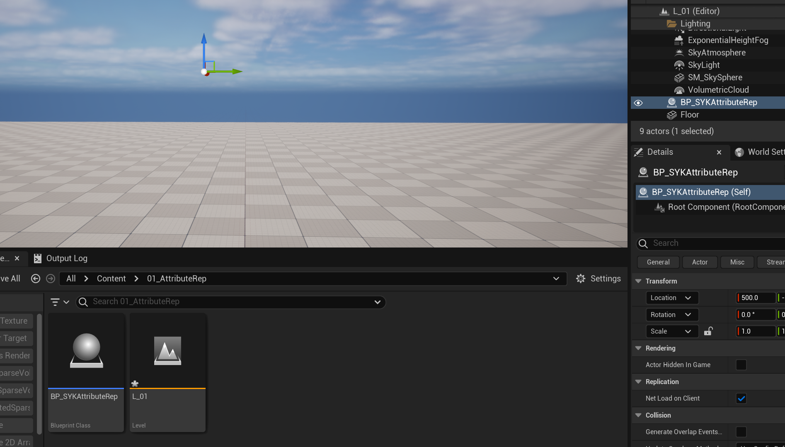

由于没有模型，因此我们看不到任何物体，只有一个可以拖动的坐标`UI`，但是这不重要现在找到下图所示三个点的选项。


点开三个点的选项找到最下方的`Net Mode`选项，选择`Play As Clinet`，该选项对应于多人游戏中的DS（`Dedicated Server`）网络架构，即客户端-服务器架构。

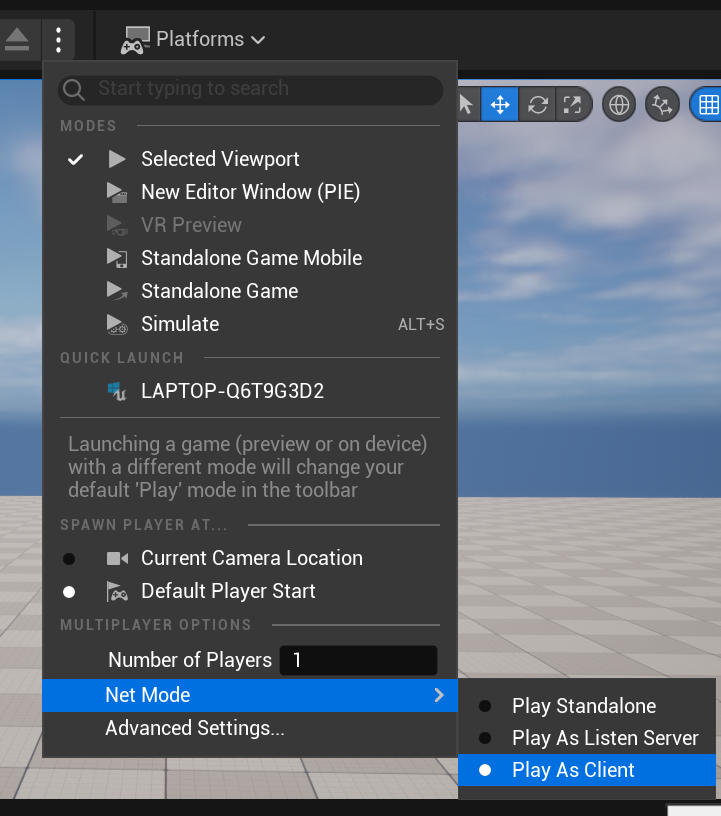

使用这个选项启动游戏可以模拟这种架构的多人效果，下面启动游戏。


我们可以看到`HealthValue`的数值再持续增加。这其中的过程是我们刚才所编写的代码既在客户端执行，又在服务器端执行，因此当不同的端执行到`Tick`函数中时，由于其`NetMode`不同会执行不同的代码，对应的就是在服务器（`NetMode`为`DedicatedServer`）上持续增加`HealthValue`并打印日志，而在客户端（`NetMode`为`Client`）上执行屏幕输出`HealthValue`数值的代码，也就是上图我们看到的信息，又因为服务器中`HealthValue`的数值一直变化，所以会持续同步到客户端上的`HealthValue`，这样客户端打印到屏幕上的数值信息就会随之变化，在客户端的屏幕上看起来就是`HealthValue`在变化，然而实际上是服务器在变化，客户端拿到的只是服务器同步过来的值。

虚幻编辑器的默认设置下我们看不到游戏运行时服务器端的日志，现在打开三个小点处的选项，选择最下方的`Advanced Settings`。

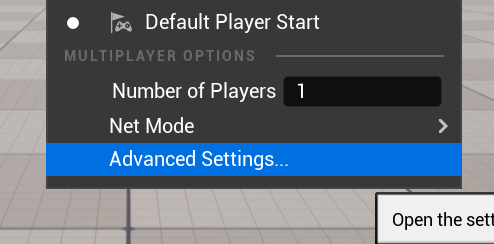

找到`Run Under One Process`并将其设置为`false`，即取消勾选，如下图所示。

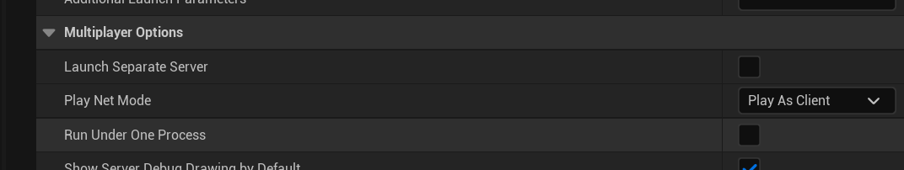

现在重新启动游戏，启动过程可能会变慢，请耐心等待，之后即可看到服务器端日志输出窗口。

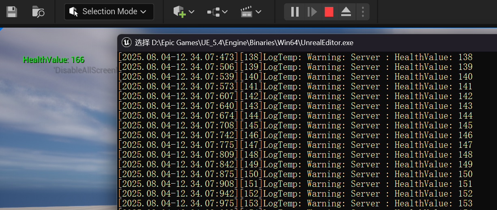

这里就是我们在`Tick`函数中写的那个`UE_LOG()`输出的日志信息。

如果你不小心点到了服务器日志输出窗口发现游戏卡住不在运行时按一下`Enter`回车键即可。

#### ReplicatedUsing示例

下面使用`ReplicatedUsing`实现属性复制。

首先为`Actor`类添加一个属性`Money`并设置元数据说明符`ReplicatedUsing`，如下代码所示。

```cpp
#pragma once

#include "CoreMinimal.h"
#include "GameFramework/Actor.h"
#include "SYKAttributeRep.generated.h"

UCLASS()
class SYKNETSAMPLE_API ASYKAttributeRep : public AActor
{
	GENERATED_BODY()
	
public:	
	ASYKAttributeRep();

protected:
	virtual void BeginPlay() override;

public:	
	virtual void Tick(float DeltaTime) override;

public:

	virtual void GetLifetimeReplicatedProps(TArray<FLifetimeProperty>& OutLifetimeProps) const override;

protected:
	
    /////////////////////////////////////////////////////////////////
    //重点看这里！！！
	UPROPERTY(ReplicatedUsing = OnRep_Money)
	int32 Money;

	UFUNCTION()
	void OnRep_Money();
};
```

注意在`Money`属性的`UPROPERTY`中是怎样编写代码的，`OnRep_Money`就是我们需要定义并实现的函数，在此我直接写在了`Money`属性的下面，函数名`OnRep_Money`不是硬性要求，完全自定义，但是为了**规范**通常只会变更`OnRep_`后面的部分。

必须为该函数添加`UFUNCTION()`宏标记，否则会编译报错说找不到`OnRep_Money`函数。

当`Money`在服务器上发生变化时，服务器端不仅会向客户端开始属性复制，还会开始**在客户端执行**`OnRep_Money()`函数，我们可以利用这一函数实现一些其它功能，在此我简单实现在客户端屏幕输出`Money`数值的功能。

```Cpp
void ASYKAttributeRep::OnRep_Money()
{
	FString ShowText = FString::Printf(TEXT("Money: %d"), Money);
	GEngine->AddOnScreenDebugMessage(2, 5.0f, FColor::Green, ShowText);
}
```

当然，不可或缺的是我们仍然需要在`GetLifetimeReplicatedProps`注册需要网络复制的属性。

```cpp
void ASYKAttributeRep::GetLifetimeReplicatedProps(TArray<FLifetimeProperty>& OutLifetimeProps) const
{
    //再次强调不要忘记调用该函数
	Super::GetLifetimeReplicatedProps(OutLifetimeProps);

	DOREPLIFETIME(ASYKAttributeRep, Money);
}
```

下面再`Tick`函数中我们只需要编写服务器端修改`Money`的代码即可，可以不像`HealthValue`那样写一个客户端打印信息的代码，因为我们这次使用的是`ReplicatedUsing`，`OnRep_Money()`函数可以实现属性变更后在客户端执行的功能，我们在这个函数中编写了打印信息到屏幕上的代码。

```cpp
void ASYKAttributeRep::Tick(float DeltaTime)
{
	Super::Tick(DeltaTime);

	if (GetWorld()->GetNetMode() == ENetMode::NM_DedicatedServer)
	{
		//Money
		{
			Money++;
			if (Money > 300.0f)
			{
				Money = 0.0f;
			}
			UE_LOG(LogTemp, Warning, TEXT("Server : Money: %d"), Money);
		}
	}
}
```

下面运行代码，如同`Replicated`说明符的示例那样，启动游戏，观察运行效果和服务器日志信息，如下图所示。

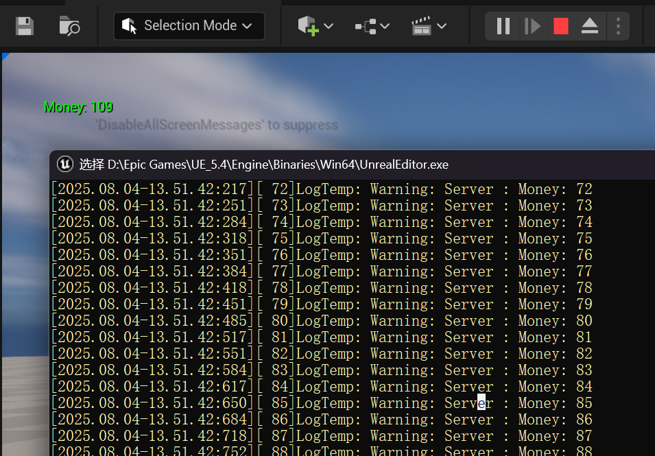

#### 条件复制

条件复制用于更精细的控制不同情况下的属性复制，详见虚幻官方文档。

[在虚幻引擎中复制Actor属性 | 虚幻引擎 5.4 文档 | Epic Developer Community](https://dev.epicgames.com/documentation/zh-cn/unreal-engine/replicate-actor-properties-in-unreal-engine?application_version=5.4#复制actor属性)

## RPC远程调用

[虚幻引擎中的RPC | 虚幻引擎 5.4 文档 | Epic Developer Community](https://dev.epicgames.com/documentation/zh-cn/unreal-engine/remote-procedure-calls-in-unreal-engine?application_version=5.4#使用rpc)

下面根据官方文档中的内容简要提一下使用`RPC`时需要注意的点，不再赘述细节。

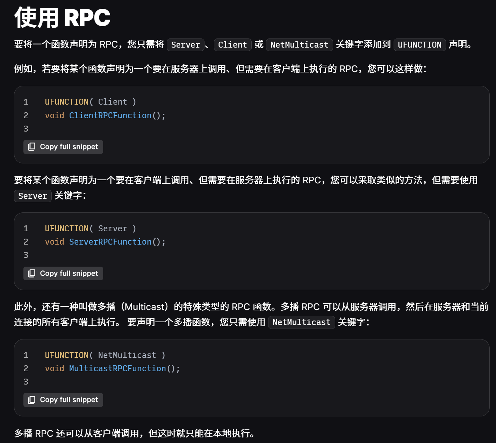

类似图中这样，`UFUNCTION`中写的是`Client`那么这个函数将来就用作客户端执行，写的是`Server`那么就用作服务器端执行。

需要注意编写`RPC`函数的具体实现时，需要在函数名后面添加`_Implementation`才可以通过编译，如下图所示这样。

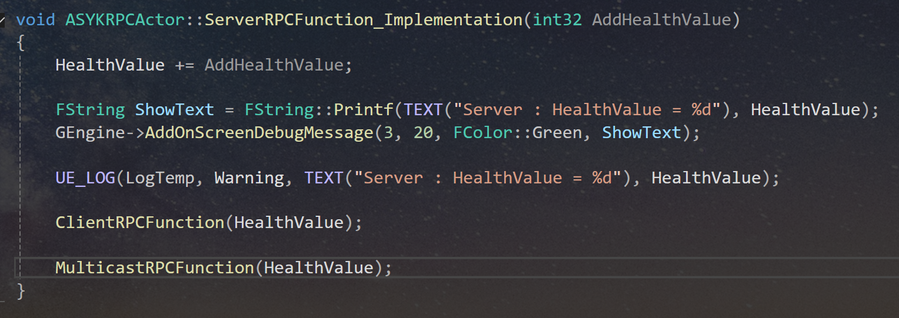

下面是一写注意事项。

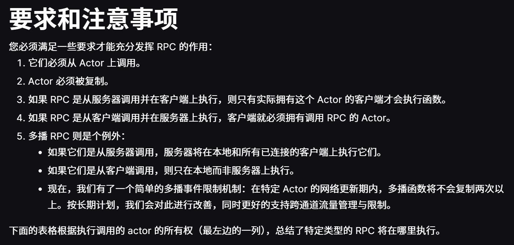

如果要确保`RPC`调用的成功性，需要在`UFUNCTION`中添加`Reliable`标记。

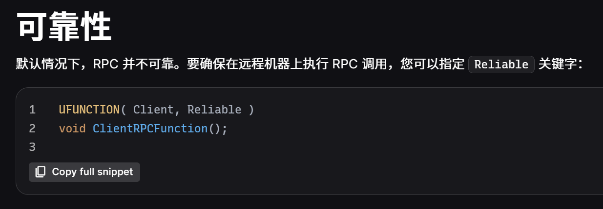

`RPC`函数的验证功能。

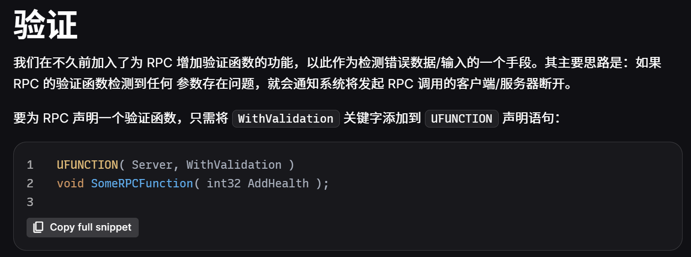

注意验证函数验证不过的后果是断开发起`RPC`调用的客户端/服务器。

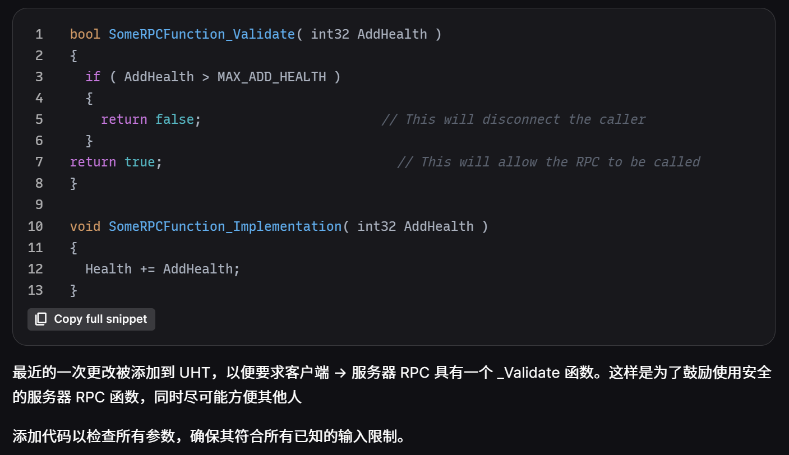

```cpp
bool SomeRPCFunction_Validate( int32 AddHealth )
{
	if ( AddHealth > MAX_ADD_HEALTH )
	{
		return false;                       // 这将断开呼叫者的连接
	}
return true;                              // 这将允许调用远程过程调用（RPC）。
}
 
void SomeRPCFunction_Implementation( int32 AddHealth )
{
	Health += AddHealth;
}
```

下面是我写的使用RPC的一个样例代码，一个头文件一个源文件。

```cpp
//头文件
```

