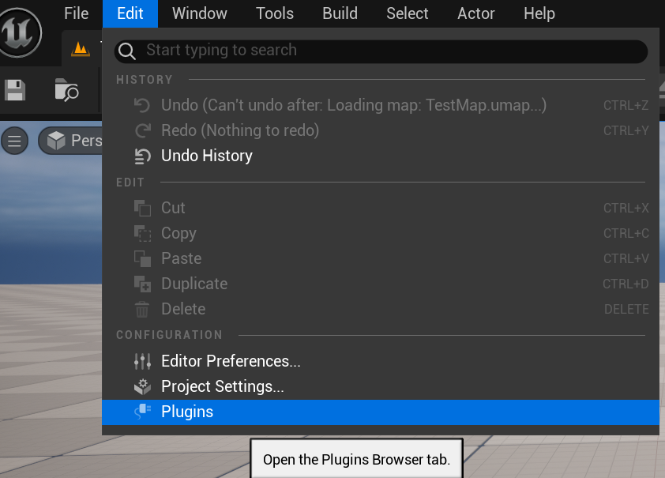
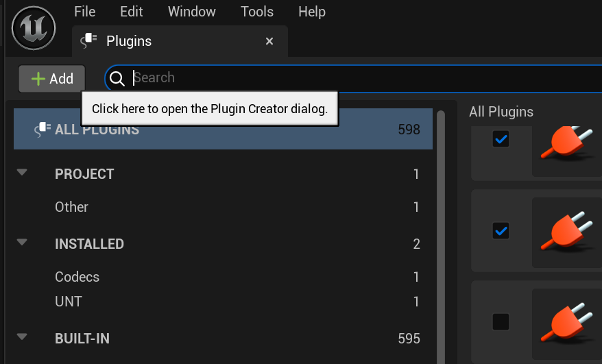
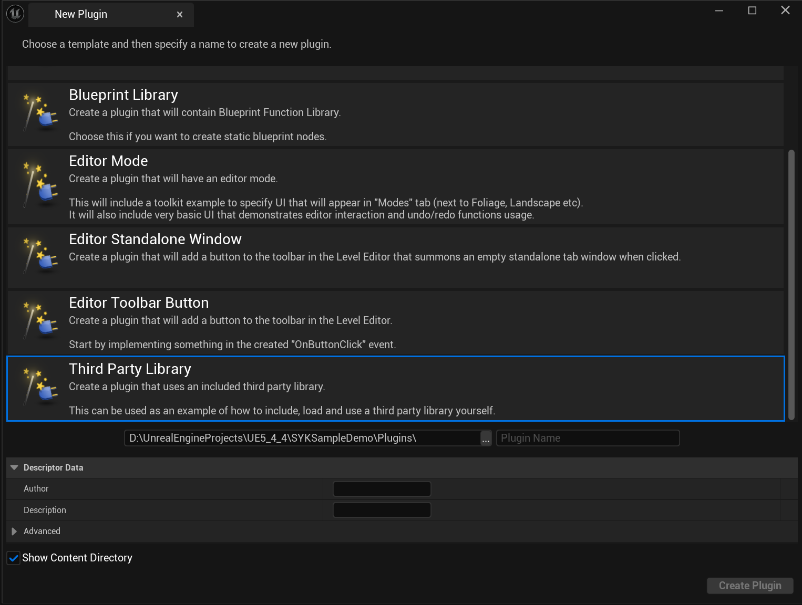
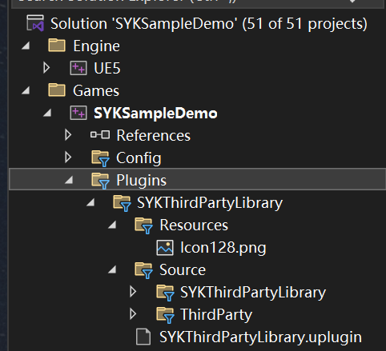

# 虚幻引擎C++第三方库引入与封装

[TOC]

------

## 引入与封装的区别

**封装是 UE 的必要升华**

- **引入**解决 “能不能用” 的问题（技术可行性）
- **封装**解决 “好不好用” 的问题（工程可维护性）
- **UE 特殊性**：作为引擎级框架，必须通过封装让第三方库遵循其内存管理、多线程、编辑器集成等规范，否则会导致内存泄漏、编辑器崩溃等深层问题。

**建议**：

- 对于**轻量工具库**（如 INIReader、xxHash）：直接引入，无需过度封装。
- 对于**复杂功能库**（如物理引擎、网络库）：必须封装，按 UE 模块规范设计接口，否则后期维护成本指数级增长。

## 创建自己的第三方库插件

打开虚幻编辑器，如下图所示，找到菜单栏中的`Edit`，打开`Plugin`。



进入`Plugin`界面点击左上角的`Add`之后选择最下方的`Third Party Library`。





之后在`Plugin Name`出填上你希望的名字即可，有需要的话也可以填一填下面的作者、描述信息等内容。这里我填写的就是`SYKThirdPartyLibrary`，记住这个名字，因为需要根据它来区分文件夹。


填写完毕之后，点击左下角的`Create Plugin`即可，等待创建完成就可以暂时关掉虚幻编辑器了，进入我们的`Visual Studio`。



因为我们是在创建插件的地方创建的，所以在项目文件夹下的`Plugins`可以找到我们新建的`SYKThirdPartyLibrary`。对于这个插件而言，它有两个部分，`Resources`和`Source`。

`Resources`，里面放了一张128*128像素的图片，用于在插件浏览器中显示一个图标，就像下面这个插件的图标一样的图片。


`Source`，里面的`SYKThirdPartyLibrary`文件夹下存放的就是用于启动和结束当前插件模块的类，里面有`StartupModule`函数和`ShutdownModule`函数等；而`ThirdParty`文件夹下就是存放我们第三方库工程项目的地方。这里说的比较简练，大家可能无法立刻明晰其中的含义，但是没关系，往后看就可以了。

### 没写完

## dll文件和lib文件的存放位置

引擎版本：5.4.4

首先我们需要明白dll文件和lib文件的作用

### 核心作用对比（以 UE 第三方库集成为例）

| 文件类型 | 全称                 | 作用阶段                 | UE 中的典型场景                                              |
| -------- | -------------------- | ------------------------ | ------------------------------------------------------------ |
| **DLL**  | 动态链接库           | 运行时（.exe 启动后）    | 存储实际执行代码（如 `ExampleLibrary.dll`），UE 编辑器 / 游戏运行时动态加载 |
| **LIB**  | 导入库（Import Lib） | 编译期（ClCompile 阶段） | 存储 DLL 导出函数的符号表，告诉 UE 编译器 “函数存在但在 DLL 中”，不包含实际代码 |
| **LIB**  | 静态库（Static Lib） | 编译期（Link 阶段）      | 直接包含代码（如 `libcurl.lib`），编译时嵌入 UE 模块，无需 DLL（UE 原生模块多用静态库） |

### UE 集成 DLL+LIB 的全流程解析

#### 1. 编译期：LIB 文件的 “导航作用”

```csharp
// UE .Build.cs 配置（以Windows为例）
PublicAdditionalLibraries.Add(
    Path.Combine(PluginDir, "ThirdParty", "x64", "Release", "ExampleLibrary.lib")
    //这里ExampleLibrary.lib文件存放的位置是我们必须要遵守的位置
    //这种类型的文件都要放在这里才能生效
);
```

比如下面这种路径：`"D:\UnrealEngineProjects\UE5_4_4\SYKSampleDemo\Plugins\SYKThirdPartyLibrary\Source\ThirdParty\SYKThirdPartyLibraryLibrary\x64\Release\ExampleLibrary.lib"`

- **作用**：
  告诉 UE 编译器：“`ExampleLibrary.dll` 中有 `ExampleFunction()` 函数，编译时不用包含代码，链接时去 DLL 找”。
- **错误案例**：
  若 LIB 路径错误，编译报 `LNK1104: 无法打开文件“ExampleLibrary.lib”`。

#### 2. 运行期：DLL 文件的 “执行载体”

```csharp
// 强制复制DLL到UE可搜索路径（关键！）
string TargetDll = Path.Combine(
    PluginDir, "Binaries", "ThirdParty", "Win64", "ExampleLibrary.dll"
);
File.Copy(SourceDll, TargetDll, true);
RuntimeDependencies.Add(TargetDll); // 告诉UE打包时包含此DLL
```

- **UE 搜索dll文件的顺序**：
  `项目/Binaries/Win64/` → `插件/Binaries/ThirdParty/Win64/` → 系统 PATH（避免依赖系统 DLL）
- **DLL 缺失时**：
  UE 报 `0xC000007B`（找不到模块）或 `0xC06D007F`（函数缺失）。

### dll文件和lib文件与第三方库的关系

在 Windows 系统的软件开发中，DLL（Dynamic Link Library，动态链接库）文件和 LIB（Library，静态链接库）文件与第三方库紧密相关，它们是第三方库常见的分发和使用形式。以下为你详细介绍它们之间的关系：

#### 1. DLL 文件与第三方库

- **动态链接库形式的第三方库**：许多第三方库以 DLL 文件的形式提供。DLL 文件包含了可被多个程序同时使用的代码和数据，这些代码和数据在运行时被动态加载到内存中。使用 DLL 文件的第三方库可以实现代码的复用，减少可执行文件的大小，并且方便对库进行更新和维护。
- **运行时加载**：当程序需要使用 DLL 文件中的功能时，在运行时通过操作系统的动态链接机制将 DLL 文件加载到内存中，并将程序与 DLL 文件中的函数和数据进行链接。这种方式使得程序在运行时可以灵活地使用第三方库的功能，而不需要在编译时将库的代码全部包含到可执行文件中。
- **示例**：例如，许多图形处理库、数据库驱动库等都以 DLL 文件的形式提供。在使用这些库时，程序在运行时会加载相应的 DLL 文件，并调用其中的函数来完成特定的任务。

#### 2. LIB 文件与第三方库

- **静态链接库形式的第三方库**：有些第三方库以 LIB 文件的形式提供。LIB 文件是静态链接库，它包含了库中所有函数和数据的二进制代码。在编译时，链接器会将 LIB 文件中的代码复制到可执行文件中，使得可执行文件包含了所有需要的代码，不依赖于外部的 DLL 文件。
- **编译时链接**：使用静态链接库的第三方库时，在编译过程中，链接器会将程序与 LIB 文件进行链接，将 LIB 文件中的代码合并到可执行文件中。这样，可执行文件在运行时不需要再加载额外的库文件，独立性较强。
- **示例**：一些小型的基础库，如数学库、字符串处理库等，可能会以 LIB 文件的形式提供。在使用这些库时，开发者只需要在编译时指定 LIB 文件的路径，链接器就会将其链接到可执行文件中。

#### 3. DLL 文件和 LIB 文件的关联

- **导入库（Import Library）**：对于 DLL 文件，通常还会提供一个对应的 LIB 文件，这个 LIB 文件被称为导入库。导入库不包含实际的代码，而是包含了 DLL 文件中导出函数和变量的符号信息。在编译时，链接器使用导入库来解析程序中对 DLL 文件中函数和变量的引用，生成可执行文件。在运行时，可执行文件通过导入库中的信息来加载和调用 DLL 文件中的函数。
- **不同使用场景**：DLL 文件和 LIB 文件的选择取决于具体的开发需求。如果需要实现代码的复用、动态更新库的功能，或者减少可执行文件的大小，通常选择使用 DLL 文件；如果希望可执行文件具有较强的独立性，不依赖于外部的库文件，或者库的代码比较小且不需要频繁更新，那么可以选择使用 LIB 文件。

### UE 开发者必知的 5 个细节

#### 1. LIB 文件的 “镜像” 特性

- 导入 LIB 是 DLL 的 “符号镜像”，必须与 DLL 版本严格一致（包括编译配置：Debug/Release、平台：x64/ARM）。
- **验证方法**：用`dumpbin /EXPORTS ExampleLibrary.dll` 对比 LIB 中的符号。

#### 2. DLL 的 “隐式加载” 与 “显式加载”

- **隐式加载**（UE 默认）：编译时指定 LIB，运行时自动加载 DLL（需在搜索路径）。

- 显式加载（高级场景）：

  ```cpp
  void* DllHandle = FPlatformProcess::GetDllHandle(*DllPath);
  typedef void (*ExampleFunc)();
  ExampleFunc Func = (ExampleFunc)FPlatformProcess::GetDllExport(DllHandle, "ExampleFunction");
  ```

  - 适用：延迟加载、版本兼容（UE 热更新常用）。

#### 3. UE 的 DLL 隔离机制

- 第三方 DLL 必须放在`插件/Binaries/ThirdParty/平台`目录（如`Win64`），避免与引擎 DLL 冲突，这个路径是我们必须要遵守的路径，比如下面这种路径`"D:\UnrealEngineProjects\UE5_4_4\SYKSampleDemo\Plugins\SYKThirdPartyLibrary\Binaries\ThirdParty\SYKThirdPartyLibraryLibrary\Win64\ExampleLibrary.dll"`。
- **错误路径**：直接放`Engine/Binaries`，引擎升级后易覆盖。

#### 4. 符号导出的 UE 规范

- C++ 函数需用

  ```
  __declspec(dllexport)
  ```

  导出（DLL 编译时），UE 中建议用宏统一管理：

  ```cpp
  // 在ExampleLibrary.h中
  #ifdef EXAMPLELIBRARY_API
  #define EXAMPLELIBRARY_API __declspec(dllexport)
  #else
  #define EXAMPLELIBRARY_API __declspec(dllimport)
  #endif
  EXAMPLELIBRARY_API void ExampleFunction();
  ```

#### 5. 打包时的 DLL 处理

- 通过`RuntimeDependencies.Add(TargetDll)` 确保 DLL 被包含进`.pak`文件。
- **验证方法**：打包后检查`项目/Shipping/Win64/ThirdParty/` 目录。

### 典型错误与解决方案

#### 错误 1：`LNK2019: 无法解析的外部符号`

- **原因**：LIB 未正确引用，或 DLL 未导出函数。
- 修复：
  1. 检查`.Build.cs` 的`PublicAdditionalLibraries` 路径。
  2. 用`Dependency Walker` 工具查看 DLL 导出表。

#### 错误 2：`0xC000007B: 无法启动此程序`

- **原因**：DLL 依赖的其他库缺失（如 VC 运行时）。
- 修复：
  1. 确保 DLL 是 UE 对应版本编译（UE5.4 用 VS2022 编译）。
  2. 安装[UE 运行时库](https://www.microsoft.com/zh-CN/download/details.aspx?id=48145)。

#### 错误 3：编辑器能运行，打包后崩溃

- **原因**：DLL 未被包含进打包目录。
- **修复**：在`.Build.cs` 中添加`RuntimeDependencies.Add(TargetDll)`。

### UE 最佳实践：DLL+LIB 管理模板

```csharp
// 插件 .Build.cs 模板（动态链接）
public class ThirdPartyPlugin : ModuleRules
{
    public ThirdPartyPlugin(ReadOnlyTargetRules Target) : base(Target)
    {
        string PluginDir = IPluginManager::Get().FindPlugin("ThirdPartyPlugin")->GetBaseDir();
        
        // 1. 编译期：引用导入LIB
        if (Target.Platform == UnrealTargetPlatform.Win64)
        {
            PublicAdditionalLibraries.Add(
                Path.Combine(PluginDir, "ThirdParty", "x64", "Release", "ExampleLibrary.lib")
            );
        }
        
        // 2. 运行期：复制DLL到指定目录
        PrivateDependencyModuleNames.Add("Core"); // 依赖Core模块使用File.Copy
        PostBuildSteps.Add(
            new UBuildPostStep()
            {
                bWithClean = true,
                bDelete = false,
                Description = "Copy ThirdParty DLL",
                Steps = new[] {
                    new Command(
                        "C:\\Windows\\System32\\cmd.exe",
                        $"/c copy /Y \"{Path.Combine(PluginDir, "ThirdParty", "x64", "Release", "ExampleLibrary.dll")}\" \"{Path.Combine(PluginDir, "Binaries", "ThirdParty", "Win64", "ExampleLibrary.dll")}\""
                    )
                }
            }
        );
    }
}
```

### 总结：DLL 与 LIB 的 “阴阳关系”

- **LIB 是编译期的 “地图”**：告诉 UE 去哪里找 DLL 中的函数（符号表）。
- **DLL 是运行时的 “执行者”**：存储实际代码，UE 在启动时动态加载。
- **在 UE 中**，两者必须版本匹配、路径正确，且遵循插件隔离原则。理解这对组合，是解决`LNK1104`、`0xC06D007F`等高频错误的关键。

## 乱序随心记

### `SYKThirdPartyLibrary.h`

```c++
#pragma once

#include "Modules/ModuleManager.h"

class FSYKThirdPartyLibraryModule : public IModuleInterface
{
public:

	/** 模块加载到内存后会被调用。一般在这个函数里进行模块的初始化操作，例如加载第三方库、注册事件、初始化资源等。*/
	virtual void StartupModule() override;

	/** 在模块卸载时会被调用。通常在这个函数里进行资源的释放操作，比如关闭文件、释放内存、卸载第三方库等。*/
	virtual void ShutdownModule() override;

private:
	/** 用于存储第三方动态链接库（DLL）的句柄。在加载 DLL 时，会使用这个指针来保存 DLL 的句柄，后续可以通过这个句柄来调用 DLL 中的函数。 */
	void*	ExampleLibraryHandle;
};

```

### `SYKThirdPartyLibrary.cpp`

```c++
// Copyright Epic Games, Inc. All Rights Reserved.

#include "SYKThirdPartyLibrary.h"
#include "Misc/MessageDialog.h"
#include "Modules/ModuleManager.h"
#include "Interfaces/IPluginManager.h"
#include "Misc/Paths.h"
#include "HAL/PlatformProcess.h"
#include "SYKThirdPartyLibraryLibrary/ExampleLibrary.h"

#define LOCTEXT_NAMESPACE "FSYKThirdPartyLibraryModule"

void FSYKThirdPartyLibraryModule::StartupModule()
{
	// 此代码将在您的模块加载到内存后执行；确切的时间在每个模块的.uplugin文件中指定

	// 获取插件的基本目录
	FString BaseDir = IPluginManager::Get().FindPlugin("SYKThirdPartyLibrary")->GetBaseDir();
	// 比如我们的项目名是SYKSampleDemo
	// 项目目录下有一个存放插件的文件夹叫Plugins
	// Plugins文件夹下存放各种插件，
	// 我们这个插件的名字叫做SYKThirdPartyLibrary
	// 那么这里的BaseDir = "D:\UnrealEngineProjects\UE5_4_4\SYKSampleDemo\Plugins\SYKThirdPartyLibrary"

	// 添加第三方dll的相对位置并加载它
	FString LibraryPath; //在此只是简单定义一个字符串
#if PLATFORM_WINDOWS
	LibraryPath = FPaths::Combine(*BaseDir, TEXT("Binaries/ThirdParty/SYKThirdPartyLibraryLibrary/Win64/ExampleLibrary.dll"));
	//这里是引擎自带的写法，引擎希望我们把需要加载的dll文件存放在
	//BaseDir + "Binaries/ThirdParty/SYKThirdPartyLibraryLibrary/Win64/"这样的文件夹中
	//因此在引擎加载这个文件夹之前，我们必须将需要的dll文件存放进这个文件夹
	//这一操作我们通常是在第三方库模块的.Build.cs文件中进行
	//对于本插件而言就是SYKThirdPartyLibraryLibrary.Build.cs文件

#endif //此处原本有其它平台的相关实现，我删掉了，在此只讨论Windows平台的路径设置

	ExampleLibraryHandle = !LibraryPath.IsEmpty() ? FPlatformProcess::GetDllHandle(*LibraryPath) : nullptr;
	/*
	*FPlatformProcess::GetDllHandle
	*函数的主要作用是在运行时动态加载指定路径的动态链接库（dll文件）或共享库，并返回该库的句柄。
	*通过这个句柄，你可以进一步获取库中导出的函数和变量，从而在程序中使用这些库提供的功能。
	*/

	if (ExampleLibraryHandle) //检查上一步返回的句柄是否为空，若不为空说明成功加载了LibraryPath路径对应的dll文件
	{
		// 调用打开消息框的第三方库中的test函数，提示dll文件成功加载
		ExampleLibraryFunction();
	}
	else
	{
		//文件加载失败的日志消息
		FMessageDialog::Open(EAppMsgType::Ok, LOCTEXT("ThirdPartyLibraryError", "Failed to load example third party library"));
	}
}

//释放句柄资源等，如果StartupModule()还申请了其它资源，也可以在这里释放掉
void FSYKThirdPartyLibraryModule::ShutdownModule()
{
	// This function may be called during shutdown to clean up your module.  For modules that support dynamic reloading,
	// we call this function before unloading the module.

	// Free the dll handle
	FPlatformProcess::FreeDllHandle(ExampleLibraryHandle);
	ExampleLibraryHandle = nullptr;
}

#undef LOCTEXT_NAMESPACE
	
IMPLEMENT_MODULE(FSYKThirdPartyLibraryModule, SYKThirdPartyLibrary)
/*
* 在虚幻引擎里，模块是代码组织的重要方式，它把相关的功能封装在一起，
* 提高代码的可维护性与可扩展性。
* IMPLEMENT_MODULE 宏的主要作用是告诉虚幻引擎该模块的实现位置，
* 让引擎能够正确加载和管理这个模块。
* 
* 1、FSYKThirdPartyLibraryModule：这是模块类的名称，
* 一般是一个继承自 IModuleInterface 的类。
* 该类定义了模块的初始化、启动、关闭等操作，
* 包含了 StartupModule 和 ShutdownModule 等重要方法。
* StartupModule 方法会在模块加载到内存后执行，可用于初始化模块所需的资源；
* ShutdownModule 方法则在模块卸载时执行，用于释放资源。
* 2、SYKThirdPartyLibrary：这是模块的名称，是一个字符串标识符，用于在引擎中唯一标识该模块。
* 其他模块在引用此模块时，会使用这个名称。
* 
*/

```

### `SYKThirdPartyLibrary.Build.cs`

```C++
// Copyright Epic Games, Inc. All Rights Reserved.

using System.IO;
using UnrealBuildTool;

public class SYKThirdPartyLibrary : ModuleRules
{
	public SYKThirdPartyLibrary(ReadOnlyTargetRules Target) : base(Target)
	{
        /*
		 * ReadOnlyTargetRules Target 是 ModuleRules 类构造函数的一个参数，它在模块构建配置方面发挥着关键作用。
		 * 
		 * ReadOnlyTargetRules 是一个结构体，
		 * 其中包含了与目标平台、配置和构建相关的规则及信息。
		 * Target 作为这个结构体的实例，提供了一系列只读属性和方法，
		 * 可用于在构建模块时获取目标平台、配置类型等信息，
		 * 从而依据不同的目标进行针对性的配置。
		 * 
		 * 借助 ReadOnlyTargetRules Target，
		 * 开发者能够根据不同的目标平台（如 Windows、Linux、iOS 等）、
		 * 配置类型（如 Debug、Development、Shipping 等）
		 * 以及其他构建相关的设置，对模块的构建过程进行定制。
		 * 这有助于实现跨平台开发和不同构建配置下的灵活处理。
		 */

        PCHUsage = ModuleRules.PCHUsageMode.UseExplicitOrSharedPCHs;
        /*
		 * PCH 全称为 Pre-Compiled Header，即预编译头。它是一种在编译过程中用于提高编译效率的技术手段.
		 * 
		 * 在编译程序时，编译器会对每个源文件进行独立处理。很多源文件都会包含相同的头文件，
		 * 例如标准库头文件、项目公共头文件等。每次编译源文件时，重复处理这些头文件会消耗大量时间。
		 * 预编译头技术就是把这些频繁使用且不常变动的头文件预先编译成一个文件，
		 * 后续编译源文件时，编译器可以直接使用这个预编译好的文件，
		 * 从而避免对头文件的重复编译，显著提升编译速度。
		 * 
		 * 在虚幻引擎的 .Build.cs 文件里，可以对预编译头的使用模式进行配置，常见的模式有以下几种：
		 * 1、UseExplicitOrSharedPCHs：模块必须指定一个预编译头文件，或者继承引擎的共享预编译头。
		 * 2、UseSharedPCHs：强制使用引擎的 Engine.h 作为预编译头。
		 * 3、NoPCHs：禁用预编译头，这种模式适用于第三方库模块或者不稳定的模块。
		 */
        PublicIncludePaths.AddRange(
			new string[] {
				// ... add public include paths required here ...
			}
			);
				
		
		PrivateIncludePaths.AddRange(
			new string[] {
				// ... add other private include paths required here ...
			}
			);
        /*
		 * PublicIncludePaths 和 PrivateIncludePaths 是用于配置头文件搜索路径的重要属性。
		 * 当前模块需要使用的、当前模块希望向外暴露的头文件
		 * 都可以写在PublicIncludePaths里面
		 * 仅在当前模块内部使用的头文件
		 * 都可以写在PrivateIncludePaths里面
		 * 需要注意的一点是，这里所说的写在里面，不是直接写"xxx.h"而是把对应的路径写在这里，
		 * 也可以是多个头文件共同存在的目录
		 * 
		 * 在编译过程中，编译器需要知道在哪里查找头文件。
		 * 通过设置 PublicIncludePaths 和 PrivateIncludePaths，
		 * 可以告诉编译器在哪些目录下搜索头文件，从而顺利完成编译。
		 * 
		 * 1、PublicIncludePaths：这里配置的路径是公共的，
		 * 意味着不仅当前模块可以使用这些路径下的头文件，依赖于当前模块的其他模块也可以使用。
		 * 通常用于存放对外公开的头文件，比如模块的接口定义、公共工具类等。
		 * 2、PrivateIncludePaths：此路径下的头文件仅供当前模块内部使用，其他模块无法访问。
		 * 一般用于存放模块的私有实现细节、内部使用的工具类等，这些内容不希望被外部模块直接引用。
		 * 
		 * AddRange函数接受一个string类型的集合，即字符串集合collection
		 * collection：代表要添加的路径列表。
		 * 因此我们只需要在函数参数列表中new一个string数组
		 * 在编译时会自动转换为集合
		 */

        PublicDependencyModuleNames.AddRange(
			new string[]
			{
				"Core",
				"CoreUObject",
				"SYKThirdPartyLibraryLibrary",
				"Projects"
				// ... add other public dependencies that you statically link with here ...
			}
			);
        /*
		 * 1、Core：它是虚幻引擎的核心模块，提供了基础的功能和数据结构，像内存管理、日志记录、字符串处理、容器类等。几乎所有的模块都会依赖 Core 模块。
		 * 2、CoreUObject：该模块实现了虚幻引擎的对象系统，包含 UObject 类及其相关功能。UObject 是虚幻引擎中很多类的基类，提供了反射、序列化、垃圾回收等重要特性。
		 * 3、Engine：这是虚幻引擎的核心引擎模块，涵盖了游戏引擎的主要功能，例如场景管理、渲染、物理模拟、AI 等。大多数游戏模块都会依赖 Engine 模块。
		 * 4、InputCore：负责处理基本的输入事件，比如键盘、鼠标、游戏手柄等输入设备的输入。通过这个模块，你可以监听和处理各种输入事件。
		 * 5、EnhancedInput：这是虚幻引擎中用于处理输入的增强型模块，它提供了更灵活和强大的输入处理机制，支持输入映射、输入动作、输入条件等功能，方便开发者实现复杂的输入逻辑。
		 */

        PrivateDependencyModuleNames.AddRange(
			new string[]
			{
				// ... add private dependencies that you statically link with here ...	
			}
			);
        /*
		 * PublicDependencyModuleNames.AddRange 和 PrivateDependencyModuleNames.AddRange 
		 * 是用来配置模块依赖关系的关键方法。
		 * 在虚幻引擎中，一个模块可能会依赖其他模块来实现特定功能。
		 * 这些依赖关系需要在 .Build.cs 文件里进行明确配置，
		 * 如此编译器才能正确地链接这些模块。
		 * 
		 * 1、PublicDependencyModuleNames.AddRange：该函数用于添加公共依赖模块。
		 * 公共依赖意味着依赖模块的接口对当前模块的使用者是可见的。
		 * 也就是说，不仅当前模块可以使用这些依赖模块的功能，依赖于当前模块的其他模块也能使用。
		 * 2、PrivateDependencyModuleNames.AddRange：此函数用于添加私有依赖模块。
		 * 私有依赖表示依赖模块的接口仅对当前模块内部可见，
		 * 其他依赖于当前模块的模块无法直接访问这些私有依赖模块的功能。
		 * 
		 * 避免循环依赖：要确保依赖关系不会形成循环，否则会导致编译错误。
		 * 例如，模块 A 依赖模块 B，而模块 B 又依赖模块 A，这就是循环依赖。
		 */

        /*
         * 对与（Public/Private)IncludePaths和（Public/Private)DependencyModuleNames的区别
         * IncludePaths是头文件路径配置
         * DependencyModuleNames是模块依赖配置
         * 
		 * 头文件路径配置：解决的是编译时头文件的查找问题，通过指定路径让编译器找到所需的头文件。
		 * 模块依赖配置：解决的是链接时模块代码的整合问题，通过指定依赖模块让编译器将相关模块的代码正确链接在一起。
		 * 
		 * 二者一个作用的领域不同，一个是编译期、另一个是链接期
		 * 在模块构建过程中分别承担着不同的职责，二者相互配合，才能确保模块的正确编译和链接。
		 * 
		 * 如果我的PublicIncludePaths只包含了当前模块的头文件，那么PublicDependencyModuleNames 不需要添加当前模块
		 * 一旦我使用了其它模块的头文件，
		 * 我就需要在（Public/Private)IncludePaths中添加对应的路径，
		 * 同时还要在（Public/Private)DependencyModuleNames中添加对应模块
		 */

        DynamicallyLoadedModuleNames.AddRange(
            new string[]
            {
				// ... add any modules that your module loads dynamically here ...
			}
            );

        /*
		 * 模块的加载方式主要有静态加载和动态加载。
		 * 静态加载是在编译时就确定模块之间的依赖关系，
		 * 将所有依赖模块的代码链接到可执行文件或库中；
		 * 而动态加载则是在程序运行时根据需要加载模块。
		 * DynamicallyLoadedModuleNames.AddRange 就是用来配置动态加载模块的。
		 * 
		 * 对于动态加载的模块，
		 * 写在这里的模块名只是告诉引擎，我的某某模块是动态加载的，你小心点
		 * 仅写在这里是不够的，这里相当于一个动态加载模块的声明
		 * 我们还需要在功能代码中，在你觉得功能需要的合适时机
		 * 通过代码，实现模块的加载、使用模块功能、卸载等一系列工作
		 */
    }
}

```

### `SYKThirdPartyLibraryLibrary.Build.cs`

```C++
// Fill out your copyright notice in the Description page of Project Settings.

using System.IO;
using UnrealBuildTool;
/*
 * System.IO 命名空间以处理文件和目录操作，
 * UnrealBuildTool 命名空间用于与 Unreal Engine 的构建工具交互。
 */

//定义了 SYKThirdPartyLibraryLibrary 类，继承自 ModuleRules，用于定义模块的构建规则
public class SYKThirdPartyLibraryLibrary : ModuleRules
{
    private void CopyDllToPluginBinaries(string InFilePath, ReadOnlyTargetRules InTarget)
    {
        // 计算目标目录（绝对路径）
        string TargetFileDirectory = Path.GetFullPath(
            Path.Combine(
                PluginDirectory,  // 插件根目录（如：D:\UnrealEngineProjects\UE5_4_4\SYKSampleDemo\Plugins\SYKThirdPartyLibrary）
                "Binaries/ThirdParty",  // 第三方库二进制目录（引擎约定路径）
                "SYKThirdPartyLibraryLibrary",  // 库模块名（建议与插件名一致）
                "Win64"  // 平台限定（仅 Windows 64 位）
            )
        );

        // 提取文件名（如：ExampleLibrary.dll）
        string Filename = Path.GetFileName(InFilePath);

        if (!Directory.Exists(TargetFileDirectory))
        {
            Directory.CreateDirectory(TargetFileDirectory);
        }

        string TargetFilePath = Path.Combine( TargetFileDirectory , Filename );

        if (!File.Exists(TargetFilePath))
        {
            File.Copy(
                InFilePath,       // 源文件路径（如：D:\UnrealEngineProjects\UE5_4_4\SYKSampleDemo\Plugins\SYKThirdPartyLibrary\Source\ThirdParty\SYKThirdPartyLibraryLibrary\x64\Release\ExampleLibrary.dll）
                TargetFilePath,   // 目标文件路径（如：D:\UnrealEngineProjects\UE5_4_4\SYKSampleDemo\Plugins\SYKThirdPartyLibrary\Binaries\ThirdParty\SYKThirdPartyLibraryLibrary\Win64\ExampleLibrary.dll）
                true              // 强制覆盖已有文件（关键！）
            );
        }
    }
	public SYKThirdPartyLibraryLibrary(ReadOnlyTargetRules Target) : base(Target)
	{
        //标记当前模块为外部模块
		Type = ModuleType.External;

		PublicSystemIncludePaths.Add("$(ModuleDir)/Public");
        /*
         * PublicSystemIncludePaths 是 ModuleRules 类的一个属性，
         * 用于指定公共系统包含路径。这些路径会被编译器用于查找头文件，
         * 而且这些路径对于所有依赖于当前模块的其他模块都是可见的。
         * 
         * 1、PublicSystemIncludePaths：主要用于指定系统级别的头文件搜索路径。
         * 这些路径通常包含的是一些标准库、第三方库或者系统相关的头文件。
         * 编译器在处理这些路径时，会将其视为系统级别的包含路径，
         * 这可能会影响到编译器的警告处理和搜索策略。
         * 一般而言，将一些不希望被项目代码直接修改的外部库头文件路径添加到这里。
         * 2、PublicIncludePaths：用于指定模块公共头文件的搜索路径。
         * 这些头文件是模块向外暴露的接口，供其他依赖该模块的代码使用。
         * 通常是模块自身定义的一些公共接口和类的头文件路径。
         */

        if (Target.Platform == UnrealTargetPlatform.Win64)
		{
            // 添加导入库
            PublicAdditionalLibraries.Add(Path.Combine(ModuleDirectory, "x64", "Release", "ExampleLibrary.lib"));
            /*
             * PublicAdditionalLibraries 是 ModuleRules 类的一个属性，
             * 它主要用于在编译和链接过程中添加额外的库文件。
             * 
             * 在构建 Unreal Engine 项目时，
             * 编译器需要知道要链接哪些库文件来生成可执行文件或动态链接库（DLL）。
             * PublicAdditionalLibraries 就是用来指定这些额外库文件的列表。
             * 这些库文件通常是第三方库或者项目中其他模块提供的库，
             * 通过将它们添加到 PublicAdditionalLibraries 中，
             * 链接器在链接阶段会将这些库文件与当前模块进行链接
             */

            // 延迟加载DLL，以便我们可以先从正确的位置加载它
            PublicDelayLoadDLLs.Add("ExampleLibrary.dll");
            /*
             * 1、PublicDelayLoadDLLs：这是 ModuleRules 类中的一个属性，
             * 它是一个字符串列表，用于指定在运行时需要延迟加载的动态链接库（DLL）。
             * 在 Unreal Engine 项目里，模块构建规则允许你定义哪些 DLL 应该被延迟加载，
             * 这样可以控制 DLL 的加载时机。
             * 2、Add("ExampleLibrary.dll")
             * 这行代码把 "ExampleLibrary.dll" 这个 DLL 文件添加到延迟加载列表中。
             * 意味着在程序启动时，ExampleLibrary.dll 不会立即被加载，
             * 而是在程序首次尝试访问该 DLL 中的函数或数据时才会被加载。
             */

            CopyDllToPluginBinaries(Path.Combine(ModuleDirectory, "x64", "Release", "ExampleLibrary.dll") , Target);

            // 确保DLL与可执行文件一起暂存
            RuntimeDependencies.Add("$(PluginDir)/Binaries/ThirdParty/SYKThirdPartyLibraryLibrary/Win64/ExampleLibrary.dll");
            /*
             * RuntimeDependencies 是 ModuleRules 类中的一个属性，它是一个集合，
             * 用于指定在运行时项目所依赖的文件。
             * 通过调用 Add 方法添加依赖项，
             * 能确保这些依赖文件在打包和部署时被正确地包含在项目中，
             * 并且与可执行文件一起被部署到目标环境。
             * 
             * RuntimeDependencies.Add 这行代码确保在项目打包和部署时，
             * 这个 ExampleLibrary.dll 文件会被正确地包含在项目中，
             * 并且与可执行文件一起被部署到目标环境，
             * 从而保证程序在运行时能够找到并加载这个动态链接库。
             */
        }
    }
}

```


### 链接静态库

`PublicAdditionalLibraries`当我们需要引入的第三方库中存在`lib`文件并且需要添加时，即可使用该类。

我们一般在**第三方库模块**的`.Build.cs`文件中加载`lib`文件，使用如下代码：

```csharp
PublicAdditionalLibraries.Add(/*lib文件地址字符串*/);
//文件地址可以使用Path类的一些函数来快速拼写
//还可以使用$(ModuleDir)、$(PluginDir)等宏快速获取模块、插件的目录地址
//还可以直接使用ModuleDirectory等直接获得模块地址等，
//不论如何，达到最终目的即可
```

示例：

```csharp
using System.IO;
using UnrealBuildTool;

public class SYKSampleWebpLibrary : ModuleRules
{
	public SYKSampleWebpLibrary(ReadOnlyTargetRules Target) : base(Target)
	{
		Type = ModuleType.External; //声明当前模块为外部模块
        
        //将第三方库模块/Public文件夹中的文件暴露出去，一般暴露的都是头文件
		PublicSystemIncludePaths.Add("$(ModuleDir)/Public");

        //确定平台为Win64平台
		if (Target.Platform == UnrealTargetPlatform.Win64)
		{
            //链接静态库的方法
			PublicAdditionalLibraries.Add(Path.Combine("$(ModuleDir)", "x64", "Release", "libwebp.lib"));
			PublicAdditionalLibraries.Add(Path.Combine("$(ModuleDir)", "x64", "Release", "libwebpdemux.lib"));
			PublicAdditionalLibraries.Add(Path.Combine("$(ModuleDir)", "x64", "Release", "libwebpmux.lib"));
		}
	}
}

```


### **总结：记忆口诀**

- **头文件外露用`PublicSystemIncludePaths`**（供别人用的 API）
- **静态库链接用`PublicAdditionalLibraries`**（编译进模块）
- **动态库懒加载用`PublicDelayLoadDLLs`**（运行时再加载）
- **部署路径靠`RuntimeDependencies`**（打包时复制文件）
