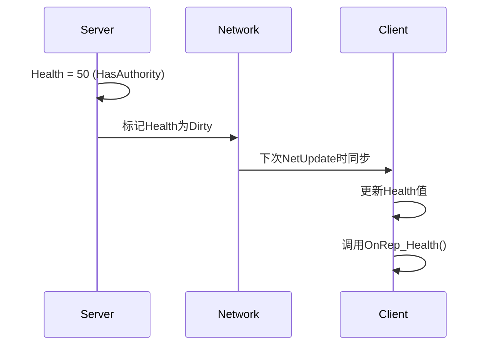

# 虚幻引擎网络复制

[TOC]

## 前言

本文记录网络复制时涉及到的概念和操作。

## 属性的网络复制

在虚幻引擎中，**属性网络复制（Replicated Property）** 是实现多人游戏同步的核心机制。以下是其完整步骤和关键细节：

---

### 1. 声明复制属性
在头文件（`.h`）中声明需要同步的变量，并指定复制规则：
```cpp
// 声明一个可复制的变量，并指定回调函数（可选）
UPROPERTY(Replicated, ReplicatedUsing = OnRep_Health) // 基础复制
int32 Health;

// 声明回调函数（仅在客户端触发）
UFUNCTION()
void OnRep_Health();
```

#### 常用复制宏
| 宏                             | 作用                   |
| ------------------------------ | ---------------------- |
| `Replicated`                   | 基础复制，无回调       |
| `ReplicatedUsing = OnRep_Func` | 复制时触发回调函数     |
| `ReplicatedBy = RepNotifyFunc` | （旧版语法，已不推荐） |

---

### 2. 注册复制属性
在源文件（`.cpp`）中重写 `GetLifetimeReplicatedProps`，注册需复制的变量：
```cpp
void AMyActor::GetLifetimeReplicatedProps(TArray<FLifetimeProperty>& OutLifetimeProps) const {
    Super::GetLifetimeReplicatedProps(OutLifetimeProps);
    
    // 无条件复制
    DOREPLIFETIME(AMyActor, Health); 

    // 条件复制（例如仅对所有者同步）
    DOREPLIFETIME_CONDITION(AMyActor, Mana, COND_OwnerOnly);
}
```

#### 常用复制条件（COND_*）
| 条件               | 说明                         |
| ------------------ | ---------------------------- |
| `COND_None`        | 无条件复制（默认）           |
| `COND_OwnerOnly`   | 仅同步给该Actor的所有者      |
| `COND_SkipOwner`   | 同步给除所有者外的所有客户端 |
| `COND_InitialOnly` | 仅在初始同步时复制           |

---

### 3. 启用Actor复制
确保Actor的 `bReplicates` 设置为 `true`（通常在构造函数中）：
```cpp
AMyActor::AMyActor() {
    bReplicates = true; // 关键！启用Actor级复制
    bNetLoadOnClient = true; // 确保客户端加载此Actor
}
```

---

### 4. 服务器端修改变量
在服务器端修改属性时，值会自动同步到客户端：
```cpp
void AMyActor::ServerSetHealth(int32 NewHealth) {
    if (HasAuthority()) { // 确保在服务器端执行
        Health = NewHealth; // 修改值会自动触发复制
    }
}
```

#### 强制立即同步（可选）
```cpp
Health = NewValue;
MarkPropertyDirty(GetClass()->FindPropertyByName(GET_MEMBER_NAME_CHECKED(AMyActor, Health))); // 手动标记为Dirty
ForceNetUpdate(); // 强制立即同步（慎用，影响性能）
```

---

### 5. 客户端处理同步（回调函数）
若使用 `ReplicatedUsing`，客户端会在收到新值时触发回调：
```cpp
void AMyActor::OnRep_Health() {
    // 仅在客户端执行
    if (IsLocallyControlled()) {
        UE_LOG(LogTemp, Warning, TEXT("Health updated to: %d"), Health);
        UpdateHealthUI(Health); // 更新UI等客户端逻辑
    }
}
```

#### 回调函数注意事项
- **仅客户端执行**：服务器端修改不会触发。
- **首次同步不触发**：需在 `BeginPlay` 中手动初始化：
  ```cpp
  void AMyActor::BeginPlay() {
      Super::BeginPlay();
      if (!HasAuthority()) { // 客户端首次逻辑
          OnRep_Health();
      }
  }
  ```

---

### 6. 网络角色验证（调试）
在代码中检查网络角色，确保逻辑在正确的端执行：
```cpp
void AMyActor::SomeFunction() {
    if (HasAuthority()) { // 服务器端逻辑
        // ...
    } 
    else if (IsLocallyControlled()) { // 本地客户端逻辑
        // ...
    }
}
```

---

### 完整流程示例


---

### 常见问题排查
1. **变量未同步**  
   - 检查 `bReplicates=true` 和 `DOREPLIFETIME` 是否遗漏。
   - 确保服务器端修改了值（客户端修改无效）。

2. **OnRep未触发**  
   - 确认 `ReplicatedUsing` 拼写正确。
   - 检查客户端是否实际收到新值（用日志打印变量）。

3. **性能优化**  
   - 使用 `COND_*` 条件减少不必要的复制。
   - 避免高频同步变量（如每帧变化的数值）。

---

### 总结
属性网络复制的核心步骤：  
1. **声明**变量为 `Replicated`  
2. **注册**到 `GetLifetimeReplicatedProps`  
3. **启用**Actor复制（`bReplicates=true`）  
4. **服务器**修改 → **自动同步** → **客户端**触发 `OnRep`  

掌握这些步骤后，即可高效实现多人游戏中的状态同步。

